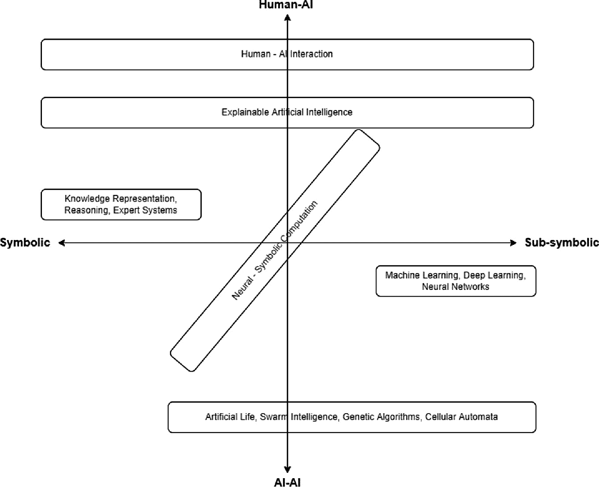
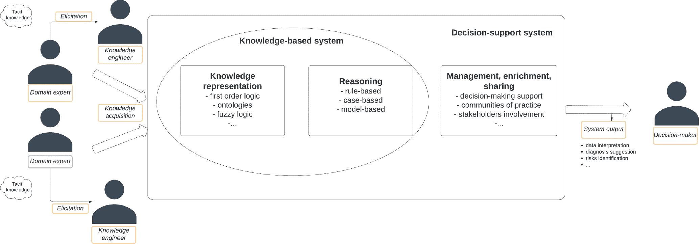

# 第二章：AI，整体视角

Luca Marconi^(1  )(1)意大利国家研究委员会认知科学与技术研究所，人工智能、大脑、心灵和社会高级学校，罗马，圣马丁诺德拉巴塔利亚 44 号 Luca MarconiEmail: luca.marc@hotmail.it

## 摘要

如今，人工智能（AI）算法正在被设计、开发和集成到各种不同和异构的应用领域的软件或系统中。AI 明显而逐渐地成为横向和强大的技术范式，这是因为它不仅能够处理大数据和信息，而且尤其是因为它产生、管理和利用知识。研究人员和科学家开始从多个角度探索 AI 将如何以不同而协同的方式转变异构商业模式和所有行业的每个领域。

关键词知识表示推理人工智能机器学习认知科学 Luca Marconi

目前在米兰比科卡大学攻读计算机科学博士学位，研究领域包括人工智能和决策系统，同时也是米兰一家人工智能公司的商业战略师和 AI 研究员。他还在米兰一家知名媒体情报和金融传播私人顾问公司担任研究顾问和顾问。他拥有米兰理工大学的管理工程硕士和学士学位，以及巴利阿里群岛大学交叉学科物理与复杂系统研究所（IFISC UIB-CSIC）的复杂系统物理学硕士学位。他还拥有意大利国家研究委员会认知科学与技术研究所（ISTC-CNR）组织的人工智能、大脑、心灵和社会高级学校的研究生研究证书，在那里他与 ISTC-CNR 的基于代理的社会仿真实验室合作开展了计算社会科学领域的研究项目。他的研究兴趣包括人工智能、认知科学、社会系统动力学、复杂系统和管理科学。

总的来说，AI 有潜力提供比人类专家更高质量、更高效率和更好的结果。这种 AI 的显著和强大潜力正在潜在的每一个应用领域、组织背景或业务领域中显现出来。因此，AI 对我们的日常生活和工作生活的影响不断增加：智能系统正在通过物联网这一强大的技术范式进行建模和互连，自主驾驶汽车正在在异质驾驶条件下进行生产和测试，智能机器人正在为各种挑战和领域进行设计。

实际上，根据世界经济论坛的创始人兼执行主席**克劳斯·施瓦布**（Klaus Schwab）的说法，人工智能（AI）确实正在为所谓的第四次工业革命做出贡献。他明确表示，AI 是技术场景中的一次重大突破，能够推动我们生活和互动方式的深刻转变。值得一提的是，安德鲁·吴（Andrew Ng）是百度前首席科学家，也是 Coursera 的联合创始人，他在 2017 年的 AI 前沿大会上表示，AI 实际上就是新的电力：一种具有颠覆性和普遍性的横向技术，能够支持甚至赋能潜在的任何领域或领域的技术和流程。因此，AI 能够刺激和重塑人类社会的当前和未来演变，当谈到描绘这一决定性技术范式的不断演变的情景时，对 AI 方法和技术的理解显然至关重要。

在本章中，我们将通过呈现整体情景和主要宏观挑战、方法和对未来 AI 和社会可能发生的步骤进行探讨，探索当前的技术和方法情景。具体而言，我们旨在为读者提供一般的概念工具，以同时处理主要的符号和子符号 AI 方法。最后，我们将专注于人机交互视角，通过回顾人类和 AI 在异质环境中实际上以何种程度互动甚至合作，以描绘朝向混合和集体的社会-AI 系统智能的当前阶段。

## 2.1 AI 简介

如今，人工智能（AI）正在整个社会中变得至关重要：它绝对是 21 世纪的主要方法论、技术和算法主角之一。人工智能方法和工具的泛滥显然已经为每个人所见：新的算法不断地被设计、利用并集成到各种不同和异构的应用领域的软件或系统中。从业者们意识到人工智能不仅仅是一个技术领域或方法论。事实上，人工智能正逐渐成为一个横跨的、强大的技术范式：它的力量来自于它促进了社会的广泛转型能力，这是因为它不仅能够处理大数据和信息，而且因为它能够产生、管理和利用知识。研究人员正在从多个角度开始探索，人工智能已经从不同的深度和协同的方式刺激了异构商业模式和行业领域的演变（Haefner et al. 2021；Brynjolfsson and Mcafee 2017；Krogh 2018）。

根据 DARPA（Launchbury 2017），对人工智能的一般视角应考虑一组最小的宏观能力，以表示其收集、处理和管理信息的方式：*感知*、*学习*、*抽象*和*推理*。这些认知能力在整个人工智能方法的领域中并不均匀分布。事实上，目前仍然没有任何单一正式和广泛接受的人工智能定义。尽管目前正在努力寻找统一的定义，但人工智能方法、模型和算法的潜力，以及它们的多重功能、特征和潜在影响，已经影响着人类社会。总的来说，人工智能有潜力在广泛的任务和条件下，与人类专家相比，提供更高质量、更高效率甚至更好的结果（Agrawal et al. 2018）。人工智能的这种重大而强大的影响正在潜在的每一个应用领域、组织背景或业务领域中显现出来。因此，学术研究和经验表明，人工智能对我们的日常生活和工作生活的影响不断增加：智能系统正在通过物联网的方式进行建模和互联，将智能设备连接到强大的生态系统中，自动驾驶车辆正在在各种异构的驾驶条件下进行生产和测试，智能机器人正在被设计用于各种挑战和领域。

从更广泛的视角来看，根据世界经济论坛的创始人兼执行主席克劳斯·施瓦布（2017）的说法，人工智能是所谓的*第四次工业革命*的主要推动者之一。他明确表示，人工智能是技术场景中的一项基本突破，能够促进我们生活和互动方式的深刻转变。其分析表明，人工智能是这场革命的驱动力之一，物理、数字和生物领域之间存在着多重、协同和复杂的相互作用。足以提及的是，安德鲁·吴，百度前首席科学家兼 Coursera 联合创始人，在 2017 年的 AI Frontiers 大会上发表的主题演讲中表示，人工智能真的是新的电力：一种具有颠覆性和普遍性的横跨技术，能够在潜在的任何领域或领域支持甚至赋予技术和流程。因此，人工智能不仅仅是一种有限但强大影响的简单工具：相反，它在人类和非人类生态系统中的行动和相互作用直接导致了它们的新状态、条件和新兴行为，在一个复杂的社会技术总体视角下。因此，当涉及描绘这一决定性技术范式的演变场景时，理解人工智能方法和技术绝对至关重要。

在本章中，我们将通过呈现整体图景和主要的宏观挑战、方法和未来人工智能与社会可能发生的步骤来探索人工智能的当前技术和方法论情景。在文献中，有各种各样的分类和分类方法来对人工智能方法进行分类。本章并不打算涵盖所有问题和方法，也不打算提供全球、整合和全面的审查，包括整个最新技术状态的整个情景。然而，它旨在提供关于人工智能的两个广泛维度——*认知*和*交互*的主要宏观方法和范式的一般概述。具体来说，我们旨在为读者提供通用的概念工具，以接近主要的符号和次符号人工智能方法。最后，我们将关注于人工智能与人类互动的视角，通过审查人类和人工智能在异质环境中实际互动甚至合作的程度，以描绘当前朝着混合和集体的社会-人工智能系统智能的阶段。

## 2.2 历史视角

尽管人工智能在当前技术场景中扮演着基本的角色，但人工智能系统的设计、开发和评估的初期阶段实际上在历史上并不是新鲜事物。该学科的正式诞生可以追溯到 1956 年，当时 Marvin Minsky 和 John McCarthy 在新罕布什尔州达特茅斯学院举办了达特茅斯人工智能暑期研究项目（DSRPAI）。达特茅斯会议涉及了一些主要的和最重要的历史上的人工智能“奠基人”，包括 Allen Newell、Herbert Simon、Nathaniel Rochester 和 Claude Shannon。达特茅斯活动的主要目的是创建一个完全新的研究领域，重点研究设计和构建智能机器的挑战。随后的提案（McCarthy 等人 2006）为在计算机中对智能进行分析研究奠定了基础，并确定了应用相关方法学的第一个基本概念，例如信息理论，用于研究人工智能。

尽管学科发展的后续阶段并不像创始人们所想象的那样容易。尽管进一步创造了第一批算法和计算机程序，但明斯基乐观地声称人工智能很快就能够模拟和仿效人类智能的说法并未得到证实，尽管那段充满狂热活动的时期进行了不懈的努力。那些年的一些成果包括 ELIZA（Weizenbaum 1966），这是一种自然语言处理工具，某种程度上预示了现代聊天机器人的出现，以及通用问题解决器（Newell 等人 1959），这是一个基于逻辑的程序，旨在创建一个通用问题解决器，但实际上只能解决特定类别的有限问题。在那个时期采用的基本方法主要依赖于逻辑和显式知识表示，完全采用*符号*视角，旨在通过演绎和线性的*if–then*逻辑路径处理经验和心理数据。总体而言，人工智能的最初阶段的野心是迅速而有力地催生所谓的*强人工智能*，或*人工通用智能*，即完全能够模仿甚至取代人类自然智能的人工智能系统。然而，选择纯逻辑方法的应用导致了固有的有限方法，利用 DARPA 特别称为*手工制作的知识*（Launchbury 2017）仅为狭义选择和预定义的一组有限问题提供了推理能力。这些系统没有任何学习或抽象能力，因此未能满足学科的创始人们的雄心勃勃的期望。

结果，学者和政府开始质疑初期对人工智能的乐观浪潮和概念上的蓬勃发展。在 70 年代，美国国会和英国议会严厉批评了之前用于研究和设计人工智能系统的经费。在同一时期，英国数学家詹姆斯·莱特希尔（James Lighthill）发表了所谓的*Lighthill 报告*（James 等人 1973），由英国科学研究理事会委托，在大学和学者之间经过长时间的讨论后：这份报告最终开始了人工智能的艰难时期，之前人工智能研究人员给出的乐观前景被抛弃了。 Lighthill 报告收集了失望的主要原因，包括人工智能系统在解决泛化设置中的真实世界问题方面的能力有限，尽管在模拟有限心理过程时取得了令人鼓舞的结果。结果，人工智能领域的研究部分被放弃，多个支持基金被终止。

然而，1986 年连接主义（McLeod 等人 1998）的出现标志着人工智能重新兴起的一个时期，从一个不同的，有些相反的角度。除了取代人类智能的任何野心外，连接主义方法和哲学的目标是研究作为来自相互连接的神经单元的工作行为和相互作用的新兴过程的心理模型及其相关认知和行为现象。这种向大脑机制的概念转变在某种程度上预示了进一步的神经科学介入人工智能，以及人工智能与*复杂系统理论*（San Miguel 等人 2012）之间的协同作用和关系，其中大脑和神经系统实际上是突出的示例和案例研究。连接主义的兴起开始了*人工神经网络*的研究和设计的基础时期，试图模拟大脑上的认知机制，同时基本上假设知识主要来源于神经系统与外部环境的相互作用。尽管机器学习的基础可以追溯到上世纪 40 年代唐纳德·赫布（Donald Hebb）的工作，以及所谓的*赫布学习*理论（Wang 和 Raj 2017），但其创立和初期发展的最重要支柱是由马文·明斯基（Marvin Minksy）、詹姆斯·麦克莱兰（James McClelland）、大卫·鲁梅尔哈特（David Rumelhart）和弗兰克·罗森布拉特（Frank Rosenblatt）等研究人员刺激的，他们构想了*感知机*（Rosenblatt 1958），即第一个神经网络模型，从而提出了进一步研究*反向传播*训练和*前馈*神经网络的基本方法。

同时，历史的进程导致了人工智能演化的其他重要步骤：首先是广泛范围的人工生命方法的奠基，它通过模型如*群集*、*细胞自动机*（Langton 1986）和*自组织*，扩大了使算法类似生物和行为学现象的野心。将模拟和计算机模型应用于自组织相互作用的代理和系统的研究是向当前意识到需要利用人工智能和复杂系统之间众多潜力的步骤之一，在当前和未来广泛的社会系统和人工智能视角中。此外，神经科学方法的涉入，以及*发育*和*表观遗传机器人学*的兴起（Lastname 等人 2001）增加了对通过神经科学、发育心理学和工程科学的整合来理解生物系统的重要贡献。

尽管如此，直到 21 世纪初，人工智能才开始发挥其全部潜力，这要归功于计算资源和计算机性能的同步指数增长，以及在各个领域提供大量和异构数据的可用性。不断增长的智能系统算法的巨大潜力目前正在经历辉煌时期，人工智能方法和技术的发展正在促成整个社会不可避免的影响和即将出现的现象。

## 2.3 人工智能对社会的影响

总的来说，人工智能对社会的影响深远而本质上多面。尽管与整体人类智慧相比，其“智力”仍然有限，但人工智能的主要力量源于其能够应用于潜在的每一个应用领域。人工智能代表了与其他技术相比的真正飞跃，由于其普遍、颠覆性和技术赋能结构：它被描述为一种*使能技术*（Lee 等人 2019；Lyu 2020），通过其生产、管理和丰富知识的能力来赋能其他技术。这些结构支柱使人工智能成为不仅仅是一个局限的和单纯的技术工件的“大”和“更多”的东西。人工智能被认为是技术和方法论的范式，用于技术自身和组织的演变。因此，考虑到其广泛的应用范围，影响我们世界的许多情况和背景，以及人工智能与人类之间不断增长的互动，值得强调的是，人工智能对社会的影响并不边缘，而是有可能在*社会技术*和*社会-人工智能*系统视角下彻底改变社会的潜力。

这一过程仍在进行中，引发了重大且不可避免的伦理问题。尽管人工智能具有强大的性质，但人类无法摆脱这样一个明确的决定，即他们是否打算将其视为一种工具——或者说，一种令人印象深刻的方法论和技术范式——即作为达到目的的手段，或者在某种程度上将其视为终极目标。从另一个相关的视角来看，伦理挑战始终根植于人类关于他们如何设计人工智能以及他们打算如何利用人工智能的潜力、能力和结构应用的选择。这一选择明确反映了人类的自由意志：因此，这无疑是一个只有人类智慧和本性才能通过的基本十字路口。然而，对人工智能在社会中的许多和重要的伦理含义进行审查并不是本章的重点。

毫无疑问，人工智能对我们社会的影响不断增长和发展：只需考虑到，根据国际数据公司（IDC）的数据，全球对人工智能的投资和市场预计将在 2023 年突破 5000 亿美元（IDC 2022）。此外，统计门户网站 Statista 预测，全球人工智能市场规模将在 2024 年达到 5000 亿美元以上（Statista 2022）。因此，就业市场的演变需要工人和利益相关者将他们的技能和元素能力适应一个迅速转变的场景。根据世界经济论坛的数据，超过 60%的今天开始上学的孩子将在尚不存在的工作中工作（世界经济论坛 2017）。此外，牛津马丁经济学院报告称，在未来 20 年内，美国所有工作职能中最多可自动化 47%，这将导致一个与我们所知和所处的世界非常不同的世界（Frey 和 Osborne 2017）。值得特别注意的是，Gartner 将人工智能视为 2022 年度 Gartner 十大战略技术趋势中两个互补基础趋势之一（Gartner 2021）：*人工智能工程* 和 *决策智能*。人工智能工程专注于通过 AI、机器人流程自动化（RPA）、业务流程管理（BPM）等协同技术和方法论方法的完整识别和运作，来检测和自动化业务和 IT 流程。相反，决策智能是一种系统化的方法，通过强大和广泛的人工智能和人工智能的使用，来对高度复杂的情况和业务条件进行建模和有效管理，通过 *连接*、*上下文* 和 *连续* 的决策过程来提高组织决策的效率。

因此，人工智能对潜在的任何业务领域的影响对于组织的发展和数字转型越来越关键。人工智能正在影响技术和组织的视角和流程，从而重塑组织并重新定义技术、管理和业务之间的互动。此外，人工智能方法和算法的持续增长几乎每天都会提供比人类领域专家在异质领域和条件下更高质量、更高效率和更好结果的潜力。在组织和业务框架中，这意味着人工智能倾向于在决策者和技术人员的范围之外提供帮助，因此不仅仅是一种工具，而是一种决策辅助，也可用于管理任务。例如，基于人工智能的解决方案在联合利华的人才招聘流程（Marr 2019）中发挥着重要作用，在 Netflix 关于电影情节、导演和演员的决策过程（Westcott Grant 2018）中发挥着重要作用，以及在辉瑞公司的药物发现和科学发展活动（Fleming 2018）中发挥着重要作用。

如今，计算能力和资源的最新进展、数据可用性的指数增长以及新的机器学习技术正促成这种影响。尽管人工智能有着相对悠久的历史，但正是今天，我们才有了这些技术因素的同时存在，使得人工智能在社会中的应用快速发展成为可能。我们在 21 世纪初期面临的指数增长现象——即计算能力和数据可用性的指数增长以及信息学在方法、算法和基础设施方面的进步——构建了一个科学和技术发现、市场机遇和社会影响的协同系统。这种良性循环已被国家和国际机构认真识别，导致对涉及公司、初创企业、研究中心和大学的技术转让项目的支持日益增加。对于促进国家创新的有价值的技术转让项目的关注已被许多机构任务组、工作组以及特别是最近的人工智能国家战略文件的出版所确认，比如意大利的情况。

然而，让我们退一步，有效地理解为什么以及如何人工智能对当前社会产生如此巨大的影响。要深入理解人工智能在产生、管理和利用知识方面的作用，有必要开始思考智能和认知能力是什么。我们不能回避从不同互补视角考察的概念进展：从数据到知识，从能力到智能，进而从社会到社会人工智能系统。

## 2.4 认知科学框架

为了提供对当前人工智能场景的概念化组织概述，基于更广泛的认知科学视角和学科是至关重要的。实际上，设计、实现和评估能够强大地封装和利用认知能力的有效人工智能系统，使我们开始质疑*智能*的确切本质。认知科学试图通过其概念框架和对心理特征和活动的分类来回答这样的问题。本节的目的绝对不是提供对这一学科大景观的全面和完整的审查。相反，我们报告了一组有限的基本概念，这些概念后来被证明对理解和欣赏主要报告的人工智能系统和方法的宏观类别的进一步描述是有用的。

首先，我们必须考虑一个三重概念框架，这已经在上一节的末尾预见到：从数据到知识，从能力到智能，进一步则是从社会到社会人工智能系统。尽管这个概念架构的第一个支柱与知识表示机制的对象相关，但第二个支柱则允许考察非常不同的认知能力和智能的结构。最后，第三个支柱将考虑的视角扩大到人类和人工认知系统之间的相互作用，预见到了认知科学视角下的人机交互的基本主题。

在*认知主义*方法中，大脑及其内部工作机制可以被认为是一个认知系统，通过事先定义的内部组织和结构来收集、管理和加工信息（Garnham 2019）。这种结构在某种程度上类似于计算机，利用一组内部认知特征和能力，以及其传输通道上固有的有限*信息处理*能力。因此，在这一视角下，心理机制在理论上类似于软件的机制，或者更好地说是一种完整但有限的电子大脑，从外部输入源收集和加工数据和信息，并通过某种*知识表示*方法输出信息和知识。此外，通过一系列迭代反馈， elicited 知识的逐步改进和演化可以受益于更好地利用收集到的数据及其被大脑机制加工。相反，认知科学和心理学的进一步发展导致了两种互补的视角：一方面，通过*模块化*（Fodor 1985）和*连接主义*（Butler 1993）的范式，深化了心智与计算机之间的类比；另一方面，在更*建构主义*的视角下（Amineh 和 Asl 2015），*经验*和*社会互动*的作用变得更加重要。

此外，智力本身的性质也没有被广泛或正式地接受的固定定义方式。类似于 AI 的情况，在科学界缺乏一个独特的官方定义，智力的整体结构也没有被一个局限和全面的概念完全捕捉到，涵盖了所有可能的认知特征和特性。在学者们研究的可能的二分法中，有所谓的*流体*和*结晶*智力（Ziegler et al. 2012），分别研究认知代理人如何对新情况进行推理并利用先前引发的知识，逻辑和*创造*智力的区别，直到*情感智力*（Salovey 和 Mayer 1990）的概念，影响甚至更广泛的心理和社会情况和条件。即使在临床实践中，目前广泛接受的是，用于诊断过程的当前*心理测量智商测试*，本质上是有限的：事实上，它们通常受到一系列限制的限制，与设计和利用完全*无文化*测试的困难有关（Gunderson 和 Siegel 2001），以及它们固有的能力仅检验有限的认知能力集合。值得注意的是，*多重智能*理论（Fasko 2001）试图考虑一个更广泛的框架，涉及几种宏观能力，从*语言-语言*到*逻辑-数学*和*视觉-空间*，甚至到*身体动作*和*音乐-和谐*智力。

对于我们的范围，值得强调两个主要方面：

1.  1.

    目前，将注意力集中在便于研究以增强人工智能系统的特定认知能力上也是功能上有用的。 DARPA 分类（Launchbury 2017）证明了通过将它们归纳到四种宏观能力中来有效地涵盖可能的广泛认知特征的广泛范围，以表示认知系统收集、处理和管理信息的方式：*感知*、*学习*、*抽象化*和*推理*。

1.  2.

    在呈现人工智能系统及其与人类认知能力和社会的关系时，考虑到两个主要维度也是功能上方便的：*认知*，如前所述，以及*交互*，旨在扩展社会 -AI 视角，面向人工和人类代理。

因此，在接下来的章节中，我们将按照之前提供的指南，提供人工智能方法的主要宏观类别。我们报告的概述并不旨在涵盖不断发展的人工智能场景中所有可能的方法和算法：相反，我们的目标是展示从认知和社会交互角度看人工智能方法的宏观类别的概述。总的来说，我们将为读者提供一般的概念工具来了解人工智能领域，以及欣赏人类和人工智能在异质性背景和情境中实际上相互交互甚至合作的程度，从而勾勒出通向混合和集体社会 - 人工智能系统智能的当前阶段。

现在让我们放大一个我们必须考虑以有效分类当前人工智能方法及其不同潜力的重要二分：符号和子符号人工智能。通过关注这两个宏观类别，我们将承认此分类的相关性，以某种方式概括所展示的认知特征，以及帮助读者欣赏所报告方法的互补认知潜力。

## 2.5 符号和子符号人工智能

符号和子符号人工智能之间的二分已经源自于*认知主义*（Garnham 2019）和*连接主义*（Butler 1993）之间的二分：这样的范式实际上涉及两种相反的智能观念。一方面，认知主义将思维视为计算机，遵循逻辑和正式预定义的规则和机制，以及操纵符号，封装来自外部环境的异质数据和信息，并通过反馈和输出结果的迭代过程进行。另一方面，连接主义考虑了智能的生物性质，描绘了一个基于单个单元—*神经元*—的并行参与的认知系统，通过神经元之间的相互作用处理所感知的信息。虽然认知主义通过人类思维和纯粹逻辑和正式化方式工作的人工信息处理系统之间的完全类比获得了其观点，但连接主义基于这样一个思想：认知潜力直接来自于相互连接的神经元之间的大规模互动，智能是从收集到的信息和数据的分布式加工中产生的。

作为前进的一步，符号和子符号 AI 的区别变得清晰起来。前者处理*符号*和知识表示和管理的逻辑手段，而后者使用*数字*，非逻辑和非形式化的现实表示。符号 AI 允许通过谓词组成的*逻辑规则*来操作符号，这些谓词通过*逻辑运算符*连接起来。通过这种方式，系统中允许的所有知识都可以通过所利用的形式边界和操作进行精确形式化和约束。相反，子符号 AI 允许通过数学运算符来处理它所处理的信息元素和因素，这些运算符能够管理来自环境的数字和数据，并通过连接的神经元促进进一步的学习过程。总的来说，符号 AI 在*高级别*视角下运作，例如所涉及的元素可以是对象和它们之间的关系。相反，子符号 AI 在*低级别*运作，例如所涉及的元素可以是图像像素、位置距离、机器人关节扭矩、声波等。

在符号 AI 范式中，我们可以将不同的问题表示为*知识图谱*（张等人 2021; 季等人 2021），其中*节点*通过逻辑符号表示特定对象，而*边*则编码了操作这些对象的逻辑操作。一切都以*状态空间*表示，即允许配置特定问题或情况的一组有限可能状态。结构本质上是*分层*和*序列*的：从*根节点*开始，表示初始情况，不同的节点通过几个*层*连接起来，根据所考虑的允许情况和条件。当状态中的所有同意行动都已执行时，最终节点是一个*叶节点*，编码了导致它的所有行动和过程的结果。显然，可以有不同的过程得到特定的结果并达到所期望的状态。因此，可以沿着图中的各种*路径*进行导航，涉及异构节点和边缘，从给定的根到所需的叶子。因此，符号 AI 可以与 DARPA（Launchbury 2017）所说的*第一波 AI*联系起来，处理*手工制作的知识*，利用推理能力解决狭窄范围的问题，没有任何学习或抽象能力，且在处理信息不确定性和复杂性方面能力较弱。

在亚符号范式下的人工智能中，相反地，所收集的信息是通过*人工神经网络*（Shanmuganathan 2016）管理的，由相互连接的*神经元*组成，能够通过“嵌入式”函数管理数据和信息。神经元根据特定的阈值激活，涉及一些参数，然后操作管理的信息元素，生成的输出信息可以作为系统学习过程和进一步分析的基础。因此，整个亚符号人工智能系统通过*并行分布处理*机制工作，在这种机制中，信息由参与的不同神经元并行处理。因此，在完全连接主义和*新兴主义*视角下，亚符号人工智能范式允许将心理或行为现象建模为直接从局部单元的互连中产生的新兴过程，这些过程在特定网络中链接。这些工作机制涉及*统计学习*，其中模型是在大型和异构数据集上进行训练的，就像与特定领域相关的*大数据*案例一样。这样的*人工智能的第二波*—正如 DARPA 所称的那样（Launchbury 2017）—具有感知和学习能力，但它的推理能力很差，完全缺乏抽象能力。

在后续章节中，我们将通过考虑认知和交互的两个主要维度，呈现不同的方法。关于认知，集中在符号和亚符号人工智能方法之间的这种二分法是有用的（但肯定不是全面的），以便对人工智能的整体情况有一个大致的了解。在这个选择的框架中，所呈现的人工智能方法和范式的一般概念图在以下图中得到了视觉呈现。认知大致分为符号和亚符号方法，涵盖了不同的认知特征和能力。相反，交互在人类-人工智能和人工智能-人工智能交互之间进行功能分类。在我们的方法中，我们并不打算声称自己的方法是详尽的或是独家的，我们只是想为读者提供一个视觉草图，以更好地理解后续章节和随后呈现的方法（图 2.1）。

人工智能方法的四个象限绘制了人工智能方法与人类人工智能、人工智能与符号到亚符号的对比。人类人工智能具有人类人工智能交互和可解释的人工智能。亚符号具有机器学习、深度学习和神经网络。人工智能连字符人工智能包括人工生命、群体智能、遗传算法和细胞自动机。符号具有知识表示、推理和专家系统。

图 2.1

人工智能方法和范式的概念图

尽管我们将在本章后续部分详细考察所有这些宏观方法和方法，但已经有用的是将这些方法如何定位于认知和交互的两个主要维度的概念框架中进行上下文化。关于认知，我们在符号和亚符号之间功能性地对所呈现的 AI 方法进行分类：因此，可以相对直接地相应地定位方法。相反，交互的维度功能性地考虑了人工智能与人类的交互以及人工智能与人工智能之间的交互，假设了一个扩展的社会人工智能视角。考虑到这些参考，因此可以得出这样的结论，即轴的原点代表完全没有与人类或人工智能代理的交互存在的情况。因此，根据在概念地图中的交互的分类和“程度”，定位方法。我们提醒这只是报告的 AI 方法的粗略视觉表示，以帮助读者更好地欣赏和理解 AI 景观的概述，根据提供的分类方法。

## 2.6 知识表示与推理

让我们继续我们对当前人工智能场景的概述，通过介绍与知识表示领域相关的主要和关键的符号方法和方法。虽然这些方法在人工智能历史的最初阶段曾经备受炒作，但毫无疑问，它们今天仍然是相关的，并且在多个应用领域可以找到许多应用。表示知识基本上意味着通过预定义的语言、模型或方法形式化它。因此，*知识表示*（《知识表示手册》2008）的目的是研究、分析和应用所有广泛的框架、语言、工具来表示知识，以及对其进行不同形式的*推理*。符号视角绝对是基础的，因为在不同系统中使用*符号*来表示异构知识库是至关重要的。从这个角度来看，*智能体*被赋予了一组圈定的符号来表示外部世界（知识表示），并且能够根据*规则*和*原则*对其进行具体的*推断*。因此，*基于知识的系统*（KBS）（Akerkar 和 Sajja 2009; Abdullah 等 2006）的主要能力是通过一种符号化的*建模语言*逻辑地和符号地表示世界的固有有限部分，以及再次通过一种逻辑和形式化的方法推理，以发现所表示的世界的进一步特征、特性或属性。在 DARPA 对人工智能方法的有用分类中，这恰好对应于*第一波人工智能*：利用*手工制作的知识*的系统，甚至能够推断出特定表示世界中外部环境或代理的重要隐藏方面、特征或行为，尽管它们缺乏像*学习*或*抽象*这样的基本认知能力。

为了有效地表示知识，许多方法论和工具已被研究人员、学者和实践者广泛利用。特别值得一提的是*逻辑*的运用，尤其是*一阶逻辑*（FOL），作为一种强大的方法论和形式化方法，被广泛应用于许多应用领域和领域中。FOL 基本上能够利用广泛的*命题*、*运算符*和*量词*，以有效地形式化预定义和指定领域的*知识库*。此外，如今*模糊逻辑*的作用至关重要，以使 AI 系统能够在信息复杂性和不确定性极高的条件下表示知识并进行推理。除了逻辑之外，还重要提及*本体论*和*知识图谱*的作用，以在限定领域内捕捉明确且自然界定的知识。事实上，*显性知识*和*隐性知识*之间的差异对于理解知识表示和 KBS 的主要挑战和原因至关重要。前者已经在符号框架中表达，因此易于通过某种语言或系统进行交流，而后者是*隐含*的，通过个体在经验、教育、传统、社会互动、直觉和其他复杂的动态知识生成过程中经验性地获取。因此，本体论和知识图谱作为表达概念要素、对象及其关系的手段，传统上有效地局限于表示显性知识，而最近提出的几种方法和算法则应对在组织和工业领域中形式化隐性知识的挑战。

无论如何，第一个也许是最主要的挑战出现在符号形式化阶段之前：事实上，*引发知识* 的过程至关重要且极其微妙，特别是在高度复杂的领域或组织环境中。虽然知识基本系统明显缺乏将其推理能力抽象化或延伸到未形式化的变量、规则或行为的能力，但*知识工程* 的角色主要是致力于改进*知识管理系统* 和工具的质量和数量。在复杂的组织中，这意味着增强甚至彻底改革整个组织的*信息系统* 或其当前的功能。此外，这还意味着让所有相关的利益相关者或决策者意识到他们在*知识共享*、知识管理和*知识丰富化* 过程中的潜在角色。这种基于知识的对运营流程和人类决策的改进可以通过 AI 工具得到有效的帮助，这些工具已经在各种领域进行了研究和应用，包括异构操作系统、制药和临床领域以及教育。

在知识表示和推理领域，最可能被熟知和利用的人工智能方法与*专家系统* 领域相关。从最早的人工智能浪潮开始，一直到现在，这些系统已被广泛设计、开发和应用于各种应用环境中。专家系统的能力明确是专注于一个狭窄但精确表示的领域，并推断与该领域相关的问题的解决方案。许多应用包括临床和医学应用、工业环境以及销售和营销的产品配置器。基本上，专家系统适用于替代特定过程、选择或行动的人类*领域专家*。通过这种方式，它们帮助决策者和经理提高他们在异构业务、组织或工业过程中的决策和行动的效力和有效性：在解释来自传感器的数据和信息、向临床医生建议潜在的诊断、识别潜在的风险和检测行为以及通过改进规划和编程过程帮助经理实现业务目标的问题解决方面，它们的帮助是显著的。因此，专家系统通常是*决策支持系统* 的基础或组成部分：这些系统通过包括几个模块和组件来捕获、组织和管理数据和信息，从而增强公司中的经典信息系统，以支持商业背景下的战略决策过程。

KBS 通常根据两种互补的分类而分类：一方面，考虑*潜在应用*，另一方面考虑*问题解决方法*：换句话说，知识表示和推理方法。就应用而言，KBS 可以分为*知识捕获和存储*系统、*知识部署和共享*系统和*知识处理*系统。这种分类允许专门关注所考虑系统的具体能力，贯穿整个收集、管理和阐述数据和信息以获取有用知识的整个过程。根据问题解决方法，KBS 可以分为基于规则的、基于案例的和基于模型的系统。这样的分类直接源自推理方法的分类。实际上，KBS 所利用的内部推理机制可以基于逻辑规则，或者利用类比和案例进行推理，或者利用特定的基于模型的描述。下图旨在帮助读者欣赏与知识表示和推理方法及系统相关的不同阶段和概念（图 2.2）。

流程图说明了领域专家通过引发成为知识工程师。知识获取导致基于知识的系统和决策支持系统。基于知识的系统包括知识表示和推理。决策支持系统包括管理、丰富和共享。它导致系统输出和进一步的决策标记。

图 2.2

知识表示和推理过程的概念表示

这种符号和知识管理方法的使用在明确定义的领域或环境中代表和阐述知识时确实是有用的。当涉及到从广泛和复杂的数据集中学习时，问题就出现了，这些数据集通常在结构上是异构的或来自不同的来源。从过去的数据中学习并预测未来的行为、情况或状态的能力是 AI 的另一个主导范式的典型特征：连接主义，具体而言，是机器学习方法。

## 2.7 机器学习与深度学习

在当前 AI 方法、方法论和算法的情景中，主导范式的主要部分归功于机器学习。这仍然是真实的，但绝不能被视为理所当然，因为 AI 不断经历着快速、动态且有些不可预测的演进，这得益于技术、数据来源和可用性的进步，以及组织和整个社会的发展。尽管如此，机器学习模型在 AI 方法和算法的全球范围内尤其重要，因为它们能够分析大量数据、从中学习并预测新的、未知的行为，或者在不同的环境条件下对新实例进行分类。

从总体上看，机器学习（ML）是一门致力于设计、构建和评估基于 AI 的模型的学科，这些模型能够通过识别相关的*模式*和行为，从样本、训练、预定义的特定数据中学习，从而从中进行推断，并向人类决策者提供重要的自动分类、建议或预测。*数据挖掘*是一整套方法、算法和评估技术，用于从数据中提取价值和见解。ML 起源于*统计学习*、*计算学习*和*模式识别*的学科领域：在这个意义上，它本质上是基于使用统计方法来分析样本数据、执行相关的测试和实验，并得出与问题相关的推断。然后，这些 AI 方法的整个设计和编程过程旨在获得数据驱动的输出或预测，因此可以根据可用数据集的演变进行动态修改。数据中的实例通常围绕着特定的*特征*来表示，这些特征可以是*分类*或*数值*、二进制或连续的。ML 方法的应用广泛，从语音识别到计算机视觉，从战略和操作业务智能到欺诈检测，从天体物理学对星系的分析到金融应用。

总体而言，ML 方法可以分为三种*学习范式*，在文献和日常实践中被广泛利用：

1.  1.

    *监督学习*方法：这种方法提供了预定义的和已提供的输入和输出变量，如已分类或分析的实例样本，算法能够通过检测从输入到输出的映射函数来进行泛化。

1.  2.

    *无监督学习*方法：在这种情况下，提供的数据尚未标记，因此模型在训练过程中未提供样本的预先分析数据和结果。

1.  3.

    *强化学习*方法：这种方法通过提供具体的反馈来训练它们，智能系统或代理努力最大化某些累积奖励函数，以逐步优化其输出。

因此，虽然 ML 方法的工作机制在可能的算法范围内可能会有很大差异，但很明确的是，这些 AI 方法能够从数据中*生成知识*，这与基于知识的系统和知识表示方法完全不同：这是*知识发现*的过程，它帮助从业者、决策者和组织利益相关者从数据中获得重要、准确和有用的知识，目的是理解领域相关和环境现象或行为，以及提高决策过程的质量和效果。从一般的角度来看，ML 旨在通过从过去的经验中学习，为指定的学习问题产生更好的结果，以帮助人类处理需要在异质条件下进行有效和高效自动化分析的大量数据，如不确定性和复杂性的情况。

监督学习在文献和实践中被广泛传播和利用。基本上，它包括提供已经标记和分类的数据及相关实例，理解它们的输入和期望输出。因此，数据集被直接而自然地分成两部分，用于学习：*训练集*和*测试集*。前者用于通过标记的*训练样本*来训练模型，而后者随后需要允许模型对未见数据进行新的推断。在理想的一般过程中，模型的训练应该通过检查已标记的数据提供将输入数据和期望输出相连接的*映射函数*，而测试过程应该将其应用于新实例以获得预测或见解。SL 模型允许处理两种宏观类别的问题：*分类*和*回归*。

分类是将数据集分类为特定预定义类别的问题：如果只有两个类别，则问题简化为二元分类，可以进一步扩展为多类问题。在分类方法和算法中，有非概率方法，如*支持向量机*，但也有基本上是概率方法的方法，如*朴素贝叶斯*分类器，以及*神经网络*，*基于规则*和*基于逻辑*的方法，或者*决策树*。相反，回归是预测实值*目标响应*对*预测变量*的问题，因此是输入特征的加权和。主要目的是检测和建模回归目标对一些预定义考虑特征的依赖关系。虽然线性回归由于其线性特性和不同特征的线性效应的*透明性*而具有显著优势，但同时需要手工修改以处理非线性，并且所利用的权重的解释不一定直观。因此，类似*广义线性模型*和*广义加性模型*的扩展方法经常在文献和日常实践中被研究和利用。

无监督学习是机器学习模型的学习范式，不需要已经预先标记的数据或实例。在这种情况下，训练集和测试集同样存在，并且学习过程仍然基于算法在过去的经验和示例上的训练。模型被训练以自行发现与数据提取的信息相关的相关模式和以前未检测到的见解。这种学习范式主要用于处理*聚类*问题，创建共享相似特征的数据组，*降维*，找到数据变化的主要因素，以及*异常检测*，以识别一组实例中的不同示例。这里最流行和最知名的问题是聚类：通过某些特定特征对数据进行分组以将它们分离的问题在实践和应用中广泛传播。在 K-means 聚类方法中，目标是创建 K 个不同的组，每个组都有一个特定的质心，每个群集一个，并通过最小化平方误差函数对数据进行分组。相反，降维的问题通常通过主成分分析等方法解决，帮助将二维数据降维为一维数据，或者像自动编码器这样的神经网络，这对处理异常检测以及无监督学习范式的许多应用也很有用。

最后，*深度学习* 是 ML 方法的一部分，包括基于 *表示学习* 的所有模型，并处理多个 *表示层* 来学习复杂情况下的数据，在这种情况下，涉及多个抽象级别和复杂性。在这种情况下，传统的、浅层的机器学习模型在能力和容量上本质上是有限的。因此，深度学习方法对于隐式提取特征是有用的，通过网络或算法结构中的一组 *隐藏* 层传递数据，对数据进行传递、处理和转换。*深度神经网络* 确实是具有许多输入和输出层的扩展型神经网络，数据在学习过程中在 *前馈* 网络中传输和管理，而无需循环。在最广泛和最经常被利用的方法中，有 *卷积神经网络* 、 *循环神经网络* 和 *深度置信网络*。尽管深度学习方法在分析大数据和在复杂和不确定条件下进行推理方面具有强大的能力，但 ML 和深度学习方法仍然受到多种不同问题的限制，例如 *透明度* 、 *鲁棒性* 、 *可信度* 和 *可靠性* 问题。因此，在对符号和次符号 AI 方法进行了一般性概述之后，现在是时候进一步探讨神经符号方法的承诺和挑战了。

## 2.8 神经符号计算

*神经符号计算* 的目标是有效地整合和利用符号、逻辑和形式化计算方法以及连接主义、次符号和神经方法来增强系统能力、认知能力和输出准确性。这些方法努力解决第一和第二波人工智能出现的问题，回顾 DARPA 的分类。总的来说，它们试图满足将 *知识表示* 和 *推理* 机制与基于深度学习的方法相结合的需要。目标是为研究人员和实践者提供更准确和 *可解释* 的系统，以提高系统的 *预测能力* 、 *可解释性* 、 *可追溯性* ，从而促进人类对 AI 决策助手的 *信任*。虽然我们将在接下来的章节中重点讨论 *可解释性* 问题，但在这里我们只是简要概述了这些方法的主要支柱。

神经符号计算的目标是将我们已经考察过的两种互补认知能力融合在一起，分别是符号和次符号方法：*学习*，从外部环境或过去的经验中学习，以及从学习过程的结果中进行*推理*。神经符号计算试图充分利用现代先进神经网络中学习的优势和符号表示中的推理，从而产生*可解释*的模型。因此，神经符号计算背后的主要思想是在一个综合的通用框架下协调 AI 的符号和连接主义范式。从这个角度来看，知识通过符号形式机制来表示，例如*一阶逻辑*或*命题逻辑*，而学习和推理则通过适应的神经网络来计算。因此，神经符号计算框架允许有效地将神经网络中的强大和动态学习与推理相结合。这不仅提高了 AI 系统的计算能力和效率，增强了算法的*鲁棒性*和输出结果的准确性，而且还通过符号知识提取和通过形式理论和逻辑系统进行推理提供了可解释性。

从一般的角度来看，神经符号人工智能系统能够处理比之前介绍的方法更广泛的认知能力范围，通过利用连接主义和符号主义方法之间的能力的协同作用。更进一步，这些系统的主要特征与知识提取和表示、推理、学习以及它们在不同领域中的应用和效果相关。在神经符号计算不断发展的情景中，*基于知识的人工神经网络*（KBANN）和*连接主义归纳学习和逻辑编程*（CIL²P）系统是一些最常见的模型。KBANN 是一个从神经网络中插入、细化和提取规则的系统。KBANN 的设计和开发结果表明，神经符号方法可以通过整合*背景知识*和从示例中学习来有效地改善学习系统的输出。KBANN 系统是第一个确定这一研究路径的系统，在生物信息学中有着重要的应用。KBANN 还作为设计和构建 CIL²P 的灵感之一。该方法将从示例中的归纳学习和背景知识与来自*逻辑编程*的演绎学习相结合。基本上，逻辑编程允许通过形式逻辑来表示程序。因此，CIL²P 允许通过一个命题一般逻辑程序来表示背景知识，通过例子进行训练来完善背景知识，随后的知识提取步骤通过网络进行，在一个逻辑程序中完成。

在神经符号计算中的主要挑战之一是解决所谓的*符号接地问题*（SGP）。本质上，这是赋予人工智能系统能力，自主和自动地创建*内部表示*，将其操作的符号与外部世界中的相应元素或*对象*相连接的问题。将符号接地到环境对象的方法是设计和开发神经符号人工智能系统的一个微妙而基础的步骤，通常通过将符号接地到*真实函数*或者一般来说，接地到某种*泛函*上，以编码现实世界元素的特性和特征来解决。解决 SGP 问题使得通过符号接地有效传播信息，最终使得神经符号网络的整个工作机制能够在系统内捕获和加工知识。神经符号方法解决和解决 SGP 的方式是*Deep Problog*和*逻辑张量网络*等方法之间的差异之一。

神经符号系统的应用涉及广泛的领域，例如数据科学、本体论中的学习、模拟器中的培训和评估，以及不同应用的认知学习和推理方法。这类系统最显著的优势之一与可解释性有关。与深度学习和*黑匣子*模型不同，这类系统是可解释的，因此允许人类决策者理解其提供的输出背后的*原因*。事实上，日益复杂的人工智能系统需要能够向用户解释其工作机制和决策的方法。因此，在当前情景和人工智能系统的演进中，了解*可解释人工智能*的基本作用和作用是必要且不可避免的。

## 2.9 可解释人工智能

可解释人工智能（XAI）的兴起和传播是当前和未来人工智能系统演进的关键一步。除了神经符号方法，这种方法还可以显着地归类为 DARPA 所定义的所谓的*第三波*人工智能。因此，XAI 努力实现*情境适应*的重大挑战，即逐渐解释方法的构建，以适应现实世界现象的类别。虽然 XAI 领域在文献和人工智能研究中并不新鲜，但如今其重要性不断增长，因为它能够满足对*可解释*、*透明*和*可问责*系统的需求。解释模型背后的主要原因是机器学习和深度学习模型的一般*不透明性*和缺乏*可解释性*：尽管人工智能以及机器学习和深度学习系统取得了强大的计算能力和高性能，但当试图理解某些结果的来源时，很难从它们的内部机制中获取洞见。

为了解决这个问题，XAI 旨在创建一套人工智能技术，能够使其自己的决策更加透明和可解释，从而打开黑匣子，与用户分享输出结果的方式。最终目标是创建完全可解释的模型和算法，同时保持高性能水平。这样一来，XAI 允许用户增强与人工智能系统的交互，通过理解某些输出或决策是如何产生的具体原因，从而增加对系统机制的*信任*。在各种应用领域，*可解释性*都是非常必要的，而且相关的规定开始出现，要求其成为人工智能系统的基本且不可避免的特征。

尽管对*解释*没有一个统一的、预定义的、广泛接受的正式定义，但文献中出现了一些关键概念。努力定义什么是解释的确切角色是用户或*观察者*的作用是至关重要的：从这个角度来看，解释的目标是让对象的相关*细节*清晰或易于被某个观察者理解。因此，解释能够向用户提供重要和必要的信息，使他们能够理解模型的工作方式或为什么做出特定决定或提供特定输出或建议。更进一步，值得强调的是，解释是人类决策者和智能助手之间的*接口*，使人类代理能够理解一些关键的相关*代理*，以获取系统输出的原因，以及系统内部的工作机制。这为解释的概念增添了新的维度，展示了解释应具有的新特征。它应该是一个准确的代理，即解释必须基于模型的机制和所使用的输入。从这个角度来看，生成解释的挑战需要确保它们具有准确的代理，这在最先进的模型中并不保证。这些代理与模型管理的*特征*密切相关：解释通常将实例的特征值与其模型预测相关联，以一种人类决策者、从业者或组织利益相关者能够轻松理解的方式。

文献中有几次尝试提供对 XAI 系统进行分类、归类和描述。可解释的建议可以是*模型内在*或*模型无关*：在前一种情况下，输出模型是内在可解释的，意味着决策机制完全透明，提供解释；而在后一种情况下，输出模型提供所谓的*事后解释*，而不对模型本身进行任何修改。这两种方法在概念上可以与认知心理学根源相关联：在这种观点下，模型内在模型在某种程度上类似于人类思维的理性决策，而模型无关模型则在某种程度上类似于直觉决策方式，随后进行一些解释的搜索。这种分类也反映在可解释的 AI 模型的分类中，可解释的机器学习技术通常可以分为两类：内在解释性和事后解释性，其中区别在于解释性何时获得并包含到模型中。内在解释性通过设计自我解释的模型直接包含解释性来获得。在这些方法中有*线性模型*、*决策树*、*基于规则*的系统等。相反，事后方法是通过定义另一个模型来为现有系统提供解释。

另一个重要的分类，来自*可解释推荐系统*的具体子领域，用于概念上对 XAI 世界中的两个主要相关维度进行分类：解释的*信息来源*或*显示样式*以及可解释模型的角度。前者是解释如何提供给用户的方式，例如*文本解释*、*视觉解释*等，而后者是为设计和开发考虑的可解释系统所利用的特定模型。因此，虽然显示样式代表着*人机交互*的角度，而模型本身则与 XAI 研究的机器学习维度相关。总的来说，当涉及解释时，用户与模型之间的交互作用的角色至关重要：XAI 的不断普及及其在各种应用领域的应用要求高质量的交互和智能助理与人类决策者之间信息和知识共享过程的有效性。因此，人―AI 交互这一有前景的学科的崛起和演变对 AI 历史的下一阶段至关重要。

## 2.10 人―AI 交互

当前 AI 的情景和发展，如本章节中简要而一般性地介绍的那样，如今已经引起了研究人员和从业者对 AI 系统与人类代理之间的作用和交互质量的关注。虽然 AI 可以被视为一种形式的自动化，但它绝对不是单纯的技术手段：相反，它更多地是一种使能力，使整个社会拥有连续、非线性和某种程度上不可预测的动态。从更广泛的视角来看，AI 正变成一个真正的代理，不仅仅是支持人类，而且是与人类互动并交换信息和知识。因此，有必要采用更广泛的视角，在这个视角下，人类和 AI 共同工作，以增强和加强决策过程以及这些行为者生活和行动的整个环境。这引发了一些相关且不可避免的伦理问题，因为可能会由于某种方式上“使人类与 AI 等同”而产生的潜在风险。尽管伦理问题是基本的，应该通过预先定义的和广泛接受的框架来明确面对和解决，但这并不是本章的目的。对我们的目标来说，理解人类和 AI 在先进和广泛分布的社会技术系统中共同工作、推理和行动是足够的：更好地说，是在 *社会 - AI 系统* 中，我们不能忽视或低估。此外，这些系统还将越来越多地激发各种 *新兴集体行为*，从复杂系统的角度来看。

在这种背景下，人工智能与人类的交互（HAII）是一门新兴且具有挑战性的学科，旨在研究、设计和评估基于人工智能的交互式系统，以及交互过程中人类与人工智能系统之间的潜在关系、问题和挑战。HAII 将从人机交互（HCI）中衍生的经典范式和框架应用于技术交互系统基于人工智能的情况。因此，与*用户* - *中心设计*、*可用性*和*用户体验*相关的概念被广泛保留和调整。用户的角色至关重要：在设计和改进人工智能系统建模时，人类应该参与其中。在 HAII 领域，有几种评估应用、交互和 AI 系统利用的后果的框架，涵盖了各种应用领域：其中一个最重要的框架是人工智能影响评估，它有助于在实际情况中映射 AI 应用的潜在益处和威胁，识别和评估 AI 系统的可靠性、安全性和透明度，并限制其部署中的潜在风险。其他框架和建模工具旨在确定人工智能系统和功能的当前演化和自动化水平，以及与人类交互的角色：为此，可以应用 Parasuraman 的类型和级别人与自动化交互的模型来评估基于人工智能系统的自动化程度。

在这个角度来看，人工智能越来越成为一个*队友*和*决策者*，而不仅仅是一个简单的*工具*、*助手*或者代理人。为了能够设计和开发可靠且值得信赖的人工智能系统，以及增强与人类的互动类型，已经设计并应用了*HAII 指南*。这些指南旨在提高人类和基于人工智能系统之间的*流畅度*、*有效性*以及整体*协调性*。它们考虑并努力改善操作的所有阶段，在互动过程和整个知识提取和决策过程的开始、进行和结束时。主要的重点再次是将用户置于循环中，即在整个过程中清晰地表明行动、决策和相关信息。此外，它们努力确保所有必要的信息和知识收集阶段都能够被很好地执行，并且知识能够准确地被引出、收集和传递：因此，它们强调了从过去的反馈和用户行为中学习的重要性，以及记住过去的互动。其思想是使人工智能系统能够根据积累的先前知识和经验以及涉及的人类代理人的行为来调整和发展其行为。遵循这种方法，有几种方法和框架可以设计人类行为者和基于人工智能系统之间的互动，例如智能和*会话界面*、*拟人化*以及应用*人格化*，即将人类的态度或意图归因于机器，在“*计算机作为社会行为者*”理论的概念范式中。

在这段旅程的尽头，接下来会是什么呢？嗯，我们在地平线上还有更多等待着我们！人工智能目前正在转变其在整个社会中的角色和特征：从仅仅是有限的自动化决策支持系统和技术基础设施，到互动助手、队友甚至*经理*和决策者。因此，人类和机器智能将以不可预测和协同的方式结合，达到所谓的*混合智能*，在这种统一和增强的环境中，人类和机器的认知能力一起被利用，以实现复杂的目标和取得优越的结果，同时通过人与机器之间流动和相互的知识和经验共享实现持续学习。接下来呢？*集体混合智能*的崛起可能会彻底改变人类社会的方方面面，导致新兴、全面的社会-人工智能系统智能的出现。由于人工智能广泛应用于人类社会所引发的数字、社会和文化转型，我们需要现在和每一天都回答的问题。让我们每天努力工作，提高对人工智能潜力和挑战的理解和意识，以确保其力量和优势能够服务于我们的子孙和所有新的和未来的一代。作为研究人员、学者和实践者，这应该始终是我们的最终目标。作为人类。
