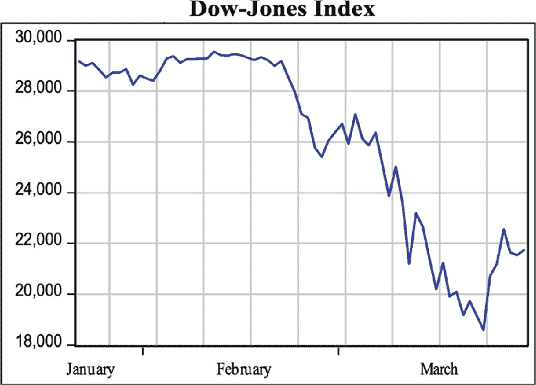
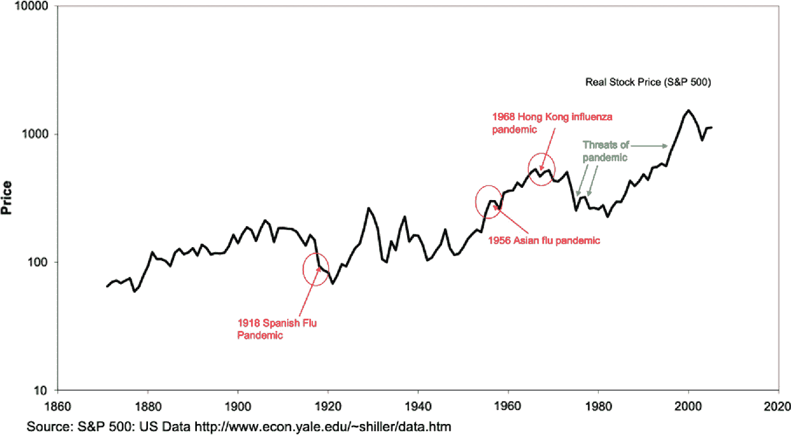

# 3. 金融市场：价值、动态、问题

Juliana Bernhofer^(1, 2  ) 和 Anna Alexander Vincenzo^(3  )(1)意大利摩德纳和雷焦埃米利亚大学经济系，"马尔科·比亚吉"，雅各波·贝伦加里奥大街 51 号，41121 摩德纳(2)意大利威尼斯卡·福斯卡里大学经济系，坎纳雷吉奥 873 号，30121 威尼斯(3)意大利帕多瓦大学，圣德罗 33 号，35123 帕多瓦 Juliana Bernhofer (通讯作者)Email: juliana.bernhofer@unive.itAnna Alexander VincenzoEmail: anna.alexandervincenzo@unipd.it

## 摘要

由 2020 年冠状病毒爆发引发的全球股市崩盘导致了一系列交织在一起且仍在发展的社会、经济和金融后果。我们将审查最近的疫情危机的几个方面，并对其与现有发现的金融中断、恐惧和动荡（全球金融危机、恐怖主义和先前的大流行病）对金融市场的影响进行批判性比较。随着不确定性和波动性的增加，新冠疫情也影响了投资者的风险态度、信任和信心。我们将提供对这些行为方面的洞察，并讨论它们如何最终影响金融决策。此外，政府限制的一个独特副作用是数字化的前所未有的增长：全球各年龄段的公民被迫使用在线服务和数字工具。我们将讨论这一新现象对金融市场的影响、其对社会不平等的影响以及它所蕴含的机遇场景。

关键词金融市场风险信任韧性数字素养 Juliana Bernhofer

是摩德纳和雷焦埃米利亚大学“马尔科·比亚吉”经济系学术研究员，威尼斯卡·福斯卡里大学荣誉研究员和 CF 应用经济学的联合创始人，这是一个应用经济分析和研究中心。她是一位应用行为经济学家，研究兴趣涵盖了从计算决策支持工具的开发到语言经济学、教育与劳动经济学、税收和卫生经济学领域的实证数据分析和人类实验。

Anna Alexander Vincenzo

是帕多瓦大学经济与管理系助理教授。她目前的研究兴趣涉及金融会计领域，特别关注公司避税、公司治理和第三部门。

## 3.1 引言

2019 年末，Covid-19 开始蔓延。由于严重的肺炎，病毒导致老年人和社会中最脆弱的人之间的死亡率异常高，引发了全球超过 20 亿人的国际社交距离和居家隔离，带来了巨大的社会、政治和经济后果（Goodell 2020；Sharif et al. 2020）。此外，这种病毒的商业影响之一是对商品和服务流动、商品价格和金融状况的意外干扰，由于对中国、美国、欧洲、日本和世界其他重要经济体的生产和供应链造成了影响，引发了许多国家的经济灾难（IMF 2020）。

Covid-19 的爆发对市场参与者造成了震惊（Ramelli 和 Wagner 2020），卫生危机预期的实际影响通过金融渠道被放大。与 2007 年的全球金融危机不同，Covid-19 主要是对实体经济的冲击，最初与外部金融手段的可用性无关，尽管市场的反应预示着通过金融限制可能会放大实际冲击。

分析这场意外罕见灾难对金融市场的影响，我们可以概括出疫情进展的三个阶段。[¹] 2019 年 12 月 31 日，中国武汉发现的肺炎病例首次向世界卫生组织报告，2020 年 1 月 1 日，中国卫生部门关闭了华南海鲜批发市场，因为发现那里销售的野生动物可能是病毒的来源（世界卫生组织 2020a）。第一个交易日是 1 月 2 日，因此第一个时期的起点。

第二，2020 年 1 月 20 日，中国卫生部门确认了冠状病毒的人传人传播，次日世界卫生组织发布了关于该疫情的首份情况报告（中国国家卫生委员会 2020；世界卫生组织 2020b）。1 月 20 日星期一是美国的国定假日；因此，次日标志着第二阶段的开始。

第三，在 2 月 23 日星期日，意大利将近 5 万人置于严格的封锁之下，试图在 2 月 22 日星期六首次报告新冠病毒死亡后控制疫情的爆发（意大利内阁大臣会议 2020）。2 月 24 日是这一阶段的第一个交易日，接下来的几周情况急剧下滑。3 月 9 日星期一，道琼斯工业平均指数（DJIA）下跌了 2014 点，跌幅为 7.79%。两天后，即 3 月 11 日，世界卫生组织将 Covid-19 列为大流行。2020 年 3 月 12 日，道琼斯工业平均指数下跌了 2352 点，收于 21,200 点。这是历史上第六次最严重的百分比下跌，跌幅为 9.99%。最后，在 3 月 16 日，道琼斯工业平均指数暴跌近 3000 点，收于 20,188 点，跌幅为 12.9%。股价的下跌迫使纽约证券交易所在这些日子内多次暂停交易。

在 2020 年 3 月，世界目睹了迄今为止最引人注目的股市崩盘之一。在仅仅四个交易日内，道琼斯指数暴跌 6400 点，相当于大约 26%。股市价格的急剧下跌是由于当局决定对人口实施严格的隔离措施，并下令对大多数商业活动实施封锁，以限制新冠病毒的传播。对商业活动实施的封锁暂停了大部分的业务运作，公司对此做出反应，通过调整劳动力成本来弥补收入冲击。裁员导致消费和经济产出急剧减少，降低了公司未来预期现金流的流动性。

**道琼斯工业平均指数（DJIA）**在交易周末的 3 月 20 日达到最低点。随后的星期一，3 月 23 日，美联储宣布对企业债券市场进行重大干预，指数开始再次上涨。2020 年第一季度指数的演变如图 3.1 所示。

一张道琼斯指数市场的图表，涵盖了一月、二月和三月。图表呈下降趋势。

图 3.1

2020 年第一季度的道琼斯工业平均指数（DJIA）

然而，Covid-19 大流行并没有平等地影响所有行业²，封锁也没有导致所有行业的股价变动为负。事实上，一些行业受益于大流行和随之而来的封锁。Mazur 等人 2021 关注了 S&P 1500，发现从事原油石油行业的公司受到了最严重的打击，在一天内失去了超过 60% 的市值。相比之下，天然气和化学行业的公司提高了其市值，并平均获得了超过 10% 的正回报。此外，他们研究了行业水平的模式，并显示在 2020 年 3 月股市崩盘期间，表现最佳的行业包括医疗保健、食品、软件和技术，以及天然气，其月回报率超过 20%。另一方面，包括原油石油、房地产、酒店业和娱乐业在内的行业暴跌超过了 70%。

如果说 Covid-19 吸引了金融市场的注意并不奇怪，那么有趣的是注意到市场参与者何时更加关注局势的发展。Da 等人 2015 开发了一种用于衡量零售投资者对某一主题兴趣的研究方法，该方法利用了 Google 上的搜索强度。Ramelli 和 Wagner 2020 利用 Google 趋势搜索来捕捉投资者情绪，并显示全球 Google 对冠状病毒的搜索关注度急剧上升，特别是在 3 月 9 日之后，而国际公司的电话会议数量和涉及冠状病毒主题的电话会议数量也增加了，但在二月底就已经急剧增加。在他们的研究中，他们发现最初，随着中国的有效关闭，投资者避开了与中国有关联的美国股票和国际化公司；随着中国的病毒情况相对于欧洲和美国的情况改善，投资者再次更有利地看待了这些公司。随着病毒在欧洲和美国的传播，导致这些经济体封锁，市场动荡不安。

## 3.2 金融市场如何应对以往的流行病？

很少有研究分析流行病或大流行对金融市场的影响。最近的研究将冠状病毒大流行置于透视，并分析了与 20 世纪以前的大流行相比，其后果。

传染病爆发的影响特点是高度不确定性，尤其是当爆发涉及一种具有未量化传播、感染性和致死性模式的新疾病时（Smith 2006）。根据 (Baker 等人 2020)，Covid-19 大流行爆发对股票市场的影响是前所未有的。

在图 3.2 中，我们展示了标准普尔 500 指数实际实际价格随时间的演变。1918 年的股票市场回报率很难获取，并且受到了第一次世界大战的影响，该战争发生在 1914 年至 1918 年之间。标准普尔 500 指数可以追溯到 1871 年；1918 年下跌了 24.7%，1919 年上涨了 8.9%。

从 1860 年到 2020 年的 S&P 历史的折线图描述了价格和事件。1918 年是西班牙流感大流行，1956 年是亚洲流感大流行，1968 年是香港流感大流行。大流行的威胁也得到了表述。

图 3.2

标准普尔 500 指数历史 1860–2020

1957 年的亚洲流感大流行是近年来第二大重要爆发事件，全球大约有 1-2 百万人受害。这一大流行首次在 1957 年 2 月在远东被确认。经过最初的熊市阶段，标准普尔 500 指数在 1958 年第四季度完全恢复。

1968 年初，香港流感疫情首次在香港被发现。该病毒的死亡人数在 1968 年 12 月和 1969 年 1 月达到峰值。标准普尔 500 指数在 1968 年上涨了 12.5%，在 1969 年上涨了 7.4%。2003 年，即首次报告非典型肺炎流行的那一年，太平洋日本指数从 1 月 14 日至 3 月 13 日下跌了 12.8%。然而，随后市场大幅反弹，整个年份该指数回报了 42.5%。

Correia 等人的另一项研究 2022 着眼于政府干预措施（如社交距离）对流行病蔓延的经济严重性的影响，旨在减少死亡率。他们的研究重点是造成美国 675,000 人死亡，约占人口的 0.66%的 1918 年流感大流行。大多数死亡发生在 1918 年秋季的第二波中。作为回应，美国主要城市实施了一系列旨在遏制病毒传播的行动，速度和严格程度各不相同。其中包括关闭学校，剧院和教堂，禁止公众集会，对疑似病例进行隔离以及限制营业时间。他们的研究结果显示，实施了更严格的遏制措施的城市在大流行之后表现得更差的证据。事实上，他们的研究结果表明，这些遏制措施减少了病毒的传播，而不加剧大流行引起的经济衰退。

在 SARS 爆发之后，诸如（Beutels 等人，2009；Sadique 等人，2007；Smith，2006）的研究强调了大流行的经济影响。像 SARS 这样的爆发预计会产生直接经济效应，这是由疾病本身的影响（治疗感染者的健康部门成本）、遏制疾病的政策（与隔离、封锁和学校关闭相关的公共部门和私人成本）以及由爆发所引发的恐惧（影响个人行为）所导致的。健康威胁的存在可以影响消费者和投资者的一般预期和行为，因此，其影响远不止于来自患病患者的直接生产力减少（Sadique 等人，2007）。例如，对于 SARS，已经观察到最大的经济影响主要来自减少的本地和国际旅行以及减少了非必要消费活动，例如餐厅和酒吧，尤其是在 2003 年 5 月，以及推迟了主要是耐用品的消费（Richard 等人，2008）。Beutels 等人，2009 强调了承认消费者和投资者对公共卫生紧急情况的适应性的重要性，以提供有用的大流行背景下的经济分析。

在新冠疫情爆发前十年，（Keogh-Brown 等人，2010）研究了潜在的当代大流行对英国经济的可能影响。他们使用了来自过去大流行的流行病学数据，例如 1957 年³和 1968 年⁴的流感大流行，并应用了英国经济的季度宏观经济模型进行了估计。他们以 20 世纪后两次大流行作为基础情景，通过增加疾病参数的严重性来构建进一步的疾病场景，从而探究更严重的流感大流行可能造成的经济影响。

他们在研究中选择使用 1957 年和 1968 年的流感大流行，而不是 1918 年的大流行，这是因为观察到，考虑到社会行为和公共卫生政策的现代变化，西班牙流感的再次爆发对当前经济的影响将会截然不同。然而，通过以更近期的大流行作为疾病场景的基础，并对更严重的大流行（如 1918 年的大流行）的严重程度进行推断，他们能够提出一些有用的假设，并激发对传染病爆发可能产生的经济影响的思考（Keogh-Brown 等人，2010）。

Keogh-Brown 等人的模型根据临床发病率和病死率的严重程度提供了不同的输出。对工作人口的冲击表现为死亡、直接缺勤（由感染引起）和间接缺勤（由学校关闭和对工作的“预防性”避免引起）。当然，模型的结果根据对爆发严重性的不同赋值而变化，但在 GDP 损失、消费下降和通货膨胀方面提供了有趣的结论。最重要的是，这些结果清楚地表明了疾病参数上的行为变化的重要性。

## 3.3 关于自然灾害和恐怖袭击

尽管有关流行病、更不用说大流行病，对金融市场的影响的先前文献有限，但可以从其他形式的自然灾害（Goodell 2020）中得出不完美的类比。市场对自然灾害（如地震和火山喷发）、空难以及近期的恐怖袭击做出反应。

Niederhoffer 1971 是第一个分析各种危机对价格影响的人，研究范围从肯尼迪的暗杀到朝鲜战争的开始。Niederhoffer 发现，这些世界事件对股市平均值的波动有着明显的影响。Barrett 等人 1987 分析了在 1962 年至 1985 年期间发生的 78 起致命商业航空事故，并发现航空事故的即时负面价格反应仅在事件发生后的一个完整交易日内显著。他们还分析了初始反应期后的市场反应，并未发现初始反应期内的低估或高估的证据，这与市场中的即时价格调整的想法一致。Shelor 等人 1992 研究了 1989 年 10 月 17 日加州发生的地震对房地产相关股票价格的影响。他们的研究结果表明，地震传递了与金融市场相关的新信息，这表现为旧金山地区运营的公司的股票收益显著下降。在加州其他地区运营的与房地产相关的公司通常不受地震影响，也没有经历任何显著的价格反应。Worthington 和 Valadkhani 2004 测量了各种自然灾害（包括严重风暴、洪水、气旋、地震和森林火灾）对澳大利亚资本市场的影响。他们的结果表明，森林火灾、气旋和地震对市场收益产生了重大影响，而严重风暴和洪水则没有。

过去几年来，恐怖主义对全球金融市场的间接经济后果在学术文献中受到了广泛关注。几项研究已经研究了恐怖主义对股票市场的影响。有关恐怖事件对金融市场影响的研究可能提供了一些并行，因为恐怖事件，尽管在其初始表现中是局部化的，但其性质是旨在引起公众情绪的广泛变化。负面影响可以在主要宏观经济变量上观察到，消费者和投资者信心受到负面冲击，从而也对经济前景和金融市场产生负面影响（Frey et al. 2007; Johnston and Nedelescu 2006）。

许多实证研究已经分析了恐怖袭击对股票市场的影响。Eldor 和 Melnick 2007 使用每日数据分析了特拉维夫证券交易所对恐怖事件的反应。他们关注了 1990 年至 2003 年间的 639 次袭击，并发现自杀袭击对股票市场产生了永久影响。Karolyi 和 Martell 2006 研究了 1995 年至 2002 年间 75 起恐怖袭击的股票价格影响，重点关注上市公司。他们对公司异常股价回报的横截面分析表明，恐怖袭击的影响取决于目标公司的所在国家和事件发生国家。在较富裕和更民主的国家发生的袭击与更大的负面股价反应相关。此外，他们的研究结果表明，人力资本损失，如公司高管被绑架，与股价的负面反应相关性更大，而物理损失，如设施或建筑物的爆破，影响较小。

Chen 和 Siems 2007 使用事件研究方法评估了恐怖主义对全球资本市场的影响。 他们研究了自 1915 年以来 14 次恐怖袭击对美国股票市场的影响，并另外分析了全球资本市场对两起较新事件的反应——1990 年伊拉克入侵科威特和 2001 年 9 月 11 日的恐怖袭击。该研究的结果表明，与过去相比，美国资本市场更具韧性，倾向于比其他全球资本市场更快地从恐怖袭击中恢复过来。这一后者的发现部分是由于稳定的银行/金融部门提供了充足的流动性，以鼓励市场稳定并最大程度地减少恐慌。

此外，Drakos 2004 和 Carter 和 Simkins 2004 研究了 9/11 袭击对航空公司股票的具体影响。 后者侧重于袭击对投资者心理的显著情感影响，通过测试攻击后第一个交易日的 9 月 17 日股价反应是否对每家航空公司都相同，或者市场是否根据公司特征对航空公司进行区分。 他们的横截面结果表明，市场担心袭击后破产的可能性，并根据航空公司偿还短期债务的能力对航空公司进行区分。 Drakos 则侧重于航空公司股票的风险特征，并报告了 9/11 恐怖袭击后金融风险发生结构性转变的情况。 Drakos 报告称，自 2001 年 9/11 事件以来，航空公司股票的系统性和特有风险都大幅增加。 有条件的系统性风险增加了一倍多，这可能对公司和投资者都产生影响。 投资组合经理需要重新考虑将资金分配给航空公司股票的情况，上市航空公司在筹集资本时将面临更高的成本。

Burch 等人 2003 和 Glaser 和 Weber 2005 也考察了恐怖主义对金融市场情绪的影响。 Burch 等人 2003 发现，9/11 袭击事件后，封闭式共同基金折价显著增加，因此得出这些袭击导致投资者情绪出现负面转变的结论。 Glaser 和 Weber 2005 使用问卷数据分析了 9/11 袭击事件前后个人投资者的预期。 令人惊讶的是，他们发现，恐怖袭击后，个人投资者的股票回报预测更高，意见差异更小。 然而，Glaser 和 Weber 2005 也报告了投资者波动性预期显著增加的情况。

Karolyi 2006 讨论了恐怖袭击的“溢出效应”，以及对这一主题的研究是否表明潜在恐怖主义对整体风险的广泛或“系统性”贡献。 他的结论是证据相当有限，但是有很少的测试检验了资产定价模型中的波动率或贝塔风险。 Choudhry 2005 调查了 9/11 之后在各行各业的一小部分美国公司，以查看这一恐怖主义事件是否影响了市场贝塔的转变，结果参差不齐。 Hon 等人 2004 发现，9/11 恐怖袭击导致全球市场之间的相关性增加，不同地区的变化不同。 一些其他论文提出了恐怖行为溢出到金融市场性质变化的程度的混合图片（Chesney 等 2011; Choudhry 2005; Corbet 等 2018; Nikkinen 和 Vähämaa 2010）。

一些论文表明，与恐怖事件相关的市场下行相对较轻。 根据(Brounen 和 Derwall 2010)，金融市场在未经预料的事件后的头几周内反弹，例如地震和恐怖袭击。 在他们的研究中，他们比较了恐怖袭击的价格反应与自然灾害的价格反应，并发现恐怖袭击后的价格下跌更为显著。 然而，在两种情况下，价格很快就会恢复。 他们还比较了国际间和各行业的价格反应，并发现当地市场和直接受到袭击影响的行业的反应最强烈。 9/11 袭击是唯一对金融市场产生长期影响的事件，尤其是在行业系统性风险方面。

## 3.4 风险、信任和信心在危机时期

风险偏好、对政府的信任和信心态度如何影响金融决策？反过来说，近期的新冠肺炎大流行会在短期和长期内对这些决定性参数产生何种影响？

接触到地震、洪水、恐怖袭击和流行病等灾难不仅对受害者及其家庭产生直接影响，而且对整个社会和集体偏好产生影响。

**风险偏好、信任和动物精神**

Ahsan 2014 表明，焦虑作为极端事件（如气旋）的结果，增加了人们的风险规避倾向。然而，焦虑不仅通过风险偏好的渠道影响股市表现；创伤后应激反应和恐惧也影响理性，并在解释现实时引入了显著偏差。Engelhardt 等人 2020 分析了覆盖全球 95% GDP 的 64 个国家的数据，以评估 2020 年股市崩盘是由理性预期⁵ 还是对新闻关注增加所驱动的。与 Ramelli 和 Wagner 2020 类似，后者通过评估在评估时间范围内的异常谷歌搜索量来衡量。作者发现，新闻关注度每增加一个标准偏差，市场回报就会减少 0.279 个标准偏差，而作者的理性预期度量每增加一个标准偏差，市场回报就会减少 0.131 个标准偏差。与此同时，截至 2020 年 4 月，负面新闻炒作对美国股市的成本估计为 3.5 万亿美元。同样，(Al-Awadhi 等人 2020) 发现，对中国股市的股市回报对确诊病例总数和每日新冠肺炎死亡人数的反应产生了负面影响，(Albulescu 2021) 发现美国金融市场也出现了类似的结果。Shear 等人 2020 比较了不同文化及其不确定性规避水平。试图减轻不确定情况的倾向越高，对额外信息的搜索量就越高。结果与先前的报告一致：国家文化与不确定性规避指数结合在一起，在危机时期是股市回报的重要预测因子，因为更倾向于风险和不确定性规避的文化往往寻求更多信息，最终增加了他们的焦虑水平，进而对股市结果产生负面影响。同样，(Bernhofer 等人 2021) 也表明，使用非陈述（非真实）心情的语言的讲话者更具风险规避倾向，更少投资于风险资产。这是因为语义上，未知更加精确定义，因此增加了他们不确定性区域的显著性。

人们在做出财务决策时受情绪影响的想法最早由约翰·梅纳德·凯恩斯在他 1936 年的重要著作《就业、利息和货币一般理论》中首次描述。在这本书中，他阐述了“动物精神”如何影响消费者信心，这很可能代表了行为金融的起源。希波克拉底（公元前 400 年）和帕加马（公元 200 年）的克劳狄斯·加伦观察到了这一点，将之称为*pneuma psychikon*（或“动物精神”），这是一种位于脑室内的不可见实体，通过肌肉和神经传导（Herbowski 2013; Smith et al. 2012）。然而，这一近似似乎确实是对生物学解释背后心理反应的原始想法，表现为“自发的行动冲动”。对震荡的反应之一似乎是产生“压力激素”皮质醇，作为例如市场波动的反应而增加，并已被证明降低风险倾向（Kandasamy et al. 2014）。同时，由于压力水平增加，对小概率事件的过度关注可能部分解释了焦虑及其对金融决策的后果。后一现象在男性中比在女性中更常见。

此外，人类倾向于关注新闻而不是遵循数据驱动模型，这是克里斯托弗·A·辛姆斯在 21 世纪初描述的他著名的理性注意力理论，此后已被许多研究者讨论和应用。根据辛姆斯的论点，投资者在数据、时间和认知能力方面没有信息处理能力来运行高度复杂的模型，因此他们采取一种捷径，依赖媒体报道。虽然这在某种程度上是一种节省金钱的技巧，但这种方法的主要缺点之一是暴露于*负面偏差*，因为对悲观新闻的增加关注导致了悲观预期的形成和对金融市场的扭曲影响。

**政府的信任与信心**

Engelhardt 等人 2021 从略有不同的角度探讨了金融决策中的行为因素问题，通过调查一个社会的预先存在的固有信任水平以及其对疫情影响的韧性。作者分析了涵盖 47 个国家的世界价值观调查数据以及从 2020 年 1 月底到 7 月底的确诊 Covid-19 病例数量。信任通过两个不同的指标来衡量，社会信任——或者对其他人的信任——和对政府的信心。市场波动性计算为 5 天移动平均波动率，而 Covid-19 病例则根据人口规模进行了调整。在那些社会信任和对政府的信心较高的国家，股票市场受新的 Covid-19 病例报告影响显著较少。作者假设传播机制通过不确定性水平，这个水平通过对政府规则的信心以及对新规则和处方的遵守程度降低了。Akerlof 和 Shiller 2010 强调了积极政府在建立信任和调节对危机的情感反应或“动物精神”的作用。因此，它应该像对经济负责任的父母一样，减轻其对关键事件的反应。

## 3.5 数字素养和 Covid-19

**大暴发**

对于 Covid-19 疫情的研究往往伴随着一种苦涩的余味：死亡人数、对各个年龄段心理健康的影响、失业和企业关闭。依赖面对面交流的行业的收入显著下降，而相对能够适应远程市场的现实情况，如 Zoom Video Communications、Netflix 和亚马逊等，则未受影响。Miescu 和 Rossi 2021 进行了一些冲击响应函数分析，并显示由 Covid-19 引起的冲击将贫困家庭的就业机会减少了近两倍。另一方面，与贫困家庭相比，富裕家庭的私人支出下降了近 50%，这可能是由于消费组合的差异，娱乐和餐饮行业暂时不可用。

由于社交距离、学校关闭和其他限制，首次封锁的一个著名且广泛讨论的外部性是，各种规模的企业和各个年龄段的私人公民被迫在在线世界中导航以克服物理限制。对数字环境的适应几乎是一夜之间发生的，并且已经充当了对以前未知或被忽视的各种数字工具的使用的催化剂（Amankwah-Amoah et al. 2021）。政府和企业不得不迅速从纸质程序转移到在线服务以达到他们的目标，各年龄段、社会背景和教育类别的私人公民不得不提高现有的数字技能或获得新知识以从公共援助中获益，并保持对医疗保健的访问并参与市场。随着疫情袭击整个社会系统，几乎没有抵抗的空间和时间。

在图 3.3 中，我们比较了通过欧洲健康、衰老和退休调查（Axel Börsch-Supan 2022）进行的访谈。SHARE 是一个关于 50 岁及以上个人的社会经济地位、家庭网络、个人偏好和健康状况的两年一次的跨国面板数据库，因此代表了较脆弱的年龄群体之一。第一轮问卷调查（即第 1 波）于 2004 年进行，涉及 11 个欧洲国家和以色列。第 8 波的实地调查原计划于 2020 年春季结束，但在 2020 年 3 月的疫情中断了。同年 6 月，对已经接受过访谈的一些受访者和尚未回答问题的一些受访者进行了 CATI⁶问卷调查。在这两个图表中，我们比较了疫情前欧洲 50 岁以上人口的计算机技能水平和 2020 年首次封锁后的自我改善计算机技能。通过比较数字技能预存在低水平的国家与数字技能预存在高水平的国家，我们观察到前者国家的平均技能增长更强烈，表明数字鸿沟有所缩小！

欧洲的 2 张地图。左边是 Covid 19 之前 50 岁以上人群的平均计算机技能。右边是 2021 年 50 岁以上人群中数字技能改善的百分比。

图 3.3

疫情前后的数字技能

表 3.1 中呈现的第二次计量评估为我们揭示了社会方面的一些情况。我们分析了 Covid-19 大流行之后数字素养提升的决定因素，如性别、识字能力、家庭收入水平以及国家层面的收入不平等情况。一方面，女性受益几乎是男性的两倍，也是那些原先数字素养较低的人，但另一方面，那些阅读能力更好的人从大流行带来的数字化转型中稍微更多受益。有趣的是，似乎没有任何差异性效应，对于收入高于本国中位数的受访者，但更重要的是，在大流行期间，收入不平等水平较高的国家平均有 7.5 倍更有可能出现数字素养的提升。

改善数字素养的一些决定因素

|   | (1) | (2) | (3) |
| --- | --- | --- | --- |
| 女性 | 1.858*** | 1.781*** | 1.809*** |
|   | 0.168 | 0.160 | 0.160 |
| 识字能力 | − | 1.118** | 1.105** |
|   | − | 0.049 | 0.049 |
| 高收入 | − | − | 1.257 |
|   | − | − | 0.186 |
| 高基尼 | − | − | 7.548*** |
|   | − | − | 0.054 |
| 常数 | 0.407*** | 0.207*** | 0.189*** |
|   | 0.042 | 0.028 | 0.026 |
| 观察数量 | 1992 | 1992 | 1992 |
| 国家数量 | 24 | 24 | 24 |
| 伪 R2 | 0.016 | 0.055 | 0.057 |
| 估计方法 | 对数几率 | 对数几率 | 对数几率 |

*注释*：因变量为“Covid-19 后的 PC 技能是否提高”。估计方法为对数几率，系数报告为几率比。在所有模型中，都聚类了鲁棒标准错误。在所有模型中都包含了国家固定效应。识字能力的衡量标准为从 0（一般）到 4（优秀）的等级。女性的参考类别是男性。高收入 = 1，如果受访者的收入高于本国中位数。高基尼 = 1，如果收入不平等高于样本中其他国家的中位数。

显著性水平：* p < 0.1，** p < 0.05，*** p < 0.01

## 3.6 大重启

社会可持续性是世界经济论坛（WEF）推动的“大重启”倡议的主要目标之一。其目标是通过创建一个更具韧性、更公平、更可持续的利益相关者经济来从 Covid-19 的挫折中崛起。增长应该更环保、更智能、更公平，符合联合国 2030 年可持续发展目标。

数字化过程在 2020 年首次封锁期间提供了积极的外部性：正如我们之前所见，更频繁地在封锁期间提升数字技能的人是女性和那些居住在收入不平等程度较高的国家的人。此外，受教育程度更高的人稍微更多地受益于数字化进程，这意味着技能是自我强化的。知识使得获取更多知识变得更容易。

政府的角色不仅在于创建信任，如前一节所述，而且同样重要的是平等分配和促进数字技能的获取、数字包容和连接。

财富不平等的驱动因素之一是对传统信贷形式的不平等获取。小型企业和私人公民通常无法提供足够的信用证明，没有财务资源，因此人口中有相当大的一部分被排除在市场之外，从而阻碍了创新和生产力。受影响最严重的人口部分包括低收入公民、妇女和少数民族。人工智能有可能克服这些限制，因为潜在的受益者可以在不同的领域进行评估：个人的信用 worthiness 不仅仅限于他们的财务历史，还可能包括他们的社交网络活动和行为、地理位置和在线购买等。在确保平等获得数字技术的条件下，最近的发展允许全球范围内将处于劣势和地理上偏远的人口纳入到金融、教育和商业现实中。例如，在孟加拉国，iFarmer 是一个众筹平台，汇集了以牛为目标的女性农民，面向潜在投资者。随着疫情的爆发，数字贷款经历了显著增长，特别是 Fintech 的特殊形式——P2P（点对点）借贷应用变得越来越成为银行或其他金融中介机构的替代品（Arninda 和 Prasetyani 2022）。在这些平台上，贷款从个人到个人转移，大幅削减了繁文缛节和成本。众筹和 P2P 借贷在疫情爆发前已经存在（Agur 等 2020；Lin 等 2017），但所获得的数字素养水平为针对性的政策干预提供了前所未有的机会，目的是将慈善家与在过去两年中被遗落的人以及有潜力但传统信用 worthiness 很小的小型创业项目与没有地理约束的小风险资本家联系起来。与约会应用程序类似，借款人和贷款人在匹配平台上相遇（例如 Estateguru、PeerBerry、Mintos 和 Lendermarket），这些平台通常受人工智能支持以优化市场。

人工智能是一种强大的技术。到目前为止，随着越来越多的人工智能解决方案的开发，我们只是触及到了可能实现的可能性的一部分。学习算法能够理解和重新解释复杂的人类需求，以克服可能阻碍无传统中介的金融交易成功的行为态度，缓解经济震荡对社会平等的负面影响，并在放贷方和借款方之间建立互信。人工智能已经广泛应用于关键基础设施领域，例如公共卫生、交通、供水、发电和电信，增强了它们在极端事件发生时的韧性。相同的韧性概念应该应用于中小企业和私人公民的金融资产：在大流行病或其他灾难等极端事件发生时，金融资产必须受到保护，并且能够迅速从这些冲击中恢复。除其他解决方案外，可以通过引导小投资者选择具有较高 ES（环境和社会）评级的股票来实现这一点，因为据显示它们对市场波动的反应较小（Albuquerque 等人 2020），通过增加人口的数字和金融素养，并提供公平的技术获取，无论其社会经济地位、种族、性别和年龄如何。

## 3.7 结论

战争、大流行病、恐怖袭击和自然灾害都以对金融市场产生重大影响而闻名。我们概述了上个世纪的主要经济和社会冲击，以及投资者在金融决策方面的反应。我们讨论了这些反应在社会平等方面所涉及的内容，以及这些危机如何影响个人偏好，如对冒险行为的倾向、对信任和对政府的信心的态度。

最近新冠疫情的一个特殊副作用是数字化。我们还将本章的一部分专门致力于数字素养现象，这在第一次封锁后经历了前所未有但又强有力的激增。虽然这一过程的成本和随后的市场不稳定性仍然不均匀分布，数字化为发展中国家和具有较低社会经济地位的阶层打开了一扇窗户：它具有教育、网络、经济增长和财富再分配的巨大潜力。然而，全球政府的任务是积极创造积极的变革和协同效应，防止其最终加剧人口和国家之间的社会经济差距。这可以通过建立信任、投资数字基础设施和人力资本、为私人公民和小企业提供培训和支持来实现。

社会联系是向上社会流动的已知预测因素，并且可能促成新的全球互联，这也可以被那些以前局限于常常有限的本地机会的人所利用。Chetty 等人 2022a，2022b 研究了基于社交媒体友谊和邮政编码的三种连接方式。第一种是低社会经济地位和高社会经济地位之间的连接，第二种类型是社会凝聚力，第三种是定义的公民参与水平。他们发现第一种（经济）连接是向上收入流动的最强因素。我们声称，这在某种程度上也适用于全球互联，无论物理距离如何。

当前世纪是复杂性的世纪，正如一位著名物理学家已经预言的那样，而我们已经看到，金融市场也不例外。弹性概念的发展是这一预言的结果，因为复杂性无法用一颗药丸解决。然而，通过增加金融和数字素养，投资于教育，提供技术接入，并通过建立对同行和政府的信心，可以实现从未预料到的情况中恢复——无论是在金融还是社会上。一个更加公平的世界可以通过增强同行和政府的信心、投资于教育以及提供技术接入来创建。最后，*利益相关者资本主义*的理念，即公司以共同利益为考量而不是眼前利润行事，以及创建一个具有韧性、平等和环境可持续性的系统是*大重启*的主要支柱，这是世界经济论坛推动的一个倡议，将在下一章中更深入地介绍。
