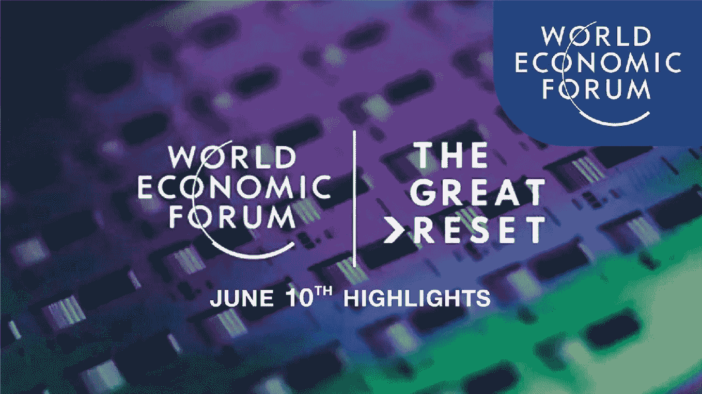

# 第四章：大重置中的人工智能角色

费德里科·切科尼^(1  )(1)LABSS-ISTC-CNR，Via Palestro 32，00185 罗马，意大利费德里科·切科尼电子邮件：federico.cecconi@istc.cnr.it

## 摘要

“大重置”一词现已进入公共领域，并出现在许多分析和讨论中。然而，我们在这方面经常保持模糊。阅读世界经济论坛的所谓白皮书《在后疫情世界中重置未来工作议程》可能会有所帮助，以了解这一时代性举措的理论家们的目标。这份 31 页的文件描述了如何运行（或者，如今他们所说的，实施）包含在 CoViD-19 书籍中的软件。世界经济论坛创始人克劳斯·施瓦布和蒂埃里·马勒雷共同撰写了《大重置》（Schwab and Malleret 在《COVID-19：大重置》中，2020；Umbrello 在《价值探讨期刊》中：1-8，2021；Roth 在《欧洲管理期刊》39.5：538-544，2021）。为什么在一本关于人工智能及其在金融中的应用的书中要专门致力于这个话题一个完整的章节？答案很简单：为了更新金融世界，使其更安全、更可理解和更可控制，需要广泛使用人工智能技术。这些技术在某种程度上可能是有害的。

关键词大重置 COVID-19 微趋势信用 ESGF 费德里科·切科尼

是 QBT Sagl 的研发经理（[`www.qbt.ch`](https://www.qbt.ch)），负责计算机网络管理的 LABSS（CNR）和仿真的计算资源，并为 Arcipelago Software Srl 担任顾问。他为 Labss 开发计算和数学模型（社会动态、声誉、规范动态）。对于 Labss 进行了传播和培训。他目前的研究兴趣有两个方面：一是使用计算模型和数据库研究社会经济现象。第二个是为金融科技和房地产科技开发人工智能模型。

## 4.1 总结大重置

大重置可能是以信息技术（人工智能作为主要支柱）为核心的第一次大革命：重置未来涵盖了从 2021 年到 2030 年的十年（见图 4.1）。

世界经济论坛的显示页面上有标题“大重置”。下面，一个文本写着六月十日的亮点。

图 4.1

描述了大重置，是世界经济论坛的一个倡议。

首先，数字化工作流程将加速进行，要求所有工作流程的 84%都必须数字化或通过视频制作。为了实现完全的社会分离，大约 83%的人将被要求远程工作，不与任何人进行互动。预计至少一半的活动将被自动化，这意味着直接的人类参与，甚至在相同的远程活动中，都将大大减少，并且升级和再培训活动也需要电脑化。升级是获取新技能，使个人在其领域更加有效和合格。为了让一个人执行不同的功能而获得明显不同的能力，这被称为再培训。换句话说，在这种情况下的要务是避免人与人之间的接触，并通过计算机、人工智能和算法实现一切。

加快重新培训计划的实施，以使至少 35%的技能得到“再培训”，这意味着必须放弃已经获得的技能。

加快组织结构改革的步伐。建议对当前 34%的组织结构进行“重组”，宣布其过时。目标是为新的组织框架腾出空间，以便对所有活动，包括数字化，保持完全控制。

暂时重新分配人员到不同的岗位：这可能会影响到大约 30%的劳动力。这包括对工资水平的审查。

暂时减少劳动力：这一命运预计将影响 28%的人口。这是一个失业问题，因为“暂时”一词的含义不明确。

此外，大重置还包括一个信用计划，其中个人债务可能会被“宽恕”，以换取所有个人资产的转让给一个行政机构或机构。

先前的 COVID-19 传播是追求大重置的最迫切理由。这场大流行是近年来最致命的公共卫生危机之一，已经造成数十万人死亡。战争远未结束，在世界许多地方仍然报告有伤亡。

结果，长期的经济增长、公共债务、就业和人类福祉都将受到影响。《金融时报》报道称，全球政府债务已经达到历史最高水平。此外，许多国家的失业率正在飙升；例如，在美国，自 3 月中旬以来，每四名工人中就有一人申请了失业救济金，每周的新申请数量远远超过历史最高水平。据国际货币基金组织称，全球经济今年将收缩 3%，在短短四个月内下降了 6.3 个百分点。

所有这些将加剧现有的气候和社会危机。一些国家已经利用 COVID-19 危机削弱了环境保护和执法力度。而对于像日益加剧的不平等这样的社会弊病的不满—美国亿万富翁的总财富在危机期间增加了—正在增长。

实际上，已经有一个可以用一个词概括的要求：稳定。我们目前正在目睹我们社会和全球出现大量怀疑的情况。然而，主要要求是稳定。虽然本章的大部分内容将继续集中讨论 COVID 及其后果，但重要的是要记住需求要大得多。

如果不加以解决，这些危机连同 COVID-19 将会恶化，使世界变得不可持续、不平等和脆弱。渐进措施和临时修复措施将不足以避免这种情况。我们的经济和社会体系必须彻底重建。

这需要前所未有的合作和雄心壮志。然而，这并非是不可能实现的梦想。大流行的一个好处是，它展示了我们有多快速地进行根本性的生活方式变革。几乎立即，危机迫使企业和个人放弃长期坚持的重要做法，如频繁的空中旅行和办公。

同样，人口已经表现出为医疗保健等基本工作者以及脆弱人群如老年人做出牺牲的强烈意愿。而且，许多公司已经开始支持员工、客户和当地社区，向以前只是口头上支持的利益相关者资本主义方向转变。

显然，人们希望创造一个更好的社会。我们必须利用它来确保急需的大重置。这将需要更强大和有效的政府，但这并不意味着要推动更大的意识形态。这还需要私营部门在各个阶段的参与。

## 4.2 元素

大重置议程将包括三个主要组成部分。第一个是引导市场走向更加公平的结果。政府应该提高协调能力（例如，在税收、监管和财政政策方面），升级贸易协定，并创造实现这一目标的“利益相关者经济”的条件。在税基萎缩和公共债务飙升的时代，政府有强烈的动机采取这样的行动。

此外，政府应该进行长期拖延的改革，促进更公平的结果。这些可能包括改变财富税、消除化石燃料补贴以及根据国家情况制定新的知识产权、贸易和竞争规则。

大重置议程的第二个组成部分将是确保投资推动诸如平等和可持续性之类的共同目标。许多政府正在实施的大规模支出计划为在这一领域取得进展提供了重要机会。例如，欧洲委员会提出了一个 7500 亿欧元（8260 亿美元）的复苏基金。美国、中国和日本都有积极的经济刺激计划。

我们应该利用这些资金以及来自私人实体和养老基金的投资，来修补旧系统，而应该利用它们来建立一个更具弹性、更公平和长期可持续的新系统。例如，这包括建设“绿色”城市基础设施，并制定激励措施，鼓励行业在环境、社会和治理（ESG）指标上改善业绩。

大重置议程的第三个也是最后一个优先事项是利用第四次工业革命的创新来造福公共利益，特别是解决健康和社会挑战。在 COVID-19 危机期间，公司、大学等团结一致，开发诊断、治疗方法和可能的疫苗；建立测试中心；开发追踪感染的机制；提供远程医疗服务。想象一下，如果每个领域都采取类似协调的努力，可以取得什么样的成就。

## 4.3 微趋势

大重置将涉及一系列长期而复杂的微观层面、行业和企业的变革和调整。面对这一挑战，一些行业领导者和高级执行官可能会试图将恢复与重启等同起来，希望回到过去的常态，并恢复过去的成功之道：传统、经过验证的程序和熟悉的做事方式——简而言之，恢复到常规业务。这是不可能发生的，因为它不可能发生。在大多数情况下，“常规业务”已经死亡（或被感染）了 COVID-19。封锁和社交隔离措施导致的经济休眠摧毁了一些部门。在全球经济衰退的影响下，其他部门将在艰难地恢复失去的收入之前，开始走上一条越来越狭窄的盈利之路。然而，对于进入后冠状病毒时代的大多数企业来说，关键问题将是在过去的成功之间找到平衡和如何在新常态中蓬勃发展。对于这些企业来说，大流行代表了重新思考其业务并实施积极长期变革的一次千载难逢的机会。

什么将定义后冠状病毒时代的新常态？

企业将如何在过去的成功和现在在后疫情时代成功所需的基本要素之间取得最佳平衡？

答案显然取决于每个行业，以及疫情的严重程度。除了少数几个行业会因强劲的有利因素（尤其是技术、健康和健康）而从中受益外，其他行业在后疫情时代的旅程将会艰难，有时甚至会充满危险。对于一些行业，比如娱乐、旅游和酒店业，近期内恢复到疫情前的状况是难以想象的（在某些情况下甚至永远不会……）。另一些行业，尤其是制造业和食品业，更关注于适应冲击并利用新趋势（比如数字化）在后疫情时代蓬勃发展。规模也是一个重要因素。小型企业面临更多挑战，因为它们的现金储备和利润率比大型企业低。

大多数公司将不得不应对将来使它们在成本收入比方面处于劣势的问题，与它们更大的竞争对手相比。然而，在当今世界，灵活性和速度可能决定企业的适应能力，而这对于小型结构来说比对于大型工业结构更容易实现。在今天的世界里，灵活性和速度可以决定企业的生死存亡。

话虽如此，无论行业或特定情况如何，全球几乎所有的商业决策者都将面临类似的问题，并需要回答一些共同的问题和挑战。以下是最明显的几点：

我应该鼓励那些能够（大约占美国劳动力总数的 30%）在家工作的人吗？

我是否会减少公司对航空旅行的依赖，并能用虚拟互动大幅替代多少面对面会议？

我如何使企业和我们的决策过程更加灵活，让我们能够更快速、更果断地行动？

我如何加速数字化和数字解决方案的采用？

我们仍处于后疫情时代的早期阶段，但已经有一些新的或正在加速的趋势在起作用。对于一些行业来说，这将是一个福音；对于其他行业来说，这将是一个重大挑战。然而，每家公司都将根据所有行业的快速而果断的适应能力来利用这些新趋势。表现出最大灵活性和适应能力的公司将会更加强大。

## 数字化正在加速发展

“数字转型”这个流行词在大流行之前是大多数执行委员会和委员会的口头禅。数字是“至关重要的”，必须“果断”实施，并被视为“成功的前提”！从那时起，这个口头禅已经成为一种必须，甚至在一些企业的情况下，成为生死攸关的问题。这很容易解释和理解。在我们被监禁期间，我们完全依赖互联网进行一切，从工作和教育到社交。正是在线服务让我们保持了一种正常的状态，自然，“在线”是从大流行中受益最多的，为我们提供了一个巨大的推动力，这些技术和流程使我们能够远程完成各种事务，如通用互联网到宽带、移动和远程支付以及可行的电子政务服务等。因此，已经在线运营的企业将拥有长期的竞争优势。像电子商务、无接触运营、数字内容、机器人和无人机交付等行业的企业将随着越来越多的事物和服务通过我们的手机和电脑送到我们手中而蓬勃发展。阿里巴巴、亚马逊、Netflix 和 Zoom 等公司之所以成为封锁的“赢家”，并非偶然。

一般来说，消费者部门是第一个也是发展最快的部门。从封锁期间对许多食品和零售企业强制实施的无接触体验到允许客户浏览和选择他们喜欢的产品的制造业虚拟展厅，大多数企业对消费者的数字旅程“从头到尾”有了快速的认识。

随着一些封锁的结束和一些经济体的复苏，在企业对企业应用中出现了类似的机会，尤其是在制造业中，需要快速实施社交距离规则，通常是在困难的环境中。（例如，装配线。）

因此，物联网取得了显著进展。在封锁之前对物联网采取缓慢步伐的一些公司现在纷纷拥抱它，其特定目标是尽可能多地远程进行各种活动。所有这些不同的活动，如设备维护、库存管理、供应商关系和安全策略，现在都可以（在很大程度上）由计算机执行。物联网为企业提供了不仅能够执行和遵守社交距离规则，还能够降低成本并实施更敏捷运营的能力。

由于全球供应链固有的脆弱性，关于缩短的讨论已经进行了多年。它们通常是错综复杂且难以管理的。它们在环境和劳工法合规方面的监督也很困难，这可能会使公司面临声誉风险和品牌损害。鉴于这段动荡的历史，大流行已经为公司应该根据单个组件的成本以及关键材料的单一供应来源来优化供应链的原则敲定了最后一击。在后大流行时代，“端到端价值优化”——包括弹性、效率和成本的概念将占主导地位。该公式指出，“万一”最终将取代“及时”。

宏观部分讨论的对全球供应链的冲击将影响大大小小的企业。但在实践中，“万一”意味着什么呢？上世纪末由全球制造公司构想并建立的全球化模式，以寻找低成本劳动力、产品和零部件为目的，已经达到了极限。它将国际生产分解为越来越复杂的碎片，导致了一个在亲密规模上运作的系统，这个系统被证明是极其精益和高效的，但也极其复杂，因此也极其脆弱（复杂性带来脆弱性，通常会引发不稳定性）。因此，简化是解毒剂，这应该会增加弹性。结果，占全球贸易约四分之三的“全球价值链”将不可避免地下降。这种下降将被新现实加剧，即依赖复杂的及时供应链的公司不能再假设世界贸易组织的关税承诺会保护它们免受来自某个地方的突然保护主义浪潮的影响。

因此，它们将被迫通过减少或本地化他们的供应链，并制定替代性的生产或供应计划来准备长期停产。任何盈利依赖于及时全球供应链原则的企业都将不得不重新考虑其运营方式，并几乎可以肯定地牺牲最大化效率和利润的想法，以换取“供应安全”和弹性。弹性随后将成为任何认真保护自身免受干扰的企业的主要考虑因素，无论这种干扰是由特定供应商、贸易政策的潜在变化，还是特定国家或地区引起的。在实践中，这将迫使企业扩大其供应商基础，即使这意味着囤积和创建冗余也要付出代价。这也将迫使这些公司确保同样的情况在他们自己的供应链中也成立：他们将评估整个供应链的弹性，一直到最终供应商，甚至可能是供应商的供应商。生产成本将不可避免地上升，但这将是建立弹性的成本。乍一看，汽车、电子和工业机械行业将受到最大影响，因为它们将是首批改变生产模式的企业。

## 4.5 ESG 和利益相关者资本主义

过去十年左右在 Chap. 1 中审查的五个宏观类别中发生的根本性变化，已经深刻地改变了企业运营环境。它们提高了利益相关者资本主义和环境、社会和治理（ESG）考虑因素在创造长期价值方面的重要性（ESG 可以被认为是利益相关者资本主义的基准）(Puaschunder 2021)。

当许多问题，从行动主义到气候变化，再到不断加剧的不平等现象、性别多样性和#MeToo 丑闻，已经开始引起人们的关注并增加了在当今相互依存的世界中利益相关者资本主义和 ESG 考虑因素的重要性时，这场流行病就爆发了。无论他们是否公开结婚，没有人可以否认，企业的根本目的不再能是对金融利润的放任追求；他们现在必须为所有利益相关者服务，而不仅仅是持有股份的人。这得到了早期轶事证据的支持，表明在后疫情时代，ESG 的未来将更加光明。这可以通过以下三种方式解释：

1.  1.

    大多数 ESG 问题，尤其是气候变化，危机将会在很大程度上加强或强化对责任和紧迫感的认识。然而，其他问题，如消费者行为、未来工作和流动性以及供应链责任，将成为投资议程的重点，并成为尽职调查的重要组成部分。

1.  2.

    这场大流行表明，缺乏 ESG 考虑可能摧毁大量价值，甚至威胁到公司的盈利能力。之后，ESG 将更加全面地融入和内化到公司的核心战略和治理中。这也将改变投资者对企业治理的看法。为了避免出现或公之于众的问题带来声誉成本，税收回报、股息支付和工资将受到更严密的审查。

1.  3.

    提升员工和社区的友好关系对于提升品牌声誉至关重要。

## 4.6 现在是时候揭晓了……

因此，如果世界选择走这条路，捍卫并追求这些目标，甚至部分接受这些论点，我们几乎肯定会陷入一种情况，即人工智能算法将管理我们无法简单应对的事务。这是一次真正历史性的革命。在讨论数字化时，许多人关注的是更直接的后果，比如失业。相反，这里首次支持的论点是：智能信息技术将能够帮助我们管理复杂性。这是一个真正引人入胜的挑战：以人工智能换取稳定（Da Silva Vieira 2020；Murmann 2003）。
