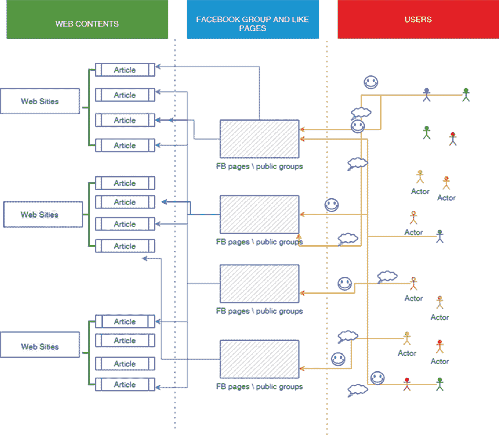

© 作者授予施普林格自然瑞士有限公司独家许可 2023 F.切科尼（主编）金融市场中的人工智能计算社会科学[`doi.org/10.1007/978-3-031-26518-1_5`](https://doi.org/10.1007/978-3-031-26518-1_5)

# 5. 人工智能金融科技：揭示真相

费德里科·切科尼^(1  ) 和 阿莱山德罗·巴拉泽蒂^(2  ) (1)LABSS-ISTC-CNR, 意大利罗马, Via Palestro 32, 00185(2)QBT Sagl, 瑞士基亚索, Via E.Bossi, 4 CH6830 阿莱山德罗·巴拉泽蒂（通讯作者）Email: federico.cecconi@istc.cnr.it 阿莱山德罗·巴拉泽蒂 Email: alessandro.barazzetti@qbt.ch

## 摘要

我们提出了一个应用示例，可能对我们的经济产生重大影响：利用人工智能代理复制动态，研究假新闻的传播。众所周知，大量应用程序（其中一些在此处描述）致力于通过观察主要趋势来投资于金融市场，通常以非常高的速度进行操作。这些应用程序经常通过不理性地加速下行趋势而引起问题。市场正在采取措施应对这种类型的问题。但是，正在出现能够评估不是趋势而是直接是趋势本身原因的新闻的自动交易员。这引发了以下问题：如果文化传播（在这种情况下是新闻，但也可能是社交网络上的帖子，稍有改变）因“假新闻”的出现而变得困难，我们如何对我们的自动交易员的运作感到放心？在这里，我们提出了对这个问题的全新方法，该方法利用了一种广泛应用的人工智能技术，即人工代理。这些代理重现了假新闻的传播现象，并提供了如何对抗它的指导（Chen and Freire in Discovering and measuring malicious URL redirection campaigns from fake news domains, pp. 1–6, 2021; Garg et al. in Replaying archived twitter: when your bird is broken, will it bring you down? pp. 160–169, 2021; Mahesh et al. in Identification of Fake News Using Deep Learning Architecture, pp. 1246–1253, 2021).

关键词假新闻自动交易基于代理的仿真费德里科·切科尼

是 QBT Sagl 的研发经理 ([`​www.​qbt.​ch`](https://www.qbt.ch))，负责计算机网络管理和模拟的 LABSS（CNR），并为 Arcipelago Software Srl 担任顾问。他为 Labss 的问题（社会动态、声誉、规范动态）开发计算和数学模型。Labss 既进行传播又进行培训。他目前的研究兴趣有两个方面：一方面，使用计算模型和数据库研究社会经济现象。第二个是为金融科技和地产科技开发人工智能模型。

阿莱山德罗·巴拉泽蒂

米兰理工大学航空工程师，卢德斯（Ludes）校外赛梅尔威斯大学（Semmelweis University）教授和飞行员是 QBT Sagl 的所有者，该公司在金融科技和房地产科技领域开发算法和软件，并且是 Science Adventure Sagl 的所有者，该公司专注于开发应用于卫生保健的人工智能解决方案以及航空航天领域的高级项目。亚历山德罗还是 SST srl 的创始人，一家致力于可持续性研究和认证的公司，以及 Reacorp Sagl，一家致力于金融科技和房地产科技服务的公司。

## 5.1 文化的扩散

与文化扩散和巩固动态相关的社会学文献非常广泛。在这里，我们选择从 Axelrod 定义的文化概念出发，他认为文化的传播是社会行为者之间相互影响过程的产物，这些行为者分享特定的价值观和独特的特征。实际上，相似的代理人倾向于彼此之间的互动，因此在他们之间形成了一种同化增长的圈子。在这种情况下，代理人之间的互动过程起着关键作用。

特别是，在社会行为者的日常行为中可以找到社会结构的无处不在，以至于在确定自身身份的过程中同时发生。在集体维度上，社交媒体的作用在于确定可以是“弱”的、瞬时的亲和网络，但也可以自我构建到成为真正的社会群体的程度。

因此，在社交媒体的维度内，关系潜力变得如此重要，以至于消费者不仅是信息和内容的使用者，还成为它们的生产者和编辑，形成了一个连续的知识循环。

在这种解释框架中，产消者的形象诞生了，即媒体产品的生产者（生产者）和用户（消费者）。产消者这一术语是由美国社会学家托夫勒在 1980 年创造的，而让·克鲁提尔（Jean Cloutier）在 1975 年已经制定了一个类似的理想类型，将其定义为自我媒体，这两种情况下我们都指的是主体在当代文化和媒体产品中既是生产者又是用户的能力。

然而，数字生产者不能被视为一个特定的一次性人物，而是定义了网络的任何用户。由于每个数字行为者也是内容生产者，特别是数据生产者。在网络空间内生成数字内容的行为实际上不一定局限于创建特定的在线多媒体内容（帖子、视频、图像），它还涉及到更简单和表面上低沟通活动，比如分享或转发内容，插入喜欢或在特定地点地理定位自己。

选择打开一个网站而不是另一个，也意味着你在无意中为其管理做出了贡献。

## 5.2 研究设计

这个人工智能解决方案的目标是重建 Facebook 页面分享阴谋主题文章的过程，形成了一种从非官方来源获取新闻的泡沫。具体来说，基于人工智能代理的模拟模型被编码了。这些代理是文章、社交页面、网站和用户；它们相互作用形成了页面到文章网络（‘pages to articles’ network, pta network），这是我们调查的焦点（Gupta 和 Potika 2021；An 等 2021；Yu 等 2021；Singh 和 Sampath 2020）。

该模拟项目是基于一个通过两个研究问题构建的探索性调查。

问题 1——一些存在于数字空间中的误导性信息内容具有一些特性，使它们对特定的 Facebook 页面和群体具有吸引力，并且基于特定特征，这些内容在社交网络中传播。这些属性分别涉及：基于阴谋的内容、阴谋内容的强度、政治取向、煽动仇恨和煽动恐惧。

问题 2——涉及通过模拟模型分析文章内容对生态舱拓扑结构的影响。

## 5.3 数据挖掘

在第一阶段，通过对 Facebook 上一组公开群体中的互动和共享内容进行定性观察，对意大利反信息源的数字足迹进行了分析。在这方面，根据其与阴谋运动典型主题内容的一致性，已选择了 197 篇文章（Choudhary 和 Arora 2021；Garg 和 Jeevaraj 2021）。

随后，通过社交网络分析工具检测了每篇文章在 Facebook 内的互动。这个阶段对于界定阴谋主义公共页面和群体的生态系统以及识别互动最多的帖子都很重要。一些经验性证据从初步分析中浮现出来：（1）有一些 Facebook 来源只分享基于阴谋的内容；（2）这些文章对于具有特定内容的页面具有兴趣；（3）发现的内容反过来又来自专门传播阴谋信息的来源。

收集的数据集和进行的处理使得能够确定构建回音室过程的主要单元（代理）：

**网站或站点**（博客、信息门户、在线报纸等），它们产生并包含所识别的文章。

**文章**，研究的第一阶段收集的具有呈现信息内容特征的文章。

**页面**，这个类别包括分享文章的页面和公共 Facebook 群组。

**用户**，与文章在 Facebook 上进行互动的用户。

## 5.4 ABM 模拟

模拟的目的是重建页面与文章的关系。在模拟中，我们必须创建页面和文章之间的链接。这必须使用从调查中获取的文章、网站、页面和用户的属性来完成。在起始阶段，页面和文章之间的链接没有加载，因为这种类型的网络代表了模拟的输出。

根据在数据挖掘阶段收集的数据，模拟模型被设计并编码为两个操作任务：定义代理和定义算法。收集的数据用于构建人工代理，分为四个代理集：文章、网站、页面和用户（图 5.1）。

一个框架说明了网页内容与 Facebook 群组和喜欢的页面如何与用户联系在一起。用户在 Facebook 页面和公共群组上发布内容，这些内容被用作网站上的文章。

图 5.1

agentsets

具体来说，四种类型的结构如下：只有网站与文章相连，文章与网站和页面相连，页面与文章和用户相连，最后用户只与页面相连。

具体来说，文章数据集是通过将在研究的第一阶段中识别的所有文章按照以下解释性类别的内容进行分类而构建的：（1）内容，阴谋内容的存在/不存在；（2）强度，内容在 1 到 5 的等级上的强度；（3）议题，或文章中存在的阴谋叙事；（4）政治，文章是否与政治相关联；（5）政治取向，它呈现了什么政治取向；（6）煽动仇恨，是否具有煽动仇恨的特征；（7）煽动恐惧，是否煽动恐惧。

Websities 数据集是通过为每个识别的网站插入以下信息而组成的：交互总和、文章计数、名望指数和独家性。交互总和表示该网站内容在 Facebook 内获得的所有互动总和，而文章计数则是指从该网站收集到的文章数量。这两个值加在一起形成了名望指数，这是一个综合指数，表示一个网站在检测到的闭环中有多受欢迎。

页面数据库由以下内容组成：来源或 Facebook 页面或公共群组的名称，追随者，页面的追随者数量，交互或每篇文章收集到的互动。

最后，用户由用户标识或标签以及每个页面的产品评论内容组成。

## 5.5 结果：AI 反“假新闻”机器

在图 5.2 中，我们展示了模拟器的界面！

模拟器界面左侧有按钮，并有连接的点和线的照片。左侧的按钮包括运行下划线模拟，运行下划线模拟，设置下划线模拟，选择随机设置的模态，从界面选择的场景以及导入下划线世界。

图 5.2

NFN 系统的界面

如前所述，模拟器加载了一组文章、可以发布这些文章的网页、生成这些内容的用户以及可以找到这些文章的网站。上传完成后，模拟器假设文章将如何连接到页面，重要或不重要的是什么，以创建同质群体（此处使用的示例涉及健康阴谋论者的同质群体）。

在我们使用的图像中，黄色的图形是代理，房屋是网站，顶部两个框包含了被引用的文章和网页。显然，整个界面都是可选择的，可以进行交叉查询，例如找出在创建所有用户都处于联系状态的群体时哪些因素是决定性的（图 5.3）。模拟器接收一定数量的参数作为输入，例如需要给予文章中暴力煽动的存在或不存在多少权重等！

描绘了模拟器界面中的一些按钮。

图 5.3

模拟器的一些输入参数

整个模拟的主要结果是一份报告，总结了导致（或未导致）形成同质阴谋论者群体的因素（示例见表 5.1）。模拟结束后，可以利用该报告选择要馈送给自动资产评估系统的内容，以便能够说出例如… *避免存在关于 RNA 疫苗效果的明显正确评估的内容；因为这些评估是阴谋泡沫形成的基础…*，这可能会误导自动评估系统。

NFN 系统评估报告摘录

|   | 因素 |
| --- | --- |
| 假新闻泡沫 | RNA 疫苗分配 RNA 生产疫苗（次要） |
| 群体 | 主要问题中使用‘仇恨’使用‘科学引用’次要问题中使用‘欧盟’ |

换句话说，NFN 系统^(1)（或其他基于相同类型人工智能代理的模拟器）可以作为风险“选择器”发挥作用，指示哪些语义方面，本例中是从社交网络中提取的，但类似地也可以从新闻中提取，从那些将内容用于基于语义的自动系统的人的角度来看，可以构成风险（Marium 和 Mamatha 2021; Nath 等人 2021; Uppal 2020)。
