# 第六章：ABM 应用于金融市场

Riccardo Vasellini^(1  )（1）意大利锡耶纳大学，锡耶纳 Riccardo VaselliniEmail：r.vasellini@student.unisi.it

## 摘要

传统经济理论难以解释金融市场波动和宏观经济。交易者很少像标准经济模型中描述的那样假设自己是理性的优化者，他们不会在金融市场中如此行事。繁荣与萧条周期普遍存在，像是公司价值仅基于 CEO 的花哨个性、鲁莽投机者以及普遍的不理性感觉。显然，仅凭这一点就不足以将旧经济理论谴责为“无用”。事实上，了解人类行为导致的自我调节、稳定的市场，在这种市场中价格从不偏离平衡太远，可以提供令人兴奋和实用的结果。与其将整个金融系统作为一个整体进行评估并从上到下对其进行建模，不如检查其代理人，看看是否可以从它们的互动中产生系统特征。这被广泛用于研究所谓的复杂系统，这些系统表现出显著的非线性和不稳定的平衡状态，很容易被小冲击打乱。传统经济理论在说明相对狭窄的系统状态方面是有效的，即市场处于平衡状态的情况。然而，借助复杂系统理论支持的替代技术，可以描绘出一个更通用的模型，在这个模型中，平衡状态是更大模型的一个子领域。ABM 是模拟复杂系统的一种有价值的方法。自下而上的建模不需要科学家将整个系统近似为微分方程。他们可以模仿系统单个代理人的互动。如果代理人的行为假设正确，共享行为应该会在系统中“出现”。

关键词：基于代理的建模、金融市场、认知、Riccardo Vasellini

具有土木、环境和管理工程背景的博士候选人。我目前在锡耶纳大学信息科学系学习，专攻复杂系统。在科学界，我的目标是利用基于代理的建模和人工智能来深入了解复杂系统。我认为研究 emergent phenomena 和系统动力学对做出明智决策至关重要。在攻读博士学位期间，我在多个行业担任项目经理，包括房地产开发、房地产投资组合管理、可再生能源和旅游业。

## 6.1 引言

传统经济理论在解释金融市场波动及其与宏观经济的关系方面特别困难（LeBaron 2000）。在金融市场中，交易者很少扮演传统经济模型中经常描绘的理性优化者的角色，事实上，观察到经济的繁荣和衰退周期、公司估值仅取决于首席执行官的吸引力、鲁莽的投机者以及整体上的许多非理性行为并不罕见。

显然，这并不足以将传统经济模型视为“无用”，事实上，认为人类行为导致自我调节、稳定的市场，价格永远不会偏离均衡，可能会产生有趣且现实的结果（Iori 和 Porter 2012）。

然而，也存在一种替代方法：不是将金融系统作为一个整体进行评估，并使用自上而下的方法对其进行建模，而是可能考虑通过理解构成系统的代理并观察系统的共同特性是否从它们的相互作用中出现。这通常是研究所谓的复杂系统的方法，即表现出高度非线性的系统，在其中平衡状态是不稳定的，小的扰动很容易打破它们。

有人可能会认为，传统经济理论成功地阐明了一个非常具体的系统状态，即市场处于均衡状态，而由复杂系统理论支持的替代方法可以实现更一般的模型的阐明，其中特定的均衡状态是更广泛模型的一个子领域。

建模复杂系统的一种非常好的方法是使用基于代理的建模。在这种建模类型中，自下而上的方法至关重要，科学家们无需将整个系统近似为微分方程。相反，他们可以集中精力模拟系统中存在的单个代理之间的相互作用。如果创建代理的行为假设是合理的，那么人们期望看到整个系统共享的行为的“出现”。

对于那些不太熟悉这种建模类型的人，想象一下以下情景：

你想描述一个充满气体的气球的行为，而不是写下盖·吕萨克定律，PV = nRT，因此使用自上而下的方法，你描述一个气体的单个原子或分子在交换热量、改变其运动量或被另一个气体原子击中时的行为。然后你使用计算机模拟所有这些原子之间的相互作用以及原子与环境的相互作用。如果你做得很好，出现的结果将与盖·吕萨克定律一致，即使你可能对整个气球一无所知。

显然，在这个比喻的具体案例中，使用这种方法似乎相当违反直觉且不必要复杂。然而，在许多情况下，使用传统的数学模型可能会很困难，甚至是不可能的。当处理大量方程式和多个具有许多指标的异质变量时，数学模型通常不是特别有效的。

这些合规性可以通过算法和迭代过程来更好地管理。特别是当系统的部分经常相互作用，导致重要特征的出现时，要理解系统通常很难实现传统的数学模型。我刚刚写的并不完全准确，更准确的说法是当科学家试图描述系统的整体时，很难实现传统模型。当无法进行鸟瞰式的观察时，比如在社会或经济领域，即使研究该系统的人也是其中的一部分，那么尝试使用代理基模型（ABM）是有用的，从底层开始，从我们能够理解和简化描述的部分进行模拟。这就是 ABM 的真正威力。用另一个比喻来说，描述一只蚂蚁，一个非常简单的生物，要比描述整个蚁巢容易得多，后者的行为不能通过简单描述单个蚂蚁的行为来理解。然而，利用模拟的力量是可能的，通过为单个蚂蚁设置简单的行为规则，描述整个蚁巢。

现在我们已经了解了 ABM 的全部内容，我们可以提供一些建模概述，接着我们将介绍本书作者开发的一种新模型。

## 6.2 代理基模型（ABM）

代理基模型（ABMs）对新古典主义理念提出了挑战，该理念认为代理根据他们对经济的充分理解和无限的计算能力形成理性预期（Iori 和 Porter 2012）。全知的理性代理被具有有限理性的代理所替代（Simon 1997），后者能够通过行为规则和启发式方法推断市场。实际上，我们可以使用代理的建模类型来分类不同的建模方法：

**零智能代理**：代理人几乎无法学习，或者根本不具备学习能力，他们的行为规则极其简单。这类模型的重点在于观察是否能从系统结构中产生实际存在于真实金融市场中的特征。这方面的一个很好的例子是由 Farmer 等人开发的模型（2005）。作者将非理性代理人的概念推到了极致，创建了完全没有理性的代理人。在这个模型中，代理人只是随机下订单（订单确切地以泊松随机过程到达），并参与连续的双边竞价，即他们可以随时下买单或卖单。因此，该模型放弃了描述市场策略或人类行为的任何野心，而是主要专注于表征连续双边竞价对系统施加的限制。代理人之间唯一的区别在于他们下订单的频率：不耐烦的代理人将被迫在单位时间内下达固定数量的订单，而耐心的代理人将随机下订单，不仅仅是为了定价，还有时间上的考虑。然后，作者将他们的发现与来自伦敦证券交易所的真实数据进行了比较和评估，仅使用一个自由参数就能解释约 96%的价差和 75%的价格扩散率的变化。

令人惊讶的是，仅仅通过对代理人行为进行非常简单的假设，例如这种最简单的情况，就可以通过将建模注意力集中在代理人实际交互的方式上（连续双边竞价）来重现市场和价格的特征。

在传统模型中，交易者普遍缺乏的一个特征是可能成为图表分析者的可能性。在理性的假设下，股票交易者唯一的可能性就是一直试图发现股票的真实估值并据此交易的基本主义者。

然而，当实现比零智能代理更复杂的代理时，可以包含任意数量的行为规则。在这个框架内，交易者可以追求不同的策略，并对来自市场或其他代理的信号做出不同的反应。Iori 和 Porter（2012）区分了通过市场进行中介交互的异质代理和那些可以直接相互交互的代理。后者类型已被证明对于解释金融中的群体行为很有用（Hirshleifer 和 Slew，2003），而前者则有助于理解学习的作用（LeBaron，2000）。

## 6.3 我们的模型

我们开始开发这个模型的起点是一个基本的想法：市场是多样化的生态系统，象征性地由无数不同种类的物种组成，每个物种都有自己的利益和抱负。了解这些人群是如何行动和相互作用的可能有助于我们理解市场行为。

这正是安德鲁·罗在他的自适应市场理论中所主张的，这是将有效市场理论纳入更广泛框架的尝试，使其成为特殊情况。以这种方式考虑金融市场意味着将它们视为复杂系统；因此，要理解它们，我们必须采用我们用于研究复杂性的方法。我们决定最好的方法是使用 AB 建模。

此外，我们开始思考这些生活在金融生态系统中的“群体”是否可以从市场中多个交易代理之间的相互作用中自发产生。通过“群体”，我们指的是表现出动态相似行为的代理的聚类。在真实市场中，这可能包括机构和零售投资者或算法和手动交易者等等。群体仅仅受到人们想象力的限制。我们决定只专注于两种类型的投资者：基本主义者和图表派（不幸的是，我们将他们称为“趋势主义者”）。

我们的主要目标是证明如果没有任何对基本主义者或图表派的先验配置或偏见，也没有任何来自系统的明确外部触发器推动向一个方向或另一个方向，那么代理人如何能够聚集成一群投资者，其行为随着时间的推移而呈现出特定的模式。这些行为仅通过代理人可用的两种适应机制，即学习和模仿，自发地产生。现在我们将继续更详细地描述模型。

### 6.3.1 概述

每天，交易员会使用两种不同的方法分析三种股票。他们对股票进行基本分析，模拟调查发行股票的基础公司的价值，并据此定价股票。他们还会进行趋势分析，仅关注股票的先前表现，而忽略基础资产。执行这两种定价方法的顺序并不重要。然后，他们将根据他们当前的市场展望，或者是否认为成为“基本主义者”或“图表派”更为可取，权衡两个获得的价格。此外，市场参与者当前有多贪婪或恐惧也会影响价格。最后，在进行这些分析之后，他们将确定要出售或购买的股票以及数量。

此时订单被插入账簿。

市场将匹配订单。它将寻找与期望价格和数量相匹配的购买（如果订单是卖出）或卖出（如果订单是买入）订单，从最早发布的订单开始。价格和数量不需要相同；代理可能以比最初期望的更低的价格购买较少的股票，然后从另一个代理那里购买剩余部分。当所有可能被满足的订单都完成时，这一天结束。然后代理将学习，这意味着根据他们是否比以前更好以及如果他们做出其他判断可能会怎样来升级他们的决策启发式。然后他们将模仿与他们关联的财富比他们更富有的代理，适当调整他们的启发式。每两周，股票的基本价值将以适度比例变化。这是为了模拟基础公司资产的实际变化。平均股价和其他代理的基本属性将被保留。在此时，循环可能会恢复！

一个流程图显示了过程；真实视野映射、趋势视野映射、总价格映射、买卖价值、订单创建、学习和模仿。

### 6.3.2 代理与股票特征

代理根据三个主要决策参数行事；贪婪度、真实视野和趋势视野。此外，它们拥有一定数量的资源和总净值。关于这 5 个特征的更多细节在表 6.1 中。表 6.1

代理属性

| 资源 | 代理的流动性，其处置的资金。最初以帕累托分布，α = 1.16，分布在人群中。 |
| --- | --- |
| 净值 | 总财富，资源和当前拥有的股票价值乘以其价值的总和 |
| 贪婪度 | 进入市场的意愿。值介于 0 和 1 之间，0 表示对市场极度恐惧，而 1 表示对市场极度恐慌。在人群中以正态分布*N* ~ (50, 20)分布 |
| 真实视野 | 对股票基本面分析的能力。值介于 0 和 1 之间，0 表示完全无法根据其基本面定价股票，而 1 表示完美地执行此操作。最初以正态分布*N* ~ (50, 20)分布在人群中 |
| 趋势洞察 | 代理对股票趋势分析的重视程度。值介于 0 和 1 之间，0 表示对趋势完全不关心，而 1 则相反。最初以正态分布*N* ~ (50, 20)分布在人群中 |

在模拟开始时，每个代理都会初始化，根据特征的不同分布为其分配随机值。

这 5 个特征，尤其是 3 个决策性特征，被每个代理用来决定买卖哪些股票以及价格。

市场上存在的股票有 3 种，它们因其初始价格和其 2 种基本属性（“真实价值”）在时间上变化的程度而异。

这 2 种基本属性在表 6.2 中更好地解释。表 6.2

股票属性

| 真实价值 | 从完美的价格分析中获得的价格值，可以看作是股票的真实价值，由任何人都不完全了解。它每 25 个 ticks 变化一次，增长或减少值在 0.5% 到 6% 之间 |
| --- | --- |
| 趋势价值 | 它简单地由过去 5 个价格的加权平均值给出其中 n 是 tick 值 |

### 6.3.3 映射过程

在每次模拟迭代中，每个代理订单的特征由代理的三个决策参数和股票的两个特性确定。在实践中，一个代理将建立一个价格，就好像它只是作为一个基本分析者行为，因此仅使用其“真视力”，一个价格，就好像它只是作为一个图表分析者行为，因此仅使用其“趋势视力”，然后一个总价基于它们的趋势视力和真视力值加权的价格。然后，代理将根据自己的“贪婪度”确定是否买入或卖出，当贪婪度较低时卖出（市场恐惧），当贪婪度较高时买入（FOMO）。

经过这个过程，代理将创建一个订单，希望订单能够匹配，如果不能，它将保留在账本上另外的 4 个迭代中，之后将被删除。

### 6.3.4 学习

每个代理在每个时间间隔结束时将调整其三个决策参数（Truesight、Trendsight 和 Greediness）。它这样做是通过确定其先前的活动是否导致净值增加来完成的，如果是这样，代理将很可能保持参数不变，以较低的概率重复上次做出的选择（因此如果他看到其净值激增，并且在上一次迭代中他决定增加（减少）其 Greediness，它将再次增加（减少）它，并且以非常小的概率它会做与上一次迭代相反的事情。

用数学术语表示：

让

P：代理的收益，即自上次学习以来其净值增加了多少。

![$$S\left[y\right]\; with\; y\in \left[{T}_{s},{D}_{s},G\right]$$](img/524458_1_En_6_Chapter_TeX_IEq2.png)：代理在此时选择的参数 y 的策略。

![$${S}^{old}\left[y\right]:$$](img/524458_1_En_6_Chapter_TeX_IEq3.png)：上一轮代理程序学习的策略。如果 ![$${S}^{old}\left[y\right]=-1$$](img/524458_1_En_6_Chapter_TeX_IEq4.png)，表示代理程序减少了其 y-决策参数，如果 ![$${S}^{old}\left[y\right]=1$$](img/524458_1_En_6_Chapter_TeX_IEq5.png)，表示增加了其 y-决策参数，如果 ![$${S}^{old}\left[y\right]=0$$](img/524458_1_En_6_Chapter_TeX_IEq6.png)，则不做任何操作。

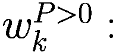：在给定先前策略 ![$${S}^{old}\left[y\right]$$](img/524458_1_En_6_Chapter_TeX_IEq11.png) 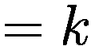 和 P > 0 的情况下，在 ![$$S\left[y\right] = 1$$](img/524458_1_En_6_Chapter_TeX_IEq8.png)、![$$S\left[y\right] =1$$](img/524458_1_En_6_Chapter_TeX_IEq9.png) 或 ![$$S\left[y\right] = 0$$](img/524458_1_En_6_Chapter_TeX_IEq10.png) 之间选择新策略的概率。

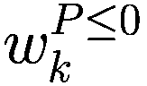：在给定先前策略 ![$${S}^{old}\left[y\right] = k$$](img/524458_1_En_6_Chapter_TeX_IEq17.png) 和 P 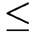 0 的情况下，在 ![$$S\left[y\right] = 1$$](img/524458_1_En_6_Chapter_TeX_IEq14.png)、![$$S\left[y\right] =1$$](img/524458_1_En_6_Chapter_TeX_IEq15.png) 或 ![$$S\left[y\right] = 0$$](img/524458_1_En_6_Chapter_TeX_IEq16.png) 之间选择新策略的概率。

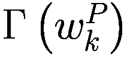：基于概率 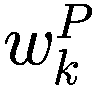 输出 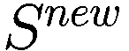 的函数。

**如果** 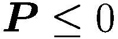 **那么**

**对于** y 在 ![$$\left[{T}_{s},{D}_{s},G\right]$$](img/524458_1_En_6_Chapter_TeX_IEq23.png) **循环执行**

**如果** ![$${{\varvec{S}}}^{{\varvec{o}}{\varvec{l}}{\varvec{d}}}\left[{\varvec{y}}\right]=1$$](img/524458_1_En_6_Chapter_TeX_IEq24.png) **那么**

![$${S}^{new}\left[y\right]=\Gamma \left({w}_{1}^{P\le 0}\right)$$](img/524458_1_En_6_Chapter_TeX_IEq25.png)

**否则如果** ![$${S}^{old}\left[y\right]=0$$](img/524458_1_En_6_Chapter_TeX_IEq26.png) **那么**

![$${S}^{new}\left[y\right]=\Gamma \left({w}_{0}^{P\le 0}\right)$$](img/524458_1_En_6_Chapter_TeX_IEq27.png)

**else if** ![$${S}^{old}\left[y\right]=-1$$](img/524458_1_En_6_Chapter_TeX_IEq28.png) **then**

![$${S}^{new}\left[y\right]=\Gamma \left({w}_{-1}^{P\le 0}\right)$$](img/524458_1_En_6_Chapter_TeX_IEq29.png)

**end if**

**else if** 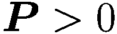 **then**

**for** y in ![$$\left[{T}_{s},{D}_{s},G\right]$$](img/524458_1_En_6_Chapter_TeX_IEq31.png) **do.**

**if** ![$${{\varvec{S}}}^{{\varvec{o}}{\varvec{l}}{\varvec{d}}}\left[{\varvec{y}}\right]=1$$](img/524458_1_En_6_Chapter_TeX_IEq32.png) **then**

![$${S}^{new}\left[y\right]=\Gamma \left({w}_{1}^{P&gt;0}\right)$$](img/524458_1_En_6_Chapter_TeX_IEq33.png)

**else if** ![$${S}^{old}\left[y\right]=0$$](img/524458_1_En_6_Chapter_TeX_IEq34.png) **then**

![$${S}^{new}\left[y\right]=\Gamma \left({w}_{0}^{P&gt;0}\right)$$](img/524458_1_En_6_Chapter_TeX_IEq35.png)

**else if** ![$${S}^{old}\left[y\right]=-1$$](img/524458_1_En_6_Chapter_TeX_IEq36.png) **then**

![$${S}^{new}\left[y\right]=\Gamma \left({w}_{-1}^{P&gt;0}\right)$$](img/524458_1_En_6_Chapter_TeX_IEq37.png)

**end if**

**end if**

### 6.3.5 模仿

模仿过程相对简单：代理以巴拉巴西-艾伯特图连接，其中财富较大的节点也是度较高的节点。每个时刻，代理将检查其一度邻居并调整其参数以类似于其较富裕的邻居。

Let:

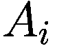: i-代理

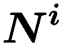: i-代理的邻居集合

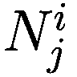: j-邻居代理的 i-代理

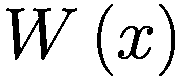: 元素的净值 × （一个代理或一个邻居）

G(x): 元素的贪婪程度 × （一个代理或一个邻居）

T(x): 元素的真实视野 × （一个代理或一个邻居）

D(x): 元素的趋势视野 × （一个代理或一个邻居）

deg(x): 节点关联的元素的度 × （一个代理或一个邻居）在网络中

V: 模型中的代理数量

**for** 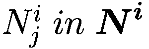 **do**

**if** 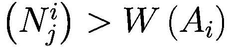 **then**

**if** 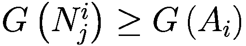 **then**

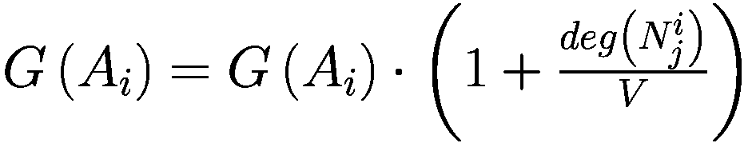

**else**

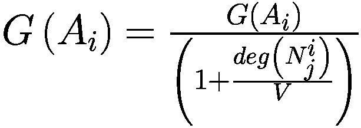

**end if**

**if** 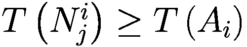 **then**

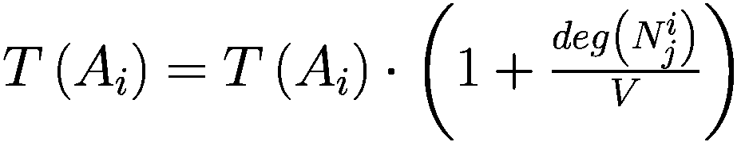

**else**

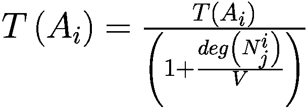

**end if**

**if** 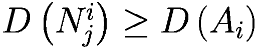 **then**

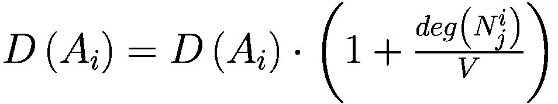

**else**

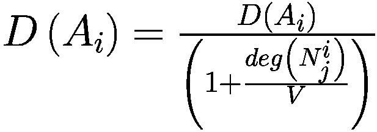

**end if**

**end if**

### 6.3.6 结果和评论

当观察决策参数的平均值（真视力和趋势视力）时，我们注意到在某些时刻，人口更倾向于遵循一种定价策略，其中股票的基本价值（真实价值）在决策过程中的权重大于趋势（趋势价值），反之亦然。这相当于说，在采用的策略方面不存在收敛。然而，当我们抑制模仿或学习机制中的任何一个时，这种现象完全消失。这使我们认为，要获得非平凡的模型，我们需要同时使用这两种机制，以观察投资者类型的出现。

从对行为参数时间序列进行 K 均值聚类分析中得到的其他有趣结果。我们发现随着时间的推移，存在 3 个主要不同的行为集群，这是整个模拟的目标，找到动态投资者类型。转化为现实世界，这就像是确定在其中参与交互（模仿机制）并根据以前的表现改变其策略的市场变化中类似反应的投资者群体。

## 6.4 结论

ABM 是一种强大而创新的工具，其理想用途是解决难以通过自上而下方法解决的问题。将金融市场视为复杂系统使其成为 ABM 显而易见的应用领域。然而，与 ML 不同，后者已经展示了令人期待的实际应用，目前 ABM 似乎主要在学术界提供其大部分成果，尤其是用于描述市场中发生的社会现象。这使我们认为我们对这种建模技术仍处于早期阶段，因此还有很大的改进和创新空间。我们的模型也是如此。一个对投资者动态聚类和模拟与学习在金融市场建模中作用的早期研究。

总之，我们可以说，虽然 ABM 仍在等待摆脱学术界，但其用处不可否认，金融世界只会从中受益。
