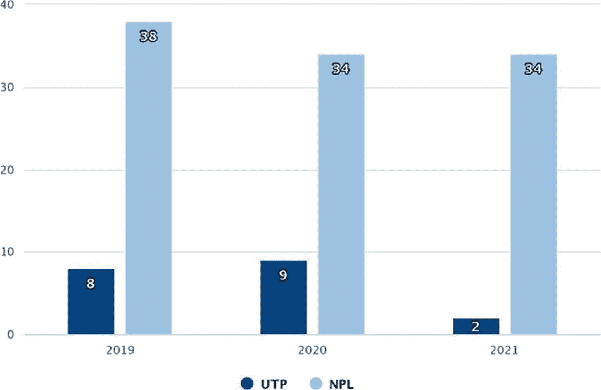
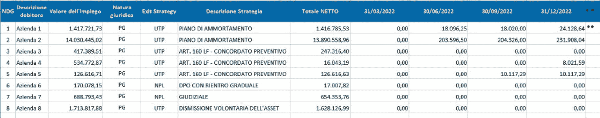

# 第八章： 用于定价困境资产 UTP 和 NPL 贷款组合的人工智能工具

Alessandro Barazzetti^(1  ) 和 Rosanna Pilla^(2  )(1)QBT Sagl，Via E. Bossi 4，6830 Chiasso，瑞士(2)Reacorp Sagl，Via E. Bossi 4，6830 Chiasso，瑞士 Alessandro Barazzetti（通讯作者）Email: alessandro.barazzetti@qbt.chRosanna PillaEmail: rosanna.pilla@reacorp.ch

## 摘要

非 performing 曝光是一种资产金融类别，通过转让操作在自由市场上交易大量来自银行的贷款。因此，信用增强问题在信贷购买过程中变得至关重要。在这项研究中，我们描述了一种基于人工智能算法和计算方法而非传统计量经济学的非 performing 曝光价值评估方法。以下方法已针对意大利非 performing 曝光市场进行了研究，因为在规模、法律和技术房地产方面具有独特特征。

关键词非 performing 曝光贷款评估人工智能金融科技商业计划群集树分析专家系统现金流 Alessandro Barazzetti

米兰理工大学航空工程师，卢德斯离校医科大学教授和飞行员，是 QBT Sagl 公司的所有者，该公司在金融科技和房地产科技领域开发算法和软件，并且是 Science Adventure Sagl 公司的所有者，该公司专门从事应用于健康与护理和航空航天领域的人工智能解决方案和先进项目。 Alessandro 还是 SST srl 公司的创始人，该公司致力于可持续性研究和认证，以及 Reacorp Sagl 公司，该公司致力于金融科技和房地产科技服务。

Rosanna Pilla

是一位律师；她选择巩固自己在银行和金融法律、信贷重组、执行和回收程序方面的技能。精通动态管理和增强房地产担保品、尽职调查和证券化、信用转让、担保和非担保信用组合的业务计划的准备和实施、非 performing 贷款和 UTP 信用。一个年轻专业人士组成的团队的团队领导，该团队已经进行了各种尽职调查活动，包括销售 NPLS 信用组合和 FIA 基金的设立。她有兴趣关注新技术用于数据分析和增强的发展和应用。Rosanna 是意大利执行协会（TSEI Association）—意大利执行研究组的成员，也是 Reacorp Sagl 公司的创始人，这是一家致力于金融科技和房地产科技服务的瑞士公司。

## 8.1 非 performing 贷款

不良贷款（欧盟法规 2013）是指银行业信贷头寸，债务人已无法履行支付。债务人陷入破产状态，信贷被归类为不良，成为不良信贷风险或 NPE。根据债务人上次向授信机构支付的月数，确定了三种不同类型的 NPE。

每种类型都对应着明确的会计履约和利息及费用计算，直至通过法院拍卖机制进行强制回收信贷的司法程序。

不良信贷风险的类型按照上次支付时间的顺序确定如下：

1.  1.

    透支和/或逾期信贷风险

1.  2.

    不良信贷风险（UTP）

1.  3.

    不良贷款（坏账）。

NPE 头寸的分类是由欧盟通过欧洲银行业监管局（EBA）发布的一项法规（《欧洲中央银行》2017）根据欧洲法规（EBA/GL2016）进行的。

不良信贷风险的位置也根据与信贷相关的担保类型进行区分：因此，我们有具有抵押担保的贷款的不良贷款（担保贷款）和没有抵押担保的贷款（无担保）。

担保头寸，抵押担保由债务人的房地产资产组成：因此，这些是通过法院通过财产拍卖程序便于回收的不良贷款。

另一方面，无担保贷款是根据发放的信贷类型来区分的：我们有金融、商业和银行性质的信贷。

另一个重要区别在于债务人类型。信贷可以发放给个人或法人实体。债务人类型在回收法律行动中尤其具有影响：对于法人实体，欠款的司法回收通过破产执行程序（即破产）进行，而对于自然人则是个人执行（即查封）。

此外，法人实体的信贷金额通常高于自然人。

本研究将重点关注意大利 NPE 信贷市场，因为这是一个庞大的市场，同时也与法律信贷回收活动的复杂性以及用作信贷抵押品的房产的特殊性相关。

## 8.2 不良贷款市场规模

作为不良信贷风险分类的银行信贷头寸市场在整体量和信贷头寸数量方面都具有相当规模。

截至 2021 年底，意大利的不良贷款存量为 3300 亿欧元，其中不良贷款头寸 2500 亿欧元，被归类为 UTP 的头寸 800 亿欧元（《市场观察》2021）。

预计考虑到当前经济危机，在 2023 年至 2026 年的三年期间将出现强烈的影响，这主要由于高通胀率影响了该国的实体经济。

先前指出的数字中，75%是公司贷款，70%是有房地产担保（有担保）的贷款。

2021 年的 NPE 交易额约为 360 亿欧元，NPLS 为 340 亿欧元，UTP 为 20 亿欧元，分别占 80%的公司贷款和 50%的房地产抵押贷款（图 8.1）。

2019 年至 2021 年间以十亿欧元计的 UTP 和 NPL 销售的分组条形图。所有 3 年的 UTP 数据分别为 8、9 和 2。所有 3 年的 NPL 数据分别为 38、34 和 34。

图 8.1

过去三年间的 NPE 组合销售额，以十亿欧元计

## 8.3 信贷和信贷组合的估值

不良贷款或 NPE 通过信贷证券化过程（意大利银行 2017）由投资基金通过专用目的车辆（SPV）购买。

信贷的购买通过出让行按照当时双方协商的价格进行，采用无追索权的转让方式进行。

无追索转让的替代方案由贡献基金或 FIA 代表，允许转让信贷的银行机构将 NPE 职位转移到封闭基金中。作为交换，出让方按转移的不良贷款金额比例获得基金单位。AIFs 的性质不是投机的。

在这两种情况下，银行可以将单个职位或单个名称分配或贡献给 AIFs，也可以将整个贷款组合分配给 AIFs，这些贷款组合也汇集了大量的债务人。

信贷或投机性贡献值的购买价格由估计信贷回收预测确定，这被称为转让交易的商业计划。

让买方确定回收预测并因此起草商业计划的活动称为信贷尽职调查，包括分析单个 NPE 职位。

买方收集的信息集合由卖方提供，并由计量经济模型用于制定回收预测或商业计划。

通常，买方依赖于专门从事技术法律咨询的公司进行尽职信贷尽职调查：这些公司拥有法律、财务和房地产分析方面的专家人员。

另一方面，在 AIFs 的情况下，贡献机构依靠独立信贷专家的形象。

应收账款的购买价格或贡献价值，无论是单一名称还是整个应收账款组合，都是通过贴现包含在业务计划中的现金流量来确定的，该业务计划代表了信贷回收的预测，根据预期收益率或 IRR。

收益率代表投资者对销售交易的期望。

预期收益率或市场 IRR 根据信贷类型而异，但我们可以指出，对于担保信贷组合，高度投机的投资者方法的基准范围为 11%至 15%。

特别重要的是对 FIA（金融投资者协会）投资运营的收益率定义，我们提醒您，这不具有投机目的。

对于这种类型的交易，预期收益率设定为~3%：该率是根据与 Euribor 的十年平均值和主要银行操作者储蓄存款利率的平均值相关的一系列客观市场参数确定的。

确定信贷或信贷组合购买价格的计量方法基本上是统计方法，基于对债务人描述性属性和信贷性质与收集历史趋势之间相关性的分析。

或者，我们实施了一种基于 AI 方法确定 UTP 信贷回收预测的方法。

## 8.4 不良授信 UTP 信用的 AI 估值方法描述

在本章中，我们描述了一种基于 AI 方法的信贷价值化方法，该方法基于专家系统的构建（Bazzocchi 1988）。

专家系统是指能够复制一个或多个专家行为的程序（Iacono 1991）。

专家系统的创始原则是编写“规则”，这构成了程序知识的基础：这些规则是通过与该领域专家的访谈建立的，借助数据的统计分析来推断通过决策树（1）或使用机器学习解决方案（Woolery 和 Grzymala-Busse 1994）所识别的规律性。

我们的研究重点放在了向个人和法人发放的 UTP 担保和非担保信贷上。

UTP（不良授信未转逾期贷款）信用是指尚未变为不良的贷款：对于这种类型的贷款，债务人已停止偿还债务，但银行尚未将其归类为实际破产。UTP 状况在法律上具有有限的持续时间，并具有两个潜在的退出条件：该职位变为真正的不良贷款或 NPL，或者通过特定的回收策略，它恢复为正常状态。

这两种退出条件确定了信贷回收预测和相关的回收时间框架。

我们用于确定 UTP 信贷估值的程序或算法包括以下流程图，我们将对其进行详细分析：

UTP 职位最初区分为自然人和法人。

如果位置是自然人，则使用的信息是商业性质的。

如果位置是法人，除了法律信息外，还涉及公司的资产负债表数据和行业分析。

这是模型中使用的信息，代表程序的输入（见表 8.1 和 8.2）。表 8.1

用于个人算法的变量列表

| 输入参数 | 输入类型 | 描述 |
| --- | --- | --- |
| GBV | 金额 | A 应付信用 |
| 他支付了多少 | 金额 | B 已支付的信贷 |
| 已发放多少 | 金额 | C 已发放信用 |
| 上次付款时间 | 在您处 |   |
| 物业位置 | 字符串 |   |
| 房地产价值 | 金额 |   |
| 其他担保 | 是   否 |   |
| 担保人 | 是   否 |   |
| 平均安装金额 | 金额 |   |
| 从 UTP 收集 | 是   否 | 转换为 UTP 后的收集 |
| 工作 | 是   否 |   |
| 薪水 | 金额 | F 薪水金额 |
| 工作类型 | 下拉菜单 |   |
| 职业 | 下拉菜单 |   |
| 婚姻状况 | 下拉菜单 |   |
| 新娘是否工作 | 是   否 |   |
| 儿子 | 是   否 |   |
| 可用的 | 是   否 |   |
| 特殊 | 是   否 |   |

表 8.2

用于法人算法的变量列表

| 输入参数 | 输入类型 | 描述 |
| --- | --- | --- |
| GBV | 金额 | A 应付信用 |
| 他支付了多少 | 金额 | B 已支付的信贷 |
| 已发放多少 | 金额 | C 已发放信用 |
| 上次付款时间 | 在您处 |   |
| 物业位置 | 字符串 |   |
| 房地产价值 | 金额 | d |
| 其他担保 | 是   否 |   |
| 担保人 | 是   否 |   |
| 平均安装金额 | 金额 | AND |
| 从 UTP 收集 | 是   否 |   |
| 行业 | 下拉菜单 | 公司的商品行业 |
| 活跃度 | 金额 | 预算项目 |
| 被动 | 金额 | 预算项目 |
| 成员 | 是   否 |   |
| 激活 | 是   否 |   |
| 可退还金额 | 是   否 |   |
| 特殊 | 是   否 |   |
| 重新融资分析 | 下拉菜单 | 从 1 到 10 的指数 |

按图 8.2 中的方案，第一次分析包括确定位置是否仍为 UTP 或将变为 NPL。

6 步骤的流程图。1、UTP 借款人分为公司和个人。2、公司分为法人、资产负债表和市场分析。个人流程个人分析。3、所有分析汇总成恢复策略。4、恢复策略分为 NPL 司法和 UTP 表现。5、UTP 分为 7 类别。6、NPL 和 UTP 类别合并为业务计划。

图 8.2

流程图

使用输入参数，通过集群树分析对两个 UTP 信贷组合进行了如下分析（见表 8.3）。表 8.3

用于分析 NPL 与 UTP 职位的投资组合

| 投资组合 ID | GBV €（〜） | 借款人数量（〜） |
| --- | --- | --- |
| 投资组合 A | 12,000,000.00 | 30 |
| 投资组合 B | 55,000,000.00 | 25 |

分析结果使得能够确定每个参数在确定从 UTP 到 NPL 转换概率时的正确权重。

如果职位变为 NPL，则估值变为司法估值，并涉及对应收账款价值的折扣，折扣率为价值的 80%，恢复时间平均为 5.3 年（法院审理时间研究 2022）。

如果职位仍然是 UTP，则需要定义从 UTP 状态向执行或无论如何都要进行庭外和解的最有可能的退出策略。

在这种情况下，为了确定恢复预测，需要计算非司法 UTP 解决方案的最有可能策略，其可分类如下（表 8.4）。表 8.4

个体法人退出 UTP 条件的策略

| 退出策略 | 描述 |
| --- | --- |
| 资产出售 | 协商的资产出售 |
| DPO | 即使有后期或渐进式归还计划，也可以自愿处置 |
| 根据第 67 条的 DPO | 带有 DPO 的恢复计划 |
| 第 67 条 lf-恢复计划 | 恢复计划 |
| 第 182 bis 条. 重组 | 法律重组计划 |
| 第 160 条 lf-法律协议 | 法律协议 |

为了确定表 8.5 中的恢复策略，对于保持 UTP 状态的职位，我们使用了插入信贷恢复预测计算程序中的一组规则。表 8.5

个人退出 UTP 状态的策略

| 退出策略 | 描述 |
| --- | --- |
| 资产出售 | 协商的资产出售 |
| DPO | 即使有 DPO 或渐进式归还计划，也可以自愿处置 |

专家系统由具有不同背景的信贷专家组成：我们组建了一个由两名律师、一名精通预算分析的经济学家和一名房地产技术专家组成的团队。

工作组制定了定义各种策略激活条件的规则，与输入变量相关。

特别提及与行业分析相关的参数。所谓的行业是指公司属于通过 ATECO 代码（ATECO 2007）定义的精确产品类别。通过行业研究的分析（ISTAT 2021），专家组为能够产生国内生产总值的行业的每个产品组分配了正分数，而对于在当前宏观经济条件下存在衰退前景的行业则分配了负分数。

同样地，根据对表 8.3 中所列公司财务报表分析的具体规则，定义了与公司可融资性相关的公司融资能力规模。

对法人实体的财务报表进行分析是制定确定最可能的信贷回收策略规则的最重要因素。

因此确定的规则适用于输入的参数，并采取以下形式 (Table 8.6).Table 8.6

规则示例

| 规则 | 策略 |
| --- | --- |
| 若第一抵押（实质性） = 是 并且 D > A | 自愿出售资产 |
| 若 (第一抵押（实质性） = 否 (或空) 或 无抵押 = 是) 并且 活跃 > 被动 并且 激活 = 是 | 即使有岗位或逐步回归计划，也会自愿处置 |
| 若活跃 > (被动 + 容差 * 被动) 并且 D > 0 | 自愿出售资产 |
| 若活跃 > (被动 + 容差 * 被动) | 即使有岗位或逐步回归计划，也会自愿处置 |
| 若活跃 <  = A 并且 活跃 > 被动 | 根据法律 67 lf 执行的复苏计划 |
| 若被动 > 活跃 并且 (A < 被动 + 容差 * 被动 并且 A > 被动—容差 * 被动) | 第 160 lf 条—法律协议 |
| … | … |

然后，每种策略都与基于规则的回收预测相关联 (Table 8.7).Table 8.7

用于法人实体的策略改进

| 退出策略 | UTP 回收金额 |
| --- | --- |
| 资产出售 | 金额 = (min A; D) * % 折扣 1 |
| DPO | 金额 = A * % 折扣 2 |
| … | … |

通过对表格 8.3 中的信贷组合数据库进行统计分析确定的 DiscountN 百分比已经在多年内产生了收据。

结果在表 8.8 中突出显示。Table 8.8

百分比和个别策略相关的回收值

| 策略 | 容差 (%) | 折扣百分比 (%) | 回收年限 |
| --- | --- | --- | --- |
| 自愿出售资产 | 10 | 90 | 3 |
| 即使有岗位或逐步回归计划 |   | 80 | 5 |
| 根据法律 67 lf 执行的复苏计划 | 10 | 80 | 4 |
| 第 67 lf 条—复苏计划 | 10 | 70 | 3 |
| 第 182 bis 条.—法律重组计划 | 20 | 50 | 5 |
| 第 160 lf 条—法律协议 | 30 | 60 | 4 |

因此制定的信贷增值可以生成信贷组合的业务计划，为每个位置分配:

+   将 NPL 过渡到 UTP 或保持在其中的归因

+   如果是 NPL，则策略是司法

+   如果是 UTP，则根据规则确定最可能的回收策略

+   对于所选的策略，根据统计计算的折扣百分比以及年度回收时间，确定回收预测。

结果是一个业务计划，如图 8.3 所示。

一个包含 11 列和 8 行数据的表格。列标题用外文提及，2022 年的 4 个日期分别是 3 月 31 日、6 月 30 日、9 月 30 日和 12 月 31 日。

图 8.3

UTP 信贷组合业务计划示例

文档的每一行代表一个债务头寸，其中提供了信贷价值或 GBV、法律性质、退出条件（作为 NPL 或 UTP）以及与相关的现金流预测和购买价格或折现的贡献值计算有关的回收策略。参考利率。

## 8.5 模型验证

使用所描述算法的程序对信贷投资组合进行估值处理的结果经过了与专家组的专家手动并行进行的估值测试的验证。这一活动使得价值规则得以巩固。

随后，在已知单个头寸的策略和回收的贷款组合的估值上进行了回测。从 UTP 条件的确定以及从 UTP 条件的退出策略方面来看，可靠度程度证明极高，如表 8.9 所示。表 8.9

与实际情况相比模型的误差

| 投资组合 ID | GBV € (~) | 借款人数量 (~) | NPL 与 UTP 的错误率 (%) | 策略确定性的错误率 (%) | 回收金额确定性的错误率 (%) |
| --- | --- | --- | --- | --- | --- |
| P tf1 | 24,000,000.00 | 1 | 0 | 0 | 15 |
| ptf2 | 20,000,000.00 | 20 | 10 | 11 | 9 |
| ptf3 | 6,000,000.00 | 2 | 0 | 50 | 20 |
| ptf4 | 30,000,000.00 | 40 | 6 | 7 | 6 |
| ptf5 | 8,000,000.00 | 20 | 4 | 6 | 5 |
| ptf6 | 14,000,000.00 | 15 | 9 | 9 | 8 |
| ptf7 | 60,000,000.00 | 25 | 11 | 10 | 9 |

## 8.6 结论

基于专家系统的信用增强系统的使用具有将信贷回收过程的物理现象解释以透明和可验证方式的优势。规则可以随着时间的推移进行经验测试，以检查其描述的物理现实的遵循程度。此外，随着环境条件的变化，可以随时添加新规则。特别是，对新的监管义务或对宏观经济参数应用的考虑。

在实际信贷组合上应用模型使我们能够测试该方法，并在各种交易中验证其正确性，取得了令人满意的结果。
