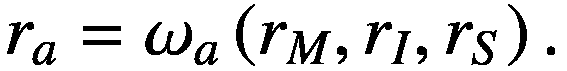
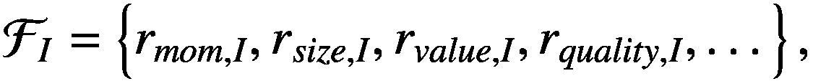
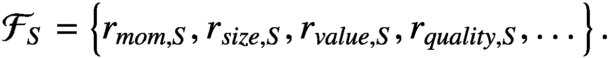
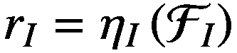
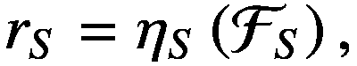
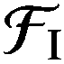
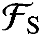
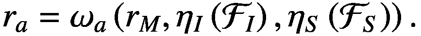
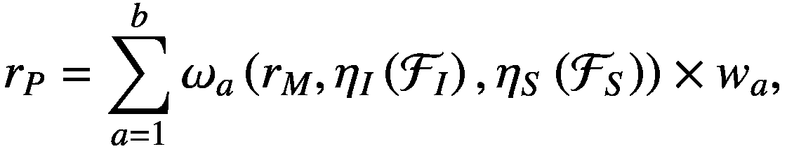
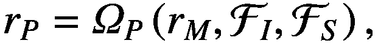

# 第一章：介绍

Thomas Barrau^(1  ) 和 Raphael Douady² (1) AXA Investment Managers Chorus Ltd，中国香港，香港特别行政区。(2) 经济中心，巴黎索邦大学，法国巴黎。

## 摘要

随着多模型被引入作为一种人工智能技术来预测金融市场，我们开始本书，提出一个简单的框架来产生这些预测。我们从简明的文献回顾股票回报的预测开始。然后介绍一个简单的模型，并解释如何对模型的贡献实际上与对文献的贡献相一致。最后，我们制定了本书的计划，回答了有关金融市场预测文献的每个不同点。

关键词：多模型理论、预测框架、建模、股票市场、金融市场。

## 1.1 金融市场预测：简明文献回顾

首次提出对金融市场进行预测的可能性是由巴舍利埃 (1900) 提出的，他使用随机漫步模型来描述商品和股票价格的变化。按照随机漫步对金融市场进行建模意味着有效市场假说的有效性（参见 Samuelson，1965），该假说认为资产价格反映了所有可用信息，导致无法预测价格变化（Fama，1965）。这些在当时无可争议的开创性工作现在部分地被来自不同领域（如经济学、应用数学和心理经济物理学）的大量文献所无效化，这些文献从各种不同角度探讨了金融市场的预测问题。

尽管追求“战胜市场”的目标可能有几种方法，但或许最明显的方法之一是简单地预测给定股票指数的回报。

经济学家们提出使用各种宏观经济变量作为市场回报的预测因子。尽管他们的研究可能存在某种形式的过拟合，但 Rapach 等人 (2010) 表明，这些变量的预测组合可以持续预测市场。此外，他们的结果基于样本外数据，因此指向了股票溢价的宏观经济根基的结构稳定性。在随后的研究中 (Neely 等，2014)，这种宏观经济方法通过使用基于趋势、动量和成交量的技术指标来完善。

其他人则专注于分析极端市场事件：崩盘的预测。遵循受物理启发的方法，¹ 索内特（Sornette）开发了一种基于在价格中识别幂律趋势的模型，这不可避免地导致了一个不可持续的泡沫，从而导致了崩盘（Johansen 等人，2000；Sornette，2009）。市场崩盘也曾被使用各种基于相关性的方法预测过（例如见 Patro 等人，2013；Zheng 等人，2012；Douady＆Kornprobst，2018；Harmon 等人，2011)。²

所有这些预测方法，无论它们是集中在预测普通还是极端事件，即使它们使用非常不同的方法，都有一个共同的目标：提供关于未来市场回报的可靠预测。

然而，即使在样本内，市场回报也提供不了每只股票回报方差的充分描述。已经证明行业成分也很重要（King，1966），而股票回报的特定成分，即不依赖于市场或行业的部分，更加重要（Roll，1988）。

就像市场回报一样，行业回报也被证明是可预测的，例如利用动量异常，该异常表明过去的高（低）行业回报会在未来跟随着高（低）的行业回报（O’Neal，2000）。由于存在多个行业，也可以通过利用行业特征以横截面方式预测行业回报（Asness 等人，2000）。在这篇论文中，Asness 还证明了可以进行特定回报的横截面预测，然而，大多数专注于股票回报横截面的论文并没有控制行业曝光。

这个文献中最重要的里程碑可能是法玛和弗伦奇（Fama and French）的开创性论文（1993），该论文介绍了一个解释股票回报横截面的三因子线性模型。同样的两位作者在 2015 年完成了这个模型（Fama & French，2015），引入了一个五因子模型，考虑了公司的 beta（对市场回报的敏感性）、公司规模（市值）、价值因子（账面市值比）、（运营）盈利能力以及其投资模式（公司的积极与保守的投资行为）。尽管这不包含在模型中，动量异常也是股票回报横截面的一个重要解释因素（见 Carhart，1997；Jegadeesh＆Titman，1993）。

描述股票回报横截面的这种线性多因子模型的方法已经被扩展到文献中现在认可的几十甚至上百个因子（见例如格林等人（2014）和侯等人（2017）对不同因子可靠性的评估）。它也塑造了资产管理行业，即所谓的“风险溢价”³ 基金往往作为新的资产类别出现，以被动方式投资于这些因子（本德等人，2014）。曾被称为“alpha”的东西，按照詹森（1968）的意义，现在被简单地视为风险因子，使得这些策略可与“beta”投资进行比较，即在市场上进行被动投资。随着预测（“定时”）市场的方法的出现，最后产生了一本关于定时风险因子回报的文献（见本德等人，2018; 阿斯尼斯等人，2017）。

## 1.2 投资组合回报的简单模型

最终，尽管它们依赖于非常不同的方法，上述作品都旨在对未来的股票回报产生预期。然而，在撰写本文时，据我们所知，文献中并不存在将所有这些类型的预测结合起来的单一框架。我们在下面提出了这样一个简单的、描述性的模型。请注意，该模型的目标是效率。它不旨在提出股票回报的经济解释。

我们首先回到罗尔（1988）提出的股票回报的三个主要组成部分的区分。

这种区分可以通过以下公式正式化：(1.1)*在这里，r*[*a*] *是给定股票“a”的股票回报，而 r*[*M*]*、r*[*I*]*和 r*[*S*] *分别是市场回报、行业回报和该股票的特定回报。请注意，在这个阶段避免了函数ω*[*a*]() *的定义，以便通用性。*

从文献中可以明显看出，行业和特定回报可以分别通过行业和公司特征（规模、价值、质量等）的横截面来解释。根据法玛和弗伦奇（1993、2015），对于每个特征，我们可以形成一个投资组合，使得股票回报可以表示为因子投资组合回报的函数。

例如，我们可以创建一个投资于动量异常的投资组合。如果构建为多空头，这个投资组合将做多过去的赢家，做空过去的输家，并在一定程度上可能中和市场收益的暴露。此后，我们将这个动量因子投资组合的收益称为“*r*[*mom*]”。注意，该投资组合可以使用相同的股票构建，以便仅投资于行业或特定收益的横截面。事实上，我们可以通过适当的多空头构建来中和一个投资组合的行业暴露或其特定暴露（参见 Asness 等人，2014 年的一个这样的投资组合构建示例）。因此，我们采用名称“*r*[*mom,I*]”来表示通过行业横截面投资于动量异常的投资组合的收益，同时在特定级别中是中和的。类似地，“*r*[*mom,S*]”指的是通过特定收益横截面投资于动量异常的投资组合的收益，同时在行业级别中是中和的。

在文献中发现了许多异常，无论是在行业层面还是具体层面上都有。我们将所涉及的行业和具体因素（已知和未知）定义为*所有*相关因素的集合，如下所示：(1.2)假设这些因素能够完全描述行业和公司特征，我们可以将(1.3)和(1.4)其中和 使用它们关联的函数 *η*[*I*] 和 *η*[*S*] 组合以形成行业和特定回报。 将这些代入方程 (1.1) 得到(1.5)注意，如果我们将每个股票回报表示为几个因素组合的回报，我们还可以将投资组合“*P*”，由总数为 *b* 的股票组成，表示为因素组合。 因此，这样一个投资组合的回报将是：(1.6)其中 *w*[*a*] 是投资组合中股票“*a*”的权重。 个体组合函数 ω[*a*] 的加权和仅仅是一个面纱，掩盖了我们最终投资于因素组合的事实，我们可以将投资组合的回报重写为：(1.7)其中 *Ω*[*P*] 是用于构建投资组合 *P* 的子投资组合的组合函数。 *Ω*[*P*] 的适当定义将在一定程度上反映出通过组合函数 *ω*[*a*]、*η*[*I*] 和 *η*[*S*] 捕获的因素之间的加权（可能是非线性的）。

然而，遵循平均股票分解将导致一个静态暴露于不同因素的回报的投资组合。最大化 *r*[*p*] 需要根据某种标准动态调整曝光，以便从时机调整因子表现中获益。例如，如果我们从市场定时策略中得到市场即将进入熊市期的信息，我们应该做空市场投资组合。因此，适当定义的组合函数将能够确定因子投资组合的适当比例以及时间其表现。

我们在下文提出了一个基本示例，展示了一个投资于众所周知因子的投资组合的回报，遵循了 omega 的简单线性规范：

+   识别未知因素，称为“阿尔法”，解释行业或特定回报。

+   通过因子或市场定时来确定子投资组合的表现。

+   正确组合不同的子投资组合，即在 omega 中正确定义权重。

本书通过使用多模型对这三个来源做出贡献，从而为金融市场预测文献增添了一笔。

## 书籍计划

我们提出了新的方法来预测金融市场。如前所述，这些方法主要基于多模型理论，这是一种被归类为人工智能方法的非线性分析框架。本书由八章组成：引言；两章介绍技术；四章应用这些技术进行应用；以及结论。

由于它们最近才出现在文献中，多模型在本书的第二章中有所描述。虽然保持相当一般性，我们解释了这种方法的总体利益，该方法允许减少过度拟合并同时增加精度，与标准多变量替代方案相比。

第三章致力于我们用于多模型的估计方法，称为“线性非线性混合”（LNLM），该方法使用交叉验证来正则化模型的非线性部分。我们在这一章中通过大量的模拟考虑了 LNLM 模型的理论性能。

第四章描述了将 Polymodel 理论应用于市场定时的一个应用。我们在这一章中看到，多模型允许以一种非平凡的方式捕捉市场与其经济环境之间的相关结构，从而导致对市场回报方向的预测信号。

第五章考虑了行业回报的预测。虽然我们没有直接使用多模型，但我们仍然依赖于 LNLM 进行非线性建模，揭示出非线性在行业横截面中是被定价的，以一种反脆弱因子的形式。该因子被证明是可投资的 alpha。

第六章讨论了特定回报的预测。我们提出使用多模型直接预测特定回报，并提供了在聚合多个多模型预测时考虑预测变量相关性的技术。我们获得的预测被证实为一个重要的信号。

在第七章中，我们将预测市场、行业和特定回报的信号组合成一个单一的投资组合。这种组合是使用另一种人工智能方法进行的，即遗传算法，使我们能够最大化最终投资组合的回报，扣除交易成本。

总结章节总结了结果。
