# 第二章：多模型理论：概述

Thomas Barrau^(1  ) 和 Raphael Douady²(1)AXA 投资经理 Chorus Ltd，香港，中国香港特别行政区(2)巴黎索邦大学经济中心，法国巴黎

## 摘要

我们提出了多模型理论，将多模型定义为*一组非线性单变量模型*。我们提出了数学公式和认识基础。我们解释了多模型在几个方面是传统 OLS、岭回归和逐步回归等估计的多元回归的一个优越替代；我们还介绍了这种方法的局限性。尽管它是一种回归技术，但我们阐明了多模型框架如何比传统统计学更接近人工智能。

关键词多模型理论人工智能机器学习单变量回归多元回归非线性建模高维建模过拟合

## 2.1 引言

多模型，理解为*一组非线性单变量模型*，是由 Coste 等人(2010) 在金融领域引入的。在他们的论文中，多模型被用作预测对冲基金绩效的整体程序的一部分。因此，尽管概念相当通用，但论文以简洁方式呈现，因为其目的是专注于其应用结果。因此，当前章节的目的是更深入地讨论多模型理论，以便了解这种技术的利弊，以及其提供的框架的可能性。

一组单变量模型的使用必须被理解为对多元回归模型的一种替代。因此，从这个角度来看，多模型的利益在当前章节中得到了广泛解释。然而，我们通过多模型来处理建模的方式在某种程度上与统计学的标准视角有所不同，因为它更接近人工智能。为了让读者理解我们提出的观点，我们需要回到建模目的的问题。

对于阿里斯（1994），“一个方程组Σ被称为是典型系统 S 的模型，如果它被构建来表达 S 的定律，并且其解决方案意图代表 S 行为的某个方面”。这个相当静态的定义被戴维斯等人（2011）补充，他们提出了模型被构建的目的列表，其中包括“影响进一步的实验或观察”。这个最后的目标是理解我们立场的关键。由于它被设计来解决金融领域遇到的问题，Polymodel 理论属于应用数学领域，因为我们的重点是“找到应用于自身利益之外的数学”（参见戴维斯等人(2011）再次说明这个定义）。Polymodels 不仅是一个观察和表示（金融系统的某些子部分）的工具，还旨在作为其中的从业人员、交易员和风险管理人员，从而改变系统。基本上，我们对建模的方法是通过追求在现实世界中行动时产生有效结果来导向的。

有了这个目标，我们在下面提出了建模过程的简化、漫画版本。这个表示不打算描述每个研究者遵循的过程，也不是要勾勒出一个方法标准；它只是为了支持我们对建模方法的介绍。我们从拥有一个（或多个）感兴趣的变量的问题开始，这些变量是（部分）随机的，并且我们希望在一个由随机变量组成的环境中进行一些预测。让我们称我们感兴趣的变量为*Y*，组成环境的变量集合为*X*。然后我们可以遵循这个程式化的过程： 

+   步骤 A：研究者制定感兴趣变量的模型命题，作为其环境条件期望。此步骤的目的是对*Y*和*X*之间的联系建模：

![$$ E\left[Y|X\right]=f(X). $$](img/519851_1_En_2_Chapter_TeX_Equ1.png)(2.1)

+   这一步骤可能非常复杂，可能涉及对*Y*和*X*的定义讨论，以及一些复杂版本的*f*()的开发。例如，如果*Y*是一个随机过程，它可能包括一些动态表示：

![$$ E\left[{Y}_t\ |\ {\left\{{X}_s\right\}}_{s\in \left[t-\tau :t\right]}\right]=f\left({X}_t,{X}_{t-1},{X}_{t-2},\dots \right). $$](img/519851_1_En_2_Chapter_TeX_Equ2.png)(2.2)*这里的“t”是当前时间索引，“τ”是 X 的最远重要时间滞后，“s”是定义在 t−τ和 t 之间的第二个时间索引。*

+   第二步：研究模型的统计特性。这一步骤可能包括研究感兴趣变量*Y*的分布以及环境变量*X*的联合分布，但也可能包括研究模型参数*f*()的分布，以量化其不确定性、评估其鲁棒性等。

+   第三步：将模型用于特定目的。这可能是最大化给定效用函数，或者估计风险度量，或者任何能够帮助做出决策的目标。

+   第四步：选择由步骤 A 到 C 产生的最佳模型。评估它们包含的变量、使用的函数形式以及采用的方法，使用性能和相关性度量，例如*p*-值。

可以在第三步引入对模型的某种形式的应力测试（例如使用蒙特卡洛模拟），作为模型验证的一部分，或者在第四步作为选择标准。

由于我们建模以行动，我们的重点完全放在步骤 C 中获得的结果上。

个别研究人员通常关注步骤 A 到 C，而 D 可能被视为与文献在给定主题上的演变相关的元问题。在执行多模型分析时，步骤以不同的方式完成。我们首先估计一组单变量模型，这对应于步骤 A 的重复。然后，我们使用有意义地与步骤 C 的目标相关的标准选择最佳模型，这对应于步骤 D。步骤 D 本身是重复的，因为我们将其用于考虑模型集合随时间的动态演变。我们主要以多维形式保留所获得的信息，这使我们能够导出各种指标（例如 StressVaR (Coste 等人(2010))或 Long-term Expectation (Guan，2019)）。

我们以不精确、简化和次优的方式重复执行步骤 A，但由于模型的多样性，这种简化被克服，因为模型集合是我们所研究现象的非常丰富的表示。让我们通过一个简单的例子来澄清这一点。我们可以用从金融变量获得的非线性单变量模型集合来模拟标准普尔 500 的回报。通常，我们假设模型的噪声是高斯的，这当然是相当简化的，知道金融市场的尾部更厚（参见例如 Platen 和 Rendek (2008)）。然而，例如，对油的非线性建模可能能够在某种程度上捕捉标准普尔 500 的尾部事件。而且对于因子集中的大量独立变量，非线性建模很可能在某个时候捕捉到尾部事件（例如，参见 Ye & Douady，(2019)，以获取使用多模型进行市场回撤预测的示例）。

仍然需要问关于方法鲁棒性的问题，但方式与上述的程式化研究过程有所不同。由于我们完全专注于实现关于步骤 C 的结果，通常在步骤 B 中完成的部分工作可能变得无关紧要。例如，我们可以观察到，从步骤 B 到 C 的过渡没有特定的原因，它甚至在大多数情况下可能是高度非线性的。按照这种推理，追求无偏估计变得无关紧要，因为它们不能有效地用于实现步骤 C 的最终目标。因此，通过敏感性分析或特定测试来评估多模型方法得到的结果的鲁棒性经常是通过统计显著性（见本书第 4、5 和 6 章）的测量来进行的。因此，我们不讨论步骤 B 所解决的问题，尽管它们本身很有趣，但在考虑到将步骤 C 作为中心关注时，它们是次要的。

注意，除了多模型之外，另一个研究领域直接执行步骤 A 和 D，关于步骤 C 的目标：机器学习（Friedman 等人，（2001）提供了对主要技术的长篇介绍）。从这个角度来看，多模型可以被视为一种机器学习技术。

现在，一旦建立了多模型理论建模方法的面包屑，我们可以发展几个进一步澄清概念的要点。为此，我们将本章组织如下：

+   作为介绍的最后部分，我们首先回顾了有关多模型主题的文献的当前研究状况。

+   然后我们正式定义了多模型的概念。

+   这一定义之后，我们讨论了如何从认识论角度解释这个对象。

+   然后，我们回顾了在计量经济学术语中使用该技术时所期望的最显著优势。使用一系列单变量模型是使用多变量模型的一种替代方法。因此，我们将这些优势与标准替代方案进行讨论，例如由 OLS 估计的经典线性回归，岭回归或逐步回归。

+   最后，我们考虑了多模型理论所引发的挑战，并总结了本章。

在实践中使用多模型时引发的一些重要问题是：

+   我们如何估计单变量模型？

+   我们如何选择变量？

+   我们如何合并结果？

当前章节只是提出了 Polymodel 理论的理论概述，因此回答了“什么是 polymodel？”和“为什么使用它？”的问题，但没有回答“如何使用它？”的问题。上述三个简单发展更一般问题“如何使用它？”的实际问题可能会以非常不同的方式来解决，必须根据所处理的经验问题进行调整。因此，介绍我们可以用来回答这些问题的任何技术都会导致当前章节缺乏普遍性。因此，我们将限制我们的解释以呈现 polymodel 的概念。

对于 Polymodel 理论的文献仍然很稀少。目前的形式已经在金融领域有了应用，但是单变量线性模型集合的使用也存在于这个领域之外。

我们首先回顾了关于这个主题的新兴金融文献。除了 Coste 等人 (2010) 的初始论文介绍了这个概念之外，Polymodel 理论已经在金融领域的各种应用中得到了使用：

+   张 (2019) 基于 polymodel 估计构建了一个聚类算法，并应用于股票市场。总体思想是，如果两只股票对不同因素的反应方式相同，它们在某种程度上是相似的。聚类算法被用来设计一种比基准表现更好的统计套利交易策略。聚类算法在统计套利的背景下表现出色，超越了经典的聚类方法（相关性、定性分类）。

+   叶和杜亚迪 (2019)，以及匡和杜亚迪 (2022) 提出了一些基于 polymodel 的股票指数系统风险指标。这些指标主要关注因子集与股票指数之间联系的统计显著性增加（叶 & 杜亚迪）和基本模型的凹性（匡 & 杜亚迪）。

+   关 (2019) 使用 polymodel 生成了一些传统风险溢价的变体。他证明了 StressVaR，这是 Coste 等人 (2010) 用于区分风险对冲基金的风险指标，也是股票收益横截面的一个有用预测因子。

Polymodel 理论的文献仍然稀少，这正好说明了我们提出对这种分析框架进行更密集讨论的建议。当数据量过大无法处理时，构建一组单变量模型是一种相当直观的建模方法，这种情况下多元线性回归可能会有一些限制。的确，由于预测变量的协方差矩阵不可逆（因为预测变量多于观测值），或者出现多重共线性问题，这些问题并不局限于金融领域。毫不奇怪，Polymodel 理论的一些迹象和先例已经在几个学科中找到：

+   在遗传学中，基因组范围关联研究（GWAS）领域大量依赖于 Polymodels 的线性版本。GWAS 面临的问题是要处理数十万个预测变量来预测单个目标变量。此外，独立变量比观测值更多。经典的正则化技术已被用来尝试解决预测变量之间的相关性问题，例如参见 de Vlaming 和 Groenen（2015）的 Ridge 回归，Wu 等人（2009）的 Lasso，或 Liang 和 Kelemen（2008）的文献综述。

+   在对驾驶员致命风险因素进行分析时，Bose 等人（2013）使用一组单变量模型来对多变量模型得到的系数进行基准测试。

+   为了分析流行病，Bessell 等人（2010）从一组单变量模型开始他们的研究。他们利用这个多模型的结果来评估预测变量的统计显著性，以选择最相关的变量来构建多变量模型。

+   Ladyzhets（2019）建议分析一组回归模型的概率空间来建模金融时间序列。虽然与 Polymodels 接近，因为它使用替代模型表示目标变量，但该论文仍然使用多元模型，从而失去了前者的一些好处。

这些最后的例子并没有直接涉及到我们在当前章节中提出的 Polymodel 理论，然而，它们表明了在使用多元回归技术时我们遇到的关注点是多个领域共享的，使得 Polymodels 在金融之外的数学应用中可能是有趣的。

## 2.2 数学公式化

一个 Polymodel 可以被定义为一组模型，它们都同样有效和显著，可以被理解为对同一现实的一系列相关观点的集合。

从数学上讲，可以用方程（2.3）或方程（2.4）等式来等效地形式化：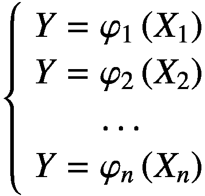(2.3)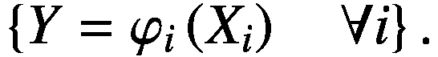(2.4)*这里，Y 是目标变量，X[i]是解释变量，而φ[i]分别是第 i 个模型的函数，其中 i ϵ[1: n]，n 是模型（和因素）的数量。*

我们在这里呈现的*n*个模型，称为“基本模型”，都是单变量模型。这些模型都在解释变量*ℝ*^(*n*)的整个超空间上定义。它们彼此不相互作用，并且它们同时都是有效的。

噪声项*ε*[*i*]被添加以表示随机误差:¹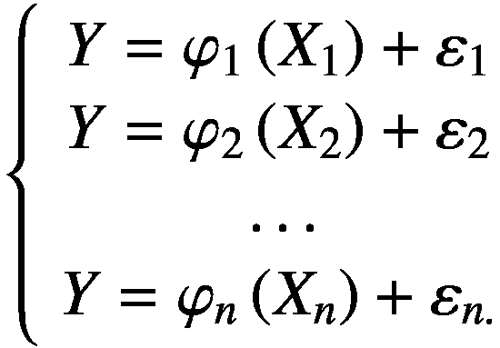(2.5)同样，从方程(2.4)可以得到: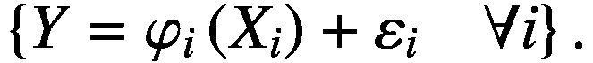(2.6)

## 2.3 认识论基础

多模型理论可以从许多不同的角度来考虑。即使我们明确专注于金融数学的应用，强调导致该理论出现的哲学根源也是很重要的。

### 2.3.1 统计视角主义

视角主义的概念最初由前苏格拉底哲学家普罗泰戈拉斯（约公元前 481 年至公元前 420 年）发展而来，我们通过柏拉图（Lamb，1967；Taylor & Lee，2016）的对话了解到他的思想。视角主义是理解多模型理论的关键，它声称我们无法获得单一和绝对的真理。我们认为真实的东西往往只是从特定视角来看才是真实的，而这种对现实的感知本身取决于它出现的视角。这是一个谦逊地理解我们是有偏见的，对世界的了解和接触是有限的邀请。

人们可以很容易地从帕斯卡在他的《圆锥曲线论文》（Clarke & Smith，1928）中的反思中理解需要在同一问题上使用几个不同视角的必要性：“通过圆锥截面这个术语，我们指的是圆周、椭圆、双曲线、抛物线和直线角”。对于同一对象的所有这些视角都是真实且互补的，因为没有一个能够完全描述圆锥的本质。

因此，在流经视角主义的哲学学说中，现实是我们对其所有视角的聚合。

同样，多模型理论的目的是将同一变量的几个描述组合在一起，以尽可能全面地理解其本质。它提供了对现实的非常丰富的描述，这种描述不仅仅是其部分的总和，还允许我们非常准确地理解所考虑变量的一些特定方面。因此，多模型理论是哲学视角主义的数学等价物。

### 2.3.2 现象学方法

构成多模型的不同基本模型是其感兴趣变量的替代描述。但是这些描述是以一种特定的方式进行的：它们描述了依赖变量对每个自变量的*反应*。

现象学可以如下描述（Smith，2018）：“字面上，现象学是对‘现象’的研究：事物的外表，或者事物在我们的经验中呈现的方式，或者我们经验事物的方式，因此事物在我们经验中具有的含义。”

因此，现象学的焦点是我们的经验中组成的各种现象如何与我们互动。Polymodel 理论提出了类似的方法，通过研究各种独立变量（即环境）如何与感兴趣的变量互动来实现。

这样的立场本身就非常有意义，因为它指出对于因变量的底层机制没有兴趣。Polymodel 只是描述了这个变量在各种情况下的行为，这些情况与解释变量的集合一样完整。它并不解释为什么会发生这种行为，尽管它可以帮助我们理解它。因此，Polymodel 理论更接近于物理学家研究现实的方法，而不是经济学家的方法，因为它主要回答的问题是“怎么样？”而不是“为什么？”。

## 2.4 Polymodels 与多变量模型的比较

### 2.4.1 减少过度拟合

计量经济模型通常包括两个组成部分，一个确定性部分，通常称为均值方程，和一个随机部分，称为误差项（参见斯托克和沃森(2015)以及塞伯和李(2012)的计量经济学导论，或者亚历克索普洛斯(2010)关于多元回归的简洁论文）: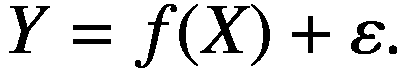(2.7)这里 *Y* 是我们希望解释的随机变量，*f(X)* 是由一组随机变量 *X* 和一个函数 *f* () 组成的均值方程，该函数产生 *Y* 和 *X* 之间的关联，ε 是误差项，通常服从于 0 的某种概率规律。当随机变量 *X* 的集合只包含一个变量时，该模型称为“单变量”，而当它包含多个变量时，则称为“多变量”。将确定性部分（*f(X)*）和随机部分（*ε*）之间的分离是因为我们的世界的自然复杂性，其中通常存在着与发生的现象相关的大量原因，使得每个事件部分不可预测，仅仅因为数学模型目前无法处理如此高的复杂性。这种描述现实的方式暗示了只有一部分目标变量的值可以用预测变量来描述，而其余部分则不能，并且必须保持未解释。假设目标变量与预测变量之间存在有效的联系，则我们的上下文中建模的目标是准确地表示这种关系。这应该通过构建一个表示预测变量与目标变量确定性部分之间关系的均值方程来完成，仅使用包含在预测变量中的关于目标变量的信息。这种关系由一个功能形式来形式化，它是真实关系的一种程式化代理。最简单的功能形式是线性的一个（斯托克和沃森，2015):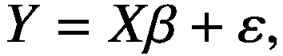(2.8)其中 *β* 是线性系数的列向量，*X* 是一个矩阵，当包含一个常数时包含一个向量，我们假定以后都是这样。以及解释变量的向量。

给定一组特定的数据样本，科学家的任务是选择一个功能形式并估计其参数，以表示这种关系。当然，目标是解释目标变量，良好模型中确定性部分与随机部分的重要性²应尽可能高*。

然而，模型中真正随机的部分，即与预测变量无关的目标变量值部分，总是可以通过预测变量虚假建模。这只是使用足够复杂和适当参数化的预测变量函数的问题。在样本内，这将极大地改善模型的常规拟合度度量，但在这种情况下，我们将对不存在的联系进行建模，因为根据定义，预测变量与目标变量的随机部分之间没有联系。因此，在使用特定数据样本估计模型之后，当使用预测变量的新值（超出原始数据集）来预测相应的目标变量值时，这种不良实践的直接后果就会出现。预测的准确度很低，揭示了初始模型的弱点。

在样本外呈现出高拟合度模型的低预测能力是过拟合的典型定义（Babyak，2004）。

直觉上，我们可以看出，在数据中很容易找到似乎对应于不存在的联系的模式，特别是因为我们通过估计函数形式参数来将这些模式适应于目标变量。

这种描述模型的函数形式，在更复杂的情况下，更容易适应这些虚假模式。这种复杂性取决于参数的数量，并且主要来自两个来源：与每个变量相关的函数形式的复杂性，以及模型中使用的变量数量（Hawkins (2004) 对这些问题进行了深入讨论）。

这就是为什么增加多变量回归中预测变量数量会暴露过拟合风险的原因，以至于像经济计量学家这样的专家会引用约翰·冯·诺伊曼的著名语录而开玩笑：“用四个参数我可以拟合一只大象，用五个我可以让它摇摆鼻子”。当观察数量减少时，这种情况经常发生。事实上，对于给定数量的观察，增加多变量模型中的预测变量数量会减少残差的方差，使模型在拟合度方面变得“更好”，但只是表面上看起来如此。

当预测变量的数量增加到比观察数量更高时，问题变得更加严重。在这种情况下，预测变量的协方差矩阵*X'X*不可逆，导致通常的普通最小二乘线性模型参数估计解决方案失败，定义为：![$$ \hat{\beta}={\left[{X}^{\prime }X\right]}^{-1}{X}^{\prime }Y. $$](img/519851_1_En_2_Chapter_TeX_Equ9.png)(2.9)计算 OLS 估计量所需的矩阵求逆可以看作是要解决的一组方程，而在我们的情况下，解决方案不唯一。因此，这个问题被称为“病态”（Hadamard，1902）。解决这个问题的一个非常常见的方法是使用 L²-范数的系数估计值进行回归正则化（称为岭回归（Hoerl & Kennard，1988）或 Tikhonov 正则化）。请记住，在普通最小二乘中，直线与数据之间的平方差之和被最小化。参数β的估计值，称为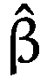，因此是优化问题的解：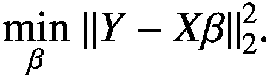(2.10)在岭回归中，L²-范数的惩罚被添加如下：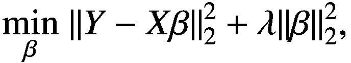(2.11)*这里，“λ”是岭惩罚参数*。导致参数的以下缩小估计值：![$$ {\hat{\beta}}^{Ridge}={\left[{X}^{\prime }X+\lambda I\right]}^{-1}{X}^{\prime }Y. $$](img/519851_1_En_2_Chapter_TeX_Equ12.png)(2.12)*“I”是 n × n 单位矩阵。*

在允许矩阵求逆的基础上，L²-范数的惩罚自动减小了 OLS 估计的系数的大小，从而导致更好的外样本估计（Van Dusen，2016）提出了对这一点的全面概述）。还可以在优化问题中引入 L¹和 L²-范数的惩罚，这种技术称为弹性网络正则化（Tibshirani，1996，另见 Zou 和 Hastie，2005）。当加入 L¹-范数的惩罚时，一些系数会变为零，从而实现对自变量的选择。岭回归和弹性网络回归因此解决了与多模型相同的问题，这是在使用大量变量进行建模时防止过度拟合的替代方法。

然而，在这些方法的大多数应用中，即使在变量选择后，模型的自由度数量仍然非常低，这总是会对结果拟合引起一些疑虑。通过使用多模型，可以轻松解决这个问题，因为每个基本模型中使用单个变量大大增加了自由度的数量。因此，使用多模型提供了一种更简单、更有效的解决这些问题的方法。

为了更好地理解多元模型与多模型相比过度拟合的情况，我们提出通过一个玩具例子来说明我们的推理。为了解决一个熟悉的问题，我们将 S&P 500 的回报建模为一组*n*个预测变量的函数（如方程 (2.7) 中所示，其中*Y*是 S&P 回报）。

为了测试各种方法的虚假性，我们构建了一个包含从自由度为 4 的学生 t 分布中随机抽取的值的预测器集合:³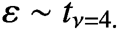(2.13)因此，根据构造，*在我们的实验中，目标变量与预测变量之间没有任何联系*。只有噪声可以适应解释变量。为了得到*f()*，我们比较了三种不同的建模技术：

+   由方程 (2.8) 描述的多元线性模型，使用方程 (2.9) 描述的 OLS 估计器进行估计。

+   使用由方程 (2.12) 描述的 Ridge 估计器进行估计的相同多元模型。对于估计至关重要的参数λ是通过 5 倍交叉验证（参见 Golub 等人，1979）选择的（有关使用交叉验证选择 Ridge 参数的使用）。

+   如方程 (2.5) 中描述的多模型，其中基本模型被定义为使用 OLS 估计的线性单变量模型。

这个简单的设置不包括非线性或变量选择，因此结果仅由多元/单一区分驱动。我们使用 2001-01-01 至 2003-12-31 期间的标普 500 周回报估计了这三种模型的参数，这对应于 157 个观测值。然后，我们为 *X* 生成新值，并使用先前估计的参数将它们与模型化的标普回报模型化为 2004-01-01 至 2006-12-31 期间的情况。当然，我们不指望这些预测中有任何好的结果，实验的目的是反映不同模型被拟合纯噪音的能力。因此，我们通过比较样本内（2001 年至 2003 年期间）的拟合度和样本外（2004 年至 2006 年期间）的拟合度来测量过拟合。拟合度使用 R²来评估，它是总平方和中残差平方和的减法值的百分比: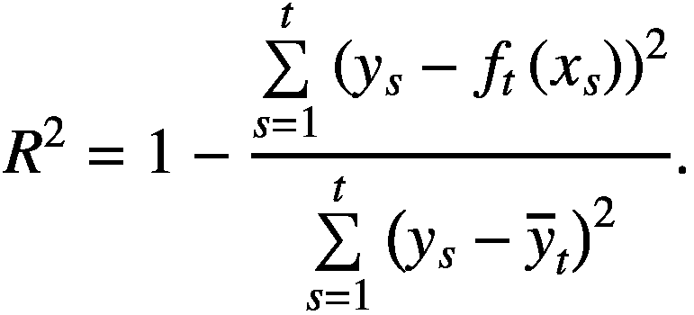(2.14)*这里，“t”是当前时间索引（即 2003 年底），“s”是窗口中滚动时间索引（即它在 01-2001 和 12-2003 之间采用每周日期值），“ 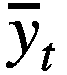”是在 s= 1 和 s=t 之间的目标变量的平均值，“ f*[*t*]*”是使用在日期 t 可用的数据估计的拟合函数。*更确切地说，为了评估过拟合，我们测量“样本外 R²”，它与上面的“样本内 R²”公式相同，但使用样本内系数和样本外数据: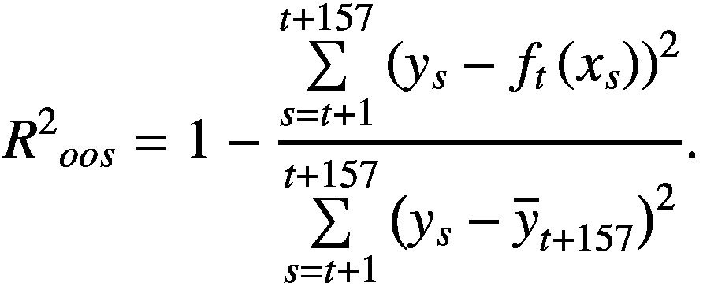(2.15)上述公式反映了使用新数据（在 *t* + 1 到 *t* + 157 之间）重新计算 *R*^(*2*)，但拟合函数 *f[t]*() 保持不变。

我们接着测量“样本内 R²”和“样本外 R²”之间的*差异*：

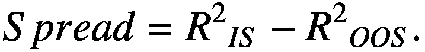(2.16)对于多元模型，我们不表示每个基本模型的差异，而是选择呈现基本模型之间的平均⁴ 差异，为了简洁起见。接下来我们观察差异如何随预测变量数量 *n* 的变化而变化。我们将这个数字变化在 1 和 156 之间（回顾一下共有 157 个观测值）。在图 2.1 中，将这个作为过拟合度量的预测变量数量的函数进行了比较：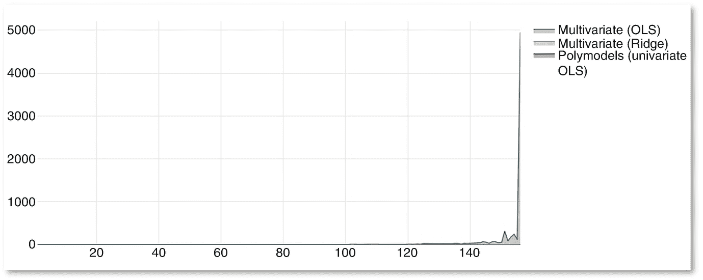

图 2.1

根据回归中包含的解释变量的数量，内样本和外样本 R²之间的差距（缩放）

上图表示内样本和外样本拟合优度之间的差距，作为回归系数数量的函数（对于多项模型，显示的值是在不同基本模型之间的差距的（非加权，未选择）平均值）。对于多元模型，独立变量的数量越多，差距越大，因此过拟合越强。

当回归器的数量达到数据点的数量时，多元 OLS 的差距会变得非常爆炸性，以至于它打破了图的比例。通过缩放可以理解（见图 2.2）：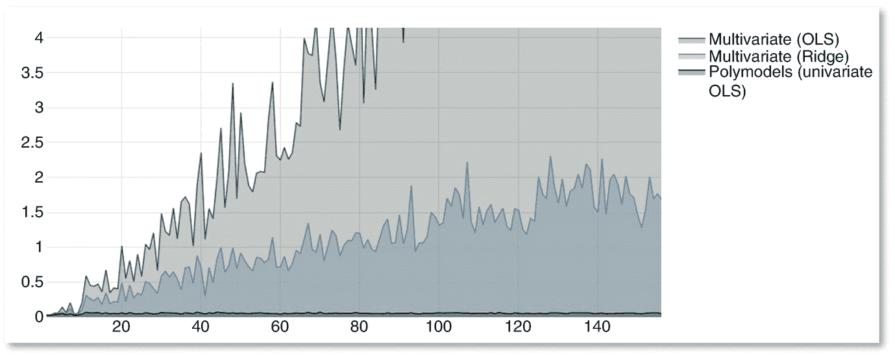

图 2.2

根据回归中包含的解释变量的数量，内样本和外样本的 R²之间的差距（缩放）

在这个玩具例子中，Ridge 估计器表现如预期，明显减少了与多元 OLS 相比的过拟合。实际上，对于极端情况，即*n*=156 时，Ridge 估计器的差距大约比经典 OLS 估计器低 3000 倍。然而，即使有正则化，显然过拟合也随着多元模型中包含的变量数量的增加而增加。

在多项式模型的平均差距的情况下，当回归数*n*增加时，差距（当然）在渐近时是恒定的。对于*n*=156 的情况，多项式模型的差距比 OLS 低了 10⁵倍，在这种特殊情况下比 Ridge 低了 34 倍（图 2.3）。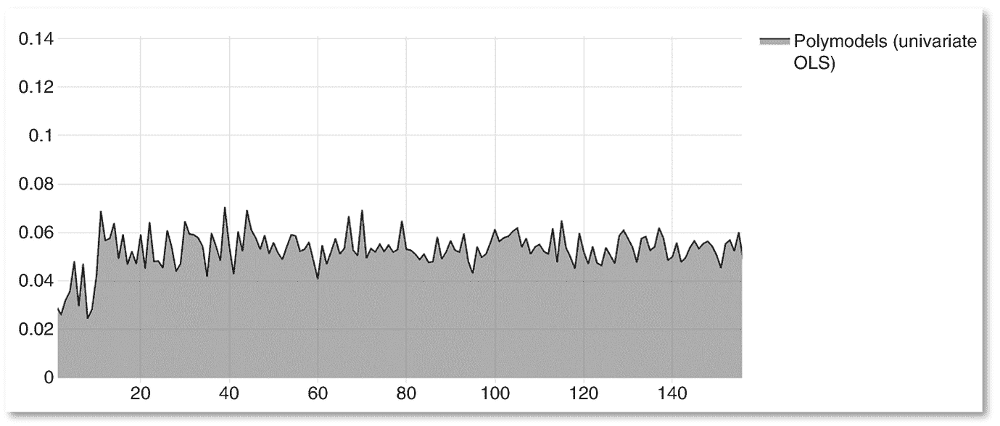

图 2.3

解释变量数量的函数（仅限多项式模型）中内样本和外样本 R²之间的平均差距

这个简单的实验还帮助我们通过比较三个模型的内样本 R²和外样本 R²来理解过拟合的本质：

在这三个图中，我们展示了内样本 R²和外样本 R²作为独立变量数量的函数，对于三种拟合方法。在这两种多元模型中，我们发现*差距*增长不仅仅是因为*内样本 R²*的增加。外样本 R²急剧恶化，以至于它迅速成为差距计算中最重要的数字。这说明过拟合不仅导致对外样本性能有太高的期望，而且在很大程度上实际上也导致其恶化，因为在这种情况下我们只是在跟随过去的噪声。注意 R²的比例在图中是完全不同的（图 2.4、2.5 和 2.6）。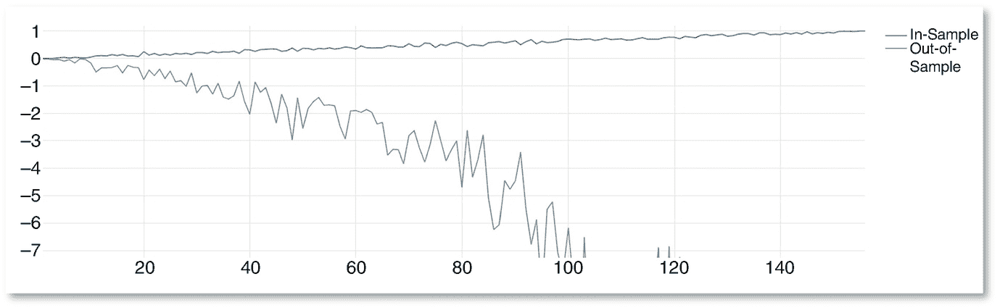

图 2.4

多元 OLS 回归：样本内与样本外的 R²随包含在回归中的解释变量数量的变化而变化

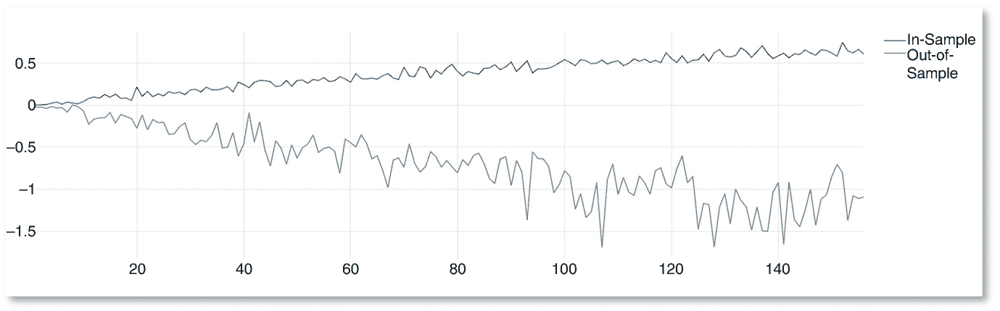

图 2.5

多元岭回归：样本内与样本外的 R²随包含在回归中的解释变量数量的变化而变化

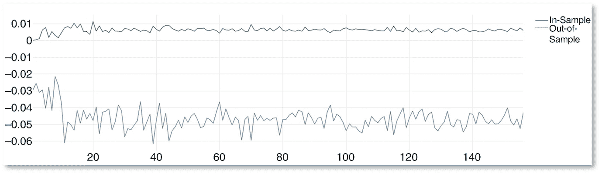

图 2.6

多模型（单变量 OLS）：样本内与样本外的 R²随包含在回归中的解释变量数量的变化而变化

当然，这个玩具示例有点简化，远离我们实际使用的技术，⁵但它使我们能够解释过度拟合现象，并使我们对其效果的大小有所了解。除了明显由多模型主导的过度拟合降低水平外，当似乎简单 OLS 估计的重复表现更好时，我们还可以质疑交叉验证的正则化估计器的使用。我们让奥卡姆剃刀的支持者做出选择。

另一种常用于处理大量潜在候选变量的技术是逐步回归。逐步回归通过将所有变量置于模型中开始构建最终模型，然后消除其中一些变量（'向后消除'），或者从不包含变量开始，然后逐步将它们引入模型中（'向前选择'）（霍金，1976）。变量的选择基于特定的拟合优度准则，这些准则通常鼓励在模型中减少变量的数量，例如调整后的 R²、阿卡信息准则或贝叶斯信息准则。然后，按照一步一步的程序进行，评估每一步模型的添加/删除变量的兴趣，使用每一步的拟合优度量度。这样的方法可以保留合理数量的自由度（特别是在向前选择过程中），并且也比岭回归更容易地将自变量的非线性变化整合进来。然而，这样的重复程序会导致用于评估其拟合优度的统计量存在偏差（威尔金森和达拉尔，1981），通常，一步一步的过程会导致过度拟合（弗洛姆和卡塞尔，2007）。当潜在的独立变量数量很高时，多模型可能以非常不同的方式进行估计，因此在一步一步的过程中可以轻松避免陷阱。

考虑到逐步选择或正则化的常见替代方案，多模型方法提供了一种有效的减少过度拟合的方法，因为当潜在独立变量的数量很高时，在多元模型中实际上无法避免过度拟合。

### 2.4.2 增加精度

经济计量学的另一个关注点，尽管不经常被强调，是欠拟合。模拟两个变量之间关系的最简单方法是线性模型，然而，真实反应函数为直线并没有特定的原因。即使线性模型对大多数情况下都能产生可接受的结果，但是通过引入平滑曲线来取代通常的直线，这些结果可以得到改进。事实上，如果真实的基础模型是非线性的，那么非线性模型应该比线性模型表现更好，这要归功于其灵活性。然而，反之并不成立，如果基础模型是线性的，那么线性和非线性模型都有能力拟合直线。[⁶]

在许多领域，如金融领域，预测准确性的显著提高可能在经济后果方面具有决定性意义，但是使用非线性建模作为标准可以获得的好处不一定仅限于相对于线性模型的精度增加。在许多情况下，线性建模会导致错误的建模。即使在线性模型平均下能够产生良好的结果的情况下，独立变量分布尾部发生的事件可能表现出与目标变量非常不同的响应函数。这对从业者可能会造成最糟糕的后果，因为一个被认为是良好的模型，似乎始终能够产生一致良好的结果，突然间可能无法进行任何准确的预测。从这个角度来看，非线性建模不仅是一种如果想要略微提高预测准确性的可行方法，而且是一种在极端情况下避免出现意外的要求。

另一个很好的例子来说明这一点是基金经理的观点，他们可能关注对冲基金收益的多因子建模。对冲基金承担着显著的尾部风险，因此它们的凹形收益不能用线性因子模型来恰当描述。线性多因子模型可能能够解释对冲基金的“正常时期”，即非极端收益，但是由于与其因子暴露之间的关系是非线性的，它将无法对其极端收益进行建模，从而证明了为此目的开发非线性方法的必要性（例如，Cherny 等人，2010）。

在基础模型中使用非线性函数，例如多项式，如果适当拟合，可以增加预测的精度，并模拟极端事件⁷。例如，我们可以将方程（2.6）中的函数*φ**i*定义为：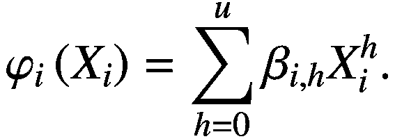（2.17）上述基础模型中使用的函数是多项式的加权和。这样的模型的权重可以通过 OLS 估计。然而，简单的多项式之间高度相关，并且 OLS 估计量的假设之一是回归变量的线性独立性。尽管如此，通过正交化多项式可以满足这一假设。假设因素的联合分布是高斯 Copula，我们被引导使用 Hermite 多项式（Cherny 等，2010）。Chebyshev 多项式已知适用于区间[−1, 1]的 OLS 估计（Mason＆Handscomb，2002），这个区间包含大部分金融收益。最后，Guan（2019）提议对多项式进行数值自正交化。所有这些替代选择都有利有弊，取决于应用。请注意，存在许多非线性逼近函数*φ**i*的可能性。例如，在非参数世界中，Nadaraya–Watson 估计器（Nadaraya，1964；Watson，1964），也称为核回归，可能会产生合适的结果。尽管如此，多项式回归具有极易实现的优点，因此可以在现实世界中快速计算。

当然，我们对非线性技术优于线性技术的推理是有条件的，即多项式模型如果使用，则不是盲目拟合的。事实上，由于多项式模型更复杂，更容易导致过拟合。为了解决这个问题，Zhang（2019）提议使用正则化来收缩多项式基础模型的参数。

使用非线性建模可以实现非常灵活的函数形式，如果使用得当，比起模型驱动更加数据驱动。这种合理适应数据的精神也体现在多模型中对变量假设的制定上。实际上，由于我们不希望忽视对现实的任何相关视角以理解它，多模型理论是一种邀请，可以在多模型中包含任何潜在重要的变量。在估算程序之前，几乎可以（并应该）在多模型中包含任意数量的变量。这一令人振奋的特性需要在多模型的估算过程中系统地包含一个*选择方法*，以便仅保留在最终估算的多模型中真正相关的变量。在这个阶段，没有关于选择方法的标准，因此它被适应于各种经验案例（第 4 和 6 章就此提出了一些解决方案）。因此，在使用弱功能假设之上，多模型理论还使用弱变量假设，这构成了一种避免模型僵化的良好方式，该模型受到可能是错误的假设（从一般观点来看，假设线性模型可以被视为对模型的函数形式做出的强假设）的驱使。

这种极高的多模型灵活性需要一种谨慎的估算方法。正如所述，这种估算方法应包括一种平衡和/或选择不同基本模型的方法，但更重要的是，拟合过程不应过于自适应，否则可能再次出现过度拟合。满足这种对合理算法以拟合基本模型的需求是第三章的主题。

非线性建模引入的整体精度增加可以通过逐步回归实现。这样的方法还允许自动变量选择，然而我们已经看到逐步过程会导致过度拟合。在岭回归和弹性网正则化的情况下，引入预测变量的非线性版本可能克服线性建模的精度不足，但显然会以增加模型系数的数量为代价，这必然会增加过拟合的风险。因此，就准确拟合真正存在于大量数据中的模式这个特定问题而言，多模型理论与标准替代方案相比表现出令人羡慕的特性。

### 2.4.3 提高鲁棒性

与多元模型相比，使用 polymodel 最明显的好处之一是消除了多重共线性。在大数据样本中，我们经常会遇到多重共线性，它提供了对参数的非稳健估计，即回归系数对估计数据的微小变化非常敏感（参见例如 Belsley，2014）。这在使用时间滚动窗口进行重复拟合时尤其成问题，这是金融领域经常使用的一种技术。此外，多重共线性可能会使我们难以可靠地识别与我们试图解释的目标变量有效相关的自变量。由于它增加了受影响系数的标准误差，如果通过常规 t 统计量计算，则虚高了参数的 *p*-值。虽然可以使用 Ridge 回归来解决预测变量之间的多重共线性问题，但会以准确性为代价（Hoerl＆Kennard，1970），但在 Polymodel 理论框架下，多重共线性根本不会出现，这使其更适用于获得对每个预测变量的反应函数的稳健估计。

我们建议从现实世界中提取另一个玩具示例来说明这一特定点。同样，我们考虑用多元 OLS、多元 Ridge 和简单线性 polymodel 拟合多因子模型的问题。目标变量仍然是标准普尔 500 指数的周回报，我们继续研究 2001-01-01 至 2003-12-31（157 次观测）的情况。然而，我们用于预测它的预测变量集合不再由随机选择组成。相反，我们使用了 43 个美国股票指数，其中大多数是行业指数。⁸我们首先使用这 43 个解释变量估计三种不同的模型，并收集它们的相关参数。接下来，我们重新估计三个模型，同时删除其中一个预测变量，因此保留 42 个。如果初始估计是稳健的，它们应该是稳定的，因此与多因子模型中使用 43 个变量估计的系数完全相同。对于每个模型，我们测量系数的绝对变化，预计等于 0，使用以下基本度量标准：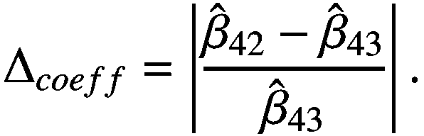(2.18)然后，此过程重复 43 次，每次更改从预测器集中删除的变量，以便我们可以收集三种模型的Δ[coeff]的 42 × 43 = 1,806 个值。这些值的描述性统计如下（表 2.1）：表 2.1

对解释变量集合变化的估计的敏感性

|   | 多元（OLS） | 多元（Ridge） | polymodel（单变量 OLS） |
| --- | --- | --- | --- |
| 计数 | 1,806 | 1,806 | 1,806 |
| 均值 | 76% | 28% | 0% |
| 最小值 | 0% | 0% | 0% |
| 四分位数 25% | 2% | 1% | 0% |
| 四分位数 50% | 10% | 5% | 0% |
| 四分位数 75% | 39% | 18% | 0% |
| 最大值 | 9.110% | 1.556% | 0% |
| 标准差 | 4.12 | 0.93 | 0.00 |
| 峰度 | 233.30 | 88.70 | 0.00 |
| 偏度 | 13.83 | 8.19 | 0.00 |

多变量 OLS 的系数平均绝对变化为 76%，多变量 Ridge 为 28%，而多项模型显然为 0%。多变量情况下这些极大的变化是由于预测变量中存在高水平的多重共线性。事实上，它们的平均相关性为 56%。

当然，有很多情况下使用的预测变量只有低相关性，或者根本没有相关性。但是，使用的解释变量越多，某些解释变量出现多重共线性的可能性就越大。我们提出的简单例子表明，即使 Ridge 估计器确实能够降低参数不稳定性，其结果仍然不完美，而多项模型则完全消除了任何多重共线性问题，因此提供了一个彻底解决这个问题的工具。  

为了确保估计的模型是可靠的，在建模中的一个标准假设是，用于拟合的样本的所有观测的残差方差都是恒定的。在处理时间序列时，可能很难确保同方差性，因为时间序列可能显示出波动的集群（在金融领域，曼德布罗特 1997 和恩格尔 1982 已经引起了人们的注意）。因此，使用于估计的窗口越长，同方差性假设不被满足的可能性就越小。当这个条件不被满足时，OLS 估计的系数的标准误差就会有偏差，再次导致基于 t 统计量的虚假 *p* 值水平，从而可能错误地确定在分析中要考虑的最相关的变量。请注意，在尝试避免过度拟合时，多变量模型必须依赖于可用的最大时间深度。相比之下，多项模型允许减少估计的时间深度，同时保持令人满意的自由度，这样就不太容易过度拟合。因此，除了避免多重共线性之外，从尊重同方差性假设的特定角度来看，使用多项模型而不是多变量模型也更有利于建模的稳健性。

在对多个变量建模时，从业者经常会遇到缺失数据的问题。在预测变量的矩阵中缺少观测会导致估计不准确，因此要么删除所有具有相同索引的其他变量的观测（例如简单地删除日期），要么完全删除整个变量本身。当使用大量变量时，这个问题变得越来越棘手，因为通常会缺少广泛的观测，并且这些观测可能不会同时缺失。无论采取何种选择，使用任何多元回归技术都会导致移除一部分可用数据。模型的稳健性也与用于估计其参数的观测数量相关联。再次，多模型允许克服这一问题。由于每个变量都是使用其自己的基本模型独立拟合的，因此无需删除任何观测，每个基本模型中使用的观测数量可以不同。自然地，这种差异应该在用于评估每个变量的统计显着性的测试中考虑进去。通过保留所有观测，多模型因此增加了估计的稳健性，与多元模型相比。

多变量建模技术只能难以解决对估计的稳健性的担忧。尽管岭回归可能在一定程度上解决了多重共线性的问题，但没有一种多元技术能像多模型那样尊重数据的原始结构（方差的动态性，缺失观测）。这些发现将多模型技术定位为适合处理大量数据的技术。

## 2.5 多模型引发的考虑

### 2.5.1 预测的聚合

当介绍多模型理论时，常常引起的一个常见问题是使用什么方法来聚合预测。

首先，重要的是要注意，多模型理论提供的不仅仅是聚合预测。由于其目的是提供一个准确的表示一个变量与其整个环境之间关系的近似全面的表示，因此从这种表示本身就可以学到很多东西。研究人员可以关注这些联系强度的动态性，它们的非线性程度等等。此外，可以使用基本模型生成除目标变量预测之外的其他度量，例如风险价值。因此，可以生成代表系统不同方面的非常不同的度量。

调查多模型不同维度的度量的聚合可以通过非常不同的方式进行。我们可以考虑这些度量的整个分布，以及在压力条件下描述系统反应的最大值、最小值或极端分位数。度量的随时间变化的波动提供了关于其不稳定性的信息。还可以考虑度量与其历史平均值的比率，以获得其相对当前水平的有意义值。

最后，将不同基本模型的预测聚合在一起引发了不同预测器的相关性的问题。

为了有效地理解这个问题的重要性，我们通过一个大礼堂的隐喻来解决它。

让我们考虑一下，一个由某大学财务系的学生填满的大礼堂。我们希望利用他们的知识来预测金融资产的未来收益。在加入大礼堂之前，学生们已经被选为该特定任务在大学中最有技能的学生。选择是使用多项选择问卷进行的。因此，一小部分通过随机猜测程序回答问卷的不好的学生，可能会被偶然选中。用于确定最佳学生的测试是有缺陷的，就像所有测试一样。

这些被毫无原则地选择出来的学生在我们在大礼堂里可能会遇到的学生中并不具有最常见的特征。然而，大多数被选择的学生都很有技能，因为他们都来自同一所大学，他们对金融市场有着相同的知识和想法。

然而，一些学生在其他大学开始了他们的学习，甚至在少数情况下在不同领域开始了他们的学习，而且他们中的一些人比其他人学习得更多，在讲座之外寻找补充信息，因此，一些原始观点可能会被这些学生表达出来。

学生们所做的预测是匿名的，因此我们无法知道这些原始学生是谁。我们只能观察到这些预测，这些预测在几轮中重复，每次都试图预测下一个时期的金融资产收益。

很明显，大礼堂是一个多模型，每个学生代表着一个基本模型。此外，我们清楚地了解到，大多数学生的预测，即使相关，也会有所关联，因为他们代表市场的方式本质上是相同的。问题是如何区分智者、愚者和群众。这个问题可以通过几种方式来解决，我们提议通过一个同时考虑到原创性和可信度的度量来解决，该度量在第六章中提出。

### 2.5.2 每个基本模型的变量数量

选择只包括基本模型中的单个变量需要进行讨论。事实上，如果基本模型由多个变量组成，则大多数 Polymodel 的好处仍然存在。这样的构造也符合 Polymodel 理论的认识论方法。

然而，将几个变量包括在基本模型中将不允许我们在没有过度拟合的情况下获得高水平的精度（即非线性建模）。例如，多重共线性的缺失将会丢失一些其他的好处。

除了统计考虑之外，使用单变量基本模型大大简化了分析，因为我们测量的基本模型指标与一个单一、明确定义的因子相关联。

因此，单变量基本模型似乎是构建 Polymodel 的最合适选择。

## 2.6 结论

Polymodel 理论是一种直观的方法，长期以来已经在不同领域中使用，但通常会被匆忙地拒绝，以支持多变量建模。然而，金融领域的首次应用表明，该方法提供了一个丰富的框架，特别有利于大数据的非线性建模，在多变量建模范围之外有大量应用。

形式化一个在最近文献中越来越常用的工具，我们已经表明多元多变量(polymodels)方法在计量经济学角度具有许多有利特性。特别地，这些优点符合当前金融利益，其中需要以数据驱动、稳健、准确、非过度拟合的方式处理大量数据的技术。从这个角度来看，Polymodel 理论可以被看作是一种机器学习方法。

Polymodel 理论还具有哲学上的好处：从认识论的角度来看，它似乎比多变量建模更合理，因为它提供了同一对象的多种表示（可以根据可信度加权），而不是单一的、不变的表示。

Polymodel 的非线性使得可以有效地处理市场动态中的制度变化，这些变化是“空间”的，即由于移动的大小而不是由于随机的“时间”事件。这与例如隐藏的马尔可夫模型一致，在其中股票对某些指数的“beta”取决于制度。

估计、选择和聚合预测的挑战是接下来章节要讨论的重要话题。妥善处理这些问题是使用 Polymodel 的基石。但是，如果得到适当处理，这使得 Polymodel 理论成为一种强大的建模方法，并在某种程度上，成为大多数传统多变量回归技术的优越替代品。
