# 第三章：估计方法：线性非线性混合模型

Thomas Barrau^(1  ) 和 Raphael Douady²(1)AXA 投资经理 Chorus 有限公司，香港，香港特别行政区。(2)巴黎索邦大学经济中心，法国巴黎。

## 摘要

我们引入了线性非线性混合（LNLM）模型作为产生非线性单变量模型的有效方法，主要关注减少过拟合。我们通过数值模拟表明，LNLM 模型能够成功地检测到噪声数据中的模式，其准确度与或优于数据驱动建模替代方案。我们发现我们的算法在计算上是高效的，这对于机器学习应用来说是一个必要的特征，这些应用通常涉及大量的估计。

关键词非线性建模多项式回归 Polymodel 理论正则化过拟合数据驱动非参数单变量回归

## 3.1 引言

如第二章所述，Polymodel 相对于经典的多因子模型最强大的优势之一是更准确地拟合目标变量，而不局限于简单的线性函数形式。在数据驱动建模领域有很多选择，但对于大多数技术来说，估计过程可能在计算资源方面很重，这在 polymodels 框架中是一个特别重要的点。事实上，即使是 Polymodel 理论的简单应用也可能涉及到数百万到数十亿的拟合。例如，一个人可能想要使用每天更新的一千个因子来拟合一个 20 年的模拟，这直接导致了 1,000 * 252 * 20 = 5,040,000 次拟合。很容易想象，在 polymodels 涉及的大数据框架中，计算时间非常重要。

从前从事者用于估计基本模型的简单解决方案是使用多项式的加权和。 Douady 和 Molchanov 以及 Cherny (2010) 引入了使用 Hermite 多项式的方法，这些多项式在回归中一起使用时表现出有趣的特性，限制了它们之间的相关性。

请回忆，Hermite 多项式被定义为：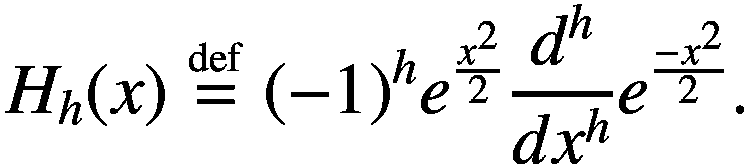(3.1)然后我们简单地使用以下非线性模型来估计基本模型：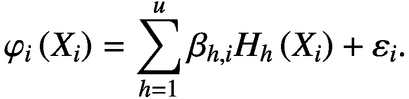(3.2)这里的 beta 是从 OLS 中获得的估计值（在实践中，通常有 4 个多项式项足以达到足够的精度），即：![$$ {\hat{\beta}}^{OLS}={\left[{X}^{\prime }X\right]}^{-1}{X}^{\prime }Y. $$](img/519851_1_En_3_Chapter_TeX_Equ3.png)(3.3)多项式解决方案有许多优点，因为 OLS 仅需要矩阵求逆，这是可以在当今高效完成的任务，并且可以轻松并行化。事实上，并行计算是从业者高效使用多模型理论的关键之一。此外，多项式组合可以以平滑和数据驱动的函数形式捕捉自变量和目标变量之间的潜在联系。

然而，这些优点是有代价的：过度拟合。使用多项式模型会导致在基本模型中重新引入几个人为的外生变量，由于它们的非线性特性，这特别适应，这为过度拟合创造了有利的基础。

线性非线性混合模型是对这一关注的回答。一方面，多项式的加权和模型可以很好地拟合数据，以至于它可以适应一些噪声以及变量之间的潜在关系。另一方面，线性模型会提供更健壮的拟合，但代价是仅提供一个天真和简单的现实表示的非常高。LNLM 模型建议混合这两种模型，并仅保留它们的优点。

当然，也可以使用其他技术来实现这样的正则化拟合。

可以使用岭估计来正则化多项式模型以获得模型的β值，简单地在预测变量的协方差矩阵的对角线上添加惩罚：![$$ {\hat{\beta}}^{OLS}={\left[{X}^{\prime }X\right]}^{-1}{X}^{\prime }Y\Rightarrow {\hat{\beta}}^{Ridge}={\left[{X}^{\prime }X+\lambda I\right]}^{-1}{X}^{\prime }Y. $$](img/519851_1_En_3_Chapter_TeX_Equ4.png)(3.4)通过交叉验证（见 Golub 等人，1979），可以获得参数λ的适当值，这个过程是通过测试不同λ的值及其相关的（伪）样本外拟合度来实现的。这种方法的问题在于，每次测试一个λ的值时都需要对惩罚的协方差矩阵进行反转。因此，进行 10 折交叉验证同时评估 10 个不同的λ值会导致 100 个矩阵反转，这在计算时间方面可能性能较低。

当然，还有其他技术可能适合提出一个数据驱动的拟合，该拟合比使用 OLS 估计的多项式模型更少过拟合。其中，我们保留 Nadaraya–Watson 估计量（Nadaraya，1964; Watson，1964）作为一个标准基准，我们用它来比较 LNLM 模型的性能。

本章的目的是介绍 LNLM 模型，并展示其在改善样本外拟合优度和计算时间方面的价值。就像许多其他人工智能技术一样（见第二章），我们的方法侧重于模型在使用时的有效性（此处用于产生非过拟合预测），而不是对其统计特性的深入理解，在本章中因此没有进行分析。

因此，我们将章节组织如下：

+   首先，我们介绍了 LNLM 模型，通过正式定义，并对拟合过程进行了解释。

+   然后，我们介绍了一种设计用来评估模型效率的方法，使用了大量的模拟。

+   展示和讨论模拟结果，最终总结该章节。

## 3.2 LNLM 模型的介绍

### 3.2.1 定义

LNLM 模型旨在表示目标变量如下: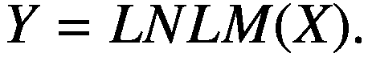(3.5)这种表示使用以下定义完成: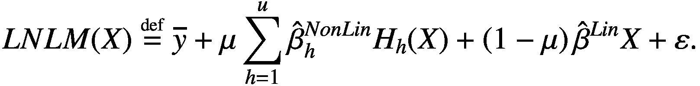(3.6)*这里* 0 ≤ *μ* ≤ 1 *是允许控制潜在*¹ *非线性的参数，因此被称为非线性倾向参数，* 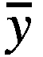 *是目标变量的均值。*

因此，LNLM 模型简单地通过线性模型对多项式模型进行正则化²。 这一点非常重要，并且与使用 Ridge 回归³ 对参数进行经典收缩造成了显著差异（Hoerl & Kennard，1988）。 实际上，首先想到的减少多项式引起的过拟合的自然想法是简单地收缩模型的 OLS 估计，就像 Zhang (2019) 所做的那样。 其他公认的替代方法包括 LASSO（Tibshirani，1996）或 Elastic Net（Zou & Hastie，2005）方法，但是这两种方法都包括 L¹-范数的惩罚，这通常会导致丢弃一些协变量。 在选择不同独立变量的简洁选择方面，这是非常有意义的，但在我们的情况下，我们只使用相同独立变量的不同变化，我们预计保留所有多项式项将导致更平衡的聚合函数。

使用 LNLM 模型而不是 Ridge 模型的动机主要是理论上的。我们先前的信念是，多项式模型的过度拟合仅来自模型的非线性项。换句话说，我们从不指望模型的线性部分过度拟合数据。在岭回归中，无法避免收缩线性项。回顾一下，岭回归的估计值定义为：![$$ {\hat{\beta}}^{Ridge}={\left[{X}^{\prime }X+\lambda I\right]}^{-1}{X}^{\prime }Y,\kern0.75em s.t.\kern0.75em \lambda \ge 0 $$](img/519851_1_En_3_Chapter_TeX_Equ7.png)(3.7)*这里λ是整数，收缩参数，“I”是 u×u 单位矩阵。*在多项式模型的情况下，矩阵*X′X*将是 4×4，所以我们可以用矩阵*J*替换 4×4 单位矩阵*I* ⁴：![$$ J=\left[\begin{array}{cc}\begin{array}{cc}0&amp; 0\\ {}0&amp; 1\end{array}&amp; \begin{array}{cc}0&amp; 0\\ {}0&amp; 0\end{array}\\ {}\begin{array}{cc}0&amp; 0\\ {}0&amp; 0\end{array}&amp; \begin{array}{cc}1&amp; 0\\ {}0&amp; 1\end{array}\end{array}\right] $$](img/519851_1_En_3_Chapter_TeX_Equ8.png)(3.8)这个解决方案很诱人，因为我们可以期望线性项不再受到矩阵*J*的惩罚。然而，我们仍然必须求解矩阵*[X′X + λJ]*的逆，这相当于解一个四元方程组。在这样一个系统中，只有第二、第三和第四个方程被修改，而在协方差矩阵中加入惩罚项后，第一个方程保持不变。但是在求解系统时，每个方程的解都取决于所有其他方程的解，因此系统的第一个方程的解也被修改，结果线性系数也被改变。

因此，LNLM 模型是对 Ridge 回归在拟合单变量多项式模型的非常特殊情况下的极限的响应（保持过度拟合仅来自非线性的假设）。

### 3.2.2 拟合过程

LNLM 模型的结构阻止了使用 OLS 进行全局直接拟合，首先因为结果将只是一个过度拟合的大型多项式模型，其次是因为模型中线性项的完美相关性将阻止矩阵求逆。

因此，我们设计了一个三步拟合过程，首先选择非线性倾向参数*μ*的值，然后分别估计非线性模型和线性模型，最后将 LNLM 的所有要素结合起来得到最终拟合。步骤 2 和步骤 3 是微不足道的，因此我们将重点放在接下来详细介绍的步骤 1 上。

我们方法的目标是减少过度拟合，我们围绕交叉验证的概念构建我们的方法论。 更准确地说，我们使用 k 折交叉验证的变体来数值地接近最小化过度拟合的值*μ*，即样本外误差。 选择交叉验证是由其已被证明可以减少过度拟合的能力所驱动的（Moore，2001）。

为了做到这一点，我们首先将目标变量数据分割成*k*个子样本，称为“折叠”。 分层 K-Folds 包括几种技术，旨在保持子样本代表目标变量的全局分布。 如果我们有*q*个观测值可用，我们将数据分割成⌈q/k⌉个分位数。 因此，每个分位数桶都包含正好*k*个观测值（如果*q/k*不是整数，则除了最后一个之外的每个桶）。 如果我们以在 50 个观测值上执行的 5 倍交叉验证为例，我们将得到一个分布分成 10 个包含 5 个观测值的分位数（图 3.1）：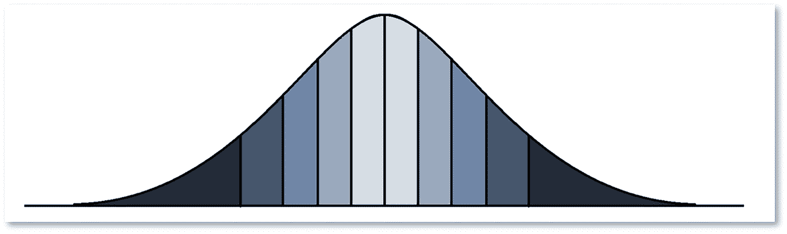

图 3.1

分层交叉验证的分位数分割的样式化表示

在每个完整的分位数中，我们随机为每个观测值分配一个折叠标识符。 所有折叠标识符都以相等的概率分配，并且相同的标识符不能在同一个分位数桶中出现超过一次。 可能的不完整分位数是唯一一个可能不包含所有*k*个标识符的分位数。 最后，我们只是按折叠标识符对观测值进行分组，得到*k*个折叠，每个折叠都包含以前定义的所有分位数中的观测值。 因此，所有折叠都包含代表目标变量的全样本分布的数据。 在我们之前的示例中，我们得到 5 个折叠，每个折叠包含从初始分布的 10 个分位数中抽取的 10 个观测值（图 3.2）：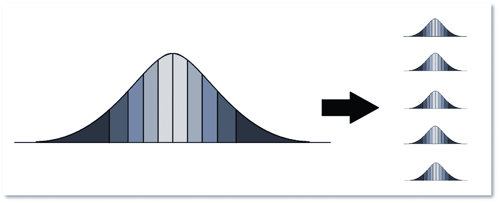

图 3.2

分层交叉验证的折叠分布的样式化表示

一旦数据分成了折叠，我们分别使用最后的*k*−1 个折叠来拟合线性模型和非线性模型。然后，我们使用第一个折叠来数值计算最小化该伪样本折叠内的均方根误差（RMSE）的*μ*的值，该折叠尚未用于估计 OLS 参数：![$$ \underset{\mu_1}{\mathit{\min}}\sqrt{\frac{1}{q}{\sum}_{d=1}^q{\left({y}_{1,d}-\left[{\overline{y}}_{2,3,\dots, k}+{\mu}_1\sum \limits_{h=1}^u{\hat{\beta}}_{2,3,\dots, k,h}^{NonLin}{H}_h\left({x}_{1,d}\right)+\left(1-{\mu}_1\right){\hat{\beta}}_{2,3,\dots, k}^{Lin}{x}_{d,1}\right]\right)}²} $$](img/519851_1_En_3_Chapter_TeX_Equ9.png)(3.9)这个数值选择重复*k*次，每次改变用于确定*μ*的伪样本折叠：![$$ \left\{\begin{array}{c}\underset{\mu_1}{\mathit{\min}}\sqrt{\frac{1}{q}{\sum}_{d=1}^q{\left({y}_{1,d}-\left[{\overline{y}}_{2,3,\dots, k}+{\mu}_1\sum \limits_{h=1}^u{\hat{\beta}}_{2,3,\dots, k,h}^{NonLin}{H}_h\left({x}_{1,d}\right)+\left(1-{\mu}_1\right){\hat{\beta}}_{2,3,\dots, k}^{Lin}{x}_{1,d}\right]\right)}²}\\ {}\underset{\mu_2}{\mathit{\min}}\sqrt{\frac{1}{q}{\sum}_{d=1}^q{\left({y}_{2,d}-\left[{\overline{y}}_{1,3,\dots, k}+{\mu}_2\sum \limits_{h=1}^u{\hat{\beta}}_{1,3,\dots, k,h}^{NonLin}{H}_h\left({x}_{2,d}\right)+\left(1-{\mu}_2\right){\hat{\beta}}_{1,3,\dots, k}^{Lin}{x}_{2,d}\right]\right)}²}\\ {}\begin{array}{c}\begin{array}{c}\dots \\ {}\dots \\ {}\dots \end{array}\\ {}\underset{\mu_k}{\mathit{\min}}\sqrt{\frac{1}{q}{\sum}_{d=1}^q{\left({y}_{k,d}-\left[{\overline{y}}_{1,2,\dots, k-1}+{\mu}_k\sum \limits_{h=1}^u{\hat{\beta}}_{1,2,\dots, k-1,h}^{NonLin}{H}_h\left({x}_{k,d}\right)+\left(1-{\mu}_k\right){\hat{\beta}}_{1,2,\dots, k-1}^{Lin}{x}_{k,d}\right]\right)}²}\end{array}\end{array}\right. $$](img/519851_1_En_3_Chapter_TeX_Equ10.png)(3.10)因此，我们得到了*k*个不同的最佳*μ*值，最简单的聚合方法是取平均值。然而，*μ*的值在每个折叠中的重要性不同。在某些折叠中，选择最佳值⁵的*μ*会导致 RMSE 的显著减少，而在另一些折叠中，RMSE 对最佳选择的敏感性较低。为了考虑到这一点，对于*k*个折叠中的每一个，我们计算以下度量：![$$ {\xi}_l=\sqrt{E\left[{\left({\mathfrak{R}}_l-{\mathfrak{r}}_l^{\ast}\right)}²\right]} $$](img/519851_1_En_3_Chapter_TeX_Equ11.png)(3.11)*这里* 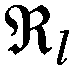 *是计算了所有测试折叠“ l”的*μ*值的均方根误差向量（约 100 个），而* 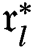 *是在最佳处的 RMSE 值。*

因此，度量*ξ*测量了围绕最优解获得的误差的分散程度。它可以理解为与最小 RMSE 的标准偏差。*ξ*的值越大，当我们偏离最优解时误差增加的幅度就越大，选择这个特定值*μ*就越重要。

我们通过计算最终聚合值*μ*，将每折中对选择最优值的重要性进行衡量，该值是从与最小值相关联的标准偏差加权得到的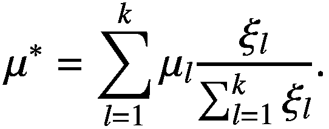(3.12)这样的加权相当直观，因为我们的标准偏差到最小值的关系与标准误差的概念密切相关。

注意，上述描述的过程导致每个折叠中进行两次 OLS 拟合（一个用于线性模型，一个用于非线性模型），并且在所有可用数据进行两次最终 OLS 拟合。因此，在 10 倍交叉验证的情况下，只执行了 22 次矩阵求逆运算，而在相同情况下，Ridge 正则化需要进行 100 次矩阵求逆运算。这种差异使我们能够预期 LNLM 模型的计算时间更短。

## 3.3 评估方法学

我们建议使用反映真实情况的模拟来评估 LNLM 模型的兴趣。在我们的情境中，建模的目的是确定两个变量之间的关系，而我们只能获得带有噪声的观测结果。因此，我们按照以下方法进行：

+   首先模拟一个变量*X*，其分布类似于股票收益。

+   然后，我们将与这个变量相关联的特定反应函数*ϕ*(*X*)，该函数建模了目标与我们的自变量之间的关系。

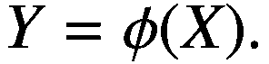(3.13)

+   然后，我们将一个噪声项与该函数的输出关联起来，从而定义观察到的目标变量*Y*，如下所示：

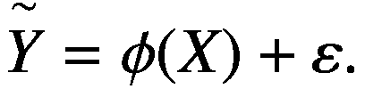(3.14)

+   我们假设可以观察到*X*和的值，但模型的函数形式以及随机部分对于外部观察者是未知的。我们将自己置于这个外部观察者的位置，尝试使用几种建模技术来拟合均值方程。

+   一旦使用这些不同模型进行拟合，我们使用与之前相同的分布生成*X*的新值，并观察估计模型如何使用这些新值适合其原始目标，⁶ ϕ(*X*)。

这个实验设计因此捕捉了每种建模技术的 *样本外预测能力*，即其应对过拟合问题的能力。

*X* 服从自由度为 4 的学生 t 分布，因为已发现这种分布能够适当地模拟股票收益的分布情况（Platen & Rendek，2008）。为方便起见，在反应函数的定义中，超出区间[−6, +6]的值会被截断处理。⁷

建模金融市场通常是一项困难的任务，因为使用的数据非常嘈杂。我们关注的是在大量噪声存在的情况下测试不同建模技术的准确性，因此 ε 的值也将从自由度为 4 的学生 t 分布中抽取。

我们使用几个基础函数来生成不同的目标变量。我们的目标是获得一组代表性的可能出现在现实生活中的函数。因此，我们在区间 [−6, +6] 中定义了以下十三个函数：

+   函数必须在其定义区间上平滑地运行，反映出在 LNLM 模型设计的实际案例中观察到此类函数的合理性。下面是函数的图形表示（图 3.3）：

+   函数的斜率不能太陡。合成观测是通过向拟合值添加噪声而创建的，这导致嘈杂数据与真实数据之间产生垂直距离。如果我们考虑一个斜率为无穷大的极端情况，即垂直线，任何嘈杂数据都将成为原始曲线的一部分，使得拟合过于简单。通过显示第二个函数的嘈杂观测（图 3.4）可以直观地了解发生了什么：

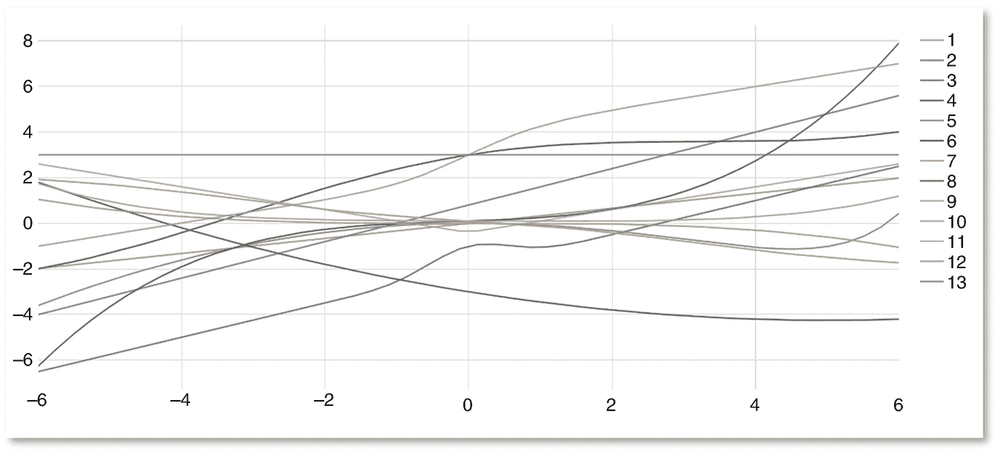

图 3.3

用于模拟的函数的图形表示

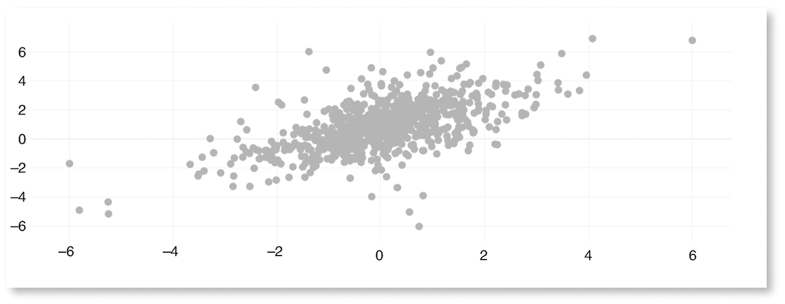

图 3.4

第二个函数的嘈杂观测（斜率 = 0.8）

+   将斜率从 0.8 增加到 3，*ceteris paribus*，导致以下嘈杂数据（图 3.5）：

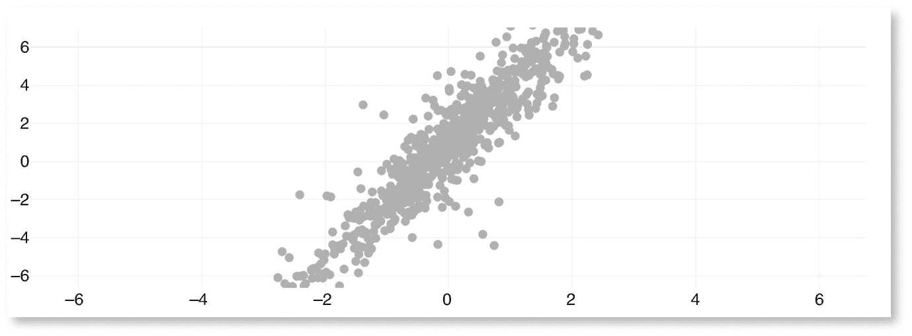

图 3.5

第二个函数的嘈杂观测（斜率 = 3）

+   因此，限制函数的陡峭程度是重要的，以避免揭示基础函数的显而易见的特性。

+   子函数必须被选中以代表可能的各种功能形式。我们特别注意包括简单的常数、线性和二次函数，但我们也集成了许多未包含在 LNLM 模型本身中的子函数（这大约占到了所有函数的一半）。如果我们关心的是知识诚实，这最后一点非常重要，因为在 LNLM 模型设计的实际情况中，连接独立变量和目标变量的真实函数并不是由多项式组成的。

使用以下建模技术拟合生成的嘈杂目标变量：

+   使用 OLS 估计的简单线性模型。估计使用 Python 库 statsmodels 0.6.1 进行。

+   一个与 LNLM 模型相同阶数（4 阶）的多项式模型，使用 OLS 进行估计。此模型也使用 statsmodels 进行估计。

+   与 LNLM 模型相同阶数的多项式模型，通过最小二乘法的岭正则化进行估计。估计使用 Python 的 scikit-learn 0.22.2 库的 “RidgeCV” 函数进行。这允许我们对正则化参数进行交叉验证。我们使用 10 折交叉验证对 13 个不同的 *λ* 值进行数值搜索，范围从 1e−8 到 1e+4。

+   使用我们的变体分层 k 折交叉验证估计的 LNLM 模型。用于计算 LNLM 模型中 *μ* 值的折数设置为 10\. OLS 拟合直接编码在 Python 中，使用 numpy 1.10.4 来求解 OLS 估计的协方差矩阵的逆矩阵。

+   一个天真版本的 LNLM 模型，其 *μ* 设置为 0.5\. 这个拟合允许我们控制 *μ* 的选择算法的相关性。

+   一个非参数模型，即纳达拉-沃森估计量（见纳达拉亚(1964)，沃森(1964)以获得正式定义）。非参数拟合的最重要参数，即带宽，也是使用交叉验证方法进行选择的。估计是使用 statsmodels 的核回归模块执行的。

我们还使用不同数量的观测值在向量*X*中，由于相同的模拟噪声，用小数据集可能比用大数据集更难识别基础功能。为了保持对现实主义的关注，对于向量*X*，我们使用了 126、252、756 和 1,260 个观测值的长度。这些数字来自于使用滚动窗口估计多项式的频繁使用。⁸

在每个模拟中，用于估计的*X*值的数据、噪声值的数据以及用于预测的*X*值的数据是从不同的随机种子生成的（来自 numpy 库）。

为了给读者一个关于拟合的现实感和难度，我们下面展示了我们生成的一些噪声数据的图示（图 3.6，3.7，3.8 和 3.9）: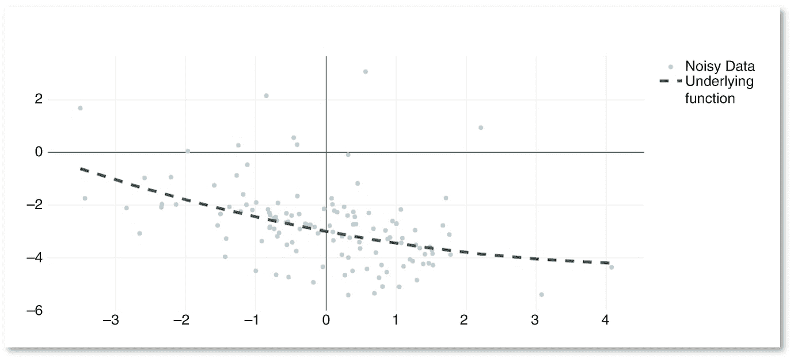

图 3.6

合成噪声数据示例：带有 126 个观测值的函数 8

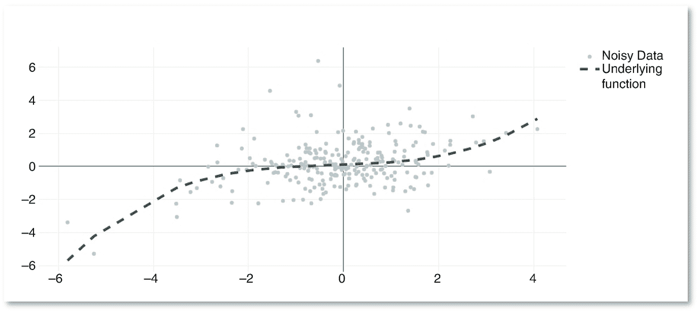

图 3.7

合成噪声数据示例：带有 252 个观测值的函数 6

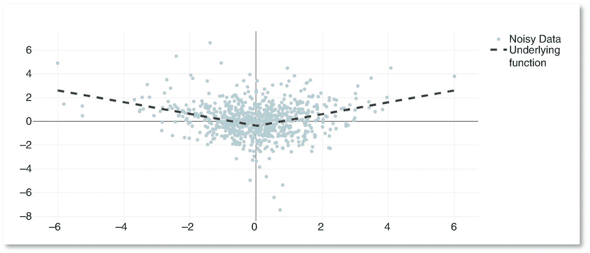

图 3.8

合成噪声数据示例：带有 756 个观测值的函数 11

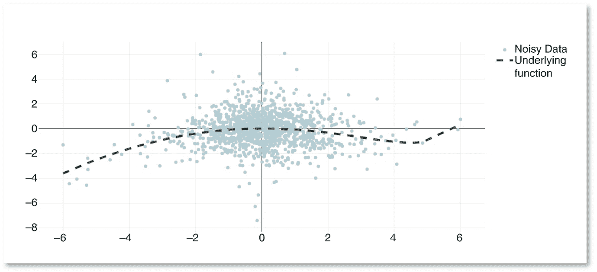

图 3.9

合成噪声数据示例：带有 1,260 个观测值的函数 5

这些图表显示，与实际情况一样，由于模拟数据中存在大量噪声，拟合相对困难。

对于每个*X*长度，我们对上述定义的 13 个函数的每个函数运行了 1,000 次模拟，每次使用不同的随机种子，从而达到总共 52,000 次模拟。⁹

我们计算了所有这些情况下的样本外预测的均方根误差，这是我们的样本外拟合优度的指标。

我们还记录了每个模型的平均计算时间，包括用于执行估计的时间和用于执行预测的时间。

## 3.4 结果

接下来我们呈现每个*X*长度的结果表。

我们首先介绍了 RMSE 的摘要统计，它汇总了所有特定长度*X*的拟合结果。

然后，我们显示了每个函数的平均结果，以查看每个模型适合特定函数形式的能力。

我们最后通过呈现平均计算时间来总结。

### 3.4.1 对于 126 个观测值（表 3.1 和 3.2）

表 3.1

126 个观测值的根均方误差的摘要统计

|   | 均值 | 标准差 | 中位数 | 最小值 | 最大值 |
| --- | --- | --- | --- | --- | --- |
| 线性 | 2.82E−01 | 1.49E−01 | 2.70E−01 | 4.30E−03 | 1.08E+00 |
| LNLM | 3.18E−01 | 3.21E−01 | 2.53E−01 | 8.37E−03 | 7.66E+00 |
| Naive LNLM | 3.51E−01 | 3.34E−01 | 2.66E−01 | 1.76E−02 | 6.18E+00 |
| 非参数 | 2.94E−01 | 1.52E−01 | 2.77E−01 | 2.34E−04 | 2.05E+00 |
| OLS 多项式 | 5.43E−01 | 6.82E−01 | 3.22E−01 | 3.00E−02 | 1.20E+01 |
| 岭多项式 | 5.63E−01 | 5.34E−01 | 4.08E−01 | 2.87E−03 | 1.01E+01 |

表 3.2

126 次观测每个函数拟合的平均均方根误差

|   | 线性 | LNLM | Naive LNLM | 非参数 | OLS 多项式 | 岭多项式 |
| --- | --- | --- | --- | --- | --- | --- |
| *函数 #1* | 1.54E−01 | 2.15E−01 | 3.05E−01 | 2.77E−01 | 5.13E−01 | 5.05E−01 |
| *函数 #2* | 1.54E−01 | 2.25E−01 | 3.05E−01 | 3.60E−01 | 5.13E−01 | 7.93E−01 |
| *函数 #3* | 4.11E−01 | 5.14E−01 | 5.09E−01 | 3.84E−01 | 7.48E−01 | 9.67E−01 |
| *函数 #4* | 3.54E−01 | 3.58E−01 | 3.51E−01 | 3.28E−01 | 5.13E−01 | 6.80E−01 |
| *函数 #5* | 3.44E−01 | 3.52E−01 | 3.51E−01 | 2.79E−01 | 5.18E−01 | 3.96E−01 |
| *函数 #6* | 4.60E−01 | 3.94E−01 | 3.74E−01 | 3.96E−01 | 5.13E−01 | 4.84E−01 |
| *函数 #7* | 1.66E−01 | 2.30E−01 | 3.08E−01 | 2.62E−01 | 5.15E−01 | 4.42E−01 |
| *函数 #8* | 2.57E−01 | 2.97E−01 | 3.22E−01 | 3.17E−01 | 5.13E−01 | 6.48E−01 |
| *函数 #9* | 1.95E−01 | 2.42E−01 | 3.10E−01 | 1.93E−01 | 5.13E−01 | 2.65E−01 |
| *函数 #10* | 3.36E−01 | 3.82E−01 | 3.86E−01 | 3.68E−01 | 6.14E−01 | 1.09E+00 |
| *函数 #11* | 5.00E−01 | 4.77E−01 | 4.33E−01 | 3.18E−01 | 5.62E−01 | 5.24E−01 |
| *函数 #12* | 1.74E−01 | 2.34E−01 | 3.08E−01 | 1.84E−01 | 5.13E−01 | 2.68E−01 |
| *函数 #13* | 1.54E−01 | 2.17E−01 | 3.05E−01 | 1.58E−01 | 5.13E−01 | 2.59E−01 |
| 均值 | 2.82E−01 | 3.18E−01 | 3.51E−01 | 2.94E−01 | 5.43E−01 | 5.63E−01 |
| 标准差 | 1.26E−01 | 1.03E−01 | 6.20E−02 | 7.80E−02 | 6.84E−02 | 2.64E−01 |
| 中位数 | 2.57E−01 | 2.97E−01 | 3.22E−01 | 3.17E−01 | 5.13E−01 | 5.05E−01 |
| 分钟 | 1.54E−01 | 2.15E−01 | 3.05E−01 | 1.58E−01 | 5.13E−01 | 2.59E−01 |
| 最大值 | 5.00E−01 | 5.14E−01 | 5.09E−01 | 3.96E−01 | 7.48E−01 | 1.09E+00 |

### 252 次观测的 3.4.2（表 3.3 和 3.4）

表 3.3

252 次观测的均方根误差汇总统计

|   | 均值 | 标准差 | 中位数 | 最小值 | 最大值 |
| --- | --- | --- | --- | --- | --- |
| 线性 | 2.49E−01 | 1.42E−01 | 2.37E−01 | 4.43E−03 | 8.19E−01 |
| LNLM | 2.19E−01 | 1.59E−01 | 1.90E−01 | 4.28E−03 | 3.40E+00 |
| Naive LNLM | 2.25E−01 | 1.39E−01 | 2.02E−01 | 1.61E−02 | 2.75E+00 |
| 非参数 | 2.30E−01 | 1.02E−01 | 2.24E−01 | 1.61E−04 | 8.07E−01 |
| OLS 多项式 | 2.87E−01 | 2.61E−01 | 2.27E−01 | 2.33E−02 | 5.36E+00 |
| 岭多项式 | 4.21E−01 | 3.28E−01 | 3.29E−01 | 7.52E−03 | 5.14E+00 |

表 3.4

252 次观测每个函数拟合的平均均方根误差

|   | 线性 | LNLM | Naive LNLM | 非参数 | 多项式 OLS | 岭回归多项式 |
| --- | --- | --- | --- | --- | --- | --- |
| *函数 #1* | 1.10E−01 | 1.39E−01 | 1.69E−01 | 2.21E−01 | 2.61E−01 | 3.75E−01 |
| *函数 #2* | 1.10E−01 | 1.41E−01 | 1.69E−01 | 2.75E−01 | 2.61E−01 | 5.47E−01 |
| *函数 #3* | 3.93E−01 | 3.92E−01 | 3.67E−01 | 2.98E−01 | 4.35E−01 | 7.97E−01 |
| *函数 #4* | 3.33E−01 | 2.43E−01 | 2.33E−01 | 2.54E−01 | 2.60E−01 | 5.10E−01 |
| *函数 #5* | 3.22E−01 | 2.46E−01 | 2.33E−01 | 2.24E−01 | 2.67E−01 | 2.91E−01 |
| *函数 #6* | 4.32E−01 | 2.54E−01 | 2.67E−01 | 2.95E−01 | 2.61E−01 | 2.89E−01 |
| *函数 #7* | 1.25E−01 | 1.51E−01 | 1.74E−01 | 2.10E−01 | 2.64E−01 | 3.27E−01 |
| *函数 #8* | 2.25E−01 | 2.05E−01 | 1.96E−01 | 2.50E−01 | 2.61E−01 | 4.73E−01 |
| *函数 #9* | 1.56E−01 | 1.69E−01 | 1.78E−01 | 1.56E−01 | 2.61E−01 | 1.69E−01 |
| *函数 #10* | 3.09E−01 | 2.98E−01 | 2.71E−01 | 2.86E−01 | 3.68E−01 | 9.62E−01 |
| *函数 #11* | 4.77E−01 | 3.16E−01 | 3.21E−01 | 2.52E−01 | 3.12E−01 | 3.95E−01 |
| *函数 #12* | 1.34E−01 | 1.55E−01 | 1.73E−01 | 1.48E−01 | 2.61E−01 | 1.73E−01 |
| *函数 #13* | 1.10E−01 | 1.39E−01 | 1.69E−01 | 1.20E−01 | 2.61E−01 | 1.66E−01 |
| 平均值 | 2.49E−01 | 2.19E−01 | 2.25E−01 | 2.30E−01 | 2.87E−01 | 4.21E−01 |
| 标准差 | 1.35E−01 | 8.08E−02 | 6.52E−02 | 5.80E−02 | 5.45E−02 | 2.41E−01 |
| 中位数 | 2.25E−01 | 2.05E−01 | 1.96E−01 | 2.50E−01 | 2.61E−01 | 3.75E−01 |
| 最小值 | 1.10E−01 | 1.39E−01 | 1.69E−01 | 1.20E−01 | 2.60E−01 | 1.66E−01 |
| 最大值 | 4.77E−01 | 3.92E−01 | 3.67E−01 | 2.98E−01 | 4.35E−01 | 9.62E−01 |

### 3.4.3 对于 756 次观察（表 3.5 和 3.6）

表 3.5

756 次观察的均方根误差汇总统计

|   | 平均值 | 标准差 | 中位数 | 最小值 | 最大值 |
| --- | --- | --- | --- | --- | --- |
| 线性 | 2.18E−01 | 1.41E−01 | 1.96E−01 | 2.30E−03 | 5.47E−01 |
| LNLM | 1.29E−01 | 7.41E−02 | 1.10E−01 | 4.22E−03 | 6.40E−01 |
| Naive LNLM | 1.53E−01 | 8.08E−02 | 1.39E−01 | 1.67E−02 | 4.95E−01 |
| 非参数 | 1.52E−01 | 6.37E−02 | 1.50E−01 | 7.60E−05 | 7.02E−01 |
| 多项式 OLS | 1.41E−01 | 7.18E−02 | 1.23E−01 | 1.72E−02 | 7.95E−01 |
| 岭回归多项式 | 3.08E−01 | 3.00E−01 | 1.81E−01 | 1.43E−02 | 1.24E+00 |

表 3.6

每个函数拟合的平均均方根误差，共 756 次观察

|   | 线性 | LNLM | Naive LNLM | 非参数 | 多项式 OLS | 岭回归多项式 |
| --- | --- | --- | --- | --- | --- | --- |
| *函数 #1* | 6.53E−02 | 7.55E−02 | 8.19E−02 | 1.50E−01 | 1.14E−01 | 2.71E−01 |
| *函数 #2* | 6.53E−02 | 7.64E−02 | 8.19E−02 | 1.83E−01 | 1.14E−01 | 3.04E−01 |
| *函数 #3* | 3.79E−01 | 2.98E−01 | 3.08E−01 | 2.01E−01 | 2.95E−01 | 8.21E−01 |
| *函数 #4* | 3.12E−01 | 1.19E−01 | 1.74E−01 | 1.70E−01 | 1.14E−01 | 3.53E−01 |
| *函数 #5* | 3.00E−01 | 1.29E−01 | 1.72E−01 | 1.48E−01 | 1.22E−01 | 1.66E−01 |
| *函数 #6* | 4.00E−01 | 1.19E−01 | 2.13E−01 | 1.73E−01 | 1.14E−01 | 1.50E−01 |
| *第 7 号函数* | 8.57E−02 | 8.98E−02 | 9.07E−02 | 1.44E−01 | 1.19E−01 | 2.28E−01 |
| *第 8 号函数* | 1.97E−01 | 1.15E−01 | 1.24E−01 | 1.68E−01 | 1.14E−01 | 3.30E−01 |
| *第 9 号函数* | 1.20E−01 | 1.01E−01 | 9.57E−02 | 1.07E−01 | 1.14E−01 | 9.11E−02 |
| *第 10 号函数* | 2.88E−01 | 2.12E−01 | 2.15E−01 | 1.94E−01 | 2.13E−01 | 8.83E−01 |
| *第 11 号函数* | 4.59E−01 | 1.72E−01 | 2.63E−01 | 1.72E−01 | 1.68E−01 | 2.36E−01 |
| *第 12 号函数* | 9.51E−02 | 9.11E−02 | 8.82E−02 | 1.01E−01 | 1.14E−01 | 8.91E−02 |
| *第 13 号函数* | 6.53E−02 | 7.56E−02 | 8.19E−02 | 7.06E−02 | 1.14E−01 | 8.71E−02 |
| 平均 | 2.18E−01 | 1.29E−01 | 1.53E−01 | 1.52E−01 | 1.41E−01 | 3.08E−01 |
| 标准差 | 1.44E−01 | 6.46E−02 | 7.72E−02 | 3.85E−02 | 5.50E−02 | 2.58E−01 |
| 中位数 | 1.97E−01 | 1.15E−01 | 1.24E−01 | 1.68E−01 | 1.14E−01 | 2.36E−01 |
| 最小值 | 6.53E−02 | 7.55E−02 | 8.19E−02 | 7.06E−02 | 1.14E−01 | 8.71E−02 |
| 最大值 | 4.59E−01 | 2.98E−01 | 3.08E−01 | 2.01E−01 | 2.95E−01 | 8.83E−01 |

### 3.4.4 对于 1,260 个观测值（表 3.7 和 3.8）

表 3.7

每个函数的均方根误差汇总统计，共 1,260 个观测值

|   | 平均 | 标准差 | 中位数 | 最小值 | 最大值 |
| --- | --- | --- | --- | --- | --- |
| 线性 | 2.09E−01 | 1.40E−01 | 1.88E−01 | 2.94E−03 | 5.12E−01 |
| LNLM | 1.16E−01 | 6.61E−02 | 9.58E−02 | 1.12E−02 | 4.38E−01 |
| Naive LNLM | 1.43E−01 | 7.97E−02 | 1.22E−01 | 2.14E−02 | 3.83E−01 |
| 非参数 | 1.37E−01 | 5.17E−02 | 1.38E−01 | 2.95E−03 | 5.46E−01 |
| 普通最小二乘法多项式 | 1.26E−01 | 6.25E−02 | 1.08E−01 | 2.77E−02 | 4.88E−01 |
| 岭回归多项式 | 2.58E−01 | 2.70E−01 | 1.40E−01 | 1.20E−02 | 1.08E+00 |

表 3.8

拟合的每个函数的平均均方根误差，共 1,260 个观测值

|   | 线性 | LNLM | Naive LNLM | 非参数 | 普通最小二乘法多项式 | 岭回归多项式 |
| --- | --- | --- | --- | --- | --- | --- |
| *第 1 号函数* | 5.63E−02 | 7.02E−02 | 7.14E−02 | 1.38E−01 | 9.92E−02 | 2.28E−01 |
| *第 2 号函数* | 5.63E−02 | 7.07E−02 | 7.14E−02 | 1.64E−01 | 9.92E−02 | 2.06E−01 |
| *第 3 号函数* | 3.77E−01 | 2.84E−01 | 3.03E−01 | 1.77E−01 | 2.83E−01 | 7.89E−01 |
| *第 4 号函数* | 3.05E−01 | 1.02E−01 | 1.68E−01 | 1.54E−01 | 9.94E−02 | 3.22E−01 |
| *第 5 号函数* | 2.92E−01 | 1.10E−01 | 1.66E−01 | 1.34E−01 | 1.06E−01 | 1.31E−01 |
| *第 6 号函数* | 3.80E−01 | 1.01E−01 | 2.02E−01 | 1.50E−01 | 9.92E−02 | 1.33E−01 |
| *第 7 号函数* | 7.80E−02 | 8.27E−02 | 8.02E−02 | 1.26E−01 | 1.04E−01 | 1.90E−01 |
| *第 8 号函数* | 1.89E−01 | 9.78E−02 | 1.12E−01 | 1.45E−01 | 9.92E−02 | 2.61E−01 |
| *第 9 号函数* | 1.10E−01 | 8.87E−02 | 8.29E−02 | 9.91E−02 | 9.92E−02 | 7.85E−02 |
| *第 10 号函数* | 2.81E−01 | 1.93E−01 | 2.07E−01 | 1.74E−01 | 1.94E−01 | 6.78E−01 |
| *第 11 号函数* | 4.52E−01 | 1.53E−01 | 2.53E−01 | 1.53E−01 | 1.54E−01 | 1.83E−01 |
| *第 12 号函数* | 8.58E−02 | 8.19E−02 | 7.69E−02 | 9.41E−02 | 9.92E−02 | 7.70E−02 |
| *第 13 号函数* | 5.63E−02 | 6.97E−02 | 7.14E−02 | 7.87E−02 | 9.92E−02 | 7.52E−02 |
| 平均值 | 2.09E−01 | 1.16E−01 | 1.43E−01 | 1.37E−01 | 1.26E−01 | 2.58E−01 |
| 标准差 | 1.44E−01 | 6.17E−02 | 7.89E−02 | 3.07E−02 | 5.52E−02 | 2.25E−01 |
| 中位数 | 1.89E−01 | 9.78E−02 | 1.12E−01 | 1.45E−01 | 9.92E−02 | 1.90E−01 |
| 最小值 | 5.63E−02 | 6.97E−02 | 7.14E−02 | 7.87E−02 | 9.92E−02 | 7.52E−02 |
| 最大值 | 4.52E−01 | 2.84E−01 | 3.03E−01 | 1.77E−01 | 2.83E−01 | 7.89E−01 |

### 3.4.5 计算时间（表 3.9）

表 3.9

每种模型的平均计算时间

|   | 126 个观察值 | 252 个观察值 | 756 个观察值 | 1,260 个观察值 | 平均 |
| --- | --- | --- | --- | --- | --- |
| *线性* | *1.00E*−*02* | *1.11E*−*02* | *8.83E*−*03* | *1.01E*−*02* | *1.00E*−*02* |
| *朴素 LNLM* | *1.31E*−*02* | *1.60E*−*02* | *1.43E*−*02* | *1.55E*−*02* | *1.47E*−*02* |
| *OLS 多项式* | *2.16E*−*02* | *2.25E*−*02* | *1.98E*−*02* | *1.78E*−*02* | *2.04E*−*02* |
| LNLM | 8.88E−01 | 9.65E−01 | 8.48E−01 | 9.00E−01 | 9.00E−01 |
| Ridge 多项式 | 1.51E+00 | 1.60E+00 | 1.62E+00 | 1.36E+00 | 1.52E+00 |
| 非参数 | 1.52E+00 | 2.60E+00 | 9.07E+00 | 1.75E+01 | 7.67E+00 |

### 3.4.6 解释

从前面的表中可以得出各种有趣的结论。

首先，最明显的发现是 LNLM 模型提供的外样品拟合质量，它在每个不同窗口长度的中值 RMSE 方面超过了所有其他建模技术，并且在 4 个不同窗口长度中的 3 个中在平均 RMSE 方面仍然更好。

如预期的那样，我们注意到，就平均而言，LNLM 的朴素版本的结果总是比使用分层 K 折估计的 LNLM 的结果更差，这给了该算法和其选择的非线性倾向参数的相关性一定的可信度。关于正则化方法，我们还看到，不清楚 Ridge 正则化是否可以改善由 OLS 估计的多项式模型。然而，这可能是由于交叉验证中评估的 *λ* 值的精度不足，因为我们从一个 *λ* 值进步到另一个 *λ* 值的因子是 10。

值得注意的是，LNLM 模型通常不会在每个特定的函数形式中击败其他建模技术，甚至大多数时候会被其他技术击败。其他建模技术往往只在特定情况下占优势，其中最明显的例子是线性模型，当基础函数确实是线性时，即对于函数 1、2 和 13 时，线性模型取得了最佳结果。LNLM 模型只在聚合级别上表现出过度性能的出现是其对识别未知（和各种）函数形式的稳健性的良好迹象。

核密度估计器取得了良好的结果，尤其是对于小窗口。值得注意的是，其 RMSE 的标准差大部分时间都是最小的。然而，该模型的计算时间随着观测数量的增加而线性增长，导致平均计算时间较长。

除了这个模型，所有其他的计算时间都相对独立于观测值的数量。使用岭回归的正则化多项式估计时间比 LNLM 更长，然而，计算时间直接取决于交叉验证算法对*λ*的测试值数量。然而，仅通过测试 13 个不同的*λ*值，我们对于这个参数的数值优化有较低的精度（在当前设置中，对于 LNLM 测试了 100 个*μ*值）。这一发现很容易与 LNLM 与交叉验证岭回归所需的矩阵求逆次数（在我们的情况下分别为 22 和 130）的数量联系起来，这揭示了计算性能的差异。因此，在提出的复杂方法中，即非参数拟合、多项式正则化模型和 LNLM，所有使用相同交叉验证原理的方法中，LNLM 模型在计算时间方面似乎是一个令人信服的选择。

线性模型在 126 个观测值的小窗口下的性能非常好，因为它不会被大量的噪声愚弄，不像其他模型那样，但随着窗口的增大，性能变得越来越差，允许非线性技术更准确地识别潜在的函数形式。

对于多项式模型，相反的现象出现了，它在小窗口下完全被噪声愚弄，但对于大窗口，当潜在函数变得更容易捕捉时，表现相对良好，因为误差更频繁地互相抵消。

对于非常小或非常大的窗口，超出了本研究的范围，这两个模型可能会有趣，但对于研究者可能合理假设的用于日常金融数据处理的窗口，LNLM 模型似乎是一个令人信服的选择。

## 3.5 结论

我们已经介绍了 LNLM 模型的动机以及完整的拟合过程，并解释了与其他正则化方法（如岭回归）相比，它的特殊兴趣。

本章利用一个真实的模拟框架，演示了 LNLM 模型相对于几种替代方案可以成功减少过拟合的性能。当然，不能保证在所有可能的应用中都会出现这种情况，但这仍然强调了该模型在金融领域的兴趣。

此外，该模型具有数据驱动的功能形式的优势。另外，估计的潜在函数始终是平滑的，这对于几种计算应用以及对潜在函数的真实性表示（例如，非参数方法可能会出现一些 LNLM 从未发生过的中断）可能是优势。

估计特别快速，与非参数方法相比大大提高了计算时间，以及使用最近的 Python 库优化了计算时间的岭正则化多项式模型（程度较低）。在大数据的背景下，这一点尤为重要，因为多项式模型经常涉及其中。

所有这些 LNLM 模型的特性为可能被其他建模方法忽略的应用打开了一扇门。
