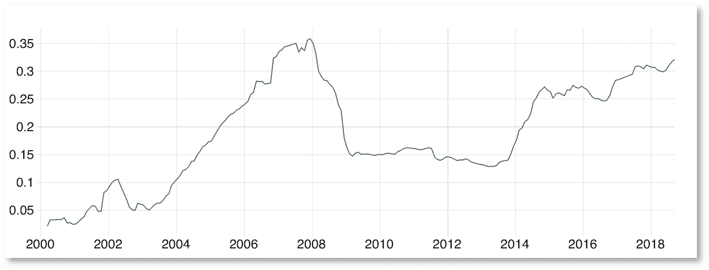
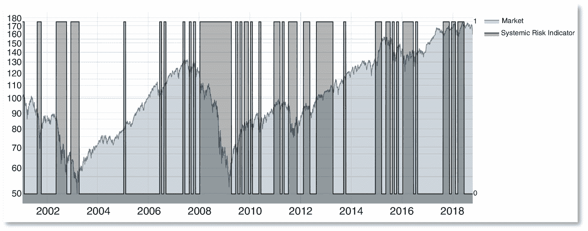
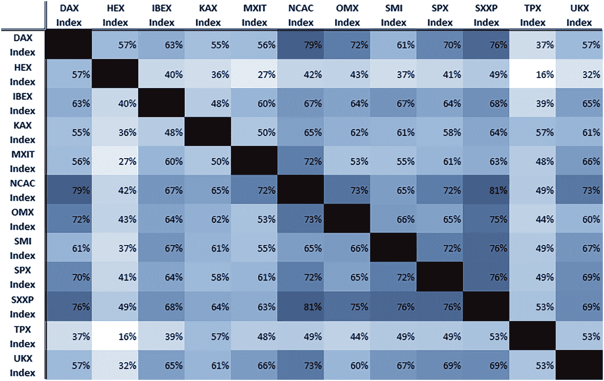
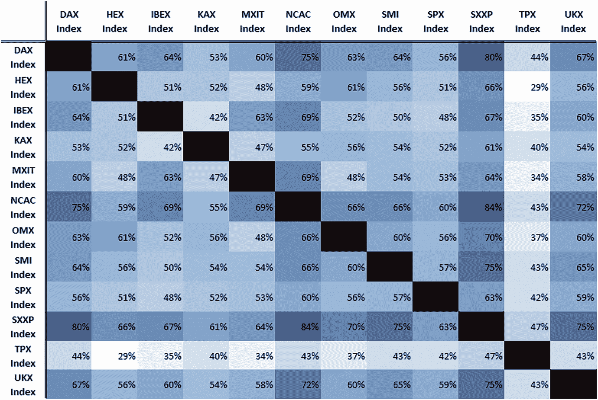
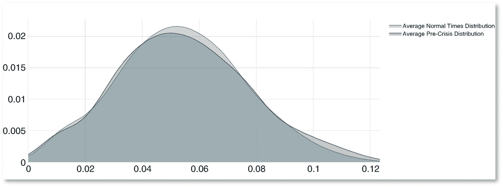
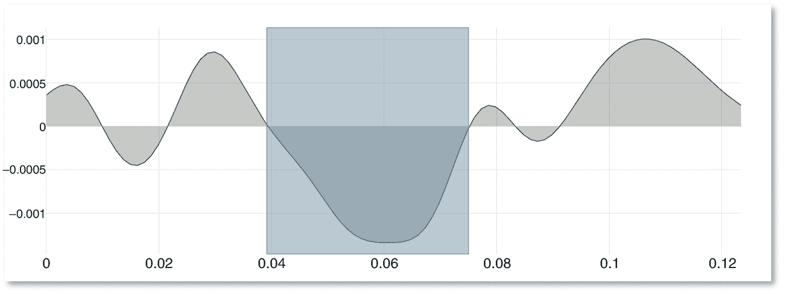
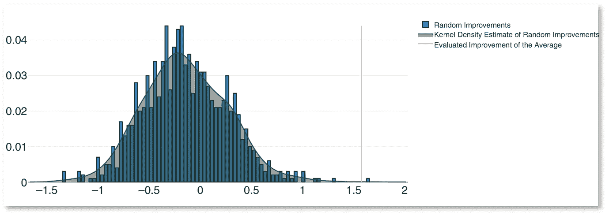
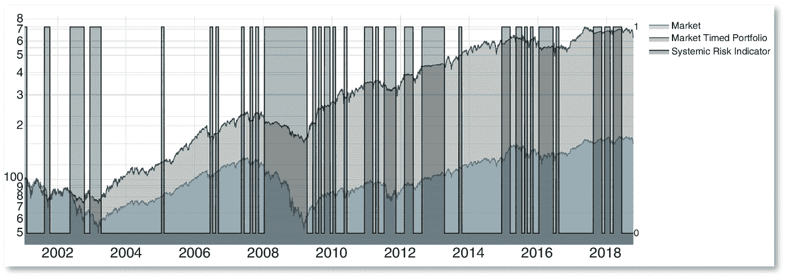
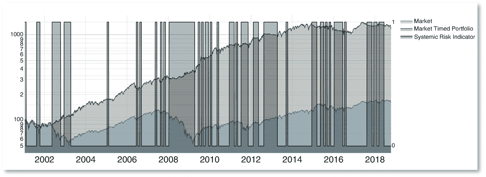

The request was rejected because it was considered high risk

首先我们估计一个多模型：
$$ \left\{Y={\varphi}_i\left({X}_i\right)\kern1em \forall i\right\}. $$
(4.1)

多模型是使用 `LNLM` 模型估计的，如第三章所述：
$$ LNLM(X)\stackrel{\scriptscriptstyle\mathrm{def}}{=}\overline{y}+\mu \sum \limits_{h=1}^u{\hat{\beta}}_h^{NonLin}{H}_h(X)+\left(1-\mu \right){\hat{\beta}}^{Lin}X+\varepsilon \Rightarrow \left\{Y={LNLM}_i\left({X}_i\right)\kern1em \forall i\right\}. $$
(4.2)

多模型是基于滚动基础估计的，使用 5 年的窗口。尽管数据以每日频率可用，但由于我们的计算资源限制，我们只在每月重新执行估计。我们转换每日收益以获得一些月度收益³，这可能显示出更清晰的模式。解释变量的因子集由一个月的滞后产生，以便为我们提供一个明确的因果方向（作为积极的副作用，它还确保我们避免由于国际市场的异步性而使用未来信息）：
$$ \left\{{Y}_t={LNLM}_{i,t}\left({X}_{i,t-1}\right)\kern1em \forall i\right\}. $$
(4.3)

一旦对给定日期完成估计，我们计算每个组成多模型的基本模型的拟合优度指标，即均方根误差。此指标捕获了给定因子与预测股市之间联系的强度。为了删除最不显著的因子，我们过滤多模型以仅保留最低的 80% 均方根误差。

### 4.3.2 系统性风险指标定义

RMSEs 的分布是市场与其整个经济环境保持联系的简单表示。它类似于具有相关性分布，然而，它是一个更一般的表示，因为它允许链接是非线性的，这要归功于使用 polymodels。我们指标的基础是一个假设：在危机爆发之前存在特定的 RMSEs 分布。

RMSEs 的分布是通过简单的核密度估计获得的（参见 Parzen，1962; Rosenblatt，1956）。带宽选择根据 Silverman 的经验法则完成（Silverman，1986）。

首先，我们仅选择后续 3 个月市场回调的 RMSE 分布。我们对危机前分布的表示是这些分布的滚动平均值，以随后 3 个月回报的平方加权（我们假设后续回调越大，分布越具代表性）。滚动平均值采用指数加权方案，半衰期为 10 年，这使我们能够略微加权最近的分布，而非常旧的危机前分布表示则被考虑得越来越不重要。当然，这种滚动表示被适当地移动，以便在每个时间点上，它不使用任何未来信息。

‘正常时期’的分布由市场后 3 个月回报的所有 RMSE 分布的平均值表示，无论该回报的符号如何。

因此，我们得到了每个我们分析的 12 个股票指数的危机前分布的表示和正常时期分布的表示。

一旦获得危机前分布的表示，我们计算这个分布与当前 RMSE 分布之间的 Hellinger 距离。Hellinger 距离越小，市场越接近危机前情况。在下图 4.3 中，我们显示了平均 Hellinger 距离到危机前分布的演变：

图 4.3

平均 Hellinger 距离到危机前分布，随时间变化。

Hellinger 距离绘制的图案清楚地反映了 2008 年金融危机之前的投机泡沫，以及其爆裂。假设这种模式确实具有预测性，那么距离的减小将是关于未来市场回报的负面信号，反之亦然。

我们的系统性风险指标简单地复制了这种推理，其定义为 Hellinger 距离变化的符号:
$$ {SRI}_t\stackrel{\scriptscriptstyle\mathrm{def}}{=}\left\{\begin{array}{c}1\kern0.5em if\kern0.5em \mathcal{H}\left({\mathcal{R}}_t^{Current},{\mathcal{R}}_t^{Pre- Crisis}\right)&lt;\mathcal{H}\left({\mathcal{R}}_{t-1}^{Current},{\mathcal{R}}_{t-1}^{Pre- Crisis}\right)\\ {}0\kern0.5em if\kern0.5em \mathcal{H}\left({\mathcal{R}}_t^{Current},{\mathcal{R}}_t^{Pre- Crisis}\right)\ge \mathcal{H}\left({\mathcal{R}}_{t-1}^{Current},{\mathcal{R}}_{t-1}^{Pre- Crisis}\right)\end{array}\right. $$
(4.4)

这里，“`$${\mathcal{R}}_t^{Current}$$`”是当前日期“t”的 RMSE 分布，“`$${\mathcal{R}}_t^{Pre- Crisis}$$`”是日期“t”可用的 RMSE 预危机分布的上一个表示，“`$$\mathcal{H}\left(\ \right)$$`”是 Hellinger 距离。Hellinger 距离在我们的离散框架中被定义为:
$$ \mathcal{H}\left({\mathcal{R}}_t^{Current},{\mathcal{R}}_t^{Pre- Crisis}\right)\stackrel{\scriptscriptstyle\mathrm{def}}{=}\frac{1}{\sqrt{2}}\sqrt{\sum \limits_{i=1}^n{\left(\sqrt{{\mathcal{R}}_{i,t}^{Current}}-\sqrt{{\mathcal{R}}_{i,t}^{Pre- Crisis}}\right)}²} $$
(4.5)

这里，“`$${\mathcal{R}}_{i,t}^{Current}$$`”是给定因子“i”当前日期“t”的 RMSE 值，“`$${\mathcal{R}}_{i,t}^{Pre- Crisis}$$`”是因子“i”的 RMSE 值，从日期“t”可用的 RMSE 预危机分布的上一个表示中绘制而得。

例如，我们在 Stoxx Europe 600 的情况下在下面显示⁴ 指标（图 4.4）:

图 4.4

系统性风险指标和 Stoxx Europe 600

尽管该指标并不完美，但乍一看，它似乎在大多数市场回调期间激活，即使有一些误报。

### 4.3.3 初步分析

如果我们对系统风险指标的主要预测能力测试是实施交易策略，我们首先进行简单分析以更好地理解指标的性质。

首先，我们展示了由最大似然估计得到的 Logistic 回归的 t 统计量（表 4.3）。由于我们在指标构建中确定的危机前分布被定义为后续出现负 3 个月市场回报，我们感兴趣的变量是代表未来 3 个月回报符号的虚拟变量。解释变量当然是系统风险指标本身：表 4.3

对未来市场回报方向的 Logistic 回归摘要风险指标

|   | a. 全样本 | b. 次贷危机期间（2007 年–2009 年） | c. 次贷危机后期（2010 年–2018 年） |

| --- | --- | --- | --- |

| 德国 DAX 指数 | −4.08171 (***) | −3.870322 (***) | −2.629115 (***) |

| 瑞士 HEX 指数 | −7.097665 (***) | −9.184638 (***) | −6.63464 (***) |

| 西班牙 IBEX35 指数 | −5.653079 (***) | −7.82105 (***) | −3.826911 (***) |

| 德国 KAX 指数 | −9.003569 (***) | −6.395333 (***) | −5.249408 (***) |

| 墨西哥 IPC 指数 | −10.995961 | −11.167755 (***) | −1.806702 (*) |

### 4.3.3 系统风险指标的预测能力

| 中国 A 股指数 | −5.725893 (`***`) | −7.115673 (`***`) | −0.018437 (` `) |
| --- | --- | --- | --- |
| 瑞典 OMX 指数 | −1.126313 (` `) | −1.793216 (`*`) | 0.137003 (` `) |
| 瑞士 SMI 指数 | −7.651904 (`***`) | −8.600267 (`***`) | −2.39497 (`**`) |
| 美国标准普尔 500 指数 | −9.898438 (`***`) | −7.752158 (`***`) | −10.863697 (`***`) |
| 欧洲 SXXP 指数 | −9.53557 (`***`) | −9.376226 (`***`) | −3.017459 (`***`) |
| 日本 TOPIX 指数 | −17.485469 (`***`) | −5.240356 (`***`) | −11.043662 (`***`) |
| 英国 FTSE100 指数 | −5.492477 (`***`) | −10.047277 (`***`) | 1.483732 (` `) |
| 平均值 | −`7.812337 (`***`)` | −`7.363689 (`***`)` | −`3.822022 (`***`)` |
| 中位数 | −7.374785 | −7.786604 | −2.823287 |
| 标准差 | 4.112063 | 2.691223 | 4.024313 |
| 最小值 | −17.485469 | −11.167755 | −11.043662 |
| 最大值 | −1.126313 | −1.793216 | 1.483732 |

在全样本中，系统风险指标在 12 个市场中的 11 个市场中具有高度显著性，这是其预测能力的一个良好迹象。

由于该指标设计精确地预期危机，我们还进行了一些子样本回归，以比较 2008 年次贷危机期间和随后的十年期间（较为平静）指标的表现。结果在所有市场中的 p 值均显著达到 1%的水平，除了 OMX，在危机期间仅达到 7%的 p 值。尽管该指标在第二个时期的整体显著性较低，但它继续在大多数市场中证明具有很高的预测能力。

表 4.4 以下显示了信息系数，这应该与从业者的参考文献共鸣。我们计算了与未来 3 个月回报符号及其值的 IC⁵。有趣的是，在所有情况下预测未来回报的符号是不够的，对于瑞士 HEX 指数和 KAX 指数来说，IC 减少的值是重要的。

#### 表 4.4 系统风险指标的信息系数

|   | DAX 指数（%） | HEX 指数（%） | IBEX 指数（%） | KAX 指数（%） | MXIT 指数（%） | NCAC 指数（%） | OMX 指数（%） | SMI 指数（%） | SPX 指数（%） | SXXP 指数（%） | TPX 指数（%） | UKX 指数（%） |
| --- | --- | --- | --- | --- | --- | --- | --- | --- | --- | --- | --- | --- |
| 未来回报符号 | −6.06 | −10.56 | −8.40 | −13.43 | −16.40 | −8.51 | −1.67 | −11.39 | −14.79 | −14.22 | −26.29 | −8.16 |
| 未来回报价值 | −4.80 | −0.95 | −7.40 | −4.81 | −14.08 | −9.47 | 1.63 | −8.40 | −9.34 | −13.42 | −27.82 | −6.71 |

这些 IC 之间的差异（IC：信息系数）在很大程度上可以通过一些先于市场大幅回报的假阳性/假阴性来解释。

总结这一初步分析，我们考虑指标之间的相关矩阵。该矩阵显示指标之间存在高水平的相关性，平均相关性为 58%（不包括对角线）。这样的配置要求系统性风险指标是否适应每个市场，或者它只是预测一种“平均市场”。回顾该指标预测下一个 3 个月市场回报的符号，我们将这些符号的相关矩阵与指标的相关矩阵进行比较（图 4.5 和 4.6）。

比较这两个矩阵得出结论：指标之间的相关性仅反映市场回报之间的相关性。第二个矩阵的平均相关性与第一个矩阵的相似：57%。

我们还应考虑一些相关性特别低的指标，例如 HEX 和 TPX 的指标，在 t 统计量方面表现良好。因此，我们可以合理地认为我们的系统性风险指标适应了每个不同市场的特定情况。

### 4.3.4 预测能力的根源

为了更好地理解系统性风险指标用于预测未来回撤的模式，我们对 RMSE 的危机前和正常时期分布进行了聚合分析。

我们没有使用这两个分布的滚动平均值，而是直接计算了分布的全样本平均值。然后，我们再次对各个市场的全样本平均分布进行平均，以便获得正常情况和危机前案例的单一代表性分布。

这些代表性分布⁶使我们能够理解危机发生前发生了什么：

图 4.7 似乎显示了一些 RMSE 的同时增加和一些 RMSE 的减少。如果我们计算这两个分布的密度差异，这一现象将变得更加明显（图 4.8）。

上面，我们将密度差异分成三个区域，大致对应于分布的左尾、分布的中心和右尾。在分布的中心，密度明显减少，这意味着在危机之前，通常与股票指数适度相关的因素的数量减少。我们注意到左尾增加，这对应于文献中已经很好地记录的相关性增加。但令人惊讶的是，大部分在中心消失的密度出现在右尾，这意味着通常相关的一些因素的去相关性是危机前时间的一个重要特征。更具体地说，在中心消失的密度中，69.7% 转移到右尾，只有 30.3% 转移到左尾。这些发现，基于市场中的平均代表性分布，似乎也适用于每个市场，在其中右尾和左尾的 fat tail 大多数时间是共存的，尽管右尾 fat tail 似乎更频繁发生（请参见附录：每个股票指数的代表性 RMSE 分布）。

## 4.4 交易策略

我们对系统风险指标的性能的主要评估是通过模拟交易策略来完成的。

### 4.4.1 方法论

模拟交易策略非常简单：我们始终获取市场的回报，但杠杆是可变的，当风险关闭时为 0.5，当风险开启时为 2。由于现在有各种各样的杠杆 ETF 可用，我们假设没有交易成本。（参见注释 7）这也是有道理的，因为由于系统风险指标仅每月计算一次，所以杠杆 ETF 的潜在变化也仅发生一次。

对于每个股票指数，我们计算市场的夏普比率以及市场时机组合的夏普比率。然后，我们计算市场的夏普比率的平均值，以及市场时机组合的夏普比率的平均值。这个平均夏普比率的改善百分比是我们综合分析的核心数字。

我们通过计算其 *p* 值来评估这个数字的显著性。*p* 值的生成如下：

+   对于每个市场，我们计算 Hellinger 距离变化的符号，就像我们对系统风险指标一样。

+   我们在样本时间段内对这些信号进行重新排列，使它们以与 SRI 中相同的比例但在不同的时间点出现。

+   基于重新排列的指标，我们使用相同的交易策略计算新的市场定时投资组合的表现。

+   然后，我们计算我们感兴趣的度量，即市场夏普比率的平均改善。

+   我们重复这个过程 1,000 次，这样我们就得到了随机平均夏普改善的分布。

+   为了避免*p*-值计算中的某些阈值效应，使用核密度估计对分布进行了平滑处理。

+   给定这个分布，我们只需计算我们最初获得的改善水平的概率。

注意，这个过程最终仅评估信号出现的*时刻的相关性*，并确保性能不太可能来自随机机会，或者来自交易策略的特定设计。

### 4.4.2 结果

表 4.5 总结了交易策略的结果，通过呈现每个市场的夏普比率及其改善。

#### 表 4.5 从交易策略获得的夏普比率改善

|   | 市场 | 市场定时投资组合 | 改善 (%) |
| --- | --- | --- | --- |
| DAX 指数 | 0.12 | 0.31 | 148 |
| HEX 指数 | 0.20 | 0.25 | 21 |
| IBEX 指数 | 0.19 | 0.45 | 141 |
| KAX 指数 | 0.38 | 0.73 | 89 |
| MXIT 指数 | 0.02 | 0.30 | 1,275 |
| NCAC 指数 | 0.09 | 0.47 | 394 |
| OMX 指数 | 0.28 | 0.53 | 88 |
| SMI 指数 | 0.14 | 0.50 | 267 |
| SPX 指数 | 0.35 | 0.68 | 95 |
| SXXP 指数 | 0.17 | 0.53 | 205 |
| TPX 指数 | 0.00 | 0.35 | 12,381 |
| UKX 指数 | 0.21 | 0.50 | 140 |
| 平均值 | **0.18** | **0.47** | **157** |

每个市场的表现都通过交易策略得到了改善，并且夏普比率的增加在经济上具有重要意义。

使用先前提到的方法计算的平均改善的`p`-值⁸为 0.06%，证实了性能也具有统计学意义。

我们在下面展示了随机表现的分布（图 4.9）：

图 4.9

随机生成的平均夏普改善分布

在 1,000 个模拟的随机投资组合中，只有一个比所提议的投资组合更好。这个分布也强调了击败市场是极其困难的事实，因为其平均值为 −14.62%。

注意，平均而言，市场定时投资组合有 41% 的时间进行对冲，这是不过度拟合的一个好迹象。事实上，由于每个月重新决定杠杆，随着时间的推移会进行大量不同的投注。与在 20 年模拟中仅对市场进行少数几次投注的指标相比，这显着降低了挑选危机指标的机会。

仍然以之前的例子为例，我们展示下面的策略对 Stoxx Europe 600⁹的表现（完整结果请见附录：按股票指数的市场时机组合和系统风险指标）（图 4.10）：

图 4.10

Stoxx Europe 600：市场时机组合与市场组合（等波动性）

## 4.5 鲁棒性测试

在之前的发展中，我们已经看到指标的频繁变化是防止过度拟合的一个很好的保护措施，并且在子样本中指标仍然具有预测能力。我们通过一系列鲁棒性测试来补充这些发现，评估交易策略的性能对我们所做设计的敏感性。

对于每一个鲁棒性测试，我们提供交易策略显著性的变化，统计学意义上的（`p`值）和经济意义上的（平均夏普比率改善，策略击败市场的指数数量）。

### 4.5.1 对噪声滤波器的敏感性

回想一下，我们使用了一个非常简单的过滤器从 RMSE 分布中去除了噪声因素，这个过滤器只保留了 RMSE 方面排名前 X%的最佳解释变量。这个参数最初设置为 80%，以保留大多数因素。

我们可以在表 4.6 中看到这个选择似乎是合理的：

表 4.6

对于平均夏普比率改善的敏感性和噪声滤波器

| 过滤器分位数（%） | 平均改善（%） | `p`值（%） | 正改善百分比（%） |
| --- | --- | --- | --- |
| 100 | 61.13 | 7.52 (*) | 100.00 |
| 95 | 138.78 | 0.01 (***) | 100.00 |
| 90 | 152.77 | 0.00 (***) | 100.00 |
| 85 | 148.82 | 0.01 (***) | 100.00 |
| 80 | 157.49 | 0.06 (***) | 100.00 |
| 75 | 153.45 | 0.04 (***) | 100.00 |
| 50 | 92.54 | 0.61 (***) | 100.00 |
| 25 | 58.08 | 3.16 (**) | 100.00 |
| 10 | −0.86 | 33.49 () | 58.33 |

从表 4.6 中可以提取的第一个发现是，交易策略的表现对于特定过滤级别的选择是鲁棒的，除了在极端区域。

其次，我们的方法是选择一个合理的过滤器值。确实，可以使用 99%分位数达到更高水平的历史表现，然而，这样的选择似乎对于 100%分位数的性能来说是危险的。在这个区域内的一些变量似乎在 RMSE 分布中引入了很多噪声，并且在一个相关和一个噪声变量之间的边界在这个区域是非常薄的。

作为第三点，我们想要提到的是，绝大多数因子集似乎对危机预测很重要。这强调了选择一个大的因子集来描述我们正在预测的股票指数的整个经济环境的必要性。

### 4.5.2 对未来收益窗口的敏感性

该指标设计为预测市场未来 3 个月的收益的符号。这个选择是根据一些从业者的启发式规则做出的，1 个月通常被认为对于危机预测来说太嘈杂，而接下来的几个月被认为不太可预测。我们对这个参数的敏感性分析证实了这个观点，同时显示了交易策略对这个参数的明确鲁棒性（表 4.7）。

表 4.7

未来收益窗口的平均夏普比率改善的敏感性

| 未来收益窗口 | 平均改善 (%) | `p` 值 (%) | 正改善百分比 (%) |
| --- | --- | --- | --- |
| 1 个月 | 117.11 | 0.12 (***) | 83.33 |
| 2 个月 | 131.78 | 0.10 (***) | 100.00 |
| 3 个月 | 157.49 | 0.06 (***) | 100.00 |
| 6 个月 | 147.46 | 0.00 (***) | 100.00 |
| 9 个月 | 139.71 | 0.00 (***) | 100.00 |
| 12 个月 | 115.93 | 0.00 (***) | 100.00 |

### 4.5.3 对半衰期的敏感性

预危机 RMSE 分布是根据过去观察的指数加权方案在滚动基础上定义的。当前预危机分布 '忘记' 过去事件的速度由这个指数窗口的半衰期控制。我们的选择是将其设置为 10 年，以便具有考虑非常老的事件的表现，同时更加关注当前。

下表显示这是一个不错的选择（即使不是最好的选择）。此外，策略绩效对该参数的鲁棒性仍然相当好（表 4.8）。

表 4.8

平均夏普比率改善对指数窗口的半衰期的敏感性

| 指数窗口的半衰期 | 平均改善 (%) | `p` 值 (%) | 正改善百分比 (%) |
| --- | --- | --- | --- |
| 20 年 | 149.82 | 0.11 (***) | 100.00 |
| 15 年 | 152.46 | 0.10 (***) | 100.00 |
| 10 年 | 157.49 | 0.06 (***) | 100.00 |
| 5 年 | 161.12 | 0.00 (***) | 100.00 |
| 3 年 | 154.84 | 0.00 (***) | 100.00 |
| 1 年 | 96.74 | 0.41 (***) | 100.00 |

### 4.5.4 对滚动窗口长度的敏感性

我们用于计算 RMSE 的 polymodel 本身是根据滚动基础上估计的。

我们可以看到下面的表明用于该估计的滚动窗口的长度是一个重要参数（表 4.9）：

表 4.9

平均夏普比率改善对 polymodel 估计窗口的敏感性

| polymodel 估计窗口 | 平均改善 | `p` 值 | 正改善百分比 |
| --- | --- | --- | --- |
| 6 年 | 27.09 | 9.01 (*) | 91.67 |
| 5 年 | 157.49 | 0.06 (***) | 100.00 |
| 4 年 | 56.84 | 8.32 (*) | 75.00 |
| 3 年 | 78.38 | 1.24 (**) | 91.67 |

尽管平均值和 `p`-value 在所有情况下的改进仍然显著，但在其他稳健性测试中，从经济和统计角度来看，程度要小得多。因此，估计的质量特别与此参数相关联：较短的窗口包含较少的数据点，并使拟合以及其拟合度指标变得不太可靠，而较长的窗口则估计一个演变速度过慢的模型，因此无法有效捕捉市场的相对快速动态。考虑到这种推理和上述结果，5 年期窗口似乎是相当合理的。

然而，特别是因为我们正在衡量交易策略的表现，确保能够基于我们的系统性风险指标构建稳健的交易策略至关重要。因此，为了限制随意选择窗口参数的风险，我们重新计算指标和策略的表现，使用一个 6 年、一个 5 年、一个 4 年和一个 3 年滚动窗口的 RMSE 的平均值。使用这个平均 RMSE 计算指标是一种简单的方法，可以使其对特定窗口的选择更加稳健。

结果是这个“窗口稳健策略”仍然表现得相当不错。平均改进率为 95%，与 `p`-value 的 0.16% 相关联。在这个策略的版本中，之前的数字仍然是可比较的，平均随机改进率为 −12.63%，样本内平均对冲率为 35.96%，有 11 个股票指数超过市场。最终，即使被更弱的版本所稀释，我们的交易策略也能够取得强劲的结果（表 4.10）：

表 4.10

对于“窗口稳健策略”的夏普比率的改进

|   | 市场 | 市场定时组合 | 改进 (%) |
| --- | --- | --- | --- |
| DAX 指数 | 0.12 | 0.06 | −49 |
| HEX 指数 | 0.20 | 0.29 | 41 |
| IBEX 指数 | 0.19 | 0.33 | 73 |
| KAX 指数 | 0.38 | 0.76 | 99 |
| MXIT 指数 | 0.02 | 0.13 | 502 |
| NCAC 指数 | 0.09 | 0.32 | 235 |
| OMX 指数 | 0.28 | 0.30 | 7 |
| SMI 指数 | 0.14 | 0.34 | 153 |
| SPX 指数 | 0.35 | 0.62 | 76 |
| SXXP 指数 | 0.17 | 0.43 | 149 |
| TPX 指数 | 0.00 | 0.24 | 8,311 |
| UKX 指数 | 0.21 | 0.40 | 93 |

| 平均 | **0.18** | **0.35** | **95** |

### 4.5.5 资产类别特定表现

对于这个测试，我们将因子集限制为单个资产类别。进行此测试有两个动机：

+   测试每个资产类别对整体危机预测的贡献。

+   在较小的程度上，它还使我们能够测试我们提出的结果是否不受特定数据集的选择的限制。

在这里，我们的分析仅限于包含足够因子来估算分布的资产类别，因此房地产、对冲基金和波动性被排除在外。表 4.11 表明，没有任何资产类别在聚合因子集中单独占据主导地位。这证明了因子资产类别的多样性有助于预测的质量。

表 4.11 对资产类别夏普比率平均改进的敏感性

| 资产类别 | 平均改进 (%) | *p*-值 (%) | 正改进的百分比 (%) |
| --- | --- | --- | --- |
| 股票市场 | 104.89 | 0.33 (***) | 91.67 |
| 股票因素 | 29.99 | 12.55 () | 66.67 |
| 货币 | 67.51 | 1.47 (**) | 83.33 |
| 商品 | 71.20 | 0.62 (***) | 100.00 |
| 公司债券 | 33.79 | 9.87 (*) | 83.33 |
| 主权债券 | 66.99 | 0.72 (***) | 91.67 |
| 货币市场 | −32.26 | 62.51 () | 16.67 |

根据这些结果，很明显股票市场是最重要的资产类别，这是一种自然的发现。然而，大多数其他资产类别也在这种独立基础上表现良好，这表明交易策略可以独立于特定因子集的选择而执行。

### 4.5.6 对交易策略的敏感性

现在我们讨论我们观察到的表现程度是我们特定杠杆选择的结果。由于返回的全样本波动率被标准化，使得市场和交易策略可以比较，控制策略攻击性的是风险关闭杠杆和风险开杠杆之间的差异的大小，而不是杠杆本身的水平。因此，我们尝试改变风险关闭杠杆，同时将风险开杠杆保持恒定为 2。

此外，我们尝试了一个 In/Out 策略，在这种策略中，当风险关闭时杠杆被设置为 0。

最后，我们也允许做空操作，使得策略变得极具攻击性和危险性，因为众所周知市场平均上涨。

下面是针对这些不同设置的结果（表 4.12）：

表 4.12 对杠杆使用的平均夏普比率改进的敏感性

| 风险关杠杆 &#124; 风险开杠杆 | 平均改进 (%) | *p*-值 (%) | 正改进的百分比 (%) |
| --- | --- | --- | --- |
| 风险关 -1 &#124; 风险开 2 | 201.88 | 0.14 (***) | 91.67 |
| 风险关 -0.5 &#124; 风险开 2 | 215.39 | 0.09 (***) | 100.00 |
| 风险关 0 &#124; 风险开 2 | 201.83 | 0.07 (***) | 100.00 |
| 风险关 0.25 &#124; 风险开 2 | 182.78 | 0.06 (***) | 100.00 |
| 风险关 0.5 &#124; 风险开 2 | 157.49 | 0.06 (***) | 100.00 |
| 风险关 1 &#124; 风险开 2 | 99.19 | 0.08 (***) | 100.00 |

非常显著的是，*p*-值对性能水平相当不敏感，这是一个很好的指标，表明我们提出的用于计算这个 *p*-值的方法是可靠的。

请注意，当我们增加攻击性时，表现始终会增加，直到−1|2 的情况。这是一个极其强烈的预测力的迹象，表明该策略在空头销售中仍然生存，并且在这种框架下甚至变得更好。然而，如果要使用空头销售，应该小心进行。

实际上，在−0.5|2 的情况下，平均随机改善为−49%，这清楚地表明，空头销售市场是一种极端危险的策略，对于这种策略，我们应该对基础信号有极高的信心。

然而，如果该策略成功，这也是一个极端的点：在下面，我们展示了 Stoxx Europe 600 的示例，其中−0.5|2 策略达到了 1,242.44 点的最终水平（2001 年基数 100），而市场的最终水平为 165.92 点（请记住，两个投资组合的回报率具有相同的波动性）（图 4.11）。

图 4.11 Stoxx Europe 600：具有激进杠杆策略的定时市场投资组合，与市场投资组合（等波动性）相比

## 4.6 结论

在本章中，我们介绍了基于多模型的系统性风险指标及其相关交易策略。

该指标的预测能力已经在几个市场和时间段上被证明在统计学和经济学上是显著的。这些结果在进行的测试中被发现是稳健的。然而，通过选择/组合更好/不同的策略参数可以增加策略的稳健性以及其性能。

在改进指标设计方面，可以探索不同的路径。在计算资源的限制下，以每日频率估计指标可能会改变游戏规则，因为该指标有时只会在市场下跌开始几天后出现高峰。应该还要测试为指标开发的方法，以查看它是否能够预测市场的反弹。实际上，可能会发生一些特定的赶羊行为，例如在投机泡沫开始时。如果是这样，还可以通过区分狂热的模仿和集体恐慌来改进危机指标。

这最后一点强调了加强指标的经济基础的必要性。在危机之前更好地了解哪些因素在经济上最相关或最不相关以及它们为什么会相应行动尤其重要。

指标还应与现有替代方案进行比较，以衡量其如何为旨在从各种市场定时信号中获益的投资组合增加价值（例如，其表现可以与其他市场压力指标进行比较，例如芝加哥联邦储备银行的全国金融状况指数（NFCI））。

文献已经确定了几个系统风险指标。然而据我们所知，截至撰写本文时，所有这些指标都是基于相关性的增加。本章通过识别另一种、同时可能更强烈的因素去相关化现象，为文献增加了价值。考虑到代表性的危机前分布形状以及系统风险指标取得的结果，这一发现可能是理解金融危机的关键之一。