# 第五章： 行业回报预测

Thomas Barrau^(1  ) 和 Raphael Douady²(1)AXA 投资管理者 Chorus Ltd，香港，中国香港特别行政区。(2)巴黎第一索邦大学经济中心，法国巴黎。

## 摘要

我们提出了一个新的因子，用于预测股票市场上行业回报的横截面。该因子基于反脆弱性的度量，指出市场参与者对市场和行业回报之间的非线性关系定价。它被证明与其他众所周知的行业因子不同，包括下行贝塔和共偏斜因子，这些因子完全被反脆弱性因子所包含。从该因子推导出的交易策略表现出 1.10 的夏普比率，并成功通过了各种稳健性测试。

关键词：反脆弱性、LNLM 建模、行业回报横截面、交易策略、交易信号、股票回报预测、共偏斜、下行贝塔

## 5.1 引言

在本章中，我们预测股票回报的行业组成部分的回报。更确切地说，我们研究了一个能够预测未来行业回报的市场反脆弱性因子的存在。

自从 Fama 和 French (1993) 以来，一直有一项长期传统，即确定解释股票回报横截面的因素。然而，只有少数论文涉及预测行业回报横截面的问题，其中最著名的例子之一是 Asness 等人 (2000)。在当前章节中，我们为这一特定主题的文献添砖加瓦。

我们将市场的反脆弱性定义为行业回报对市场冲击的非线性响应的凸性。支持反脆弱性因子表现的经济原理可以从行为学和经典金融的有效市场两个角度来看。

从有效市场假说的角度来看，反脆弱性因子可以解释为一种风险溢价。利用反脆弱性信号构建的投资组合在脆弱行业上建立多头头寸，并在抗脆弱行业上建立空头头寸。因此，对于极端市场事件，该投资组合因其在行业上的凹位而遭受损失，特别是由于其损失随市场变动幅度的加剧而加剧。由于这类事件的发生概率很低，投资组合的行为将会出现一些偶发性的崩溃。这些回撤在模拟的损益曲线中可以清楚地识别出来。因此，脆弱行业的持续异常回报可能被视为对它们所承担的极端风险的补偿，即作为一种风险溢价。

从行为金融的角度来看，反脆弱性因子也可能是合理的。事实上，我们可以认为脆弱的行业构成了一个投资机会，因为投资者过度购买了反脆弱的行业。这种行为与投资者的损失厌恶偏向非常一致，他们宁愿以非常高（太高）的价格购买反脆弱的行业，也不愿承受极端损失的风险。

市场风险作为解释股票回报横截面的因素已经被广泛探讨。

低贝塔异常，例如贝克等人（2011）提出的，在股票回报横截面中是一个众所周知的预测因子。低贝塔指的是在以股票回报为目标变量、市场回报为解释变量的线性模型中估计的参数。从长期来看，低贝塔（和低波动）股票表现优于高贝塔（高波动）股票。这种现象更符合市场异常而不是风险溢价解释，因为风险较高的股票表现最差。这与我们观察到的反脆弱风险度量完全相反，这并不使低贝塔异常成为一个非常有希望的解释候选。尽管如此，由于贝塔是线性模型的一阶导数，而反脆弱性是非线性模型的平均二阶导数，我们应该对其进行控制。

如 Ang 等人（2006）所示，下行贝塔是一种旨在捕捉下行风险的风险度量。它指的是作为一个市场贝塔被估计为：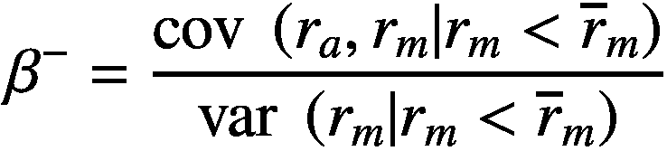(5.1)*这里 r*[*a*] *是给定股票 a 的回报，r*[*m*] *是市场的回报，而* 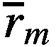 *是市场的平均回报。*因此，它简单地是一个在只考虑市场下行回报时评估的贝塔。这样的指标与简单的市场贝塔性质高度相关，这促使 Ang 和同事引入了一个相对下行贝塔，这是我们在下文中关注的指标：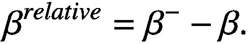(5.2)在论文中，相对下行贝塔是一种风险溢价：具有较高下行贝塔的股票与高未来回报相关，以补偿持有该股票的风险。这种行为可以通过损失厌恶来解释，并且与抗脆性异常的方向相同。余偏度是给定股票市场风险的另一种度量，更侧重于极端事件，比如抗脆性。它可以定义为：![$$ coskew=\frac{E\left[\left({r}_a-{\overline{r}}_a\right){\left({r}_m-{\overline{r}}_m\right)}²\right]}{\sqrt{\mathit{\operatorname{var}}\ \left({r}_a\right)}\mathit{\operatorname{var}}\ \left({r}_m\right)}. $$](img/519851_1_En_5_Chapter_TeX_Equ3.png)(5.3)Harvey 和 Siddique（2000）已经将余偏度提出作为一种风险溢价。因此，我们要确保我们没有提出这种风险因素的变化。

尽管所有这些异常都基本上已经被探索用于预测股票回报的横截面，但其基本原理似乎适用于解释行业回报的横截面。因此，我们使用这些其他预测因子作为基准并强调抗脆性异常，以控制我们对文献的贡献的现实性。事实上，抗脆性异常似乎比先前文献中已经识别的任何其他异常都更强大，至少与行业回报的特定问题相关。

本章组织如下：

+   我们首先介绍用于进行我们的实证分析的数据。

+   然后我们定义用于测量抗脆性和构建一个针对股票回报横截面的行业投注的方法论。

+   提出了实证结果，包括受益于抗脆性因子的交易策略的表现。

+   几项健壮性测试被执行以控制结果的可靠性，之后我们总结了本章内容。

## 5.2 数据

我们使用 Refinitiv（前 Reuters）的数据获取每日收益、市值和行业分类，其定义由 GICS 3 分类（全球行业分类标准，MSCI）确定，所有数据均使用美元的日终数据进行测量。我们的样本覆盖了 1999-01-01 至 2018-09-30 的期间。

我们的投资范围由美国股市中市值最大的 500 家公司组成，每月重新计算一次。

“行业”被定义为同一行业的股票的等权重桶。 “市场”是由行业组成的等权重投资组合。

### 5.2.1 摘要统计

使用 GICS 3 分类会产生一个包含 66 个行业的宇宙。每个桶内元素的简单计数揭示了随着时间的推移不同部门之间可能出现的巨大差异（见表 5.1）：表 5.1

行业桶的摘要统计信息：子元素（股票）的计数，聚合统计

| 平均 | 标准差 | 最小 | 中位数 | 最大 |
| --- | --- | --- | --- | --- |
| 8.10 | 7.07 | 1.00 | 6.00 | 52.00 |

量化表格（见表 5.2）显示，随着时间的推移，有一些行业包含了大量元素：表 5.2

行业桶的摘要统计信息：子元素（股票）的计数，聚合分位数

| 0.00 | 0.05 | 0.10 | 0.25 | 0.50 | 0.75 | 0.90 | 0.95 | 1.00 |
| --- | --- | --- | --- | --- | --- | --- | --- | --- |
| 1.00 | 1.00 | 1.00 | 3.00 | 6.00 | 12.00 | 17.00 | 21.00 | 52.00 |

我们清楚地观察到元素数量的类似于帕累托分布的情况，这促使我们使用等权重方法来定义市场投资组合。事实上，我们希望捕捉行业对其经济环境的反应，该环境由代表性市场来近似，而不仅仅是由少数几个行业决定。这种思维进一步得到了对行业市值随时间变化的绘图（见图 5.1）和它们的量化表格（见表 5.3）的支持！

图 5.1

随时间变化的行业桶的市值

表 5.3

行业的市值

|   | 0.00 | 0.05 | 0.10 | 0.25 | 0.50 | 0.75 | 0.90 | 0.95 | 1.00 |
| --- | --- | --- | --- | --- | --- | --- | --- | --- | --- |
| 平均市值分位数 | 8.86E+09 | 1.21E+10 | 1.60E+10 | 3.74E+10 | 1.25E+11 | 3.16E+11 | 4.74E+11 | 6.32E+11 | 1.05E+12 |

附录：行业桶摘要统计详细描述了行业的统计信息。

## 5.3 方法论

### 5.3.1 衡量反脆弱性

反脆性由塔勒布（2012）提出，其数学方面由塔勒布和 Douady（2013）详细阐述。塔勒布（2013）提供了反脆性概念的以下定义：“简单地说，反脆性被定义为对于应力或伤害源（在某种变化范围内）的凸响应，导致对波动的增加具有积极的敏感性（或可变性，压力，结果分散或不确定性，被归类为‘混乱集团’的指定）的敏感性。同样，脆弱性被定义为对应力的凹敏感性，导致对波动增加的负敏感性。”

起初，人们可能认为这个概念与鲁棒性或弹性相近。塔勒布（2012）阐明了这一点：“反脆性超越了弹性或鲁棒性。鲁棒的抵抗冲击而保持不变；而反脆弱则变得更好。”。

这样的特性对于股票来说似乎是可取的，因为任何投资者都希望他们投资组合的组成部分在不利情况下表现优于市场。

通常，通过其对*X*的敏感性来衡量变量*Y*的反脆性可以分为两个简单的步骤：

+   估计*X*和*Y*之间的反应φ(X)的非线性函数，例如使用线性非线性混合模型。

+   计算反脆性指标，即在*X*的定义域上对反应函数的二阶导数的积分³。我们通过一个求和来近似该函数，在该求和中，*X*[i]在*X*的定义域上以固定间隔采样（这样的近似可能通过对*p(X)*进行非参数估计来改进）：

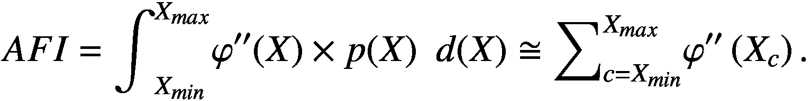(5.4)

### 5.3.2 预测行业回报

下列预测背后的直觉是，反脆性可以成为专门用于因子投资的大量文献的一部分。实际上，这些文献揭示了股票回报的横截面具有高度的多维性。感兴趣的读者可以参考 Green 等人（2014）和 Hou 等人（2017）对现有因子的详尽回顾。此外，有几篇出版物指出，通过对一些行业做多头，对其他行业做空头来形成投资组合，行业间的因子投资也是可能的（例如，Asness（2000））。

根据之前的研究，我们评估了他们的反脆性水平对未来行业回报的预测能力。

我们使用在第 5.3.1 节中定义的 AntiFragility Indicator（AFI）来衡量反脆弱性。在描述特定背景下的反脆弱性时，一个关键问题是定义分析对象对什么敏感。市场是一个方便且自然的选择，因为它可能是与行业相互作用的第一个冲击向量。即使我们只能获取每日数据，我们也尝试识别行业的低频响应，使用每日重新计算的 21 天累积收益来进行 LNLM 估计。这使我们能够看到行业在熊市和牛市期间如何反应一个月。对于鲁棒性的问题，我们使用了一个非常大的滚动窗口，为每次拟合提供了 5 年的数据，允许每个拟合使用 1,260 个数据点（月收益每天重新计算）。出于计算原因，我们每 3 个月才重新计算一次 AFI。

为了以最忠实的方式代表市场，一旦股票进入投资范围，我们将其保留在用于计算 AFI 的行业桶中，即使它之后退出了投资范围。这使我们能够获得更具代表性的行业收益，即使我们随后只部分押注于它们，因为我们将我们的持仓限制在投资范围内。

一旦计算出 AFI，我们使用几种手段评估其预测能力。

在第一步中，我们实施了一种长/短交易策略。

长/短组合的输入是基于 AFI 信号的归一化版本。在每个日期，我们按照它们的 AFI 降序排列行业，并将得到的排名信号归一化为在 −1 到 1 之间均匀分布。实际上，我们只关心相对行业反脆弱性对未来收益的影响，而信号的平均值为 0 可以在一定程度上中和市场作为投资组合收益的来源。在因子投资策略中，这样的排名和归一化程序很简单（例如，参见 Chan 等人 1998，或 Coqueret 和 Guida 2018）。为了方便起见，在接下来的内容中，我们使用首字母缩略词“AFI”来指代归一化的反脆弱性指标。

然后，信号被映射到行业的子组件，属于同一个行业桶的所有股票共享相同的行业评分。出于现实性考虑，进行这个操作，因为没有真实的投资工具可以直接投资到我们的行业桶。

投资组合权重通过优化特征组合来计算，以反映映射到股票上的分数。选择特征组合与我们关注获得反脆弱性特征预测能力的投资组合一致。对于给定的资产特征（或特征）向量 κ = [κ[1], κ[2], …, κ[b]]，以及资产的投资组合权重 *w* = [w[1], w[2], …, w[b]]，投资组合对给定特征的敞口简单地为：

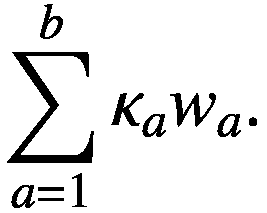(5.5)属性 κ 的特征组合被定义为具有最小风险（以方差表示）且对特征 κ 具有单位曝光的组合（即等式 (5.5) 等于 1）。例如，资产贝塔的特征组合是市场组合。尊重这些属性的组合的持仓可以通过一个简单的封闭公式⁴（Grinold & Kahn，2000）获得：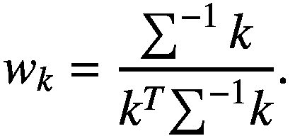(5.6)*这里 Σ 是资产的方差 - 协方差矩阵。*

因此，特征组合是执行均值方差优化的便捷选择，同时很好地反映了给定特征的预测能力。由此产生的持仓标准化为具有 10% 预期目标波动率。

在第二步中，我们进行更多的理论练习，将未来 3 个月的回报回归到 AFI 上。

## 5.4 结果

LNLM 拟合显示了使用非线性建模的兴趣。例如，在下图 5.2 中，我们展示了所有行业在 2008-03-10 的拟合结果：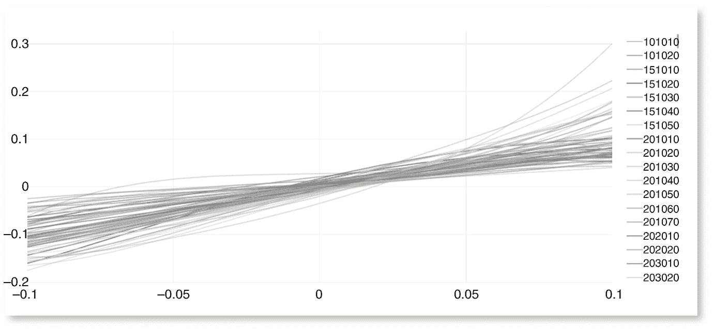

图 5.2

行业回报通过市场回报的 LNLM 建模

无论行业如何，图 5.2 显示它们都没有完全采用线性行为。

### 5.4.1 长/短交易策略

我们每天使用 2 天前计算的优化权重计算策略的损益。这 2 天的滞后是基于以下假设的交易过程：在日期 t，美国市场收盘后，我们收集所有所需数据，计算 AFI 并优化特征组合。必须执行的结果交易将在 t + 1 的早上发送到市场，并在当天执行，以便在 t + 1 结束时达到优化的持仓。因此，在日期 t + 2，P&L 是在前一天结束时达到的仓位的收益，即日期 t 的优化权重。

我们以下图 5.3 形式的累积（复合）损益曲线呈对数刻度显示，因为这样可以轻松比较不同时期，从而评估策略随时间的稳定盈利能力（图 5.3）。我们从 2004 年的基数 100 开始。在整个周期内，L/S 策略的夏普比率⁵ 是 1.10。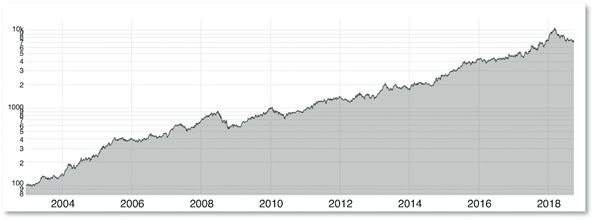

图 5.3

防脆弱因子策略的损益表

上图清楚地表明，在足够长的时间段内，该策略是盈利的。以下是该策略的主要统计数据（表 5.4）：⁶Table 5.4

防脆弱交易策略的绩效统计

| 年度超额回报 | 夏普比率 | 换手率 | 年度波动率 | 最差回撤 5 天 | 最差回撤 21 天 | 最差回撤 252 天 | 最差回撤全期 |
| --- | --- | --- | --- | --- | --- | --- | --- |
| 29.23% | 1.10 | 5.73 | 26.58% | −16.37% | −23.31% | −28.51% | −42.01% |

请注意，对持仓进行的波动控制明显不足以达到可接受的波动水平（最初的目标是 10%，远低于 26%的实现波动率）。尽管如此，这对夏普比率的影响较小，而夏普比率是我们评估策略预测能力的主要性能指标。

该策略在 2008 年和 2018 年经历了较大的回撤。对于这种现象可能有几种解释。其中，我们可以推测反脆弱因子受到次贷危机和 2018 年量化危机的影响。⁷ 实际上，这种回撤模式与 AFI 投资组合承受的极端市场波动的暴露是一致的。

### 5.4.2 未来回报的回归

我们将行业的未来 3 个月累积回报（不进行复利计算）回归到 AFI 的当前值上，以对其预测能力进行第二次评估。我们在下面显示这个线性回归的结果（表 5.5）：表 5.5

AFI 对未来回报的回归

|   | 系数 | 标准误差 | *t*-统计量 | *P* > &#124;t&#124; | [95.0% 置信区间] |
| --- | --- | --- | --- | --- | --- |
| 常数 | 0.0005 | 0.0000 | 140.307 | 0.00E+00 | 0.001 0.001 |
| AFI | 0.0317 | 0.006 | 5.032 | 0.00E+00 | 0.019 0.044 |

当然，常数极具统计学意义，因为它捕捉了市场的回报（请记住，横截面 AFI 分数的平均值为 0）。尽管如此，信号显示出很高的统计学意义水平，*t*-统计量为 5.032，*p*-值为 4.84E−5%。

### 5.4.3 与经典因子的比较

在寻找新因子的过程中，一个非常重要的测试是检查反脆弱因子是否能够在经典因子之上增加价值。为了做到这一点，我们使用与 L/S 策略完全相同的方法计算常见因子的特征组合的盈亏，并尝试用它来解释反脆弱投资组合的回报。

当然，我们主要控制市场因子，定义为我们市场基准的回报。

在第二次回归中，我们整合了经典的价值和规模因子，以控制法玛和法国（1993）的标准因子。⁸ 价值被计算为净资产（资产减去负债）除以当前市值的比率。我们通过在每个行业内对其进行平均来聚合股票水平信号。规模信号为市值的对数的负值。我们通过对股票水平信号求和来进行聚合。

第三次回归中，我们包括市场投资组合回报，以及低贝塔投资组合、动量投资组合、负向贝塔投资组合和共偏投资组合。添加这些统计因素的动机是我们怀疑它们与反脆弱因素有关，因为它们是使用相同的数据计算的，即回报。这种推理尤其适用于低贝塔，因为我们的拟合曲线的形状非常曲折，可能可以近似为陡峭的直线。正如本章介绍中所解释的那样，负向贝塔和共偏也是解释反脆弱异常回报的特别相关的候选因素。动量信号的计算遵循经典方法，即计算 11 个月的回报滞后 1 个月（Carhart (1997)，另请参见 Jegadeesh 和 Titman (1993)）。我们直接在这里使用我们行业桶的回报。低贝塔是作为简单单变量回归的参数计算的，每天的行业回报对市场进行回归（包括一个常数），使用 1 年滚动窗口。负向贝塔是使用介绍中提出的公式计算的（为了更加精确，我们继续考虑相对下行贝塔），以及共偏。 

以下是三次回归的结果。我们将利润和损失的波动率标准化为年度 10%，以便比较系数（表 5.6，5.7 和 5.8）。表 5.6

AFI 回报对 CAPM 回报的回归

|   | 系数 | 标准误差 | *t*-统计量 | *P* > &#124;t&#124; | [95.0% 置信区间] |
| --- | --- | --- | --- | --- | --- |
| 常数 | 0.0004 | 0.0001 | 3.939 | 0.00E+00 | 0.000 0.001 |
| 等权重市场投资组合 | 0.2158 | 0.015 | 13.936 | 0.00E+00 | 0.185 0.246 |

表 5.7

AFI 回报对 Fama–French 3 因子回报的回归

|   | 系数 | 标准误差 | *t*-统计量 | *P* > &#124;t&#124; | [95.0% 置信区间] |
| --- | --- | --- | --- | --- | --- |
| 常数 | 0.0004 | 9.45E−05 | 3.91 | 0.00E+00 | 0.000 0.001 |
| 等权重市场投资组合 | 0.0007 | 0.021 | 0.032 | 9.74E−01 | −0.040 0.041 |
| 规模投资组合 | −0.1862 | 0.016 | −11.617 | 0.00E+00 | −0.373 |
| 价值投资组合 | 0.2286 | 0.02 | 11.562 | 0.00E+00 | 0.190 0.267 |

表 5.8

AFI 回报对 5 个统计因素回报的回归

|   | 系数 | 标准误差 | *t*-统计量 | *P* > &#124;t&#124; | [95.0% 置信区间] |
| --- | --- | --- | --- | --- | --- |
| 常数 | 0.0003 | 8.36E−05 | 3.142 | 2.00E−03 | 9.88e−05 0.000 |
| 低贝塔投资组合 | 0.2015 | 0.015 | 13.575 | 0.00E+00 | 0.172 0.231 |
| 等权重市场投资组合 | −0.0583 | 0.015 | −3.803 | 0.00E+00 | −0.116 |
| 动量投资组合 | 0.0984 | 0.015 | 6.568 | 0.00E+00 | 0.069 0.128 |
| 共偏投资组合 | 0.2396 | 0.016 | 15.22 | 0.00E+00 | 0.209 0.270 |
| 负向贝塔投资组合 | 0.3165 | 0.016 | 20.126 | 0.00E+00 | 0.286 0.347 |

无论用于回归的因素是什么，我们始终保留一个高度统计显著的常数低于 0.2%的*p*-值。这个常数在经济上也是显著的，并且对应于最后一个回归中的约 17%的异常年收益（在回归之前没有复利，没有波动率标准化）。这种水平的异常收益当然取决于杠杆和波动率。第三个回归的 R²为 30.3%，策略的夏普比率为 1.10，我们可以期望异常收益约为 11% *（1−0.303） = 7.67%，对于实现波动率为 10%，这仍然是经济上显著的。

下面我们展示了统计投资组合的损益，这似乎表明所有 5 个因素都在行业水平上表现良好：

从图 5.4 可以看出，反脆弱性似乎是一个相对强大的因素！

图 5.4

因素投资组合复合收益（年均波动率相等滚动 10%）

从统计因素的损益相关矩阵中可以看出，与预期相符，反脆弱性特别与下行贝塔和共偏异常相关，这些风险溢价与反脆弱性具有相同的基础（图 5.5）：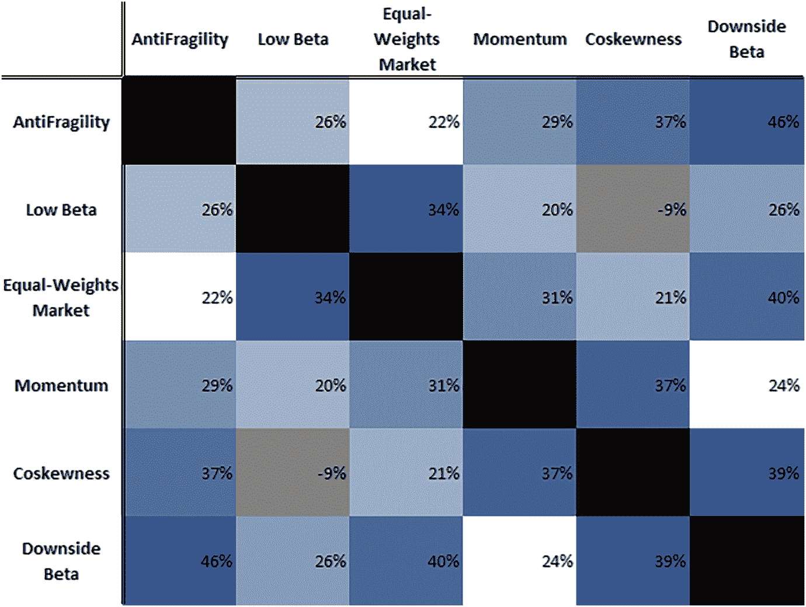

图 5.5

因素收益的相关矩阵

这种相关水平可能表明，共偏性和下行贝塔捕获了与反脆弱性相同的α来源。为了更好地理解这两个异常和反脆弱性之间的联系，我们进行了单变量线性回归，在这些回归中，我们将反脆弱性建模为另一个异常的函数，反之亦然。在共偏性的情况下，两个估计模型的结果如下（表 5.9 和 5.10）：Table 5.9

对共偏性收益进行回归

|   | 系数 | 标准误差 | *t*统计量 | *P* > &#124;t&#124; | [95.0% 置信区间] |
| --- | --- | --- | --- | --- | --- |
| 常数 | 0.0004 | 9.29E−05 | 4.105 | 0.00E+00 | 0.000 0.001 |
| 共偏性 | 0.3697 | 0.015 | 25.087 | 0.00E+00 | 0.341 0.399 |

Table 5.10

对反脆弱性收益进行回归

|   | 系数 | 标准误差 | *t*统计量 | *P* > &#124;t&#124; | [95.0% 置信区间] |
| --- | --- | --- | --- | --- | --- |
| 常数 | 0.0000287 | 9.31E−05 | 0.308 | 7.58E−01 | −0.000 0.000 |
| 反脆弱性 | 0.3697 | 0.015 | 25.087 | 0.00E+00 | 0.341 0.399 |

因此，当试图用共偏性解释反脆弱性时，我们保留了显著的α（R²为 13.7%），而反之则不成立。这样的结果倾向于表明，反脆弱性在行业层面上包含了共偏异常。

对于下行贝塔异常，我们得到了类似的结果（R²为 21.4%）（表 5.11 和 5.12）：Table 5.11

对下行贝塔收益进行回归

|   | 系数 | 标准误差 | *t*-统计量 | *P* > &#124;t&#124; | [95.0% 置信区间] |
| --- | --- | --- | --- | --- | --- |
| 常数 | 0.0004 | 8.86E−05 | 4.028 | 0.00E+00 | 0.000 0.001 |
| 下行贝塔 | 0.4623 | 0.014 | 32.866 | 0.00E+00 | 0.435 0.490 |

表 5.12

对下行贝塔收益进行的 AFI 收益回归

|   | 系数 | 标准误差 | *t*-统计量 | *P* > &#124;t&#124; | [95.0% 置信区间] |
| --- | --- | --- | --- | --- | --- |
| 常数 | −2.551E−07 | 8.88E−05 | −0.003 | 9.98E−01 | −0.000 0.000 |
| 反脆弱性 | 0.4623 | 0.014 | 32.866 | 0.00E+00 | 0.435 0.490 |

这些结果表明，行业承担的极端市场风险通过反脆弱性异常更好地捕捉和定价，而不是通过文献中之前确定的信号。

### 5.4.4 分离凹性和凸性

分离凹性和凸性使我们能够控制收益不仅仅是由这两种影响函数特征之一驱动的。凸性反映了行业的反脆弱性，即当市场出现极端偏离时，它们表现极好的能力。另一方面，凹性真正捕捉到了它们的极端风险，因为非线性的凹反应会导致巨大的损失。因此，控制凹性和凸性效应相当于控制行业输掉的倾向和赢得的倾向的重要性。

我们区分两者的简单测试是仅在计算 AFI 时保留正或负的二阶导数。然后，我们再次使用 L/S 策略重新应用我们的测试。

下面是凸性指标的摘要表格（表 5.13）和投资组合损益曲线（图 5.6）：表 5.13

反脆弱性交易策略的绩效统计（仅凸性）

| 年度超额收益 | 夏普比率 | 换手率 | 年度波动率 | 最大回撤 5 天 | 最大回撤 21 天 | 最大回撤 252 天 | 全期最大回撤 |
| --- | --- | --- | --- | --- | --- | --- | --- |
| 22.42% | 1.00 | 5.98 | 22.52% | −11.03% | −24.42% | −33.44% | −38.31% |

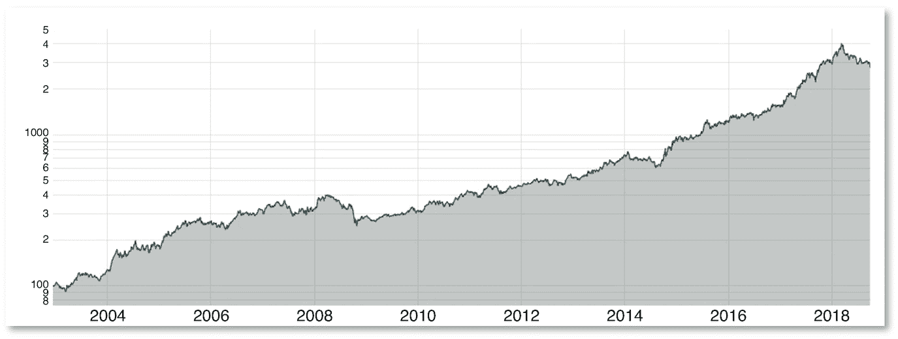

图 5.6

反脆弱性因子策略的损益表（仅凸性）

这里是凹性指标的结果（图 5.7; 表 5.14)：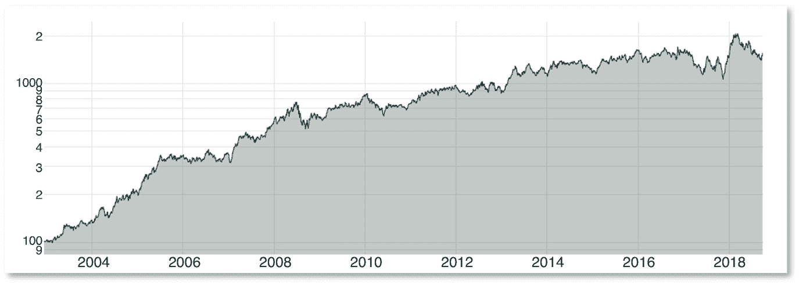

图 5.7

反脆弱性因子策略的损益表（仅凹性）

表 5.14

反脆弱性交易策略的绩效统计（仅凹性）

| 年度超额收益 | 夏普比率 | 换手率 | 年度波动率 | 最大回撤 5 天 | 最大回撤 21 天 | 最大回撤 252 天 | 全期最大回撤 |
| --- | --- | --- | --- | --- | --- | --- | --- |
| 18.91% | 0.78 | 5.96 | 24.39% | −11.51% | −24.60% | −31.52% | −37.99% |

尽管凸性的夏普比略高，但明显地正负导数都很重要，导致随着时间的推移更稳定（且更高）的盈利能力。

### 5.4.5 **分离市场正负回报**

当市场出现极端损失时，投资者更关心反脆弱性可能是有道理的。为了控制这种影响，我们仅在市场回报为正时计算反脆弱信号的二阶导数，仅在市场回报为负时计算。下面是此拆分的结果，仅适用于正回报（图 5.8; 表 5.15）：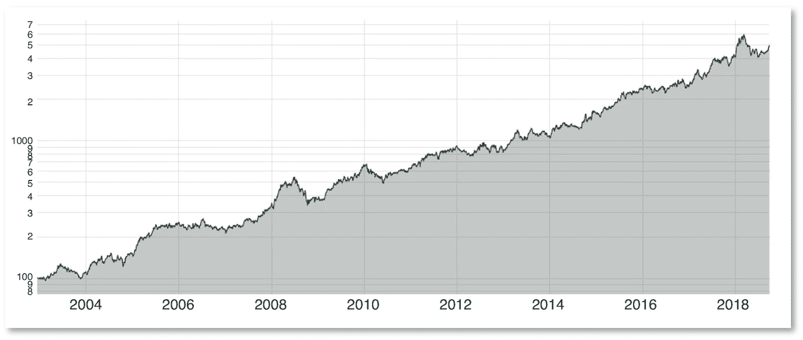

图 5.8

反脆弱因子策略的盈亏（仅适用于市场正回报）

表 5.15

反脆弱交易策略（仅适用于市场正回报）的绩效统计

| 年超额回报 | 夏普比 | 换手率 | 年波动率 | 最坏回撤 5 天 | 最坏回撤 21 天 | 最坏回撤 252 天 | 全期最坏回撤 |
| --- | --- | --- | --- | --- | --- | --- | --- |
| 26.47% | 1.06 | 5.81 | 24.93% | −14.87% | −20.40% | −17.13% | −37.80% |

下面是仅重新计算负市场回报的结果（图 5.9; 表 5.16）：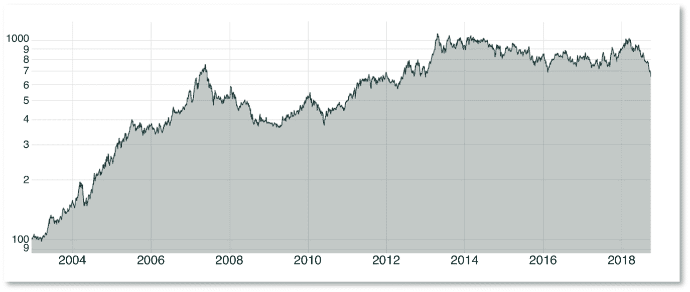

图 5.9

反脆弱因子策略的盈亏（仅适用于市场负回报）

表 5.16

反脆弱交易策略（仅适用于市场负回报）的绩效统计

| 年超额回报 | 夏普比 | 换手率 | 年波动率 | 最坏回撤 5 天 | 最坏回撤 21 天 | 最坏回撤 252 天 | 全期最坏回撤 |
| --- | --- | --- | --- | --- | --- | --- | --- |
| 14.18% | 0.54 | 5.73 | 26.25% | −12.89% | −22.40% | −35.48% | −51.53% |

这表明，投资者在市场正回报的情况下更关心反脆弱性。尽管如此，信号的两个版本仍持续提供显著回报，并且没有一个胜过原始版本。因此，反脆弱性似乎是一个广泛的现象，市场在负面和正面市场波动以及凹凸性中定价。

## 5.5 **鲁棒性测试**

本节专门进行各种测试，以评估我们结果的鲁棒性，涉及几个方面的考虑。

### 5.5.1 **信号的稳定性**

我们首先检查绩效对交易速度的稳定性。换手率对于从业者来说看起来相对较低，但我们希望通过计算组合仓位的各种滞后期的绩效来确认这一点。通过展示如果我们在获得组合优化权重后的 3 天、5 天、10 天等时间达到最佳仓位时，策略的夏普比率将是多少，我们评估了低交易频率下策略的盈利能力。表 5.17 总结了我们的发现：表 5.17

优化权重不同滞后期的夏普比率

| 滞后 2 天 | 滞后 3 天 | 滞后 4 天 | 滞后 5 天 | 滞后 10 天 | 滞后 15 天 | 滞后 21 天 | 滞后 42 天 | 滞后 63 天 |
| --- | --- | --- | --- | --- | --- | --- | --- | --- |
| 1.10 | 1.09 | 1.07 | 1.05 | 1.04 | 1.05 | 1.07 | 1.07 | 0.98 |

该策略明显表现出高水平的稳定性，因为即使是在优化后的一个季度进行交易的投资者也能盈利。这并不太令人惊讶，因为由于其计算采用了 5 年滚动窗口，反脆弱性指标非常稳定。它减轻了我们对每 63 天重新计算 AFI 的影响可能引起的担忧。当前得分的日自相关性很高，为 99.84%。因此，当前得分与其 21 天滞后的自相关性仍为 97.07%。

投资策略通常表现出基于的因素稳定性与绩效稳定性之间的联系。虽然这种稳定性可能表明该策略易于交易，但它也与交易期初行业“挑选”的风险相关联。事实上，我们可能会随机创建一个组合，只是在模拟期间的开始时选择好的行业，并将它们保持到完整模拟期间结束，而如果持仓的符号（多头/空头）随时间频繁变化，则这显然不太可能发生。下面我们给出持仓符号变化的摘要统计信息（表 5.18）：表 5.18

摘要统计：持仓方向变化次数（L/S）

| 均值 | 标准差 | 最小值 | 最大值 | 中位数 |
| --- | --- | --- | --- | --- |
| 6.62 | 4.09 | 1.00 | 24.00 | 6.00 |

在 14 年的模拟中，长期和短期持仓之间平均发生 6 次变化可以解释为对幸运选择的合理保护。请注意，每个行业在完整模拟期间至少会改变其持仓符号一次，没有例外。每个行业得分的时间序列在附录中提供：AFI 行业得分随时间变化。

### 5.5.2 对超参数的敏感性

我们还控制了使用不同超参数计算信号的抗脆弱性。在计算反脆弱性指标时，两个超参数似乎是真正重要的：滚动窗口的时间深度和对衍生品进行评估的领域（AFI 定义中的 X[Min]和 X[Max]）。 

我们首先重新计算了不同滚动窗口的性能（表 5.19）：表 5.19

不同滚动窗口的性能统计

|   | 年度收益率（%） | 年度波动率（%） | 夏普比率 |
| --- | --- | --- | --- |
| 3 年 | 14.55 | 26.80 | 0.49 |
| 4 年 | 29.71 | 27.06 | 1.05 |
| 5 年 | 30.41 | 26.58 | 1.10 |
| 6 年 | 26.87 | 26.75 | 0.96 |
| 7 年 | 24.52 | 25.80 | 0.90 |

显然，窗口对性能有影响，但所有测试的值仍然继续提供显著的性能。观察到的差异是由于观测量太低，无法准确地模拟小窗口的反应函数，以及观测量太旧且不再相关于拟合，涉及大窗口。

然后我们评估了性能对衍生品领域的敏感性（表 5.20）：表 5.20

不同衍生品领域的性能统计

|   | 年度收益率（%） | 年度波动率（%） | 夏普比率 |
| --- | --- | --- | --- |
| [Xmin: Xmax] = [−1%: +1%] | 22.51 | 24.93 | 0.86 |
| [Xmin: Xmax] = [−5%: +5%] | 26.04 | 25.56 | 0.97 |
| [Xmin: Xmax] = [−10%: +10%] | 30.41 | 26.58 | 1.10 |
| [Xmin: Xmax] = [−15%: +15%] | 24.95 | 25.92 | 0.92 |
| [Xmin: Xmax] = [−20%: +20%] | 19.42 | 25.53 | 0.71 |

在这里，虽然我们仍然可以观察到夏普比率对超参数的敏感性，但我们再次发现信号性能的强大稳健性。非常有趣的是，尽管我们正在处理 21 天的累积收益率，但在+1%和-1%之间的衍生品计算出的信号仍然具有显著的性能，尽管这个领域非常小。这一点突显了我们在 AFI 定义中所做选择的重要性。由于我们将概率加权积分近似为*定期*间隔的衍生品之和，我们间接地假设了与之相关的概率的均匀分布。衍生品领域的收窄表明，中央衍生品对性能非常重要，而极端衍生品可能不那么重要。假设市场收益的钟形分布，人们可以将这解释为衍生品的概率的反映：发生不太频繁的事情只会较少影响。进一步的研究可以尝试通过市场收益的概率分布来加权近似的 AFI。

为了考虑使用 LNLM 模型进行的拟合的随机性，我们对随机选择属于每个折叠的观察值的生成器进行了种子化，用于计算μ。这种做法使得可以复制结果。如果我们使用默认种子⁹，我们仍然需要控制选择某个特定随机抽样集是否导致了虚假的高性能水平。

因此，我们对 50 个不同的种子启动了 L/S 模拟¹⁰，并在下面呈现了相应的性能统计数据。总体而言，它清楚地显示出模拟对于特定种子的选择非常不敏感（表 5.21）。表 5.21

不同种子的性能统计

|   | 最小 | 平均 | 中位数 | 最大 | 标准差 |
| --- | --- | --- | --- | --- | --- |
| 年回报率 | 30.13% | 30.60% | 30.56% | 31.63% | 0.30% |
| 年波动率 | 26.37% | 26.51% | 26.51% | 26.64% | 0.06% |
| 夏普比率 | 1.09 | 1.11 | 1.11 | 1.15 | 0.01 |

这一发现进一步得到了考虑所实现的夏普比率分布的波动性的确认（图 5.10）：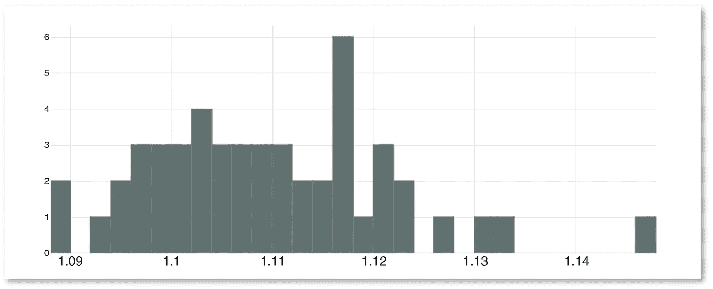

图 5.10

不同种子的夏普比率分布

最终，我们计算了股票水平和行业水平的得分与优化权重之间的相关性¹¹。这最后的测试被执行为一个健全性检查，以指示特征组合方法的输出是否真正反映了其输入。在股票水平，AFI 和优化权重之间的皮尔逊相关性为 81.17%，在行业水平为 87.13%。我们还计算了斯皮尔曼相关性，因为在我们的情况下，排名比精确水平更重要（由于优化过程最小化了方差，我们可能会预期对于相同得分水平，权重会稍有不同）。AFI 和优化权重之间的斯皮尔曼相关性在股票水平为 91.54%，在行业水平为 93.14%。

## 5.6 结论

本章提出了一种预测股票市场行业回报的原创方法。再次强调，股票回报截面的多维性仍然是文献中需要探索的广阔领域。替代数据的出现为这一旅程开辟了有希望的道路，但不应掩盖对建模方法的改进的需求。

特别是，使用非常普遍的数据（仅股票回报），本章证明了标准线性建模方法将无法捕捉到现实的微妙之处。非线性建模很重要，其效用不仅局限于尾部建模，因为反脆弱性也被定价于分布的中心。LNLM 模型的这种应用也为其效率和反映目标与解释变量之间真实关系的能力提供了见解。

本章提出了许多研究问题。考虑到所进行的测试，我们的结果似乎是稳健的，并显示了反脆弱性因素在解释行业回报横截面中的高重要性。应该使用其他数据集和/或替代反脆弱性指标来确认这种重要性在预测未来回报方面的水平。

对其他因素的损益进行回归分析也显示了反脆弱性因素与众所周知的因素之间存在显著的联系。应该从经济学或统计学的角度均衡地研究它们之间的相互作用。

最后，在我们的研究中，反脆弱性涵盖了下行贝塔和共偏度。这一发现应直接在股票回报横截面中进行研究，这可以显著改进现有的风险溢价知识。
