© 作者（们），根据 Springer Nature Switzerland AG 2022 的独家许可 T. Barrau, R. Douady 用于金融市场的人工智能金融数学与金融科技[`doi.org/10.1007/978-3-030-97319-3_6`](https://doi.org/10.1007/978-3-030-97319-3_6)

# 6. 特定回报的预测

Thomas Barrau^(1  ) 和 Raphael Douady²(1)AXA 投资管理公司 Chorus 有限公司，香港，香港特别行政区(2)巴黎第一索邦大学经济中心，法国巴黎

## 摘要

对于股票回报横截面中的每家公司，我们构建了其未来回报的预测。每个预测都是使用大量解释变量进行估计的专用多模型制作的，捕捉了每支股票的整个经济环境。根据预测构建了一个交易策略，以评估其质量，达到了 0.91 的夏普比率，与经典因子不同，并经受住了大量的稳健性测试。通过实施交易策略，我们提出了一种解决多模型预测汇总问题的方法，该方法基于每个基本模型添加的信息。

关键词

## 6.1 介绍

自 King (1966)以来，将股票回报分解为市场组成部分和行业组成部分的有用性就已经被认识到，我们自 Roll (1988)以来就知道，回报的特定组成部分，即价格的残余变动，不依赖于市场或行业，甚至比其他两个因素更为重要。在第四章关注提供市场回报预测和第五章关注提供行业回报预测之后，我们最终在本章中提出了一些股票回报特定组成部分的预测。

为了做到这一点，我们执行了 Polymodel 理论中最直接但也最具挑战性的应用之一：直接使用目标变量的预测。这样的方法至少有两个挑战：选择预测因子和汇总不同预测的困难（关于这些问题的深入高层讨论，请参见第二章）。我们在本章中解决并提出了这两个问题的解决方案。

我们成功预测单只股票收益的特定组成部分并不具有普适性。因此，我们提供了对 500 只不同股票在 15 年期间的特定收益的预测。这些预测是通过动态估计（使用滚动窗口）每只股票收益的多模型获得的：

多模型的估计不应该使用原始收益作为目标变量。由于我们假设股票收益可以分为市场、行业和特定组成部分，我们应该从原始收益中提取特定组成部分。这是通过使用行业作为分类变量进行的横截面回归的残差来实现的。这个框架消除了行业对收益的影响，但也隐含地消除了市场的影响，因为回归的常数是等权市场组合的收益。与其他可能性（面板、时间序列回归）相比，横截面回归具有瞬时性的优势。

我们使用一个 5 年滚动窗口和每月回报率来估计多模型，² 这样的设置在前面的章节中已经取得了结果。使用 21 天的累积回报是出于发现股票回报中缓慢变化趋势的野心，如果直接使用每日数据，这将更加困难。预测因子向后推移一个月，最终生成下个月的预测。数据的原始每日频率允许我们提供的预测每天重新计算一次，然而，基本模型的参数仅在每月初重新估算一次，以节省计算时间，同时记住我们用于估算的相对较长的 5 年时间窗口。

使用这些技术对特定股票回报进行预测可能看起来像对多模型的粗暴使用，然而，这需要对信号提取的每个步骤进行非常仔细和细致的设计。因此，我们在本章的第一节中介绍了构建我们框架的方法基础。然后，我们提出了一种预测选择方法，通过评估不同的度量标准进行过滤，并提供一个动态的、点对点的过滤器。在第三节中，我们提出了一种用于预测在多模型中的聚合的新方法，我们用一个更标准的方法进行基准测试，并加以介绍。然后是一个专门用于评估预测质量及其相关选择和聚合方法的评估部分。这样的评估是使用一个交易策略完成的，在最后一节中，这个策略通过一系列的稳健性测试得到了补充。

## 6.2 方法论基础

我们在下面描述了为信号构思所做的方法选择。

### 6.2.1 数据

所使用的数据与第四章和第五章中使用的数据相同。

请记住，我们的投资范围由美国股市中市值最大的 500 家公司组成，每月重新规定。

数据分为两部分：一些股票水平的、横截面数据和多样化的金融市场时间序列数据。

作为提醒，股票水平数据由日回报率、市值、账面市值比和由 GICS 分类（全球行业分类标准，MSCI）的第三级定义的行业分类组成，所有这些都使用每日结束时的 USD 数据进行测量。我们的样本覆盖了从 1999-01-01 到 2018-09-30 的时期。³ 关于所使用的数据的更多详细信息，读者可以参考第五章。

数据的另一部分由包括 1,134 个变量的日末收益多样化因子集组成。这个因子集覆盖了所有发达国家和大多数新兴经济体。变量在不同的地理尺度上定义，有些是全球性的，有些是地区性的，还有一些是与国家相关的。此外，所有最重要的资产类别都被涵盖，包括股票指数、股票因子指数（即经典风险溢价）、货币、商品、货币市场、主权债券、企业债券、房地产、对冲基金和波动性指数。数据集的定义为 1995-01-02 至 2018-10-16。⁴ 因子集的完整描述可在第四章中找到。

### 6.2.2 时间序列预测，横截面投资组合构建

时间序列维度中的基本模型进行了特定回报预测。因此，可以评估特定股票的预测质量。然而，显然，当直接在聚合级别上考虑时，分析更加健壮，即联合考虑我们的目标变量——500 只股票回报。此外，由于我们通过交易策略验证结果的经济意义，我们还应该使用基于聚合预测的投资组合构建，因为这将是评估性能的最简单方法。因此，我们在此考虑了一个长/短投资组合构建，在这个构建中，预测的质量是在股票横截面内以相对方式评估的。

符合交易策略使用的格式，我们始终在信号后使用规范化版本，这个版本被排名并设置在-1 到+1 之间。正如第五章中提到的，这种归一化在文献中非常普遍。排名的使用使我们主要考虑预测的序数，因为归一化的预测在其定义空间中均匀分布，而非排名信号则包含一个额外的基数成分，说明一个预测比另一个好多少。考虑到预测股票回报横截面的任务的难度，为了鲁棒性，因此我们在本章不考虑当前章节中的基数维度。

### 6.2.3 减去平均回报

由于多模型是在一个滚动窗口上估计的，所以估计模型的平均值等于滚动窗口内股票回报的平均值。

但是，过去一个月的平均股票回报率是未来回报的强有力预测因子。Jegadeesh（1990）观察到短期反转效应，即下个月的回报与上个月的回报呈负相关。与 Titman（1993）一起，他还记录了这种相关性随着过去一年的回报变为正相关，这种效应称为动量。最后，股票回报也显示出一种长期反转的形式（De Bondt & Thaler，1985）。因此，未来回报与不同时间范围内计算的过去平均回报之间存在强烈的正负相关。

因此，根据用于估计基本模型的窗口，窗口内的平均估计反映其中一种效应，从而正面或负面影响了多模型所做预测的预测能力。

因此，从预测中减去平均股票回报率是极其重要的。这保证了预测结果不仅仅是对文献中已经充分记录的信号的复杂再发现。在整个章节中，我们只考虑这个平均回报之上的预测，并且我们简单地将这些经过校正的预测称为“预测”。

## 6.3 预测选择

在这里，我们比较不同的指标来选择预测因子。这种选择的目的当然是为了消除噪音，因为声称用于预测的 1,134 个因素都与我们试图预测的 500 只股票的回报相关联是不可持续的立场。

选择可以通过几种方式进行，但它应始终与基本模型的拟合优度或统计显著性的评估相关联。由于没有特定的理由选择其中一个*a priori*，我们研究了几种可用于预测选择的测量方法。

对于给定的多模型，通过计算在特定测量的一个特定分位数中由所有选择的因素对当前股票的平均预测来调查这些测量。例如，我们可以计算以均方根误差（RMSE）的顶部 60%的因素为基础的 Microsoft 回报的平均预测。这个计算在被预测的所有股票中重复进行，这样我们就在每个时间点构建了股票回报的横截面的预测。然后，我们对下一天的股票回报的全样本面板回归与给定分位数（我们的例子中为 60%）的平均预测进行计算。预测的统计显著性仅通过估计参数的*t*统计量进行评估。最后，我们对几个分位数重复此过程。

上述在标准化信号和未来收益之间的回归不应该在原始收益上进行。就像在多模型的估计中，我们希望测量多模型预测原始收益的特定组成部分的能力。因此，我们仍然使用未来的特定收益，仍然定义为横截面回归的残差。

我们假设至少有一些预测因子只是给平均预测带来噪音。我们的期望是，如果用于选择的指标能够成功区分噪音和信号，那么在平均预测中引入更多因子（即增加选择的分位数）应该首先导致*t*统计量的增加，直到新添加的因子携带了太多的噪音，使得显著性降低。

这种评估预测选择指标的方法清晰简单，使人能够对问题有一个整体的初步理解。此外，它使得不同的度量可比较，因为使用分位数导致在计算平均预测时使用因子桶，以透明的方式⁶。这种简单性的代价是做出了多个假设。首先，由于我们保留了基于完整样本结果的选择指标来构建*滚动*交易策略，我们使用了未来信息。这样的做法只能假设不同选择指标的质量在时间上相对稳定，以便当前的分析可能在我们的样本开始时使用类似的过去数据样本得出类似的结果。这个假设还意味着我们选择的选择指标也会产生样本外的结果。其次，我们假设不同多模型之间存在一种弱形式的同质性。确实，由于用于计算*t*统计量的分位数阈值在多模型之间相同，我们结果的稳健性取决于多模型在不同分位数下表现近似相同。虽然这是对现实的简化，但这些假设似乎是可以接受的，因为它们也简化了我们面临的问题。

### 6.3.1 均方根误差滤波器评估

均方根误差（RMSE）可能是模型拟合优度的最基本度量。在给定的时间点和给定的预测变量下，它被定义为: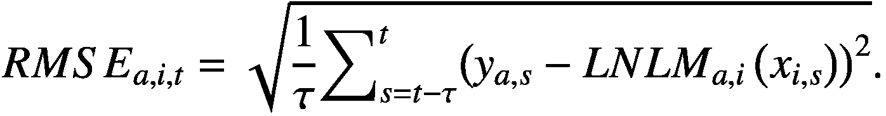(6.3)*这里“τ”是在日期 t 的滚动窗口中可用的观测次数，“i”是预测变量的索引，“a”是股票的索引（如果未指定，以下所有方程式均为给定 polymodel 的）。*RMSE 在每个 polymodel 的每个基本模型的特定滚动窗口内计算。以下是反映不同 RMSE 量化分位数的平均预测的预测能力的 *t*-统计量（最小分位数为拟合度的最高水平） (图 6.1)。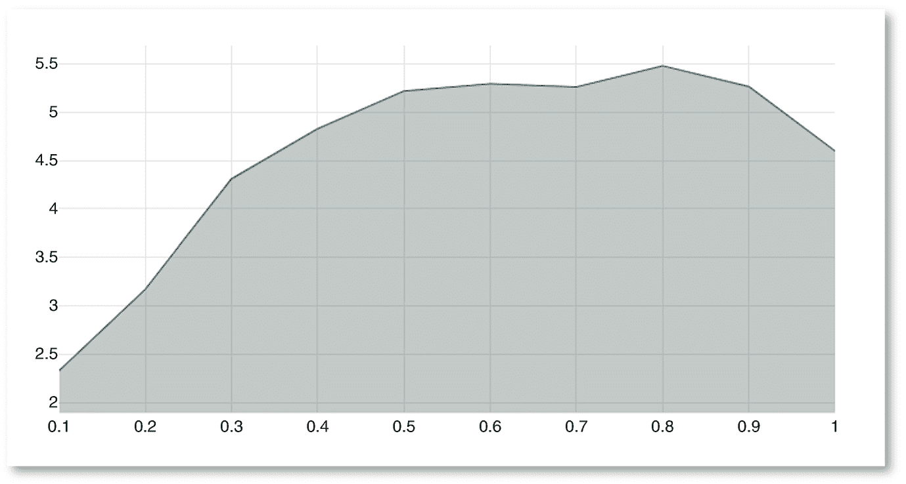

图 6.1

RMSE 过滤器：*t-*统计量作为噪声过滤器分位数的函数

该过滤器清楚地显示了适当过滤器的预期模式，因为我们可以看到当在预测中使用 RMSE 最差的因素时，聚合信号的预测能力会降低。

### 6.3.2 *p*-值过滤器评估

*p*-值可能是最常见的统计显著性度量。它可以从比较缺乏拟合平方和和纯误差平方和的 F 检验中计算得出。这两个数量的比值，加权后的自由度，是被替换为 Fisher–Snedecor 分布的累积分布函数中的 F 统计量，以得到 *p*-值: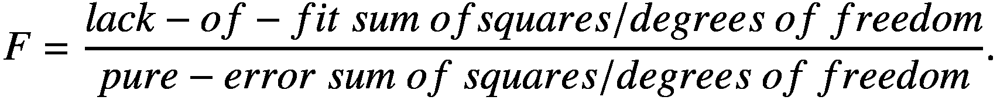(6.4)因此，从 F 检验计算出的 *p*-值与 RMSE 有根本的不同，因为除了考虑到达到的拟合程度外，它还考虑了可以达到的拟合程度。以下是完整样本回归所获得的 *t*-统计量，用于不同过滤量化位数 (图 6.2)：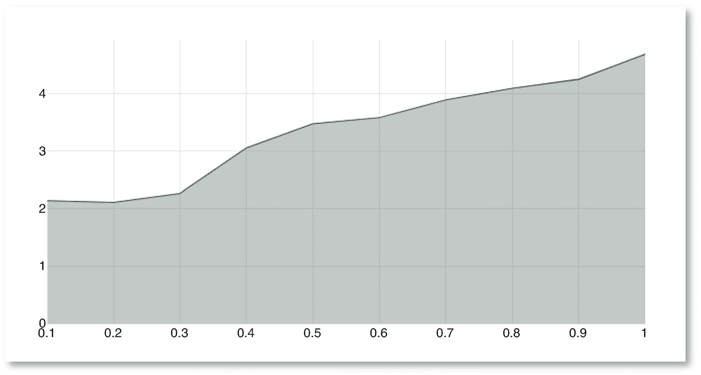

图 6.2

*p*-值过滤器：*t-*统计量作为噪声过滤器分位数的函数

考虑到这张图，从 F 检验计算出的 *p*-值似乎不能作为可靠的噪声过滤器。事实上，即使在 *p*-值方面最差的预测仍然为聚合预测增加了价值。*p*-值在过滤的上下文中的不匹配可能是由于估计的基本模型的误差违反独立和正态分布的假设。人们还应考虑到 *p*-值可能是衡量不同预测的更合适的度量标准，而不是选择它们。

### 6.3.3 贝叶斯信息准则过滤器评估

贝叶斯信息准则（BIC）的定义为：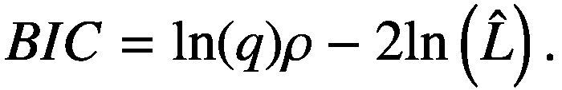(6.5)*这里“q”是观测数量，“ ρ”是模型估计的参数数量，“*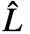*”是似然函数的最大化值。*

由于似然函数的估计是一项非常规的任务，并且考虑到多模型估计的计算密集度，我们假设模型的误差是独立、相同和正态分布的。这个高斯假设导致 BIC 公式的以下修改：

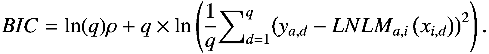(6.6)*这里“d”是观测索引。*

我们可以看到，在这种假设下，BIC 的定义接近于 RMSE 的定义。但是，Eq. (6.6)的第一项考虑并惩罚了用于拟合的观测数量。请注意，多模型估计是使用可能具有不同样本大小的基本模型完成的，具体取决于当前窗口中每个回归器的样本大小。考虑到这个多模型的特点是 BIC 相对于 RMSE 来区分不同基本模型的优势。

毫不奇怪，BIC 过滤器的结果与使用 RMSE 过滤的结果相当（图 6.3）: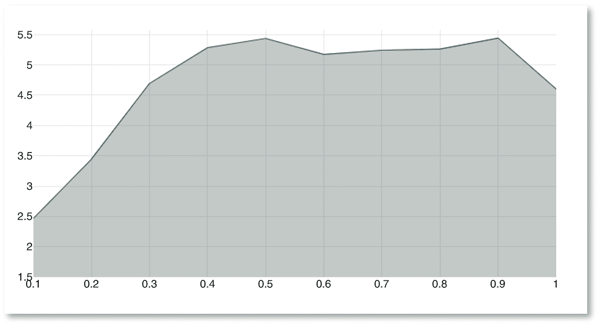

图 6.3

BIC 过滤器：*t*-统计量作为噪声过滤器分位数的函数

### 6.3.4 使用动态最优过滤进行选择

基于我们对各种指标进行过滤的完整样本结果，很明显基于 F 检验的*p*-值不应该用于进行预测的选择，而 RMSE 和 BIC 的性能是可接受的。由于这些性能与这些指标的数学定义是可比较的，我们选择通过将它们结合起来来避免任何任意选择。因为我们最终依赖于分位数，我们可以通过对 BIC 和 RMSE 的排名值求和并排名该和来创建一个平衡的组合度量：![$$ {DFM}_t=\mathit{\operatorname{rank}}\left[\mathit{\operatorname{rank}}\left({BIC}_t\right)+\mathit{\operatorname{rank}}\left({RMSE}_t\right)\right]. $$](../images/519851_1_En_6_Chapter/519851_1_En_6_Chapter_TeX_Equ7.png)(6.7)*这里 DFM 是时间 t 时刻所有基本模型的“双重过滤度量”向量，rank 是排名操作符。*

我们需要确定一个适当的分位数阈值来进行过滤。然而，尽管在这里考虑使用完整样本数据作为过滤指标选择的一种可容忍方式，⁷但保持全样本方法来设置阈值会导致过度拟合的风险很高，因为最终结果会反映某种形式的样本内优化。因此，过滤阈值的设置仅使用点时数据。此外，阈值适应于每个多模型，因此不再假设不同股票回报之间的同质性。

对于特定的多模型，在每个日期，我们计算由双重过滤度量的不同分位数过滤的平均预测。然后，每个季度，我们重新计算下一天的股票回报对当前过滤/聚合预测的单变量回归，用于不同的分位数。对于当前日期，我们因此再次获得一个*t*统计量曲线，反映了不同过滤分位数的预测能力，可能看起来像 6.4 图所示，作为问题的代表性示例！

图 6.4

DFM 过滤器示例：作为噪声过滤分位数的函数的*t-*统计量

对于当前多模型和当前日期，我们获得了可能的不同阈值的预测能力评估。因此，我们能够选择相对于该曲线在某种意义上最优的阈值。请注意，由于所选指标似乎不能更多地消除噪声，我们将分析限制在最高分位数，⁸这有助于避免陷入某些极端稀缺（和虚假）的极值。

一个简单而可能天真的方法是简单地选择对应于最高*t*统计量的分位数。我们采取了不同的方法。

当通过增加分位数来包含新的预测因子时，我们可以期望以下输出：

+   如果添加的信息不包含在先前的分位数中（因此添加的预测因子是不相关的）并且是相关的，则平均预测应显示更高的*t*统计量。

+   如果添加的信息不包含在先前的分位数中，并且只是微弱相关的，则总体上，*未加权*的聚合预测能力可能不太好，导致*t*统计量较小。

+   如果这些信息是相关的，但在先前的分位数中已经部分包含，则在总体预测中可能会被过度加权，导致*t*统计量较小。

+   最后，如果这些信息纯粹是来自虚假预测因子的噪声，我们可以预期*t*统计量会急剧下降。

从描述增加分位数对 *t* 统计量的影响的命题中，我们可以认为 *t* 统计量的减小并不一定意味着增加的预测仅包含噪音。 由于信息宝贵，我们采取保守的方法，仅删除我们最怀疑纯粹是噪音的预测。 最终，似乎最可能的是，在增加分位数后 *t* 统计量最大的噪声增加会发生在 *t* 统计量最大的下降后。 因此，我们将最优阈值定义为使 *t* 统计量曲线的一阶导数最小化的阈值。

最优阈值然后每个季度使用一个 36 个月滚动窗口执行回归动态重新计算。该过程分别应用于多项式模型。

## 6.4 预测的聚合

使用动态最优过滤器选定的预测，我们在本节中提出了几种候选技术来聚合这些预测。

### 6.4.1 使用贝叶斯模型平均进行预测聚合

贝叶斯模型平均（BMA）是一种常用的方法，用于组合预测（关于介绍，请参见 Hoeting 等人，1999 和 Raftery 等人，1997）。它已经在多模型的上下文中被用于通过 Guan（2019）组合基本模型。通过为每个基本模型分配一个概率，BMA 提出了一个综合预测，该预测考虑了模型不确定性。对于给定的多项式：![$$ E\left[{y}_{t+1}|{X}_t\right]=\sum \limits_{i=1}^n\hat{\varphi_{i,t}}\left({X}_{i,t}\right)\times p\left({\varphi}_{i,t}\left({X}_{i,t}\right)|{X}_t\right) $$](../images/519851_1_En_6_Chapter/519851_1_En_6_Chapter_TeX_Equ8.png)(6.8)*这里 y*[*t* + 1] *是我们试图预测的变量，X*[*t*] *是在时间 t 的因子集，而 φ**i* *是在时间 t 的因子 i 的基本模型。*

这种方法相当直观，因为不同的预测是可信度加权的，但是它并未考虑到不同模型可能存在相关性。 （后验）概率由贝叶斯定理定义为：

(6.9)由于后验概率是以似然度来表达的，它与 BIC 相关，可以用 BIC 来近似它（Raftery，1995）：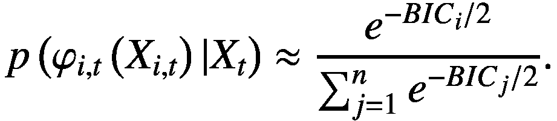(6.10)在我们的情况下，由于多模型估计的计算强度，需要进行这种近似（请回想一下 BIC 可以很容易地被计算为均方误差的函数，在某些假设下）。由于 BIC 可能非常大，因此在实践中，我们可以从中减去任何方便的值，通常是不同模型的 BIC 值的最小值，这不会影响比率。在我们的情况下，BIC 值的结果分散仍然非常大，导致（数值）无法计算可靠的指数。因此，我们进一步使用以下方式来近似上述比率：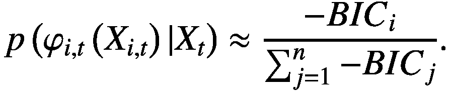(6.11)这个最终的近似导致概率的集中，可能削弱 BMA 的结果。

### 6.4.2 使用增值平均进行预测聚合

我们在这里介绍一种权重方法，旨在根据其增值平均化预测。为了解释我们所说的这个术语，让我们重新使用第二章中的讲堂隐喻。我们在一所大学的讲堂里，在经过筛选的学生（筛选出的预测者）面前，试图预测资产未来回报的几轮。我们观察他们反复的猜测，我们需要将它们聚合起来以获得一个综合的预测。我们建议个体预测的权重应考虑所述预测的以下两个属性：

+   可信度：随着时间推移，提供更好预测的学生应该具有较大的权重。

+   原创性：提供不同预测的学生也应该具有较大的权重，因为只是重复已知内容的人并没有添加任何信息。

请注意，这两个特性不是相加的，而是相乘的。一个可信但不原创的人应该有一个小的权重，因为他们的观点是重复的（如果你得到完全相同的预测 10 次，你希望将每次的权重设为大约 1/10 再加总）。一个原创但不可信的人不是你想要考虑的人，因此应该有一个非常小的权重。当这两个特性同时出现在一个预测者身上时，我们认为这个预测者为整体预测*增加了价值*，因此它们应该与较大的权重相关联。当考虑到可信度时，我们想要用我们通常使用的传统拟合优度度量来选择基本模型。但从戏剧性的隐喻角度来看，我们希望考虑每个学生预测的准确性。用贝叶斯术语来说，问题的第一个视角是*先验*，第二个是*后验*。第一个视角考虑样本内拟合优度，第二个视角考虑样本外结果。在我们通常的抗过度拟合的关注中，我们倾向于采用第二种方法，并建议使用样本外版本的 RMSE：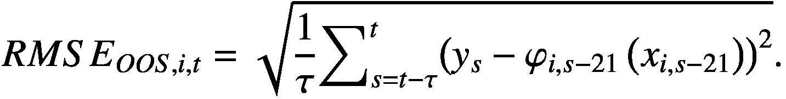(6.12)*这里的“i”是考虑的基本模型的索引，“t”是给定日期，“ τ”是用于计算的窗口长度，“y*[*t*]*”是实现的股票回报，“ LNLM**i*, *t* − 21*”是一个月前对这个股票回报的预测。*

另外，为了考虑我们因素的有效预测能力，这个度量具有一个优势，即它可以在比多模型的窗口更短的时间范围内计算。实际上，提供基本模型的稳健估计通常需要深度滚动窗口进行多模型估计，通常设置为 5 年（即大约 1260 个数据点）。如果我们考虑到我们始终在 LNLM 模型的估计中使用 10 折交叉验证，那么这样做就是在 126 个点上进行的伪样本选择μ⁹。这个 3 位数可能是*最小值*，以确保估计的可靠性。然而，如果我们需要这样的窗口深度来提供目标变量和预测变量之间的良好模型，那么没有理由认为这个窗口是评估这种联系显著性的最合适的窗口。预测变量之间的联系动态可能会更快地变化，在当前应用中，我们因此考虑了一个 2 年的窗口来计算样本外 RMSE。

RMSE 越小，预测器的可信度越大。因此，我们的可信度度量被定义为：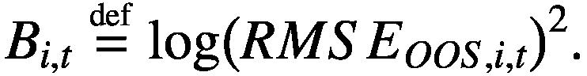（6.13）香农（1948）引入了一条消息 *m* 的信息度量，称为“自信息”或“惊奇”，其定义为其发生概率 *p*() 的函数，如下：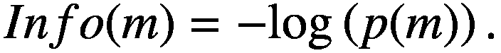（6.14）这个定义可能不容易理解。回到讲堂的隐喻，让我们考虑在某一时刻 *t* 我们得到的预测分布！$$ {\hat{y}}_i $$（图 6.5）：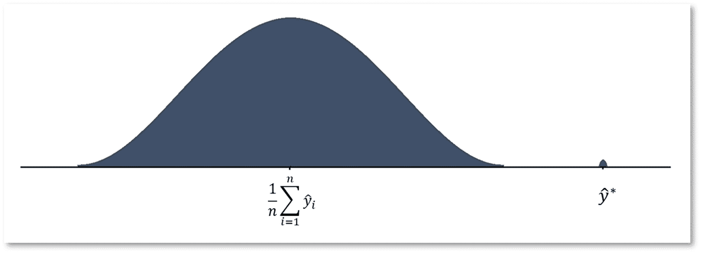

图 6.5

预测分布的程式化表示

考虑到所有预测都是相关的（它们已被过滤），一个等于分布平均值的预测！$$ \frac{1}{n}\sum \limits_{i=1}^n{\hat{y}}_i $$ 不包含太多信息，因为在考虑所有其他预测的同时，我们已经知道 *m* 值是可能的，甚至是可信的。另一方面，“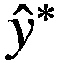” 这一点包含了很多信息，因为如果没有这一点，我们就不知道事件 “” 是可能的。因此，关于已经确切知道的事件的相关信息（*p* = 1）不包含任何信息，而关于完全意外事件的相关信息包含很多信息。因此，在讲堂上，一个学生，即使是优秀的，只是重复别人已经说过的话，并不会带来太多信息，而一个能够预测到完全意想不到事情的好学生应该被认真听取。

在我们的背景下，香农的信息度量反映了预测与基本模型之间的预测分布的独创性。因此，我们提出以下的预测独创性度量：![$$ o\left({\hat{\varphi}}_{i,t}\left({x}_{i,t}\right)\right)\stackrel{\scriptscriptstyle\mathrm{def}}{=}\mathit{\log}{\left(\ p\left({\hat{\varphi}}_{i,t}\left({x}_{i,t}\right)\ |\ \left\{{\hat{\varphi}}_{j,t}\left({x}_{j,t}\right)\forall j\in \left[1:n\right]\right\}\ \right)\right)}²\. $$](../images/519851_1_En_6_Chapter/519851_1_En_6_Chapter_TeX_Equ15.png)(6.15)我们用平方代替否定的使用来获得对数的正值，因为它允许更极端的独创性度量，从而导致更具区分性的度量。要将学生视为具有独创性，单个时间点的预测观察是不足够的，预测应该是重复独创的。因此，我们预测者的最终独创性度量是：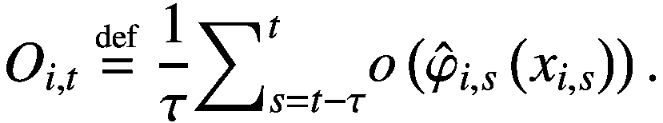(6.16)我们假设独创性属性的动态与基本模型的估计动态相关联，因此我们使用 5 年滚动窗口来计算预测者的独创性度量。如前所述，如果一个预测者同时具有可信度和独创性，则它会为整体预测增加价值，因此我们的增加值度量被定义为：(6.17)使用增值平均（AVA）进行的聚合预测是：![$$ E\left[{y}_{t+1}|{X}_t\right]=\sum \limits_{i=1}^n\hat{\varphi_{i,t}}\left({X}_{i,t}\right)\times {AV}_{i,t}. $$](../images/519851_1_En_6_Chapter/519851_1_En_6_Chapter_TeX_Equ18.png)(6.18)

### 6.4.3 聚合预测的不确定性

本节不直接涉及我们如何聚合预测，而是涉及我们如何对聚合预测的横截面进行加权。我们提出以下建议：当给定股票回报的多模型预测存在高度分散时，这反映了对聚合预测的不确定性，应予以惩罚。

因此，我们建议在每个日期将每个聚合预测除以该日期的多模型预测的标准差。

注意，这并不是对预测本身的改进，因为它涉及我们对每个聚合预测的信心，它更多地是与我们用来价值化我们的预测的横截面交易策略相关的人为现象。

## 6.5 交易策略

### 6.5.1 方法论

至于预测的估计，用于交易策略的投资范围大致等同于标准普尔 500，因为我们选择了在美国股票市场交易的 500 家最大市值的股票，每月重新报告。

与上一章相同，我们考虑了多头/空头交易策略。回顾一下，我们构建了一个基于每只股票多模型的预测的横截面的评分。评分按升序排序、排名并归一化，以在-1 和+1 之间均匀分布。如前所述，这使我们只考虑了策略相对基准的股票回报预测能力。

我们仍然使用评分的特征投资组合来获得投资组合的位置^（10）。提醒一下，特征投资组合是对评分具有单位暴露度的最小方差投资组合 *(*Grinold & Kahn, 2000)。然后，策略绩效就是我们投资范围内每个单独头寸的每日回报的总和。

不控制投资组合仓位的杠杆，但为了展示全样本年波动率为 10%，对该策略收益的各种不同变化进行了归一化处理，以便进行比较（选择全样本波动率归一化可能不如滚动归一化实际，但它确保了波动率平滑处理中不会隐藏波动率的局部峰值，例如策略回撤期间的波动）。

下面，我们首先提出了一个结合了预测计算步骤的所有步骤（过滤、聚合、控制股票不确定性）的策略版本。我们还通过计算此指标的*p*值来评估夏普比率的统计显著性。

然后我们分解了用于计算总体预测的不同技术，并评估它们对策略绩效的累积增益。

### 6.5.2 绩效

我们选择的最终版本经过了上面介绍的动态最优滤波器的筛选、使用了增值平均技术进行加权，并考虑了每个聚合预测的不确定性。

下图以对数刻度显示了策略的累积绩效（复合）（图 6.6）：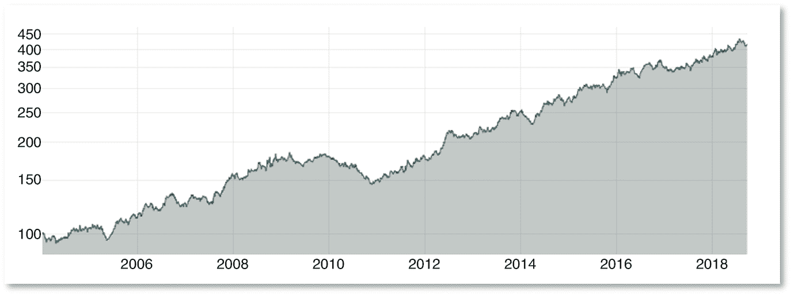

图 6.6

多模型的预测策略绩效（年波动率 10%）

该策略实现了 0.91 的夏普比率，这在经济上是显著的。

通过计算其*p*值来评估这一指标的统计显著性。为此，我们遵循下面描述的过程：

+   我们首先计算策略实现的夏普比率。

+   其次，我们对个别股票收益进行洗牌，并重新计算投资组合的表现，从中推导出夏普比率。由于收益被洗牌，这个新值只反映了随机性，尽管保留了信号的自相关结构。

+   将上一步重复 300 次，以获得随机夏普比率的分布。

+   使用核密度估计（Parzen，1962；Rosenblatt，1956）平滑此分布，这使我们能够减少阈值效应，提高准确性，并略微延长分布定义的区间。

+   然后，将初始投资组合的夏普比率替换为分布，夏普比率的*p*-值等于随机夏普比率超出该点的概率的积分。

下面是使用此方法得到的分布（图 6.7）：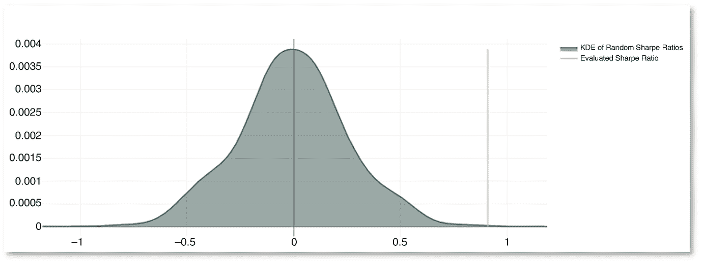

图 6.7

随机夏普比率的分布

最终策略的夏普比率的*p*-值等于 0.02%，这在统计学上非常显著。

### 方法的显著性为 6.5.3

在本节中，我们探讨了聚合预测的每个组成部分对最终性能的贡献，并评估了其统计显著性。

我们首先将所有多模型预测中的简单平均与使用动态最优过滤器进行简单平均过滤进行比较（图 6.8）：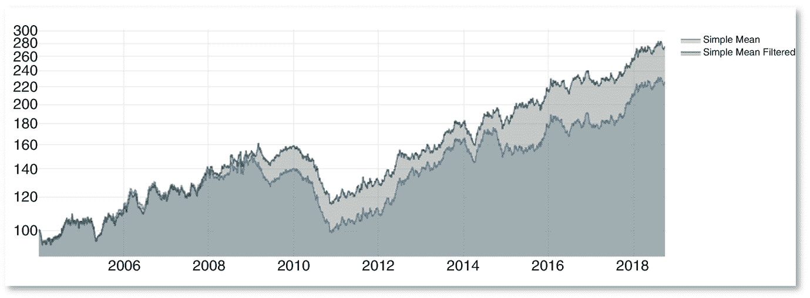

图 6.8

简单平均和简单平均过滤之间的表现比较

过滤使夏普比率从 0.5 增加到 0.63。当回归过滤组合的收益率时，我们注意到模型的常数是正的，尽管在统计上显著性较弱（表 6.1）：Table 6.1

对简单平均过滤后的收益进行简单平均回归

|   | Coef | Std err | *t* | *P* > &#124;*t*&#124; | [95.0% Conf. Int.] |
| --- | --- | --- | --- | --- | --- |
| 常数 | 6.78E−05 | 0.0000 | 1.883 | 6.00% (*) | −2.81e−06 0.000 |
| 简单平均 | 0.9376 | 0.006 | 164.224 | 0.00% (***) | 0.926 0.949 |

我们可能期望使用的过滤器能够显著提高性能。然而，如果我们检查上述表现，似乎会导致策略大幅下跌的减少。原始策略的最大回撤确实从-35%减少到-28%，从水下回撤的图表中清楚地看出，过滤器提供了某种下行保护（图 6.9）：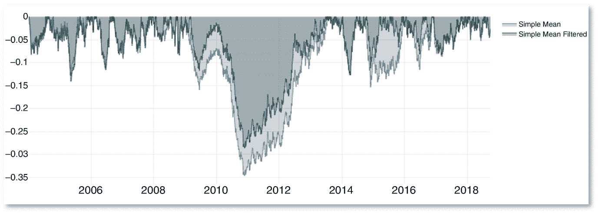

图 6.9

简单平均和简单平均过滤的水下回撤

基于这些发现，使用过滤器仍然似乎是合理的。

其次，我们使用所有情况下的过滤预测，将 BMA 和 AVA 方法与简单均值作为基准进行比较（图 6.10）：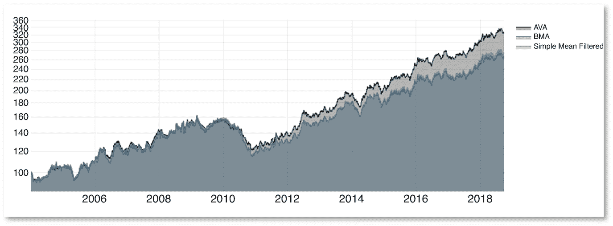

图 6.10

AVA、BMA 和简单均值过滤的性能比较

分别获得的夏普比率为 0.75、0.63 和 0.61 的 AVA、简单均值和 BMA 方法。此外，通过比较回归表（表 6.2）可明显看出，AVA 在简单平均值之上提供了统计上显著的额外回报，而 BMA 则不然：表 6.2

AVA 和 BMA 回报对简单均值过滤回报的回归

|   | 变量 | 系数 | 标准误差 | *t* | *P* > &#124;*t*&#124; | [95.0% 置信区间] |
| --- | --- | --- | --- | --- | --- | --- |
| AVA | 常数 | 5.30E−05 | 0.0000 | 2.548 | 1.10% (**) | 1.22e−05 9.37e−05 |
| 简单均值过滤 | 9.80E−01 | 0.0030 | 297.134 | 0.00% (***) | 0.973 0.986 |
| BMA | 常数 | −5.99E−06 | 0.0000 | −0.569 | 57.00% ( ) | −2.66e−05 1.47e−05 |
| 简单均值过滤 | 9.95E−01 | 0.0020 | 595.39 | 0.00% (***) | 0.992 0.998 |

在我们的背景下，BMA 失败的可能解释有几种。首先，它被开发用于合并包含不同数量参数的模型，而这不适用于我们的基本模型，对于这些模型，BIC 仅对观察数量进行惩罚，这在大多数模型中是可比的。因此，BMA 在区分基本模型方面不如 AVA 好，因为它只关注拟合度，而 AVA 还考虑了不同预测之间的相关性。在我们的情况下，对后验的 BIC 近似虽然是不可避免的，但可能会导致对可能性的弱估计，因为它需要假设。此外，BIC 是基于对误差分布的假设得到的。最后，我们通过使用 BIC 的非指数化比率进一步近似了 Raftery 的 BIC 近似。因此，似乎 BMA 在大量多模型计算的背景下失败更多是由于实际不可行性，而不是方法本身的问题，绝对不可能声称相反。

最后，在横截面策略中考虑集合预测的不确定性也增加了价值，夏普比率从 0.75 增加到 0.91（图 6.11）：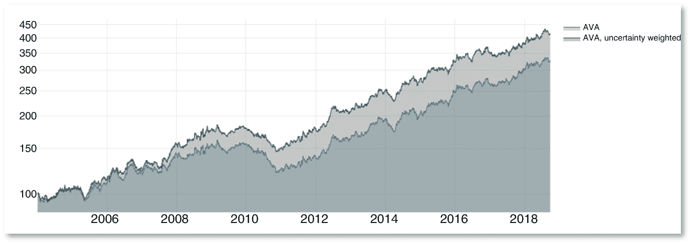

图 6.11

AVA 和 AVA 不确定性加权的性能比较

除了在经济上具有重要意义外，这种最后的技术在统计上也是显著的（表 6.3）：表 6.3

AVA 不确定性加权回报对 AVA 回报的回归

|   | 系数 | 标准误差 | *t* | *P* > &#124;*t*&#124; | [95.0% 置信区间] |
| --- | --- | --- | --- | --- | --- |
| 常数 | 8.35E−05 | 0.0000 | 2.454 | 1.40% (**) | 1.68e−05 0.000 |
| AVA | 9.45E−01 | 0.0050 | 175.133 | 0.00% (***) | 0.934 0.955 |

这些结果表明我们策略的表现是显著的，并且这是由多种技术的组合造成的，这些技术已经具有一定的预测能力。因此，我们通过进行一系列鲁棒性测试来进一步控制这些结果的可靠性。

## 6.6 鲁棒性测试

### 6.6.1 与标准因子的相关性

由于我们采用了横截面投资组合构建，我们必须控制我们只是提出了一个精巧重新发现风险溢价或已经在文献中充分记录的因子的可能性。为此，我们控制了 Fama–French 三因子（1993）, 即市场、价值和规模¹¹，标准动量，如 Carhart (1997) 所定义的，Jegadeesh (1990) 观察到的（短期）反转，De Bondt 和 Thaler (1985) 的长期反转以及低波动性异常（Baker et al.，2011）。

这些不同异常的投资组合仓位是使用与多模型特定预测相同的多空投资组合构建计算的，除了市场之外，对于给定的股票“*a*”，其投资组合仓位简单地等于：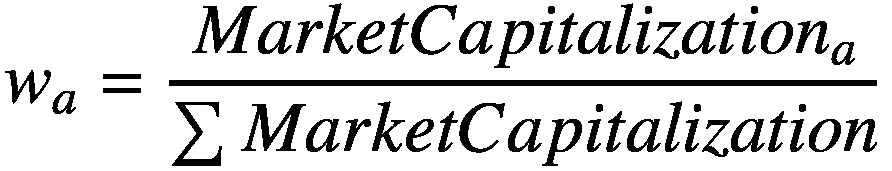(6.19)首先，我们展示了上述异常的投资组合收益的相关矩阵（见图 6.12）: 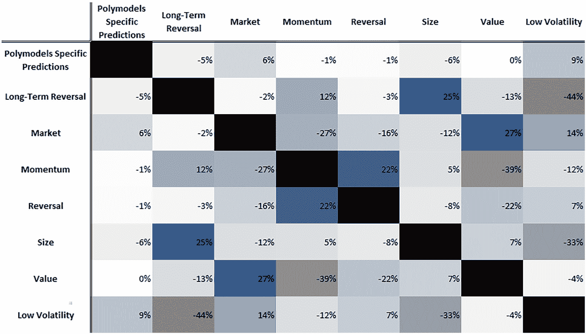

图 6.12

几个异常的投资组合收益的相关矩阵

多模型预测的收益与其他因素的收益之间的相关性极低，我们不太可能解释我们的多空策略的表现是由其他异常的表现引起的。尽管如此，我们仍然通过使用全样本回归进行控制（见表 6.4）：表 6.4

多模型预测的收益回归到其他因子的收益

|   | 系数 | 标准误差 | *t* | *P* > &#124;*t*&#124; | [95.0% 置信区间] |
| --- | --- | --- | --- | --- | --- |
| 常数 | 0.0004 | 0 | 3.402 | 0.10% (***) | 0.000 0.001 |
| 长期反转 | −0.0168 | 0.019 | −0.894 | 37.10% ( ) | −0.054 0.020 |
| 市场 | 0.0483 | 0.018 | 2.728 | 0.60% (***) | 0.014 0.083 |
| 动量 | 0.0166 | 0.018 | 0.9 | 36.80% ( ) | −0.020 0.053 |
| 反转 | −0.0207 | 0.017 | −1.205 | 22.80% ( ) | −0.054 0.013 |
| 规模 | −0.0281 | 0.018 | −1.596 | 11.10% ( ) | −0.063 0.006 |
| 价值 | −0.0078 | 0.019 | −0.421 | 67.40% ( ) | −0.044 0.029 |
| 低波动性 | 0.0719 | 0.019 | 3.729 | 0.00% (***) | 0.034 0.110 |

回归分析显示，有一个在经典因素无法解释的统计上显著的α值。常数的值大致相当于每年 10%的异常收益（与以前一样，所有收益已经标准化为年波动率的 10%）。虽然显著，但市场和低波动率异常的系数值很小。总的来说，回归的 R²为 1.2%：标准因素并不能解释多模型预测收益的主要部分。

### 6.6.2 对滤波回归窗口的敏感性

我们提出的动态最优滤波器使用*t*统计曲线来评估其目标函数。这些*t*统计是通过对股票收益与过滤后的聚合预测（使用不同的过滤分位数）进行一些单变量回归获得的。这些回归是动态执行的，使用了 36 个月的滚动窗口。下面我们控制策略绩效¹²对这个特定窗口选择的敏感性（表 6.5）：表 6.5

绩效对滤波回归窗口的敏感性

| 动态最优滤波器窗口 | 平均毛收益率（%） | 夏普比率 | 成交额 | 波动率（%） | 最大回撤率（%） |
| --- | --- | --- | --- | --- | --- |
| 24 个月 | 10.23 | 0.90 | 250.86 | 10.00 | −21.01 |
| 30 个月 | 10.31 | 0.91 | 250.86 | 10.00 | −21.89 |
| 36 个月 | 10.19 | 0.90 | 250.86 | 10.00 | −21.46 |
| 42 个月 | 10.27 | 0.91 | 250.86 | 10.00 | −21.96 |
| 48 个月 | 10.56 | 0.94 | 250.86 | 10.00 | −21.80 |

选择 36 个月的窗口并不会真正影响绩效。实际上，通过更大范围的参数空间的探索，策略的绩效甚至可能会提高，正如 48 个月窗口的绩效所示。

### 6.6.3 绩效的稳定性

我们通过不同的延迟分析绩效的稳定性，以达到期望的持仓。本章中使用的延迟是在信号计算后的一天，这是保守的，因为它假设需要整个交易日来达到持仓。在许多情况下，这种假设可能是现实的，即如果使用的执行系统只在一天的特定时间发送订单（例如在收盘竞价期间），或者如果订单在整个交易日内执行以最小化市场影响。用于评估绩效稳定性的延迟为 1、2、3、5、10 和 21 天，我们通过几个指标来逼近它（表 6.6）：表 6.6

不同交易延迟的绩效统计数据

| 延迟 | 平均毛收益率（%） | 夏普比率 | 成交额 | 波动率（%） | 最大回撤率（%） |
| --- | --- | --- | --- | --- | --- |
| 1 天 | 10.19 | 0.91 | 250.83 | 10.00 | −21.46 |
| 2 天 | 9.36 | 0.82 | 250.80 | 10.00 | −22.32 |
| 3 天 | 7.73 | 0.65 | 250.75 | 10.00 | −26.49 |
| 5 天 | 9.22 | 0.80 | 250.69 | 10.00 | −19.48 |
| 10 天 | 3.13 | 0.19 | 250.54 | 10.00 | −27.40 |
| 21 天 | 3.43 | 0.22 | 250.23 | 10.00 | −26.04 |

因此，在达到位置后仅几天的延迟后，夏普比率就会下降。这通常表明有一个快速信号，这一点通过高换手率[¹³]以及信号的自相关图（图 6.13）得到了证实：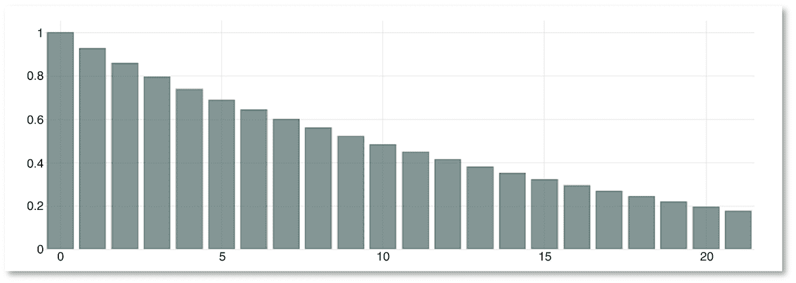

图 6.13

信号的自相关图

这种模式意味着该策略将与大量交易成本相关联，这应该鼓励我们在实施的情况下将其与其他策略结合起来。

### 6.6.4 对信誉度度量窗口的敏感性

在计算附加值平均方法使用的权重时，我们计算样本外 RMSE 来得出信誉度度量。样本外 RMSE 是通过将每个预测与最终实现的股票回报值进行比较获得的。RMSE 是从相关错误的总和中获得的，并且该总和是在一个短期滚动窗口内的。下面，我们测试了该参数不同值对性能的影响（表 6.7）：表 6.7

对于信誉度度量窗口的性能敏感性

| AVA—信誉度窗口 | 平均总收益率（%） | 夏普比率 | 换手率 | 波动率（%） | 最差回撤（%） |
| --- | --- | --- | --- | --- | --- |
| 12 个月 | 10.08 | 0.89 | 250.86 | 10.00 | −24.38 |
| 18 个月 | 10.14 | 0.89 | 250.86 | 10.00 | −22.47 |
| 24 个月 | 10.19 | 0.90 | 250.86 | 10.00 | −21.46 |
| 30 个月 | 10.16 | 0.90 | 250.86 | 10.00 | −21.94 |
| 36 个月 | 10.02 | 0.88 | 250.86 | 10.00 | −22.02 |

在这里，如果窗口选择相对合理，那么很明显参数选择只对策略的性能有微弱影响。

### 6.6.5 对原创度度量窗口的敏感性

附加值平均预测权重的另一个组成部分是原创度量，我们使用滚动 5 年窗口计算平均信息。这个滚动窗口的长度对性能影响微乎其微（表 6.8）：表 6.8

对原创度度量窗口的性能敏感性

| AVA—原创度窗口 | 平均总收益率（%） | 夏普比率 | 换手率 | 波动率（%） | 最差回撤（%） |
| --- | --- | --- | --- | --- | --- |
| 3 年 | 10.20 | 0.90 | 250.86 | 10.00 | −21.49 |
| 4 年 | 10.20 | 0.90 | 250.86 | 10.00 | −21.30 |
| 5 年 | 10.19 | 0.90 | 250.86 | 10.00 | −21.46 |
| 6 年 | 10.16 | 0.90 | 250.86 | 10.00 | −21.64 |
| 7 年 | 10.10 | 0.89 | 250.86 | 10.00 | −21.85 |

### 6.6.6 未考虑参数的敏感性

两个参数可能会被测试它们的敏感性，但在当前系列的稳健性测试中没有考虑，因为由于它们需要大量计算，重新执行 polymodel 估计是不可能的。

polymodel 估计使用的窗口已经设置为默认的 5 年。这样的选择可能会产生影响，正如我们在第四章中看到的那样。然而，第四章和第五章似乎都表明，用于估计 polymodel 的 5 年窗口是最佳选择。正如之前解释的，这个特定窗口使用 1,260 个点，因此每个 LNLM 的 μ 的分层 10 折交叉验证的伪样本估计中使用了 126 个点。5 年窗口可能会在一个稳健参数选择和足够自适应地建模资产回报动态之间达到最佳平衡。

在 LNLM 的分层 10 折交叉验证中，要记得观察是从每个观察分布层随机抽取的。对于这种随机抽样的影响，应该通过敏感性分析来控制使用的种子。如果由于计算资源的限制无法测试种子的敏感性，那么第五章的结果表明，LNLM 拟合似乎不太受种子的影响。

## 6.7 结论

在本章中，我们提出了特定组成部分的股票回报的可靠预测。这些预测通过一种成功的交易策略进行了验证，其夏普比率达到了 0.91（*p* 值为 0.02%）。我们还证明了该信号与用于解释股票回报横截面的标准因子是不同的。

这些结果得益于新技术的发展，这些技术解决了关于 polymodel 预测使用的常见关注点：预测的选择和聚合。

为了进行选择，我们提出了一个动态的、即时的筛选器，成功地移除了最嘈杂的预测因子，并减少了交易策略的回撤。

我们提出了一种新颖的聚合方法，同时考虑了预测因子的伪样本拟合度和预测之间的相关性。增值平均法已经被证明能显著提高交易策略的表现。

除了第四章的市场回报预测和第五章的行业回报预测外，本章的预测构成了用于股票市场的多维预测系统的第三个基石。这些结果进一步支持 polymodels 作为分析复杂系统节点、做出预测，并最终设计盈利交易策略的工具的可靠性。
