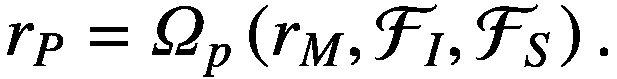
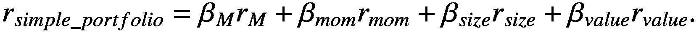

# 结论

Thomas Barrau^(1  ) 和 Raphael Douady²(1)AXA Investment Managers Chorus Ltd, 香港, 香港特别行政区。(2)经济中心, 巴黎索邦大学, 巴黎, 法国

## 摘要

我们通过总结书中提出的不同问题的答案来结束这本书。我们回顾了 Polymodel 理论的局限性如何得到解决。回顾本书中讨论的不同应用，我们概述了 polymodels 如何成功地为金融市场预测文献做出贡献，从而在应用于金融市场时提供有效的人工智能技术。

关键词：Polymodel 理论、人工智能、机器学习、遗传优化、市场定时、股票回报截面、行业回报截面、交易策略、交易信号、股票回报预测在本书的介绍中，我们提出了一个简单的投资组合回报模型，表示为市场、行业和股票回报的特定组成部分的函数：(8.1)在介绍中，我们强调了优秀投资组合表现的事实，即在市场投资组合等简单投资组合之上增加价值的来源可能有三个方面：

+   辨别未知因素，即“α”，解释行业或特定回报。

+   定时子投资组合的表现，通过因子或市场定时。

+   适当组装不同的子投资组合，即在欧米茄中定义权重。

在第四章中，我们提出了一个市场时间信号，似乎是未来市场回报的有效预测器。 这是对卓越投资组合绩效第二来源的贡献。 该章节对通过分析股票市场的相关结构检测系统性风险的广泛文献做出了贡献。 我们没有测量相关性，而是估计了一个多模型，并测量了每个基本模型的均方根误差。 RMSE 的分布被发现能够以非平凡的方式预测未来市场回调，因为我们观察到了链接的极端化，一些经济变量在危机前与市场更相关，而另一些（其中大部分）则不太相关。 这种对 Polymodel 理论的应用显示了它作为分析复杂系统特定节点的工具的有效性。 我们从我们的系统性风险指标中得出了市场时间策略，其 S＆P 500 的毛夏普比率为 0.68，而仅投资于市场的比率为 0.35（这些数字是使用相等的投资组合回报波动率计算的）。 这种市场组合绩效的提高被证明在统计上非常显着，并且尽管进行了大量的稳健性测试，但仍然存在。

在第五章中，我们通过提出一个新的行业风险溢价，即反脆弱性因子，从 Taleb 开发的反脆弱性概念中派生出来，为超额绩效的第一来源做出了贡献。 已经证明它是行业回报的重要预测因子，尤其是有利可图的（达到的毛夏普比率为 1.10）。 该信号经受住了大量的稳健性测试，对于著名因子的回归表明，α与经典的 Fama＆French 因子不同。 值得注意的是，它包含了试图捕捉极端市场风险溢价的其他因子（向下β和协偏度）所不包含的其他因素。 因此，这一章节是对金融领域非线性建模重要性的又一贡献。

另一个对优秀投资组合表现的第一个来源做出贡献的是第六章，该章节使用 polymodels 作为一种机器学习方法，以预测股票回报的交叉部分的特定组成部分。 对于交叉部分的 500 只股票中的每一只，我们定义了一个包含 1,134 个预测因子的 polymodel，该模型会动态重新估计。 我们开发了复杂的选择和聚合方法来应对这个数据挖掘练习。 选择是使用滚动双重过滤器进行的，聚合考虑了拟合优度和预测因子的相关性，这得益于信息论的使用。 考虑到预测因子的相关性的预测聚合方法的使用是 polymodel 理论的一个重要问题（如第二章所述），该问题在本章中找到了第一个答案。 基于这些特定预测实施的交易策略显示出 0.91 的总夏普比率。

第三个投资组合超额收益的来源在于为市场、行业和具体预测定义适当的组合函数“omega”。这个问题在第七章中进行了讨论，我们在其中将前三章得到的因子投资组合进行了合并。使用风险平价组合，综合交易策略达到了 1.58 的总夏普比率，显示了预测的高度和一致的预测能力。当引入现实（可能保守）的交易成本数值时，性能会下降，这就证明了基于遗传算法的组合方法的开发的必要性，该方法部分受到 Gârleanu 和 Pedersen 的动态规划模型的启发。遗传算法旨在解决一个嵌套优化问题，使我们能够同时获得三个子投资组合的最优权重以及策略的最优交易速率。从统计显著性的角度来看，它被证明优于风险平价组合。最终的综合投资组合在扣除交易成本后的夏普比率为 0.94。这个投资组合的一个自然基准将是引言中定义的简单投资组合：(8.2)由于我们的目标是产生新的 alpha 信号和方法，我们避免了对动量、规模和价值因子的任何投资。因此，最终策略的基准投资组合是市场投资组合，在同一时期达到了 0.43 的夏普比率。因此，扣除交易成本后，综合交易策略的性能超过了市场投资组合的两倍以上，这是本书中开发的预测能力最具说服力的指标之一。

因此，本书对引言中提到的优越投资组合性能的三个来源做出了贡献。这些新颖的预测方法和 alpha 信号的开发没有 Polymodel 理论的支持是不可能的，该理论在第二章中有详细介绍。在以下章节中进行的多模型的实证应用，这第二章突出了使用多模型进行建模的理论好处。特别是，它表明，多模型特别适用于解决需要以数据驱动、稳健、准确和非过度拟合方式处理大量数据的人工智能问题。

关于估计组成多模型的基本模型的特定问题，本书介绍了一种新颖的技术，即线性-非线性-混合模型（LNLM 模型）。LNLM 模型提出通过将非线性部分与线性模型混合来正则化多项式模型的非线性部分。通过定制化 Stratified Cross-Validation 的使用来获得的非线性收缩。模拟结果显示 LNLM 模型既有效地减少了过拟合，又在计算时间方面表现良好。这一点尤为重要，因为书中展示的一些应用需要进行数十亿次模型估计。因此，LNLM 被证明是在大数据框架中工作的合适解决方案，并成功用于生成第 4、5 和 6 章的预测。

本书中由 LNLM 模型估算的多模型被证明对金融应用有用，然而，这些工具相当通用，并且可以用于任何应用数学感兴趣的领域。由于最终捕获了阻碍市场效率的行为偏差，预测方法也有潜力应用于任何金融市场，并不局限于股票市场。

我们提出的用于描述投资于股票市场的投资组合回报的简单模型应当得到丰富。如果根据文献中存在的大量预测因子适当加以补充，它可以成为一个极其强大的预测构建框架。书中提出的形式中的聚合函数 omega 在形式上是可扩展的，但它应该朝着更一般的方向发展，例如通过使用深度神经网络来估计，以便从后者作为通用函数逼近器的特性中受益。

书中的结果再次证实了市场效率的缺失。我们已经证明了能够持续战胜市场的可能性，但要牢记我们建立的框架所提供的视角，这本书显然只是关于预测金融市场可实现性的初稿。

这些结果强烈支持了多模型理论在建模的一般目的中与其他人工智能方法的有用性。
