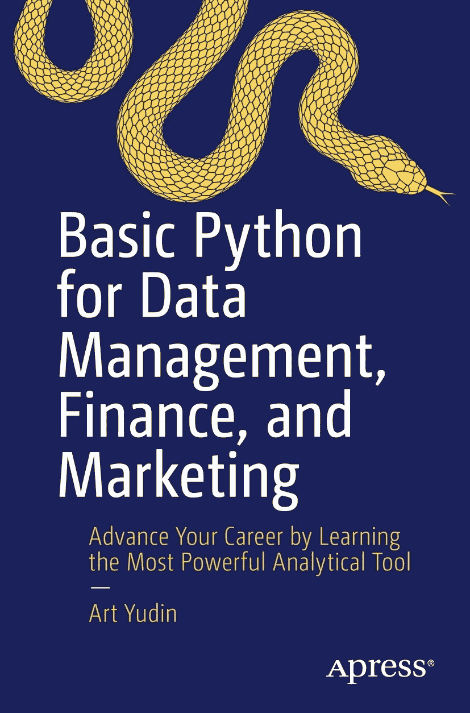

ISBN 978-1-4842-7188-9

电子版 ISBN 978-1-4842-7189-6

[`doi.org/10.1007/978-1-4842-7189-6`](https://doi.org/10.1007/978-1-4842-7189-6)

© Art Yudin 2021

本作品受版权保护。所有权利均独家授予出版社，无论涉及材料的全部或部分，具体包括翻译权、重印权、插图复用权、朗诵权、广播权、微缩胶片复制权或其他任何物理形式的复制权，以及信息存储与检索的传输权、电子改编权、计算机软件权，或利用现有或未来开发的相似或不同方法进行的操作权。在本出版物中使用通用描述性名称、注册商标名称、商标、服务标志等，即使未作特别声明，也不意味着这些名称可豁免于相关保护法律和法规，因而可供公众自由使用。出版社、作者及编辑确保本书内容在出版之日真实准确。出版社及作者或编辑均不对本书材料或可能存在的任何错误或遗漏提供明示或暗示的担保。出版社对出版地图及机构隶属关系中的管辖权主张保持中立。

本 Apress 印记由注册公司 APress Media, LLC（Springer Nature 旗下机构）出版。注册公司地址为：1 New York Plaza, New York, NY 10004, U.S.A.

*献给我的家人，感谢他们始终如一的支持。*

## 关于作者

## 关于技术审校