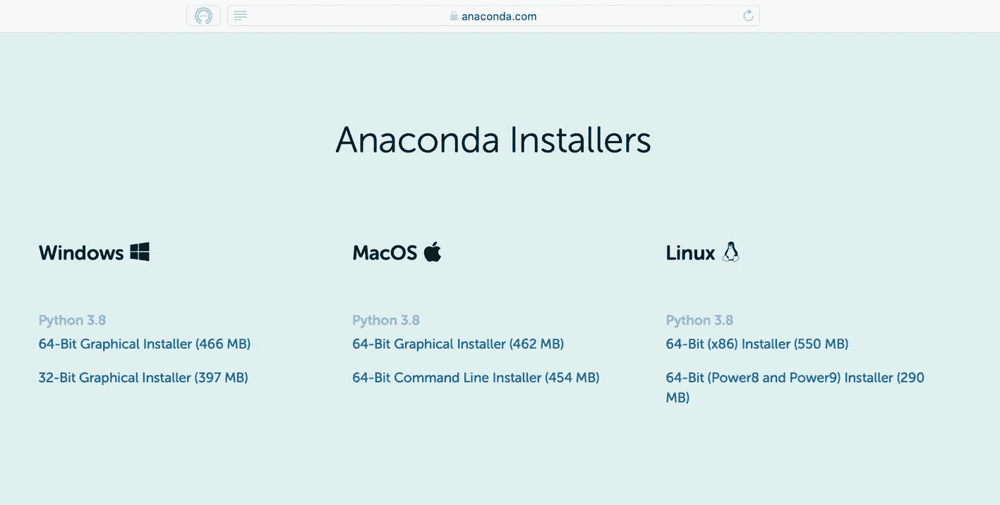
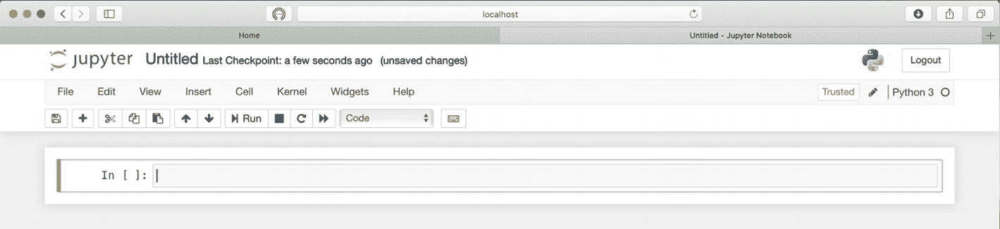
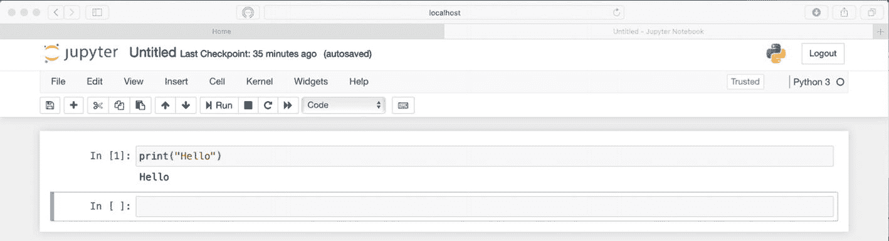
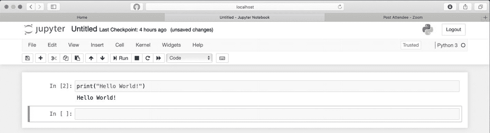
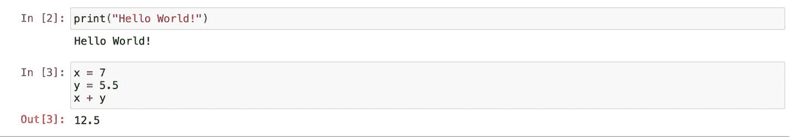
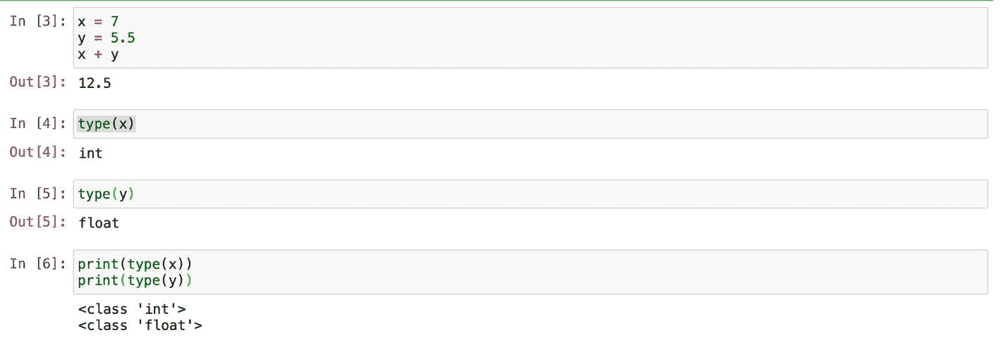
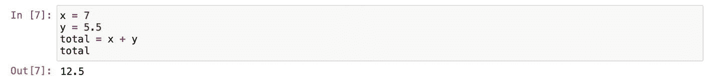
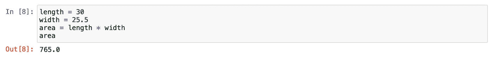

# 安装 Python

首先，我们需要安装 Python。这个看似简单的起步步骤可能会让初学者感到困惑。Python 有许多不同的版本，并且安装过程会因 Mac 和 Windows 系统而异。为了统一步调，不依赖不同的操作系统，我决定使用广受欢迎的 Python 发行平台 Anaconda。

`Anaconda` 是一个软件包，它附带最新版本的 Python 以及我们稍后需要用到的一系列 Python 扩展。市面上还有其他 Python 发行版。尽管如此，`Anaconda` 是专门为那些希望在一个地方拥有所有数据分析工具的用户设计的。它非常流行，被誉为“Python 数据科学的发源地”。^(¹)

安装过程本身非常直接，适用于任何计算机。你可以谷歌搜索“download Anaconda Individual Edition”，或直接访问源网址 [`www.anaconda.com/products/individual`](http://www.anaconda.com/products/individual) 并点击 `Download` 按钮。在该页面底部，你应该能看到 Anaconda 安装程序（图 1-1）。为 Mac 或 Windows 系统选择 `Graphical Installer` 并下载该软件包。在撰写本书时，`Python 3.9` 是最新版本的 Python。即使以后他们升级到 `Python 3.10` 甚至 `Python 4`，也无需担心，语法是一样的。通常，每个版本都会带来一些小的改进，但不会影响本书中我们将要介绍的概念。



图 1-1

页面底部的 Anaconda 安装程序 ([`www.anaconda.com/products/individual`](http://www.anaconda.com/products/individual))

下载 Anaconda 后，默认情况下它应该在你的电脑的 `Downloads` 文件夹中；点击下载好的安装程序，它会启动安装向导。安装过程与任何其他应用程序的安装没有区别。过程中它可能会提供安装 `PyCharm IDE` 的选项。本书中我们不会使用 `PyCharm`，因此这是完全可选的。如果安装过程中出现问题，或者你需要一步步的安装指南，可以在这里找到：[`https://docs.anaconda.com/anaconda/install/`](https://docs.anaconda.com/anaconda/install/)。

要在你的电脑上启动 Anaconda，请进入 `Applications` 目录；在 Mac 上，你可以在 `Launchpad` 中找到它；在 Windows 上，进入 `Applications` 并寻找 `Anaconda Navigator` 的绿色圆形标志，或者在搜索提示框中开始输入 `Anaconda`。点击 `Anaconda Navigator` 标志后，你应该能看到像图 1-2 所示的 `Navigator` 菜单。


图 1-2

Anaconda Navigator 菜单

`Anaconda Navigator` 菜单托管了许多不同的运行 Python 的应用——JupyterLab、`Jupyter` Notebook、Spyder 等。它们都是运行 Python 的应用。在本书中，我们将使用 `Jupyter Notebook`，仅仅因为它是最流行的应用。从现在开始，我将其简称为 `Jupyter`。我不想详细比较其他所有应用的优缺点。我认为你应该都尝试一下，然后选择最适合你的那一个。在我看来，它们之间的主要区别在于布局。无论你选择哪一个，Python 语法都是相同的。

要开始使用 `Jupyter Notebook`，请点击卡片底部的启动按钮。`Jupyter` 将在运行于本地服务器的浏览器中启动。这就是用户界面。如果你使用 Mac，可能已经注意到 `Jupyter` 还启动了一个终端或命令提示符窗口。`Jupyter` 有两个部分：我们编写代码的用户界面，以及运行在本地服务器上负责执行代码的内核。如果你使用 Windows，内核会在后台静默运行。在 Mac 上，它会弹出一个终端窗口。稍后我们会详细讨论内核。

在你的浏览器中，你会看到你电脑的主目录。在浏览器右上角，你可以找到 `New` 按钮。点击 `New` 按钮，会有一个下拉菜单，其中包含 `Python 3` 和其他选项。点击 `Python 3`，你将创建一个新的 `Jupyter` 文件（图 1-3）。



图 1-3

新的 Jupyter Notebook 文件

`Untitled` 是文件的默认名称。如果你点击它，并在弹出的提示框中输入新的文件名，就可以更改默认文件名。除非你在提示框中提供了路径，将文件保存在特定文件夹中，否则它将以 `.ipynb` 扩展名保存在你电脑的主目录或根目录下。`Jupyter` 有许多优秀的功能。我们将在后续内容中逐步介绍大部分功能。其中一项功能是自动保存。所有内容每三分钟自动保存一次。当然，你也可以随时通过点击工具栏中的软盘图标（保存按钮）手动保存你的工作。在 `Jupyter` Notebook 中，所有操作都可以通过点击工具栏中的鼠标完成，或者你可以通过点击上方菜单中的 `help` 或按下键盘上的 `H` 键来查找相应的快捷键。

在中央，你可以看到一个代码单元格，我们将在其中编写代码。如果需要更多单元格，你可以随时通过点击工具栏中的 `plus` 图标按钮来创建一个。另一方面，如果需要删除一个单元格，你可以使用 `scissors` 按钮。我假设菜单中的 `copy` 和 `paste` 按钮的功能无需解释。

在我们进入实际的 Python 编码部分之前，我想解释一下如何使用 `Jupyter`。在上方的单元格中，写一个 `print()` 命令，如下所示：

```
print("Hello")
```

确保 “Hello” 被引号括起来。现在，点击上方工具栏中的 `Run play` 图标按钮。刚才发生了两件事。首先，我们看到单元格左侧的方括号中出现了 `[1]` 这个数字。其次，在单元格下方，打印出了 `Hello` 字样（图 1-4）。方括号中的数字表示我们的代码已在内核中执行。每次你在单元格中编写代码后，都需要运行该单元格才能使代码被执行。每次运行代码都需要去点击那个 `Run` 按钮，这有点烦人。此操作的快捷键是同时按下 `Shift` 和 `Enter` 键。



图 1-4

运行 Jupyter 单元格时，`print()` 命令会打印出 “Hello”

如果你反复运行该单元格，你会发现每次操作都会得到一个新的数字。这个数字本身并不重要，它代表操作的顺序。重要的是，每次更新单元格内的代码后，我们都需要重新运行该单元格。例如，让我们将输出信息更新为：

```
print("Hello World!")
```

输出结果 `Hello` 不会更新，除非我们再次运行该单元格。我将再次运行该单元格。对我来说，这将是我第二次运行该单元格。我会看到顺序中的下一个数字 `[2]`，这意味着该操作已存在于 Python 的内存中，并且输出结果将变为 `Hello World!`（图 1-5）。

注意

你可以通过点击 **帮助** 并选择下拉菜单中的 **键盘快捷键**，查看 **Jupyter** 的所有命令快捷键列表。



图 1-5

当我们用更新后的代码重新运行单元格后，消息发生了变化。你需要记住的要点是：如果你更新了代码或编写了新语句，务必运行或重新运行该单元格。不必过分关注 `[]` 中的数字。另外，你文件中的数字不必与这些图中我文件里的数字保持一致。

让我简单介绍一下内核（Kernel）。`Jupyter` 中的内核负责执行 Python 代码。它默默地在后台完成工作。有时，运行单元格后，你可能会在方括号中看到一个星号。这个星号 `[*]` 表示内核正在工作。对大型数据集执行复杂操作可能需要一些时间，这是正常现象。然而，如果一个简单操作耗时过长，则可能表明出了问题，`Jupyter` 已崩溃。要清空文件内存并重新开始，你需要点击顶部工具栏中的 `内核` 项。下拉菜单会提供 `重新启动` 服务器或 `重启并清除输出` 的选项。如果你选择 `重启并清除输出`，文件中仍会保留你的代码，但方括号会被清空，这意味着内存中的所有操作都已被成功清除。

我们已经介绍了足够的 `Jupyter` 知识，可以开始编写代码了。其他所需内容，我们会在学习过程中逐步掌握。如果将来你想更深入地了解 `Jupyter` Notebook 应用程序，我强烈推荐你访问他们的网站：[`https://jupyter.org`](https://jupyter.org)。

## 变量与数值类型

你可能知道计算机有两种内存类型。一种是长期内存，用于保存文件或作为数据库存储信息；另一种是短期内存，即随机存取存储器（RAM），用于运行应用程序。虽然 Python 是一种编程语言，但它运行在短期内存中。

要在 Python 中存储信息，我们需要使用变量。编程中的变量类似于我们在学校数学课上学到的概念。例如，表达式 `X + Y` 中的 `X` 和 `Y` 就是变量。它们之所以被称为变量，是因为它们可以是任何东西，并且可以包含任何值。

Python 也是如此。如果我们需要保存一个值以便稍后使用，就需要声明一个变量。简单来说，我们需要想出一个变量名并为其赋值。例如，我们可以随意选取一个名称 `x`，然后用等号赋予它值 `7`。在我们的 `Jupyter` 单元格中，看起来就像这样：

```
x = 7
```

之后别忘了运行那个单元格。你可以在我的 GitHub 仓库中找到本章及所有其他章节的完整代码：[`https://github.com/programwithus/Basic-Python-for-Data-Management-Finance-and-Marketing`](https://github.com/programwithus/Basic-Python-for-Data-Management-Finance-and-Marketing)。让我们仔细看看这个表达式。`x` 是一个随意选取的变量名。我们本可以使用任何名称作为变量名。顺便说一句，“banana” 也完全可以胜任。这完全由我们自己决定。在本章后面，我们将讨论命名约定的最佳实践。

然而，也有一些限制。你不能以数字开头来命名变量。此外，还有一些所谓的保留字或关键字是不能使用的。`Jupyter` 在识别哪些词不能用作变量方面做得很好。它会用加粗的绿色标记出来。看看图 1-5 中的关键字 `print`。`print` 是一个内置命令，不能用作变量。你需要记住的一点是，变量必须始终位于等号的左侧。等号用于定义变量并赋值。而值则是更有趣的部分。

我们赋给变量 `x` 的值 `7`，必须以某种方式存储在 Python 的内存中。

这些值会以某种**数据类型**被存储。许多 Python 教程将数据类型解释为数据项的分类。这主要是为了让计算机知道我们未来打算如何使用这些数据。当我第一次听到这个解释时，觉得非常令人困惑。让我来提供我自己对数据类型的解释。

拿起一瓶在任何商店都能找到的简单纯净水。水是值，而塑料瓶是容器。然后假设你在咖啡店点了一杯水。他们会用玻璃杯给你端上同样的纯净水。显然，塑料瓶和玻璃杯之间有很大区别。首先，瓶子有盖子，能防止水漏出来。塑料瓶和玻璃杯是不同类型的容器，但它们装着相同的水——这个值。我们理解不同的容器有不同的特性，并且表现方式也不同。我想表达的观点是，根据你对这个值（本例中是水）的用途，你应该选择合适的容器。如果你打算进入卖纯净水的行业，你应该为你的值选择塑料瓶或带有花哨标签的铝罐。这和在餐厅喝一杯水形成了对比。如果你计划进行公路旅行，也许你应该把你的水储存在旅行杯或保温杯中。

数据类型就好比是容器。你应该根据未来计划如何使用数据，来选择合适的数据类型。“用水来比喻说得通，但数字 7 要怎么装进去呢？”你可能会问我。Python 内置了三种不同的数字数据类型：`integer`（整数）、`float`（浮点数）和 `complex`（复数）。这里，我们将使用整数和浮点数。

`Integer` 是整数。例如，`7`、`27`、`1,000,000` 都会作为整数存储，仅仅因为它们是整数。即使是负数，只要它是整数，也会作为整数存储在内存中。

`Float` 是带小数点的数字。例如 `7.5` 或 `-2.5`。基于你计划统计的内容，你应该选择 `integer` 或 `float` 类型。如果谈论金钱，我们应该使用 `float`。人们在金钱上总希望精确到分。与之相反的则是人数。假设你的任务是把七个人分成两队，那么 `integer` 显然是不二之选。你总不希望最后出现三个半人吧。

让我们看看这个概念在实践中如何运作。在 `x = 7` 下方，再添加一条语句。别忘了之后运行该单元格：

```
y = 5.5
```

由于 `x` 和 `y` 都保存了数值，我们可以进行数学运算。本章后面的表格 1-1 列出了所有算术运算符。

表 1-1

Python 中的算术运算符

| 运算符 | 名称 | 示例 |
| --- | --- | --- |
| `+` | 加法 | `2 + 2` -> `4` |
| `–` | 减法 | `5 – 2` -> `3` |
| `*` | 乘法 | `2 * 2` -> `4` |
| `/` | 除法 | `2 / 2` -> `1` |
| `//` | 整数除法（向下取整） | `5 // 3` -> `1` |
| `%` | 取模（求余数） | `5 % 3` -> `2` |

```
x + y
```

请记住，Python 是区分大小写的，`x` 和 `y` 应该小写。当你运行该单元格时，输出结果将是 `12.5`（图 1-6）。



图 1-6

`x + y` 表达式的输出结果

这次，我没有使用 `print()` 命令，因为 Jupyter 默认会打印单元格中最后一个操作的结果。尽管如此，如果我想要多次打印这个操作的结果，就需要使用 `print()` 命令：

```
print(x + y)
```

运行该单元格时，请确保你的 `print()` 命令全是小写字母。

我们已经使用 `print()` 命令有一段时间了。现在是时候学习其他命令了。Python 有时被称为“内置电池（batteries included）”，因为它附带了许多内置命令和模块。这些命令被称为内置函数。函数是一段可重复使用的、用于执行某个任务的代码块。

你可以在这里找到内置函数的完整列表：[`https://docs.python.org/3/library/functions.html`](https://docs.python.org/3/library/functions.html)。这是官方的 Python 文档页面。以后当你升级到新版本的 Python 时，请确保文档与你机器上运行的版本匹配。在这本书中，我们将学习并使用许多内置函数。如果你认真对待 Python，请将文档页面加入书签，以便作为参考资料使用。

我在那个列表中最喜欢的函数之一是 `type()`。内置函数 `type()` 有助于识别一个值的数据类型。我将演示如何在一个单独的单元格中使用一条 Python 语句，以及如何将几条语句嵌套在一个单元格中。如果你在一个单独的单元格中运行 `type()` 函数，那么就不需要 `print()` 函数。但是，如果你将

```
print(type(x))
print(type(y))
```

放在同一个单元格中，那么你需要将每条语句都包裹在 `print()` 函数中（图 1-7）。



图 1-7

运行内置函数 `type()`

你可以看到 `type(x)` 的输出结果是 `integer`，因为 `x` 存有整数 `7` 这个值；而 `type(y)` 打印出 `float`，因为 `5.5` 带有小数点。

应该使用多少个单元格完全取决于你。通常，我会将不同的任务放在不同的单元格中。随着我们处理更复杂的任务，这样做会更有意义。

在我看来，`type()` 是最被低估的函数。有些人可能会争论为什么我们需要 `type()` 函数？我们明明可以清楚地看到 `x` 存的是一个整数。确实如此。但在现实生活中，当数据通过 API（应用程序接口，我们将在本书后面讨论 API）从互联网传来，或者当你从 CSV 文件中获取数据时，你并不能确定正在处理的数据是什么类型。

此外，根据我的经验，初学者总是会在数据类型上遇到困难并弄混类型。我的建议是，如果你不确定某个变量存的是什么数据类型，就对它运行 `type()` 函数。

现在让我们仔细看看 `x + y` 这个表达式。假设我们想保存这个操作的结果以便稍后使用。要将 `12.5` 存入 Python 内存，我们需要将表达式 `x + y` 赋值给一个新变量。我们可以任意挑选另一个变量 `total` 来保存这个结果。在一个新单元格中试试（图 1-8）。



图 1-8

变量 `total` 保存了 `x + y` 表达式的运算结果

```
x = 7
y = 5.5
total = x + y
total
```

在某种程度上，使用变量名非常方便。假设我们要计算一个房间的面积。为此，我们需要房间的长度乘以宽度。我们可以用 Python 代码实现这个公式（图 1-9）：



图 1-9

计算房间面积

```
length = 30
width = 25.5
area = length * width
area
```

如果我们想计算房子里另一个房间的面积，只需重新给 `length` 和 `width` 赋值，而无需改动 `length * width` 这个公式。

我们一直使用 `x` 和 `y` 作为变量名。然而，在实际开发中，你应该使用能够反映变量值用途的变量名。如果一直用 `x`、`y` 和 `z` 作为变量，会让人困惑。几周后你再回来看代码时，恐怕很难记住当初用 `x` 和 `y` 到底表示什么。此外，你经常需要与他人合作。如果变量名能表示变量所保存的信息，对每个人来说都会清晰得多。你可能已经注意到，我没有对变量进行大写。最佳实践是以小写字母作为变量名的开头。有时，你需要使用两个单词来更好地描述变量的用途。这时，可以用下划线连接两个单词，例如 `length_room`。这种风格称为蛇形命名法（snake case）。另一种选择是以小写字母开头，并将第二个单词的首字母大写，如 `lengthRoom`。这种技巧称为驼峰命名法（camel case）。无论你选择哪种风格，都要始终保持一致，并且永远不要在变量名中使用空格。