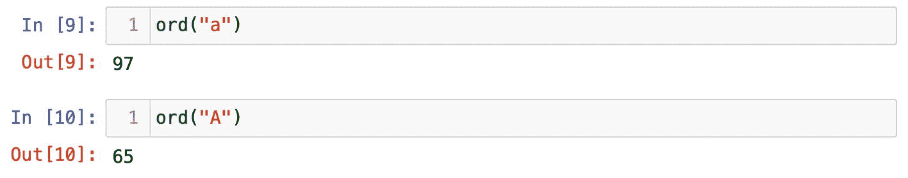
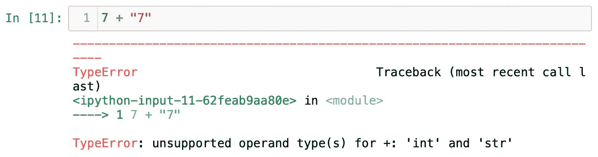
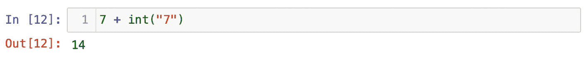
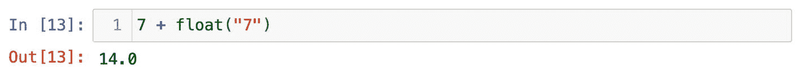
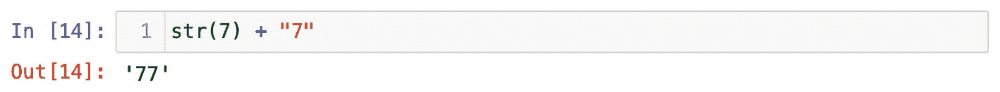

# 字符串

字符串是 Python 中另一种内置数据类型。任何用引号包裹的字符或字母都会作为字符串存储在内存中。回到我们最初的例子 `print("Hello")`，`Hello`（带引号）就会被 Python 视为一个字符串。

我认为下面的例子能说明 Python 字符串的本质。在一个新的单元格中，尝试使用内置函数 `ord()`（图 1-10）：



图 1-10

`ord` 函数返回字符对应的唯一 Unicode 数字

```
ord("a")
ord("A")
```

`"A"` 是字母表的第一个字母。对于数十亿使用拉丁字母的人来说，这很好理解。但如果有人向你展示一个你从未见过的外语字母呢？你的反应大概会是“我不知道这个字符是什么意思”。计算机也是如此。计算机不知道字符的含义。它们将字符串的字符存储为数字。如果你看看文本在底层的样子，你会看到一串数字。在图 1-10 中，`ord()` 函数为字符 `"A"` 返回 Unicode 整数 `97`，为 `"a"` 返回 `65`。`ord()` 代表顺序（order），为每个字符提供对应的数字。显然，`97` 和 `65` 之间有很大的区别。这证明了 Python 是区分大小写的。

Unicode 标准为每个字母、符号或表情符号都提供了一个数字。如果你好奇，可以查看 [`https://unicode-table.com/en`](https://unicode-table.com/en) 上的 Unicode 字符表。

你在日常工作中不会太频繁地用到 `ord()` 函数，也不需要记住所有数字。我想说明的重点是：字符串是字符的序列。计算机并不关心字符串的含义。如果我写了 `"apple"`，对于我们人类来说，它意味着某种水果。而计算机只是在内存中将其存储为一串整数。

带引号的数字 `"7"` 并不表示数值，而是另一个字符。你可以尝试对 `"7"` 运行 `ord()` 函数。

```
ord("7")
```

结果将是 `55`，这是 Unicode 表中代表字符 `7` 的数字。这意味着带引号的 `"7"` 不能用于算术运算，因为它会作为字符串存储。

再次回想一下将水储存在不同容器中的类比。尽管 `"7"` 看起来像一个数字，但实际上对于 Python 来说，它并非数值类型。

下面我运行几个例子来说明整数、浮点数和字符串。在一个单元格中，尝试将 `"7"` 加到一个整数上（图 1-11）。



图 1-11

整数 `7` 不能与字符串 `"7"` 相加

```
7 + "7"
```

`7 + "7"` 会给我们一条错误信息。我想在这里停一下，多跟你聊聊错误。

我知道收到错误信息可能会让人沮丧。但换个角度看，Python 中的错误信息并不是为了评判我们，而是为了帮助我们。当你遇到错误时，首先看看绿色箭头指向哪里，那里就是问题所在。其次，仔细阅读错误信息。Python 会准确地告诉你哪里出错了。我知道一开始可能难以理解。随着经验积累，你会能够理解不同类型的错误信息并知道如何修复它们。

在我们的例子中（图 1-11），Python 告诉我们不能混合不同的数据类型。不能将字符串加到整数上。它实质上是在告诉我们不要对整数和字符串使用加号。

有几种方法可以解决这个问题。我们可以尝试将一种数据类型转换为另一种。既然 `"7"` 看起来像一个数字，我们可以使用内置函数 `int()` 将其转换为数值类型。如果 `"7"` 的位置是一个字母或其他字符，那么转换就无法进行。

```
7 + int("7")
```

在图 1-12 中，我们可以看到字符串 `"7"` 被转换为整数。整数 `7` 加上整数 `7`，我们得到了预期的 `14`。如果 `"7"` 的位置是一个字母或其他字符，那么将其转换为数值类型是无法做到的。



图 1-12

使用 `int()` 函数，我们将字符串转换为整数

另一种选择是将 `"7"` 转换为浮点数。使用函数 `float()`，试试看：

```
7 + float("7")
```



图 1-13

`float()` 函数将字符串转换为浮点数

这一次，由于整数 `7` 加上了浮点数，我们得到了 `14.0`。最终，字符串 `"7"` 被转换成了浮点数 `7.0`。在像 `7 + 7.0` 这样的算术运算中，浮点数总是占据主导，结果会以浮点数的形式返回。

这里还有一种选择。我们可以借助内置函数 `str()` 将整数转换为字符串。

```
str(7) + "7"
```

在图 1-14 中，你可以看到我们现在将一个字符串连接到了另一个字符串上。整数 `7` 被转换为字符串，整个运算产生了一个新的字符串 `"77"`。



图 1-14

使用 `str()` 函数，我们将整数转换为字符串

这三个例子背后的主要思想是：相同的加号运算符会根据其作用的数据类型产生不同的结果。所有数据类型的行为都不同。换句话说，每种数据类型都有其自身的特点。这完全说得通，因为我们知道塑料瓶和杯子是两种不同的容器，它们各自以特定的方式工作。

请记住这些例子。数据类型的行为是一个非常非常重要的主题。之后，我们将转向更高级的对象并学习它们的特性。


