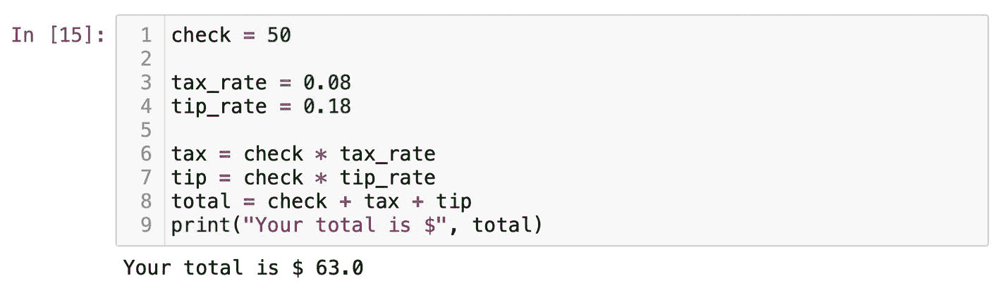
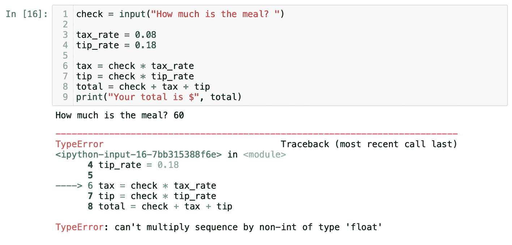
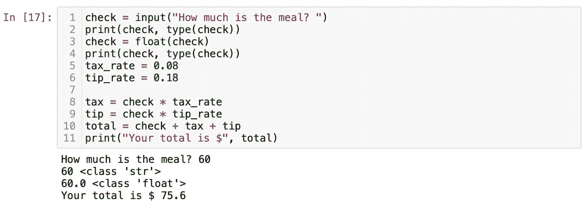

# 你的第一个程序

我想我们已经介绍得足够多了，可以开始编写你的第一个程序了。我本人非常偏爱实践示例。还有什么能比一个税费和小费计算器更实用的呢？我们都会外出就餐，最后服务员会给我们送来账单。为了简化问题，我们假设账单金额为 50 美元。我们的任务是使用 Python 计算税费和小费，并得出最终金额。在纽约市，销售税率为 8.875%。为了让数字更小更简单，我将其四舍五入为 8%。小费则按 18%计算。现在我们已经有了所有输入，可以开始编码了：

```python
check = 50
tax_rate = 0.08
tip_rate = 0.18
```

在定义了已知值的变量之后，我们需要计算小费和税费的实际美元金额。由于我们稍后还会用到税费和小费，因此将表达式赋值给相应的变量是一个好主意：

```python
tax = check * tax_rate
tip = check * tip_rate
```

请注意，如果以后账单金额变了，我们也不需要去修改公式。最后一步是将税费和小费加到账单金额上，并打印出总值：

```python
total = check + tax + tip
print("Your total is $", total)
```

我希望你得到的结果和我图 1-15 中一样是 63.0。`print()` 函数中的逗号在打印 `total` 时创建了一个空格。此外，逗号还用于分隔字符串和浮点数。我们向 `print()` 函数传递了两个参数：`"Your total is $"` 和 `total`。稍后，我会介绍如何使用 `format` 方法来打印格式优美的字符串。如果由于某些原因你看到了 `NameError: name is not defined`，请检查变量的拼写并确保它们保持一致。



**图 1-15** 税费和小费计算器

现在你可能在想，我们如何能让这个计算器更通用，能使用任意金额的账单呢？要接受用户的输入，我们需要使用内置函数 `input()`。`input()` 函数做两件事：首先，它会打印一条我们想传递给用户的消息；然后，它会提示用户输入一个值。在示例中，我将用 `input()` 函数替换 `50`。在括号内，我会传递一条消息。消息是可选的，但引导用户是一个好主意。

```python
check = input("How much is the meal? ")
```

> **注意：** 输入数字后，你需要按下键盘上的 **回车键**。否则，程序会一直等待你的响应，并在单元格旁边显示 `[*]`。如果发生这种情况，请按照我们之前讨论过的方法重启内核。

如果你原样运行包含这段代码的单元格，`input()` 会提示你输入一个值。假设你输入了 60，程序会抛出错误。错误信息类似于你在图 1-16 中看到的那样。编码的一个关键部分是调试自己的代码。这里，我将向你展示一个如何调试代码的示例。我们需要从错误信息“can’t multiply sequence by non-int of type ‘float’”入手。这和我们之前看到的信息几乎一样。它告诉我们不能将字符串与浮点数相乘。显然，`input()` 函数返回的任何值都是字符串，即使它看起来像数字。如果你阅读 `input()` 函数的描述，它会说“将值转换为字符串”。假设我们不太理解这条信息，也没有阅读文档。那么我们就需要逐行检查来找出 bug。



**图 1-16** 错误信息

在 `check` 变量下方，我会放置一个 `print()` 语句来检查 `check` 的值及其数据类型：

```python
print(check, type(check))
```

这会得到结果 `60` 和一个字符串。现在很清楚了，我们不能将字符串与浮点数相乘。要修复这个问题，我会插入一条新语句，将从输入接收到的值转换为浮点数。同时，我会再次对该值运行 `type` 函数，以确保类型已更改为数值类型（图 1-17）：



**图 1-17** 可接受用户输入的税费和小费计算器

```python
check = float(check)
print(check, type(check))
```

成功将用户输入转换为浮点数后，我们的税费和小费计算器就能正常工作了。图 1-17 中第 2 行和第 4 行的 `print` 语句之后可以删除。我们当时需要它们只是为了找到并修复那个 bug。