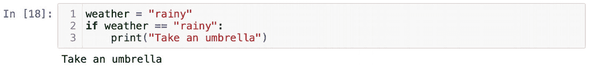
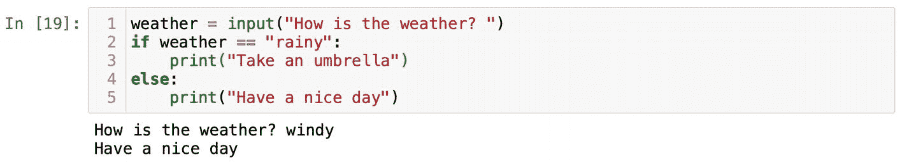
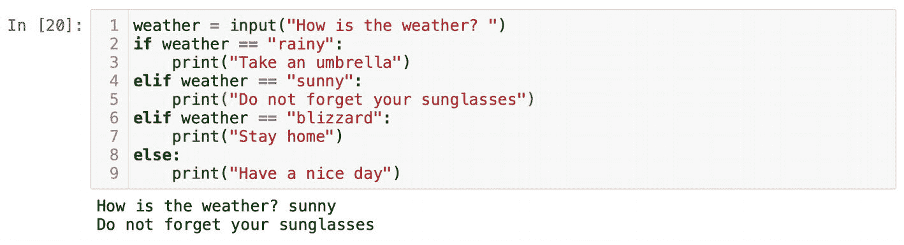
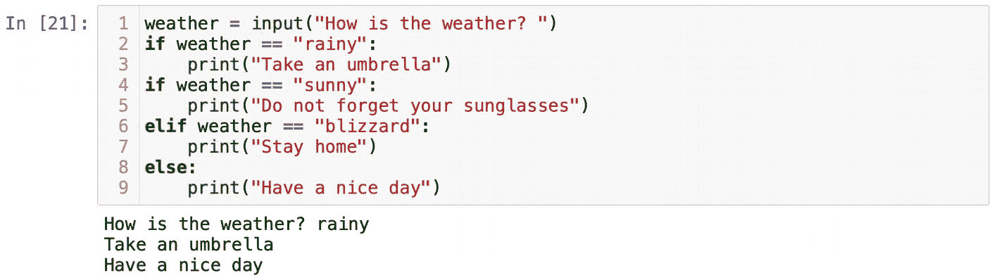
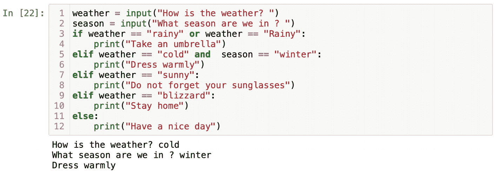

# 使用 If、Elif 和 Else 进行逻辑判断

要在 Python 中实现逻辑判断，我们需要使用 `if`、`elif` 和 `else` 语句。在介绍它们之前，我想先介绍一下布尔数据类型。Python 中有两个布尔值，`True` 和 `False`。`True` 和 `False` 作为关键字，首字母必须大写。如果你尝试计算 `2*2 == 4` 这个表达式，你会看到 `True`。相应地，表达式 `2*2 == 5` 会返回 `False`。我先暂停一下，解释一下双等号运算符的含义。

当我们给变量名赋值时，比如 `x = 7`，我们使用单个等号，因为它用于定义变量。双等号是一个比较运算符。如果我们要比较值，则需要使用 `==`。你可以在表 1-2 中找到更多的比较运算符。

**表 1-2** Python 中的比较运算符

| 运算符 | 名称 | 示例 |
| --- | --- | --- |
| `==` | 等于 | `2 == 2` |
| `!=` | 不等于 | `5 != 2` |
| `>` | 大于 | `5 > 2` |
| `<` | 小于 | `2 < 5` |
| `>=` | 大于等于 | `5 >= 2` |
| `<=` | 小于等于 | `2 <= 5` |

我将从 `if` 语句开始讲起。`if` 语句会计算表达式，如果结果为 `True`，则会执行某些条件。我认为用一个天气相关的例子来说明会更清楚。假设外面下雨，我们想被提醒别忘了带伞。我们可以编写如下 Python 代码：

```
weather = "rainy"
if weather == "rainy":
print("Take an umbrella")
```

`if` 条件会计算 `weather == "rainy"`。为了使它返回 `True`，变量 `weather` 的值必须与字符串 `"rainy"` 完全相同。对于 Python 来说，`"rainy"` 是一个字符序列。计算机会逐字符比较这些值。如果 `weather` 变量的值与 `"rainy"` 完全匹配，意味着所有字母都相同并且是小写，那么条件就会返回 `True`。

你可能已经注意到 `if` 语句后面有一个冒号。简而言之，这是 Python 的语法，你需要记住它。`if`、`elif` 和 `else` 语句的末尾都必须带有一个冒号。我喜欢把这个冒号看作一个动作触发器。如果条件为真，那么就执行某些操作。

根据经验法则，所有跟在冒号后面的语句都必须缩进。缩进在 Python 中非常重要，它用来将语句组合在一起。我们可以说 `print("Take an umbrella")` 这条语句位于 `if` 语句的作用域内。我们会在下一章更多地讨论作用域。

官方的 Python 文档建议使用四个空格进行缩进。然而，像 Jupyter 这样的应用程序允许你使用键盘上的 Tab 键进行缩进。编程的主要规则是始终保持一致。在同一个文件中，你不能混用空格和 Tab 进行缩进。你可以使用自己喜欢的任何一种方式，但如果使用 Tab，就坚持用 Tab；如果选择用空格缩进，就一直用空格。我见过的一个常见错误是，人们从互联网上复制别人的代码并粘贴到自己的文件中。这可能会导致缩进错误，因为复制的代码带有 Tab，而你文件中的缩进使用的是空格。你要记住的底线是，千万不要在同一个文件中混用 Tab 和空格。

我们可以在 Jupyter 中尝试我们的天气练习，输出应该会返回 `Take an umbrella`（图 1-18）。



**图 1-18** 由于 `weather == "rainy"` 返回 `True`，`if` 语句打印出 "Take an umbrella" 消息

为了让我们的代码更通用，我们可以用熟悉的 `input()` 函数替换 `"rainy"`：

```
weather = input("How is the weather? ")
```

运行你的代码，在 `input` 函数提示 `"How is the weather?"` 后，你输入一些不同于 `"rainy"` 的内容。不要忘记按回车键。`if` 语句会被求值，但在这种情况下会返回 `False`，并且什么也不会打印。

`if` 语句后面可以跟一个 `else` 语句。请记住，`if` 语句本身通常就足够用了。然而，大多数时候，你可能需要更多种结果。

让我们给天气脚本添加一个 `else` 语句：

```
weather = input("How is the weather? ")
if weather == "rainy":
print("Take an umbrella")
else:
print("Have a nice day")
```

由于 `else` 语句会捕获用户可能输入的任何其他内容，因此它不需要条件。`else` 语句后面直接跟一个冒号。新手常犯的一个错误是，试图在 `else` 后面挤入一个条件。这完全没有任何意义。在图 1-19 中，你可以看到如果用户输入了 `"windy"`，我们这个小程序会如何反应。由于没有条件来检查 `"windy"`，`else` 语句会捕获它并打印 `"Have a nice day"`。请记住，我们的代码没有执行数据验证。如果用户出于某种原因输入了某些胡言乱语，`else` 语句会被触发并执行它下面的任何代码。



**图 1-19** 执行后，`else` 语句打印出 "have a nice day" 消息

如果我们有比 `"rainy"` 更多的条件呢？在这种情况下，我们需要用 `elif` 关键字来开始所有其他条件。`elif` 代表 "else if"，并且应该在一个 `if` 语句之后使用。假设我们需要在天气晴朗时提醒。我们可以将这个额外的条件写成：

```
weather = input("How is the weather? ")
if weather == "rainy":
print("Take an umbrella")
elif weather == "sunny":
print("Do not forget your sunglasses")
else:
print("Have a nice day")
```

你需要记住的一点是，你总是以一个 `if` 语句开始决策，然后使用 `elif`。如果需要，你可以使用上千个 `elif` 语句。在我们的模式中，我们可以用另一个 `elif` 条件来扩展天气选项，以防暴风雪来临：

```
weather = input("How is the weather? ")
if weather == "rainy":
print("Take an umbrella")
elif weather == "sunny":
print("Do not forget your sunglasses")
elif weather == "blizzard":
print("Stay home")
else:
print("Have a nice day")
```

运行你的代码并测试所有条件（图 1-20）。



**图 1-20** 由 "sunny" 条件触发的 `elif`

初学者会反复犯的一个错误是，使用 `if` 语句而不是 `elif`。在某些情况下，这可能会奏效，但我想演示一下为什么使用 `elif` 语句如此重要。

假设我错误地使用了 `if` 语句而不是 `elif` 来处理 `"sunny"` 条件。假设用户在提示符下输入了 `"rainy"`，我们会看到什么提醒？你可能会说 `"Take an umbrella"`。这是正确的。然而，我们还会看到 `"Have a nice day"`（图 1-21）。为什么？Python 会将这个 `if` 语句视为一组新选项的开始，并在检查完 `"sunny"` 的 `if` 条件后，执行其后面 `else` 下的语句。如果你期望只有一个结果，那么你必须使用 `elif` 语句。



**图 1-21** 决策结构组织的错误示例


换句话说，每次 Python 读取一个 `if` 语句时，都会将其视为一个单独的条件语句或一个新的决策集。这就是为什么如果你希望列出多个选项并预期只有一个结果，那么在 `if` 语句后面紧跟 `elif` 非常重要。

我想现在你肯定想知道，如果用户输入了一个首字母大写的 `"Rainy"`，我们应该怎么办。按照我们当前代码的结构，`"Rainy"` 会被 `else` 语句捕获。这不是我们想要的结果。作为为他人编写代码的人，我们需要考虑到所有可能的情况。一个解决方案是使用逻辑运算符（表 1-3）。在本书的后续内容中，我们将尝试使用所有逻辑运算符。我们先从 `or` 开始。

**表 1-3** Python 中的逻辑运算符

| 运算符 | 名称 |
| --- | --- |
| `and` | 两个条件都应为 `True` |
| `or` | 任一条件应为 `True` |
| `not` | 如果条件不满足 `True` |
| `in` | 如果元素在序列中 |
| `not in` | 如果元素不在序列中 |

我们可以扩展 `if` 语句并使用 `or` 运算符，为用户提供更多输入天气状况的选项。例如，首字母大写的 `"Rainy"`：

```
if weather == "rainy" or weather == "Rainy":
print("Take an umbrella")
```

需要记住的重点是，你需要在 `or` 后面完整地写出整个条件。我们需要再次使用 `weather` 变量。仅使用 `weather == "rainy" or "Rainy"` 这个条件，`if` 语句是无法正常工作的。只要两个条件中的任何一个返回 `True`，`if` 语句就会被触发。坦白说，有一种更好的方法可以确保输入的值与我们的条件匹配。我稍后会向你展示。当前这个例子只是为了说明 `or` 运算符的用法。

与 `or` 运算符相比，`and` 要求两个条件同时满足。为了了解它的工作原理，我们为程序再添加一个问题。变量 `season` 将保存一个诸如 `"summer"` 或 `"winter"` 的值：

```
season = input("What season are we in ? ")
```

我们将添加另一个 `elif` 语句，该语句要求两个条件同时为真：

```
elif weather == "cold" and season == "winter":
print("Dress warmly")
```

只有当两个条件都满足并返回 `True` 时，我们才会看到 `"Dress warmly"` 这条消息（图 1-22）。



**图 1-22** 当两个条件都满足并返回 `True` 时，触发 `Elif`

