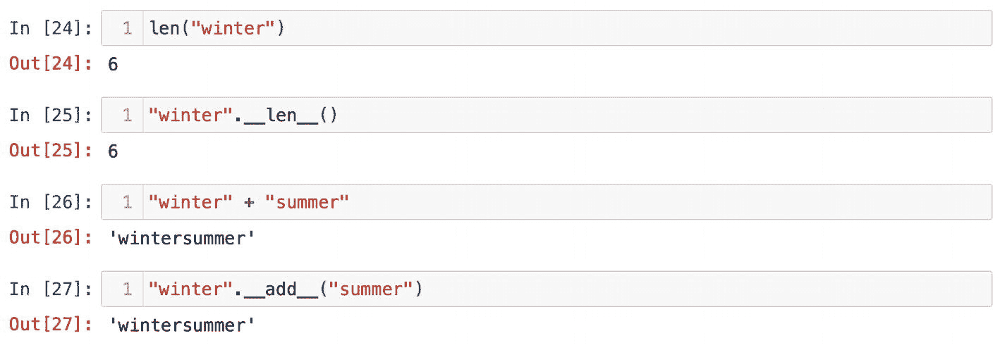
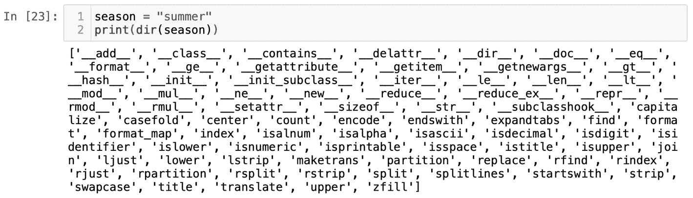
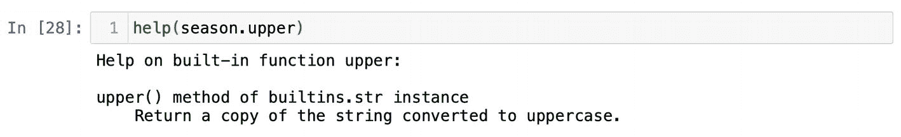
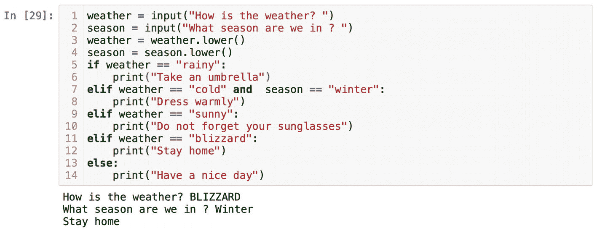
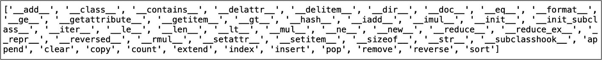
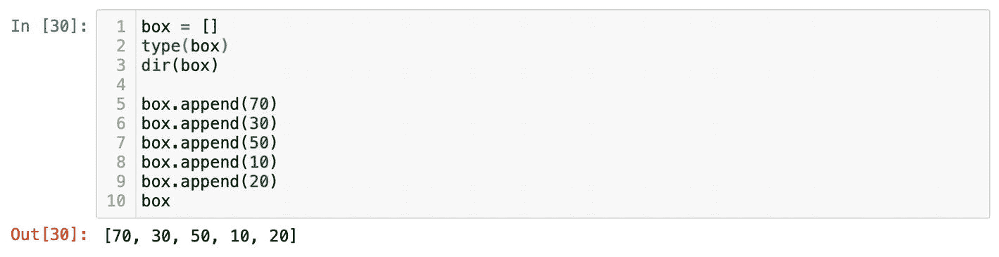
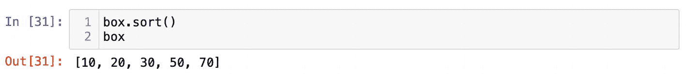

# 方法

Python 是一种面向对象的编程语言。面向对象编程（OOP）是一种用于结构化程序的设计方法。其背后的主要概念是将相关的属性和行为捆绑成独立的对象。简而言之，Python 中的一切都是对象。之前我们用水容器类比简要地探讨了对象的行为。

当我声明变量 `season = "summer"` 时，`"summer"` 作为对象存储在 Python 内存中。它被封装为一个字符串，因为我们用引号将其包裹起来，而 `"summer"` 只是字符串的一个实例。之后如果我们想，可以将 `"summer"` 替换为 `"winter"`。`"winter"` 将是字符串的另一个实例。由于 `"summer"` 和 `"winter"` 都是字符串的实例，它们的行为相似并共享相同的属性。

有一个命令可以显示一个对象的所有内置方法——`dir()`。方法类似于函数，用于执行某项任务。主要区别在于方法属于某个对象。我们会经常使用 `dir()`；随着情况变得更复杂，你会发现 `dir()` 函数是不可替代的。每当你不知道如何在 Python 中实现某件事时，我建议你从 `dir()` 函数开始。假设我们需要将 `"summer"` 转换为大写 `"SUMMER"`。如果你不知道如何操作，始终从 `dir()` 函数开始。对对象运行 `dir()`；在本例中，是对 `"summer"` 运行。你可以将实例 `"summer"` 作为参数传递给 `dir()` 函数，或者传递保存该实例的变量名。另一种选择是将 `str` 传递给 `dir()` 函数；毕竟，`"summer"` 是字符串的一个实例。

```
season = "summer"
dir("summer")
或
dir(season)
或
dir(str)
```

我知道一开始你在图 1-23 中看到的内容可能会令人不知所措。这是字符串对象中所有内置方法或命令的列表。通常，当你想对某个对象进行操作时，你会使用 `dir()` 函数检查它的所有方法。在该列表的开头，我们会看到双下划线方法（dunder methods）。“Dunder” 是 “double underscores”（双下划线）的简称。所有这些双下划线方法在方法名称前后都有双下划线。双下划线方法由 Python 自身使用。举例来说，当对 `"winter"` 调用 `len()` 函数时，它会使用双下划线方法 `__len__()`。类似地，如果你连接两个字符串，加号运算符会调用 `__add__()` 方法（图 1-24）。大多数时候，你会跳过双下划线方法，开始寻找你需要使用的方法。



**图 1-24** 函数 `len()` 和 `+` 充当 `__len__()` 和 `__add__()` 方法的包装器



**图 1-23** 字符串方法

扫描所有字符串方法后，我们会看到 `upper()` 方法。它在字符串方法列表中倒数第二个（图 1-23）。这个方法的名称不言自明。但是，还有许多其他我们尚不了解、也不知道如何使用的方法。要查看方法的定义，请使用 `help()` 函数（图 1-25）。顺便提一下，`help()` 函数是通用的，也可以应用于函数，例如 `help(len)`。



**图 1-25** 函数 `help()` 返回函数 `len()` 的定义

```
help("winter".upper)
或
help(season.upper)
或
help(str.upper)
```


从定义可以看出，`upper()` 方法的作用是“返回一个转换为大写字母的字符串副本”。稍后我们会讨论为什么 `upper()` 方法返回的是对象的“副本”。方法是内置于对象本身的命令；这就是为什么我们需要像这样使用它们：

```
season.upper()
或
"winter".upper()
```

方法是对象所独有的。如果你在整数或浮点数上运行 `dir()` 函数，就不会看到 `upper()` 方法。这很合理。只有字母字符才能转换为大写。

初学者总是问我“我怎么知道哪个是需要将对象作为参数传递的函数，比如 `len("winter")`，哪个是需要在对象后面加点的*方法*？”答案非常简单。你对一个对象运行 `dir()`，如果你要查找的内容在那个列表中，那么它就是方法，你应该用加点的方式使用它，就像这样：

```
"winter".lower()
```

另一方面，如果它不在列表中，你就不能把它当作方法运行。一个非常常见的错误是对对象应用了错误的方法。在这种情况下，Python 会给出错误信息：“`[类型]` 对象没有属性 `[方法名]`”。人们会一再犯这个错误。请相信我，没有必要去记住一个对象的所有方法。有时候，由于 Python 及其扩展会定期更新，这甚至是不可能做到的。你所要做的就是使用 `dir()` 来查看一个对象的所有可用方法。

在我们之前使用 `if` 和 `else` 的例子中，为了防止用户使用大写的单词，我们必须使用逻辑运算符 `or`。借助 `lower()` 方法，我们可以将任何输入的字符串转换为小写，而不用担心用户会使用不同的大小写，比如输入 `"suNNy"` 这样的内容。请记住，我们需要保存小写字符串的副本，也就是要将其赋值给一个变量名。在图 1-26 中，你可以看到"BLIZZARD"被输入，并在第 3 行被转换为小写。



**图 1-26**  
`lower` 函数将输入的单词转换为小写字符串

## 列表与元组

到目前为止，我们已经学习了整数、浮点数和字符串类型。接下来，我们将讨论列表和元组。我们先从最流行的数据结构——列表开始。数据结构是某种项目或元素的集合。大多数情况下，数据结构包含其他基本类型，比如整数或浮点数。理解数据结构最简单的方法是把它们比作容器。

列表是一个容器，它存放的是由逗号分隔的项目。列表中的项目数量没有限制。唯一的限制就是计算机的内存。

通常，我会用一个盒子的例子来解释列表。盒子是一个容器，你可以在里面放东西。之后，如果需要，你可以从盒子里取出物品。要初始化一个列表，我们必须将方括号赋值给一个变量。继续用盒子的例子，让我们定义一个变量 `box` 并赋值为空的方括号：

```
box = []
type(box)
```

你可以把这个操作想象成准备一个空盒子来放一些东西。运行 `type(box)` 函数可以确认 `box` 变量保存的是一个列表对象。

假设我们需要向一个列表对象中添加一系列数字，该怎么做呢？一个选择是去谷歌搜索；然而，最好的方法是查看列表本身有哪些方法。还记得之前练习中的 `dir()` 函数吗？运行 `dir()` 并将包含列表对象的变量传入该函数：

```
dir(box)
```

列表对象的方法（图 1-27）与字符串或任何其他数据结构的方法完全不同。



**图 1-27**  
列表方法

我们的目标是逐个向列表对象中添加数字。如果我们仔细查看列表方法，会看到两个听起来可以用来向列表添加数据的命令。在图 1-27 中，它们是 `append()` 和 `insert()`。如果你想知道它们之间的区别以及如何使用它们，可以运行 `help()` 函数：

```
help(box.insert)
```

和

```
help(box.append)
```

这两个方法的主要区别在于，`append()` 方法字面意思就是将一个项目追加到列表的末尾。而 `insert()` 方法不仅需要插入的项目，还需要一个索引形式的位置。我们将在本章后面讲解索引，因此我们先从 `append()` 方法开始。在一个单元格中，尝试向列表追加随机数字：

```
box.append(70)
box.append(30)
box.append(50)
box.append(10)
box.append(20)
```

请记住，每次你运行这个单元格时，都会看到同一个数字被再次追加到列表中。我将只运行一次这个单元格。完成该操作后，我的列表 `box` 保存了我追加的所有数字，并用逗号分隔（图 1-28）。



**图 1-28**  
数字列表

我希望盒子的类比能帮助你理解列表对象是如何工作的。现在，是时候给你一个关于列表数据结构的更正式的定义了。列表是一种顺序数据结构，可以按升序或降序排列。它是一个用途广泛的容器。你可以向列表添加项目，也可以从列表中移除项目。关于列表数据结构，我希望你理解的主要一点是，你使用列表并不仅仅是为了存储数据。

为此，你会使用文件或将数据写入数据库。但你选择使用列表，是因为你想在后续对容器中的项目进行某些操作。例如，你初始化一个列表并向其追加数字，是因为你想对它们进行排序。有一个内置方法 `sort()`（图 1-29）：



**图 1-29**


