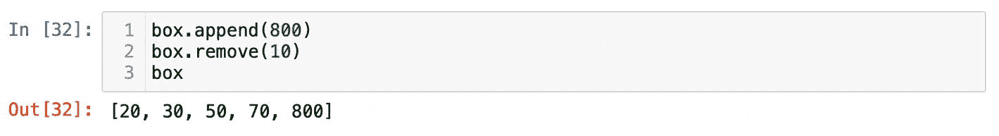
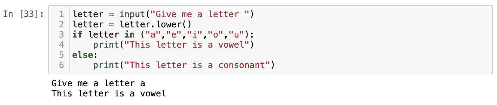

# 升序排序列表

```
box.sort()
box
```

列表数据结构是在原地排序的；这意味着在对象本身内部进行排序。这就是为什么无需将 `box.sort()` 操作赋值给某个变量。列表的这种行为被称为可变性。可变性是编程中一个非常重要的概念，它指的是对象是否可以更改。列表是可变的，我们可以通过 `append()` 方法添加更多元素，或者使用 `remove()` 方法从中移除不需要的元素：

```
box.append(800)
box.remove(10)
box
```

通过这些操作，我们向列表中添加了 800 并移除了 10（图 1-30）。



图 1-30

我们向列表中追加了 800 并移除了 10

另一方面，元组是不可变的，这意味着它无法更改。我们可以使用圆括号创建一个元组：

```
t = (1,2,3,4,5)
type(t)
```

对 `t` 运行 `type()` 函数，你就能看到我们处理的是一个元组。元组与列表类似，它也是一种有序的数据结构，可以存放由逗号分隔的元素。但是，如果运行 `dir(t)`，你会看到除了双下划线方法之外，我们只能使用另外两个方法——`count()` 和 `index()`。列表和元组之间的主要区别在于可变性。重申一下：列表是可变的，而元组是不可变的。

有时，我的课堂上有同学会问：“我们真的需要深入探讨像可变性这样的编程概念吗？我们只是想用 Python 而已。”答案是“是的。”这一点很重要，尤其当你计划处理大型数据集时。一般原则是，不可变对象往往比可变对象更快。你可以将列表和元组数据结构分别想象成一个开口的盒子和一个密封的盒子。对于开口的盒子，你可以往里面放更多东西，或者从中取出一些东西。所以，如果你之后想查看开口盒子里有什么，可能会花一些时间。而对于密封的盒子，则无需浪费任何时间去检查。盒子是密封的，上面有标签标明里面是什么。因为它是密封的，所以不会有新物品加入。

那么，如何选择正确的数据结构呢？显然，如果我们谈论的是纸板箱和塑料箱，你会根据箱子的属性来选择适合工作的那个。在编程中，道理也差不多。让我用一个简单的例子来演示一下。假设我们需要编写一个程序，用于读取用户输入的一个字母。如果用户输入了 `a`、`e`、`i`、`o` 或 `u`，程序应打印 `“This letter is a vowel”`。如果用户输入了字母表中的任何其他字母，程序应显示 `“This letter is a consonant”`。为简单起见，我们假设 `“y”` 始终是辅音字母。

一个快速想到的方法是使用 `or` 运算符，像这样将所有可能条件串联起来：

```
letter = input("Give me a letter ")
if letter == "a" or letter == "e" or letter =="i" or letter == "o" or letter == "u":
print("This letter is a vowel")
```

使用一连串 `or` 运算符的解决方案是可行的，但它并非最高效的方案。我们可以将所有元音字母放入一个列表，并使用表 1-3 中的 `in` 运算符：

```
letter = input("Give me a letter ")
if letter in ["a","e","i","o","u"]:
print("This letter is a vowel")
```

使用列表的方案很简洁。然而，元音字母的集合是永远不会改变的。基于这一点，我们可以使用不可变的元组来打包这个常量集合的元音字母：

```
letter = input("Give me a letter ")
if letter in ("a","e","i","o","u"):
print("This letter is a vowel")
```

当然，对于一个只有五个元素的元组，你不会感觉到速度上有明显提升（图 1-31）。不过，任何元组都会比列表快，而在包含超过 10,000 个元素的列表上，你就能看到这种差异了。



图 1-31

检查一个字母是元音还是辅音的程序

在开始编写代码之前，你应该问自己一个问题：“我是否需要添加或移除什么东西？”如果答案是肯定的，那就使用列表。否则，你可以使用元组。另外，列表结构可以使用内置函数 `tuple()` 转换为元组。反之，元组对象也可以使用 `list()` 函数转换为列表。我们将在本书后面尝试这些操作。

在本书中，我们将大量使用列表和元组，随着学习的深入，我们还会讨论它们其他的特性。


