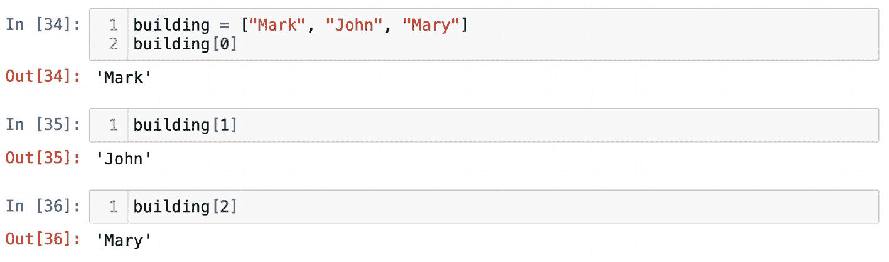
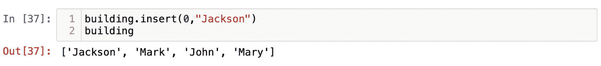
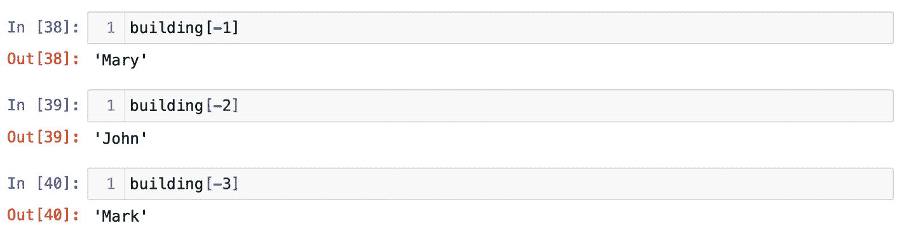

# 索引与切片

列表和元组是有序的元素集合，意味着它们会按顺序保留元素。列表或元组中的每个元素都可以通过其索引来访问。要理解这个概念，可以想象一栋公寓楼。住户马克住在 1 号公寓，他的邻居约翰住在 2 号公寓，玛丽住在 3 号公寓，以此类推。如果我想给马克寄信，就需要在地址中写上他的公寓号。信会送到马克手中，因为他住在一号公寓。后来，马克搬到了另一栋楼，而我的信如果寄晚了，就会被送到当时住在一号公寓的另一位住户手中。关键点在于：无论谁住在公寓里，你总是可以通过公寓号联系到那个人，并且每栋楼都有 1、2、3 号公寓。这就是为什么有时候本地商家会把传单寄给"一号公寓的当前住户"或"二号公寓的当前住户"等等，希望无论谁住在那里都能招揽到客户。

这个例子可以翻译到 Python 中。我们有一个用变量 `building` 存储的列表，其中包含楼内居民的名字：

```
building = ["Mark", "John", "Mary"]
```

需要牢记的主要一点是：在 Python 中，我们从 0 开始计数。列表、元组或字符串的第一个元素的索引始终是 0。要查看谁住在第一个"公寓"中，我们需要通过索引 `0` 来获取：

```
building[0]
```

`building[0]` 语句会得到 `"Mark"`。相应地，`building[1]` 将检索到 `"John"`，而 `building[2]` 预期得到 `"Mary"`（如图 1-32 所示）。



图 1-32

通过索引从列表中获取元素

同样，无论第一个元素是什么，我们总是可以通过索引 `0` 获取它。记住有一个方法 `insert()` 需要一个索引才能将元素添加到列表中。使用这个方法，我们可以在特定位置添加一个新元素。我们将在列表的开头插入 `"Jackson"`：

```
building.insert(0,"Jackson")
```

此操作后，列表中的第一个元素是 `"Jackson"`（如图 1-33 所示）。



图 1-33

方法 `insert()` 根据索引添加元素

如果我让你从列表中取出最后一个元素，你会说我们需要计算所有元素，然后将最后一个元素的索引放入方括号中，像这样：

```
building[3]
```

虽然 `building[3]` 确实能获取到 `"Mary"`，但大多数时候你并不想手动计数。一个列表可能包含数以亿计的元素，这会使得计数变得困难。黄金法则是：序列的第一个元素索引是 `0`，而序列的最后一个元素索引总是 -1。利用这个逻辑，我们可以使用 -1 索引来访问最后一个元素：

```
building[-1]
```

`building[-1]` 再次获取到 `"Mary"`。你可以在图 1-34 中看到，我们通过负索引从右向左依次获取元素。



图 1-34

负索引会从右向左获取元素

记住这个语法最简单的方法就是思考方向。索引的正号表示从左向右移动。如果你想从右向左移动，就应该使用负索引，从 -1 开始（图 1-35）。

索引概念同样适用于字符串。字符串中的所有字符都有索引。你可以尝试通过索引 `0` 获取 `"apple"` 的第一个字符：

```
word = "apple"
word[0]
```

索引帮助我们一次获取一个元素或字符。如果我们需要获取两个或更多呢？那就需要对序列进行切片。语法相当简单；我们需要提供要开始和停止位置的字符索引：

```
对象[ 起始索引 : 结束索引 ]
```

例如，如果我们想从 `"apple"` 中获取 `"pp"`，就需要指明第一个 `"p"` 的索引（即 `1`），以及第二个 `"p"` 索引加一（即 `2+1`）。我知道刚开始听起来有点令人困惑。记住在 Python 中，结束位置是始终被排除在外的。因此，我们需要在切出子字符串的最后一个字符索引上加一：

```
word[ 1:3 ]
```

这个语句会得到切出的子字符串 `"pp"`（图 1-36）。按此逻辑，如果我们想切出最后两个字符 `"le"`，可以写成 `word[3:5]`。`"e"` 的索引是 `4`；由于结束位置被排除，我们需要使用 `5`。这是正确的，`word[3:5]` 会得到 `"le"`。然而，在五个字母的单词 "apple" 中并没有索引 `5`。因此人们通常会省略结束索引，像这样：

```
word[3: ]
```

这种语法表示我们希望从索引 `3`（字母 `"l"`）开始，获取所有剩余字符，无论有多少个（图 1-37）。如果你需要一直取到序列末尾并获取起始点之后的所有字符，省略结束索引是完全正常的。

实际上，切片中还有一个隐藏的索引——步长。步长索引表示间隔，即你想如何遍历序列。默认情况下，步长索引是 1。如果你想逐个遍历字符串中的字符或列表中的元素，则不需要指定步长。

```
对象[ 起始 : 结束 : 步长 ]
```

像这样使用默认步长索引：

```
word[0 : : 1]
```

不会产生太大效果，它会返回整个字符串 `"apple"`。上述符号只是表明我们想从第一个字符开始，然后一个接一个地移动。中间省略结束索引意味着我们不想在任何地方停止，无论有多少字符，都获取全部。

如果你需要跳过一个字符，可以将步长索引设为 2。`word[0 : : 2]` 语句会返回 `"ape"`。步长索引 2 表示每隔一个字母取一个。

步长索引可以是负数。要反转整个单词并倒序读取，我们需要使用 -1 作为步长索引：

```
word[-1 : : -1]
```

第一个负索引 -1 表示我们从最后一个字符 `"e"` 开始。步长索引 -1 表示我们从右向左获取所有字符。我前面关于方向的例子现在更有意义了。坦率地说，在这种情况下起始索引不是必需的，因为负步长索引会翻转起始和结束的默认值。但如果负起始索引最初能帮助你反转字符串和列表，那就放心地使用它。尝试负步长：

```
word[ : : -1]
```

结果会是 `"elppa"`，如图 1-38 所示。

为了熟练掌握切片，我推荐一个非常简单的练习。在新的单元格中，将一个字符串定义为字母序列：

```
string = "AaBbCcDdEe"
```

然后尝试从 "A" 开始获取所有大写字母：

```
string[ 0 : : 2]
```

起始索引 0 让我们从第一个字母 "A" 开始。步长索引 2 让我们每隔一个字母取一个。由于我们想获取所有大写字母，并且不知道字符串中有多少个字符，我们可以留空结束索引。

紧接着，我们可以从右向左获取所有小写字母 `"edcba"`。要向后遍历并跳过每隔一个字母，我们需要使用 -2 作为步长索引。按逻辑，我们的起始点应该是 -1（图 1-39）：

```
string[ -1 : : -2]
```

常常有人问我切片有什么实际用途。相信我，你经常会需要对某些内容进行切片或反转。我最近想到的一个例子是根据邮政编码映射客户。