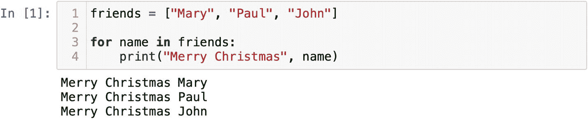
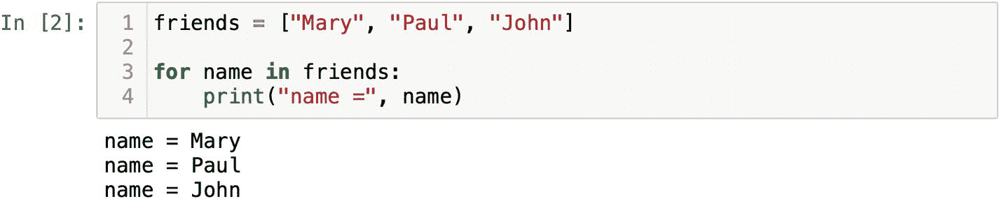
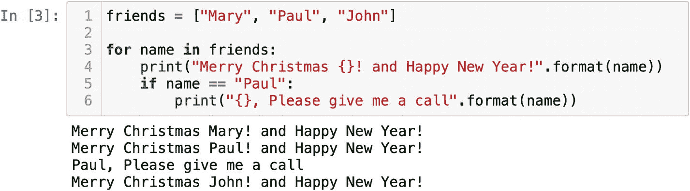
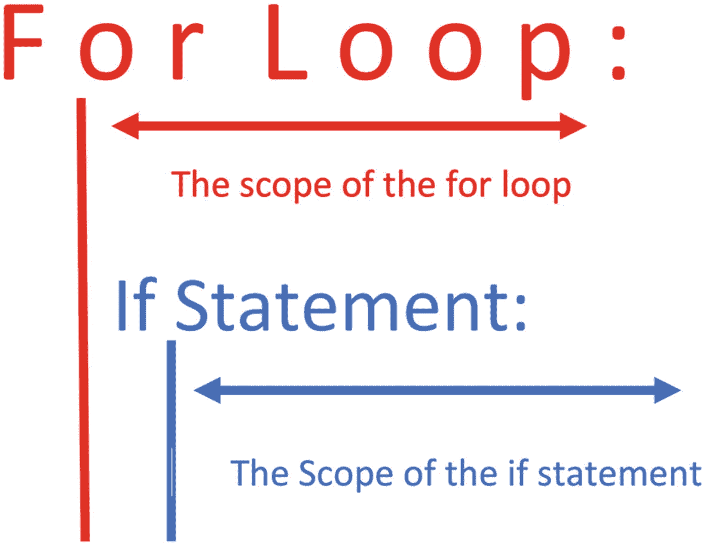
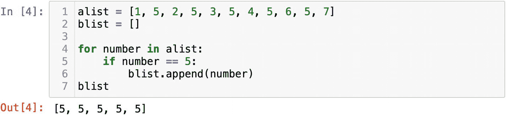

# 2. 编写你自己的 Python 脚本

在上一章中，我们已经介绍了 Python 的所有基础知识。在这里，我们将介绍基本的控制流语句，并学习如何结构化程序。我们将学习如何使用`for`和`while`循环，并编写自定义函数。此外，我们还将熟悉一个关键的 Python 数据结构——字典。

在本章的学习过程中，我们将解决一些有趣且有益的挑战。我们将要进行的练习将演示如何使用 Python 操作数据。无论你身处哪个领域，这都是非常必要的技能。

## 确定循环

确定循环或`for`循环是任何编程语言的重要组成部分。很多时候，你需要多次执行某个操作。例如，你需要向所有朋友发送圣诞祝福。祝福语应该是个性化的，内容是“圣诞快乐 {你朋友的名字}！”。每个朋友都应该打印相同的消息。

让我们看看如何实现。首先，我们需要创建一个包含名字的列表。在假期里，创建一个亲密朋友的列表来问候是很自然的事情。将这个任务转换为 Python 如下所示：

```
friends = ["Mary", "Paul", "John"]
```

现在我们需要遍历列表并逐个获取名字。这个迭代可以通过关键字`for`实现（图 2-1）：



**图 2-1** `for`循环遍历朋友列表

```
for name in friends:
print( "Merry Christmas", name)
```

我想一步步解释这个例子。让我们从`for`循环的结构开始。`for`是一个关键字，在 Jupyter 中会高亮显示。你必须以关键字`for`开头才能重复执行任务。在`for`之后，你需要使用某个变量。在我的课堂上，经常有人问我 Python 如何知道我们正在处理朋友的名字。实际上，“`name`”是一个变量，可以替换为任何其他占位符。尝试将图 2-1 中第 3 行和第 4 行的“`name`”替换为“`banana`”，你会看到完全相同的输出。大多数情况下，在 Python 教程中，人们使用字母`i`（代表`item`）作为`for`循环中的变量。变量的选择完全取决于你。`in`是一个运算符，通常也是绿色高亮。它指的是接下来的序列。用简单的话说，我们想做以下事情：

> for variable in sequence:

> do something to variable

我们遍历项目列表，并用每个值定义变量。每次一个。在问候示例中，我们实际上是从列表中逐个获取人的名字值，并将其赋值给“`name`”变量（图 2-2）。这就是背后发生的事情。



**图 2-2** 变量“name”被定义为列表中的每个值

正如确定循环这个术语所暗示的，`for`循环迭代的次数等于序列中元素的数量。由于`print`语句位于`for`循环的作用域内，因此每次迭代都会执行它。

在迭代过程中，你可以对值执行任何操作。我们可以插入字符串方法`format()`使输出更美观。`format`方法会将变量`name`的值放入花括号中。这个方法可以避免在`print()`函数中使用多个逗号，使我们的代码更简洁：

```
for name in friends:
print("Merry Christmas {}! and Happy New Year!".format(name))
```

大多数情况下，你需要将`for`循环与`if`、`elif`或`else`结合使用。扩展我们的示例，我们可以说如果`Paul`在列表中，则打印“请给我打电话”这条消息。为了检查列表中的每个值是否为“`Paul`”，`if`语句必须位于`for`循环的作用域内。它将测试每个值，假设`Paul`在列表中，则`if`条件返回`True`。逻辑上，位于`if`语句作用域内的另一个`print()`函数将被触发（图 2-3）。



**图 2-3** 在遍历列表时使用`if`语句

初学者最难理解的部分是 `for` 循环及其包含的 `if` 语句的作用域。在 `for` 循环迭代过程中，其作用域内的所有语句都会被执行（图 2-4）。



图 2-4

`for` 循环与 `if` 语句的设计模式

另一个说明 `for` 循环的例子是同时遍历数字列表并进行过滤。初始列表可能如下所示：

```
alist = [1, 5, 2, 5, 3, 5, 4, 5, 6, 5, 7]
```

我们的任务是找出数字 `5` 并将其添加到另一个 `blist` 中。那么，我们先初始化一个新列表：

```
blist = [ ]
```

如果你不知道从何入手，可以尝试将任务按逻辑拆解成几个步骤。首先，我们需要从列表中取出每个数字。听起来这该由 `for` 循环来完成。接着，我们需要将每个数字与 `5` 进行比较，否则计算机怎么知道我们正在找数字 `5` 呢。如果某次比较结果为 `True`，我们就需要使用 `append()` 方法将该数字添加到 `blist` 中。所有这些步骤都可以转换成代码：

```
for number in alist:
    if number == 5:
        blist.append(number)
```

结果，我们会得到一个全是 `5` 的 `blist`（图 2-5）。在图 2-5 的第 6 行，`append()` 被缩进并放置在 `if` 语句的作用域内，它仅在 `if` 语句返回 `True` 后才被执行。缩进是 Python 语法的重要组成部分，你必须遵循 `for` 循环与 `if` 语句的设计模式（图 2-4）。



图 2-5

过滤 `alist` 并将 `5` 添加到 `blist`