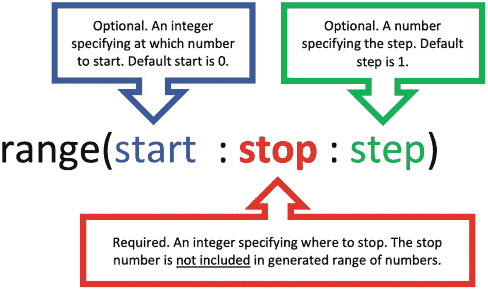
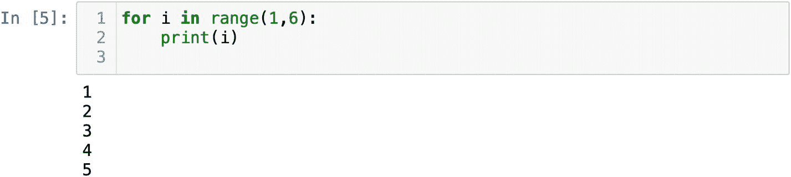
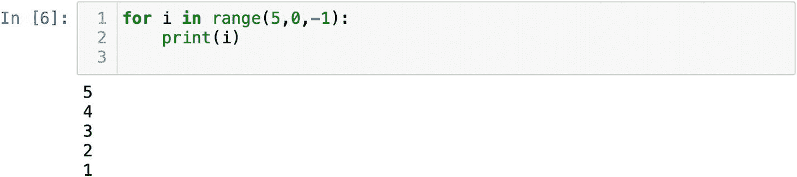
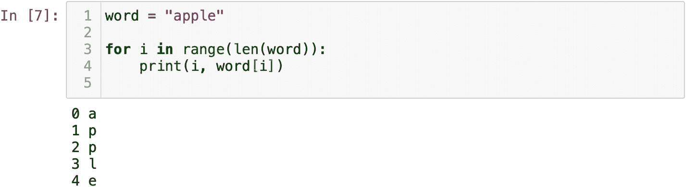

# Range 函数

`range` 函数是内置函数之一，用于生成数字序列。要使用它，我们需要指定起始整数（序列从哪个数字开始）、停止整数（在哪里停止）以及步长整数（具体的间隔），如图 2-6 所示。停止整数是该函数唯一必需的参数。停止数字不会包含在生成的序列中。默认情况下，起始点为 `0`，步长为 `1`。因此，我们至少需要提供一个停止整数。不要将 `range` 函数与切片混淆。虽然 `range()` 函数需要类似的参数（起始值、停止值和步长），但它与切片表示法毫无共同之处。



图 2-6

`range` 函数参数

大多数情况下，`range()` 函数与 `for` 循环配合使用。假设我们想生成一个从 `1` 到 `5` 的数字范围，可以这样写：

```
for i in range(1,6):
    print(i)
```

输出结果为从 `1` 到 `5` 的数字，停止点被排除在外（图 2-7）。我们未指定步长，它默认为 `1`。



图 2-7

`range` 函数生成从 `1` 到 `5` 的数字

到目前为止，非常简单。如果我们想生成相同的范围，但这次是按降序排列呢？那么我们需要从 `5` 开始，不能将 `1` 作为停止点。如果使用 `1`，序列中就不会出现 `1`，我们必须将 `0` 作为停止点。要改变方向，我们需将 `-1` 用作步长（图 2-8）。



图 2-8

`range` 函数生成从 `5` 到 `1` 的降序数字

你可能会好奇 range 的实际用途。通常，`range()` 函数用于生成索引。还记得我们可以通过索引访问序列中的元素吗？让我们回到上一章使用的例子：

```
word = "apple"
word[0]
word[1]
word[2]
word[3]
word[4]
```

使用索引语法，我们通过索引来获取字母。我们不想手动操作。如果能够为任意单词（无论其长度如何）生成索引，任务就会变得简单得多。借助 `len()` 函数，我们可以获取任何序列中的元素或字符数量：

```
len(word)
```

字符串 `"apple"` 有五个字符。`len()` 函数总是返回一个整数。这个整数可以作为 `range()` 函数中的停止点。将其作为参数，`range` 函数就能为任何单词生成从 `0` 到停止点的正确序列。我们可以将 `len(word)` 作为停止参数传递给 `range()`。

`i` 将代表每个字母的索引。这个索引可用于访问字母，例如 `word[0]`。在图 2-9 中，你可以看到 range 生成了一个从 `0` 到 `4` 的数字序列，这完全符合我们对停止点 `5` 的预期。接着，将每个数字传递给方括号，我们就能逐个从字符串中获取字母。



图 2-9

`range` 函数生成可用作索引的数字

在许多情况下，你可能想获取序列中某个值的位置。这就是为什么我们需要知道每个值的索引。例如，如果我们想替换某个值，或对某个值执行操作，我们就需要知道该值存储的位置。


