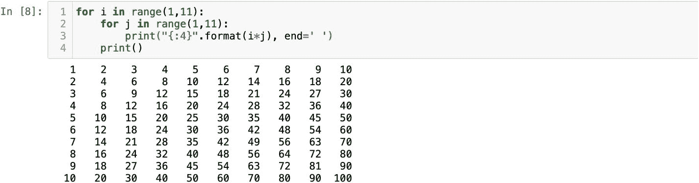

# 嵌套 for 循环

嵌套 `for` 循环的最佳示例莫过于乘法表。我们都知道乘法表长什么样。其概念相当简单：有两组数字，从一组中取出一个数，与另一组中的一个数相乘。1 到 10 的数字序列可以通过 `range()` 来创建。从 1 到 10 的数字序列应水平打印。你可能注意到了，每次在 `for` 循环中使用 `print()` 函数时，它都会将每个项目打印在新的一行上。`print()` 函数的这种行为是可以改变的。如果我们在任意函数上运行 `help()`，就能看到该函数的所有关键字参数：

```
help(print)
```

显然，`print()` 函数有一个默认参数 `end='\n'`。`'\n'` 表示换行。每次执行 `print()` 函数时，它都会在打印文本后添加一个换行符。纯粹为了好玩，尝试将 `'\n'` 替换成 `'ZZ'`，那么它就会在每条语句末尾打印 `'ZZ'`。对于乘法表，我们需要将 1 到 10 的数字水平打印出来。可以这样做：

```
for i in range(1,11):
    print( i, end=' ')
```

然后，我们还需要另一组 1 到 10 的数字。这次，我们使用 `j` 作为变量：

```
for j in range(1,11):
    print( j, end=' ')
```

注意，执行这两个 `for` 循环的结果是得到 20 个数字。第一个 `for` 循环迭代并打印十个数字，第二个 `for` 循环也是如此。我们可以将第二个 `for` 循环移入第一个 `for` 循环的作用域内。这样，外部 `for` 循环的每一次迭代都会得到十个 `j`。接下来，去掉第一个 `print` 语句，并在第二个 `print()` 函数中将 `i` 乘以 `j`：

```
for i in range(1,11):
    for j in range(1,11):
        print( i*j, end=' ')
```

当我们有了嵌套的 `for` 循环后，会打印出 100 个数字。这里要传达的主要信息是：执行 100 次操作所需的时间比执行 20 次要长。通过嵌套 `for` 循环，我们极大地增加了程序的时间复杂度。换句话说，我们让代码运行得更慢了。

别误会我的意思。我并不是说永远不要使用嵌套循环。有些情况下你不得不使用嵌套循环，比如乘法表。我只是希望你能明白，如果你能找到不使用嵌套循环的解决方案，那么那个解决方案会更快。

在我们将乘法表规范化之前，需要在末尾增加一个 `print` 语句。尽管这个 `print` 语句跟在第二个 `for` 循环之后，但它应被放置在外部 `for` 循环的作用域内。这意味着最后一个 `print` 语句的执行次数与外部 `for` 循环的迭代次数相同。因为最后一个 `print` 语句处于外部 `for` 循环的作用域中。我们需要这个 `print` 在每组数字之后添加 `'\n'`。如果你临时在该 `print()` 函数中放入一些内容，比如 `"ZZ"`，理解起来会更容易：

```
for i in range(1,11):
    for j in range(1,11):
        print( i*j, end=' ')
    print('ZZ')
```

这些有趣的小标签有助于你理解最后一个 `print` 语句究竟做了什么以及它执行了多少次。在底部添加了 `print()` 函数后，它看起来更像一个乘法表了。我们可以使用字符串格式化方法进行最后的润色。这个 `format` 方法将帮助我们以数字之间间隔四个空格的均匀间距来排列数字。你可能还记得，字符串方法 `format` 会将值插入到花括号中。在传递值的同时，我们可以对它们进行格式化。在我们的示例中，花括号中的 `:4` 会在数字之间生成四个空格：

```
for i in range(1,11):
    for j in range(1,11):
        print("{:4}".format(i*j), end=' ')
    print()
```

在图 2-10 中，你可以看到最终结果。乘法表练习很好地解释了嵌套 `for` 循环的概念。对于外部 `for` 循环的每一次迭代，你都会得到内部 `for` 循环的 `n` 次迭代。下次当你决定使用嵌套 `for` 循环时，请回想一下乘法表以及你代码的运行时复杂度。



图 2-10 乘法表