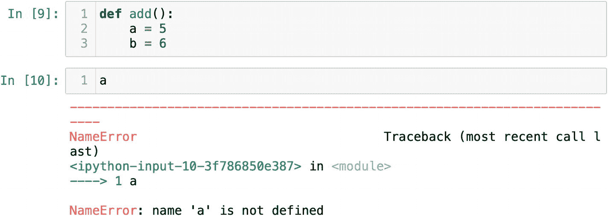
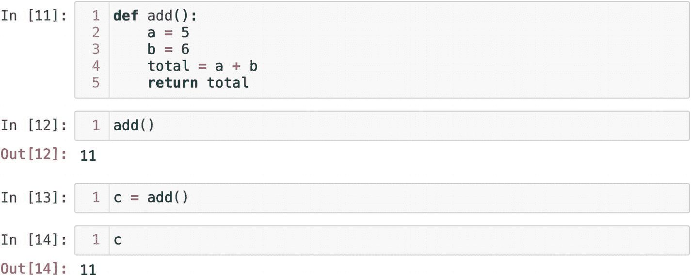
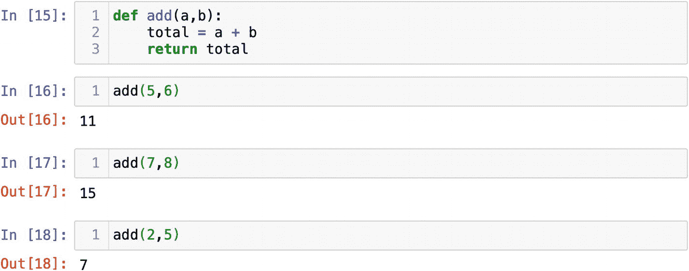
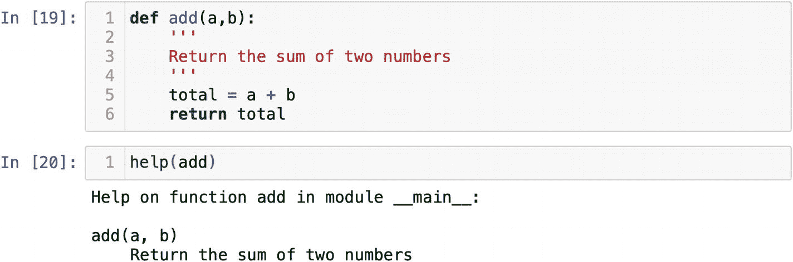

# 定义你自己的函数

到目前为止，我们一直在使用 Python 的内置函数。不过，你也可以定义自己的函数。在进入编码部分之前，我们需要理解 Python 中函数是什么。函数是一段可重用的代码块。这里的关键词是**可重用**。编程中有一条原则——保持代码 DRY。DRY 意思是不要重复自己。如果你想反复做某件事，就把它封装成一个函数。

每个函数都应该执行一个任务并实现一个目的。你不应该把整个程序写成一个长函数。相反，你应该将代码拆分成多个函数，让每一步或每一个任务都成为一个独立的函数。整个程序将由多个函数和代码块组成，你以后可以轻松替换或更改它们。此外，有些函数可能会在其他程序中使用。将一个函数从一个模块导入到另一个模块是很常见的做法。

让我们来编写一个简单的函数，用于将两个数字相加。你使用关键字 `def` 来定义函数。`def` 代表定义。然后你需要为函数想一个名字。任何名字都可以，但最佳实践是，函数名应该反映其目的。紧接着函数名，你应该放置带冒号 `:` 的括号。

```python
def add():
```

缩进应跟在冒号后面。所有缩进的语句都将位于该函数的作用域内。现在，我们只需在函数中定义两个变量 `a` 和 `b`，并分别给它们赋值 `5` 和 `6`。请注意，变量 `a` 和 `b` 是局部定义的——在函数内部：

```python
def add():
    a = 5
    b = 6
```

如果你尝试在函数外部使用它们，Python 会报错，提示 `a` 和 `b` 未定义（图 2-11）。这意味着 `a` 和 `b` 只能在定义它们的函数内部使用。



图 2-11

变量名在函数内被局部定义

我们这个简单的函数会将 `a` 加到 `b` 上，并把结果保存到变量 `total` 中。到目前为止，我们一直使用 `print()` 函数来查看操作结果。我们人类需要看到结果，但计算机不需要。因此，函数会返回结果。`return` 是函数中的最后一个语句。在 `return` 语句之后你不能执行任何操作，它会终止代码。如果你需要用 `print()` 函数来查看结果，你需要将其放在 `return` 语句之前：

```python
def add():
    a = 5
    b = 6
    total = a + b
    return total
```

如果你运行包含函数 `add()` 的单元格，你会发现什么也没有发生。只不过现在函数 `add()` 被存储在了 Python 的内存中。要使用这个函数，我们需要调用它：

```python
add()
```

在图 2-12 中，你可以看到被调用的函数 `add()` 返回了结果 11。



图 2-12

函数 `add()` 返回 11

如果你想保存函数返回的结果，你需要将函数赋值给一个变量名。在图 2-12 中，函数 `add()` 返回的结果被保存在了变量 `c` 中。

为了让我们的函数更加通用，我们可以将 `a` 和 `b` 定义为参数。我们只需将它们放在函数名后面的括号内，并用逗号分隔即可：

```python
def add(a,b):
```

现在，我们的函数需要任意两个数字才能产生结果。如果在不传递两个数字的情况下调用函数，将会引发错误消息。

总而言之，一个函数接收参数并返回结果。它是一个可重用的代码块，你可以反复调用（图 2-13）。根据代码的用途将其封装起来是一个好习惯。将代码结构化为一组函数，可以使其整洁清晰。



图 2-13

函数 `add()` 返回结果

当你与团队合作，并且其他人会使用你的函数时，添加一段描述是个好主意。这段描述被称为**文档字符串**。在函数定义下方的行中使用三个单引号或双引号，写下函数的目的。描述不应太长，无需详细解释你的函数是如何工作的。文档字符串应该概述函数的目的。此外，你也可以指定计算中使用的某些值。

```python
'''
返回两个数字的和
'''
```

如果你的函数有文档字符串，其他人可以使用 `help()` 函数来阅读它（图 2-14）。



图 2-14

可以使用 `help()` 函数读取文档字符串