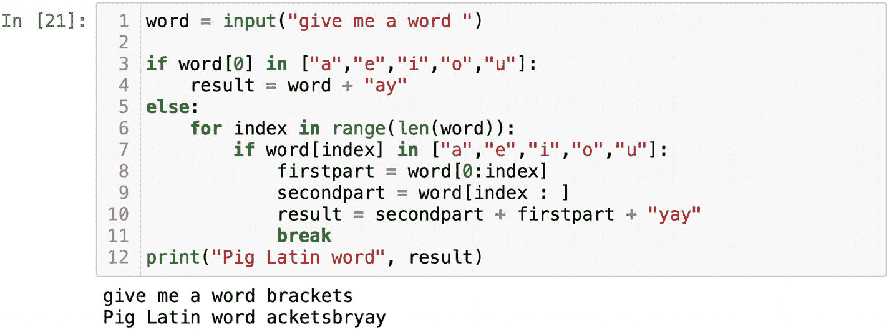
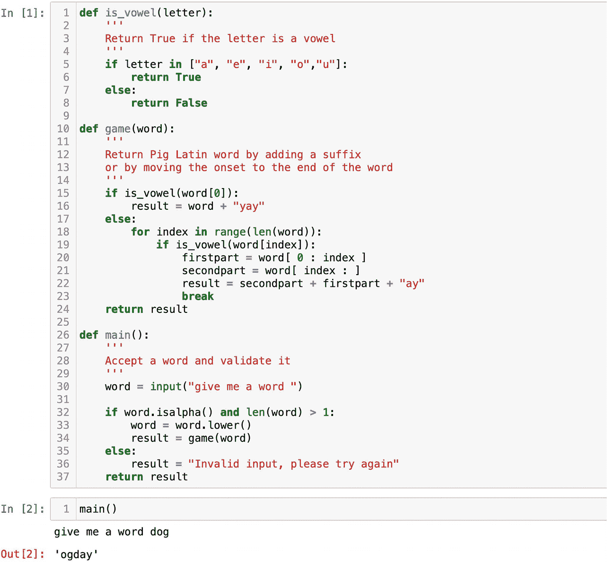
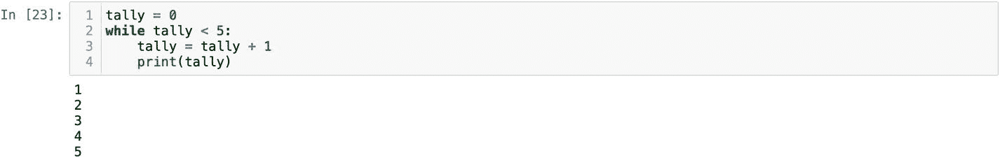

# 构建程序结构

现在是将我们所学知识付诸实践的时候了。我们将编写一个最古老的文字游戏之一——"儿童黑话"（Pig Latin）。此练习旨在学习如何操作数据并组织代码结构。

如果你从未玩过"儿童黑话"，其规则非常简单：向用户询问任意单词。如果单词以元音开头，则需要在末尾加上`"yay"`。例如，`apple`将变成`appleyay`。但如果单词以辅音开头，则需要截掉单词中第一个元音之前的所有辅音，并将这些辅音移到单词末尾，同时还要在单词末尾添加`"ay"`。单词`scratch`将变成`atchscray`。

如果起初觉得问题过于复杂且不知如何入手，不妨先编写伪代码。

伪代码是用通俗语言描述的算法概要。你可以将其视为一张路线图。在一张纸上写下完成该任务所需的所有步骤，假装自己正在向一个孩子逐步解释如何玩"儿童黑话"。针对"儿童黑话"的伪代码解决方案可能如下：

1.  向用户询问一个单词。
2.  检查单词是否以元音开头。
3.  如果单词以元音开头，则添加`"yay"`并用变量保存。
4.  如果单词以辅音开头，则需要检查所有字母并找到第一个元音。
5.  要移除元音之前的字母，需要知道元音的索引。
6.  使用变量`firstpart`存储所有被移除的辅音字母。
7.  获取其余字母并用变量`secondpart`存储。
8.  将`secondpart`与`firstpart`拼接，并添加`"ay"`。

将问题分解成简单步骤后更容易解决。如果不知道如何在 Python 中实现某个步骤，可以随时上网搜索。好了，现在我们就可以开始将计划转化为 Python 代码。

为简单起见，我假设用户输入了单词`apple`：

```python
word = "apple"
```

现在我们需要检查第一个字母是否为元音。从字符串中获取第一个字符相当于索引操作。第一个索引始终为 0，因此第一个字母是`word[0]`。在上一章中，我们编写过检查字母是否为元音的代码，此处可以直接使用：

```python
if word[0] in ["a","e","i","o","u"]:
    print("这个字母是元音")
```

由于`"apple"`以元音开头，根据步骤 3，我们将为其添加`"yay"`。将新的"儿童黑话"单词保存在变量`result`中：

```python
if word[0] in ["a","e","i","o","u"]:
    result = word + "yay"
    print(result)
```

添加一条打印语句来检查`result`的值，然后运行代码。确保代码在以元音开头的单词上能正确运行。第一部分很容易解决，我们已经完成了一半。

对于第二部分，我们需要一个以辅音开头的单词。将变量`word`重新赋值为`"scratch"`。这里只有两种可能：单词要么以元音开头，要么不以元音开头。逻辑上这对应`if`和`else`语句。到目前为止，我们已经实现了`if`部分，现在来编写`else`部分。

伪代码中的第 4 步要求测试单词中的所有字母并找到第一个元音。

要找到元音，我们需要遍历字符串的字符，或者说，将这一任务转化为 Python，就是运行一个`for`循环。第 5 步提示，当在单词中找到元音时，我们需要获取该元音的索引。函数`range()`对于获取索引非常有用。将第 4 步和第 5 步转化为代码后如下所示：

```python
word = "scratch"
if word[0] in ["a","e","i","o","u"]:
    result = word + "yay"
else:
    for index in range(len(word)):
        print(index, word[index])
```

`print`语句可以帮助我们确认进展正确，而`index`表示`word`中每个字母的索引。你可能还记得，要通过索引从字符串中获取字符，需要将索引放入方括号中，即`word[index]`。识别元音很容易，因为我们在第一部分刚做过。只需将`0`替换为`index`：

```python
word = "scratch"
if word[0] in ["a","e","i","o","u"]:
    result = word + "yay"
else:
    for index in range(len(word)):
        if word[index] in ["a","e","i","o","u"]:
            print(index, word[index])
```

在`if`语句作用域内的`print`语句会显示元音及其索引。在单词`"scratch"`中，元音的索引是`3`。根据伪代码，我们需要按元音索引拆分单词。我们不希望硬编码（即直接使用`3`），因为另一个单词中的元音可能位于不同位置。利用切片，我们可以获取单词`"scratch"`中元音`"a"`之前的所有辅音。因此，第 6 步的实现如下：

```python
firstpart = word[0:index]
```

类似地，我们将切片获取元音之后的所有字母：

```python
secondpart = word[index : ]
```

终止位置留空是因为我们希望获取索引之后的所有字符。伪代码中的最后一步很简单。为了保持一致性，我们将使用相同的变量`result`，并将`secondpart`与`firstpart`和`"ay"`拼接：

```python
word = "scratch"
if word[0] in ["a","e","i","o","u"]:
    result = word + "yay"
else:
    for index in range(len(word)):
        if word[index] in ["a","e","i","o","u"]:
            firstpart = word[0:index]
            secondpart = word[index : ]
            result = secondpart + firstpart + "ay"
```

将`input()`函数赋值给`word`，然后用不同的单词测试你的代码，确保它能正常工作。有一点让我担心：包含两个及以上元音的单词可能会返回错误结果。如果你尝试单词`"brackets"`，结果将是`"etsbeackyay"`。我认为规则要求识别第一个元音。如果需要代码在找到第一个元音后停止，我们需要在`if`语句后加上关键字`break`。在图 2-15 中，你可以看到"儿童黑话"挑战的完整解决方案。



**图 2-15** 用 Python 编写的"儿童黑话"游戏

我们可以重构代码以改进设计和结构。我会从`if`语句开始。代码中两次使用了元音列表。如果有一个函数能告诉我们某个字母是否为元音，是不是更简洁明了？我们可以编写一个小型辅助函数，该函数接受一个字母作为参数，并返回`True`或`False`。我将这个函数命名为`is_vowel`：

```python
def is_vowel(letter):
    if letter in ["a","e","i","o","u"]:
        return True
    else:
        return False
```

接下来，我们可以将"儿童黑话"游戏代码封装成一个函数。我将这个函数命名为`game`。该函数的功能是接受任意字符串（我们将其定义为`word`），并返回对应的"儿童黑话"变体：

```python
def game(word):
    if is_vowel(word[0]):
        result = word + "yay"
    else:
        for index in range(len(word)):
            if is_vowel(word[index]):
                firstpart = word[0:index]
                secondpart = word[index : ]
                result = secondpart + firstpart + "ay"
                break
    return result
```

在函数`game`内部，我们将调用函数`is_vowel`来检查字母是否为元音。你可以测试函数`game`并用任意单词调用它：

```python
game("scratch")
```

我们会在一个单独的函数中请求用户输入。为此，我们将定义一个函数并将其命名为 `main`。在实际场景中，我们需要验证用户的输入。我们必须确保输入不含数字或其他非字母字符，并且输入的长度大于一个字母。英语中没有只有一个字母的单词，除了 `a` 和 `I`。如果输入验证成功，我们会将其传递给函数 `game`。经过处理后，函数 `game` 会返回一个 Pig Latin 单词，我们再将结果呈现给用户。如果用户的输入未通过我们的过滤器，我们将返回 `"Invalid input, please try again"`。由于 `is_vowel` 只能处理小写字母，我们需要在调用函数 `game` 之前将接收到的单词转换为小写：

```python
def main():
    word = input("give me a word ")
    if word.isalpha() and len(word) > 1:
        word = word.lower()
        result = game(word)
    else:
        result = "Invalid input, please try again"
    return result
```

你可以在图 2-16 中看到 Pig Latin 游戏的最终实现。当我们在底部调用函数 `main` 时，它会提示我们输入一个单词。如果第 32 行的过滤器返回 `True`，则会在第 34 行调用函数 `game`。用户输入转换为小写后作为参数传递给 `game`，并赋值给参数 `word`。在第 15 行，`is_vowel` 会被第一个字母调用。对于单词 `"dog"`，`is_vowel` 返回 `False`，程序会转到 `else` 语句。第二次迭代后，函数 `is_vowel` 再次被调用，这次使用的是字母 `"o"`。从 `is_vowel` 函数接收到 `True`，使得代码执行第 20-22 行。新单词在第 22 行保存为变量 `result`。最后，函数 `game` 在第 24 行返回 Pig Latin 单词。`game` 函数的输出结果在第 34 行被保存，并在第 37 行由 `main` 函数返回。



**图 2-16** Pig Latin 游戏的重构代码

有些人可能会问，为什么像 Pig Latin 游戏这样简单的任务需要这么多函数。答案是每个函数都有自己的用途，并负责一项工作。`is_vowel` 是一个辅助函数，只回答一个问题：一个字母是否是元音。如果需要，我们可以导出这个函数并在另一个文件中使用。函数 `main` 负责所有与用户的交互。如果后来你需要修改输入语句中的消息，可以轻松完成，而无需改动 `game` 函数。与用户通信是一个完全独立的任务，和 Pig Latin 代码无关。如果我们决定在程序中添加更多单词游戏，`main` 函数将是添加菜单并向用户询问想玩哪个游戏的正确位置。

## 不定循环

Python 中有定循环和不定循环。我们已经学习了定型的 `for` 循环；现在该看看 `while` 循环了，这是一种不定循环。正如你可能从名字中猜到的，我们不知道 `while` 循环会迭代多少次。关键字 `while` 后面需要紧跟一个条件。如果条件返回 `True`，那么 `while` 循环就会执行其作用域内的语句。执行完毕后，`while` 循环会再次检查条件。如果条件仍然成立，它会再次迭代。然而，如果条件返回 `False`，`while` 循环就会退出。最简单的例子是工作时间。伪代码可能如下所示：

```
while not 6.00pm
    keep working
```

如果还没到下午 6:00，我们就会继续工作。一小时后再检查时间是否是下午 6:00。如果不是，则继续工作。到了某个时刻，`while` 条件不再为真，因为已经过了下午 6:00。我们就可以跳出循环，停止工作。主要规则是条件应当在某个时刻变为 `False`。否则，你最终会陷入无限循环。在现实生活中，这可能是一场灾难。

我们可以像这样构建一个简单的 `while` 循环：

```python
tally = 0
while tally < 5:
    tally = tally + 1
    print(tally)
```

在运行这段代码之前，请确保在 `while` 循环的每次迭代中都将 `tally` 增加 1。如果不小心跳过了这条语句，你的 `while` 循环将会一遍又一遍地打印 0。这就是一个无限循环的例子。要退出无限循环，你需要通过点击 `Jupyter` 上方菜单中的停止按钮来中断内核。

`while` 循环中的 `tally = tally + 1` 语句会增加 `tally` 的值。五次重复之后，`tally` 的值将会是 5，条件 `tally < 5` 将返回 `False`。循环将退出（图 2-17）。



**图 2-17** 当条件不再为真时，while 循环退出

`while` 循环的关键要素是条件。条件必须在某个时刻发生变化以退出循环。

我们可以在 Pig Latin 示例中使用 `while` 循环。函数 `main()` 验证输入的单词。如果字符串包含字母字符以外的任何内容，代码会重定向到 `"Invalid input, please try again"`，程序停止。实际上，我们不想放弃一个不小心输入了无效单词的用户。使用 `while` 循环，我们会要求他们再试一次。我们将使用 `while` 循环，而不是 `if` 和 `else` 语句。程序会一直要求用户输入单词，直到输入正确的格式。我会添加另一个带有提示的 `print` 语句，说明只能使用字母字符：

```python
def main():
    word = input("give me a word ")
    while not word.isalpha() and len(word) > 1:
        print("Invalid input, please try again")
        print("You can use alphabetic-characters only ")
        word = input("give me a word ")
    word = word.lower()
    result = game(word)
    return result
```

`while` 后面的关键字 `not` 使得 `word.isalpha() and len(word) > 1` 过滤器返回 `False`。这条语句实际上表示 `while False`。`while` 循环会一遍又一遍地执行 `print` 语句并请求 `input`，直到用户输入正确。但是，如果用户输入了一个可用的单词，那么 `while` 语句根本不会被执行，代码会转到 `word = word.lower()` 这一行。`word = word.lower()` 和 `result = game(word)` 语句位于 `while` 循环之外。它们会在两种情况下被执行。第一种情况是 `while` 循环从未被触发。第二种情况是 `while` 循环被执行然后终止。

正如你所见，`while` 循环和 `for` 循环之间存在概念上的区别。`while` 循环严重依赖于一个条件。相反，`for` 循环会针对序列中的每一项进行迭代。