# 字典

字典是一种非常重要且广泛使用的数据结构。在后续的学习中，我会多次提及字典。理解字典将有助于我们掌握更复杂的数据结构。

字典是一个无序的键值对集合。一个键对应一个值。电话簿是解释字典结构的最佳方式。要初始化一个字典，我们需要使用`{}`花括号：

```
phone_book = {}
```

当我们把`phone_book`定义为字典后，就可以向其中添加一些电话号码。要向字典添加一个新的键值对，我们需要用方括号指定一个键并赋值。假设我想存储我朋友的电话号码，那么`John`就是键，John 的号码就是值：

```
phone_book["John"] = 2123458967
```

键必须是唯一的。如果我有另一个同名的朋友，就需要用不同的键来存储他的号码。我们可以再往字典里添加几个朋友：

```
phone_book["Tommy"] = 5169873456
phone_book["Mark"] = 2015672189
```

现在`phone_book`应该如图 2-18 所示。

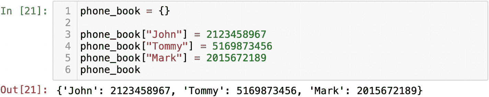

图 2-18

Python 字典

如果你想获取一个值，只需要提供键即可。要得到 Tommy 的电话号码，我需要把他的名字作为键传入（图 2-19）：

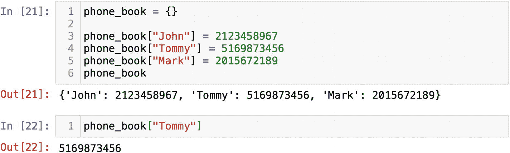

图 2-19

通过键获取值

```
phone_book["Tommy"]
```

与列表结构相比，字典的速度更快。我们从字典中获取一个值只需要一次操作。如果将电话号码存储在列表中，则需要遍历才能找到 Tommy 的号码。迭代需要多次操作，无论如何都比一次操作花费的时间更长。

字典的另一个特点是易于重新赋值。假设 Tommy 换了电话号码，我们可以用新值替换旧值（图 2-17）：

```
phone_book["Tommy"] = 2016546765
```

值的修改次数没有限制。易于重新赋值的特性使字典成为存储股票价格的完美结构。股票代码是键，价格是值，可以多次更改。同样，字典也用于计数。每次出现某个键时，其对应的值都会更新。在本章末尾，我们将使用字典统计一个文本文件中每个单词出现的次数。

由于字典是无序的集合，且可能包含数千个元素，如何找到所有的键呢？一如既往，我们从`dir()`函数开始。如果在`dict`或我们这里的`phone_book`上运行`dir()`，就会找到字典支持的方法。我们要找的方法是`keys()`。

`keys()`属性可以获取字典中的所有键。如果你是第一次接触字典，可以先试试`keys()`。这个命令会返回一个有序数组，包含字典中的所有键（图 2-20）：

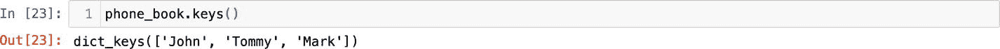

图 2-20

`keys()`方法返回字典中的所有键

```
phone_book.keys()
```

与`keys()`方法相对的是`values()`。`values()`会将字典中的所有值以列表的形式返回（图 2-21）：

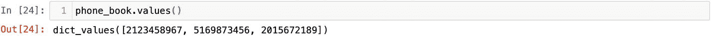

图 2-21

`values()`方法返回字典中的所有值

```
phone_book.values()
```

对我们来说，值的信息量较少，因为我们不知道它们对应的是什么。另一方面，如果我们假设字典存储了纽约证券交易所的所有股票，那么通过值，我们可以了解有多少家公司上涨或下跌。

`items()`方法会将字典转换为一个元组列表。每个键值对都将以元组结构呈现（图 2-22）。

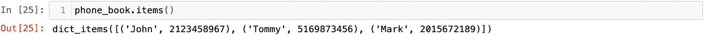

图 2-22

`items()`方法以元组形式返回字典中的所有键值对

```
phone_book.items()
```

`items()`方法在我们需要将字典转换为列表时会很有用。字典不是有序结构，因此要按值对字典进行排序，就需要一个列表。列表自然是可以排序的。你将在本章后面的示例中看到实际应用。

`get()`方法，你可能已经猜到，用于根据键获取值。这个方法与字典的方括号表示法`phone_book["Tommy"]`的主要区别在于，如果找不到键，`get()`会返回一个默认值。如果用户试图获取 Mary 的电话号码，而字典中没有 Mary，那么`get()`将返回`"Not Found"`：

```
phone_book.get("Mary", "Not Found")
```

与返回错误消息相比，返回一个默认值是一种更优雅的方式（图 2-23）。

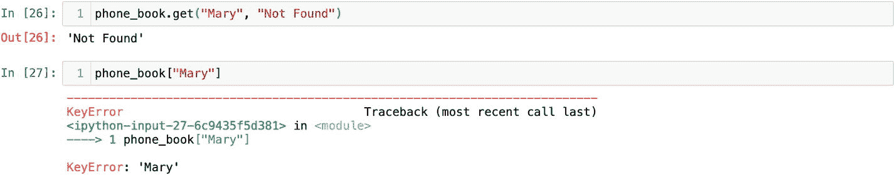

图 2-23

如果字典中不存在某个键，`get()`方法会返回一个默认值

到现在，你可能会问，能否用`for`循环遍历字典？我的方法是，如果你不确定或不知道某件事，那就试试看。至少你能从错误信息中了解操作失败的原因。事实上，你完全可以循环遍历字典。

遍历字典有几种方法。第一种很直接：

```
for i in phone_book:
    print(i)
```

这种方法会从字典中获取所有键。通过键，你可以获取对应的值：

```
for i in phone_book:
    print(i, phone_book[i])
```

另一种遍历技术需要使用`items()`方法：

```
for i in phone_book.items():
    print(i)
```

如你所见，变量`i`代表一个元组。`items()`方法已将`phone_book`转换为一个元组列表。从技术上讲，在应用`items()`之后，我们遍历的是一个元组列表。每个元组包含两个值，它们分别是原来的键和值。要提取键和值，我们需要解包这个元组。一种方法是通过索引来获取键和值：

```
for i in phone_book.items():
    print(i[0], i[1])
```

然而，我们可以为元组中的第一个和第二个元素分配变量：

```
key, value = ("John", 2123458967)
```

如果我们采用这种逻辑，那么`for`循环就需要两个变量，看起来像这样：

```
for key, value in phone_book.items():
    print(key, value)
```

在图 2-24 中，你可以看到这两种解决方案产生的结果相同。最终使用哪种技术由你决定。

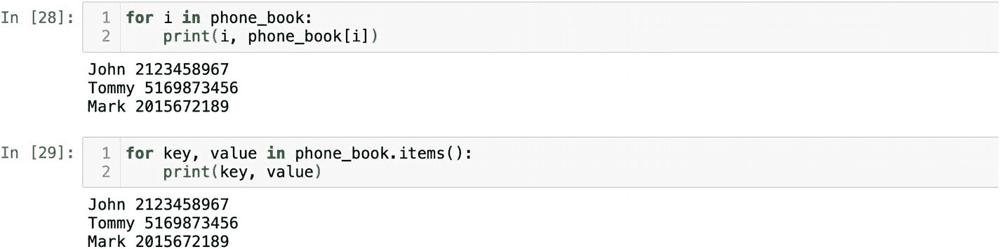

图 2-24

使用`for`循环遍历字典

一个简单的练习可以总结如何从字典中获取值以及添加新的键和值。

假设我们有一个餐厅的菜单，以字典形式存储如下：

```
menu = {"Burger": 3.75, "Soda": 0.99, "Nachos": 2.99, "Shake": 1.25}
```

使用输入函数，我们将询问用户两个菜单项：

```
item_one = input("你要点什么？")
item_two = input("你还要什么？")
```

获取到想要的菜品后，我们可以使用它们作为键从字典中获取价格：

```
price_one = menu[item_one]
price_two = menu[item_two]
```

最后，我们将计算并打印总数：

```
total = price_one + price_two
print("Your total is ${}".format(total))
```

练习的下一部分演示了如何用键和值填充一个新的字典。继续以餐厅为例，我们决定将所有商品降价 10%，并将新价格存入另一个名为 `sale` 的字典中。我们需要初始化一个新字典：

```
sale = {}
```

在遍历 `menu` 时，我们将每个值减少 10%，同时将食品和新价格添加到 `sale` 字典中。内置函数 `round` 会将小数部分四舍五入到 2 位：

```
for food, price in menu.items():
    sale[food] = round(price * 0.9, 2)
```

遍历完菜单并降低所有价格后，我们的新字典 `sale` 将如下所示：

```
{'Burger': 3.38, 'Soda': 0.89, 'Nachos': 2.69, 'Shake': 1.12}
```

## 将信息写入文本文件

正如我们之前讨论过的，Python 在 RAM（短期内存）中运行，而文件存储在硬盘或云端（长期内存）中。内置函数 `open()` 用于从文件读取数据以及将数据写入文件。`open()` 返回一个 Python 对象。请记住，你并非直接操作存储在硬盘上的文件，而是操作一个对象。函数 `open()` 接受关键字参数。我们可以看一下打开文件所需的主要参数。首先，你需要提供文件名和文件路径。其次是模式（mode）。模式指定了你对文件的意图。默认值是 `mode='r'`。字符串 `'r'` 代表读取（read）。如果你的意图是从文件中获取信息，应该保持该默认值。若要向文件写入数据，则需要将模式改为 `'w'`。每次运行代码时，`open()` 函数都会创建一个新文件。另一个关键字参数是 `encoding`。对于 Mac 用户来说，它是可选的，因为默认情况下它会以 UTF-8 格式对文件进行编码或解码。还记得在第一章中，我们讨论过计算机如何存储字符串。简而言之，文本文件就是一个字符串。UTF-8 是目前最流行的文本编码系统。如果你好奇 UTF-8 编码具体是如何工作的，并想查看字符及对应数字的表格，可以在维基百科（`https://en.wikipedia.org/wiki/UTF-8`）上找到。Windows 系统可能需要 `encoding="utf8"` 参数来对文件进行编码：

```
obj = open("myfile.txt", "w", encoding="utf8")
```

`obj` 持有由 `open()` 函数生成的对象。打印它，你会看到：

```
这意味着我们已经成功创建了 `myfile.txt`。你可以在你的计算机上查找这个新文件。在你存放 `Jupyter` Notebook 的同一目录中，使用查找或搜索功能找到它。在任意文本编辑器中打开 `myfile.txt` 文件。该文件是空的，我们还没有向其中写入任何内容。

写入模式有点棘手。如果你再次运行 `open()` 函数，`"w"` 模式会删除现有的 `myfile.txt` 文件，并创建一个同名的新文件。请记住，如果你的计算机上之前就有 `myfile.txt` 且包含一些现有信息，那么这些信息将会丢失。

现在我们已经有了一个文件，可以向其中写入一些内容了。同样，我们将操作 Python 对象。在 `obj` 上运行 `dir()`，你会看到所有读写方法。要向 `obj` 添加一个字符串，我们使用 `write()` 命令。完成后，使用 `close()` 命令将其保存到文件中。

我们需要一个字符串来写入文件；确保你所有的代码都在同一个单元格中：

```
string_one = "This pizza is delicious!"

obj = open("myfile.txt", "w", encoding="utf8")

obj.write(string_one)

obj.close()
```

`close()` 方法将对象保存为一个文件。它的工作方式类似于 Microsoft Word 中的保存按钮。在你点击“保存”按钮之前，文本是不会被保存的。如果发生断电，屏幕上已有的数据未保存，你可能会丢失这些数据。

运行完所有这些命令后，刷新 `myfile.txt` 文件。文件中应该包含 `"This pizza is delicious!"`（图 2-25）。

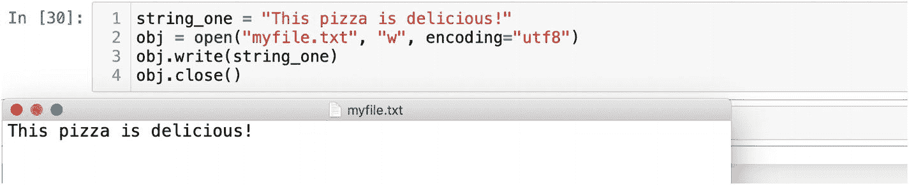

图 2-25
在文本文件中写入信息

与写入模式相比，追加模式（append mode）会将字符串添加到现有文件中。如果你已有文件并希望写入附加数据，可以将关键字参数 mode 中的 `"w"` 替换为 `"a"`。我们需要另一个字符串来追加到 `myfile.txt` 中。在 Python 中，`"\n"` 符号表示换行。它会使短语在新的一行开始：

```
string_two = "I love pepperoni pizza!"

obj = open("myfile.txt", "a", encoding="utf8")

obj.write("\n"+string_two)

obj.close()
```

每次运行这段代码，它都会将 `"I love pepperoni pizza!"` 追加到 `myfile.txt` 中（图 2-26）。

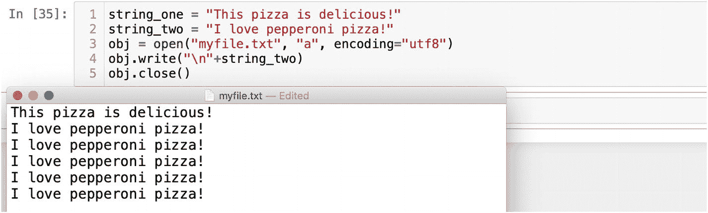

**图 2-26** 追加模式将信息写入文本文件

总而言之，我们来做一个简单的例子。假设我们有一个包含股票价格的字典，需要将它们存储到一个文本文件中：

```
portfolio={"IBM":111.90,"AAPL":155.53,"MSFT":216.39}

obj = open("dummydata.txt", "w", encoding="utf8")

for key, value in portfolio.items():

obj.write("Stock {} Price{}\n".format(key,value))

obj.close()
```

这里，我使用了 `"w"` 模式，因为我们只是将数据写入 `dummydata.txt` 文件。`for` 循环遍历字典并提取键和值。请注意，`format()` 方法将价格（浮点数值）转换为字符串。文本文件格式只接受字符串数据类型（图 2-27）。

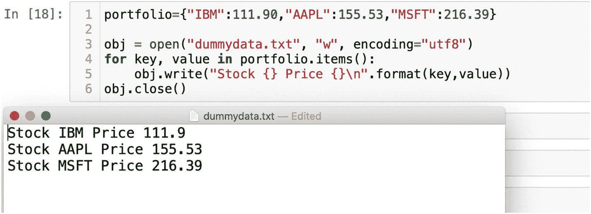

**图 2-27** 将字典中的信息写入文本文件

## 从文本文件中读取信息

从文件中读取数据类似于写入文件。我们只需以默认的读取模式使用 `open()` 函数即可。某些 Windows 系统可能要求你在文件路径前添加一个小写的 `r`。此外，如果文件与 Python 脚本不在同一目录下，请确保你的文件路径是正确的，否则你会遇到 `FileNotFoundError`。

```
obj = open(r"dummydata.txt", "r", encoding="utf8")

obj.read()
```

方法 `read()` 将 `obj` 解析为一个字符串（图 2-28）。不必担心 `\n` 符号。Python 表示这些字符是换行分隔的。

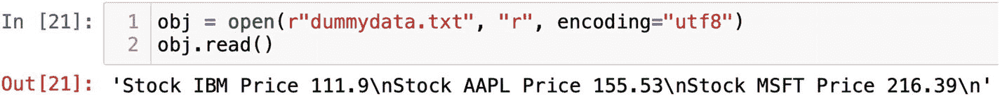

**图 2-28** 从文本文件中读取信息

事实上，我们可以使用 `\n` 将字符串分割成一个列表。将 `obj.read()` 赋值给一个新变量。有一个字符串方法 `split()`。关于 `split()` 你需要记住的一点是，它总是返回一个列表数据结构。默认情况下，`split()` 会按空格分隔字符串。相反，你可以传入一个关键字或字符作为分隔依据。在我们的例子中，我们将传入 `\n` 作为参数：

```
obj = open(r"dummydata.txt", "r", encoding="utf8")

data = obj.read().split("\n")
```

在 `split()` 之后，变量 `data` 保存了由逗号分隔的字符串列表。列表是一种多用途的数据结构，我们可以继续进行数据分析（图 2-29）。

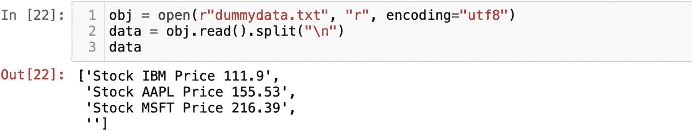

**图 2-29** 解析文本文件中的信息

为了总结本章所学的全部内容，我们将进行一个实际示例。找任何一个你手头的文本文件，或者你可以按照我的步骤使用我上传到网上的文件。如果你决定使用自己的文件，你可以像之前的例子一样使用 `open()` 函数。从服务器读取文件需要使用 Python 内置模块 `urllib`。`urllib` 是一个包含多个用于处理 URL（统一资源定位符）的模块的包。`urllib` 的原理非常简单。它向服务器发送请求，并使用 `urlopen()` 函数获取信息。我的文本文件位于：[`https://bit.ly/text-file`](https://bit.ly/text-file)。保持代码干净整洁是个好主意。我的建议是每项任务都创建一个新文件。

由于 `urllib` 是一个包，我们需要先导入它。在本书的课程中，我们将使用许多不同的库包。库是函数的集合。简单来说，就是第三方代码。在文件开头导入库非常重要。你不希望将第三方代码塞入脚本中间。这就是为什么即使你一开始忘记了导入某个库，也要回去并在第一个单元格中导入它。

```python
from urllib.request import urlopen
```

从云端读取文本需要使用 `urlopen()` 函数。我们从服务器收到的信息将存储为一个对象。该对象可以使用 `read()` 方法进行解析。对于来自在线来源的文本，`read()` 将返回带有前缀 `'b'` 的字节字面值。我们可以使用 `str()` 函数确保它是常规字符串（图 2-30）：

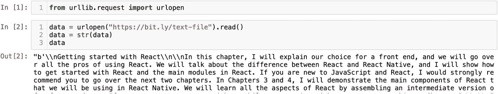

**图 2-30** 解析远程文本文件中的信息

```python
data = urlopen("https://bit.ly/text-file")
data = str(data)
```

目前，我们的数据表示为一个简单的字符串。我们的目标是找出文本中出现频率最高的十个单词。

逻辑上讲，我们可以使用字典数据结构。每个单词都是一个键，单词在文本中出现的次数是值。听起来不错。但在那之前，我们需要将所有单词转换为小写。对于 Python 来说，首字母大写的“The”和首字母小写的“the”是不同的字符串。此外，我们需要将大字符串按空白字符分割成单词：

```python
data = urlopen("https://bit.ly/text-file")
data = str(data).lower()
data = data.split()
```

在 `split()` 之后，`data` 变量包含一个单词列表。我们需要一个字典来累加每个单词的出现次数。我将用变量 `d` 初始化一个字典：

```python
d = {}
```

我们可以遍历单词列表。如果一个单词已在字典中，我们就将值增加一。否则，我们将该单词添加到字典 `d` 中，并将其值设置为 `1`：

```python
for word in data:
    if word in d:
        d[word] = d[word] + 1
    else:
        d[word] = 1
```

在图 2-31 中，你可以看到这个字典已经填满了单词。

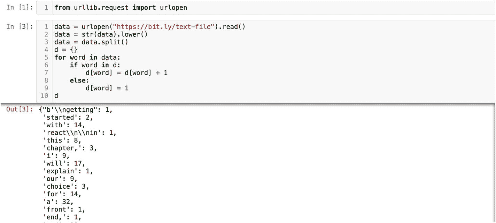

**图 2-31** 字典 `d` 将单词作为键，每个单词在文本中出现的次数作为值

接下来我们要做的就是按值对这些单词进行排序。我们不能直接对字典进行排序，所以需要将其转换为元组列表（图 2-32）：

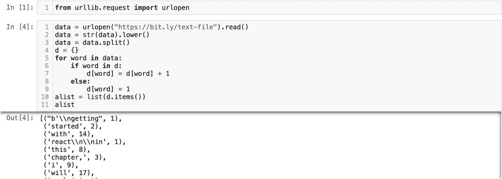

**图 2-32** 我们已将字典转换为元组列表

```python
alist = list(d.items())
```

在我们对元组列表进行排序之前，我想解释一下 `sort()` 方法的机制。`help()` 函数会显示 `sort()` 的所有关键字参数：

```python
help(list.sort)
```

有两个参数，`key=None` 和 `reverse=False`。`reverse` 简单地表示你希望如何排序列表，升序还是降序。默认情况下，它被设置为 `False`，因为人们更喜欢按升序排列所有内容。我们需要将 `reverse` 切换为 `True`，因为我们关心的是最大值。

`key` 参数稍微复杂一些。让我解释一下我的意思。假设我们有一个普通的数字列表。方法 `sort()` 会通过比较数值进行升序排序：

```python
plain_list = [ 9,  5,  7,  4,  8,  3]
plain_list.sort()
[3, 4, 5, 7, 8, 9]
```

为了说明我们的情况，我将取列表的一个样本并应用相同的 `sort()` 方法：

```python
my_list = [('will', 17),('explain', 1),('choice', 3),('a', 32)]
my_list.sort()
[('a', 32), ('choice', 3), ('explain', 1), ('will', 17)]
```

你可以看到列表已排序，但按字母顺序排列。Python 知道字母的顺序。`sort()` 方法假设元组中的第一个元素是重要的。默认情况下，它通过第一个元素对所有元组进行排序。我们希望按每个元组中的第二个元素对列表进行排序。如果我们获取元组的第二个元素并将其用作 `sort()` 方法中的键，就可以实现这一点。第一步是获取一个元素：

```python
t =('a', 32)
t[1]
```

我们需要对列表中的每个元组执行此操作。听起来像是重复。我们需要将此语句封装成一个函数。我将此函数命名为 `get_value`：

```python
def get_value(t):
    return t[1]
```

`sort()` 的定义说明，如果给定了键函数，它将被应用于列表中的所有项。第二步是使用 `get_value` 作为键：

```python
alist.sort(key=get_value, reverse=True)
```

在图 2-33 中，你可以看到列表按值最高的单词排序。我们可以对列表进行切片，以获取文件中前十个最频繁出现的单词。

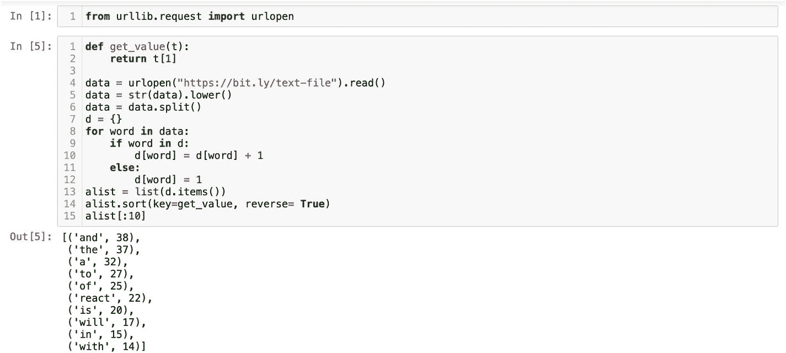

图 2-33 查找文本中出现频率最高的十个单词

有人可能会问，除了定义一个函数来索引元组中的元素之外，有没有更好的方法来获取键？答案是肯定的；`lambda` 将是一个优雅的解决方案。我们将在下一章介绍 `lambda`。之后，你可以回到这个问题，并用 `lambda` 替换 `get_value`。我相信前两章已经为理解 Python 如何工作打下了坚实的基础。你可以将这些章节视为 Python 编程的入门。我们已经涵盖了从内置数据类型和函数到控制流语句的所有基本主题。到目前为止，你应该已经打下了解决高级 Python 主题和处理复杂问题的基础。

## 3. 使用 Pandas 进行数据分析

现代生活的挑战需要快速的解决方案。如今，我们需要实时评估大量信息。Python 很快，但如果你需要更快，还有 Pandas。Pandas 是用于加速数据处理的 Python 核心库。它最初是为华尔街专业人士开发的，但很快在从事数值计算、大数据分析以及希望从电子表格转向功能强大且更高效的 Python 编程语言的人群中流行开来。名称 `Pandas` 代表面板数据（Panel Data）。面板数据是计量经济学中用于多维数据集的术语。`Pandas` 有许多有用的函数，可以使数据分析过程更加高效。

`Pandas` 提供了两种复杂的数据结构：`Series` 和 `DataFrame`。我喜欢用车辆来类比数据结构。假设 Python 列表是一辆简单可靠、能带你从 A 点到 B 点的汽车，那么 `Series` 就是一辆快速的赛车。普通汽车需要定期更换机油和汽油，而赛车则需要高级润滑油和特殊保养。在本章中，我们将介绍 `Pandas` 的所有主要功能，例如过滤、逻辑运算、连接和合并数据集，并学习如何使用它们。

### Series

在开始定义 `Series` 并编写代码之前，我们需要导入 `Pandas`。

由于 `Pandas` 是一个第三方库，每次在文件开头想要使用它时，都需要导入它：

```python
import pandas as pd
```

变量 `pd` 用作快捷方式。`pd` 包含了所有 `Pandas` 函数，你可以通过键盘上的 Tab 键查看所有函数。在一个新单元格中，输入 `pd.` 并按 Tab 键（图 3-1）。不要忘记 `pd` 后面的点。根据我的经验，尤其是在 Windows 系统上，可能需要一些时间才能看到包含所有函数的下拉菜单。在 `Jupyter` 中，Tab 键可用作自动补全工具。

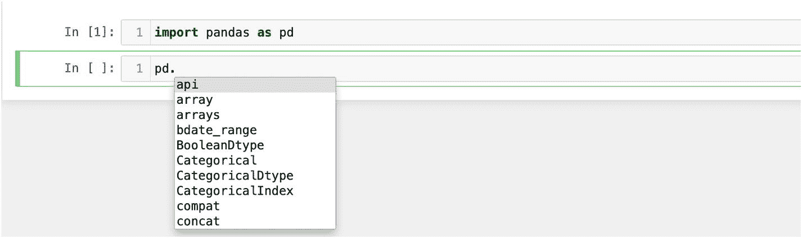

图 3-1 输入 `pd` 并按 Tab 键查看 `Pandas` 函数

`Series` 是一种一维数据结构。我们之前见过序列结构，但这一次有所不同。如果你运行以下代码，可以看到 `Series` 的正式定义：

```python
help(pd.Series)
```

它显示“带有轴标签的一维 ndarray”。^(⁴) 为了理解这个定义并领略 `Series` 的所有特性，我们需要创建一个。

我们将从一个列表开始，然后将其转换为 `Series`，以观察两种数据结构之间的差异。定义一个简单的 Python 列表 `alist`，其中包含一些数字：

```python
alist = [ 100, 200, 300, 400, 500 ]
```

使用 `pd.Series()` 函数，将列表转换为 `Series`：

```python
ser = pd.Series(alist)
```

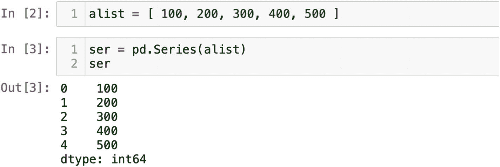

图 3-2 Pandas Series

在图 3-2 中，我们可以看到 `Pandas Series`，这是一种一维数据结构，或者简单地说是容器。`Series` 的左侧是索引。索引是默认提供的。索引的概念借鉴自关系数据库。在关系数据库中，每条记录都有一个主键。主键是唯一的标识符。使用键，你可以获取一个值。`Series` 使用了相同的方法。但是，在 `Series` 中，作为连接数据集的结果，你可能会得到重复值。当我们学到连接操作时，会讨论这一点，并解释如何处理重叠的索引值。在此期间，我们可以通过索引来获取值：

```python
ser[1]
```

`ser[1]` 操作将得到 `200`。使用切片表示法，我们可以获取几个值：

```python
ser[1:3]
```

结果，我们得到 `200` 和 `300`。与 Python 切片表示法一样，结束索引被排除在外。

`Series` 底部总是带有 `dtype`，即值的数据类型标识符。与列表相比，`Series` 是同质的，只能保存相同数据类型的值。值的同质性使得 `Series` 比列表更快。我们可以执行一个简单的测试来说明同质性。将 `ser` Series 中的第一个元素替换为浮点数：

```python
ser[0] = 1000.1234
```

浮点数 `1000.1234` 被转换为整数，然后才被 `dtype: int64` 的 `Series` 接受（图 3-3）。这意味着所有值必须具有相同的数据类型。如果由于某种原因无法将值转换为整数，那么 `Series` 会将所有值转换为浮点数，或者引发错误。

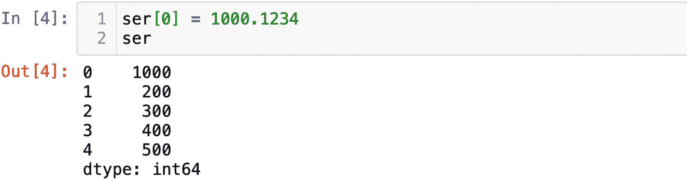

图 3-3 Series 始终是同质的

`Series` 有两个主要属性：`index` 和 `values`。尝试 `ser.index`，它将返回 `RangeIndex(start=0, stop=5, step=1)`，意味着有五个元素。索引的格式让人想起 `range()` 函数。我们在前一章中使用过它。`ser.values` 语句将揭示值存储为 NumPy 数组，即 `array([1000, 200, 300, 400, 500])`。NumPy 是 Python 中另一个用于科学计算的核心库。虽然 NumPy 包超出了本书的范围，但我们将会提及它。`Pandas` 的数据结构构建在 NumPy 数组之上，并且它们共享相似的行为。因此，我们可以借用 NumPy 中的函数并将其应用于 `Pandas` 对象。

`Series` 的一个主要优点是我们可以对整个结构（而不是其元素）执行操作。这种行为被称为向量化。向量化也是从 NumPy 继承而来的。这种行为使得 `Series` 比 Python 列表更快、更高效。例如，如果我们需要将 `alist` 中的所有项除以 2，那么我们必须使用 `for` 循环：

```python
for item in alist:
    newitem = item / 2
```

然而，如果所有值都存储在一个 `Series` 中，我们就可以将数学运算应用于整个容器（图 3-4）。

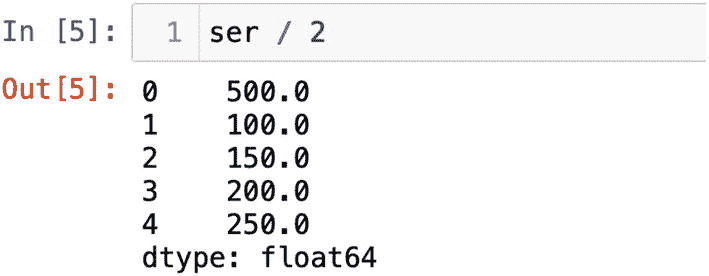

图 3-4 向量化将运算应用于 `Series`

这正是我将 `Series` 比作赛车的含义。任何 `for` 循环操作都比向量化操作花费更长的时间。因此，你**不**应该使用 `for` 循环来遍历一个 `Series`。首先，这会使操作运行得更慢；其次，完全没有这个必要。

另一个证明效率的例子是两个 `Series` 对象之间的向量化操作——一个简单的市盈率计算。如果我们将所有股票价格和每股收益分别存储在两个 `Series` 中，而不是列表中，那么股票市价除以每股收益的计算会更快。

存储在名为 `portfolio` 的 `Series` 中的随机股票价格：

```python
portfolio = pd.Series([30,20,45,76,34])
```

将除以同样存储在 `Series` 容器中的同一公司的每股收益：

```python
earnings = pd.Series([1.5,3.3,4.5,2.5,2.75])
```

最终结果可以保存为一个名为 `pe` 的新 `Series`（图 3-5）：

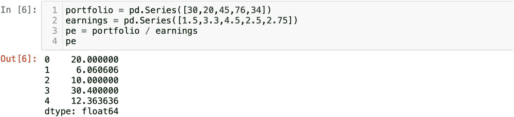

图 3-5 两个 `Series` 对象之间的除法运算

```python
pe = portfolio / earnings
```

如果我们把表达式传入 `round()` 函数中，可以将市盈率示例的结果**四舍五入**到小数点后精确的两位：

```
pe = round(portfolio / earnings, 2)
```

正如我刚才提到的，一个 `Series` 有两个属性：`index` 和 `values`。这让我们想起了字典结构中的键和值。从某种意义上说，`Series` 非常接近字典。创建新 `Series` 最简单的方法是将 Python 字典转换为 Pandas `Series`（图 3-6）。

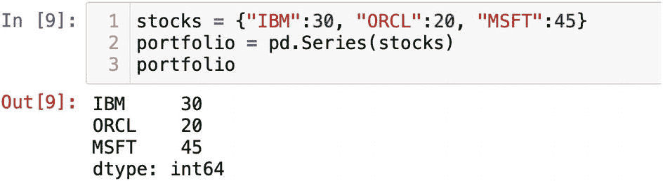

图 3-6  
将 Python 字典转换为 `Series` 结构

```
stocks = {"IBM":30, "ORCL":20, "MSFT":45}
portfolio = pd.Series(stocks)
```

字典中的键被用作 `Series` 中的索引（图 3-7）。你可以将 Pandas `Series` 视为 Python 字典的一种特化形式。

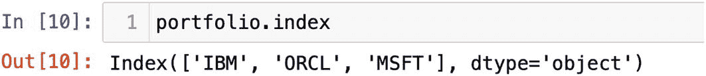

图 3-7  
字典中的字符串键是 `Series` 中的索引

通过在 `Series` 上使用字典表示法，我们可以向 `portfolio` 对象追加更多值。要添加一个元素，我们需要一个新的键值对。尝试使用以下代码向 `portfolio` Series 中添加更多股票：

```
portfolio["AAPL"] = 76
portfolio["INTC"] = 34
```

作为该操作的结果，`portfolio` 对象被附加了两个值（图 3-8）。

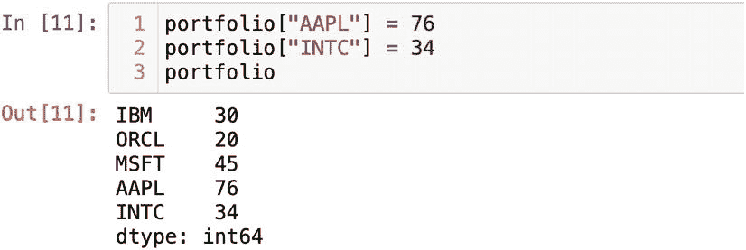

图 3-8  
使用字典表示法，我们可以向 `Series` 添加值

我们已经了解到，`Series` 是 Pandas 中的一种一维数据结构。现在让我们看看，如果将几个 `Series` 连接在一起会得到什么。

# DataFrame

`DataFrame` 是一种二维数据结构。你可以将其视为一组绑定在一起的 `Series`。创建 `DataFrame` 有多种方法，我将在本书的后续内容中逐一展示。我想从一个最简单的例子开始，即如何从头构建一个 `DataFrame`。我们将使用 Pandas 函数 `pd.DataFrame()` 初始化一个 `DataFrame`，并将其保存在 `portfolio` 变量名下。

### 构建 DataFrame

为了保持代码整洁，请将每个示例放在一个独立的 **Jupyter** Notebook 文件中。在文件开头的一个独立单元格中，我们需要导入 Pandas：

```
import pandas as pd
```

在一个新单元格中，借助 Pandas 的 `DataFrame()` 函数将 `portfolio` 变量定义为一个 `DataFrame`：

```
portfolio  = pd.DataFrame()
```

如果你打印 `portfolio` 对象，你什么也看不到，因为它是空的。我们需要用数据填充我们的容器。最直接的方法是定义几个 `Series` 并将它们附加到 `portfolio` 对象上。同样，我在所有示例中都使用随机数作为值。

```
stock_symbols = pd.Series(["IBM","ORCL","MSFT", "AAPL"])
stock_prices = pd.Series([116.86, 56.91, 216.51, 119.26])
number_shares = pd.Series([50, 100, 50, 100])
```

我们需要为列命名，并使用字典表示法将它们与值一起添加到 `DataFrame` 中：

```
portfolio["Symbol"] = stock_symbols
portfolio["Price"] = stock_prices
portfolio["Qty"] = number_shares
```

在图 3-9 中，你可以看到我们从头创建的 `DataFrame`。

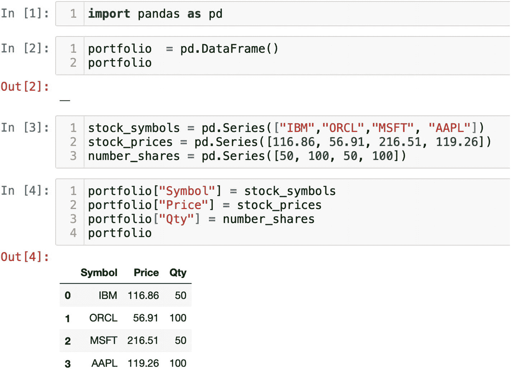

图 3-9  
从头创建 `DataFrame`

将 `DataFrame` 分解成更小的部分，你会发现它由 `index`、`columns` 和 `values` 属性组成（图 3-10）：

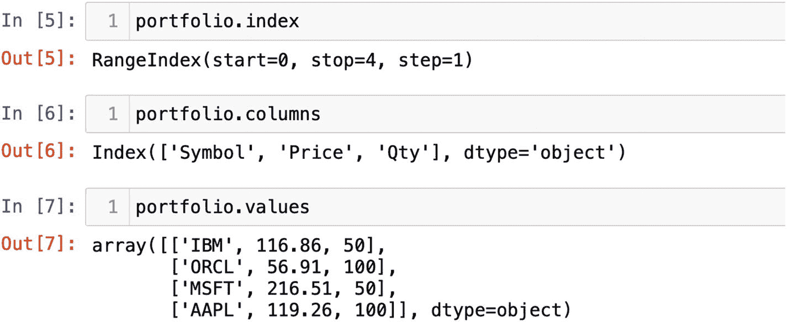

图 3-10  
`DataFrame` 有三个属性：`index`、`columns` 和 `values`

```
portfolio.index
portfolio.columns
portfolio.values
```

我们使用了字典表示法来向 `DataFrame` 添加列。这使得 `DataFrame` 成为了 Python 字典的一种特化形式。

### 切片 DataFrame

使用同样的方法，我们可以对 `DataFrame` 进行切片以获取一列：

```
portfolio["Price"]
```

将列名作为字符串传入方括号中，就像我们从 Python 字典中根据键获取值一样，它将只返回一列（图 3-11）。返回的列是一个 `Series` 对象。

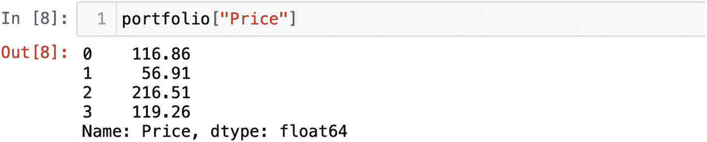

图 3-11  
切片 `DataFrame` 的一列

使用列作为键的方括号方法允许我们分割列或创建新列。此外，当列名包含空格时，这个方法至关重要。如果你从头创建 `DataFrame`，我建议你避免在列名中使用空格，当你使用两个或更多单词作为列名时尤其如此。然而，有时你不得不处理由其他人创建的、列名中包含分隔单词的数据。在这种情况下，`["a column name"]` 将是你能获取该列的唯一方法。

一如既往，要查看 `DataFrame` 中所有内置的属性和方法，可以在 `portfolio` 对象上运行 `dir()` 函数。我们可以看到 `Symbol`、`Price` 和 `Qty` 是我们 `DataFrame` 的属性。这意味着我们可以像这样切片 `Price` 列：

```
portfolio.Price
```

请记住，将列作为属性进行切片的方法（图 3-12）无法帮助你获取多个列。

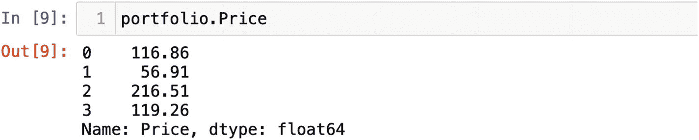

图 3-12  
将 `DataFrame` 的一列作为属性进行切片

我们需要将列名作为一个列表传入方括号中，才能获取多列（图 3-13）：

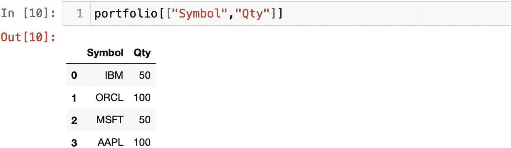

图 3-13  
切片 `DataFrame` 的多列

```
portfolio[ ["Symbol","Qty"] ]
```

如前所述，方括号表示法和名称会创建一个新列。如果我们还没有合适的列值该怎么办？这不成问题。我们可以用`0`或空字符串作为占位符来创建一个空列，以便稍后添加值。例如，我们需要为投资组合中每只股票支付的价格创建一个列。我们将它命名为`Cost`，由于还没有实际数据，使用`" "`作为占位符：

```
portfolio["Cost"] = " "
```

该语句将创建一个空列，我们可以在之后使用（图 3-14）。

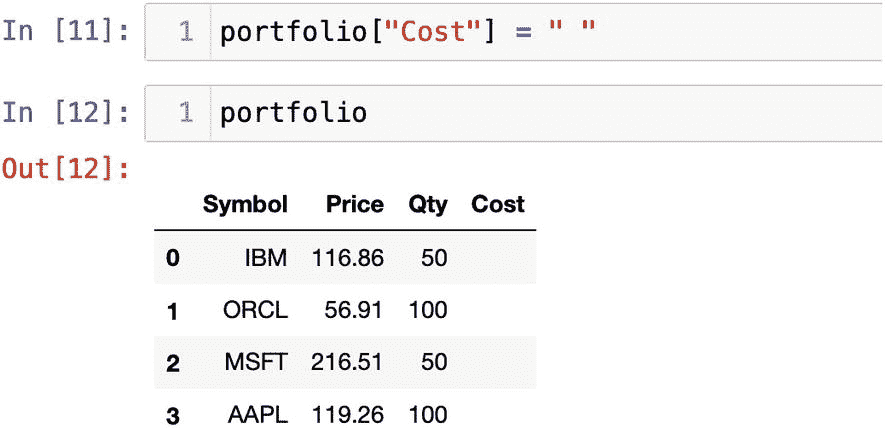

**图 3-14** 使用方括号表示法创建空列

请记住，我们始终可以重新分配同一列名下的值。我们只需要以一位结构存储的每股成本数据。之前我们使用过`Series`向`DataFrame`添加值；然而，`list`或`tuple`也能很好地完成同样的工作。大多数情况下，当从不同来源收集数据时，你会使用`list`作为临时结构来保存值。只需确保该结构的长度与`DataFrame`中的行数匹配。通过重新分配将值添加到`portfolio` `DataFrame`：

```python
portfolio["Cost"] = [115.25, 55.00, 210.30,105.75]
```

图 3-15 显示了更新值后的`Cost`列。

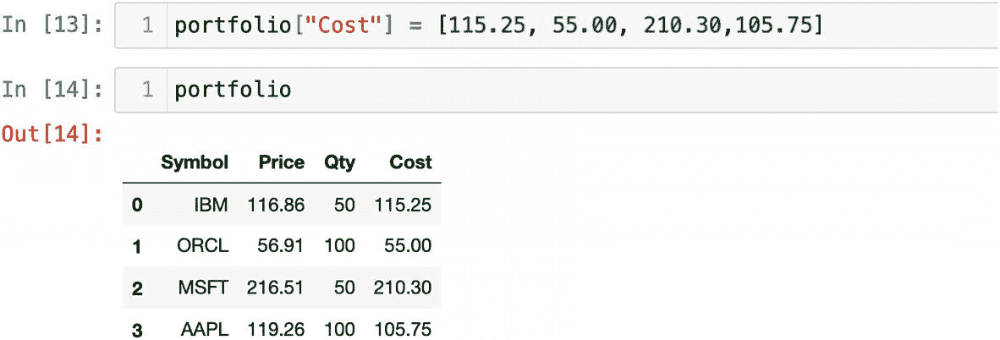

**图 3-15** 通过重新分配更新列中的值

在本章前面部分，我们曾在两个`Series`之间执行了向量化操作。由于每个列代表一个`Series`，我们可以在列之间进行向量化计算。每股价格乘以股票数量可以得到整个持仓的美元金额。我们可以将结果保存到一个名为`Amount`的新列中（图 3-16）：

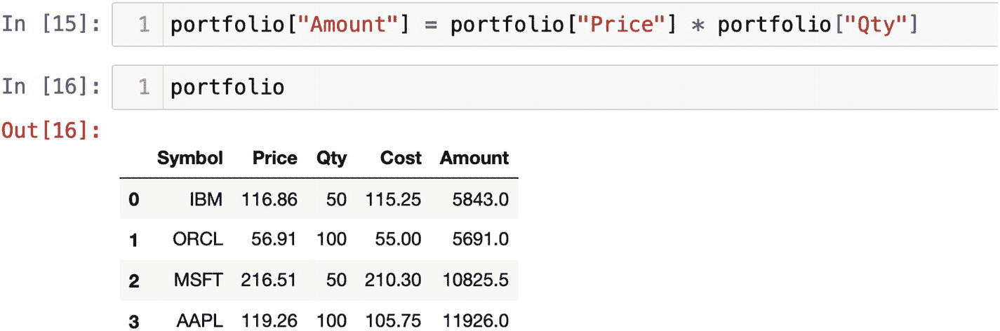

**图 3-16** 向量化操作以计算持仓的美元金额

```python
portfolio["Amount"] = portfolio["Price"] * portfolio["Qty"]
```

另一个类似操作的例子是计算每个持仓的利润或亏损。这次，我们将使用稍有不同的语法。我们将列名用作`DataFrame`的属性（图 3-17）。Python 遵循数学运算顺序，我们将使用圆括号先计算每股利润或亏损，然后将结果乘以股票数量：

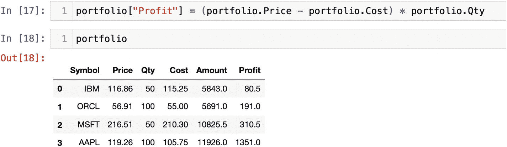

**图 3-17** 计算利润或亏损，将列作为`DataFrame`的属性获取

```python
portfolio["Profit"] = (portfolio.Price–portfolio.Cost)*portfolio.Qty
```

`DataFrame`默认带有索引。但我们始终可以重新分配索引。股票代码是唯一的，我们可以将它们用作索引。要使用列值作为索引，我们需要切片该列并将其分配为索引：

```python
portfolio.index = portfolio.Symbol
```

重新分配索引后，`portfolio` `DataFrame`的索引值与`Symbol`列中的值相同。为了区分索引和列，Pandas 会在列名的下一行打印索引名称（图 3-18）。

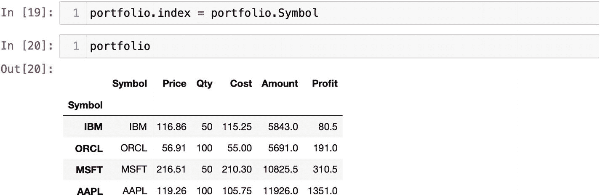

**图 3-18** 将索引重新分配为`Symbol`列的值

到目前为止，我们一直在向`DataFrame`添加新列。使用`drop()`方法，我们可以移除不需要的列。`DataFrame`的方法比我们之前在处理`list`或`tuple`时遇到的更复杂。我建议使用`help()`函数来验证方法可能需要的所有参数：

```python
help(portfolio.drop)
```

你可能已经注意到，Pandas 开发人员很好地提供了关于函数和方法的信息，并附有相关示例。`Drop()`方法接受以下关键字参数：

```python
drop(labels=None, axis=0, index=None, columns=None, level=None, inplace=False, errors='raise')
```

方法的参数各不相同。然而，有几个参数是所有 Pandas 方法通用的。我指的是`axis`和`inplace`。

一个`DataFrame`有两个轴——行和列（图 3-19）。`drop()`命令或任何其他`DataFrame`方法既可以应用于行，也可以应用于列。默认情况下，`axis`设置为`rows`或`0`。如果我们保持默认设置并尝试从`DataFrame`中删除`Symbol`列，将会收到错误——`"Symbol not found in axis"`。因为`drop()`方法默认会在索引值中查找`"Symbol"`名称。由于我们要删除一个列，需要将`drop()`方法的`axis`关键字切换为`"columns"`。Pandas 提供了两个选项，要么将关键字参数设置为`1`，要么直接设置为`"columns"`。

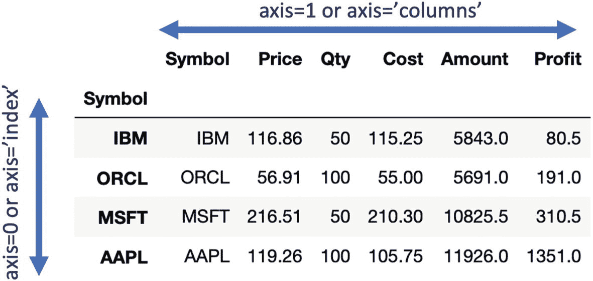

**图 3-19** 轴 0 或“index”指代行，轴 1 或“columns”指代列

然而，如果我们的意图是删除一行，比如“`IBM`”，那么我们应该保留`axis`不变，或者将`"index"`分配给`axis`。在使用`DataFrame`方法时，请牢记`axis`。
另一个在`DataFrame`方法中常见的参数是`inplace`。当我们应用`drop()`等方法从`DataFrame`中删除一列时，我们正在修改对象。对对象的更改应被保存。设置`inplace = True`将保存这些更改。参数`inplace`意味着对象在其内部被就地修改。因此，如果`inplace`设置为`True`，则无需将表达式赋值给变量来保存更改。
有两个选项：`True`或`False`。在某种程度上，你可以将其视为保存按钮。`drop()`方法会移除一个不需要的列，并通过`inplace = True`保存调整。有时，人们会意外跳过`inplace = True`这一步。`drop()`方法仍然会删除一列吗？答案是肯定的，但之后对象可能会出现问题。最佳实践是在应用方法并需要保留更改时，将`inplace`关键字参数设置为`True`。

好了，现在我们已经准备好从`DataFrame`中删除`Symbol`列：

```python
portfolio.drop(labels="Symbol", axis=1, inplace=True)
```

确保你在一个单独的单元格中运行`drop()`语句，并且只运行一次（图 3-20）。一个新手错误是重新运行单元格并收到警告消息`"not found in axis"`。如果你再次运行`drop()`命令，它将无法找到该列。该列已消失，不再属于该`DataFrame`。

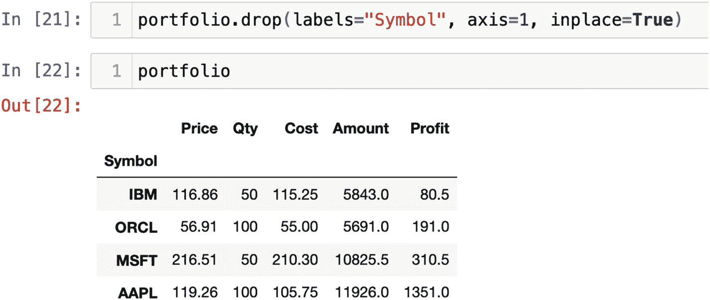

**图 3-20** `drop`方法移除了`Symbol`列

到目前为止，我们一直在操作`DataFrame`的列。行和值也可以像列一样进行切片。有两种方法可以检索一行或多行——`loc`和`iloc`。
`Loc`代表位置。`loc`方法需要标签，而`iloc`接受行的索引。显然，`i`在`iloc`方法名中表示索引。`loc`和`iloc`都会完成相同的工作。

假设我们需要从 `portfolio` DataFrame 中提取 `MSFT` 行。`MSFT` 是一个索引值的标签，其对应的底层索引值为 `2`。索引计数从 0 开始：`IBM` 是 `0`，`ORCL` 是 `1`，`MSFT` 是 `2`。如果我们要使用标签，那么 `loc` 语句应如下所示：

```python
portfolio.loc["MSFT"]
```

相应地，`iloc` 需要使用整数作为索引，通过以下语句可以得到相同的结果：

```python
portfolio.iloc[2]
```

与其他 DataFrame 方法相比，`loc` 和 `iloc` 使用的是方括号（图 3-21）。

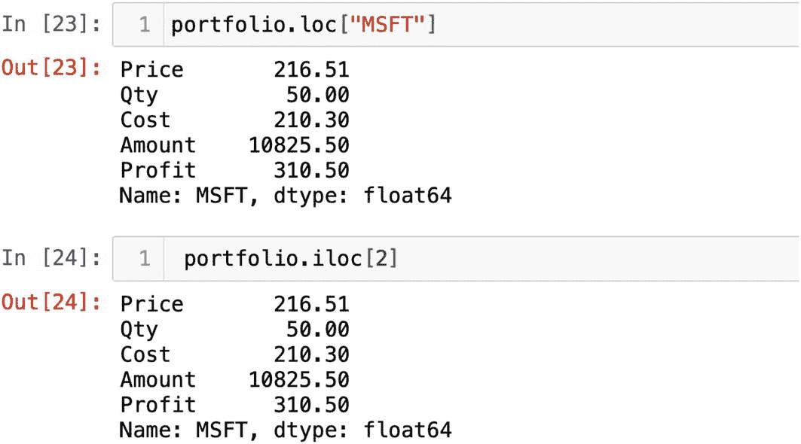

**图 3-21** `loc` 和 `iloc` 方法提取 `MSFT` 行

Python 的切片原则可以应用于带有 `loc` 和 `iloc` 方法的 DataFrame。唯一的区别是，使用标签的 `loc` 方法会包含停止位置，而 `iloc` 方法则排除停止索引。这就是为什么在提取 `ORCL` 和 `MSFT` 两行时，`loc` 变体需要将 `MSFT` 作为停止标签，而 `iloc` 表达式则需要为数值索引值指定一个上限（图 3-22）：

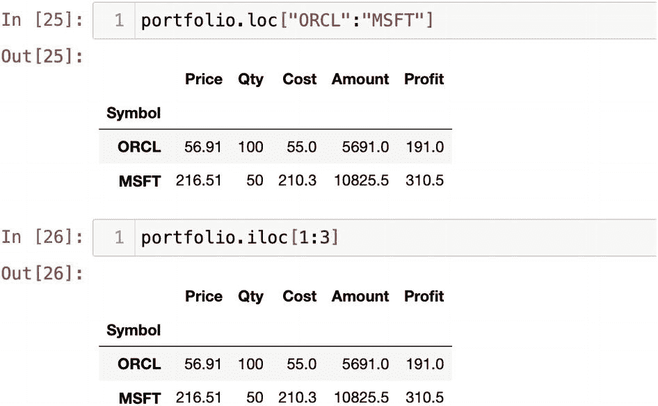

**图 3-22** 使用 `loc` 和 `iloc` 方法对行进行切片

```python
portfolio.loc["ORCL":"MSFT"]

portfolio.iloc[1:3]
```

在实际应用中，DataFrame 可能包含数千列，而你只需要获取部分数据。对 DataFrame 进行子集选择需要在行和列的索引之间用逗号分隔，并且行索引始终在前。`iloc` 方法类似于 Python 的切片语法：

```python
[start : stop : step , start : stop : step]
```

与 Python 一样，步长是可选的，默认值为 `1`。需要提醒的是，`loc` 方法接受的是索引和列的标签。

我们可以按以下方式获取 `ORCL` 和 `MSFT` 在 `Price` 和 `Qty` 列中的值：

```python
portfolio.loc["ORCL":"MSFT", "Price":"Qty"]

portfolio.iloc[1:3, 0:2]
```

在图 3-23 中，你可以看到这两种方法的结果相同。

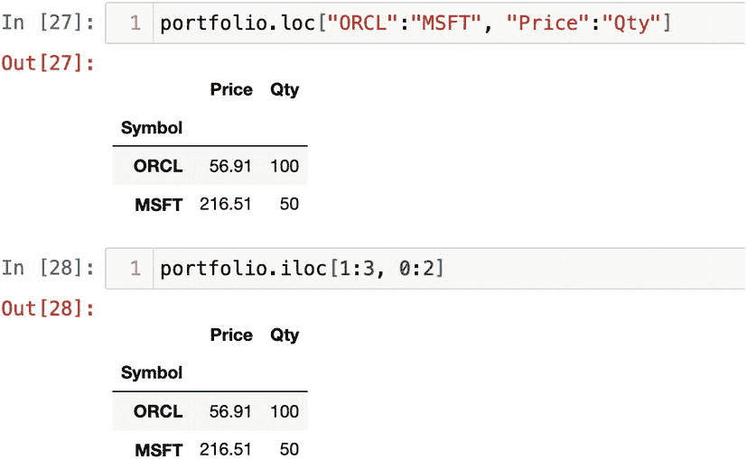

**图 3-23** 使用 `loc` 和 `iloc` 方法进行子集选择

另一种方案是先对列进行切片，然后再应用 `loc` 或 `iloc`。例如，要从 `Price` 和 `Profit` 列中获取 `MSFT` 和 `AAPL` 的值，相当于以下语句：

```python
portfolio[["Price", "Profit"]].loc["MSFT":"AAPL"]

portfolio[["Price", "Profit"]].iloc[2 : ]
```

在 `iloc` 方法中，我们留空停止索引，因为我们需要获取索引 2 之后的所有行（图 3-24）。

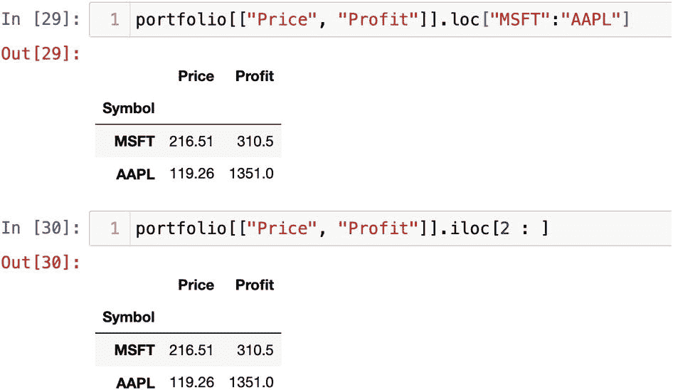

**图 3-24** 使用 `loc` 和 `iloc` 方法对列进行子集选择

### 过滤 DataFrame

在 Pandas 中，过滤过程比我们之前使用 `for` 循环和 `if` 语句的方法更高效。我们将从一个简单的例子开始。我们的目标是过滤 `portfolio` DataFrame，找出所有价格低于 100.00 美元的股票。

第一步是获取 `Price` 列，可以使用字典符号 `portfolio["Price"]` 或 `portfolio.Price`，然后定义一个条件：

```python
portfolio.Price < 100
```

如果运行此语句，它将返回布尔值（图 3-25）。

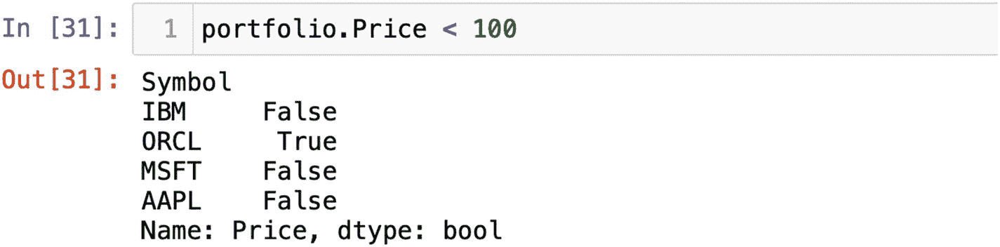

**图 3-25** 定义过滤条件

过滤器起作用了，但显然我们需要更多信息以及股票本身。一种方案是将过滤器应用于整个 DataFrame。这样会获取整行数据：

```python
portfolio[portfolio.Price < 100]
```

另一种方案是将条件应用于特定的一列或多列。具体来说，如果我们想查看持有价格低于 100 美元的股票数量，我们需要对 `Qty` 列进行切片并应用过滤器：

```python
portfolio.Qty[portfolio.Price < 100]
```

这是一个基于另一列过滤某一列的示例。如图 3-26 所示，第一个语句获取了整行，而第二个过滤器仅获取了一个值。

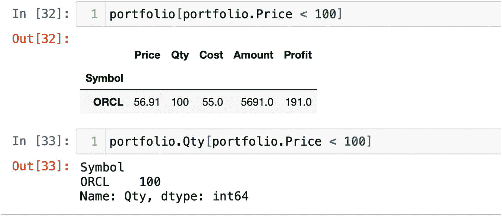

**图 3-26** 过滤 DataFrame

无需遍历值并使用 `if` 和 `else` 语句。此外，我们还可以像之前一样使用条件运算符组合条件。在 Pandas 中，`&`（与符号）相当于 Python 中的 `and` 运算符。当使用 `&` 时，两个条件都必须为 `True` 才能返回结果。假设我们需要找出 `portfolio` DataFrame 中所有价格低于 200 美元且股票数量恰好为 50 的股票。那么我们可以将两个条件组合为：

```python
(portfolio.Price < 200) & (portfolio.Qty == 50)
```

并将过滤器应用于 DataFrame：

```python
portfolio[(portfolio.Price < 200) & (portfolio.Qty == 50)]
```

请注意，每个条件都必须用圆括号括起来。显然，`portfolio` 中只有一个仓位完全满足这两个条件（图 3-27）。

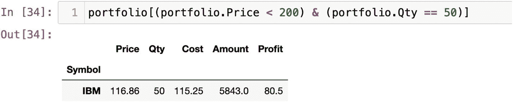

**图 3-27** 基于两个条件过滤 DataFrame

Pandas 中的另一个条件运算符是 `|`，读音类似“管道符”。它相当于 Python 中的 `or` 运算符，只要其中一个条件为 `True`，`|` 就会进行过滤。我们可以过滤 DataFrame，找出所有价格大于 200 美元或成本恰好为 55 美元的仓位。我们需要先用括号分别标出每个条件，然后使用 `|` 将它们应用于 `portfolio` 对象：

```python
portfolio[(portfolio.Price > 200) | (portfolio.Cost == 55)]
```

如图 3-28 所示，有两个仓位符合我们的过滤器——`ORCL`，因为其 `"Cost"` 值恰好为 55，以及 `MSFT`，其价格大于 200。

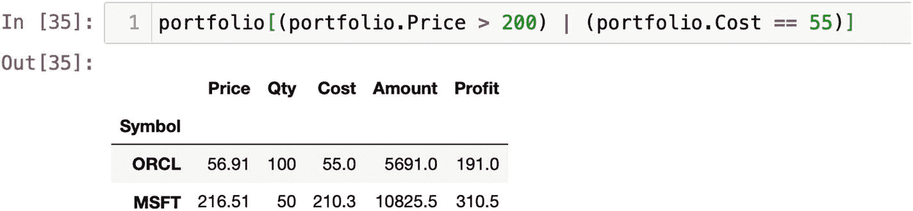

**图 3-28** 过滤 DataFrame 中满足任一条件的行

过滤非常有用，但如果你想根据条件对某个值执行操作，又该如何呢？

# Pandas 中的逻辑运算

当你需要根据某个条件采取行动时，就需要用到逻辑运算。如果一个条件为 `True`，则对数值进行相应操作。在 Pandas 中，有三种不同的方法可以执行逻辑运算。我最喜欢的是 `lambda`，我会先解释这个方法。

`lambda` 是 Python 中的匿名函数——换句话说，它是一个没有名称、像表达式一样运行的函数。初学者会觉得 `lambda` 有点令人困惑，但它其实没那么难，请相信我——前提是你掌握了语法，并练习了 `lambda` 语法几次。

我将从单一表达式的 `lambda` 开始。假设我们想将 `portfolio` DataFrame 中每只股票的数量加倍。最简单高效的方法是使用 `portfolio.Qty * 2`。但是，为了解释 `lambda`，我会用不同的方式来实现。向量化运算的替代方案是逐一处理 `Qty` 列中的每个值，并将每个值自身相加。这听起来像是在遍历一列。我们不想使用 `for` 循环来遍历列，因为它会拖慢处理速度。遍历 Series 最有效的方法是使用 `apply()` 方法。官方文档指出，`apply()` 方法接受另一个函数，并将其应用于列中的所有值。为了将股票数量加倍，我们需要编写一个函数并将其传递给 `apply()` 方法。

让我们定义一个简单的函数，它从 `Qty` 列的每一行中获取股票数量，并将它们自身相加：

```python
def double(num_shares):
```

现在我们有了一个函数，我们将把它应用于 Series `portfolio.Qty` 中的每个值：

```
portfolio.Qty.apply(double)
```

请记住，当你在其他函数（如 `map()`、`filter()` 或 `apply()` 方法）中将其用作辅助函数时，不需要在末尾加括号。这就是为什么我们在 `apply()` 方法中将 `double` 函数调用为 `apply(double)`。

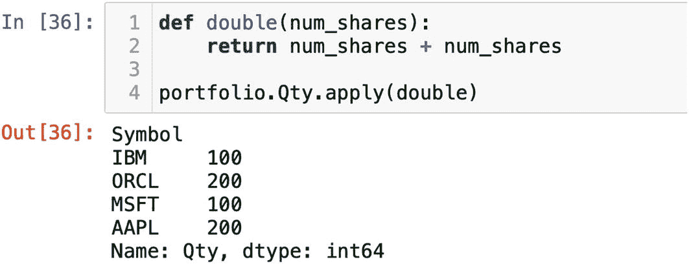

**图 3-29** 将 `double` 函数应用于 Series 中的所有值

通常，我们定义函数是因为我们想反复使用它。我怀疑 `double` 函数以后是否还会被用到。有没有更好的方法？答案是肯定的；我们可以用 `lambda` 替换函数。

要编写 `lambda` 表达式，你需要记住以下设置。始终以 `lambda` 关键字开头。在 `lambda` 中，有两个部分由冒号字符分隔。在第一部分，你定义一个或多个变量，这些变量会传入 `lambda`。在第二部分，你编写一个表达式，这是 `lambda` 将作为结果返回的内容。


**图 3-30** Lambda 语法

无需使用 `return` 操作符，因为 `lambda` 总是返回结果。请记住，`lambda` 必须在函数内部使用，或者可以作为一个表达式赋值给一个变量名。我们可以将 `double` 函数重写为 `lambda` 表达式：

```
lambda num_shares: num_shares + num_shares
```

这个表达式可以替换 `apply()` 方法中的 `double` 函数：

```
portfolio.Qty.apply(lambda num_shares: num_shares + num_shares)
```

如果我们想保存该操作的结果，可以将其分配给一个新的列名。

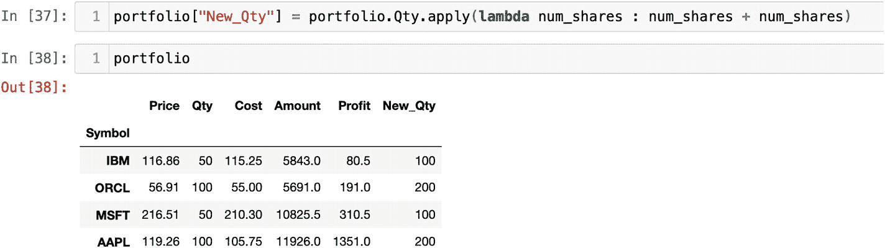

**图 3-31** 将股票数量加倍并将结果保存到新列名下

`lambda` 可以与 `if` 和 `else` 语句一起使用。语法如下所示：


**图 3-32** 带有 `if` 和 `else` 条件的 Lambda 语法

通过 `lambda` 基于 `if` 和 `else` 语句返回结果，我们可以在一个 Series 或整个 DataFrame 上执行逻辑运算。举例来说，我们可以根据价格提供买入或卖出股票的建议。假设股票价格低于 118 美元，我们就在新列 `Rating` 中记录 `Buy`。否则，在 `Rating` 列中记录 `Sell`。`apply()` 方法中的 `lambda` 表达式如下所示：

```
lambda stock_price: "Buy" if stock_price < 118 else "Sell"
```

同样，`stock_price` 是一个准确描述该值的变量。我们所要做的就是将 `lambda` 表达式传递给 `apply()` 方法，并将结果保存在名为 `Rating` 的列下：

```
portfolio["Rating"] = portfolio.Price.apply(lambda stock_price: "Buy" if stock_price < 118 else "Sell")
```

`Rating` 列保存了基于我们应用于 `Price` 列所有值的 `if` 和 `else` 语句的结果。

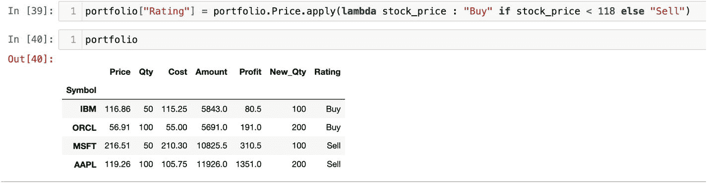

**图 3-33** 将带有 `if` 和 `else` 语句的 lambda 应用于列

我知道掌握 `lambda` 需要一些练习，在本章后面，我还会提供更多 `lambda` 实际应用的例子。

在 DataFrame 上进行逻辑运算的另一种方法是使用 `loc` 方法。语法如下所示：

```
DataFrame.loc[if condition, new column to save result] = result
```

一个实际的例子是计算每股盈亏。如果 `Price` 列中的值大于 `Cost` 列中的值，那么我们想从当前价格中减去支付的成本。结果将存储在一个新列中。我们将其命名为 `PL_per_share`。我们可以将此逻辑语句编写为：

```
portfolio.loc[portfolio.Price > portfolio.Cost, "PL_per_share"] = portfolio.Price - portfolio.Cost
```

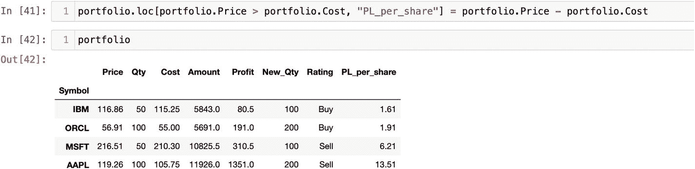

**图 3-34** 使用 `loc` 方法执行逻辑运算

还有一种基于 `if` 和 `else` 条件得到结果的方法——NumPy 函数 `where()`。Pandas 构建在 NumPy 之上，NumPy 数组数据结构是 Series 和 DataFrame 的核心。这意味着我们可以借用 NumPy 包中的函数并在 Pandas 中使用它们。由于我们尚未将 NumPy 库导入到文件中，我们需要向上滚动并将 NumPy 导入到 Pandas 导入语句下方的第一个单元格中。不要忘记重新运行该单元格：

```
import numpy as np
```

`where()` 函数属于 NumPy，我们需要这样使用它：

```
np.where()
```

最好阅读一下描述并查看它接受的所有参数：

```
help(np.where)
```

正如文档所说，`where()` 需要一个条件，然后它会提供两个结果。如果条件为 `True`，则执行第一个结果；如果条件返回 `False`，则执行另一个结果。

为了练习 `where()`，我们可以运行一个场景：如果 `PL_per_share` 中的值大于 5 美元，我们需要返回 `True`。否则，`where()` 将返回 `False`。结果将存储在名为 `greater_five` 的新列下。根据 `where()` 的描述，我们可以将该逻辑表达式编译为：

```
portfolio["greater_five"] = np.where(portfolio.PL_per_share > 5, True, False)
```

图 3-35 展示了 `where()` 函数完美的表现——新创建的 `greater_five` 列在每股利润大于 5 美元时，其值为 `True`。

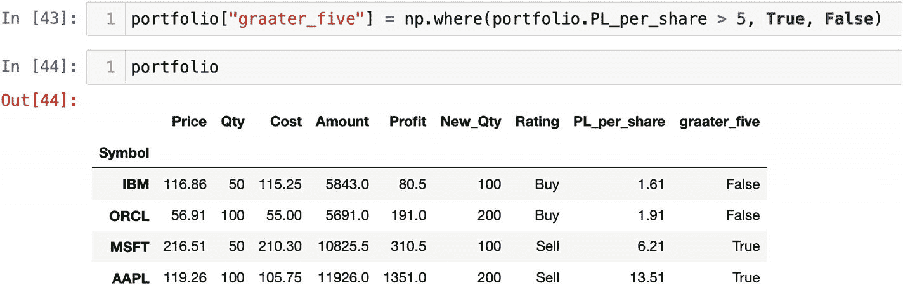

**图 3-35** 使用 `np.where` 函数执行逻辑运算

借助 `where()` 函数，我们可以执行比仅返回布尔值更复杂的操作。

沿用上一个示例的逻辑，如果 `PL_per_share` 小于 5 美元，我们可以增加该股票的持仓量。如果条件为 `True`，则将每股价格乘以 `New_Qty` 列的值。此操作的结果将更新 `Amount` 列中的值。对于 `PL_per_share` 值大于 5 美元的股票，我们将不进行任何操作，保留其原金额：

```
portfolio["Amount"] = np.where(portfolio.PL_per_share < 5, portfolio.Price * portfolio.New_Qty, portfolio.Amount)
```

`Amount` 列仅对 `IBM` 和 `ORCL` 进行了更新，因为它们对应的 `PL_per_share` 列数值分别为 `1.61` 和 `1.91`（见图 3-35）。

在这三种方法中，我比较偏好 `lambda` 和 `where()` 函数。`loc` 方法则需要为每个 `if` 条件编写单独的语句。不过，如果你有更多的条件需要测试 `if` 和 `else` 以及更多的 `if` 条件时，使用 `loc` 可能会更合适。

我认为理论部分已经讲解得足够多了，现在需要来看一个实际案例。我们将从 [`www.sectorspdr.com/sectorspdr/`](http://www.sectorspdr.com/sectorspdr/) 获取数据。

### 从 CSV 文件读取数据

[Sectorspdr.com](http://sectorspdr.com) 提供按行业划分的标普 500 公司的实时数据。每个板块代表一只 ETF（交易所交易基金）。如果你不熟悉金融也没关系，我们不会深入探讨技术细节。我们只需要相关的数据来读取为 DataFrame。我们还需要清洗数据并进行数据分析。我选择 [Sectorspdr.com](http://sectorspdr.com) 这个网站是因为它提供 CSV（逗号分隔值）格式的数据，可以直接在线读取，无需事先下载。

我们将获取 XLF 的 CSV 文件——XLF 是一只追踪标普金融板块指数的 ETF。你可以在此处获取数据：[`www.sectorspdr.com/sectorspdr/sector/xlf/index`](http://www.sectorspdr.com/sectorspdr/sector/xlf/index)。

如果 [Sectorspdr.com](http://sectorspdr.com) 网站有所变动，或者你想严格按照我的示例操作，我已经将我将在本文中使用的数据上传到了我的服务器。我已从 [Sectorspdr.com](http://sectorspdr.com) 下载了 CSV 文件，你可以在此处找到它：[`https://bit.ly/bookcsvxlf`](https://bit.ly/bookcsvxlf)。

在图 3-36 中，你可以看到两个绿色按钮，分别用于下载 CSV 或 Excel 格式的数据。页面上列出了 XLF 基金中包含的所有金融公司及其在指数中的权重。我们将从网站读取这些信息并进行分析。一种方法是点击绿色按钮将数据下载到你的电脑，然后使用 Pandas 的 `read_csv()` 函数将其打开为 DataFrame。Pandas 可以读取不同格式的数据。我们将在下一章更详细地讨论数据收集。最流行的格式是 CSV 和 xlsx。`read_csv()` 和 `read_excel()` 函数的主要优点是它们会返回一个 DataFrame。如果你使用 `help(pd.read_csv)` 查看 `read_csv()` 函数的描述，你会发现你可以直接从云端打开 CSV 文件，而无需事先下载。要直接从服务器打开它，我们可以复制 URL（统一资源定位符）并将其直接传递给 `pd.read_csv()`。

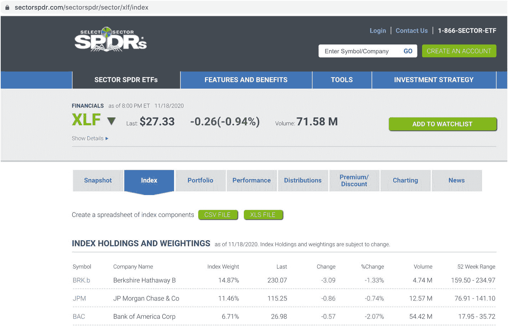

图 3-36：提供数据下载选项的 Sectorspdr 网站

对于本练习，我们需要启动一个新的 **Jupyter** 文件，并在第一个单元格中导入 pandas：

```python
import pandas as pd
```

有两种方法可以从网站获取信息：第一种是通过鼠标右键单击网站并选择“复制链接地址”来复制 URL。使用第一种方法，你将获得来自 [Sectorspdr.com](http://sectorspdr.com) 的最新数据。第二种方法是使用我提供的、指向之前下载到服务器上的文件的链接。以下是两种方式的示例：

```python
url = "https://www.sectorspdr.com/sectorspdr/IDCO.Client.Spdrs.Index/Export/ExportCsv?symbol=xlf"

file = pd.read_csv(url, skiprows=1)

或

url = "https://bit.ly/bookcsvxlf"

file = pd.read_csv(url, skiprows=1)
```

在这两种情况下，你都应该会看到如图 3-37 所示的 DataFrame。

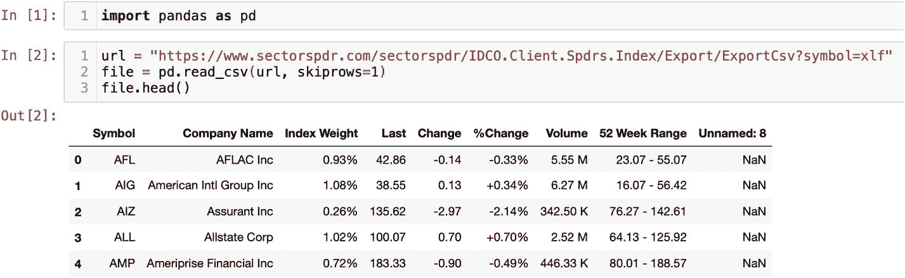

图 3-37：从在线位置读取 CSV 文件

`skiprows` 关键字参数会跳过原始文件中的第一行。有时，文件中会包含我们分析时不需要的时间戳或标题。在 `xlf.csv` 文件中，第一行是一个时间戳，它会干扰 DataFrame 的格式。你可以移除 `skiprows=1` 并重新运行该单元格，以查看不使用 `skiprows` 时 DataFrame 的样子。

在图 3-37 的第 3 行，我使用了 `head()` 方法。大多数情况下，数据量太大无法在屏幕上完整显示，Pandas 无法渲染整个数据集。`head()` 和 `tail()` 方法会分别显示前五行或后五行。如果你想查看更多行，可以将行数作为参数传递给 `head()` 或 `tail()`。要查看前 20 行，我们可以使用：

```python
file.head(20)
```

每次处理新的数据集时，我都会从 DataFrame 的 `info()` 方法开始：

```python
file.info()
```

`info()` 方法返回关于 `file` 对象的所有信息（图 3-38）。首先，我们看到该 DataFrame 有 65 行，占用 4.7 KB 内存。但更重要的是，`info()` 方法提供了每列值的数据类型。只有三列——`Last`、`Change` 和 `Unnamed: 8`——包含数值。所有其他列的数据类型都是 `object`。`object` 数据类型意味着非数值数据类型，通常是字符串。因此，对 `"Index Weight"` 列或 `"Volume"` 列进行数学运算是不可能的，因为它们包含字符串。如果我们计划对这些列进行任何计算，就需要将值转换为浮点数。

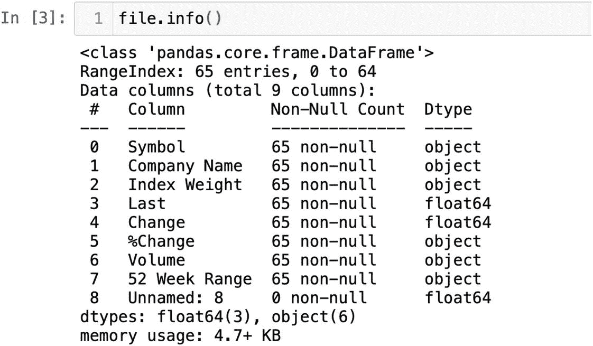

图 3-38：`info()` 方法提供 DataFrame 的信息

在进行数据分析之前，我们需要对数据集进行一些清洗。有一个名为 `"Unnamed: 8"` 的列包含 `NaN`。`NaN` 代表非数字，表示没有值。没有值的列对我们来说完全没用。我们将使用 `drop()` 方法将其删除：

```python
file.drop( "Unnamed: 8", axis=1, inplace=True)
```

正如我之前警告过的，请将 `drop()` 语句放在一个单独的单元格中，并仅运行一次。`"Unnamed: 8"` 列在我们删除后就不见了（图 3-39）。

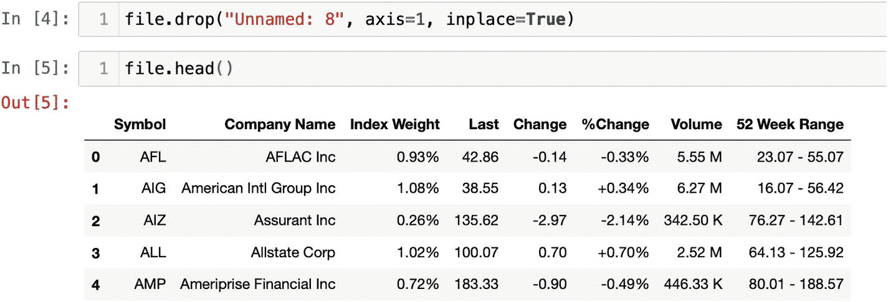

图 3-39：从 DataFrame 中删除 `Unnamed: 8` 列

我将向您展示如何将某一列的数据类型转换为数值。假设我们想对 `"Index Weight"` 列中所有值进行求和，并检查结果是否为 100%。方法 `info()` 显示这些值是字符串类型。您可能一时觉得这能有多难？然而，在此之前，我们需要先去掉 `%` 符号。否则，我们将会收到错误信息，因为特殊字符无法转换为数值。让我们先切分该列，并对其运行 `dir` 函数，看看该序列内置了哪些内容。由于列名中包含空格，我们将不得不使用字典标记法：

```python
dir(file["Index Weight"])
```

如果您浏览所有属性，会发现 `str` 这个模块，它包含字符串方法。如果在 `dir()` 函数中加入 `str`，我们就能看到所有方法：

```python
dir(file["Index Weight"].str)
```

您应该能看到在 Python 字符串对象中见过的熟悉的方法名。尽管这些方法的名称与 Python 字符串方法一致，但它们都是为一维序列设计的。这些方法的实现方式与常规的 Python 字符串方法不同。它们被设计为应用于整个序列，而不是逐个处理字符串值。

`"Index Weight"` 列包含带有 `%` 符号的数字。我们需要移除所有 `%` 符号。这听起来需要对列进行遍历。如果处理的是列表，我们会使用 `for` 循环，并逐个用字符串方法 `strip()` 移除 `%`。但有了 `str.strip()` 方法，就无需遍历了，因为它源自序列对象本身。我想澄清一点：`strip()` 和 `str.strip()` 执行相同的任务，但前者一次只处理一个值，而后者则作用于整个序列。要在将值转换为数值数据类型之前移除所有 `%` 符号，我们将执行：

```python
file["Index Weight"].str.strip("%")
```

`str.strip()` 会清除所有值上的 `%`（图 3-40）。

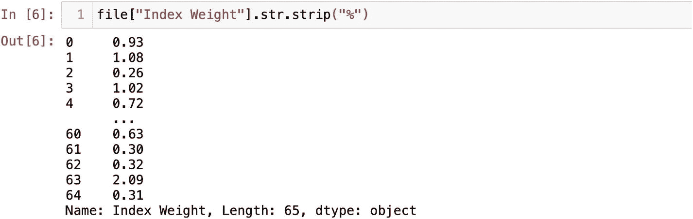

图 3-40
序列方法 `str.strip()` 会移除所有值中的 `%` 符号

我们已经完成了一半；现在需要将字符串值转换为数值数据类型。有几种方法可以将一种数据类型转换为另一种。在这里，我们可以像这样将 Pandas 函数 `pd.to_numeric()` 应用于序列中的所有值：

```python
file["Index Weight"].str.strip("%").apply(pd.to_numeric)
```

或者，我们可以使用序列方法 `astype()` 并传入 `float` 数据类型作为参数：

```python
file["Index Weight"].str.strip("%").astype(float)
```

在 Pandas 中如何将字符串转换为浮点数属于个人偏好；结果是一样的。我们需要存储结果，我会将该语句赋值给一个新列名 `"IW"`：

```python
file["IW"] = file["Index Weight"].str.strip("%").astype(float)
```

尽管在 `Index Weight` 和 `IW` 两列中数值视觉上相同，但在后者上，我们可以执行数学计算和筛选（图 3-41）。

**表 3-1** Pandas 中的聚合方法

| 方法 | 定义 |
| --- | --- |
| `sum()` | 计算值的总和 |
| `mean()` | 计算值的平均值 |
| `count()` | 计算行数 |
| `std()` | 计算标准差 |
| `var()` | 计算值的方差 |
| `min()` | 计算组内最小值 |
| `max()` | 计算组内最大值 |

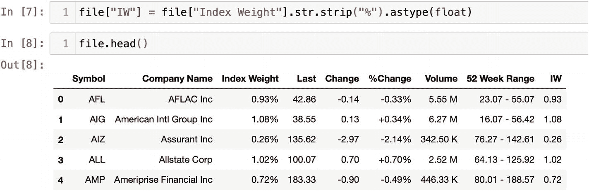

图 3-41
将 `Index Weight` 列中的字符串转换为数值，并将结果保存在 `IW` 列中

聚合方法 `max()` 会计算列中所有值的总和：

```python
file.IW.sum()
```

方法 `min()` 和 `max()` 会分别获取序列中的最小值和最大值：

```python
file.IW.min()
file.IW.max()
```

我们可以通过筛选从 DataFrame 中获取 S&P 500 金融指数 XLF 中权重最小和最大的公司：

```python
file[file.IW == file.IW.min()]
file[file.IW == file.IW.max()]
```

显然，`Unum Group` 的权重最小，而 `Berkshire Hathaway` 是 XLF 指数中权重最大的持仓（图 3-42）。

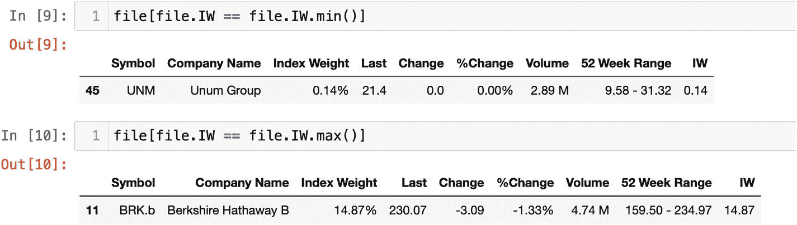

图 3-42
筛选出指数中权重最小和最大的公司

`str` 模块中另一个值得一提的方法是 `contains()`。`contains()` 方法有助于在文本中搜索子字符串。为说明这一点，我们将做一个简单的任务。DataFrame 中的大多数公司名称都包含 `Group` 或 `Corp` 字样。假设我们的目标是比较在 XLF 指数中，`Group` 和 `Corp` 哪个更普遍。要解决这个任务，我们需要先筛选 `"Company Name"` 列：

```python
file["Company Name"].str.contains("Group")
```

以及

```python
file["Company Name"].str.contains("Corp")
```

这些语句会返回 `True` 或 `False`。像之前所做的那样，我们可以将它们应用于整个 `file` 对象，然后使用 `count()` 方法：

```python
file[file["Company Name"].str.contains("Group")].count()
file[file["Company Name"].str.contains("Corp")].count()
```

方法 `count()` 会累加满足筛选条件的每一列的行数。我们可以不将筛选器应用于整个 DataFrame，而是应用于一列 `Symbol`：

```python
file["Symbol"][file["Company Name"].str.contains("Group")].count()
file["Symbol"][file["Company Name"].str.contains("Corp")].count()
```

正如我们在图 3-43 中的分析所示，金融公司似乎更倾向于在公司名称中使用 `Corp` 缩写而非 `Group`。

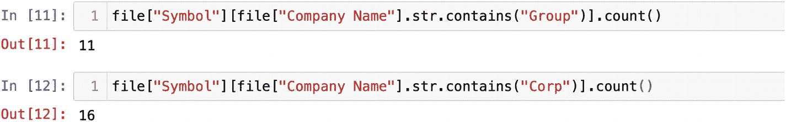

图 3-43
按 `"Group"` 和 `"Corp"` 字样筛选 `"Company Name"` 列

方法 `contains()` 节省了大量时间和遍历工作。使用管道符 `|`，我们可以替代逻辑或运算符，同时搜索 `Corp` 和 `Group` 实例：

```python
file["Symbol"][file["Company Name"].str.contains("Group|Corp")].count()
```

此语句将得到 27，即 `Company Name` 列中包含 `Corp` 和 `Group` 字样的公司数量。

所有数据集都需要进行某种清洗。将值转换为数值数据类型相对容易。尽管如此，在某些情况下，您需要编写一个函数来获得所需的数据格式。

`"Value"` 列包含指数中每只股票的换手股数。如果我们的目标是了解指数中所有股票的总成交额，就需要将该列中的值转换为数值类型，最后使用 `sum` 方法。一个阻碍是，我们不能使用之前在 `"Index Weight"` 列上采用的方法。有些值以千计，末尾带有 `K`；另一些则以百万计，包含 `M`。仅仅去除这些字母并累加数字是不可行的。这是一个非常适合使用 `lambda` 的场景。在给出 `lambda` 解决方案之前，我想先用一个函数来解决这个问题。

我们将定义一个名称自明的函数 `str_to_num`，它接受一个字符串作为参数并返回一个数字。在函数内部，我们将设置 `if` 和 `else` 条件。如果传入的字符串包含 `K`，我们就去掉该字母，将其转换为数值，然后乘以一千。否则，我们将移除 `M` 并乘以一百万。

```python
def str_to_num(value):
    if "K" in value:
        value = value.strip("K")
        number = float(value)
        number = number * 1000
    else:
        value = value.strip("M")
        number = float(value)
        number = number * 1000000
    return number
```

在编写代码时，我总是一步一步地测试每个环节。为了确保函数正常工作，我用`Volume`列的第一个值来调用它：

```python
str_to_num("5.55 M")
```

函数返回`5550000.0`（图 3-44）。

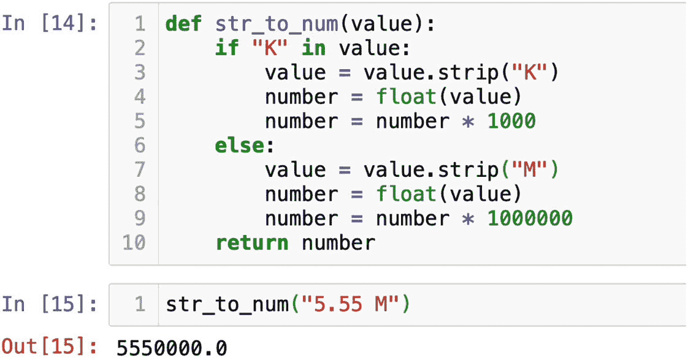

图 3-44
测试函数 `str_to_num()`

要转换`"Volume"`列中的所有值，需要使用`apply`方法遍历所有行，并应用`str_to_num`函数。结果将保存在名为`"Vol_function"`的新列中：

```python
file["Vol_function"] = file["Volume"].apply(str_to_num)
```

同样的转换操作也可以借助`lambda`实现。为了比较转换结果，我会将`lambda`得到的结果保存在`"Vol_lambda"`名下。`lambda`表达式将包含 if 和 else 条件，并遵循我们在`str_to_num`函数中执行的所有步骤。

我在图 3-44 中特意分解了`str_to_num`函数中的所有步骤，以便我们可以一步步在`lambda`中实现它们。首先，我们在 lambda 中定义`value`作为参数，然后编写表达式的第一部分：

```python
lambda value : float(value.strip("K"))*1000 if "K" in value
```

`lambda`表达式模仿了该函数。操作的顺序略有不同，因为我们需要嵌套函数。在将数字乘以 1000 之前，我们需要去掉`K`。当然，前提是传入的字符串包含`K`。

`lambda`表达式的第二部分在概念上是相同的。我们不需要检查`M`，因为`else`条件意味着除了`K`以外的任何情况。去掉`M`后剩下的内容会被转换为浮点类型，并乘以 1,000,000：

```python
else float(value.strip("M"))*1000000
```

最终的`lambda`表达式将像这样传入`apply()`方法，以替代`str_to_num`函数：

```python
file["Vol_lambda"] = file["Volume"].apply(lambda value : float(value.strip("K"))*1000 if "K" in value else float(value.strip("M"))*1000000)
```

这两种清理数据并将值转换为数值类型的方法产生了相同的结果。为了证明这一点，我将比较`Vol_function`和`Vol_lambda`列中所有值的总和（图 3-45）。

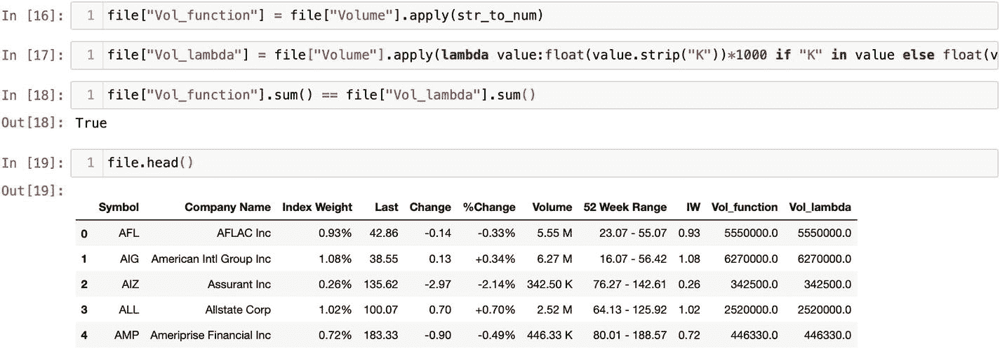

图 3-45
将 Volume 列的值转换为数值类型的两种方法

使用哪种方法由你决定。如果我要处理的事情比 if 和 else 条件更复杂，我会选择函数。`Lambda`则是快速解决某些问题的绝佳选择。另一个例子可以说明这一点。`"52 Week Range"`列提供了年内最高价和最低价。假设我们需要计算这些数字之间的差值。该列中的每个值都以字符串形式出现。我会将字符串拆分成两个值，并将它们转换为数值类型。结果将保存在两个新列`"High"`和`"Low"`中。最后，通过从`"High"`值中减去`"Low"`值来获得差值。

在此之前，我们需要对列进行切片：

```python
file["52 Week Range"]
```

切片操作得到的 Series 包含字符串，我们可以对其使用`str`方法之一。每个值的最高价和最低价之间有一个连字符。在上一章中，我们使用`split()`方法按空格分隔字符串；现在我们将使用`"-"`作为分隔符：

```python
file["52 Week Range"].str.split("-")
```

操作的结果是，Series 中的所有值都表示一个包含两个字符串的 Python 列表。我们需要获取第一个和第二个字符串，并将它们转换为浮点数。这让我想到了索引。第一个值的索引位置是`0`，第二个值的索引位置是`1`。然而，索引操作必须在 Series 中的每个列表上执行。这可以通过`apply()`方法和`lambda()`来实现：

```python
file["Low"] = file["52 Week Range"].str.split("-").apply( lambda value : float(value[0]))
file["High"] = file["52 Week Range"].str.split("-").apply( lambda value : float(value[1]))
```

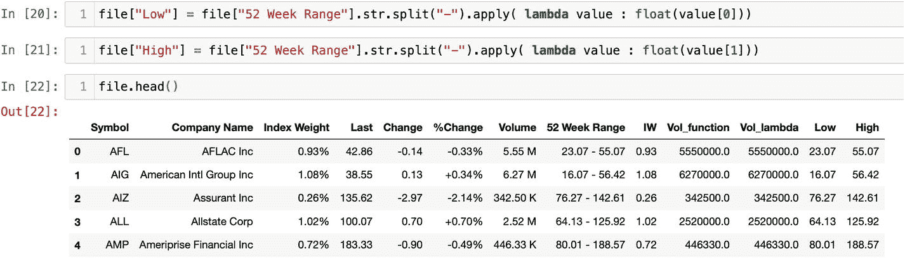

图 3-46
将`52 Week Range`列的值拆分为`Low`和`High`列

名为`"Low"`和`"High"`的两列被添加到 DataFrame 中，并包含数值（图 3-46）。最后，我们可以计算差值，从`"High"`列的值中减去`"Low"`列的值。结果将保存在名为`"Diff"`的新列下：

```python
file["Diff"] = file["High"] – file["Low"]
```

前面的例子证明了`lambda()`是处理数据时不可或缺的工具。我的建议是重复练习，以完全理解和掌握语法。此外，找另一个数据集，在新的数据上使用`apply()`方法和`lambda`也是一个好主意。

## 合并数据集

合并数据集有两种选择。第一种是将两个或多个 DataFrame 简单拼接在一起。第二种是基于共同值合并数据集。

### 拼接数据集

我们从拼接开始。一如既往，我们将在新文件中开始新的练习。别忘了在文件顶部导入 Pandas：

```python
import pandas as pd
```

我们将创建两个数据集来进行合并。每个数据集将包含葡萄酒的信息。数据集一将包含`"Country"`和`"Price"`列。这次，我们将从两个列表创建一个 DataFrame：

```python
country_list = [ "US", "Italy", "France", "Spain"]
price_list = [13.99, 9.99, 12.99, 11.99]
```

这些 Python 列表需要使用内置函数`zip()`将它们组合在一起：

```python
data_one = zip(country_list, price_list)
```

函数`zip()`返回一个对象，我们可以将其传入`pd.DataFrame()`函数。此外，我们需要为 DataFrame 提供列名：

```python
ds_one = pd.DataFrame(data=data_one, columns=["Country","Price"])
```

数据集二将有不同的列——`"Region"`和`"Variety"`：

```python
region_list = ["Rioja", "Bordeaux", "Sicilia", "Napa"]
variety_list = ["Red Blend", "Merlot", "Primitivo", "Chardonnay"]
```

函数`zip()`总是返回一个对象，我们将两个 Python 列表压缩后返回的对象传入`pd.DataFrame()`函数：

```python
data_two = zip(region_list, variety_list)
ds_two = pd.DataFrame(data=data_two, columns=["Region", "Variety"])
```

现在我们有了两个要拼接的 DataFrame（图 3-47）。

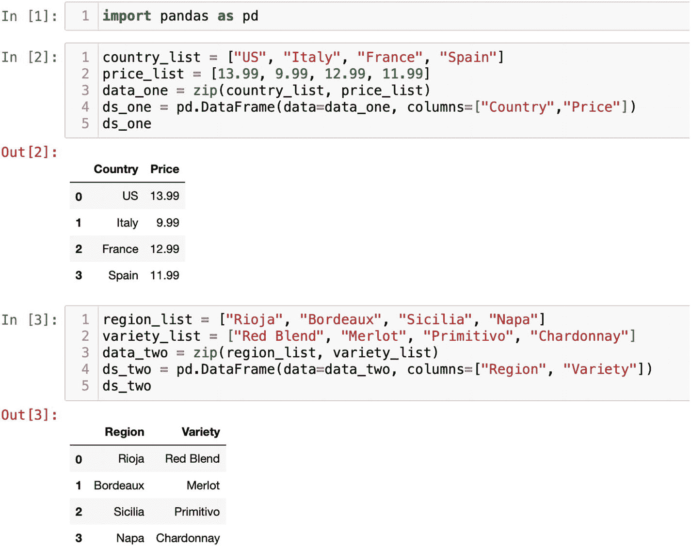

图 3-47
从列表创建两个 DataFrame

Pandas 的`concat()`函数用于连接 DataFrame。`concat()`函数可以拼接两个以上的对象。如果你想拼接三个或更多对象，你需要以 Python 列表的形式传递 DataFrame。在进行拼接之前，我们需要决定如何将两者连接在一起——垂直还是水平。默认情况下，`concat()`函数中的关键字参数`axis`设置为`0`或`index`。这意味着如果我们把数据集传入`concat()`，它会将一个放在另一个的上面（图 3-48）：

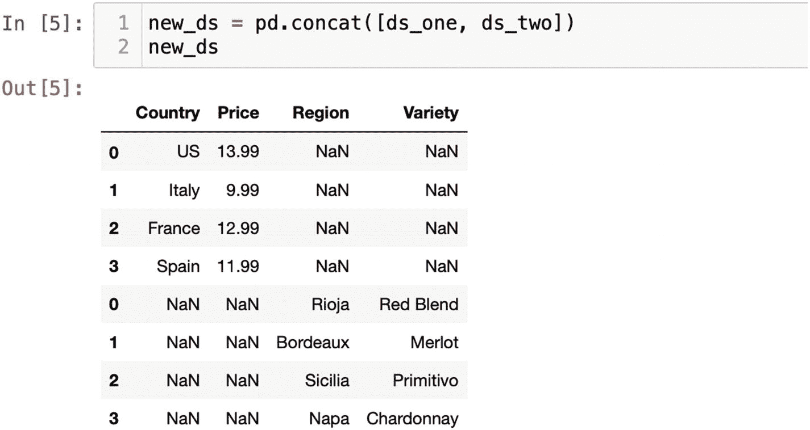

图 3-48
`concat()` 函数默认会垂直拼接 DataFrame。

new_ds = pd.concat([ds_one, ds_two])

拼接后产生的新 DataFrame 对象 `new_ds` 中出现了 `NaN`（表示不是数字），并且索引中存在重叠值。我们没有对应的值，行中的 `NaN` 反映了这一点。稍后我将解释如何处理缺失值。

索引中的重复项对新数据集来说将是一个问题。`concat()` 函数带有关键字 `ignore_index`，其默认设置为 `False`。如果你确定新数据集会有重叠值，你可以设置 `ignore_index=True`。此选项会将旧索引替换为全新的索引：

```python
pd.concat([ds_one, ds_two], ignore_index=True)
```

我个人更偏爱另一种 DataFrame 方法 `reset_index()`。在前面的例子中，你会永久丢失旧索引。使用 `reset_index()`，你拥有更大的灵活性，并且可以将带有重复项的原始索引保存为一列。对 `new_ds` 对象运行 `help()` 函数，你会看到关键字参数 `drop`：

```python
help(new_ds.reset_index)
```

你可能已经注意到，我每次对每个方法或函数都使用 `help()` 函数。Pandas 库会定期更新。即使你知道如何使用某个方法或函数，检查一下与之前版本相比是否有任何变化也是明智之举。此外，有些方法参数非常多，不可能记住所有选项。`help()` 函数能为你节省大量搜索的时间。

`reset_index()` 方法中的参数 `drop` 默认设置为 `False`。如果我们将 `reset_index()` 直接应用于 `new_ds` 对象，我们将获得一个全新的索引，而原始索引会成为一列：

```python
new_ds.reset_index(inplace=True)
```

DataFrame `new_ds` 被追加了一个名为 `index` 的列，新的索引仅包含唯一值（图 3-49）。在我看来，`reset_index()` 功能中的 `drop` 关键字参数提供了更大的灵活性，尤其是当你处理无法再次获取的敏感数据时。

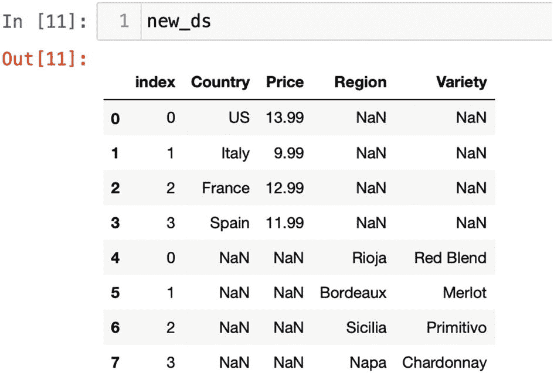

### 图 3-49
在 DataFrame 上重置索引，`drop` 参数设置为 `False`

如果我们将 `reset_index()` 方法中的 `drop` 参数改为 `True`（就像 `ignore_index` 那样），我们就会永久丢失原始索引。现在，旧索引值被保存在列中，我们总能在需要时通过重置索引回到这些旧值：

```python
new_ds.index = new_ds["index"]
```

不要将 DataFrame 的属性 `index` 与列名 `"index"` 混淆。

拼接 `ds_one` 和 `ds_two` 这两个 DataFrame 的另一种方式是沿着列方向进行。我们需要将 `axis` 参数切换为 `1` 或 `"columns"`：

```python
new_ds = pd.concat([ds_one, ds_two], axis=1)
```

这一次，`new_ds` DataFrame 有四列四行（图 3-50）。

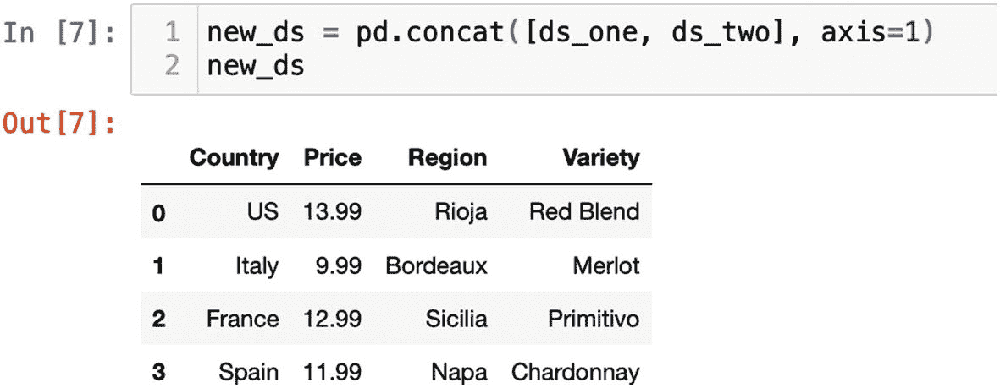

### 图 3-50
使用 `axis` 参数设置为列方向拼接两个 DataFrame

正在阅读本书的葡萄酒爱好者可能注意到了国家与葡萄酒产地区域之间的不匹配。请记住，`concat()` 函数只是单纯地连接数据集。如果我们需要匹配数据，最佳选择是使用 `merge()` 函数。

### 合并 DataFrame

Pandas 的 `merge()` 函数基于列中的公共值来合并 DataFrame。首先，我们需要拥有包含相同值的列。让我们为 `ds_two` 添加一个新的 `"Origin"` 列，包含以下国家：

```python
ds_two["Origin"] = ["Spain", "France", "Italy", "US"]
```

现在，两个 DataFrame `ds_one` 和 `ds_two` 都有了包含相同值的列。尽管在 `ds_one` DataFrame 中该列名为 `"Country"`，而在 `ds_two` 中名为 `"Origin"`，我们仍然可以合并它们：

```python
merged_ds = pd.merge(ds_one, ds_two, left_on="Country", right_on="Origin")
```

我们通过匹配 `"Country"` 和 `"Origin"` 列中的值来合并了两个 DataFrame（图 3-51）。

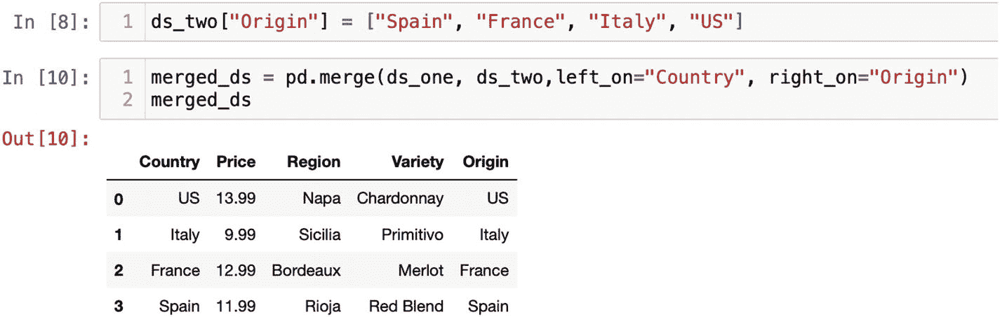

### 图 3-51
`merge()` 函数匹配 `"Country"` 和 `"Origin"` 列中的值

默认情况下，`merge()` 函数会寻找同名的列。如果两个数据集中都有 `"Country"` 列，那么它会根据这些列的值进行合并。在这种情况下，我们使用 `merge()` 函数时就不需要提供 `left_on` 和 `right_on` 参数。我更倾向于在 `merge()` 函数中使用 `left_on` 和 `right_on` 关键字参数，因为这样更具体。我们明确地指出，在 `ds_one` 中，我们想使用 `"Country"` 列来匹配值。`left_on` 参数指的是 `ds_one` 数据集，因为在 `merge()` 函数的位置上它位于左侧。逻辑上，`right_on` 指的是 `ds_two` 中的一列，因为它位于数据集参数的右侧。此外，如果数据集中有几个同名的列，`merge()` 会选择第一个常见的列名来匹配值。这可能不是我们的意图，所以我选择指定具体的列。

数据集可以通过索引进行合并。Pandas 提供了多种选项，通过不同的函数和方法来解决同一个问题。我们仍然可以使用带有关键字参数 `left_index` 和 `right_index` 的 `merge()` 函数按索引合并。但有一个 `join()` 方法，它最初就是通过匹配索引中的值来合并数据集的。为了演示 `join()` 方法的使用，我们将重置 `ds_one` 的索引为 `"Country"` 列，`ds_two` 的索引为 `"Origin"` 列：

```python
ds_one.index = ds_one["Country"]
ds_two.index = ds_two["Origin"]
```

此时，两个 DataFrame 拥有包含相同值的索引，我们可以借助默认匹配索引值的 `join()` 方法来合并它们：

```python
joined_ds = ds_one.join(ds_two)
```

`joined_ds` DataFrame 继承了 `ds_one` 的索引，并将其与 `ds_two` 的索引进行了匹配（图 3-52）。

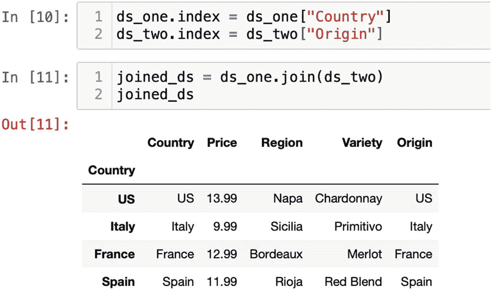

### 图 3-52
使用 `join()` 方法通过匹配索引中的值来合并两个 DataFrame

# Groupby

`groupby` 是 Pandas 中另一个我打算在深入实践问题之海前讨论的基本工具。`groupby()` 方法在功能上与排序类似。如果你用过关系型数据库，应该对 `groupby` 功能很熟悉。`groupby()` 方法提供了一种基于一个或多个列中的公共值来对 DataFrame 进行重新分组的选项。它对值进行排序，并将其用作新的键。`groupby()` 方法总是返回一个对象。大多数情况下，它与聚合方法（如 `count`、`sum` 和 `mean`）一起使用。如果我们实际使用一下 `groupby`，会更容易理解。我们将获取一个包含标普 500 公司的数据集。我会从一个在线地址 [`https://bit.ly/booksp500`](https://bit.ly/booksp500) 打开 CSV 文件到一个新的 DataFrame 中。

标普 500 指数包含来自 11 个行业的美国最大的 500 家公司。从在线位置的 CSV 文件中读取数据后，得到的 DataFrame 应该类似于图 3-53。

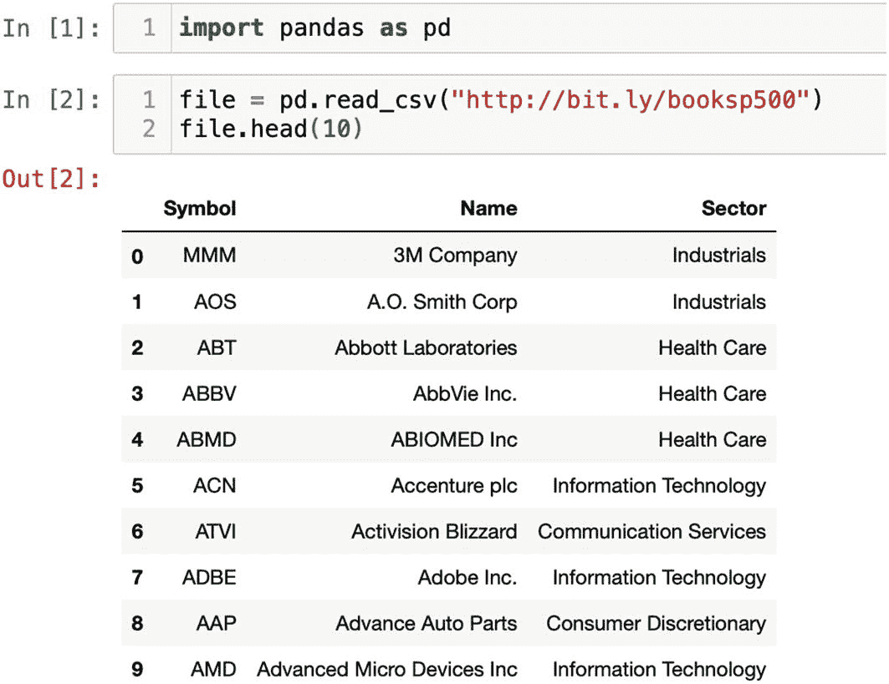

### 图 3-53
来自 CSV 文件的包含标普 500 公司的 DataFrame

`file` DataFrame 有三列。`"Sector"` 列保存了公司的行业名称。

我们的目标是根据行业对指数中的所有公司进行排序。一种方法是按行业板块筛选，然后统计行数。例如，如果我们想知道标普 500 指数中包含多少家医疗保健行业的公司，可以这样做：

```
file[file.Sector.str.contains("Health Care")].count()
```

`groupby()` 方法让我们能实现同样的操作，但可以同时处理 `"Sector"` 列中的所有行业板块。列名作为参数传入方括号内的 `groupby()` 方法。方括号允许我们向该方法传入多个列。`groupby()` 会将 DataFrame 拆分，并使用 `"Sector"` 列中的值作为键或索引重新组装：

```
sector_data = file.groupby(["Sector"]).count()
```

随后，`sector_data` 对象将行业作为索引。`count()` 方法返回了每个索引值对应的所有公司数量（图 3-54）。

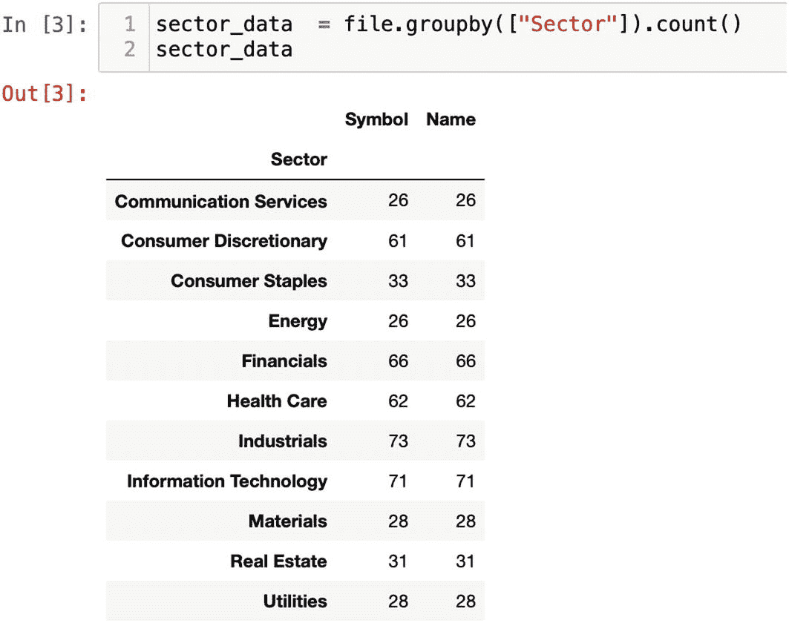

图 3-54
按 Sector 列的值进行分组

如您所见，`sector_data` 被存储为一个新的 DataFrame。这给了我们灵活性。我们可以重置索引，此时 `Sector` 将成为一个列。另一方面，我们也可以绘制这些数据。

可视化是数据分析的重要组成部分。Python 中一个著名的可视化库是 Matplotlib。Matplotlib 的某些功能已经内建在 DataFrame 中。内建的 Matplotlib 方法存储在 `plot` 模块中。您可以通过对 DataFrame 运行 `dir()` 函数来查看所有可用的选项：

```
dir(sector_data.plot)
```

`pie()` 方法将帮助我们绘制标普 500 各行业板块的公司数量饼图（图 3-55）。`"Name"` 列将用作饼图的值：

```
sector_data.plot.pie(y="Name", figsize(10,10))
```

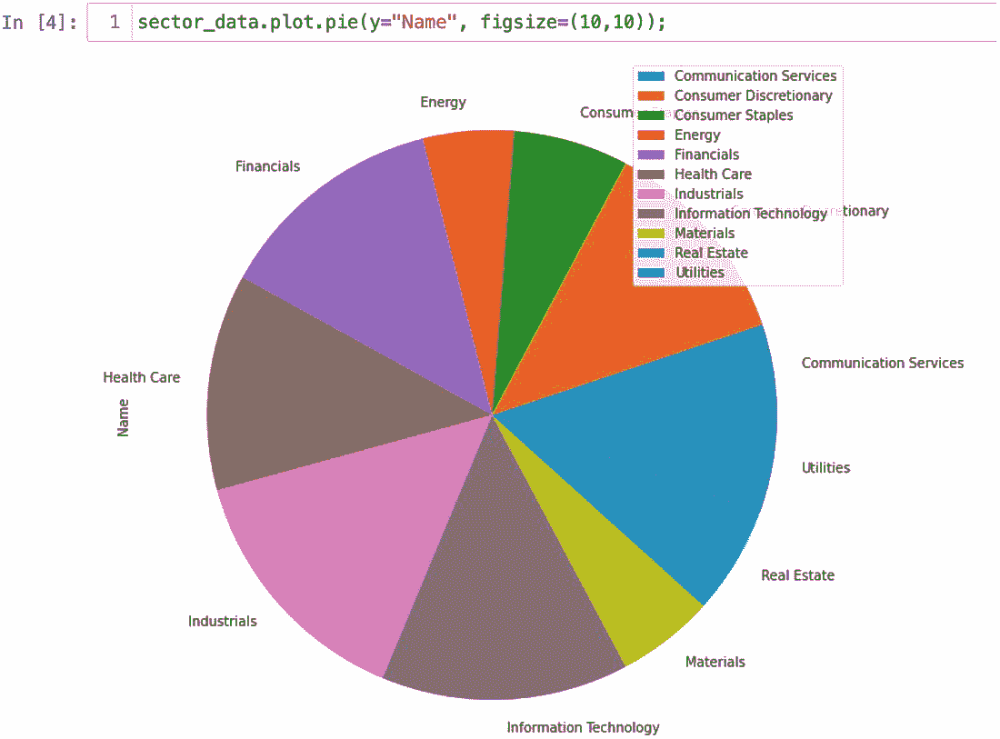

图 3-55
sector_data 的绘图

## 总结

我认为我们已经掌握了足够多的 Python 和 Pandas 知识来应对现实中的挑战。我们知道如何初始化一个 DataFrame 以及如何从 CSV 文件读取数据。筛选和 `lambda` 逻辑语句将帮助我们在 `if` 和 `else` 条件下执行某些操作。在下一章中，我们将使用已学的方法来收集和操作数据。除了 Pandas，我们还将探索更多专门用于处理不同数据源的库。我们的目标是收集信息并进行分析。

## 脚注

### 4. 使用 Python 收集数据

信息是数据分析的关键要素。它以不同的格式来自各种来源。有些信息需要付出很大努力才能获取；而其他数据则已经是干净且结构化的。Python 是一款非常优秀的工具，可以收集和处理任何格式的任何数据。编程已经将手动从在线来源复制粘贴信息到电子表格的繁琐过程自动化。在本章中，我们将讨论收集数据的多种方法。我们将从网络爬虫开始，即爬取网站并抓取信息的过程。如果信息存在于网络上且旨在供公众使用，为什么不加以利用呢？当然，所有收集到的数据都应仅用于合法目的。此外，我们还将使用 API。所有大型知名公司都为其服务提供了 API。谷歌和推特等科技巨头甚至提供了 Python 库来简化开发人员的工作。有些公司会对信息收费；而另一些公司则免费提供，除非您想将其用于商业用途。从在线来源获取数据的众多库是 Python 如此受欢迎的原因之一。

### 网络爬虫

网络爬虫是一种从网站提取数据的方法。该过程始终从第一步开始——向服务器发送请求并接收数据作为响应。通常，我们使用浏览器从网络读取信息。在计算机世界中，浏览器被称为客户端。客户端向服务器发送信息请求。您在浏览器页面顶部输入一个 URL（统一资源定位符）地址，它就会向服务器发送一条请求信息的消息。基于该请求，服务器会将带有数据的消息发送回来。数据以 HTML（超文本标记语言）的形式到达。网络浏览器会解释这些信息，我们就能看到带有样式和颜色的图像和文本。当我们爬取网站时，Python 充当客户端并向服务器发送请求。Python 不理解 HTML，因此接收到的数据必须转换为字符串，这是 Python 可以自然处理的数据类型。

有几个 Python 包可用于与服务器通信。在本书中，我们将使用一个非常流行的 Requests 库。Requests 方法向服务器发送请求消息并处理响应。无需下载 Requests 包，因为它已包含在 Anaconda 中。

对于后续的示例，您需要一个 Google Chrome 浏览器。Chrome 自带开发者工具。所有其他浏览器都需要额外下载才能获得开发者工具。如果您尚未安装 Chrome 浏览器，请从 [`www.google.com/chrome/`](http://www.google.com/chrome/) 下载。假设我们大多数人已经安装了 Chrome，请确保您使用的是最新版本。

在我们进入爬取部分之前，我想在过时的网站 [`http://shakespeare.mit.edu/romeo_juliet/romeo_juliet.1.0.html`](http://shakespeare.mit.edu/romeo_juliet/romeo_juliet.1.0.html) 上解释网络爬虫的基本原理。在 Chrome 浏览器中打开该链接，您会看到这个网页看起来像是来自 1990 年代。网站上没有图像或动画，只有纯文本。这正是我们理解网络爬虫过程主要步骤所需要的东西。

首先，我们需要向服务器发送请求并获取网站。这时 Python 的 Requests 库就派上用场了。Requests 库有 `get()` 方法用于向服务器请求信息。如果请求成功，服务器会发回信息并附带成功代码 200。否则，服务器会发送带有不同错误代码（如 403 或 404）的消息。您可能以前见过 404 错误消息，当浏览器返回“页面未找到”时。您不需要了解所有代码就能爬取数据。只需记住代码 200 表示一切正常。其他任何代码编号都意味着出了问题。

在 Jupyter 单元格中处理“罗密欧与朱丽叶”页面时，导入 Requests 库：

```
import requests
```

向服务器发送请求需要使用 `get()` 方法，并附上您试图获取的 URL，如下所示：

```
page = requests.get("http://shakespeare.mit.edu/romeo_juliet/romeo_juliet.1.0.html")
```

```
`get()` 方法返回了响应 200，意味着数据已接收（图 4-1）。

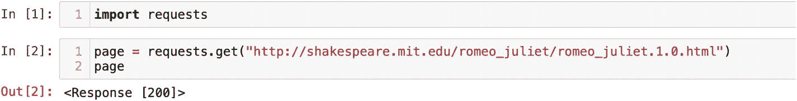

图 4-1
使用 `requests.get()` 方法发送请求并接收响应

变量 `page` 保存了一个 Python 对象。返回的 Python 对象可以被解析为字符串，该字符串会形成类似于 HTML 标记的结构。最流行的用于处理 HTML 的 Python 库是 BeautifulSoup。该库的名称灵感来源于《爱丽丝梦游仙境》小说中一首诗的标题。

BeautifulSoup 会将从服务器接收到的所有数据重新创建为 HTML 标记。请注意，它实际上不会是 HTML，而是一个看起来像 HTML 结构的字符串对象。BeautifulSoup 也是 Anaconda 的一部分，我们只需将其与 `Requests` 一起导入即可。回到上一个单元格，在 `Requests` 之后立即导入它。不要忘记重新运行该单元格。

```python
from bs4 import BeautifulSoup
```

`bs4` 是该包的缩写名称，而 `BeautifulSoup` 是我们将用来生成一个看起来像 HTML 结构的对象的函数。将来自服务器的内容作为 `page.content` 传递给该函数，并将其解析为 HTML：

```python
data = BeautifulSoup(page.content, "html.parser")
```

打印 `data`，你会看到一个看起来像 HTML 代码的对象（图 4-2）。

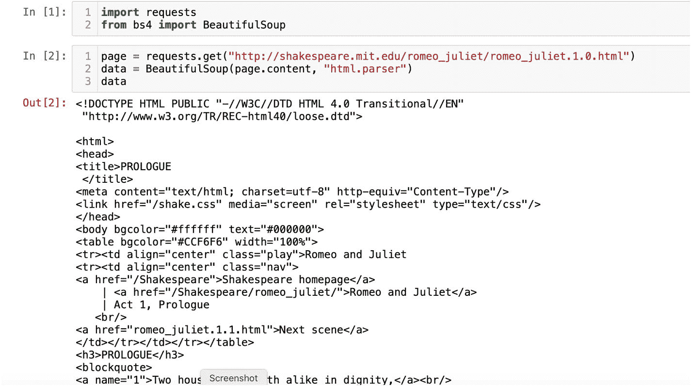

图 4-2 BeautifulSoup 将从服务器获取的数据解析为 HTML 标记

你不需要精通 HTML 就能进行网页抓取。不过，我会给你一个速成课程。网页上渲染的每个元素都必须包裹在 `<>` 标签中。在图 4-2 靠近底部的位置，你可以找到 `<h3>PROLOGUE</h3>`。`h` 表示标题，而 `3` 是字体大小。切换回网页浏览器，你会看到粗体的 `PROLOGUE` 标题。用鼠标导航到 `PROLOGUE` 并选中它。然后点击右键。我希望你使用的是我们商定的 Chrome 浏览器。在上下文菜单中，你应该会看到 `检查` 选项。点击 `检查`，它将揭示网页在底层的样子，即 HTML 标记（图 4-3）。

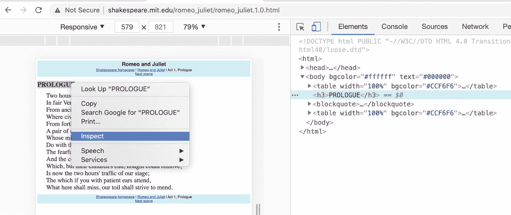

图 4-3 在 Chrome 开发者工具中检查网页的 HTML 代码

你可以在图 4-2 和 4-3 中看到，`<h3>PROLOGUE</h3>` 看起来是一样的。这是因为 BeautifulSoup 完全重建了网页的 HTML 标记结构。每个 `<>` 标签都是我们保存在 `data` 变量中的 BeautifulSoup 对象的一个属性。这意味着我们可以通过标签从页面对象中抓取元素。尝试在 Jupyter 单元格中运行 `data.h3`，你会看到文本 `PROLOGUE`。

BeautifulSoup 中有两个主要函数用于从 HTML 结构中提取元素：`find()` 和 `find_all()`。区别很简单：`find()` 查找一个元素，而 `find_all()` 将获取所有符合标准的元素。对 `find()` 和 `find_all()` 运行 help 命令，查看它们接受的所有可用参数：

```python
help(data.find)
help(data.find_all)
```

方法 `find()` 和 `find_all()` 将 HTML 标签作为参数来查找页面上的元素。其他元素属性，如 class 或 color，可用于精确定位网页上的项目。例如，运行语句 `data.find("h3")`。方法 `find()` 将查找包裹在 `<h3>` 标签中的元素。结果将是文本 `PROLOGUE`。方法 `find()` 一次处理一个元素；如果存在多个具有相同标签的项目，它将获取第一个。

现在，在浏览器中选中网页上诗歌的所有行，点击右键，然后检查选中的行。你可以看到 Chrome 开发者工具窗口中的所有行都被 `<a>` 标签包围。以 `<a>` 标签作为第一个参数的方法 `find_all()` 将获取所有这些行的列表。记住，`find_all()` 总是返回一个列表，即使它没有找到任何东西。

```python
alist = data.find_all("a")
```

在图 4-4 中，你可以看到我们已经获取了所有包裹在 `<a>` 标签中的行。

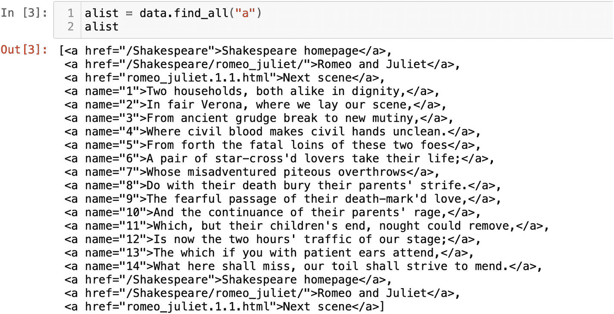

图 4-4 带有 HTML `<a>` 标签的文本元素

列表中获取的行带有 `<a>` 标签和 `href`（超文本引用）。我们需要从文本中移除标签和其他属性。在 BeautifulSoup 库中，有一个方法 `get_text()` 可以从 `<>` 标签中提取字符串。我们需要将其应用于 `alist` 中的每个项目以获取干净的文本。

```python
for item in alist:
    print(item.get_text())
```

如果我们需要从网页中抓取特定的一行怎么办？例如，从整首诗中获取 "From forth the fatal loins of these two foes" 这段文本。第一步是选中该文本并在 HTML 代码中进行检查（图 4-5）。

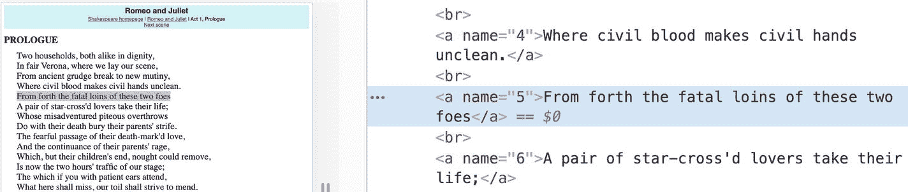

图 4-5 在 Chrome 中定位并检查文本中的一行

第二步是调查 Chrome 开发者工具中的元素，如图 4-5 右侧所示，并找到我们可以用来获取文本的钩子。文本 `"From forth the fatal loins of these two foes"` 被 `<a>` 标签包围，并且有一个属性 `name=5`。同样，我们不需要知道 `name=5` 是什么意思。⁶ 这是构建网站的开发者使用的某个属性。我们关心的只是一个对于我们想要获取的文本来说是唯一的组合。如果我们只在 `find()` 中使用一个标签，那么它会获取包裹在 `<a>` 标签中的第一个元素。幸运的是，`name=5` 对于我们需要的文本行是唯一的。使用 `find()` 方法，我们将 `<a>` 标签作为第一个参数传递，因为 `"From forth the fatal loins of these two foes"` 以此开头，并且作为第二个参数，我们将传递 `name=5`。属性应以字典的形式传递，如下所示：

```python
element = data.find("a", {"name": 5})
```

我们已经获取了文本，并使用 `get_text()` 方法对其进行了清理（图 4-6）。

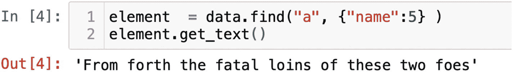

图 4-6 通过使用 `find()` 方法和 HTML 属性获取文本行

如你所见，整个网页抓取过程概括起来包括以下步骤：

1. 使用 Requests 库的 `get()` 方法从服务器获取数据。
2. 将接收到的数据传递给 `BeautifulSoup()` 函数；它将数据解析为一个看起来像 HTML 网页结构的对象。
3. 在浏览器中检查你需要抓取的元素。
4. 使用 `find()` 或 `find_all()`，通过标签和属性等钩子获取文本。

现在我们已经学习了网页抓取的基本步骤，我们可以攻克一个热门网站 [investing.com](http://investing.com)。Investing.com 提供每个交易者在交易日开始前需要了解的重要新闻。新闻页面的 URL 是 [`www.investing.com/news/`](http://www.investing.com/news/)。如果你在浏览器中打开该页面，你可以看到新闻标题和简短的预告。点击一个标题，它会带你到完整的文章。我们将开始收集标题和 `href`s（超文本引用），以便稍后能够访问完整的文章。`href` 只是一个指向某处的 URL。它们也被称为网页链接。

首先要做的是，我们需要获取网站。从导入开始：

```python
import requests
from bs4 import BeautifulSoup
```

请记住，大多数网站不希望向机器人提供信息。`requests.get()` 方法向服务器发送一条消息，这条消息大致是说“嗨，我是 Python”，而网站不希望响应 Python 机器人。为了绕过这一点，我们将使我们的信息请求看起来像是来自一个网页浏览器。这很简单；我们只需在发送给服务器的消息中提供不同的标头：

```python
headers = {'User-agent': 'Mozilla/5.0'}
```

标头作为关键字参数传入 `requests.get()` 方法，位于 URL 之后。`Mozilla/5.0` 是一个常见的浏览器令牌。当服务器收到包含该令牌的消息时，会将其视为常规的浏览器信息请求。你可以尝试在带和不带标头的情况下运行以下语句：

```python
page = requests.get("https://www.investing.com/news/", headers={'User-agent':'Mozilla/5.0'})
```

使用标头时，`requests.get()` 方法会返回响应 200（图 4-7）。

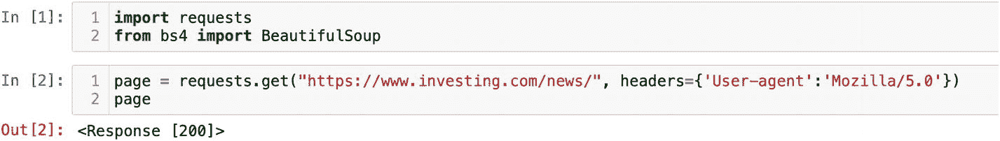

**图 4-7** 使用 `requests` 库从服务器收到的成功响应

成功的响应可以解析为一个 `BeautifulSoup` 对象：

```python
data = BeautifulSoup(page.content, "html.parser")
```

打印 `data` 以查看其中的内容。起初可能有些杂乱，其中包含大量 JavaScript 函数，但 `<!DOCTYPE HTML>` 清楚地表明我们处理的是 HTML（图 4-8）。请记住，[investing.com](http://investing.com) 是一个比我们之前处理过的网站更复杂的站点。

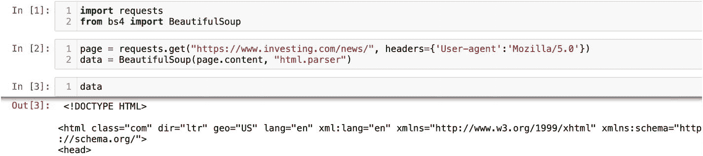

**图 4-8** 使用 `BeautifulSoup()` 函数解析从服务器接收的数据

切换回浏览器中的 [`www.investing.com/news/`](http://www.investing.com/news/) 页面。选择你喜欢的任何标题，将鼠标悬停其上，然后点击右键。我选择了 `"Oil Inventories Rose by 4M Barrels Last Week: API"`。点击“检查”，它将显示网页在底层的样子（图 4-9）。

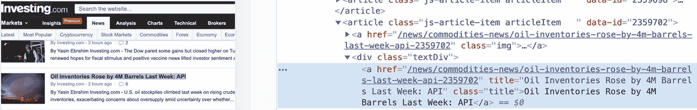

**图 4-9** 使用 Chrome 开发者工具检查一个标题

仔细观察高亮显示的 HTML 代码，你可以看到与你点击的完全相同的标题。在我的案例中，图 4-9 中显示的是 `"Oil Inventories Rose by 4M Barrels Last Week: API"`。这段文本被包裹在 `<a></a>` 标签内。一个 `<a>` 标签表示一个网页链接，紧接着我们看到 `class="title"` 属性。这看起来是一个独特的组合。我们的目标是抓取所有标题并收集也包含在 `<a>` 标签中的 href。`find_all()` 将是收集网页上所有标题的正确选择。作为第一个参数，我们将传递 `<a>` 标签，第二个参数将是 `class="title"`。此外，我们还需要包含 `href=True` 以收集 href：

```python
titles = data.find_all("a", class="title", href=True)
```

我们已经从网页上获取了所有包含 href 的标题（图 4-10）。

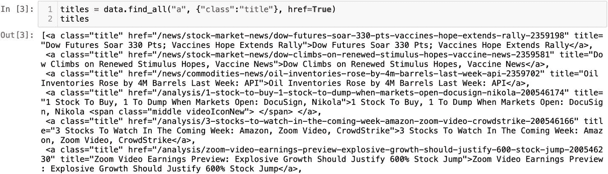

**图 4-10** 使用 `find_all()` 方法获取的标题列表

变量 `titles` 持有一个列表，我们可以逐项遍历以获取纯净文本并提取 href。每个标题及其对应的 href 应打包成另一个列表。然后，我们可以将所有包含标题和 href 的列表放入一个大列表中。最终，我们将得到一个列表的列表。我们需要列表的列表，以便稍后可以方便地获取标题和 href，并抓取完整的文章页面。从该文章或详情页面中，我们将提取文本片段。

我将创建一个新的 Python 列表 `clean_titles`，并将清理后的标题和 href（打包成一个单独的列表，放在变量 `small_list` 下）附加到其中，如下所示：

```python
clean_titles = [ ]
for item in titles:
    small_list = [item.get_text(), item["href"]]
    clean_titles.append(small_list)
```

`clean_titles` 列表包含许多小列表，每个小列表包含一个标题和一个指向完整文章的 URL（图 4-11）。

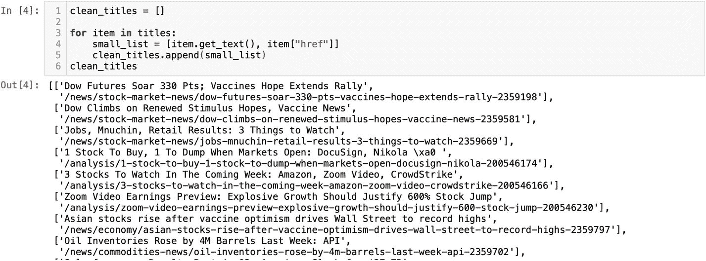

**图 4-11** 包含标题和 href 的列表的列表

在我们访问每个标题的 URL 之前，我们需要了解完整文章网页的 HTML 结构。让我们进一步调查；在浏览器中，点击任意标题，它应该会带你进入一篇完整的文章，或者正如网页开发者所说的，一个详情视图。

在完整的文章页面（图 4-12）上，我右键单击第一个段落，然后选择检查选项。

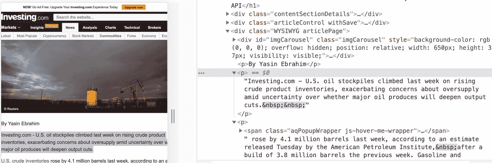

**图 4-12** 在 Chrome 开发者工具中检查完整的文章页面

在我的屏幕右侧（图 4-12），我看到整篇文章都被包裹在 `<p>` 标签（段落）内。如果我们想获取完整文章，我们需要使用 `find_all()` 方法，并以 `<p>` 标签作为参数。要获取每篇文章的段落，我们将创建一个小小的网络爬虫。我们已有所有文章的 URL，需要逐页访问以从每个对象中抓取文本片段。当我们抓取一个网页时，我们将使用 `BeautifulSoup()` 函数解析数据，并应用 `find_all()` 方法。

使用 `for` 循环，我们将遍历 `clean_titles` 列表，并使用 `requests.get()` 抓取每个 URL，就像我们之前做的那样：

```python
for item in clean_titles:
    url = item[1]
    page = requests.get("https://www.investing.com{}".format(url), headers={'User-agent':'Mozilla/5.0'})
    print("now fetching", "https://www.investing.com{}".format(url))
```

`clean_titles` 中的每个项代表一个列表，我们需要通过索引 `item[1]` 提取第二个元素，即 URL。要抓取文章，我们需要重建完整的 URL，从 [`https://www.investing.com`](https://www.investing.com) 开始。在 `requests.get()` 方法中，我将 [`https://www.investing.com`](https://www.investing.com) 与 `clean_titles` 列表中 URL 的其余部分拼接起来。不要忘记添加标头。最后的 `print` 语句不是必需的，但我喜欢查看它的工作方式，并确保我获取到了完整的 URL（图 4-13）。

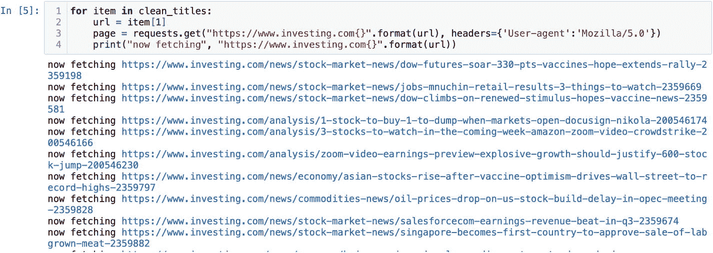

**图 4-13** 为每篇文章调用 URL

在 `for` 循环的作用域内，我们需要对每个 `page` 对象使用 `BeautifulSoup()` 函数。我们将每篇文章页面的 HTML 结构保存在变量名 `article` 下。最后一步是对 `article` 对象应用带有 `<p>` 标签的 `find_all()` 方法。`find_all()` 方法返回一个列表，我们将其保存在 `list_article` 名下。在这里，我想暂停一下，介绍一个概念，它在未来会为我们节省时间——列表推导式。