# 列表推导式

列表推导式是一种 Python 语法，可以使你的代码运行得更快。这在处理大量数据时尤其重要。在需要抓取数千个网页时，我倾向于使用列表推导式来收集信息。

在我们讲解列表推导式语法之前，我想让你做一个简单的练习。假设我们有一个 `alist`，里面装满了数字。我们想过滤它，找出所有 `5`。然后我们需要将所有 `5` 保存到一个新列表中。让我们将其命名为 `blist`。解决方案是：

```python
alist = [1,2,3,5,5,5,6,7,5,5]
blist = []
for number in alist:
    if number == 5:
        blist.append(number)
```

我们遍历列表以查找 `5`。如果找到 `5`，我们会使用列表方法 `append()` 将其添加到 `blist` 中。`append()` 方法在 Python 中是以模块形式实现的，每次我们获取到 `5` 时调用它都需要耗费一定时间。为了让这段代码运行得更快，我们可以跳过 `append()` 方法，将解决方案重写为列表推导式。同样的查找 `5` 的示例如下：

```python
blist = [ number for number in alist if number == 5 ]
```

整个语句被包裹在方括号中，结果会以列表形式返回。这就是我们不再需要 `append()` 方法的原因。列表推导式语句的结果始终是列表类型，在我们的例子中，它被保存为 `blist`。列表推导式的速度大约是使用 `append()` 方法的两倍，当列表元素超过 10,000 个时，你就能感受到这种差异。

一个简单列表推导式的语法包含三个部分：`for` 循环、过滤器和表达式。过滤器是可选的：

```python
[ expression for loop filter ]
```

如果你将第一个解决方案与列表推导式的方案进行比较，你会发现它们几乎相同。方括号中的方案以表达式开头。在我们的例子中，表达式就是数字本身，因为我们只想在值等于 5 时保留这个值。在其他情况下，你可能想做些别的事情，比如当值等于 5 时将 `number` 乘以 10。然后我们使用相同的 `for` 循环，在其中定义了 `number` 变量。过滤器是一个 `if` 语句。有时你需要它，有时则不需要。如果需要 `if` 语句，就将其紧跟在 `for` 循环后面。

让我们再看一个例子；假设我们需要获取 `alist` 容器中的所有数字并将它们乘以 `10`。在这种情况下，我们不需要过滤器，列表推导式如下所示：

```python
blist = [ number * 10 for number in alist ]
```

你需要记住，列表推导式始终返回一个列表数据结构。通过将列表推导式语句赋值给一个变量，即可保存该列表。

现在，让我们带着列表推导式的语法回到我们的网页抓取示例中。我们的最终目标是将标题和文章摘要写入到一个文本文件中。为了使过程更顺畅，我们将使用列表推导式 `[ p.get_text() for p in list_article]` 从 `list_article` 中的所有条目中剥离 `<p>` 标签。这个列表推导式的结果将是一个字符串列表。为了连接列表中的所有字符串，我们将使用字符串方法 `join()`。我注意到每篇完整文章的第一个 `<p>` 标签包含“没有找到匹配您搜索的结果”。由于我们抓取了所有 `<p>` 标签，这条消息会作为 `list_article` 中的第一个条目。我们不需要它，因此将从 `list_article[1:]` 的第二个元素开始将其切片去除。

我们将在同一时间完成整个清洗和连接操作，如下所示：

```python
clean_article = " ".join([p.get_text() for p in list_article[1:]])
```

`clean_article` 将是完整的文章。在 `for` 循环结束时，我们将每篇文章作为一个字符串追加到 `mega_list` 中：

```python
mega_list = [ ]

for item in clean_titles:

    url = item[1]

    page = requests.get("https://www.investing.com{}".format(url), headers={'User-agent':'Mozilla/5.0'})

    print("now fetching", "https://www.investing.com{}".format(url))

    article = BeautifulSoup(page.content, "html.parser")

    list_article = article.find_all("p")

    clean_article = " ".join([p.get_text() for p in list_article])

    mega_list.append(clean_article)
```

在图 4-14 中，你可以看到运行中的代码，在图 4-15 中，可以看到 `mega_list` 的一小部分。

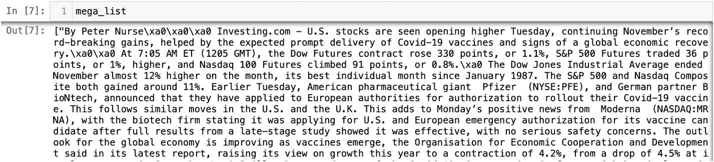

图 4-15
解析并清洗每篇文章的信息

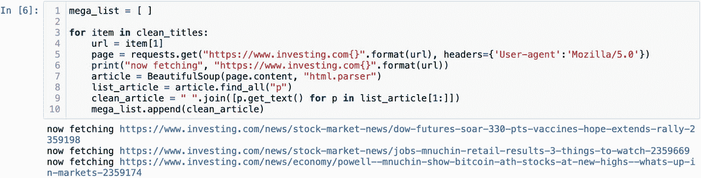

图 4-14
从 investing.com 收集文章

最后一部分是以文本格式创建报告。我们将使用 `zip()` 函数来组合 `clean_titles` 和 `mega_list` 列表：

```python
final_list = list(zip(clean_titles, mega_list))
```

在将数据写入文本文件之前，我们会对它进行一些格式化并打印出来，以确保一切看起来没问题。

我们可以在变量名 `TEMP` 下创建一个字符串模板：

```python
TEMP = """

Title: {}

Snippet: {}

URL: {}

"""
```

这个模板将很好地格式化文章标题、不超过 300 个字符的文章摘要，以及用于阅读完整文章的 URL。

我们将从 `final_list` 容器中将所有这些信息传递到 `TEMP` 中：

```python
for item in final_list:

    title, url = item[0]

    url="https://www.investing.com{}".format(url)

    snippet = item[1][:300]

    print(TEMP.format( title, snippet, url))
```

`final_list` 列表包含包含两个列表的元组。我们为元组中的第一个列表分配两个变量名：

```python
title, url = item[0]
```

为了获得一个完全可点击的 URL，我们将添加 `www.investing.com`：

```python
url = "https://www.investing.com{}".format(url)
```

然后从第二个列表中截取前 300 个字符。你可以根据需要看到的摘要长度更改此数字：

```python
snippet = item[1][:300]
```

最后，通过 `format()` 方法将变量传递到 `TEMP` 中（图 4-16）。

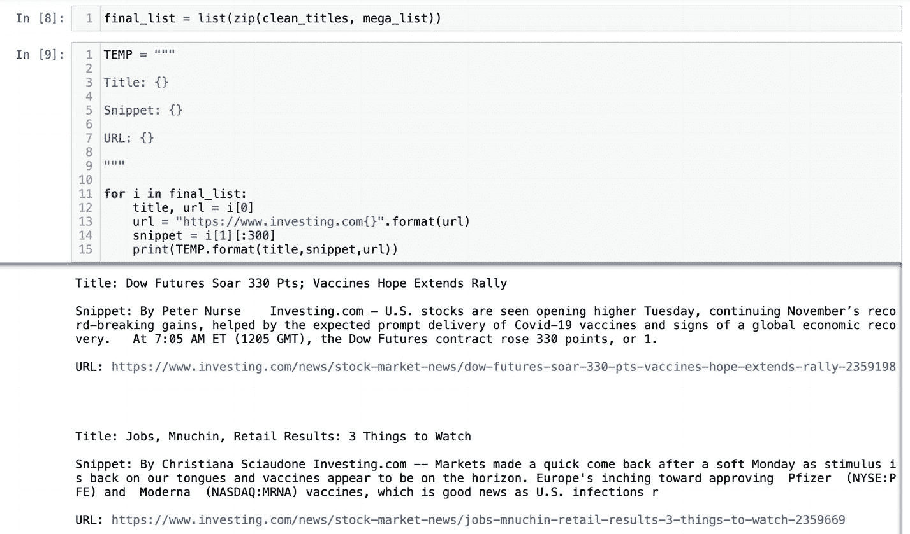

图 4-16
使用模板将文本格式化为可读格式

如果看起来不错，我们可以将 `TEMP` 写入一个文本文件。为此任务，我们将使用 `open()` 函数初始化一个新的 `report` 对象：

```python
report = open("report.txt", "w")
```

最后，将 `TEMP.format( title, snippet, url)` 传递到 `write()` 方法中：

```python
for item in final_list:

    title, url = item[0]

    snippet = item[1][:300]

    print(TEMP.format( title, snippet, url))

    report.write(TEMP.format(title,snippet,url))
```

# 使用 Selenium 进行网页抓取

现代网站严重依赖 JavaScript 库，这些库可以在不重新加载网页的情况下更新信息。我不想深入探讨 Web 开发，因为这超出了本书的范围。简而言之，网页上的某些元素是在用户端生成的，而 `BeautifulSoup` 无法捕获它们。在这种情况下，我们需要使用 `Selenium` 来模拟浏览器的体验。最初，`Selenium` 是为 Web 应用程序测试而开发的，但很快就成为自动化和数据收集的流行工具。`Selenium` 的功能允许模拟鼠标和键盘操作。您可以编写脚本来通过鼠标点击翻页，并在网页上的在线表单中输入信息。

不幸的是，`Anaconda` 并未自带 `Selenium`，您需要单独安装它。`Selenium` 是一个第三方库，要安装它，我们需要一个包管理器，例如 `PIP` 或 `Conda`。

Python 包管理器或 `PIP` 是一种简单可靠的、用于查找和安装 Python 库的内置辅助工具。尽管 `PIP` 是最新 Python 版本中的标准功能，但有时您需要启动它。

在 Mac 上，您需要在搜索提示或 `Launchpad` 的 `其他` 应用中搜索 `Terminal`。请不要使用运行 `Anaconda` 内核的 `Terminal` 窗口。请确保在 `Terminal` 中，通过菜单 `Terminal` ➤ `Shell` ➤ `新建窗口` 打开一个全新的窗口。

在那个新的空 `Terminal` 窗口中，运行 `pip --version` 命令来检查您机器上的 `PIP` 版本：

```
pip -- version
```

如果由于某种原因，您收到错误信息 `"pip command not found"`，请使用以下代码启动 `PIP`：

```
sudo easy_install pip
```

`Sudo` 命令会提示您输入计算机管理员安装权限的密码，然后启动 `PIP`。如果 `sudo easy_install pip` 不起作用，请打开 [python.org/downloads](http://python.org/downloads) 并从官方 Python 下载页面安装 Python。然后再次重复 `sudo easy_install pip` 命令。

Windows 用户点击位于左下角的搜索提示并输入名称 `CMD，命令提示符`。`CMD` 缩写应能打开一个命令提示符窗口。要查看您是否已安装 `PIP` 或是否需要安装 `PIP`，请在命令提示符中运行以下命令：

```
pip -- version
```

如果得到带有版本号的响应，则说明您的计算机上已安装 `PIP`；否则，您需要下载 `PIP` 模块。

如果您收到 `"pip command not found"` 消息，请前往官方 Python 页面 ([www.python.org/downloads](http://www.python.org/downloads)) 并下载最新版本的 Python。当您开始安装过程时，在第一个屏幕上选中底部的 `"Add Python 3.9 to PATH"` 选项（图 4-18）。安装过程完成后，关闭并重新打开 `CMD` 提示符。

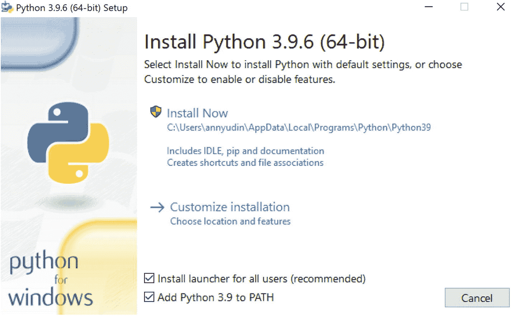

图 4-18 在 Windows 上安装 Python 并将其添加到 PATH

再次尝试 `pip -- version` 命令。如果问题仍然存在，请下载 `get-pip.py` 文件。通常，我建议将 `get-pip.py` 文件保存到 `Downloads` 文件夹。要从 `get-pip.py` 文件安装 `PIP`，您需要打开一个新的 `CMD` 窗口，并使用 `CMD` 命令 `cd`（更改目录）导航到 `Downloads` 目录：

```
cd Downloads
```

进入 `Downloads` 目录后，执行 `get-pip.py` 文件：

```
python get-pip.py
```

现在，`pip -- version` 命令应该可以工作了，您可以使用 `pip install <package>` 语句来安装 Python 库。在极少数情况下，`PIP` 命令仍然引发错误消息，请参考 [`packaging.python.org/tutorials/installing-packages/`](https://packaging.python.org/tutorials/installing-packages/) 上的官方 Python 文档。假设 `PIP` 已就位，我们准备安装 Python 包。要将第三方库添加到 `Anaconda`，我建议直接从 `Anaconda Navigator` 打开 `Terminal` 或 `命令提示符`。

第 1 步. 在 `Anaconda Navigator` 的左侧菜单中，点击 `Environments` 并导航到 `Base (root)`。

第 2 步. 在 `Base (root)` 的右侧应该有一个 `播放` 按钮。点击那个 `播放` 按钮，您会看到一个菜单，第一个选项是 `打开终端`。

第 3 步. 通过点击 `打开终端` 来启动一个 `Terminal` 窗口。紧接着，应该会弹出一个新的 `Terminal` 窗口。

第 4 步. 在 `Terminal` 窗口中，运行 `PIP` 命令来安装 `Selenium` 或任何其他库：

```
pip install selenium
```

除了安装 `Selenium` 本身，我们还需要下载 `Chrome` 驱动。`Selenium` 可以用于任何 Web 浏览器。由于其流行度和内置的开发者工具，在本文示例中我们将使用 `Chrome` 浏览器。在下载驱动程序之前，请检查您机器上安装的浏览器版本。您可以在 `Chrome` 设置中的 `关于 Google Chrome` 部分找到此信息。我们关心的是长版本号的前两位数字。目前，我的 Mac 上运行的是 `Chrome` 浏览器 87 版。

牢记此信息，从 [`chromedriver.chromium.org/downloads`](https://chromedriver.chromium.org/downloads) 找到并下载适合您操作系统的驱动程序。我绝对建议，如果您在 [`chromedriver.chromium.org/downloads`](https://chromedriver.chromium.org/downloads) 页面的“当前版本”部分找不到您的 `Chrome` 浏览器版本，请更新 `Chrome` 浏览器。驱动程序以 `zip` 文件形式压缩。解压并将 `ChromeDriver` 保存到您的 `Jupyter` Notebook 或 Python 文件所在的同一目录。请确保您知道 `ChromeDriver` 的保存位置，因为您需要提供其完整的相对路径。

## Selenium 简介

我想从一个 [amazon.com](http://amazon.com) 的抓取示例开始介绍 `Selenium`。我们将打开 [amazon.com](http://amazon.com) 上的任意产品页面，并收集该产品的信息。打开一个新的 `Jupyter` Notebook，在导入 `Selenium` 后，将其连接到 `ChromeDriver`：

```
from selenium.webdriver import Chrome
```

我将创建一个变量 `driver_path` 并指定 `ChromeDriver` 的相对路径。`Chapter4` 是存放 `Jupyter` 文件和 `ChromeDriver` 的文件夹，`programwithus` 是我的主目录。请注意，引号前的小 `r` 对于某些 Windows 用户可能是必需的，对于 Mac 用户则是可选的。另外，Windows 用户需要包含带有 `.exe` 扩展名的完整文件名，例如 `chromedriver.exe`。

对于 Mac 用户

```
driver_path = "/Users/programwithus/Chapter4/chromedriver"
```

对于 Windows 用户

```
driver_path = r"C:\Users\programwithus\Chapter4\chromedriver.exe"
```

最终的 `report.txt` 文件应该如图 4-17 所示。

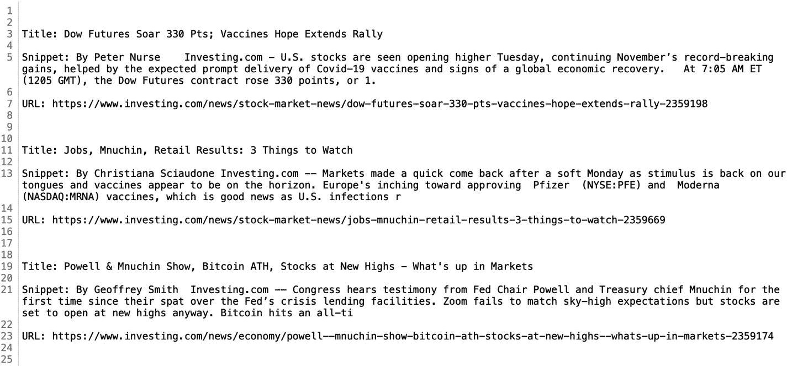

图 4-17 网页抓取操作的最终输出存储在文本文件中

如你所见，网页抓取过程本身并不复杂。我认为它更耗时。你需要花一些时间来寻找正确的标签和属性以提取元素。此外，数据清洗也需要一些时间。请记住，网站会进行维护，开发者可能会重命名属性或更改网站布局。如果该网站的开发者更改了一些内容，代码将无法运行，我们将不得不从头开始整个操作。


`driver_path = r"/Users/programwithus/Chapter4/chromedriver.exe"`

在同一个单元格中，将`driver_path`传入我们从 Selenium 导入的`Chrome()`函数中：

```
page = Chrome(executable_path=driver_path)
```

运行该单元格后，`Chrome()`函数应会启动一个浏览器窗口，窗口顶部会显示一条提示：“Chrome is being controlled by automated test software”（Chrome 正受自动测试软件控制）。现在，`page`变量保存了由 Python 代码管理的浏览器实例。如果你遇到了`FileNotFoundError`错误，并附带消息`"chromedriver executable needs to be in PATH"`（chromedriver 可执行文件需位于 PATH 中），请检查`driver_path`并确保其正确指向 ChromeDriver 文件。

如果浏览器窗口弹出，你就可以开始抓取数据了。抓取过程本身与我们之前使用`BeautifulSoup`所做的工作类似。首先，我们需要获取网站内容。`page`变量将保存 Python Selenium 对象。然后，在 Selenium 对象中找到 HTML 元素的钩子。只是这次，Selenium 的`Chrome()`函数将替代`requests.get()`方法和`BeautifulSoup()`函数。

导航至 [amazon.com](http://amazon.com) 并选择你喜欢的任意产品。我选择了 Ring Video Doorbell（可视门铃）。你可以在这里看到它：[`www.amazon.com/dp/B08N5NQ869`](http://www.amazon.com/dp/B08N5NQ869)。你可以在此示例中选择 [amazon.com](http://amazon.com) 上的任意产品。

通常，亚马逊的 URL 比 [`www.amazon.com/dp/B08N5NQ869`](http://www.amazon.com/dp/B08N5NQ869) 要长得多。亚马逊和其他大公司会收集大量关于其客户的营销信息——例如请求来源的地区、浏览器和时区等信息——并将这些信息以`?`符号后的参数形式添加到 URL 中。这些`?`符号后的额外参数对我们来说并不重要，可以移除。简而言之，亚马逊上销售的任何产品都有一个 ASIN（亚马逊标准识别码），这是一个唯一标识符。ASIN 编号是产品 URL 中`/dp/`之后的部分。

事实上，任何 URL 通常都包含某种唯一标识符，可能是数字 ID 或 slug（短码）。slug 是 URL 中指向特定信息的一个独特部分。例如，URL [`www.cnn.com/style/article/new-years-eve-ball-design-history/index.html`](http://www.cnn.com/style/article/new-years-eve-ball-design-history/index.html) 中包含一个唯一的 slug `new-years-eve-ball-design-history`，它指向 [cnn.com](http://cnn.com) 上题为“A brief history of the Times Square New Year's Eve ball drop”（时代广场新年落球仪式的简史）的文章。因此，如果你试图获取某个网页，花几分钟时间理解你想要抓取信息的网站的 URL 模式是值得的。

在亚马逊上，所有产品都存储在 ASIN 下的数据库中，可以通过 [`www.amazon.com/bp/`](http://www.amazon.com/bp/) 加上 ASIN 来访问。亚马逊 URL 中的其他任何内容都是可选参数。

向亚马逊服务器发送请求以获取 [`www.amazon.com/dp/B08N5NQ869`](http://www.amazon.com/dp/B08N5NQ869) 这个 URL，需要使用 Selenium 的`get()`方法：

```
page.get("https://www.amazon.com/dp/B08N5NQ869")
```

`get()`方法将启动一个浏览器窗口，并返回 Ring Video Doorbell 网页的一个实例（图 4-19）。

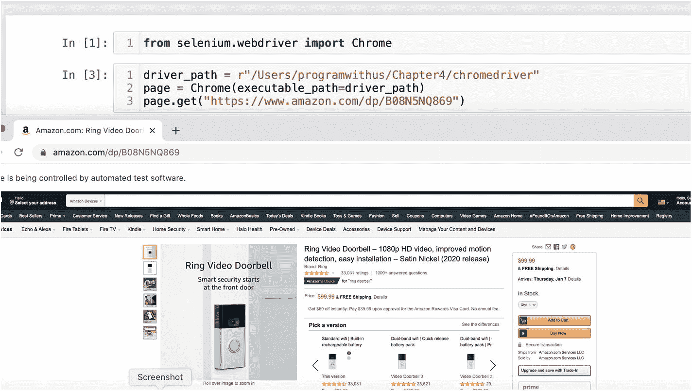

图 4-19 Selenium 已接管 Chrome 浏览器并打开了一个产品页面

假设我们要从页面中收集产品名称和价格。查找 HTML 钩子的过程将与我们之前所做的一样。导航至产品名称，单击鼠标右键，然后在 Chrome 开发者工具中检查该元素。

如图 4-20 所示，Chrome 开发者工具中的产品名称与页面上的标题完全匹配。

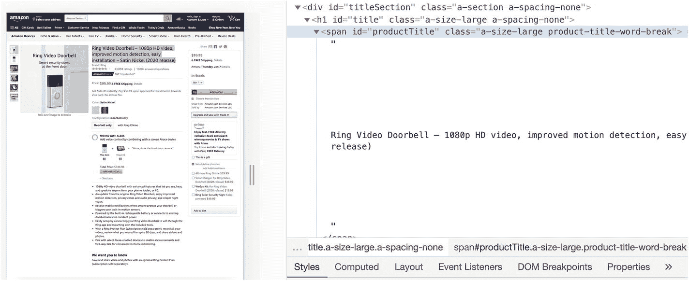

图 4-20 使用 Chrome 开发者工具检查网页元素

如果因某些原因你无法在浏览器中看到高亮显示的标题，请再次点击“检查”文本。

我们需要选择一个 HTML 标签来据此抓取元素。像前面的例子一样，我们可以根据类（class）来获取 HTML 元素。但是，我认为`"a-size-large"`类（图 4-20）可能在该页面的其他地方也被使用了。`Id`属性会是更好的选择，因为`id`是唯一的。`"productTitle" id`在同一页面的 HTML 代码中不能再次使用。要通过`id`获取标题，我们需要使用 Selenium 的`find_element_by_id()`方法。你既可以查阅文档^(⁸)，也可以通过对`page`变量下存储的对象运行`dir()`函数，来找到所有可用的 Selenium 定位元素方法：

```
dir(page)
```

`find_element_by_id()`方法易于使用。你只需传递元素的`id`属性即可。Selenium 的定位元素方法返回对象，将它们转换为字符串需要使用`text`方法。

在同一个单元格中，创建变量`title`来保存产品名称，并使用`find_element_by_id()`方法获取信息：

```
title = page.find_element_by_id("productTitle")
title = title.text
print(title)
```

同样的过程可以用来获取产品的价格。如果我们指向价格并检查它，我们会看到亚马逊对 $99.99 这个值使用了`priceblock_ourprice`这个`id`。请注意，如果你期望的是亚马逊上的不同产品页面，价格可能对应不同的`id`属性。根据我的研究，他们也会使用`"priceblock_dealerprice"`。

在同一个单元格中，我将获取产品的价格。这次，我会将`text`方法链式调用到`page.find_element_by_id()`后面：

```
price = page.find_element_by_id("priceblock_ourprice").text
print(title, price)
```

到目前为止，你可能已经打开了两三个 Chrome 浏览器。在我们获取到所需信息后，使用`close()`方法将会关闭浏览器。

在图 4-21 中，你可以看到我们获取到的产品名称和价格。

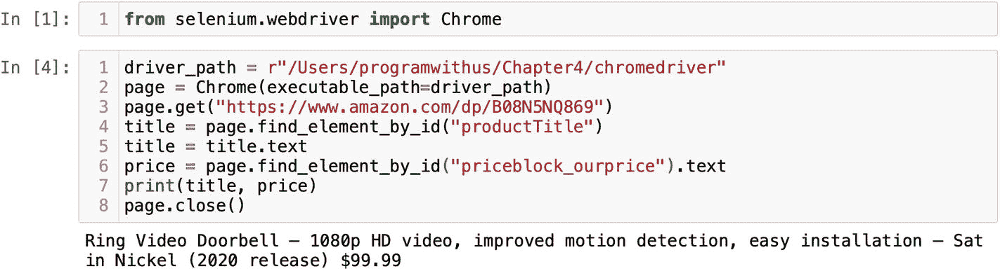

图 4-21 从 [amazon.com](http://amazon.com) 获取产品的名称和价格

Selenium 是一个真正的自动化解决方案。除了从 HTML 中抓取数据，你还可以填写 Web 表单和模拟鼠标点击。让我们考虑一个收集亚马逊上所有 Ring Video Doorbell 可用信息的示例。我们的第一步是找到该类别中的所有 ASIN 编号。

在亚马逊页面的顶部，有一个搜索提示框。我们可以对 Selenium 进行编程，让它插入我们感兴趣的产品名称并提交搜索。为此，我们需要使用 Selenium 的`Keys`模块。`Keys`模块实现了所有主要的键盘功能。

在上方单元格中，紧挨着 Selenium Chrome 函数的下方导入`Keys`模块并重新运行该单元格：

```
from selenium.webdriver import Chrome
```


from selenium.webdriver.common.keys import Keys

在下一个单元格中，暂时注释掉 `title` 和 `price` 语句，并将我们一直使用的产品 URL 替换为 [`www.amazon.com`](http://www.amazon.com) 的亚马逊着陆页，如图 4-22 所示。

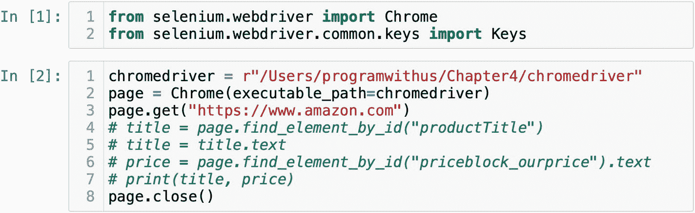

图 4-22 准备 Selenium 设置，以便在网页的输入提示框中输入值

在我们将期望的产品名称填入搜索提示框之前，我们需要在 HTML 代码中找到输入框。在 Web 浏览器中打开 [`www.amazon.com`](http://www.amazon.com)，将鼠标移动到文本框上，并右键单击以检查元素。找到我们可以用来在 HTML 中抓取元素的文本框属性。我认为 `id="twotabsearchtextbox"` 非常适合用来捕获文本框（图 4-23）。

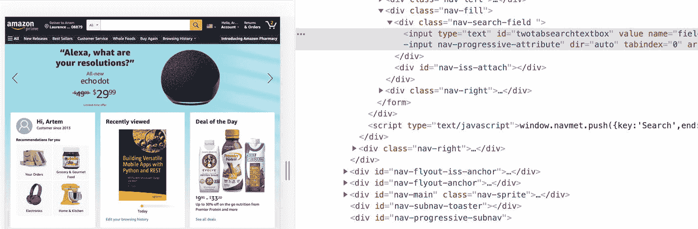

图 4-23 在 Chrome 开发者工具中检查网页元素

成功在 HTML 中定位到输入框后，使用 `send_keys()` 方法可以向该输入框输入任意文本：

```python
prompt = page.find_element_by_id("twotabsearchtextbox")
prompt.send_keys("ring video doorbell")
```

运行这段代码，确保它填写了搜索提示框。

如果一切正常，我们可以通过按下 `ENTER` 键来点击表单的提交按钮：

```python
prompt.send_keys(Keys.ENTER)
```

`Keys.ENTER` 会模拟键盘上的回车键操作，从而触发搜索动作。

在图 4-24 中，可以看到我们成功在输入框中输入了产品名称，并获取了该类别下的所有可用产品。Ring Video Doorbells 会列在另一个网页上。


图 4-24 运行 Selenium 脚本按类别名称查找产品

打开新的网页意味着整个检查流程要重新开始。为了收集所有可用 Ring Video Doorbells 的信息，我们需要从页面中获取所有 ASIN 产品编号，以便后续逐一提取。高亮页面上的一个项目，并尝试弄清楚如何抓取 ASIN 编号。显然，每个项目都包裹在 `<div>` 标签（一种通用的 HTML 容器）中，并带有一个 `data-asin` 属性（图 4-25）。`data-asin` 属性在 `<div>` 容器内保存了产品的 ASIN 编号。你可能会问，是否必须使用 `data-asin` 属性，或者有没有其他方法来捕获元素？也许还有其他方法可以提取出所需元素。我鼓励你去尝试。`data-asin` 属性只是这个特定示例中特有的。在其他情况下，在不同的网页上，会有其他属性或 HTML 标签。此外，未来亚马逊的开发人员可能会用其他内容替换 `data-asin` 属性。这就是为什么检查是网络爬虫过程中的一个关键部分。网络爬虫的核心就是研究和寻找能帮助你抓取元素的 HTML 钩子。我花了几分钟才意识到，在我们的例子中，`data-asin` 可以用于从页面获取 ASIN。

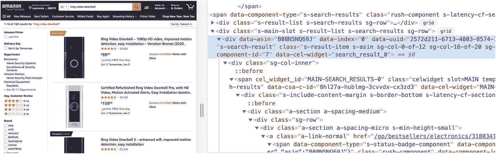

图 4-25 在 Chrome 开发者工具中检查包含产品信息的 div 容器

直接捕获 `data-asin` 属性并非易事。解决方案是获取页面上每个产品的整个 `<div>` 容器，然后提取 `data-asin` 属性的值。任务变得更复杂了；我们需要获取的 `<div>` 容器没有唯一的 `id`（图 4-24），因此需要使用另一种 Selenium 方法。在 `page` 对象上运行 `dir()` 函数，在列出的所有方法中，你应该能看到 `find_elements_by_class_name()` 方法。借助 `find_elements_by_class_name()` 方法，我们可以获取页面上所有包含类 `"s-result-item"` 的 `<div>` 容器（图 4-25）：

```python
asin_numbers = page.find_elements_by_class_name("s-result-item")
```

`find_elements_by_class_name()` 方法返回一个存储在 `asin_numbers` 变量中的 Selenium 元素列表。你可以通过应用文本方法将它们转换为字符串：

```python
rings = [item.text for item in asin_numbers]
```

或者像这样提取 `data-asin` 属性：

```python
asin_list = [item.get_attribute('data-asin') for item in asin_numbers]
print(asin_list)
```

使用 `get_attribute('data-asin')` 之后，我们从该页面获取的所有 ASIN 编号都存储在 `asin_list` 中（图 4-26）。没有 `data-asin` 属性的容器返回了空字符串 ‘ ’。这没关系；我们稍后会处理这些空值。

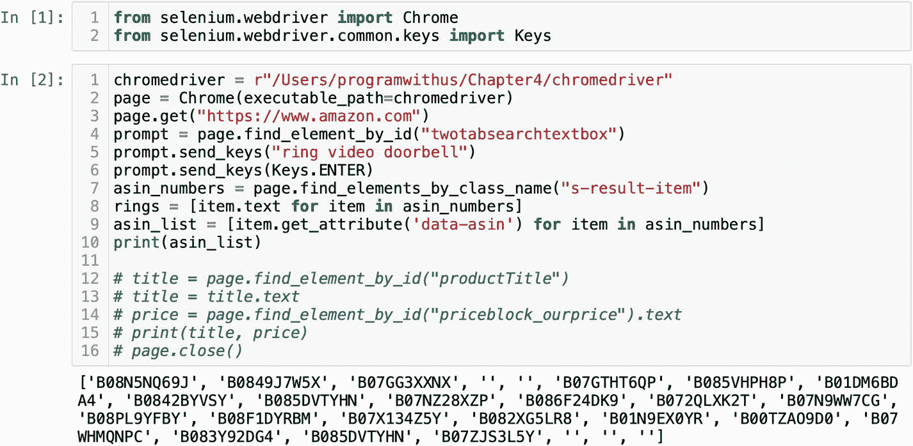

图 4-26 获取网页上所有产品的 ASIN 编号

收集完 Ring Video Doorbells 的 ASIN 编号后，我们可以获取每个产品的详细信息，并将信息存储到 CSV 文件中。

Python 自带用于处理 CSV 文件的 CSV 模块。我们将使用它来将收集到的信息写入 CSV 文件。由于 CSV 是内置模块，无需下载和安装。但我们仍然需要在代码上方的单元格中导入它：

```python
import csv
```

为了获取列表中每个 Ring Video Doorbell 的详细信息，我们需要访问产品页面，并从每个页面抓取标题和价格。同时，我们还将收集每个产品页面的描述信息。之前我们已经成功获取了产品的标题和价格。现在我们需要检查 [`www.amazon.com/dp/B08N5NQ869`](http://www.amazon.com/dp/B08N5NQ869) 页面上的要点列表，以抓取产品详细信息。看起来所有要点都位于 `id="feature-bullets"` 的 `<div>` 容器中。使用熟悉的 Selenium 方法 `find_element_by_id()`，我们将抓取它们。

是时候将所有语句整合起来了。我们将组装一个小型爬虫，从在亚马逊上查找产品到保存数据，收集产品信息。我会逐步进行，然后发布完整的解决方案。我们上次停留在包含许多 ASIN 编号的列表上。我们将遍历这个列表，并将每个 ASIN 编号附加到 [`www.amazon.com/dp/`](http://www.amazon.com/dp/) URL 后面，以获取亚马逊产品页面。在现实中进行网络爬虫抓取信息时，很多事情都可能出错。Wi-Fi 可能会断连，或者亚马逊停止支持某个产品。此外，某些元素可能不返回任何值，就像我们在 `asin_list` 中看到的空字符串一样。其中任何一个问题都可能使我们的代码崩溃。这会中断整个流程，由于一两个坏的 URL 或页面，我们将无法获取其他数据。当你试图访问数千个页面，而一件小事就导致正在运行的代码停止时，这是非常令人沮丧的。为了避免这种情况，并在遇到障碍时继续执行代码，我们将每条语句包裹在 `try` 和 `except` 块中。

异常处理是避免在 Python 代码返回错误信息后停止执行的一种好方法。让我用我们的亚马逊示例来解释异常处理：

```python
for number in asin_list:
    try:
        page.get("https://www.amazon.com/dp/{}".format(number))
        print("fetching {}".format(number))
    except:
        print("could not get the page for {}".format(number))
```

在代码中，我们遍历了`asin_list`中收集的所有 ASIN 编号，并将每个唯一的编号传递给字符串方法`format()`，以将其追加到亚马逊 URL 中。Selenium 的`page.get()`方法会尝试从服务器拉取每个产品页面。如果亚马逊服务器返回有效响应，变量`page`会保存它，我们就可以从 Selenium 对象中解析元素。但是，如果 URL 损坏或服务器因某种原因无响应，代码不会显示错误消息并停止，而是跳转到`except`块并打印`"Could not get the page for some ASIN"`。如果`try`块中的语句失败，`except`块将防止错误。在`except`块中的所有语句执行完毕后，Python 会在`for`循环中继续正常执行。在前面的示例中，它将尝试获取`asin_list`中的下一个网页。`try`和`except`块是避免代码崩溃的一种非常流行的方式。它们通常用于捕获错误消息，以便稍后仔细查看问题所在。有时，专业开发人员会在`except`块中放置一个函数，向自己发送包含异常的消息，以便快速解决问题。

此外，在`for`循环中，我们将定义一个空列表。我们需要它来存储某个产品的所有抓取信息。如果我们遇到一个页面缺少`title`和`price`数据，我们会将它们定义为`None`：

```python
for number in asin_list:
    data = []
    title = None
    price = None
    try:
        page.get("https://www.amazon.com/dp/{}".format(number))
        print("fetching {}".format(number))
    except:
        print("could not get the page for {}".format(number))
```

接下来，我们将尝试获取产品标题；如果页面上没有`id="productTitle"`，`except`块会打印`"productTitle is not there"`。

```python
try:
    title = page.find_element_by_id("productTitle").text
except:
    print("productTitle is not there")
```

正如我之前提到的，价格元素有点棘手。亚马逊对价格元素使用不同的`id`属性。我找到了`id="priceblock_ourprice"`和`id="priceblock_dealprice"`。如果产品已售罄且产品页面显示`"Currently unavailable"`，则根本不会有价格元素。在这种情况下，`price`会被设置为`None`。

```python
try:
    price = page.find_element_by_id("priceblock_ourprice").text
except:
    print("priceblock_ourprice is not there")
try:
    price = page.find_element_by_id("priceblock_dealprice").text
except:
    print("priceblock_dealprice is not there")
```

产品标题和价格的结果应添加到`data`列表中：

```python
data.extend([title, price])
```

来自要点列表的产品描述将通过`id="feature-bullets"`获取，并按换行符保存到`bullets_list`中。`bullets_list`的值将扩展到同一个`data`列表中：

```python
try:
    bullets = page.find_element_by_id("feature-bullets").text
    bullets_list = bullets.split("\n")
    data.extend(bullets_list)
except:
    print("feature-bullets id is not there")
```

最后，我们将把`data`列表写入 CSV 文件。返回上文，使用函数`open()`定义一个文件对象。CSV 模块附带一个`write()`方法，该方法会将`data`列表作为一行插入到`amazon-results`文件中：

```python
csv_file = open("amazon-results.csv", 'w')
writer = csv.writer(csv_file)
```

由于某些页面在写入`data`之前没有产生结果，因此检查第一个元素是否不为`None`。如果`data`列表包含信息，则将其作为一行添加到`amazon-results.csv`文件中。以下`if`块应放置在`for`循环的作用域内：

```python
if data[0] != None:
    writer.writerow(data)
```

最后，在`for`循环之外，我们需要保存文件对象并关闭浏览器窗口：

```python
csv_file.close()
page.close()
```

最终，代码将生成`amazon-results.csv`文件，该文件保存在当前 Jupyter Notebook 所在的目录中。每个产品将写入单独的行，详细信息由逗号分隔。在图 4-27 中，您可以看到在 Excel 中打开的`amazon-results.csv`文件。

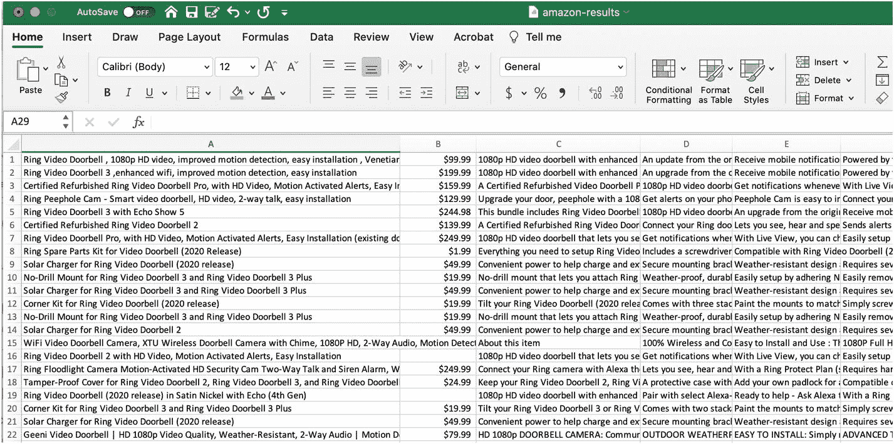

图 4-27 将结果保存到 Excel 文件中

正如我在此承诺的，您可以看到使用 Selenium 完成的亚马逊示例的完整解决方案：

```python
#importing packages
from selenium.webdriver import Chrome
from selenium.webdriver.common.keys import Keys
import csv

#initiating a csv file
csv_file = open("amazon-results.csv", 'w')
writer = csv.writer(csv_file)

#ChromeDriver PATH
chromedriver = r"/Users/programwithus/Chapter4/chromedriver"
page = Chrome(executable_path=chromedriver)

#openning amazon.com and gathering ASIN numbers for Ring doorbells
page.get("https://www.amazon.com")
prompt = page.find_element_by_id("twotabsearchtextbox")
prompt.send_keys("ring video doorbell")
prompt.send_keys(Keys.ENTER)
asin_numbers = page.find_elements_by_class_name("s-result-item")
rings = [item.text for item in asin_numbers]
asin_list = [item.get_attribute('data-asin') for item in asin_numbers]

#fetching details for each product and writing it into amazon-results.csv
for number in asin_list:
    data = []
    title = None
    price = None
    try:
        page.get("https://www.amazon.com/dp/{}".format(number))
        print("fetching {}".format(number))
    except:
        print("could not get the page for {}".format(number))
    try:
        title = page.find_element_by_id("productTitle").text
    except:
        print("productTitle is not there")
    try:
        price = page.find_element_by_id("priceblock_ourprice").text
    except:
        print("priceblock_ourprice is not there")
    try:
        price = page.find_element_by_id("priceblock_dealprice").text
    except:
        print("priceblock_dealprice is not there")
```

data.extend([title, price])

try:
    bullets = page.find_element_by_id("feature-bullets").text
    bullets_list = bullets.split("\n")
    data.extend(bullets_list)
except:
    print("feature-bullets id is not there")

if data[0] != None:
    writer.writerow(data)

# saving file and closing browser
csv_file.close()
page.close()

# 使用 API

到目前为止，我们一直在处理 HTML 网页。我在本章开头提到了客户端/浏览器与服务器之间的关系。浏览器接收 HTML 并将其呈现为图像和样式化的文本。作为人类，我们希望能够以美观多彩的方式查看信息。

还有其他客户端不需要查看图像和颜色。我说的是设备。向服务器发送请求的设备也是一个客户端。例如，现在你可以买到一台冰箱，当牛奶喝完时，它会向杂货店下订单要求送货。另一个例子是交换 Facebook 消息的智能手机，或者从服务器接收天气更新的汽车。

这些设备需要一种简单格式的数据，不带样式和颜色。它们使用的数据格式是 JSON（JavaScript 对象表示法），它以字符串形式提供。服务器可以根据请求客户端以 HTML 或 JSON 格式发送数据。

通常，JSON 来自 API（应用程序编程接口），这是一个专门为与计算机应用程序或设备通信而设计的接口。

如果你的工作是分析金融数据，那么你可以订阅彭博 API。另一方面，如果你从事数字营销工作，需要从 Google Analytics 获取信息，你将使用 Google Analytics Reporting API。事实上，Google 甚至有一个 Python 库来帮助开发者连接到他们的 API 并访问所有 Google 应用程序。我们将在本书后面部分使用它们。

所有 API 的设计都不同，大多数情况下，公司都有开发者文档来解释如何使用它们以及如何通过身份验证。有些 API 是免费的；其他的则需要订阅。

在这里，我们将研究一个非常流行的金融数据源，Alpha Vantage。在下面的示例中，我将向您解释使用 API 的主要原则。

## 获取 API 密钥

所有 API 提供商都需要某种形式的身份验证，Alpha Vantage 也不例外。与其他 API 服务相比，在 [`www.alphavantage.co/support/#api-key`](http://www.alphavantage.co/support/%2523api-key) 获取 API 密钥非常容易。你需要回答两个简单的问题并提供你的电子邮件地址。请务必获取你自己的 API 密钥，因为我在本书中使用的密钥将会过期。成功注册后，你应该会看到以下消息：

```
欢迎使用 Alpha Vantage！你的 API 密钥是：ZIIROPRQCMEREHR8。请将此 API 密钥保存在安全的地方，以便将来访问数据。
```

API 密钥同时充当用户 ID 和密码。API 密钥的作用是验证请求信息的个人或设备的身份。此外，如果这是一个付费服务，还需要确保账号没有欠费。

## 理解 API 文档

了解任何 API 都应该从 API 提供商的开发者文档开始。我们是 Alpha Vantage 服务的新手，从 [`www.alphavantage.co/documentation/`](http://www.alphavantage.co/documentation/) 开始是明智之举。

Alpha Vantage 提供了多个 API 来获取股票价格、公司基本数据、外汇、加密货币和技术指标。我们将使用 `TIME_SERIES_DAILY_ADJUSTED` API 来获取股票的历史每日价格。

演示 URL 看起来像这样：

```
https://www.alphavantage.co/query?function=TIME_SERIES_DAILY_ADJUSTED&symbol=IBM&apikey=demo
```

在浏览器中打开此参考链接，你将看到包含 IBM 股票 `开盘价`、`最高价`、`最低价`和 `收盘价` 的 JSON 数据。如果你仔细观察，会发现 JSON 类似于 Python 字典数据类型。

演示 URL 让我们很好地理解了如何使用它。API 端点中的 IBM 值可以替换为我们想要获取历史价格的任何其他股票代码。在 `apikey=demo` 参数中，`demo` 应更改为你已获取的 API 密钥。

## 使用 Python 获取股票数据

使用时间序列 API，我们将获取 AAPL 的历史价格并将其存储为 DataFrame。在一个新的 Jupyter 文件中，导入此示例需要的两个库，`Requests` 和 `Pandas`：

```python
import requests
import pandas as pd
```

我们需要将 API 密钥定义为字符串、API 的 URL 以及我们想要获取的股票：

```python
API_Key = "ZIIROPRQCMEREHR8"
url = "https://www.alphavantage.co/query?function=TIME_SERIES_DAILY_ADJUSTED&symbol={}&apikey={}"
stock = "AAPL"
```

在 URL 中，我已经将 `IBM` 符号和 `demo` 替换为 `{}`；稍后，我们将使用 `format()` 方法将我们自己的值插入其中。

首先，我们需要使用 `requests.get()` 方法向服务器发送请求。我们将传入 `stock` 变量（即 `"AAPL"`）和我们定义的 `API_Key`。Python 字符串方法 `format()` 使代码更简洁，并且将来可以轻松地将 `"AAPL"` 替换为任何其他股票代码：

```python
data = requests.get(url.format(stock, API_Key))
```

运行代码，`data` 将返回响应 `200`，这意味着一切正常，并且我们成功从 API 获取了信息。正如我之前提到的，Python 库 Requests 支持不同的数据类型，由于此 API 提供 JSON，我们将使用 `json()` 方法来提取值。你可以直接将 `json()` 链式调用到 `requests.get()`：

```python
data = requests.get(url.format(stock, API_Key)).json()
```

最后，我们从 Alpha Vantage API 收到的数据如图 4-28 所示。

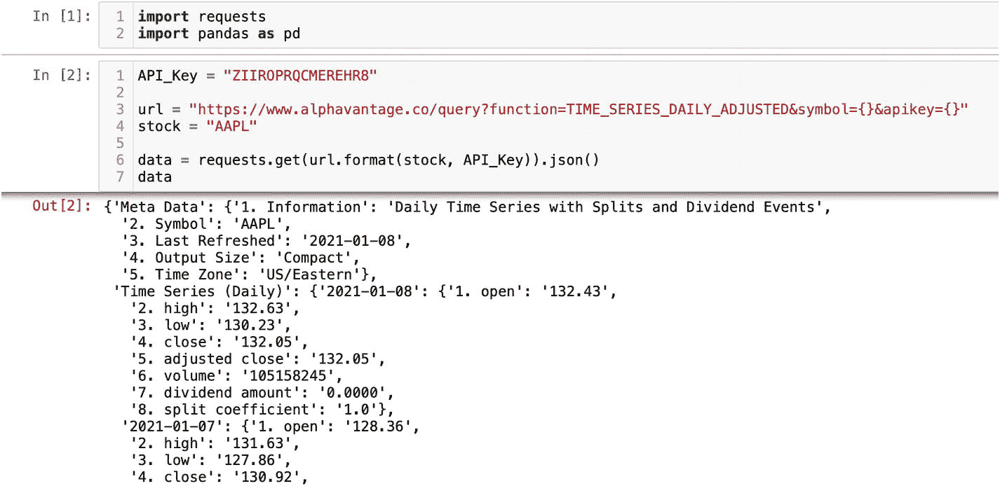

**图 4-28** 从 API 接收数据

## 探索 API 响应

JSON 语法类似于 Python 字典。每次我处理新的源数据时，我都会使用 `type()` 函数。将 `data` 传入 `type()`，你会看到 Python 将其视为字典。

我们从 API 收到了大量信息，很难直观地识别字典中的键。Python 字典方法 `keys()` 将帮助我们获取所有的键：

```python
data.keys()
```

`keys()` 方法返回了 `dict_keys(['Meta Data', 'Time Series (Daily)'])`。我们对 `'Meta Data'` 不感兴趣，将更仔细地查看 `'Time Series (Daily)'`。`data` 是一个字典，我们可以通过键 `'Time Series (Daily)'` 获取值。`Time Series` 是另一个字典，因此我们将再次使用 `keys()` 方法：

```python
data['Time Series (Daily)'].keys()
```

显然，`data['Time Series (Daily)']` 也包含所有作为字典的信息。`keys()` 方法返回了用作键的日期。每个内部字典包含更多带有 `"AAPL"` 每日值的键。要获取它们，你可以对任何日期应用相同的 `keys()` 方法：

```python
data['Time Series (Daily)']['2021-01-08'].keys()
```

每一天都有相同的键集来保存值：

```
dict_keys(['1\. open', '2\. high', '3\. low', '4\. close', '5\. adjusted close', '6\. volume', '7\. dividend amount', '8\. split coefficient'])
```

如果我想获取 AAPL 股票在 `'2021-01-08'` 的收盘价，我会这样获取它（图 4-29）：

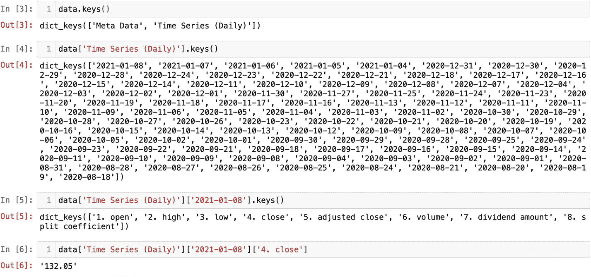

**图 4-29** 从转换为 Python 字典的接收数据中访问值

```python
data['Time Series (Daily)']['2021-01-08']['4. close']
```

如果你需要从 Alpha Vantage 时间序列 API 中获取所有收盘价，那么可以遍历字典。在这个例子中，我将使用 `dict_of_prices` 作为中间变量，以使代码更简洁、更清晰（图 4-30）：

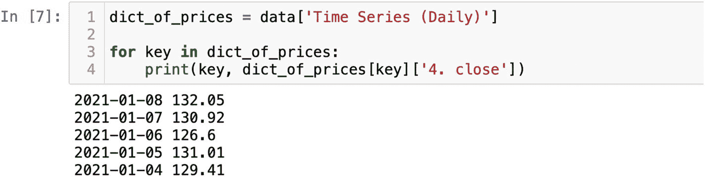

**图 4-30** 遍历 `dict_of_prices` 字典对象

```python
dict_of_prices = data['Time Series (Daily)']

for key in dict_of_prices:
    print(key, dict_of_prices[key]['4. close'])
```

我完成了上述所有步骤，以演示如何从 API 中获取任意值。假设我们希望将接收到的数据转换为 DataFrame，那么我们可以提取 `dict_of_prices` 或 `data['Time Series (Daily)']`，并直接将其传入 Pandas 的 `DataFrame` 函数：

```python
df = pd.DataFrame(dict_of_prices)
```

当字典被传入 `DataFrame` 函数时，它可能使用错误的列值。在我们的例子中，`pd.DataFrame` 函数将日期用作列，这不是期望的结果。为了旋转这个二维数据结构，我们将应用 `T` 属性来转置 DataFrame 的索引和列：

```python
df = pd.DataFrame(dict_of_prices).T
```

属性 `T` 是 `transpose()` 方法的一个访问器，你可以互换使用它们。加上末尾的 `T` 属性后，`df` 应如图 4-31 所示。

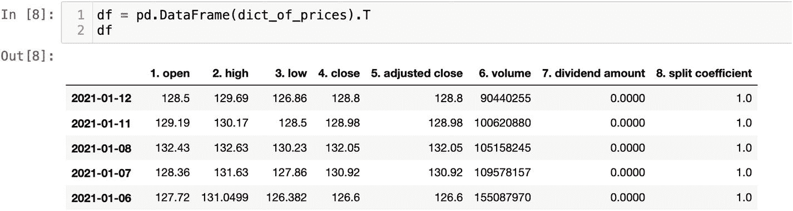

**图 4-31** 使用内置方法 `T` 转置 DataFrame

需要注意，API 提供的 JSON 是字符串，`df` 中的所有值并非以数值数据类型存储。这意味着我们不能将它们用于数学计算。你不必记住这一点；相反，可以在 DataFrame 上运行 `info()` 方法来检查值的数据类型：

```python
df.info()
```

要处理这些值，我们需要将它们转换为数值数据。逐列进行会很繁琐。我们将使用 `applymap()` 方法。`applymap()` 的概念类似于 `apply()` 方法；它遍历所有的值。区别在于 `applymap()` 会应用于 DataFrame 中的所有值。`applymap()` 没有 `inplace` 参数，我们需要将转换后的值保存回同一变量 `df`：

```python
df = df.applymap(pd.to_numeric)
```

再次运行 `df.info()`，你会看到所有值都已转换为浮点数或整数数据类型。我们最后可以做的事情是将索引值转换为 datetime 对象：

```python
df.index = pd.to_datetime(df.index)
```

索引中的 datetime 对象将帮助我们操作数据，例如，从 DataFrame 中绘制过去 120 天的收盘价（图 4-32）：

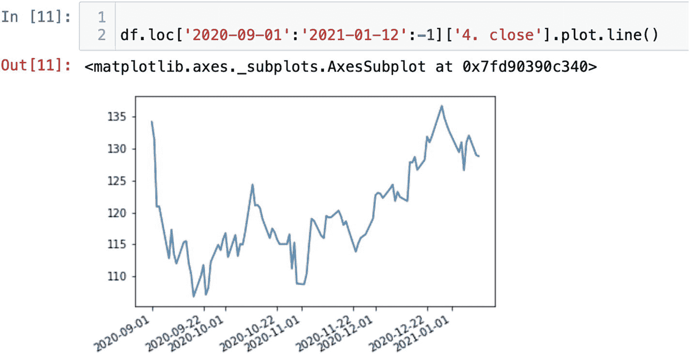

**图 4-32** 从 DataFrame 绘制数据

```python
df.loc['2020-09-01':'2021-01-12':-1]['4. close'].plot.line()
```

方法 `loc` 对从 `'2020-09-01'` 到 `'2021-01-12'` 的数据进行切片。我们使用步长 `-1`，因为原始 DataFrame 从索引 `'2021-01-12'` 开始，我们需要反向进行。为了绘制收盘价，我们获取 `'4. close'` 列并将其绘制为折线图（图 4-32）。

# Pandas-Datareader

流行的 API 有像 Pandas-Datareader 这样的包装器。包装器是一个小程序，通常旨在使数据处理过程更加无缝。Pandas-Datareader 统一了从雅虎财经、谷歌、纳斯达克、联邦储备经济数据（FRED）等多个数据源访问信息的机制。完整的数据提供商列表可以在 Pandas-Datareader 文档中找到。顾名思义，Pandas-Datareader 与 Pandas 协同工作，并以 DataFrame 的形式返回接收到的信息。

Pandas-Datareader 最初设计为 Pandas 的一部分，用于接收远程金融和经济数据，后来被分离出来，现在是一个独立的 Python 包。我们需要在 Anaconda Navigator ➤ Environments ➤ Terminal 中使用 `pip` 命令单独安装它：

```
pip install pandas-datareader
```

大多数 Pandas-Datareader 数据源都可以通过 `DataReader()` 函数访问。为了演示 `DataReader()` 的用法，请打开一个新的 **Jupyter** Notebook 并导入 Pandas 和 Pandas-Datareader：

```python
import pandas as pd
import pandas_datareader.data as web
```

首先，我们将从雅虎财经获取 IBM 股票的历史价格。雅虎财经无需注册，我们只需要传递股票代码、数据源和时间范围即可：

```python
stock_price = web.DataReader('IBM', 'yahoo', '2020-01-01','2021-01-15')
```

开始和结束日期的日期应以字符串或 datetime 对象的形式传递给函数。第一个参数 `'IBM'` 可以替换为任何其他有效的股票代码。`DataReader()` 以 DataFrame 格式返回价格，你可以将 Pandas 函数和方法应用于 `stock_price` 对象：

```python
stock_price.head()
```

`DataReader()` 会连接到雅虎服务，可能需要一些时间才能获得响应（图 4-33）。

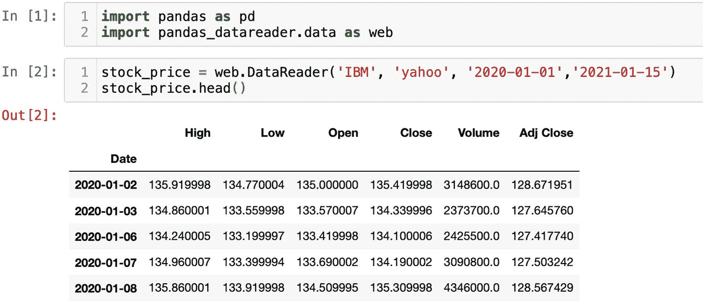

**图 4-33** 使用 `DataReader()` 函数从雅虎财经接收数据

投资者交易所（IEX）是另一个可与 `DataReader()` 配合使用的流行数据源。投资者交易所为个人和专业账户提供大量付费数据。在这里，我们将使用一个免费账户来演示如何在 `DataReader()` 函数中使用 API 密钥并获取对 IEX 的访问权限。你可以在 IEX 云平台 [`iexcloud.io`](https://iexcloud.io) 上注册并申请你的 API 密钥。注册后，你将获得 API 令牌的访问权限。将 `API_Key` 定义为一个字符串，并将其作为最后一个参数传递给 `DataReader()`：

```python
API_Key = 'pk_1386c11694f7887a90694cd588149'

msft_prices = web.DataReader('MSFT', 'iex', '2020-01-01','2021-01-15', api_key=API_Key)
```

我在此使用的 API 密钥仅为示例，并非有效令牌。

`'iex'` 是你必须用于连接投资者交易所的数据源参数。我们收到的价格以 DataFrame 的形式存储在变量 `msft_prices` 下（图 4-34）。

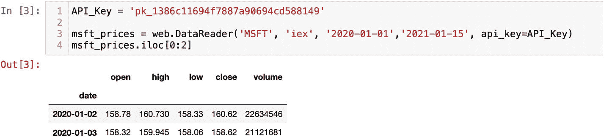

**图 4-34** 使用 `DataReader()` 函数从投资者交易所接收数据

除了股票市场价格，Pandas-Datareader 还提供来自 FRED（圣路易斯联邦储备银行）的经济指标访问权限。让我们来看看两个最重要的指标：国内生产总值（GDP）和非农就业总人数。

FRED 提供从 1947 年开始的 GDP 数据，我们可以使用相同的 `DataReader()` 函数获取它们。我们只需传递符号 `'A191RL1Q225SBEA'` 并将数据源更改为 `'fred'`。经济指数的符号可以在 FRED 网站 [`fred.stlouisfed.org`](https://fred.stlouisfed.org) 上找到。通常，符号紧跟指标标题之后（图 4-35）。

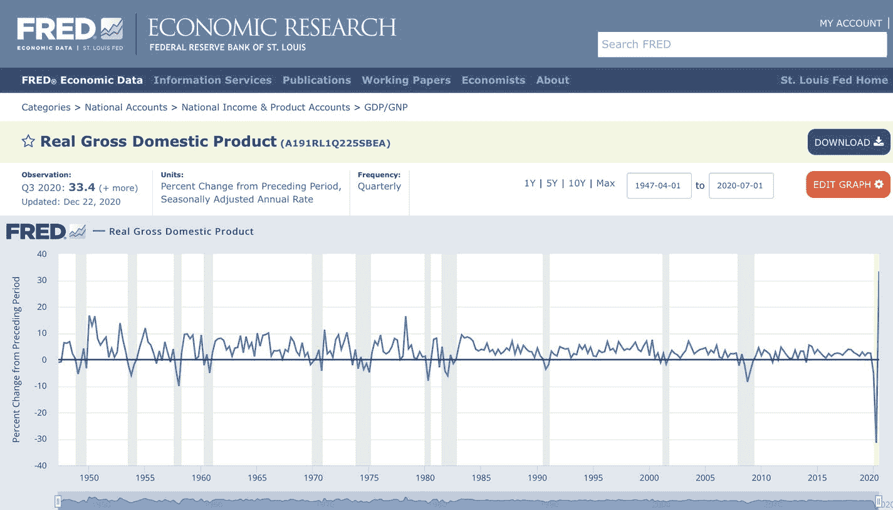

**图 4-35** 实际国内生产总值信息，来源：[`fred.stlouisfed.org`](https://fred.stlouisfed.org)

```python
gdp = web.DataReader('A191RL1Q225SBEA', 'fred', '1947-04-01', '2021-01-15')
```

我们可以使用 `plot.line()` 方法绘制数据，并将标题作为参数添加（图 4-36）。

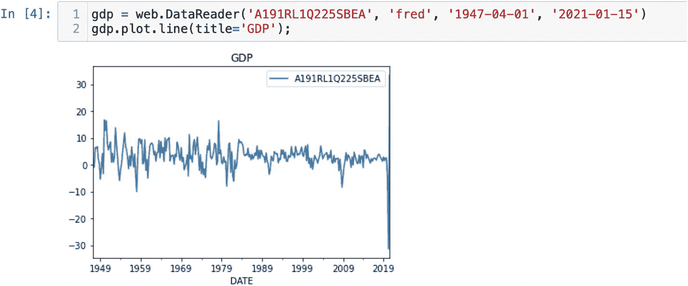

**图 4-36** 使用 `DataReader()` 函数绘制从 FRED 数据源接收的国内生产总值

与 GDP 类似，我们可以绘制非农就业总人数的图表。非农就业总人数的符号是 `PAYEMS`。我们将获取从开始日期 `'1939-01-01'` 到 2020 年 12 月的最多可用信息：

```python
nonfarm = web.DataReader('PAYEMS', 'fred', '1939-04-01', '2020-12-01')
nonfarm.plot.line(title='非农就业总人数');
```

在 `Figure 4-37` 中，你可以看到我们从 FRED 获取的历史就业数据图，这些数据是使用 `DataReader()` 函数接收的。

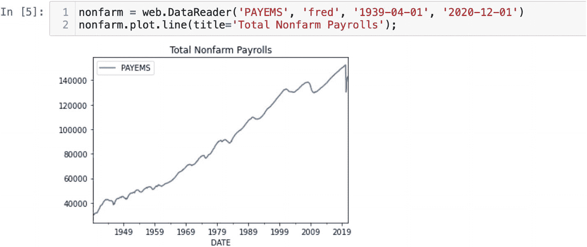

图 4-37 使用 `DataReader()` 函数从 FRED 源绘制的非农就业总人数图

在本章中，我们介绍了使用 API 工作的主要原则。在下一章中，我们将继续使用 API 来收集和分析信息。具体来说，我们将使用 Google Data Python 库来访问流行的 Google 应用。

---

## 脚注

### 5. 数据可视化

可视化是数据分析的重要组成部分。仅仅收集、处理和数据分析是不够的，你需要呈现你的发现。数字应该讲述一个故事。没有图像的故事会显得枯燥乏味。我们人类通过眼睛获取信息，正如常言道：“一图胜千言。”一幅更生动的图像能让你更长时间地保持注意力。

作为数据科学和机器学习领域最流行的编程语言，Python 拥有众多的可视化解决方案。在本章中，我们将学习如何使用最著名的 Python 可视化库——`Matplotlib`。所有其他的 Python 可视化库要么建立在 `Matplotlib` 之上，要么共享相同的绘图数据原则。

### `Matplotlib`

在前面的章节中，我们已经通过 `Pandas` 简单使用过 `Matplotlib`；现在是时候深入了解这个流行的可视化包了。

`Matplotlib` 库是第一个用于数据绘图的 Python 主要库。可以毫不夸张地说，`Matplotlib` 是世界上使用最广泛的 Python 可视化解决方案。`Matplotlib` 允许你以不同类型的图表来绘制数据。线条图、柱状图、散点图和直方图是你使用 `Matplotlib` 可以轻松绘制的主要图表类型。除此之外，还有许多 `Matplotlib` 扩展可以帮助你可视化天文、地理或科学数据。

### 线条图

`Matplotlib` 是 `Anaconda` 的一部分。你只需将其导入到一个文件中即可开始使用。在一个新的 **Jupyter** 文件中，导入 `Matplotlib` 模块 `pyplot`：

```python
import matplotlib.pyplot as plt
```

`Matplotlib` 是一个大型库，我们没有全部导入，而是选择了主要模块 `pyplot`。你可能已经猜到，`plt` 是一个约定俗成的简写。

我想从一个简单的线条示例开始介绍 `Matplotlib`。创建两个包含一些数字的 Python 列表：

```python
x = [ 2, 5, 7 ]
y = [ 2, 7, 3 ]
```

选择 `x` 和 `y` 变量并非随意。要绘制一条线，我们需要连接点。每个点都有两个数字或坐标 `x` 和 `y` 来映射它。在我们的例子中，会有三个点。我们可以使用 `Matplotlib` 的函数 `plot()` 来绘制它们：

```python
plt.grid(True)
plt.plot(x,y, marker="o");
```

我添加了函数 `plt.grid(True)` 来说明每个点的位置对于源自 `x` 和 `y` 列表的 x 轴和 y 轴上的值是唯一的（参见 `Figure 5-1`）。

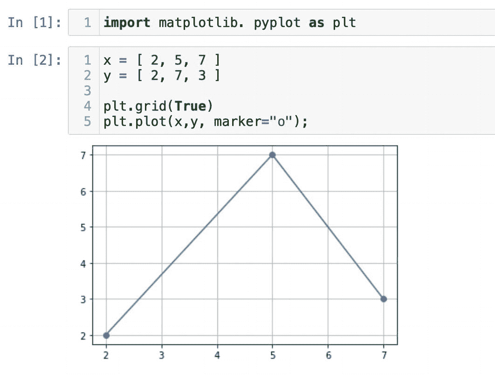

图 5-1 线条图

此外，我还放置了一个可选的关键字参数 `marker="o"` 来强调函数 `plt.plot()` 根据我们提供的值连接这些点。移除 `marker="o"`，你将看到一条简单的线条：

```python
plt.plot(x,y)
```

我在 `plt.plot()` 函数后面加上的分号是一个小技巧，用于隐藏线条对象的内存地址。如果你重新运行 `plt.plot(x,y)` 表达式时不带末尾的分号，你将在图表上方看到 `[<matplotlib.lines.Line2D at 0x7f97da40b9a0>]` 被打印出来。

`plt.plot()` 函数易于使用。你所要做的就是传递任意两个可迭代对象（例如列表、元组、`Pandas Series` 或 `NumPy` 数组）作为 x 和 y 坐标，它就会绘制一条线。

`Matplotlib` 的 `plt.plot()` 函数允许你使用不同的样式和任何可能的颜色。由于有太多的变体，`plot` 函数只是声明它接受 `*args` 和 `**kwargs`。`*args` 和 `**kwargs` 意味着一个函数可以接受多个参数和关键字参数。

记住所有可用的标记和样式是不可能的。每当我需要给我的图表添加一些花哨的东西时，我会运行：

```python
help(plt.plot)
```

`help(plt.plot)` 返回一个包含所有可能图表变体的描述。

在尝试不同的绘图样式时，我想从颜色开始。颜色可以以不同的格式传递给 `plot()` 函数。对于原色，你可以使用颜色的首字母或完整的颜色名称，例如：

```python
# Use "b" or "blue" for blue
plt.plot(x,y, color="b")
plt.plot(x,y, color="blue")

# use "r" or "red" for red
plt.plot(x,y, color="r")
plt.plot(x,y, color="red")

# use "g" or "green" for green
plt.plot(x,y, color="g")
plt.plot(x,y, color="green")
```

如果你觉得使用预设颜色很无聊，你可以使用 `HEX` 或 `RGB` 格式。我建议访问 [`https://htmlcolorcodes.com`](https://htmlcolorcodes.com) 获取调色板。在该网站上，你可以选择任何带有 `HEX` 或 `RGB` 代码的颜色。例如，我最喜欢的浅珊瑚色可以这样使用：

```python
```

plt.plot(x, y, color="#F08080");

甚至可以使用颜色的名称：

```python
plt.plot(x, y, color="LightCoral");
```

任何图表都需要图例和标题。`Matplotlib`有专门的函数`plt.legend()`和`plt.title()`来向图表添加注释。不用说，所有可用的`Matplotlib`函数都可以通过`dir(plt)`命令查看。

`plt.legend()`函数反映了图表中显示的数据。它非常易于使用。你所要做的就是向你的图表添加一个关键字参数`label`，然后`plt.legend()`函数就会渲染它：

```python
plt.plot(x, y, color="#F08080", label="Line");
plt.legend()
```

图表注释可以渲染在图表的任何位置。添加参数`loc`（代表位置），并从“位置字符串”列表中分配任何位置。“位置字符串”列表可以在函数描述`help(plt.legend)`中找到。

我将`plt.plot()`中引用的`label="Line"`放置在图表的底部中央（参见`Figure 5-2`）：

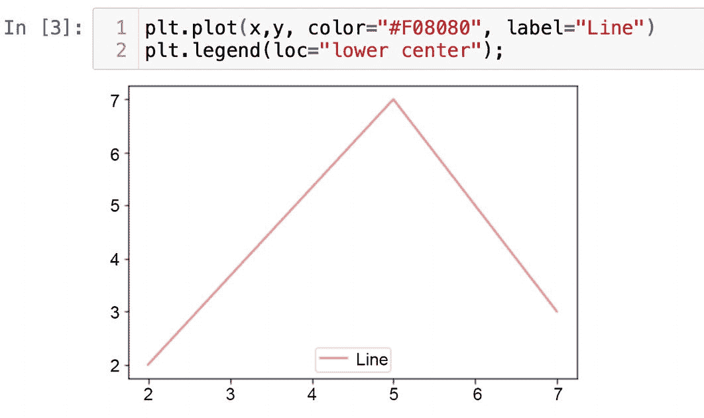

图 5-2 `legend()`函数为图表添加注释

```python
plt.plot(x, y, color="#F08080", label="Line")
plt.legend(loc="lower center");
```

与图例一起，我们可以使用`plt.title()`函数为图表附加任何名称。图表标签应作为字符串传递给`plt.title()`函数。`plt.title()`函数允许指定标签的位置、颜色和字号。使用参数`loc`，标签可以放置在三个位置之一：`left`、`right`和默认的`center`。要像在`plt.plot()`函数中那样为标签设置自定义颜色，我们可以使用原色或`HEX`和`RGB`代码。标签文本大小应以磅为单位，使用关键字`fontsize`传递。

举例来说，我将绘制一只股票的价格。为此任务，我们需要获取历史股价。滚动回文件中的第一个单元格，导入`Pandas-Datareader`：

```python
import pandas_datareader as pdr
```

从`"yahoo"`源中获取苹果或任何其他股票在任意日期范围内的历史价格：

```python
data = pdr.DataReader("AAPL","yahoo", "2020-01-01","2021-02-12")
```

`data["Adj Close"]` 列将作为 `y` 参数在 Matplotlib 函数 `plt.plot()` 中绘制在垂直轴上。索引 `data.index` 将代表水平轴：

```python
plt.plot(data.index, data["Adj Close"])
```

这段绘图语句看起来杂乱，为了使其可读，我将切片 `data["Adj Close"]` 并赋值给变量 `y`。同样，将 `data.index` 赋值给变量 `x`：

```python
x = data.index
y = data["Adj Close"]
plt.plot(x, y)
```

我们添加了两行代码，但这是值得的。现在代码可读且清晰，方便其他可能使用我们代码的人。此外，我们也更容易插入任何其他希望绘制的值。

向 `plt.plot()` 函数添加标签，并通过 `plt.legend()` 方法将其渲染在右下角：

```python
plt.plot(x, y, color="#196F3D" label="AAPL")
plt.legend(loc="lower right")
```

添加一个标题，位置居左，颜色与股价线条相同，字号为 22：

```python
plt.title("Apple Inc. Stock Price", loc="left", color="#196F3D", fontsize=22)
```

运行代码，您将看到一个带有自定义标题和图例标签的漂亮图表。但有一件事让我困扰：水平轴标签重叠。

Matplotlib 提供了 `xticks()` 和 `yticks()` 函数，用于设置水平和垂直轴的自定义标签。在当前示例中，将自定义标签与 `data.index` 值匹配会很困难，而且未来我们可能会更改日期范围；因此，为了使日期可读，我们将其稍作旋转。`xticks()` 和 `yticks()` 函数带有一个 `rotation` 参数，用于改变文本角度。我们可以将 `x` 标签的角度设置为直角的一半，即数值 45：

```python
xticks(rotation=45)
```

最终，图表应如图 5-3 所示。可以尝试不同的颜色和标签样式。

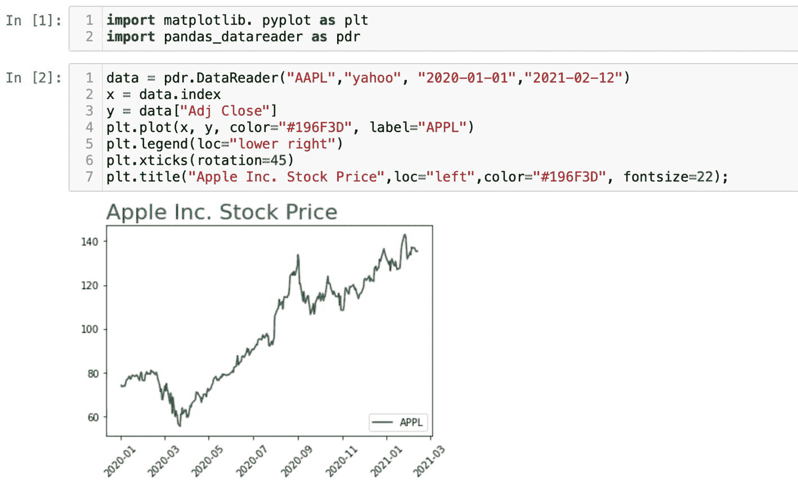

**图 5-3**
带有标题和图例的股价图

我们可以对图表应用多种其他样式选项。Matplotlib 函数 `grid()` 可以添加任意样式和颜色的网格线：

```python
plt.grid(color="brown", linestyle=":")
```

与许多 Matplotlib 函数一样，`grid()` 高度可定制。您可以指定颜色和线条样式。图表大小可以通过 `figure()` 方法设置。在 Matplotlib 中，术语 "figure" 指代绘制的数据。因此，应使用关键字 `figsize` 设置图表的尺寸。宽度和高度应以列表或元组形式传递，单位是英寸：

```python
plt.figure(figsize=(12,8))
```

我的一名学生问我，是否可以在图表中使用公司颜色，因为这是她公司的要求。答案是肯定的。您已经看到，我们可以为线条或网格设置任意颜色。此外，Matplotlib 还提供了 `style` 包。您可以通过调用 `plt.style.use()` 方法定义任意样式变体。我不深入探讨如何编写样式，这超出了本书的范围。如果由于某些原因您需要设置特定样式表，可以在此处找到相关信息：[`https://matplotlib.org/stable/api/style_api.html`](https://matplotlib.org/stable/api/style_api.html)。对于其他只想拥有美观图表的读者，我建议使用预设样式表之一。所有可用选项均列在此处：[`https://matplotlib.org/stable/gallery/style_sheets/style_sheets_reference.html`](https://matplotlib.org/stable/gallery/style_sheets/style_sheets_reference.html)。

例如，一个非常流行的 `"seaborn"` 样式可以像这样应用于图表：

```python
plt.style.use("seaborn")
```

Python 代码按顺序执行，函数 `plt.style.use()` 和 `figure()` 应在 `plot()` 之前定义（参见图 5-4）。

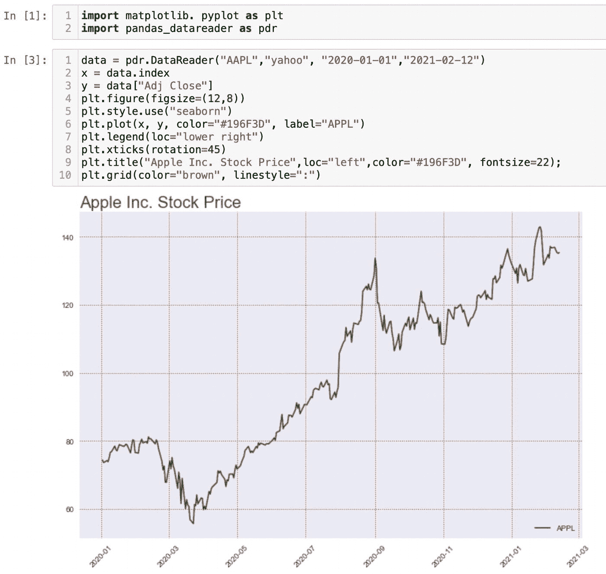

**图 5-4** 在绘图中应用 `style.use()` 和 `figure()` 函数

# 直方图

直方图是另一种流行的图形类型。与 `plot()` 函数相比，`hist()` 方法只需要一组数据。它常用于展示数据的分布情况。

利用苹果股票的历史价格，我们可以计算股票的日收益率并将其绘制成直方图：

```python
stock_return = data['Adj Close'].pct_change(1)*100
```

Pandas 的 `pct_change()` 方法返回当前与前一日期之间的百分比变化。`stock_return` 序列中的第一个值是 `NaN`，我们需要将其丢弃才能绘制直方图：

```python
stock_return.dropna(inplace=True)
```

在 `dropna()` 方法移除所有 `NaN` 值后，该序列可以作为 `x` 参数传递给 `hist()` 函数：

```python
plt.hist(stock_return)
```

传递给 `hist()` 函数的数据会被分割成若干个等宽的箱子。通过使用第二个参数 `bins`，你可以改变范围，并且在观察值数量允许的情况下，通过增加箱子数量获得更精确的结果：

```python
plt.hist(stock_return, bins=100)
```

与之前的示例类似，我们将为直方图添加标题：

```python
plt.title('Distribution of APPL Daily Return')
```

除了标题文本，Matplotlib 还提供了标记水平和垂直轴的选项。正如 `xlabel()` 和 `ylabel()` 函数名称所暗示的那样，它们可用于为轴命名：

```python
plt.xlabel('Daily Percentage Return')
plt.ylabel('Frequency')
```

添加了标题和轴标签后，直方图将如图 5-5 所示。

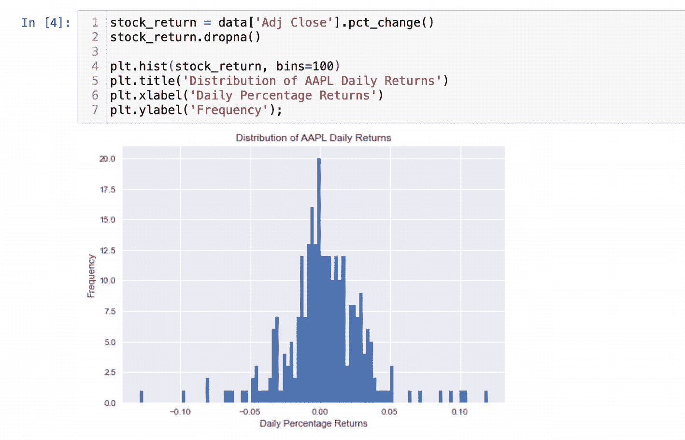

**图 5-5** 函数 `hist()` 绘制股票日收益率

直方图可以保存为 png、jpeg、pdf 或 svg 格式的独立文件。

Matplotlib 函数 `savefig()` 将生成一个包含绘图的全新文件。你只需提供一个唯一的文件名作为字符串参数：

```python
plt.savefig("AAPL return.png")
```

或者你可以将其保存为 PDF 文件：

```python
plt.savefig("AAPL return.pdf")
```

请记住，`savefig()` 函数应该是在你运行完所有用于绘制图形的语句之后，执行的最后一个 Matplotlib 命令。

# 散点图

Python 库 Matplotlib 可以使用三种不同的后端。我在此将它们称为格式。我们到目前为止使用的默认格式是 `"inline"`。`"inline"` 格式可生成静态图像并将其存储在 Jupyter Notebook 中。`"inline"` 格式的主要优点是，每个 Jupyter 文件中可以包含任意数量的静态图形。

如果希望在绘图中使用交互功能，则需要切换到 `"notebook"` 模式。每个 Jupyter 文件只能包含一个交互式图像。正因如此，我建议在一个单独的新文件中编写下一个示例。交互模式需要在导入 Matplotlib 之前使用一个魔法函数：

```python
%matplotlib notebook
import matplotlib.pyplot as plt
```

我称其为魔法函数并不夸张。魔法函数是 Python 中一个官方术语，指的是以 `%` 符号为前缀的函数。^([10])

散点图是数据分析中的基本工具之一，我们将使用 `scatter()` 函数来绘制 2019 年美国的人口分布图。Matplotlib 的 `scatter()` 函数不仅绘制数据，还允许根据数值调整点的大小和颜色。我们将获取包含 2019 年美国常住人口估计值的 Excel 文件^([11])，并将数据绘制成散点图。该文件位于：[`https://bit.ly/bookScatterExample`](https://bit.ly/bookScatterExample)。

除了绘图库，我们还需要 Pandas；像这样将其与 Matplotlib 一起导入：

```python
%matplotlib notebook
import matplotlib.pyplot as plt
import pandas as pd
```

包含数据的 Excel 文件在线可用，我们可以用 Pandas 的 `read_excel()` 函数读取它。^([12]) 第一行是标题，我们可以通过关键字参数 `skiprows=1` 跳过它：

```python
data = pd.read_excel("https://bit.ly/bookScatterExample", skiprows=1)
```

一如既往，我们需要稍微清理一下数据，只提取包含信息的列：

```python
data = data[["State", "Population"]]
```

为了便于阅读，我们将人口数值转换为百万为单位：

```python
data["Population_Mill"] = data["Population"]/1000000
```

数据范围太广，为了绘制一个整洁的散点图，我们可以过滤数据，只获取人口在两百万到八百万之间的州：

```python
filtered_data = data[(data["Population_Mill"] > 2.0) & (data["Population_Mill"] < 8.0)]
```

`scatter()` 函数与 `plot()` 方法类似。它接受 `x` 和 `y` 值作为坐标。为了使代码易读，我将对 `filtered_data` DataFrame 进行切片，并将 `filtered_data["State"]` 赋值给 `x` 变量，将 `filtered_data["Population_Mill"]` 赋值给 `y` 变量：

```python
x = filtered_data["State"]
y = filtered_data["Population_Mill"]
```

现在我们可以将 `x` 和 `y` 对象传递给 `scatter()`，并旋转水平轴上的州名：

```python
plt.scatter(x, y)
plt.xticks(rotation=90)
```

`%matplotlib notebook` 为我们生成了一个交互式图表（图 5-6）。图表下方的菜单允许我们放大和移动数据。那个小软盘图标用作保存按钮。

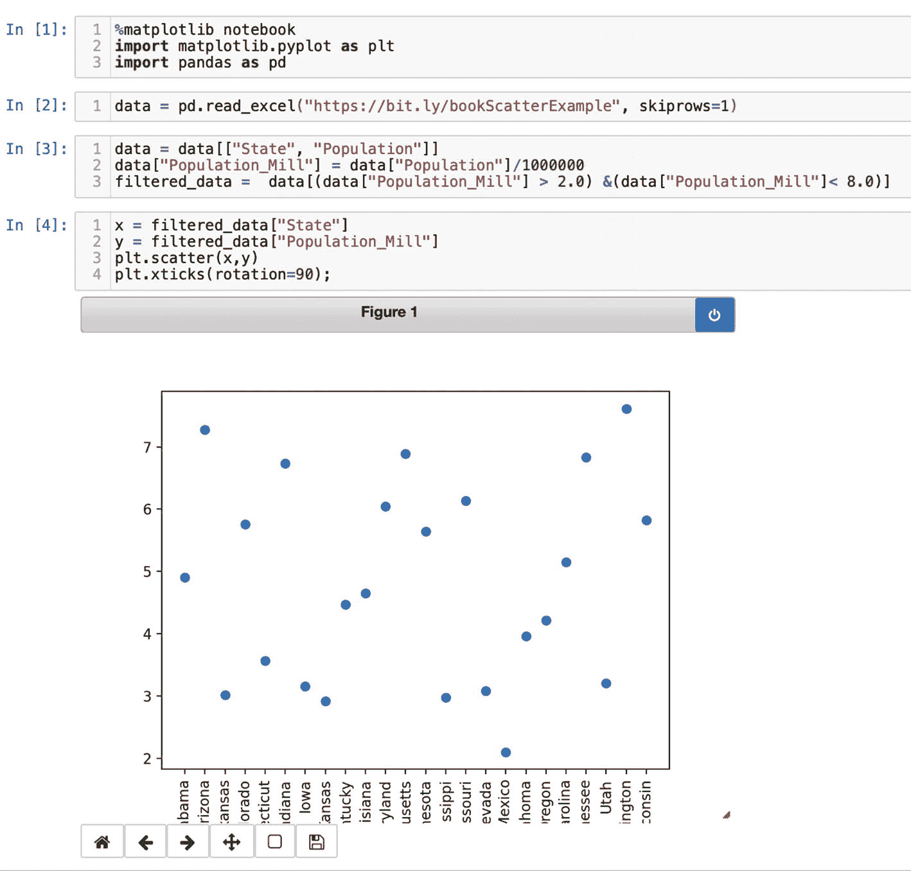

**图 5-6** 美国各州人口（百万）的散点图

我之前提到过，Matplotlib 的 `scatter()` 函数允许我们通过关键字参数 `s` 和 `c` 控制点的大小和颜色。我们可以将 `filtered_data["Population_Mill"]` 数据作为大小和颜色赋值，使散点图更具可读性。我将数据点的值进行四次方放大，来放大数据点：

```python
size = filtered_data["Population_Mill"]**4
color = filtered_data["Population_Mill"]
plt.scatter(x, y, s=size, c=color)
```

有些点相互重叠，为了使它们透明，我们将添加另一个 Matplotlib 样式属性 `alpha`。小于 1 的值会使图形更透明：

```python
plt.scatter(x, y, s=size, c=color, alpha=0.5)
```

与所有 Matplotlib 绘图函数一样，`scatter()` 允许提供自定义的颜色映射，或者从文档中选择您喜欢的颜色映射。（您可以在此处找到所有列出的颜色映射：[`https://matplotlib.org/stable/tutorials/colors/colormaps.html`](https://matplotlib.org/stable/tutorials/colors/colormaps.html)。）从列表中，我选择了 `"plasma"` 颜色映射，并将其作为 `cmap="plasma"` 属性传递给 `scatter()` 函数。如果添加一个颜色条刻度，散点图将包含更多信息（图 5-7）：

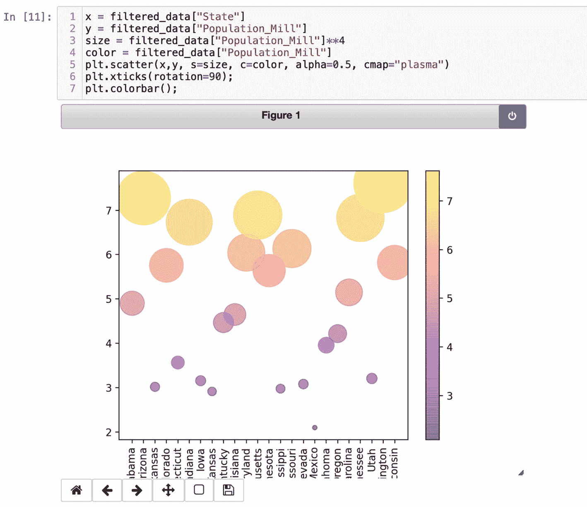

**图 5-7** 带有颜色条刻度的散点图

```python
plt.scatter(x, y, s=size, c=color, alpha=0.5, cmap="plasma")
plt.colorbar()
```

我们确实应该添加标题和垂直轴标签。我认为如果在使用 `scatter()` 之前将图形尺寸增加到 10x8，绘制的数据看起来会更好。我们需要在 `figure()` 函数中定义 `figsize`，因此将语句 `plt.figure(figsize=(10,8))` 插入代码中：

```python
plt.figure(figsize=(10,8))
plt.scatter(x,y, s=size, c=color, alpha=0.5, cmap="plasma")
plt.xticks(rotation=90)
plt.colorbar()
plt.title("The States with population estimates between 2 and 8 million, 2019")
plt.ylabel("Population in millions")
```

您可能已经注意到，我总是将一个分号字符移动到代码的最后一行。再次强调，这会隐藏 Python 内存中的一个绘图对象引用。这次，我不想为绘图添加网格线，而是想用州名来标注每个数据点。

Matplotlib 的`annotate()`函数可以根据`x`和`y`坐标在图表上的任意位置放置文本标签。尝试将标签`"Here"`放在`"Indiana"`点上：

```python
plt.annotate("Here", ("Indiana", 6.4))
```

`x`和`y`坐标应以元组形式传递，例如`("Indiana", 6.4)`。`"Indiana"`表示水平轴上的`x`值，`6.4`是`y`轴上的入口数量。

重新运行`Jupyter`笔记本单元格，你会看到`"Here"`文本附着在代表印第安纳州的橙色点上。显然，我们不想手动为所有值添加文本标注。我们可以遍历所有`x`值，并通过索引获取坐标。这项任务需要用到 Python 内置函数`enumerate()`。`enumerate()`函数将为`filtered_data["State"]`中存储在`x`变量下的所有值提供一个索引。借助`for`循环，我们将遍历枚举对象，并将每个州的索引和名称传递给`annotate()`函数。`x`和`y`变量持有 Pandas Series 对象，我们需要使用`.iloc[]`方法将索引映射到对应的值：

```python
for index, label in enumerate(x):
    plt.annotate(label, (x.iloc[index], y.iloc[index]) )
```

之后，所有点都将被分配来自`x`对象的文本标签（图 5-8）。

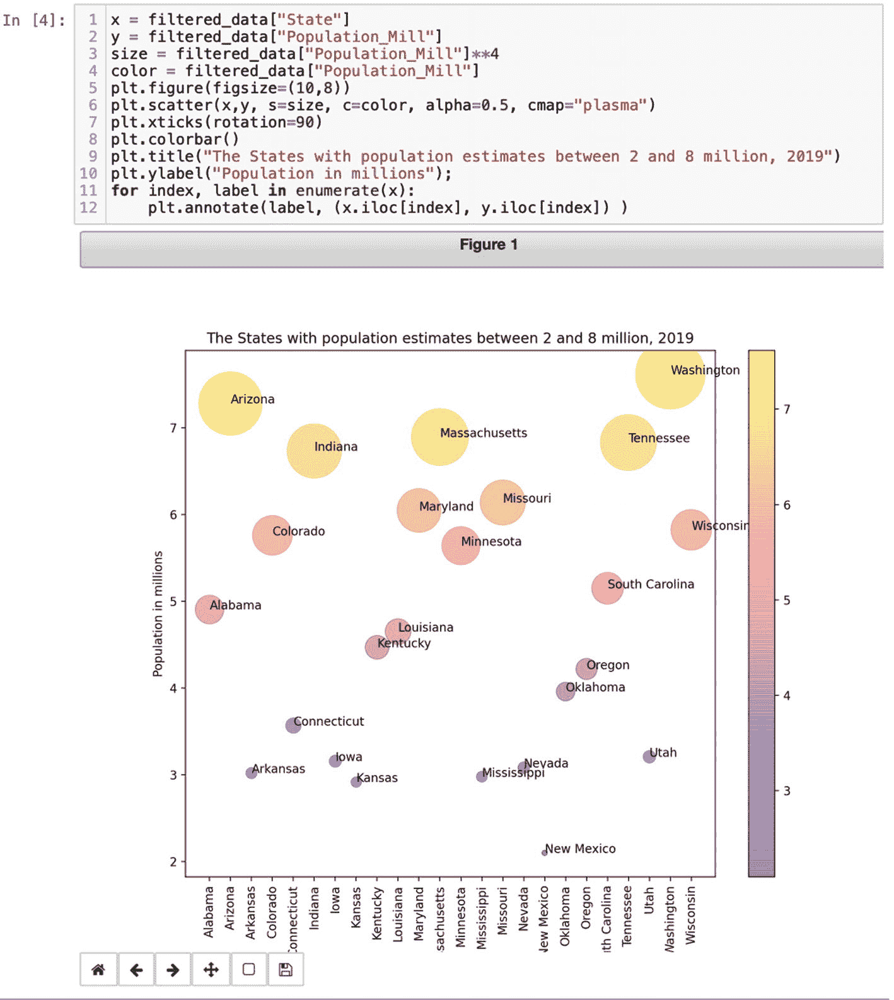

图 5-8 散点图中的数值标注

我们创建的交互式散点图允许用户使用菜单中的缩放选项放大数据（图 5-8），并通过鼠标左键拖动移动它。菜单中的“主页”按钮可将所有内容重置为默认尺寸。由于交互模式的递归特性，我们在上方单元格中设置的`"Notebook"`模式将无法在该文件中生成另一个绘图。默认的`"inline"`模式和交互式`"notebook"`格式是`Jupyter`的主要模式。

除了`Jupyter`，Matplotlib 还可能使用你的计算机操作系统作为后端引擎。你可以通过使用魔术函数`%matplotlib`（不带参数）来尝试：

```python
%matplotlib
import matplotlib.pyplot as plt
```

在这种情况下，Matplotlib 会在一个独立的 Python shell 中生成一个类似于`"notebook"`模式的交互式绘图。在不同 Matplotlib 模式之间切换时，需要记住一点：它们不能同时使用，如果你在一个`Jupyter`文件中用一种模式替换另一种模式，需要重启内核。

# 饼图

我们将在交互式 shell 中生成一个饼图。在一个新的`Jupyter`文件中，使用`%matplotlib`格式导入 Matplotlib：

```python
%matplotlib
import matplotlib.pyplot as plt
```

它将返回：

```
Using matplotlib backend: MacOSX
```

或者根据你计算机运行的操作系统返回`Windows`。`Using matplotlib backend`意味着 Matplotlib 已连接到你的操作系统，并将使用它来生成图像。
继续前面的示例，我们将绘制美国地理区域的常住人口饼图。根据美国人口普查局的数据，美国 38.26% 的人口居住在南部，23.87% 在西部，20.82% 在中西部，17.06% 在东北部。

我们需要为饼图定义数值和标签：

```python
population = [38.26, 23.87, 20.82, 17.06]
areas = ["South", "West", "Midwest", "Northeast"]
```

Matplotlib 的`pie()`函数将生成一个简单的饼图。要查看所有可用于自定义饼图的参数，请运行`help(plt.pie)`。将`population`作为`x`值，`areas`作为`labels`传递给`pie()`：

```python
plt.pie(x=population, labels=areas)
```

Matplotlib 后端引擎应生成一个包含简单饼图的弹出窗口（图 5-9）。

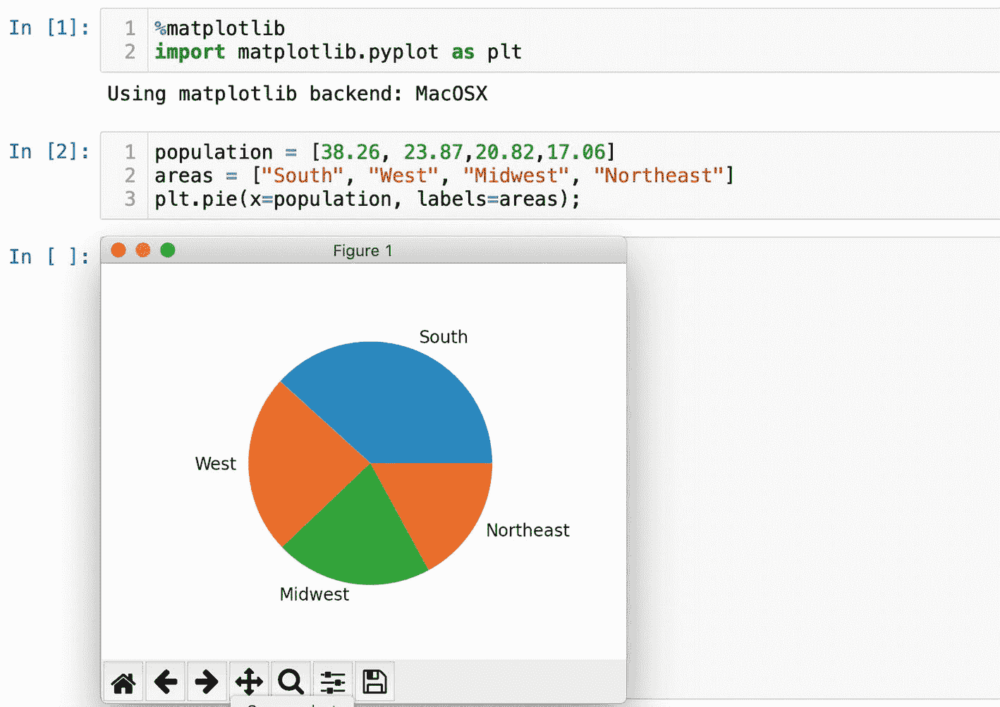

图 5-9 人口数据绘制的饼图

`pie()`函数以及其他 Matplotlib 函数都接受自定义颜色。对于这个例子，我决定在[`https://htmlcolorcodes.com`](https://htmlcolorcodes.com)上选择一个明亮的调色板：

```python
palette = ["#00FFFF"," #FF00FF"," #00FF00"," #800080"]
plt.pie(x=population, labels=areas, colors=palette)
```

有时，你可能希望强调饼图中的某个扇形块来突出重点。这可以通过`pie()`函数的`explode`参数实现。`explode`接受一个可迭代对象（如列表或元组），其中包含每个扇形块相对于中心位置的浮点数值。

例如，参数`explode=[0, 0.1, 0, 0]`会将第二个扇形块从中心向外推出 0.1。在我们的案例中，我将把`"West"`扇形块从饼图中心向外显示 0.2：

```python
standout =[0, 0.2, 0, 0]
plt.pie(x=population, explode=standout, labels=areas, colors=palette)
```

`pie()`函数中的另一个样式参数是`shadow`。如果你想为饼图添加 3D 效果，请将`shadow`参数设置为`True`：

```python
plt.pie(x=population, explode=standout, labels=areas, shadow=True, colors=palette)
```

除了标签，你可能还想在图中显示每个区域的实际值。`autopct`参数将显示这些值。我们需要将值的格式指定为字符串。字符串的格式化应使用 Python 格式化风格，你可以在[`https://pyformat.info`](https://pyformat.info)找到相关说明。特别地，表达式`'%.2f'`将显示小数点后两位数字，而`'%.2f%%'`则会在值后面添加一个 `%` 字符：

```python
plt.pie(x=population, explode=standout, labels=areas, autopct='%.2f%%', shadow=True, colors=palette)
```

通过添加这些样式属性，我们生成了一个非常时髦的饼图（图 5-10）。如果在生成图的过程中出现问题，重启内核应该会有所帮助。

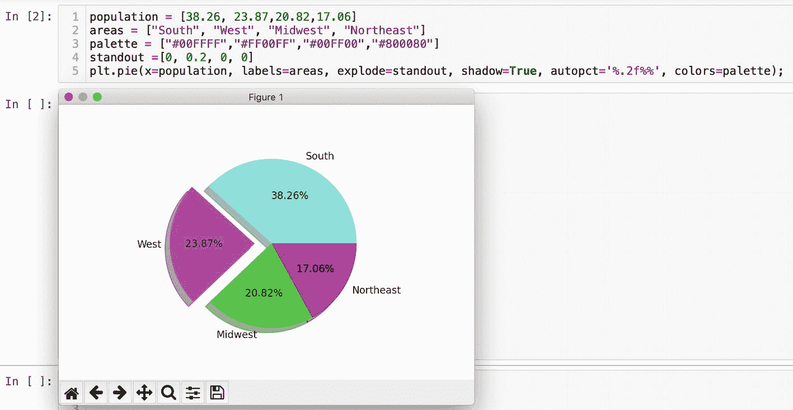

图 5-10 具有样式属性的饼图

当然，你可以像我们之前做的那样为饼图添加标题。
Matplotlib 是一个非常实用的工具，可以让你了解数据。它易于使用。我们已经介绍了可视化和样式化图表的所有主要函数。我们学习了如何构建基本图形，但借助 Matplotlib 及其众多的扩展和插件，你可以实现更多功能。对于复杂的样式和图表，我建议访问 Matplotlib 文档画廊页面：[`https://matplotlib.org/stable/gallery/index.html`](https://matplotlib.org/stable/gallery/index.html)。

## 脚注

# 第 6 章：使用 Python 完成基本财务任务

在前面的章节中，我们已经涵盖了 Python 的所有基本要素。我们使用了一些金融示例来说明问题。在本章中，我们将更深入地探讨日常的财务任务。我的目标是向你展示 Python 的实际应用，并帮助你入门，以便你能编写自己的代码。此外，你应该将这本书视为学习 Python 的第一步，并通过阅读 Pandas 及其他库的文档、关注专业博客以及通过实践掌握 Python 来继续你的学习。永远不会有神奇的函数或预设的解决方案来解决所有现实生活中的挑战。因此，请使用本章中的示例为你自己的项目打下基础。

## NumPy Financial

本章将从商学院一年级学生都会学到的基础金融函数开始讲起。货币的未来价值、内部收益率、现值以及未来现金流的净现值，是金融分析的基石。掌握了 Python 基础知识，你可以从头编写公式并计算这些指标，但为了节省时间和精力，有一个 `Numpy-Financial` 包。`Numpy-Financial` 能为你完成所有必要工作，提供干净无错的结果。

要开始使用 `Numpy-Financial`，你需要在**终端**中安装它。提醒一下，你可以通过点击 Anaconda Navigator 中**环境**下的 **base (root)** 菜单找到终端。请确保你在一个新的终端 shell 中安装该包，并且不要干扰当前运行的内核。

```
pip install numpy-financial
```

当你看到 `Numpy-Financial` 成功安装的消息后，就可以关闭终端，并在一个新的 **Jupyter** Notebook 中导入该包：

```
import numpy_financial as npf
```

我不想花费大量时间详细解释这些金融指标及其在金融分析中的重要性，而是重点介绍它们在 `Numpy-Financial` 功能中的实现。

`Numpy-Financial` 是一个小型库，只包含十个基本函数（表 6-1）。

**表 6-1** `Numpy-Financial` 函数

| 函数 | 描述 |
| --- | --- |
| `fv(rate, nper, pmt, pv[,when])` | 计算未来价值 |
| `ipmt(rate, per, nper, pv[,fv,when])` | 计算一笔付款的利息部分 |
| `irr(values)` | 返回内部收益率 (IRR) |
| `mirr(values,finance_rate,reinvest_rate)` | 修正内部收益率 |
| `nper(rate, pmt, pv[,fv,when])` | 计算定期付款的次数 |
| `npv(rate, values)` | 返回现金流序列的净现值 (NPV) |
| `pmt(rate, nper, pv[,fv,when])` | 计算贷款本金加利息的付款额 |
| `ppmt(rate, per, nper, pv[,fv,when])` | 计算贷款本金的付款额 |
| `pv(rate, nper, pmt[,fv,when])` | 计算现值 |
| `rate(nper, pmt, pv, fv[,when, guess,tol,...])` | 计算每期的利率 |

如你所见，没有必要记住所有函数及其参数。你只需运行 `dir(npf)` 查看对象的可用方法，并使用 `help()` 了解特定函数的参数即可。

## 未来价值 `fv()`

货币的时间价值是你在《金融学入门》中学到的第一件事。让我们来看一个经典问题。假设你有一个选择：现在获得 3000.00 美元，年利率为 3%，或者同意在三年后获得 3300.00 美元。我们将使用 `pv()` 函数解决这个问题。给定的语句将被保存在变量名 `deposit`、`annual_interest` 和 `years` 下：

```
deposit = 3000
annual_interest = 0.03
years = 3
future_value = npf.fv(annual_interest, years, 0, -deposit)
print("Future value of ${:.2f} is ${:.2f}".format(deposit, future_value))
```

我在 `deposit` 参数前使用了负号，因为我们可以将其视为一笔投资。如果不使用负号，结果将是一个负数。

计算结果显示，3300.00 美元比将 3000.00 美元存款以年利率 3% 投资更划算（图 6-1）。

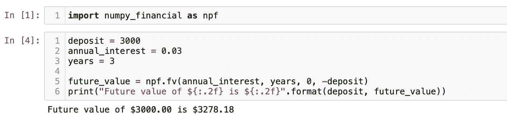

**图 6-1** 使用 `fv()` 函数计算未来价值

## 现值 `pv()`

与货币未来价值公式相对的是货币现值。今天的一笔钱比未来相同金额的钱更值钱。但具体值多少钱呢？`Numpy-Financial` 将通过 `pv()` 函数帮助我们回答这个问题。继续前面的例子，我们可以假设你有一个选择：三年后获得 3300 美元，或者现在获得这笔钱。我们将利率设定为年利率 3%。

`pv()` 函数将利率、期数和未来价值作为参数。利率可以按年或月传递。期数将取决于年利率或月利率。我们将 `future_value` 定义为 3300 美元；`annual_rate` 和 `years` 的值保持不变：

```
future_value = 3300
annual_rate = 0.03
years = 3
present_value = npf.pv(annual_rate, years,0,-future_value)
print("Present value of ${:.2f} is ${:.2f}".format(future_value, present_value))
```

根据 `pv()` 公式返回的结果，3300.00 美元的现值为 3019.97 美元（图 6-2）。

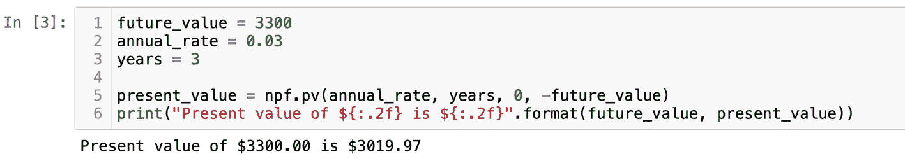

**图 6-2** 使用 `pv()` 函数计算货币的现值

## 净现值 `npv()`

`Numpy-Financial` 可以通过使用按资本成本折现的未来现金流入的净现值，基于盈利能力帮助你确定投资项目之间的优先级。`npv()` 函数返回现金流序列的净现值。它使用起来很简单；我们只需要资本成本或机会资本成本以及未来的预期现金流。预期现金流应以数组形式传递。根据文档，投资应为负浮点数，流入应为正数。

假设有一家公司计划扩张，正在两个投资机会之间进行选择。一个选择是扩大生产，投资 100,000 美元用于新设施和设备。生产扩张将在未来五年内带来每年 25,000 美元的收入。另一个投资选择是购买收益率为 5% 的证券。为简化示例，我们假设风险相等。

基于这些假设，我们将计算扩张项目的净现值。我们将 `investment` 定义为负值，`cash_flows` 定义为包含未来现金流的 Python 列表：

```
discount_rate = 0.05
investment = -100000
cash_flows = [investment, 25000, 25000, 25000, 25000, 25000]
net_present_value = npf.npv (discount_rate, cash_flows)
print("Net Present Value of the project is ${:.2f} ".format(net_present_value))
```

该项目的净现值为 8236.92 美元（图 6-3）。

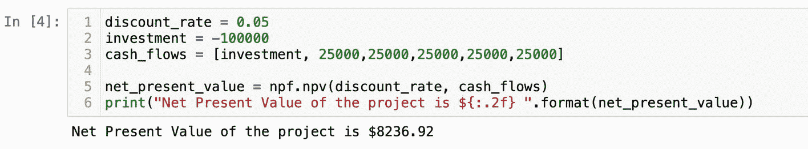

**图 6-3** 计算项目的净现值

使用相同的 `npv()` 函数，我们可以比较两个项目。此外，我们可以针对一系列折现利率运行情景分析，观察利率变化如何影响项目盈利能力。我们要比较的第二个项目将具有相同的初始投资 100,000 美元，并在未来五年内分别有逐渐增加的流入：5000 美元、10,000 美元、40,000 美元、40,000 美元和 40,000 美元。

折现率可以表示为存储在 Python 列表中的浮点数范围：

```python
cash_flows_project_one = [-100000, 25000,25000,25000,25000,25000]
cash_flows_project_two = [-100000, 5000,10000,40000,40000,40000]
discount_rates = [0.0,0.05,0.10,0.20,0.25]
```

`cash_flows_project_one` 和 `cash_flows_project_two` 中的第一个初始投资数字为负，因为我们投入了那笔资金，它代表现金流出。

我们需要初始化两个空列表来存储情景分析的结果。

```python
npv_project_one = []
npv_project_two = []
```

最后，要计算预测现金流的 NPV，我们需要动态地向 `discount_rates` 列表中的每个利率传入参数。一个 `for` 循环会遍历 `discount_rates` 列表，并逐一将值传入 `npv()` 函数。计算结果将临时存储在变量 `npv_one` 和 `npv_two` 中，并追加到 `npv_project_one` 和 `npv_project_two` 列表中：

```python
for rate in discount_rates:
    npv_one = npf.npv(rate, cash_flows_project_one)
    npv_project_one.append(npf.npv(rate, cash_flows_projetct_one))
    npv_two = npf.npv(rate, cash_flows_project_two)
    npv_project_two.append(npv_two)
```

现在我们已经为不同的贴现率运行了多个场景并保存了 NPV 结果，接下来可以绘制图表。除了 Matplotlib 库，我们还需要 Shapely 包来找到表示 NPV 值的两条绘制线的交点。

打开终端或命令提示符，下载并安装 Shapely：

```bash
pip install shapely
```

Shapely 是一个用于分析几何对象的 Python 库。((13)) 当然，没有 Shapely 的帮助我们也能找到交点坐标，但这需要编写大量代码。而 Shapely 的 `intersection()` 方法能更精确地完成这项工作。

安装好 Shapely 后，在 **Jupyter** Notebook 的顶部导入它和 Matplotlib：

```python
import numpy_financial as npf
import matplotlib.pyplot as plt
from shapely.geometry import LineString
```

我希望我的图表坐标轴能完美缩放，我将 x 轴和 y 轴的极限分别设置为 0.0 和 0.25：

```python
plt.xlim(0.0, 0.25)
```

Matplotlib 的 `xlim()` 方法根据起点和终点设置当前坐标轴的 x 轴界限。我们可以将其硬编码为 0.0 和 0.25 的贴现率，或者根据 `discount_rates` 列表中的值进行动态调整。这意味着将起点设为列表中的第一个值 `discount_rates[0]`，终点设为同一列表中的最后一个值 `discount_rates[-1]`：

```python
plt.xlim(discount_rates[0], discount_rates[-1])
```

y 轴将使用 Matplotlib 的 `ylim()` 方法进行缩放，我们将起点和终点设为存储在 `npv_project_two` 列表中的 NPV 结果的最后一个值和第一个值：

```python
plt.ylim(npv_project_two[-1], npv_project_two[0])
```

之后，我们可以使用贴现率作为 x 轴来绘制 NPV 结果：

```python
plt.plot(discount_rates, npv_project_one, label="项目一")
plt.plot(discount_rates, npv_project_two, label="项目二")
```

当你运行单元格时，NPV 值将被绘制成两条线。两条线的交点，或者在金融中被称为的交叉利率，可以被精确计算并在图表上标记出来。

Shapely 的函数 `LineString` 会将 x 和 y 坐标转换为一个几何直线对象：

```python
line1 = LineString(list(zip(discount_rates, npv_project_one)))
line2 = LineString(list(zip(discount_rates, npv_project_two)))
```

我们在图中用作 x 和 y 坐标的 `discount_rates`、`npv_project_one` 和 `npv_project_two` 中的值，需要借助 Python 内置函数 `zip()` 进行组合。`zip()` 函数会将它们打包成一个元组列表，并传入 `LineString()` 函数。

让我退一步，简单介绍一下 `zip()` 函数。很多时候，我们需要映射来自不同来源的值。例如，城市名称和人口数量。两者都以列表形式出现，其中人口数值以百万计：

```python
cities = ["纽约", "芝加哥", "休斯顿"]
population = [8.3, 2.7, 2.3]
```

`zip()` 函数会将 `population` 值与 `cities` 列表中的城市进行匹配：

```python
zip(cities, population)
```

和 Python 中的许多其他函数一样，`zip()` 函数返回一个对象：

要解包这个 `zip` 对象，我们需要么用 `for` 循环遍历它以逐一获取配对，要么将 `zip` 对象包装为一个列表：

```python
list(zip(cities, population))
```

现在我们可以看到存储在列表中的元组对：

```python
[('纽约', 8.3), ('芝加哥', 2.7), ('休斯顿', 2.3)]
```

回到我们的 NPV 示例，`LineString` 操作的结果存储在变量 `line1` 和 `line2` 中。`intersection` 方法将为我们获取那个交叉点的坐标：

```python
point = line1.intersection(line2)
```

`point` 对象现在拥有 `x` 和 `y` 坐标，可以作为 `point.x` 和 `point.y` 属性在图表上绘制。`point.x` 和 `point.y` 给出了两个评估项目 NPV 值交点处的确切美元金额和利率。

我们可以在图表上将该交点标记为一个红点，并添加虚线投影到 x 轴和 y 轴上：

```python
plt.plot(point.x, point.y, marker="o", color="red")
```

如你所见，绘制一个点，我们使用了与前一章练习过的相同的 `plot()` 函数。区别在于样式。现在我们使用了一个标记。`plot()` 函数中有许多预设的标记。你可以通过 `help(plt.plot)` 找到你喜欢的那个。

Matplotlib 的 `hline()` 和 `vline()` 函数会根据 x 和 y 坐标绘制水平和垂直线：

```python
plt.hlines(y=point.y, xmin=0.0, xmax=point.x, color='red', linestyles='dotted', label=str(round(point.x*100,3)))
plt.vlines(x=point.x, ymin=-40000, ymax=point.y, color='red', linestyles='dotted',label=str(round(point.y,2)))
```

Matplotlib 的`hline()`和`vline()`函数与我们之前使用的其他绘图方法类似。这些直线从由`xmax=point.x`和`ymax=point.y`定义的点的原点出发。x 和 y 的界限分别标识为 x 轴上的 0.0 和 y 轴上的–40000。

最后的润色是网格和标签：

```python
plt.grid()
plt.legend()
plt.title("NPV 曲线图")
plt.xlabel("贴现率")
plt.ylabel("NPV (净现值)")
```

完整的方案和图表如图 6-4 和图 6-5 所示。

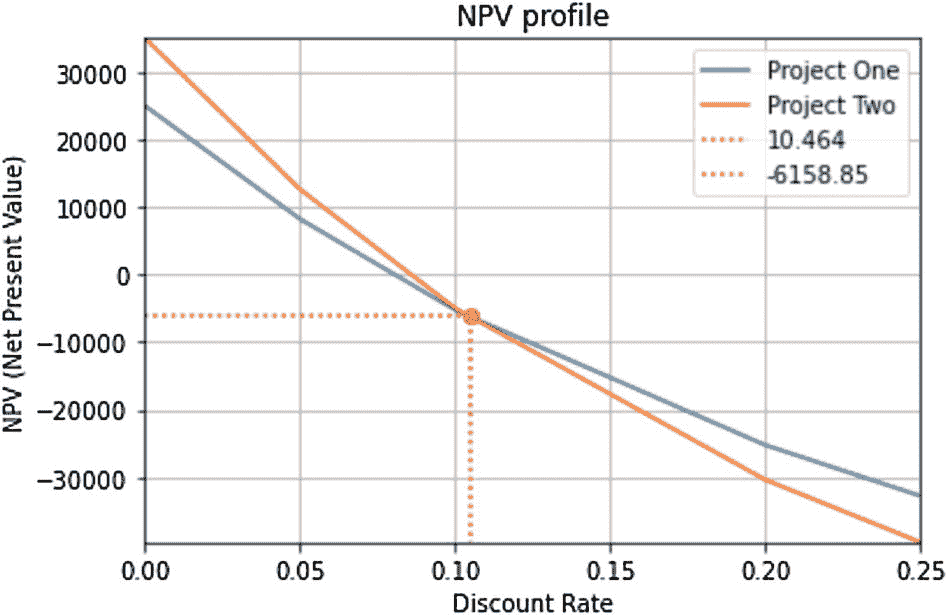

图 6-5
两个项目 NPV 交叉利率图

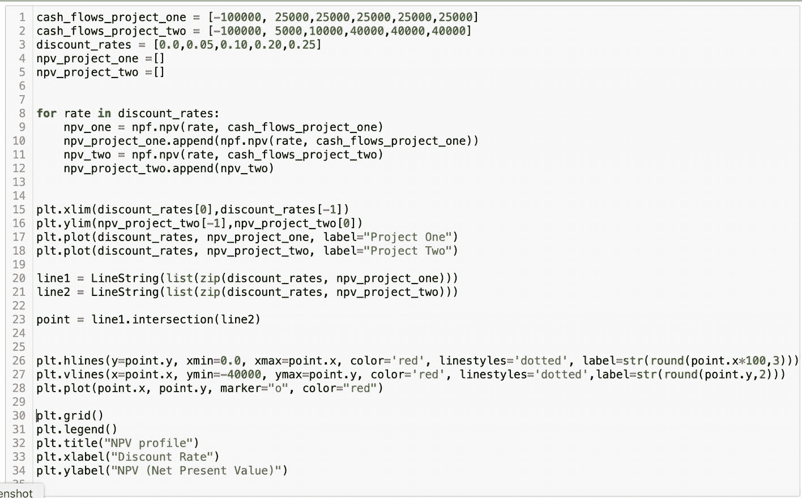

图 6-4
计算并绘制两个项目的 NPV

# 风险价值 (VAR)

近年来金融监管变得更加严格，如今合规经理必须使用现代工具来处理海量数据集，生成大量报告。这正是 Python 大显身手的地方。风险价值是一种非常流行的统计指标，用于评估投资项目的金融风险水平。在 VAR（风险价值）中，风险被定义为在特定时间内的最大损失。这里，我们将探讨如何基于正态分布和波动性来计算参数化的 VAR 模型。

假设我们有一个普通股票的投资组合。在我们的投资组合中，我们持有以下股票的头寸：微软、苹果和 IBM。为简化示例，假设我们持有每家公司的 100 股股票。为了做出未来预测，我们需要获取组合中股票的历史价格。希望你已经安装了 Pandas-Datareader 库；如果没有，我们在第 4 章已经详细讨论了这个包的安装和用途。

在一个新的`Jupyter` Notebook 顶部导入 NumPy、Pandas、Matplotlib 和 Pandas-Datareader：

```python
import numpy as np
import pandas as pd
import matplotlib.pyplot as plt
import pandas_datareader.data as web
```

为了获取历史价格，我们需要将股票代码放入一个 Python 列表中。变量名`portfolio`能完美反映这个列表的用途：

```python
portfolio =  [ "MSFT","AAPL","IBM"]
```

我们需要一个 DataFrame 来存储股票的历史价格，因此我们在变量名`prices`下初始化一个：

```python
prices = pd.DataFrame()
```

使用 `Pandas-Datareader` 从 Yahoo 获取每只股票的历史价格，按其代码查询。您可以以字符串格式指定任何时期范围：

```python
for stock in portfolio:
    prices[stock] = web.DataReader(stock, 'yahoo', '2017-01-01','2021-03-20')["Adj Close"]
```

请注意，`Pandas-Datareader` 返回一个包含 `open`、`high`、`low`、`close`、`volume` 和 `adjusted close` 列的 `DataFrame`。调整后的收盘价反映了股票在拆股和分红后的价格，这正是我们需要的。我们通过列名 `["Adj Close"]` 从每个 `DataFrame` 中获取该列。使用字典表示法，我们将 `["Adj Close"]` 列添加到之前定义的 `DataFrame` 中。变量 `stock` 持有来自 `portfolio` 列表的值，当遍历该列表时，会将每家公司代码设置为 `prices` 中的列名。最终，我们会得到一个包含历史价格的 `prices` `DataFrame`。您可以使用 `msft_prices.head()` 进行检查。

方法 `head()` 将显示包含历史价格的 `DataFrame` 的前五行（图 6-6）。

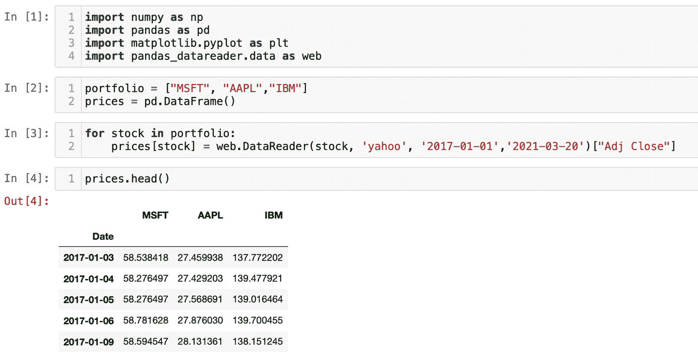

图 6-6
为股票组合检索历史价格

我们可以通过绘制历史价格来进行可视化。绘制并比较不同价值的股票（如 AAPL 为 27.45，IBM 为 137.77）会很困难。我们需要以数据第一天的价格为基准 100 进行归一化处理。`prices.iloc[0]` 将获取 `DataFrame` 中第一天的价格：

```python
first_date = prices.iloc[0]
normalized_prices = prices/first_date * 100
```

绘图部分很简单；我们在第 5 章中已经做过：

```python
[line1,line2,line3] = plt.plot(prices.index , normalized_prices, label=["MSFT","AAPL","IBM"])
plt.legend(loc="lower right")
plt.xticks(rotation=45)
plt.title("Portfolio of stocks");
plt.grid()
plt.legend([line1,line2,line3],["MSFT","AAPL","IBM"], loc="upper left");
```

我使用 `DataFrame` 的 `index` 作为 `x` 轴，因为它包含日期。`normalized_prices` 是 `y` 轴。列表 `[line1,line2,line3]` 仅用于图例，以区分不同股票的线条。

三只股票的历史表现如图 6-7 所示。

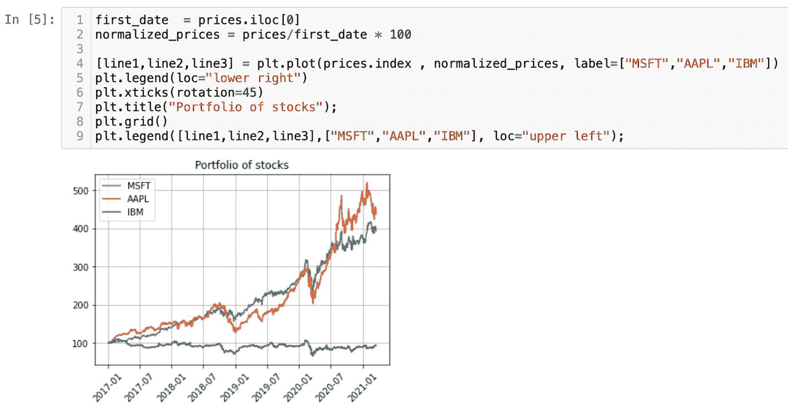

图 6-7
归一化后的历史价格

VAR 计算从历史股票收益率开始。有两种方法可以实现。第一种是使用 Pandas 的 `shift()` 方法，将一行移动指定数量：

```python
stocks_return = prices/prices.shift(1)-1
```

或者更精确地，您可以使用 NumPy 的 `log()` 函数计算对数收益率：

```python
stocks_return = np.log(prices/prices.shift(1))
```

第二种方法是使用 `pct_change()` 方法。`pct_change()` 也接受一个表示期数的参数。在我们的例子中，是一天或一行：

```python
return = prices.pct_change(1)
```

无论使用哪种方法，`stocks_return` 和 `return` 都应得到相同的结果。两种情况下第一个值都是 NaN（非数值），我们将使用 `dropna()` 方法消除它：

```python
return.dropna(inplace=True)
```

以防您忘记，`inplace` 是一个参数，它会在对象内部保存更改。收益率的可视化有助于我们更好地理解这些数字。Matplotlib 的 `hist()` 函数将以直方图形式呈现图像。

我们可以将三只股票绘制在同一张图上。关键字参数 `alpha` 使它们透明：

```python
plt.hist(return["MSFT"], alpha=0.5,  bins=100)
plt.hist(return["AAPL"], alpha=0.5,  bins=100)
plt.hist(return["IBM"], alpha=0.5,  bins=100);
```

或者，如果图表过于拥挤而难以理解，您可以单独绘制每只股票的收益率（图 6-8）。我之前提到过，Pandas `DataFrame` 支持 Matplotlib，您可以直接将 `hist()` 方法应用于 `return`：

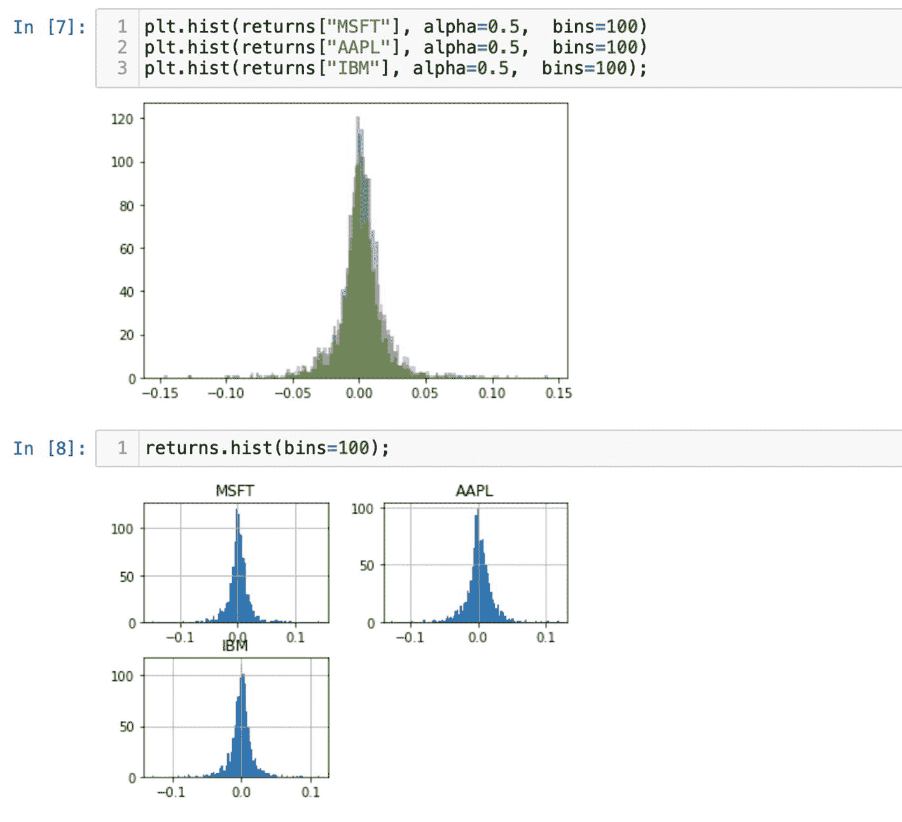

图 6-8
绘制历史股票收益率

```python
return.hist()
```

Pandas `Series` 有一个 `describe()` 方法。`describe()` 方法只能应用于 `Series` 或持有数值的 `DataFrame` 列：

```python
return.describe()
```

图 6-9 显示了 `describe()` 方法计算的股票收益率统计度量。

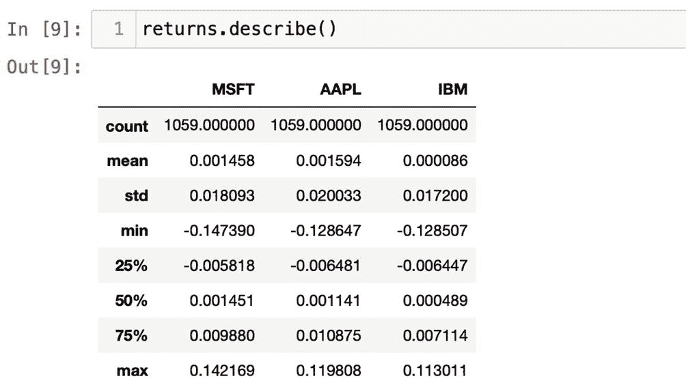

图 6-9
`describe()` 方法返回统计度量

将 `describe` 方法应用于历史收益率后，我们可以看出数据集的 `mean`（均值）在哪里，以及 `std`（标准差）的离散程度有多大。`Min` 和 `max` 值指示了数据集的边界。此外，我们还可以看到 `25%`、`50%` 和 `75%` 的百分位数。`describe()` 方法是一个非常有用的工具，可以快速获取任意数值数据集的统计度量。

对于我们的 VAR 计算，我们需要投资组合的均值和标准差。我们可以从 `describe()` 方法中获取均值：

```python
return.describe().loc["mean"]
```

或使用专门的 `mean()` 方法：

```python
mean_return = return.mean()
```

投资组合的标准差或波动率需要每对股票之间的协方差。在 Pandas 中，我们可以使用 `cov()` 函数在收益率上创建一个协方差矩阵：

```python
covar = return.cov()
```

图 6-10 显示了我们用于获取投资组合波动率的协方差矩阵。

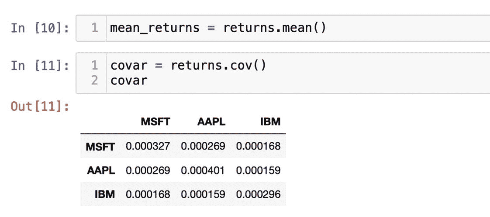

图 6-10
协方差矩阵

此外，我们还需要投资组合中每只股票的百分比。为简化此示例，我们假设投资组合总美元价值的 50% 投资于微软，25% 投资于苹果，25% 投资于 IBM。这个假设必须保存在 NumPy 数组中：

```python
weights = np.array([0.5,0.25,0.25])
```

NumPy 数组可以被视为一个向量。此外，NumPy 数组用作 `Series` 和 `DataFrame` 的核心。这意味着我们可以推导出点积或从向量中得到单个数值。

变量 `mean_return` 持有三只股票历史收益率的均值，我们需要使用 `dot()` 方法再次将它们按投资组合股票百分比归一化：

```python
portfolio_mean = mean_return.dot(weights)
```

标准差是方差的平方根，我们可以使用 NumPy 的 `sqrt()` 方法获取：

```python
volatility = np.sqrt(weights.T.dot(covar).dot(weights))
```

大写字母 `T` 是一个转置方法；它改变了向量或矩阵的相对位置。如果您对数组、`Series` 或 `DataFrame` 运行 `dir()`，它总是列表中的第一个。

此外，均值和标准差需要根据投资组合的总价值进行计算。此处，我们假设投资组合的总价值为 1,000,000 美元：

```python
portfolio_value = 1000000

investment_mean = (1 + portfolio_mean) * portfolio_value

investment_volatility = portfolio_value * volatility
```

当我们掌握所有必要的数值后，我们可以计算正态累积分布的反函数。为此，我们需要 SciPy（科学 Python）包中的 `ppf()`（百分点函数）。SciPy 包含在 Anaconda 中，我们只需要在文件开头导入它：

```python
import scipy.stats as scs
```

`ppf()` 方法使用默认均值 0 和标准差 1（标准正态分布的参数）。我们将用 `investment_mean` 和 `investment_volatility` 覆盖这些默认值。

风险管理者需要将置信水平传入 `ppf()`；通常置信水平为 95%：

```python
confidence = 95
normsinv = scs.norm.ppf((1-95/100), investment_mean, investment_volatility)
```

最后一步是从投资组合价值中减去正态累积分布的逆：

```python
var = portfolio_value – normsinv
```

将结果四舍五入到小数点后两位：

```python
np.round(var,2)
```

最终结果为 25088.94（图 6-11）。经过所有这些计算，我们可以以 95%的置信度说，一个持有 MSFT、AAPL 和 IBM 股票、当前市值为 100 万美元的投资组合，一天内可能损失 25088.94 美元。

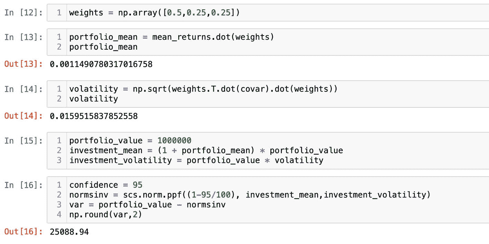

图 6-11 风险价值计算

如果需要预测五天的 VAR，可以将一天的 VAR 乘以天数的平方根。

我们将 `var * np.sqrt(day)` 表达式放入一个遍历天数范围的 for 循环中。初始化一个空列表来存储结果，然后绘制它们：

```python
var_results = []
number_of_days = 5
days_list = list(range(1, number_of_days+1))
for day in days_list:
    result = var * np.sqrt(day)
    var_results.append(result)
```

由于 `range()` 函数中停止点是排他的，因此需要将 `number_of_days` 加 1。

最后，我们绘制 `var_results`：

```python
plt.plot(days_list, var_results)
plt.title("Value at Risk")
plt.ylabel("Portfolio loss")
plt.xticks(days_list, ["1st day", "2nd day", "3rd day", "4th day", "5th day"])
plt.grid()
```

我们可以看到损失在五天内翻倍（图 6-12）。

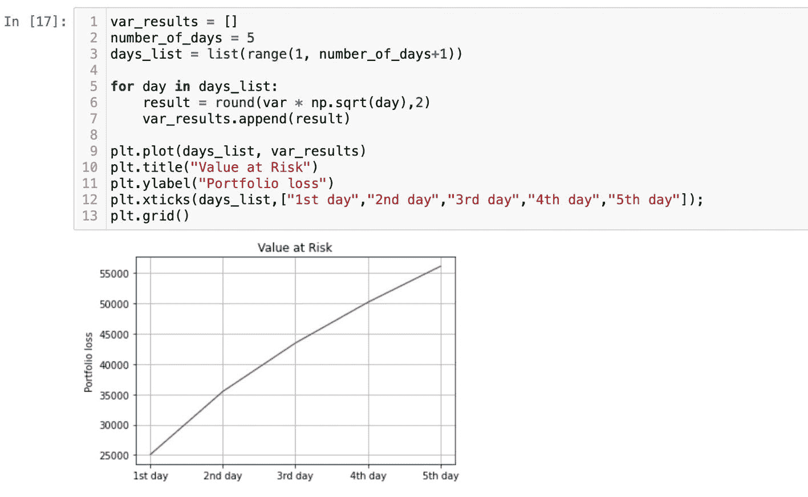

图 6-12 预测五天的 VAR