# 蒙特卡洛模拟

使用相同的历史股价，我们可以预测投资组合的表现，并通过蒙特卡洛模拟技术模拟可能的结果。蒙特卡洛方法是为投资组合的预期收益和预期波动率生成随机结果，就像反复掷骰子一样。

为了保存预期收益和预期波动率的结果，我们需要初始化两个列表：

```
mc_return = []
mc_volatility = []
```

随机改变投资组合中每个头寸的百分比，我们将计算预期收益和预期波动率。NumPy 函数`random()`会生成形状为数组的随机数。数组的大小和维度取决于传递给它的参数。在我们的案例中，需要一个与投资组合中头寸数量匹配的数组。

我们在示例开头使用的`portfolio`列表当前包含三只股票。未来我们可能会添加更多股票，因此将列表长度存储在`num_assets`变量下是很明智的：

```
num_assets = len(portfolio)
for roll in range(5000):
    weights = np.random.random(num_assets)
    weights /= np.sum(weights)
    mc_return.append(np.sum(mean_return * weights) * 252)
    mc_volatility.append(np.sqrt(np.dot(weights.T, np.dot(covar * 252, weights))))
```

在 for 循环的每次迭代中，`random()`方法都会生成投资组合中资产的随机权重。所有资产的总百分比必须始终恰好为 100%；这就是为什么我们将`weights`除以`weights`的`sum()`。接下来，我们生成预期收益和波动率，并按一年中的交易日数对结果进行归一化（图 6-13）。

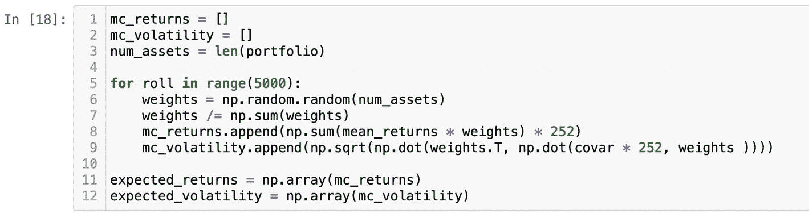

图 6-13 对股票投资组合运行蒙特卡洛模拟

我们将以散点图的形式绘制结果，但在此之前，需要将`mc_return`和`mc_volatility`列表转换为 NumPy 数组：

```
expected_return = np.array(mc_return)
expected_volatility = np.array(mc_volatility)
```

最后，我们绘制`expected_return`和`expected_volatility`：

```
color = expected_return / expected_volatility
plt.figure(figsize=(12, 8))
plt.scatter(expected_volatility, expected_return, c=color, marker='o')
plt.grid()
plt.title("Monte Carlo simulation")
plt.xlabel('Expected volatility')
plt.ylabel('Expected return')
plt.colorbar(label="Sharpe ratio")
plt.show()
```

Matplotlib 的`show()`方法是可选的。我将其包含在内，以防你想在 Matplotlib 的`"notebook"`模式下运行代码，或使用操作系统生成图表。

此示例是对哈里·马科维茨现代投资组合理论的说明¹⁴。你希望获得的投资回报越高，预期的波动率就应越大（图 6-14）。

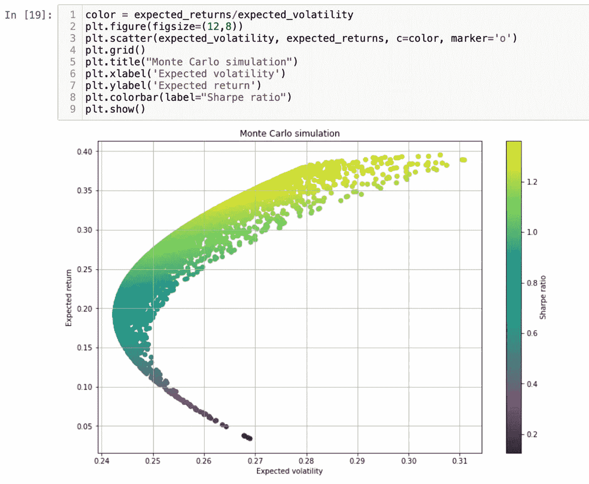

图 6-14 绘制蒙特卡洛模拟结果

图 6-14 中的曲线连接了所有最有效的结果——风险与回报的最优组合，它被称为有效前沿。

## 有效前沿

前面的示例已经证明，你可以从零开始构建任何统计或金融模型。然而，如果你过于忙碌并需要一个开箱即用的解决方案，有一个专业的 Python 包`PyPortfolioOpt`实现了投资组合优化方法，包括有效前沿技术和其他风险管理解决方案¹⁵。`PyPortfolioOpt`带有内置的风险模型和绘图功能。不幸的是，目前`PyPortfolioOpt`不是 Anaconda 包的一部分，我们需要使用`pip`命令来安装它。我们已经多次经历过安装过程，我相信现在你已经知道在哪里找到终端，请运行：

```
pip install pyportfolioopt
```

我们将使用`PyPortfolioOpt`为我们的投资组合找到有效前沿。对于下面的示例，你需要打开一个新的 Jupyter Notebook，并从`PyPortfolioOpt`导入以下函数：

```
import pandas as pd
import pandas_datareader.data as web
from pypfopt.efficient_frontier import EfficientFrontier
from pypfopt.cla import CLA
from pypfopt import plotting
from pypfopt.plotting import plot_weights
from pypfopt import risk_models
from pypfopt import expected_return
```

我会在示例中解释所有导入的函数。我们的目标是生成并绘制投资组合的有效前沿。同时，使用由 Marcos Lopez de Prado 和 David Bailey 实现的临界线算法来寻找最优投资组合¹⁶。

我们将沿用前一个示例中的相同投资组合，并且由于我们在不同的 notebook 中，我们需要再次获取历史价格。同时，请随意使用你喜欢的股票，或向默认列表中添加更多股票：

```
portfolio = ["MSFT", "AAPL", "IBM"]
prices = pd.DataFrame()
for stock in portfolio:
    prices[stock] = web.DataReader(stock, 'yahoo', '2017-01-01', '2021-03-20')["Adj Close"]
```

与前一种情况类似，`PyPortfolioOpt`通过推断历史收益来计算预期收益。我们已导入`expected_return`模块，顾名思义，它生成年化平均收益。对使用 Pandas-Datareader 收集的历史价格运行它：

```
mu = expected_return.mean_historical_return(prices)
```

为了量化资产风险，`PyPortfolioOpt`包含了风险模型，其中之一是协方差矩阵。之前，我们使用了`pandas`的`cov()`方法；这次，我们将运行从文件开头导入的`risk_models`模块中的`sample_cov()`函数：

```
sigma = risk_models.sample_cov(prices)
```

`sample_cov()`函数接收价格数据并返回年化结果。与之前的例子相比，无需再将结果乘以 252 个交易日，因为该操作已包含在`sample_cov()`中。

基于预期收益率和协方差，我们可以计算已导入的有效前沿函数`EfficientFrontier`。

除了收益率和协方差，你还可以通过元组列表的形式为所有股票提供权重边界。在前一个例子中，我们假设投资组合中持有 50%的`MSFT`，以及各 25%的`AAPL`和`IBM`。如果目标是设置精确值，则需将`weight_bounds =[(0.5,0.5),(0.25,0.25),(0.25,0.25)]`作为关键字参数传入。否则，投资组合中所有头寸将默认为`(0,1)`，意味着每项资产的最小值为 0，最大权重为投资组合的 100%。如果投资组合包含空头头寸，则应将`weight_bounds`设置为`(-1,1)`。我建议保留默认值`(0,1)`，看看最优结果是什么：

```
efficient_front = EfficientFrontier(mu, sigma, weight_bounds=(0,1))
```

`EfficientFrontier`函数始终返回一个对象（图 6-15）。

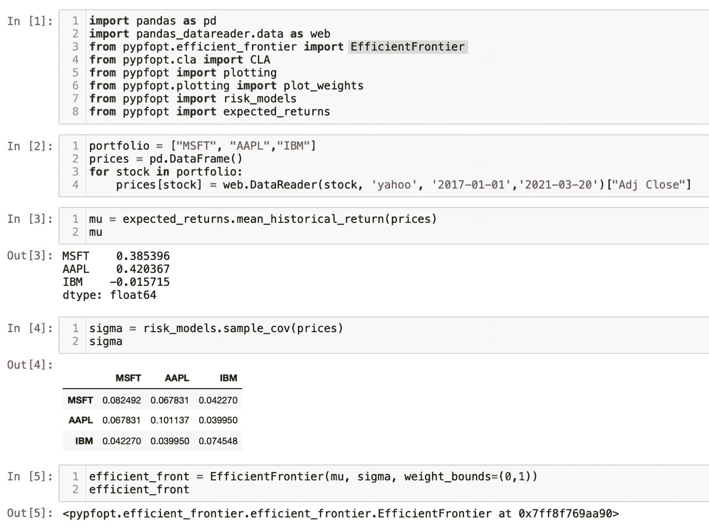

图 6-15 生成股票投资组合的有效前沿

`PyPortfolioOpt`的任务是优化股票投资组合。换句话说，`PyPortfolioOpt`为我们提供了如何更好地构建投资组合以实现投资目标的指导。

例如，如果我们的投资目标是降低波动性至最小，我们可以通过有效前沿对象的`min_volatility()`属性获取建议的资产分配：

```
```

min_vol_weights = efficient_front.min_volatility()

根据`PyPortfolioOpt`，将全部资产的 52%分配至`IBM`，17%至`AAPL`，30%至`MSFT`，将为我们提供在最低波动水平下的最大回报（图 6-16）。

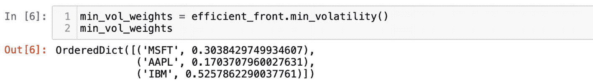

图 6-16 计算投资组合中股票权重以最小化波动性

相反，如果目标是驱动风险调整后回报最大化，我们可以选择使用`max_sharp()`方法最大化夏普比率。默认无风险利率为 2%，但你可以将其设置为当前市场利率：

```python
max_sharp_weights = efficient_front.max_sharpe(risk_free_rate=0.02)
```

选择最大化夏普比率将给出完全不同的结果，建议将`MSFT`和`AAPL`的持股比例分别提升至 54%和 45%，并完全消除`IBM`持仓（图 6-17）。

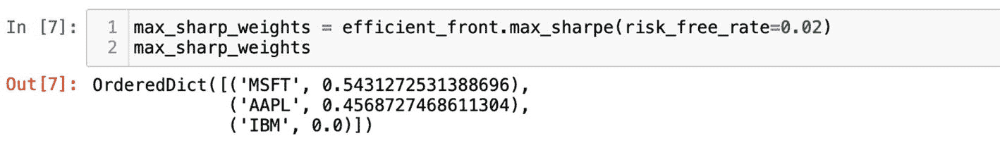

图 6-17 最大化投资组合的夏普比率

根据我们的假设和投资目标，`portfolio_performance()`方法将计算预期收益率、年化波动率和夏普比率。你需要记住的唯一一点是，`portfolio_performance()`将返回你在投资组合上执行的上一次操作的预期收益率和波动率。为了示例的清晰性，我们需要清空当前工作笔记本的内存。你可以通过在上方`Jupyter Notebook`的 `Kernel`菜单中选择`"Restart & Clear Output"`选项来实现。然后，你需要重新运行导入所有包、使用`Pandas-Datareader`获取历史价格、以及我们计算预期收益率和协方差矩阵的单元格。最后，选择你想要获取收益率和波动率的场景，例如最大化夏普比率，并运行该单元格。之后，你可以通过在有效前沿实例上运行`portfolio_performance()`来获取投资组合表现：

```python
efficient_front.portfolio_performance(verbose=True, risk_free_rate = 0.02)
```

我们可以向`portfolio_performance()`方法传递两个参数：`verbose`和`risk_free_rate`。`verbose`参数意味着返回的值将附带说明打印出来。默认情况下，`verbose`设置为`False`并返回一个包含原始数值的元组；`True`选项将打印所有值并附带说明（图 6-18）。`risk_free_rate`参数会影响预期收益率和波动率；因此，它应该反映未来假设的市场利率。

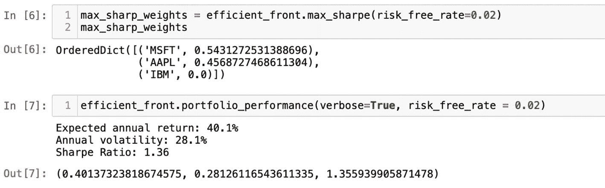

图 6-18 获取具有最大化夏普比率的投资组合的预期表现

此外，我们可以使用已导入的绘图方法`plot_weights()`绘制来自`max_sharpe()`方法的建议权重（图 6-19）：

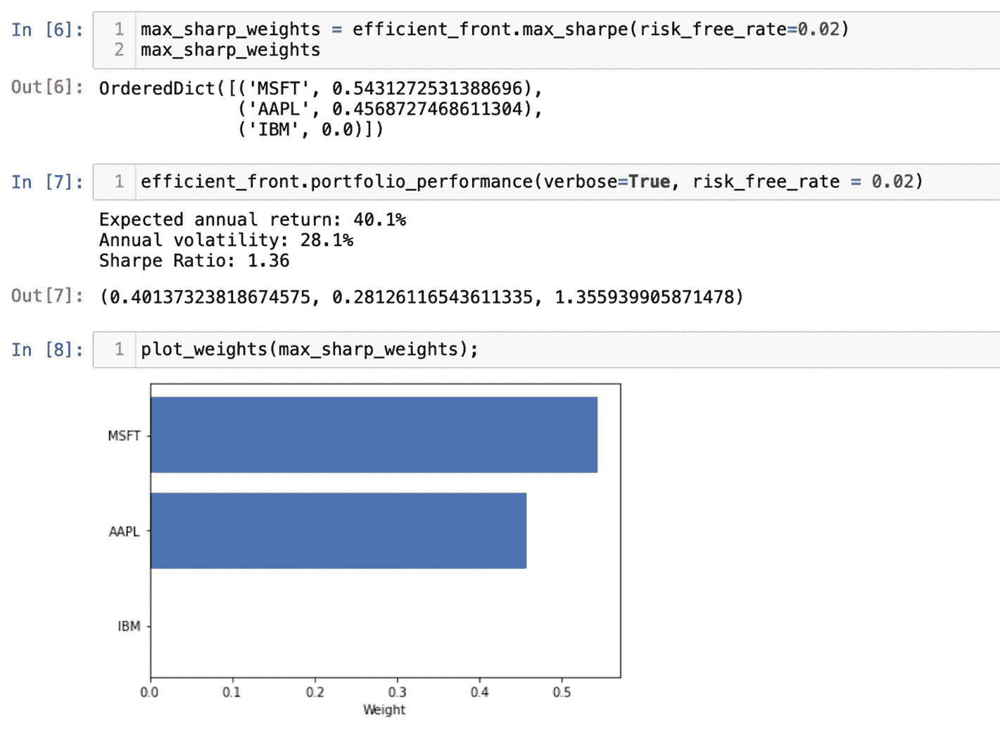

图 6-19 绘制具有最大化夏普比率的投资组合权重

```python
plot_weights(max_sharp_weights);
```

因此，要获取具有低波动性的投资组合的预期表现，我们需要再次清除所有输出并重启`Kernel`。然后重新运行单元格，并将`min_volatility()`方法应用于有效前沿的实例。在这种情况下，`portfolio_performance()`方法返回一组完全不同的表现指标（图 6-20）。

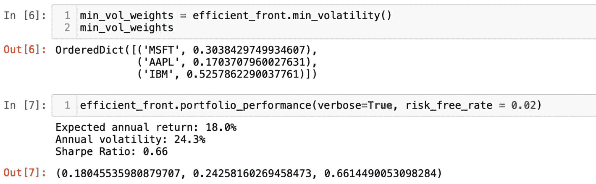

图 6-20 获取具有最小化波动性的投资组合的预期表现

最小波动性优化后的权重可视化将有助于理解资产配置。使用`plot_weights()`函数绘制它们（图 6-21）：

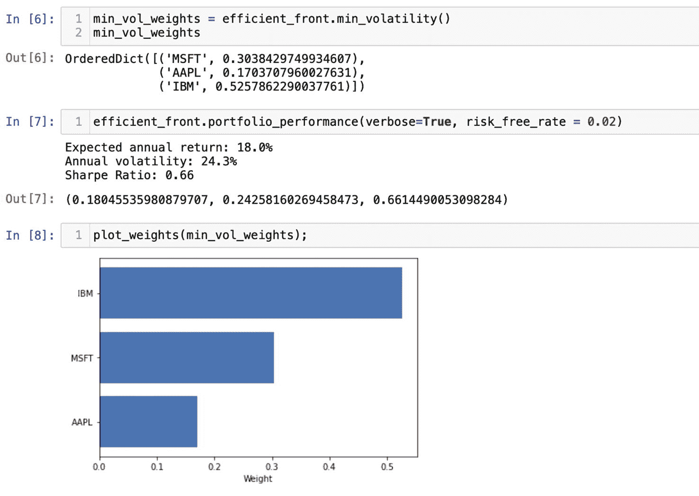

图 6-21 绘制具有最小化波动性的投资组合权重

```python
plot_weights(min_vol_weights);
```

正如我之前提到的，`PyPortfolioOpt`附带绘图工具，帮助我们可视化整个有效前沿。如果你已经运行了`min_volatility()`或`max_sharpe()`方法，`plotting()`函数将无法工作。我们需要通过清除内存和重置`Kernel`来恢复原始有效前沿的实例。之后，重新运行除包含`min_volatility()`和`max_sharpe()`方法之外的单元格。

使用一行代码和我们之前导入的`plotting()`函数，绘制曲线：

```python
plotting.plot_efficient_frontier(efficient_front, show_assets=True)
```

`show_assets`参数将确保股票也映射到图表上（图 6-22）。

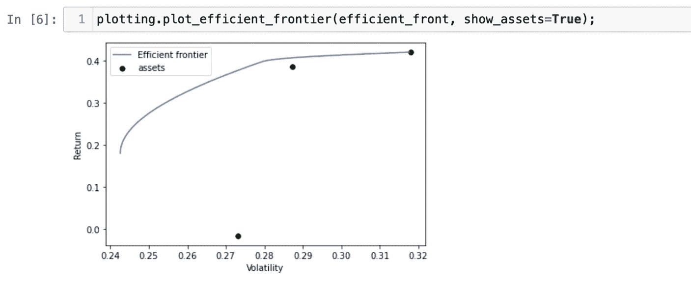

图 6-22 绘制投资组合的有效前沿

经典均值-方差优化有一个替代方案——`CLA`（关键线算法）。`CLA`是一种在曲线上寻找最优投资组合的优化解决方案。它在投资组合管理中非常流行，因为它是唯一专门为不等式约束投资组合优化设计的算法。它在`PyPortfolioOpt`中作为`CLA()`函数实现。`CLA()`函数需要预期收益和协方差矩阵来获取最优投资组合。将我们之前生成的值传入`CLA()`并绘制它（图 6-23）：

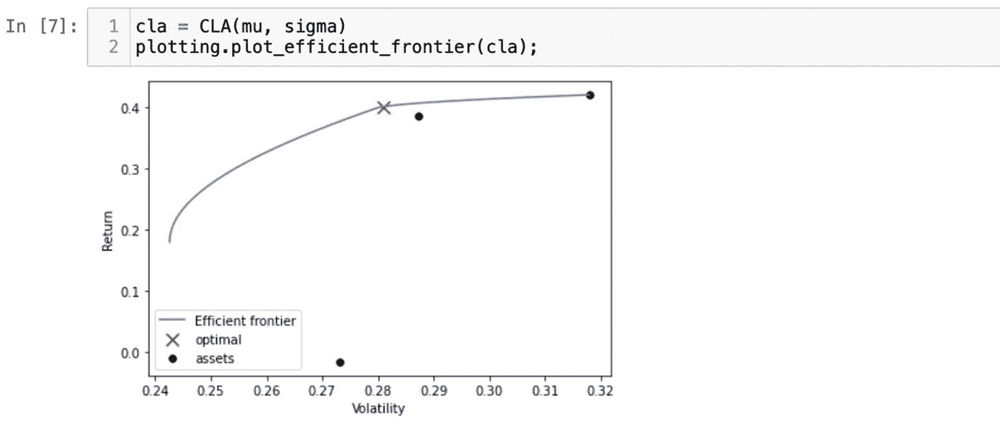

图 6-23 使用`CLA`绘制最优投资组合

```python
cla = CLA(mu, sigma)
plotting.plot_efficient_frontier(cla);
```

`PyPortfolioOpt`库在投资组合管理中是不可替代的。它易于使用且文档齐全。我的建议是关注文档（[`https://pyportfolioopt.readthedocs.io/en/latest/index.html`](https://pyportfolioopt.readthedocs.io/en/latest/index.html)）以了解新特性或变更。本章还有一些未涉及的附加功能，例如实现自己的优化器。我相信在以上示例之后，您对如何操作`PyPortfolioOpt`有了更好的理解。

# 基本面分析

如今，有多种方式可以获取公司财务信息。其中之一是我们在第 4 章讨论过的`Alpha Vantage API`。在这里，我想演示另一个 Python 包——`Fundamental Analysis`，用于获取和分析上市公司的资产负债表、利润表、现金流量表以及其他重要信息。

我们需要使用`pip`命令安装`Fundamental Analysis`库：

```bash
pip install FundamentalAnalysis
```

在一个新的 Jupyter Notebook 中，导入`Fundamental Analysis`、`Pandas`、`Requests`和`Matplotlib`以绘制数据：

```python
import FundamentalAnalysis as fa
import matplotlib.pyplot as plt
import pandas as pd
import requests
```

# `Fundamental Analysis` 是围绕 `Financial Modeling Prep API` 的一个小型 Python 封装，用于收集上市公司的基本信息。根据文档，它可以获取超过 13,000 家公司的详细数据。^(¹⁷)

要开始使用 `Financial Analysis` 包，您需要从 [`https://financialmodelingprep.com/developer/docs/`](https://financialmodelingprep.com/developer/docs/) 获取一个 `API Key`。注册并选择一个免费计划或付费计划以获取高级 API 和 30 年以上的历史数据。选择计划后，转到上方菜单中的仪表板，您可以在其中找到您的 `API Key`。收到 `API Key` 后，我们就可以开始探索 `Financial Analysis` 的功能。本例中使用的 `API Key` 将被禁用。

首先，获取所有可用公司及 ETF（交易所交易基金）的列表：

```python
API_KEY = "1b01185c3c4ae0c8626ad15beb99a957"
companies = fa.available_companies(API_KEY)
```

从 `available_companies()` 函数以及其他所有函数接收到的数据均以 `DataFrame` 形式呈现。使用 `iloc[]` 方法，我们可以在行之间移动（图 6-24）：

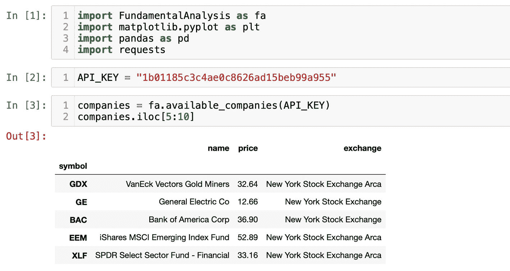

**图 6-24** 浏览可用公司列表

```python
companies.iloc[5:10]
```

如果您有喜欢的公司，请使用其交易所代码。我将使用埃克森美孚公司。埃克森美孚在纽约证券交易所的代码是 `XOM`。函数 `profile()` 将获取任何上市公司的基本信息（图 6-25）：

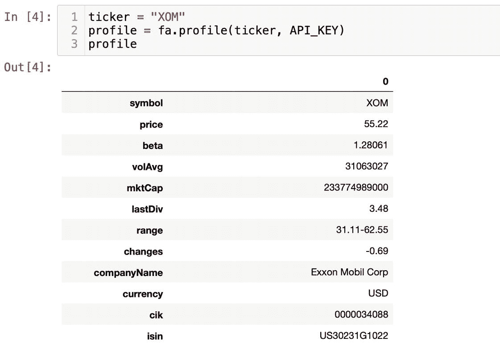

**图 6-25** 接收 `XOM` 代码的公司简介

```python
ticker = "XOM"
profile = fa.profile(ticker, API_KEY)
```

估值是一项重要信息，`Financial Analysis` 通过函数 `enterprise()` 提供，免费计划可获得五年期数据，付费计划可获得更长时期的数据（图 6-26）：

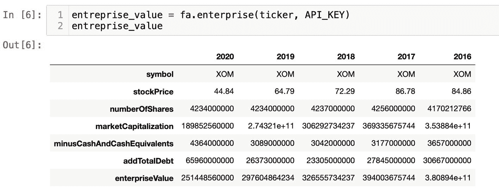

**图 6-26** 埃克森美孚公司估值

```python
entreprise_value = fa.enterprise(ticker, API_KEY)
entreprise_value
```

它被称为基本面分析是有原因的；使用函数 `balance_sheet_statement()`，我们可以获取上市公司多年期的资产负债表（图 6-27）。关键字参数 `period` 可以设置为 `"annual"` 或 `"quarter"` 选项。除了资产和负债，`balance_sheet_statement()` 还返回指向 SEC（美国证券交易委员会）文件的链接，以便您直接追溯至数据源。

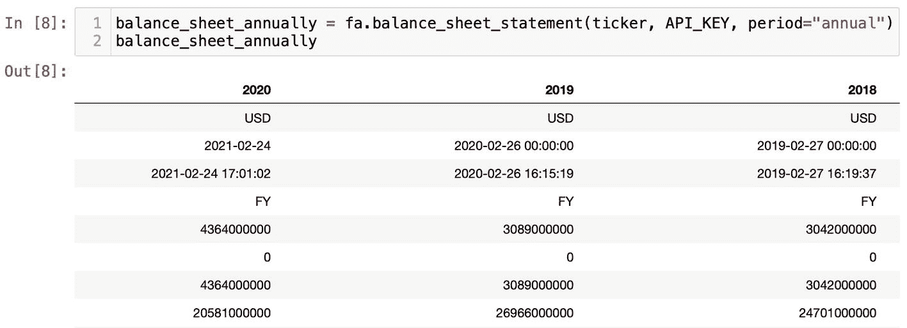

**图 6-27** 埃克森美孚公司资产负债表

除了资产负债表，您还可以获取利润表和现金流量表：

```python
income_statement_annually = fa.income_statement(ticker, API_KEY, period="annual")
cash_flow_statement_annually = fa.cash_flow_statement(ticker, API_KEY, period="annual")
```

我们可以使用 `Matplotlib` 对数据进行可视化分析。毛利是基本面分析的重要组成部分，我们将通过绘制柱状图来可视化营业收入和营业成本。

在图的 `x` 轴上，我们将绘制年份：

```python
x = income_statement_annually.columns
```

然后从利润表中获取营业收入和营业成本的数据：

```python
revenue = income_statement_annually.loc["revenue"]
cost = income_statement_annually.loc["costOfRevenue"]
```

与其他 `Matplotlib` 图形类似，柱状图需要 `x` 和 `y` 轴参数的坐标。同时，我们将指定柱子的 `color` 和 `width` 参数：

```python
plt.bar(x, revenue, color ='maroon', width = 0.6)
plt.bar(x, cost, color ='blue', width = 0.6)
plt.title("Exxon Mobil Corp Revenue/Cost of Revenue");
```

基于可视化分析，我们发现 2020 年对埃克森美孚公司来说是艰难的一年（图 6-28）。

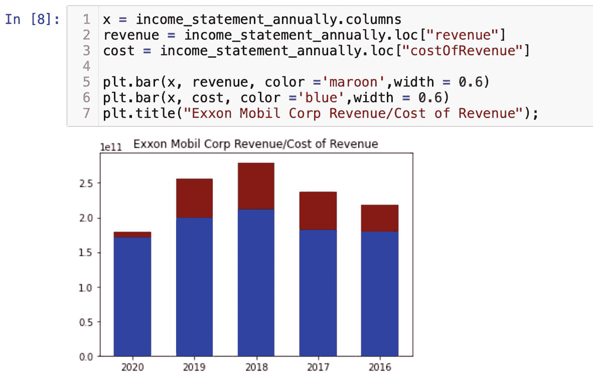

**图 6-28** 毛利率可视化

使用 `Financial Analysis`，您可以获取来自美国证券交易委员会（SEC）的原始数据或关键财务比率。

函数 `key_metrics()` 将提供所有主要指标，例如流动比率、股本回报率等：

```python
ratios = fa.key_metrics(ticker, API_KEY)
```

使用 `Matplotlib` 的 `subplot()` 函数，我们将在同一张图但不同窗口中绘制来自 `ratios` 的投资资本回报率和股本回报率。我们将 `x` 轴设置为 `ratios.columns` 对应的年份，`y` 值将从行中获取 `roic` 和 `roe`。我们通过 `DataFrame` 的 `loc[]` 方法按标签获取行：

```python
x = ratios.columns
roic = ratios.loc["roic"]
roe = ratios.loc["roe"]
plt.subplot(211)
plt.plot(x, roic, color="blue", marker="o", label="ROIC")
plt.legend()
plt.subplot(212)
plt.plot(x, roe, color="green", linestyle='--', label="ROE")
plt.legend();
```

在 `subplot` 方法中，数字 `211` 和 `212` 表示网格布局：第一个数字 `2` 代表行数，第二个数字 `1` 代表列数；每个子图仅占一列。最后一个数字则表示该子图在整个图形中的位置。

该绘图在同一图形中生成两个子图，每个图形显示独立的数据（图 6-29）。

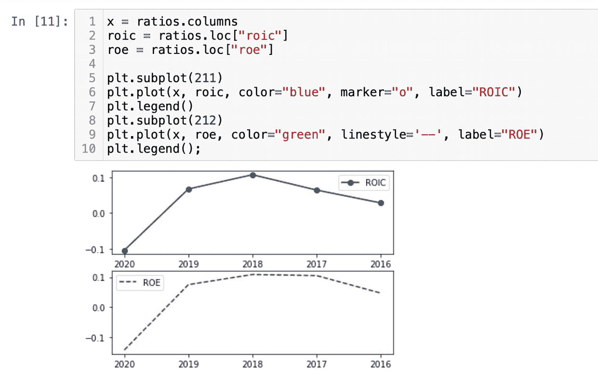

**图 6-29** 绘制 ROIC 与 ROE 比率

## 财务比率

另一组比率是财务比率。财务比率能够为投资者提供关于公司健康状况的重要信息，并帮助在同一行业内比较公司的表现。我们可以通过 `financial_ratios()` 函数获取这些比率：

```python
fin_ratios = fa.financial_ratios(ticker, API_KEY)
```

在获取的财务比率中，我打算绘制的是存货周转率。

存货周转率反映了公司销售存货的速度。2016 年较高的存货周转率意味着更高的销售额，这可能反映了当时的高油价（图 6-30）。

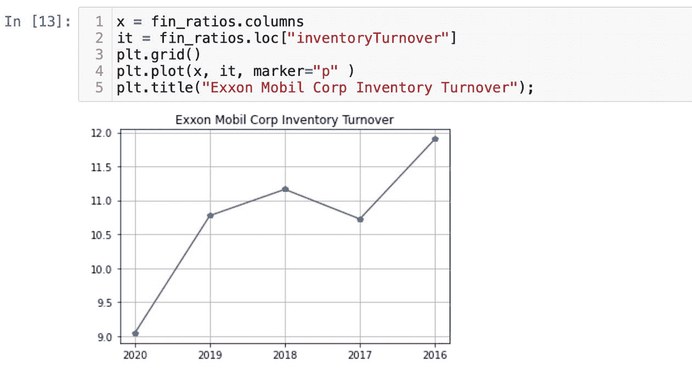

**图 6-30** 绘制存货周转率

财务分析是一个非常便捷的包，仅需几行代码就能获取财务信息。正如本章所见，你可以从零开始构建解决方案，也可以使用 Python 的第三方库。选择哪条路完全取决于你。如果你是算法交易员，可能会倾向于定制化、高度优化的解决方案。另一方面，如果你需要快速获取数据，总能找到一个能完成工作的 Python 包。依我看来，Python 是任何类型财务分析的绝佳工具。

# 脚注

7. 用 Python 完成数字营销的关键任务

数字营销需要数字工具来处理社交媒体、发送销售邮件以及在万维网上获取客户。有众多营销应用可以帮助数字营销人员运行、测试和分析促销活动，但其中一些贵得离谱，另一些则无法定制，需要额外工作才能获得所需结果。如果能用几行代码免费运行和评估任何自定义场景，那该多好？你可以用 Python 构建自己的营销工具。所有大型科技巨头都提供免费且易用的 API，用于自动化任务和管理信息。

在本章中，我们将介绍 Google、Twitter 和 Mailgun 中最流行的营销服务。利用它们的 API 和 Python，我们将实现许多繁琐任务的自动化。此外，我们还将学习如何以 Python 可读的格式获取营销数据，以便用 Pandas 进行分析。

我们将从最核心的数字营销工具——Google Analytics 开始。Google 是一家对 Python 友好的公司，Python 的发明者 Guido van Rossum 曾在 Google 工作过一段时间。许多 Google 服务都运行在 Python 上，而且几乎所有这些服务都可以通过 API 访问。Google 甚至有自己的 Python 库，以尽可能简化与其服务的连接。

## 开始使用 Google API 客户端

我想先快速介绍一下 `Google API Client` 包。`Google API Client` 库提供了所有核心 Google 产品的入口。无论你是想通过 Gmail 账户发送或读取邮件，还是用 Python 访问 Google Maps，都需要在机器上安装 `Google API Python Client`。

使用 Python 包管理器 `pip` 即可轻松完成安装。在 Anaconda Navigator 中打开终端 → Environments → base → Terminal，然后使用 `pip` 命令安装 `Google API Client` 包：

```bash
pip install google-api-python-client
```

所有 Google 服务都需要进行身份验证并启用 API。¹⁸ 我接下来要描述的过程适用于任何 Google API 服务的通用场景。

Google 建议在统一平台——Google Cloud Platform（`https://cloud.google.com/`）上管理项目并监控 API 使用情况。部分 Google 服务免费，部分需要付费，但无论如何，Google 为新手开发者提供了 300 美元的信用额度，足以试用这些 API。如果你还没有 Google 账号，请在 `https://accounts.google.com` 创建一个，然后登录到 Google Cloud Platform。

由于信息过多且存在陌生缩写，Google Cloud Platform 的控制面板可能对新手来说有些令人望而生畏。我们需要为 API 创建一个新项目。

### 第 1 步

在顶部 Google Cloud Platform 标志旁边寻找“创建项目”，或者直接跳转到“管理资源”页面（`https://console.cloud.google.com/cloud-resource-manager`）。在“管理资源”页面上，你会看到顶部的“创建项目”按钮（图 7-1）。


**图 7-1** Google Cloud Platform“管理资源”页面

点击“创建项目”，并在新项目提示中为项目命名。名称可以是任何内容，位置字段可保留默认值“无组织”。

### 第 2 步

点击蓝色的“创建”按钮后，你应该能在控制面板中看到新创建的项目。如果 Google Cloud Platform 首页上已有其他项目，请在顶部菜单中选择你想要使用的那个。

### 第 3 步

控制面板由多个卡片组成；选择标有“API”的卡片。在 API 卡片的底部，你会看到一个“前往 API 概览”的箭头。你可能还记得第 4 章的内容，几乎任何 API 都需要通过 API 密钥进行身份验证。API 概览链接应将你带到“API 和服务”页面，在那里你可以查看所有使用信息并建立凭据。

### 第 4 步

在“API 和服务”页面顶部，点击加号“启用 API 和服务”。这将带你进入 API 库，你可以在这里选择任何想要连接的 Google 服务。在当前情况下，在页面上的搜索提示中输入 `Google Analytics API`。除了 `Google Analytics API`，我们还筛选出了所有其他 Google 分析服务，例如 `Google Analytics Reporting API` 和 `YouTube Analytics`。选择 `Google Analytics Reporting API`（图 7-2）。


**图 7-2** 搜索 `Google Analytics Reporting API` 服务

`Google Analytics Reporting API` 页面提供了该服务的所有信息。此外，你还可以找到教程和文档的链接。我建议你持续关注文档，因为它们今后可能会有所变动。

我们的目标是调用 `Google Analytics Reporting API`；在该页面上找到蓝色的“启用”按钮并点击它。之后，你应被重定向回“API 和服务”页面。要拥有一个功能完善的 Google 应用服务，最后一步是为该服务获取一个 API 密钥。在左侧菜单中，点击带有钥匙图标的“凭据”选项。

凭据页面允许你初始化、管理和更改 API 密钥。在凭据页面顶部，你应该会看到加号“创建凭据”按钮。点击它并选择“API 密钥”选项。创建 API 密钥后，会弹出“API 密钥已创建”卡片（图 7-3）。

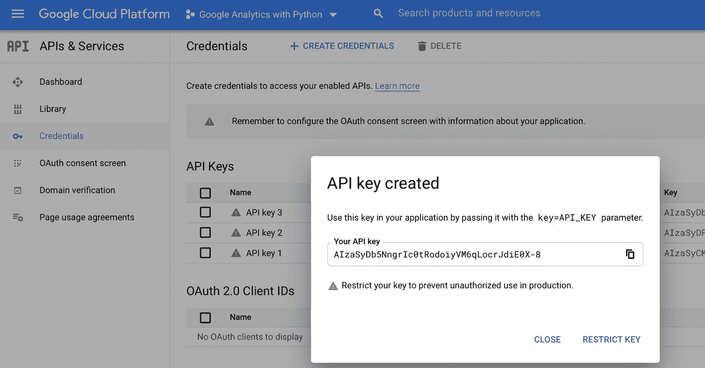

**图 7-3** 为 Google Analytics 服务生成 API 密钥

大多数 Google API 服务都需要 API 密钥，请妥善保存该密钥，以备后续使用。

### 结合 Python 使用 Google Analytics

距离我们首次调用 Google Analytics API 仅一步之遥；Google Analytics 要求以 JSON 格式提供 API 密钥。生成包含密钥的 JSON 文件的简单方法是，在 Google Cloud Platform 中打开“服务账号”页面。你可以在顶部的搜索框中搜索该页面，或者通过左侧菜单导航至“IAM 与管理”。在“IAM 与管理”中，选择“服务账号”选项；它将带你进入 `https://console.cloud.google.com/iam-admin/serviceaccounts` 页面。如果你有多个项目，请点击与 Google Analytics 相关的那个项目。在那里，你应该会看到 Google 为该服务创建的项目电子邮件（图 7-4）。

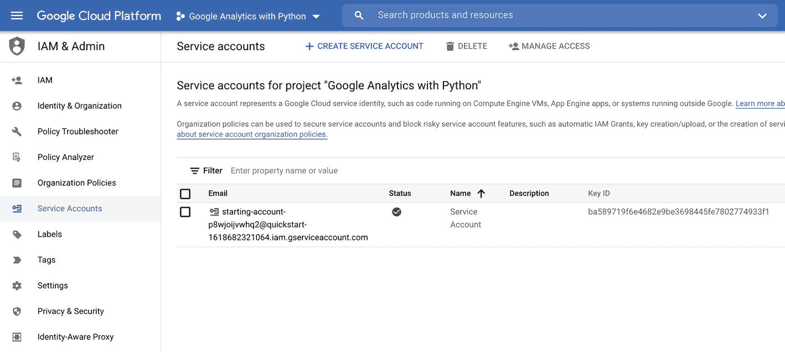

**图 7-4** 服务账号页面与 Google 服务电子邮件

点击该电子邮件并导航至“密钥”标签页。在该页面中，你会看到“添加密钥”按钮。点击“添加密钥”并选择“创建新密钥”选项。弹出的窗口将提供生成 JSON 密钥文件的选项（图 7-5）；点击“创建”按钮，并将其保存到你的计算机中。

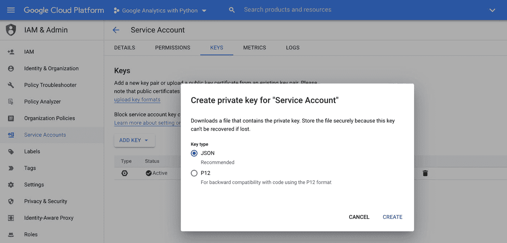

**图 7-5** 生成密钥并保存为 JSON 文件

最后，在我们生成了 JSON 格式的 API 密钥后，就可以编写一些代码来使用 Google Analytics 了。现在是时候编写 Python 代码了；打开一个新的 `Jupyter` Notebook，并将下载的 JSON 密钥文件移动到相同的工作目录中。此外，将 JSON 文件重命名为 `client_secret_api.js` 会是个好主意。

为了进行身份验证，我们需要安装 `oauth2client` 库。你知道在哪里找到终端窗口，只需运行 `pip` 命令并安装该库即可：

```
pip install oauth2client
```

在新的 `Jupyter` Notebook 顶部，导入以下模块：

```
from oauth2client.service_account import ServiceAccountCredentials
from apiclient.discovery import build
```

在脚本的开头，我们需要定义凭据。所有尝试访问 Google Analytics 的用户，`SCOPES` 都是相同的。`KEY_FILE_LOCATION` 应提供包含 API 密钥的已下载 JSON 文件的路径。我已将文件重命名为 `client_secret_api.json`。最后，`VIEW_ID` 应填写你 Google Analytics 项目的视图 ID。你可以在 [analytics.google.com](http://analytics.google.com) 页面上找到 `VIEW_ID`。如果你在 Google Analytics 中激活了“创建 Universal Analytics 媒体资源”选项，`VIEW_ID` 将分配给所跟踪的 Web 资源。进入左下角的“管理”设置，查找“视图设置”。在“基本设置”中，你将找到网站的“视图 ID”编号。此外，在 Google Analytics 中，将服务账号中的电子邮件（图 7-4）添加到账号用户管理中允许生成报告的用户列表中。

```
SCOPES = ['https://www.googleapis.com/auth/analytics.readonly']
KEY_FILE_LOCATION = 'client_secret_api.json'
```

VIEW_ID = '123415356'

为了初始化凭据，我们将使用导入的 `ServiceAccountCredentials`，并传入 `KEY_FILE_LOCATION` 和 `SCOPES` 作为参数：

```
credentials = ServiceAccountCredentials.from_json_keyfile_name(KEY_FILE_LOCATION, SCOPES)
```

接着，我们需要通过 `build()` 函数连接 Google API 客户端库。正如我之前提到的，Google API 客户端包是通用的，适用于所有 Google 服务。在 `build()` 函数中，你需要指定要连接的服务以及该包的版本：

```
analytics = build('analyticsreporting', 'v4', credentials=credentials)
```

Google Analytics 报告需要指定一个时间段。我们可以设置 `start_date` 和 `end_date`：

```
start_date = "2020-01-01"
end_date = "2021-04-23"
```

此外，我们还需要为 Google Analytics 报告指定维度和指标。你可以在以下链接中找到所有可用指标的列表：[`https://ga-dev-tools.appspot.com/dimensions-metrics-explorer/`](https://ga-dev-tools.appspot.com/dimensions-metrics-explorer/)。

对于我的第一份报告，我将使用非常常用的 `users` 和 `sessions` 指标。要发送此报告的请求，我们需要使用 `analytics.reports()` 函数，并在请求体中指定 `VIEW_ID`、日期、指标和维度：

```
response = analytics.reports().batchGet(body={
    'reportRequests': [{
        'viewId': VIEW_ID,
        'dateRanges': [{'startDate': start_date, 'endDate': end_date}],
        'metrics': [
            {"expression": "ga:users"},
            {"expression": "ga:sessions"}
        ]
    }]
}).execute()
```

`users` 和 `sessions` 指标参数应以数组键值对的形式传入函数，其中 `"expression"` 后跟指标名称。

在新的单元格中打印响应，你会看到 Google Analytics 生成的报告以 JSON 格式呈现（图 7-6）。

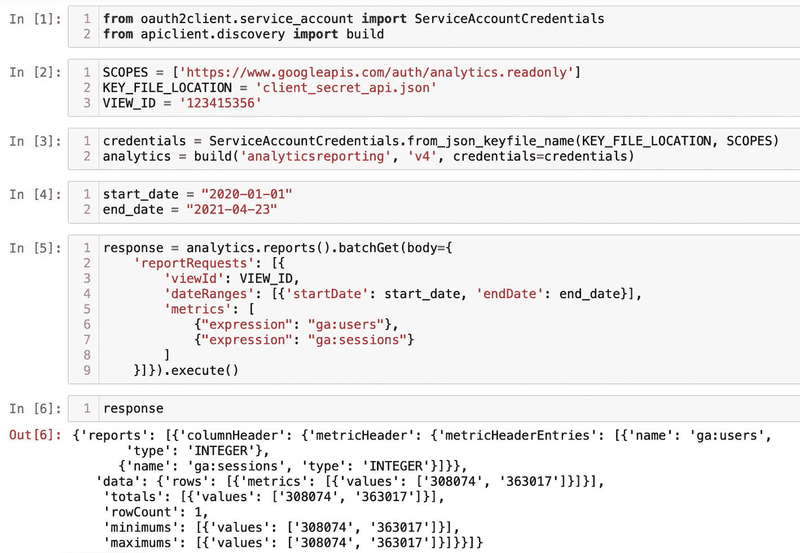

图 7-6
生成用户和会话指标的 Google Analytics 报告

我们之前处理过 JSON 数据，知道它的工作方式类似于 Python 字典。

响应包含一个存储在 `"reports"` 键下的数组。我们可以获取这个数组并提取第一个元素：

```
response['reports'][0]
```

我们所需的信息存储在 `data` 键下。`data` 包含另一个字典，我们可以通过调用字典方法 `keys()` 查看所有键：

```
response['reports'][0]["data"].keys()
```

得到的结果如下：

```
dict_keys(['rows', 'totals', 'rowCount', 'minimums', 'maximums'])
```

`totals` 键中存储了我们想要使用的信息。我们将获取 `users` 和 `sessions` 的值：

```
report = response['reports'][0]["data"]['totals'][0]
users = report['values'][0]
sessions = report['values'][1]
```

在图 7-7 中，我们可以看到有 308087 个唯一身份用户访问了该网站，总共产生了 363031 次会话。

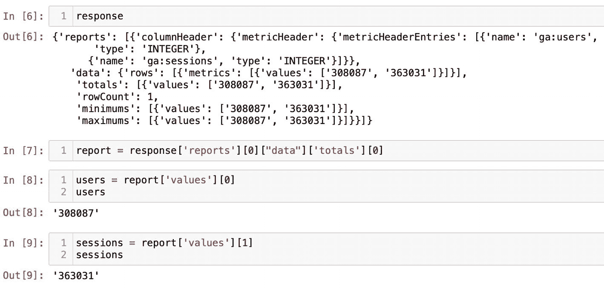

图 7-7
从 JSON 响应中提取用户和会话值

为了可视化用户与网站的互动程度，我们可以绘制新用户和回访用户的比例图。`sessions` 包含所有访客，包括新用户和回访用户。而 `users` 则代表新访客。

我们需要在存放所有导入语句的第一个单元格中导入 Matplotlib：

```
import matplotlib.pyplot as plt
```

新访客的百分比可以通过 `users` 除以 `sessions` 计算得出。不要忘记 JSON 数据以字符串形式提供，所有值都需要转换为数值数据类型：

```
new_visitors = int(users)/int(sessions)
returning_visitors = 100 - new_visitors
```

我们将用这些数据绘制一个环形图。环形图是饼图与圆形的结合（图 7-8）：

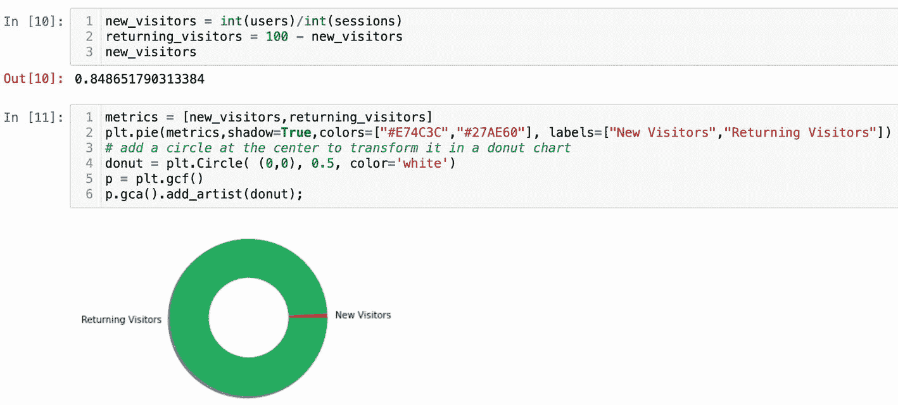

图 7-8
基于指标值的新用户和回访用户图表

```
metrics = [new_visitors, returning_visitors]
plt.pie(metrics, shadow=True, colors=["#E74C3C","#27AE60"], labels=["New Visitors", "Returning Visitors"])
donut = plt.Circle( (0,0), 0.5, color='white')
p = plt.gcf()
p.gca().add_artist(donut);
```

另一个常用的 Google Analytics 报告是页面浏览量与会话时长。

`Dates` 和 `VIEW_ID` 将与上一个示例中的相同。这次，我们可以将接收到的数据构建为 DataFrame。在第一个单元格中，将 Pandas 添加到已导入的库中：

```
import pandas as pd
```

根据 Google 尺寸与指标浏览器^(19)，我们需要将 `ga:pageviews` 和 `ga:avgSessionDuration` 作为指标，将 `ga:deviceCategory` 作为维度。让我们像这样编译一个分析报告请求：

```
response = analytics.reports().batchGet(body={
    'reportRequests': [{
        'viewId': VIEW_ID,
        'dateRanges': [{'startDate': start_date, 'endDate': end_date}],
        'metrics': [
            {"expression": "ga:pageviews"},
            {"expression": "ga:avgSessionDuration"}
        ], "dimensions": [
            {"name": "ga:deviceCategory"}
        ]
    }]
}).execute()
```

您收到的响应应类似于图 7-9 所示。

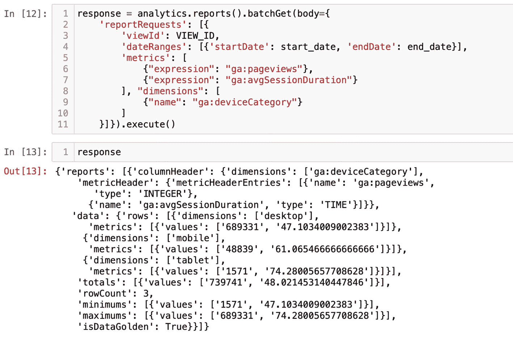

图 7-9
请求关于页面浏览量和会话时长的 Google Analytics 报告

与前面的示例一样，我们需要从响应中提取值。在大多数 API 中，所有信息都存储在 `"data"` 键下。使用字典表示法，我们可以解包响应并访问 `"data"`：

```
response['reports'][0]["data"]
```

由于我们请求了维度值，数据中包含另一个键 `"rows"`。我们可以将该路径存储在一个新变量 `report_two` 下：

```
report_two = response['reports'][0]["data"]["rows"]
```

如果你对`report_two`对象运行`type()`函数，你会发现它是一个列表数据结构。`report_two`列表包含三个字典，这些字典带有`"dimensions"`和`"metrics"`键。同时，`"metrics"`指向另一个列表，该列表包含一个字典和键`"values"`（图 7-10）。

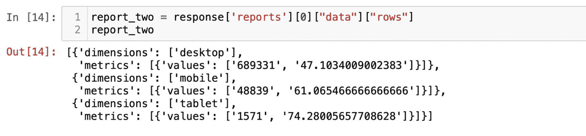

**图 7-10** 解包响应

我们的目标是获取这些值并将它们存储在 DataFrame 中。由于`report_two`是一个列表，我们可以遍历它并使用字典表示法获取值：

```python
for item in report_two:
    print(
        item["dimensions"][0], item["metrics"][0]["values"][0], item["metrics"][0]["values"][1]
    )
```

我知道`for`循环中的`print()`部分有点混乱且令人困惑。我来解释一下发生了什么。我们从`item["dimensions"][0]`开始。在图 7-10 中，我们看到`"dimensions"`键持有一个包含一个值的列表；要获取该值，我们需要用`[0]`对其索引。在`for`循环中，变量`item`代表`report_two`列表中的每个字典。`item["dimensions"]`给我们另一个列表，然后我们对其索引以获取第一个且唯一的值`item["dimensions"][0]`。使用相同的逻辑，我们可以获取页面浏览量值。`item["metrics"]`给我们一个列表；我们用`[0]`对其索引，并看到另一个像这样的字典：`{'values': ['689331', '47.1034009002383']}`。键`"values"`（即`item["metrics"][0]["values"]`）指向另一个包含两个值的列表。一个用于页面浏览量，另一个用于会话时长。该列表中的第一个值可以用`[0]`索引，第二个用`[1]`索引。归根结底，`item["metrics"][0]["values"][0]`为我们获取页面浏览量的值，而`item["metrics"][0]["values"][1]`获取会话时长的值。
为了将所有值存储为 DataFrame，我们需要将它们放入 Python 列表中。

初始化三个空列表：

```python
devices = []
pageviews = []
session_duration = []
```

当我们遍历`report_two`列表时，我们将值追加到每个列表。请始终牢记，将来你可能想对这些值进行某些处理，比如过滤或比较。响应以字符串形式返回，我们将把值转换为整数和浮点数：

```python
devices = []
pageviews = []
session_durations = []

for item in report_two:
    device = item["dimensions"][0]
    page = int(item["metrics"][0]["values"][0])
    session = round(float(item["metrics"][0]["values"][1]),2)
    devices.append(device)
    pageviews.append(page)
    session_durations.append(session)
```

将所有值分组到列表中后，我们将构建一个 DataFrame：

```python
data = pd.DataFrame()
```

将列表作为列添加：

```python
data["Page_views"] = pageviews
data["Session_duration"] = session_durations
data.index = devices
```

最终，收到的报告简化为存储在 DataFrame 中的干净值，可以进行分析（图 7-11）。

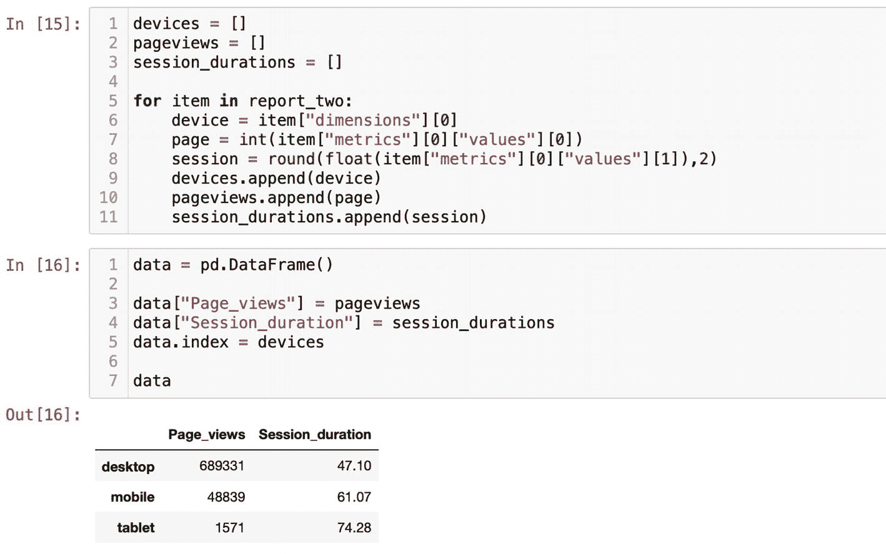

**图 7-11** 存储在 DataFrame 中的 Google Analytics 报告值

用一行代码，我们就可以可视化数据。这次，我们将使用 Pandas 内置的`plot()`和`pie()`方法：

```python
data.plot.pie(figsize=(18, 12), subplots=True, colors=["#FF0000","#00FF00","#0000FF"]);
```

我们的页面浏览量与会话时长报告图表将如图 7-12 所示。

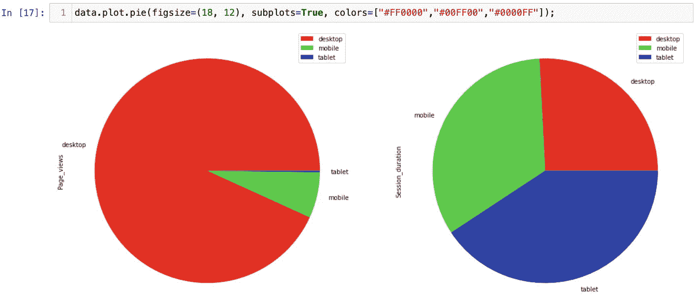

**图 7-12** 来自 Google Analytics 报告的页面浏览量和会话时长值的可视化

每次我查看 Google Analytics 时，我都想知道访问我网站的访客来自哪里。使用相同的 Google Analytics 请求模板，我们将通过国家/地区和城市获取会话的位置。

这次，我将缩短日期范围并将其设置为三天。使用更长的时间段，您将获得更多信息。每个 Google Analytics 响应包含一千行，要获取所有数据，您需要使用`while`循环重复发送 API 请求，直到获取所有行。对于维度，我将使用`ga:country`和`ga:city`。另一种跟踪网站访客的方法是使用`ga:latitude`和`ga:longitude`。除了日期范围和维度之外，我的 Google Analytics 请求将保持不变：

```python
response = analytics.reports().batchGet(body={
    'reportRequests': [{
        'viewId': VIEW_ID,
        'dateRanges': [{'startDate': "2021-04-20", 'endDate':"2021-04-23"}],
        'metrics': [
            {"expression": "ga:sessions"},
        ], "dimensions": [
            {"name": "ga:country"},
            {"name":"ga:city"}
        ]
    }]}).execute()
```

在图 7-13 中，您可以看到我针对三天时段收到的响应尾部。请注意，`rowCount`为 758，这意味着所有信息都在响应中返回。如果您有更多访客或使用更长的时间范围，响应将包含`nextPageToken`。然后，您需要发送另一个请求来获取接下来的 1000 行。

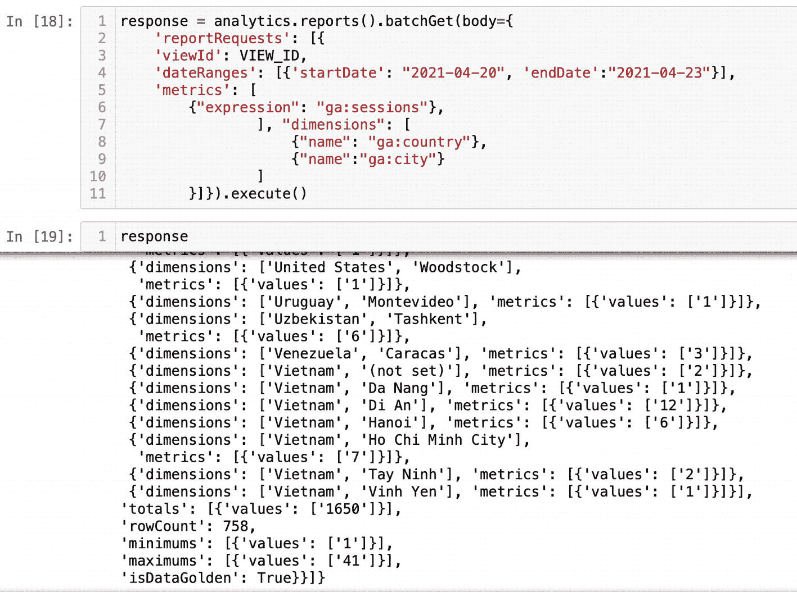

**图 7-13** 调用 Google Analytics API 查看按国家/地区和城市维度划分的网站访客

原始响应数据必须转换为适合分析的 DataFrame。这个过程将与我们之前示例中所做的类似。

我们需要从响应中获取信息。我将把信息保存为变量名`report_three`下的列表：

```python
report_three = response['reports'][0]["data"]["rows"]
```

然后，我们需要初始化三个 Python 列表来保存数据：

```python
countries = []
cities = []
sessions = []
```

为了遍历`report_three`并从每一行中获取`country`、`city`和`sessions`，我们将使用`for`循环：

```python
for item in report_three:
    country = item["dimensions"][0]
    city = item["dimensions"][1]
    session = item["metrics"][0]["values"][0]
    countries.append(country)
    cities.append(city)
    sessions.append(session)
```

当所有数据都在列表中后，我们可以从中构建一个 DataFrame。

初始化一个新的 DataFrame：

```python
location = pd.DataFrame()
```

将列表作为值分配给 DataFrame `location`中的列：

```python
location["Country"] = countries
location["City"] = cities
location["Sessions"] = sessions
```

# DataFrame `location` 与 Google Analytics 数据

DataFrame `location` 中的某些值包含 `(not set)`（图 7-14）。这仅仅意味着 Google Analytics 无法根据地理位置识别访问者。

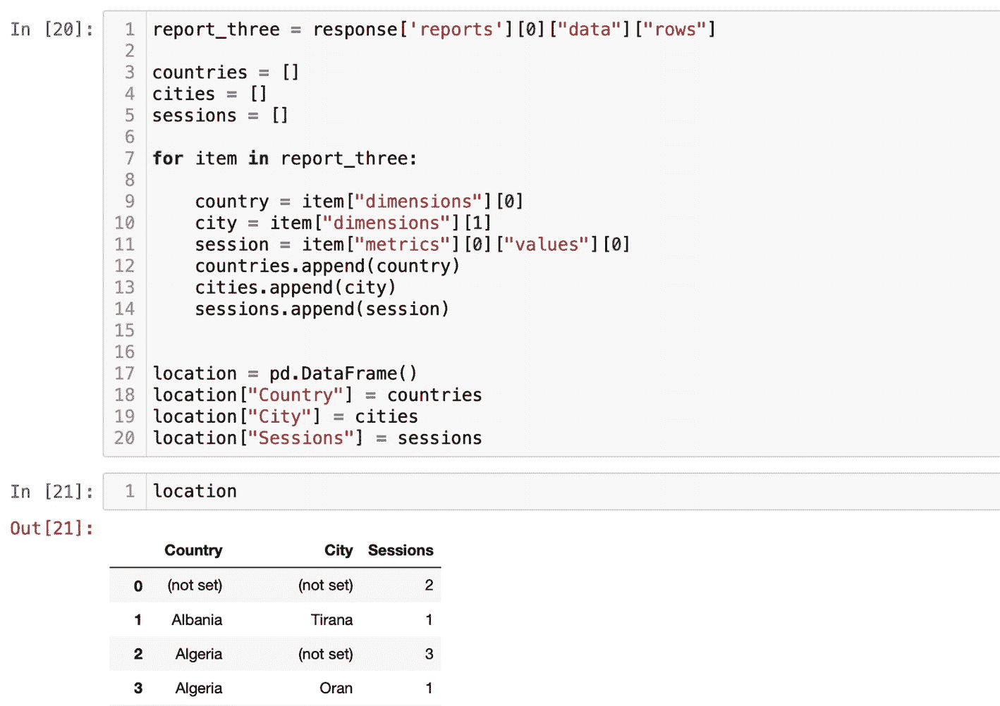

**图 7-14** 使用从 Google Analytics API 收到的响应中的值构建 DataFrame

对我来说，最重要的市场是美国，我可以按 `Country` 列对 DataFrame 进行排序：

```python
market = location[location.Country=="United States"]
```

同时，我想查看在这三天内 `sessions` 最多的城市。我将按会话数量对 `market` 数据进行排序：

```python
market.sort_values(by="Sessions", ascending=False, inplace=True)
```

此操作可能会收到一条警告，提示你正在尝试保存主 DataFrame 切片上的排序值（图 7-15）。这是因为我们使用了 `inplace=True`。`inplace` 参数会保存更改。这没问题，只是一个警告。要获取会话数量最多的三个城市，我可以对 `market` DataFrame 进行切片操作：

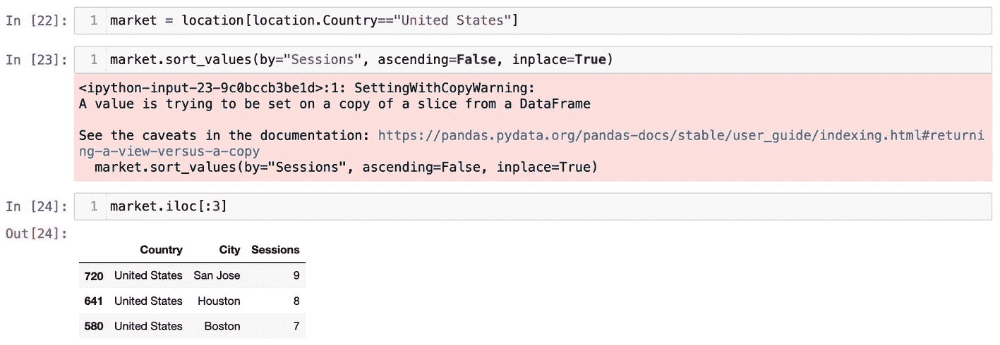

**图 7-15** 按会话列的值对 DataFrame 进行排序

```python
market.iloc[0:3]
```

我认为 Google Analytics 这个例子让你对如何使用 Google API 有了一定的了解。所有其他的 Google API 包都需要相同的身份验证，并且获取 API 密钥的过程与我们在本章开始时所做的几乎相同。

# Twitter 机器人

Python 的另一个实际应用是为社交媒体和聊天构建机器人。这里，我们将构建一个简单的 Twitter 机器人。它将在 Twitter 账号上发布内容。

坦白说，最近让你的机器人在 Twitter 上注册并获得 API 密钥变得更加困难了。希望在这本书出版时，Twitter 的身份验证过程仍如同我在这里描述的一样。

作为开发者，你应该从 Twitter 开发者文档开始你的 API 注册流程：[`https://developer.twitter.com/en`](https://developer.twitter.com/en)。在那里你可以找到大量关于如何自动化你的 Twitter 账号的信息。此外，他们还有一个开发者问答博客，你可以在那里找到大量有用的信息，并获得与 Twitter 相关问题的答案。

在我们开始编码之前，我们需要在 [`https://developer.twitter.com/en/portal/dashboard`](https://developer.twitter.com/en/portal/dashboard) 注册我们未来的应用并获取 API 密钥。但在此之前，你应该已经是 Twitter 用户并拥有一个活跃账号。

获取 Twitter API 密钥的流程如下：使用你的 Twitter 账号登录 Twitter 开发者门户。在那里，你需要点击中央按钮 **“创建项目”** 来启动一个新应用。请准备好提供你的电话号码。如果你的个人资料中没有电话号码，Twitter 将不允许你创建应用。

要获取 API 密钥，你需要提供项目名称，并简要说明你机器人的用途（图 7-16）。


**图 7-16** 注册一个新的 Twitter 应用

回答完所有问题后，Twitter 会为你提供 API Key、API Secret Key 和 Bearer Token。这是我们机器人进行 Twitter 身份验证所需的三个密钥。除了这些密钥，你还需要生成一个 Access Token 和一个 Secret Token。要生成令牌，在左侧菜单的 **项目与应用** 下，点击你的应用名称。点击应用后，你应该会看到 **应用详情** 信息。向下滚动，找到 **应用权限** 部分。在 **应用权限** 部分，点击 **编辑** 选项并切换到 **读取和写入** 模式。这个操作对于机器人能够发布推文是必要的。在同一页面顶部的 **密钥和令牌** 部分，你需要生成 **访问令牌和秘密令牌**。点击 **重新生成** 按钮，并将令牌存储在安全的地方（图 7-17）。

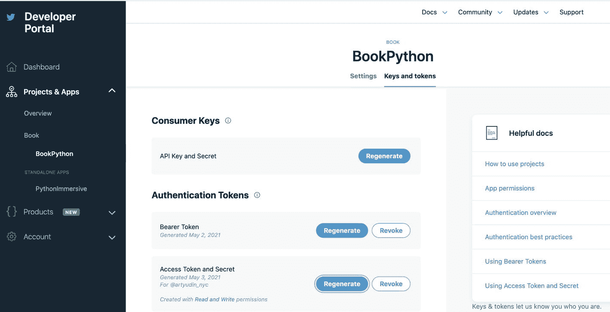

**图 7-17** 生成访问令牌和秘密令牌

当你手头有所有 API 密钥和访问令牌后，就可以准备构建一个 Twitter 机器人了。

有几个 Python Twitter 库。我个人更喜欢 Tweepy，因为它简单易用。如果你以后决定构建比我们在这里介绍的内容更复杂的东西，你随时可以查阅 Tweepy 文档 ([`https://docs.tweepy.org/en/latest/`](https://docs.tweepy.org/en/latest/))。

## 安装 Tweepy

Tweepy 不是 Anaconda 的一部分，你需要单独安装它。在终端窗口中，运行：

```
pip install tweepy
```

在一个新的 **Jupyter** Notebook 中，导入 Tweepy，这是我们发送推文所需的库：

```python
import tweepy
```

下一步是定义 Twitter 提供给我们的 API 密钥和令牌：

```python
API_KEY = 'Q88u0KvQK4f7fGfqO43SxVbcE'
API_SECRET = 'ahQk6VKzjuF5eucS6a6DJT3LubBqnBTj5JxT2BvBTaIDMKkZhO'
ACCESS_TOKEN = '797271725629173762-3etBbFChCjbQFCYYKf9oq5HtvMqmha9'
SECRET_TOKEN = 'apXizrBPPE7TqqW7OAhnBx1DzetrUpqNbPS1PoRzTZKjF'
```

## 与 Twitter 进行身份验证

首先，我们需要获得 Twitter 的身份验证。使用 Tweepy 的 `OAuthHandler` 和 `set_access_token` 方法，我们将 API 密钥作为参数传入。使用这些 API 密钥和令牌，你获得身份验证并与 Twitter 建立连接：

```python
auth = tweepy.OAuthHandler(CONSUMER_KEY, CONSUMER_SECRET)
auth.set_access_token(OAUTH_TOKEN, OAUTH_TOKEN_SECRET)
api = tweepy.API(auth)
```

## 发送带媒体的推文

我们的目标是生成并发送一条包含图片和文字的推文。准备一张图片，并将其存储在与你的 **Jupyter** 文件相同的目录中，或者确保你知道图片文件的相对路径。

使用 `image_path` 变量定义要上传的文件路径：

```python
image_path = "/Users/programwithus/Chapter7/fortweeter.png"
```

机器人获得身份验证后，我们就可以发布带有媒体文件的推文了。特殊的 Tweepy 方法 `update_with_media()` 发布媒体并添加一条消息。根据文档，太长或重复的消息将被忽略。消息应使用 `status` 关键字传递：

```python
api.update_with_media(image_path, status="Python Rules! Learn Python")
```

如果推文发送成功，你会看到返回的包含所有详细信息的 `Status` 消息，如图 7-18 所示，以及实际的推文（图 7-19）。


**图 7-19** 由 `Tweepy` 库发送的推文

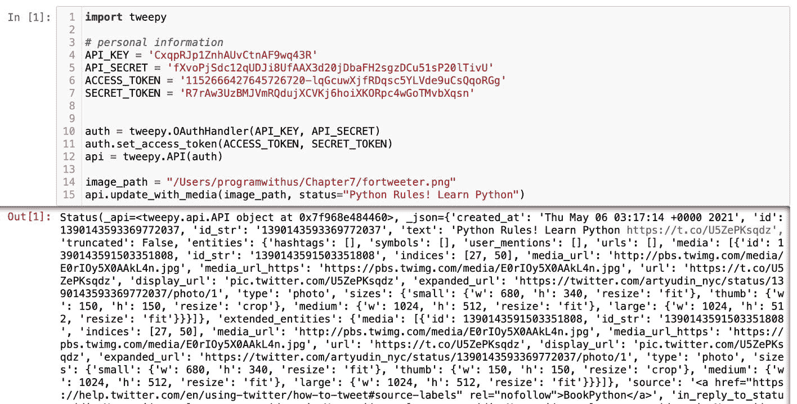

**图 7-18** 自动发送带媒体文件推文的代码

# 基于数据库存储的推特营销活动

如果你想要开展推特营销活动并每天发送推文，就需要将内容存储在某处。显然，最佳选择是使用预先准备好文本和图片路径的数据库。`Python` 可与任何类型的关系型数据库配合使用。最简单的方案是采用 `Sqlite3` 数据库。`Sqlite3` 模块随标准 `Python` 发行版一同提供。

如果你不熟悉关系型数据库，也可以考虑使用简单的文本或 `CSV` 文件作为替代方案。内容和图片链接可以从文件中读取，然后通过 `Tweepy` 发布推文。待发送的信息将存储在列表的列表中，随后通过我们刚刚创建的、在 `for` 循环中运行的代码进行分发。

# 使用 Python 进行电子邮件营销

用 `Python` 发送电子邮件是相当简单的任务。`Python` 拥有 `Email` 和 `Smtplib` 模块，用于撰写和发送消息。该过程的详细文档可在此处查阅：[`https://docs.python.org/3/library/email.examples.html`](https://docs.python.org/3/library/email.examples.html)。你需要在计算机上使用 `Smtplib` 包模拟一个服务器，它便会发送邮件。

尽管操作简单，但我认为这个过程并不适合营销目的，尤其是当你需要触达 10,000 甚至 100,000 名收件人时。对于认真的营销人员，我推荐使用 `Mailgun` 服务。`Mailgun` 让你能够更灵活地使用自己的 `Python` 代码，同时享受分析仪表盘带来的便利。`Mailgun` 提供了一个 `Python` API，可以轻松集成到任何 Web 应用程序中，或在 `Python` 脚本中使用。即使对于 `Python` 初学者来说，`Mailgun` API 也很容易使用。此外，`Mailgun` 服务允许使用 `HTML` 模板，并提供电子邮件营销活动效果的分析数据。

如果你目前正在使用某种电子邮件营销服务，务必对比一下价格，看看切换到 `Mailgun` 是否划算。在本书中，我们将使用 `Mailgun` 的免费试用版。

任何营销专业人士都知道，品牌建设是赢得客户信任的关键。如今，人们不会随意打开任何电子邮件。除非电子邮件来自可靠来源或明确显示发件人身份，否则潜在客户不会点击。`Mailgun` 允许你添加自己的域名，使邮件看起来更专业。虽然出于测试目的无需添加域名，但 `Mailgun` 也提供了一个沙盒域名。我将设置我的域名 [artyudin.com](http://artyudin.com) 来演示这个过程。如果你想遵循我的代码但没有域名，可以在 [godaddy.com](http://godaddy.com) 或 [namecheap.com](http://namecheap.com) 上购买，一年只需一美元。

在浏览器中打开 [`www.mailgun.com/`](http://www.mailgun.com/) 并免费注册，以获取 API 密钥。注册完成后，登录账户。你会看到仪表盘；在左侧菜单中应该能看到 **发送(Sending)** 选项。点击 **发送(Sending)**。在菜单中选择 **域名(Domains)** 选项，如果你想添加现有域名，请点击左上角的绿色 **添加新域名(Add New Domain)** 按钮。如果你只想试用 `Mailgun`，可以保留使用 `Mailgun` 默认提供的沙盒域名。使用沙盒域名的主要缺点是 `Mailgun` 仅允许向授权收件人发送消息。这意味着你需要向他们发送邀请，并请求他们同意接收来自 `Mailgun` 服务器的电子邮件。

点击绿色的 **添加新域名(Add New Domain)** 按钮后，你会看到一个提示框，要求输入你想使用的域名。在点击 **添加域名(Add Domain)** 之前，请选择域名注册的地区 **美国(US)** 或 **欧盟(EU)**。下一步是设置你的域名并验证其所有权。

我知道所有这些 DNS 设置（图 7-20）初看起来会令人困惑和复杂。但在同一页面上，你会找到针对所有主要域名销售商和提供商的视频和分步说明。你只需登录你的域名提供商，并在域名旁边管理 DNS。在 DNS 记录中，按照 `Mailgun` 指南添加 TXT 和 MX 记录。你只需将 `Mailgun` 页面上的值复制并粘贴到域名的 DNS 记录中。为确保设置正确，请点击验证 DNS 设置(Verify DNS Settings)，如果看到 DNS 类型旁边出现绿色标记，说明一切正常，你就可以发送电子邮件了（图 7-21）。如果某些设置不起作用，你仍看到红色和黄色叉号，请再观看一遍视频并重试。

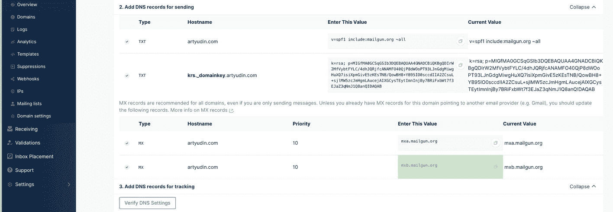

图 7-21
添加的域名已成功验证

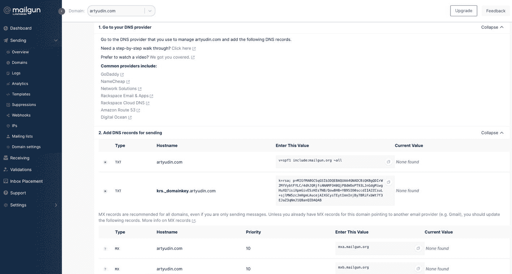

图 7-20
将域名添加到 `Mailgun` 服务器

`Mailgun` 作为一个常规 API 运行，需要 `Requests` 库来向服务器发送消息以及一个 API 密钥。打开 `Mailgun` 仪表盘，从左侧菜单中选择 *设置(Settings)* 选项，然后找到 *API 密钥(API Keys)* 选项。另外，API 密钥也可以在个人设置中找到（图 7-22）。

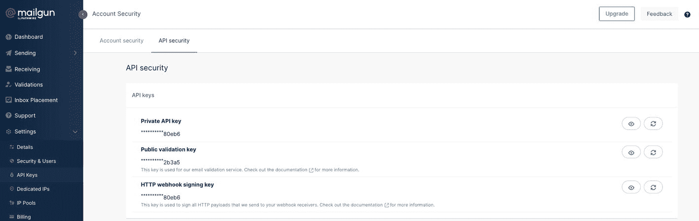

图 7-22
`Mailgun` API 密钥

要发送电子邮件，请打开一个新的 **Jupyter** Notebook，并在文件顶部导入 `Requests` 库：

```python
import requests
```

与之前的 API 示例一样，我们将定义 `API_KEY` 变量来保存 API 密钥。同时定义 `DOMAIN` 变量来保存你的域名：

```python
API_KEY = "9514cb771d5da80eb6"
DOMAIN = "artyudin.com"
```

`Requests` 库拥有与主要 HTTP 方法 `get()`、`post()`、`put()` 和 `delete()` 相匹配的函数。`get()` 方法发送请求以从服务器获取数据，而 `post()` 方法则将数据发送到服务器。由于我们要发送信息，我们将使用 `post()` 方法。我们需要向 `post()` 方法传递一些参数。我将逐一分解并分别定义每个信息片段，以使其清晰明了。

首先，`Requests` 的 `post()` 方法需要我们要访问的 HTTP 地址。我们将其定义为 `url`，并使用 `Mailgun` 文档中的模板。

我们的目标是触达许多潜在客户，因此我将把 `recipients` 设置成一个电子邮件地址列表。在实际情况中，你可能需要从文件或数据库中获取电子邮件和姓名。无论如何，你需要将所有电子邮件作为一个 `Python` 列表提供：

```python
recipients = ["anna@example.com", "sherlock@example.com"]
```

我将把主题设置为 `subject_matter` 变量：

```python
subject_matter = "Hello there"
```

我将把消息本身作为一个字符串赋值给 `message` 变量：

```python
message = "I am sending this email with Python!"
```

最后，我将定义发件人身份为 `sender`。如果你没有添加域名，那么你必须使用经过验证的电子邮件地址。

在 `post()` 方法中，我们将传递 `url`、身份验证信息作为 `auth`，以及信息作为 `data`。对于 `auth` 元组中的身份验证，我们需要设置 `API_KEY`：

```python
auth=("api", API_KEY)
```

关键字参数 `data` 将包含我们之前定义的所有信息：

```python
data={
    "from": sender,
    "to": recipients,
    "subject": subject_matter,
    "text": message
}
```

data = `{"from": sender, "to": recipients, "subject": subject_matter, "text": message}`

整个`Requests`的`post()`方法将如下所示：

```python
requests.post(
    url,
    auth=("api", API_KEY),
    data={"from": sender,
          "to": recipients,
          "subject": subject_matter,
          "text": message}
)
```

每次我们向服务器发送请求时，`Requests` 包都会返回一个状态码。200 到 300 之间的任何值都表示操作已成功完成。如果看到 400，请检查你的代码。你可能遗漏了一个闭合括号，或者提供了错误的 API 或域名。

在我们的示例中，我们收到了 200（图 7-23）。既然邮件已成功发送，那么开始在你的邮箱中查找它。

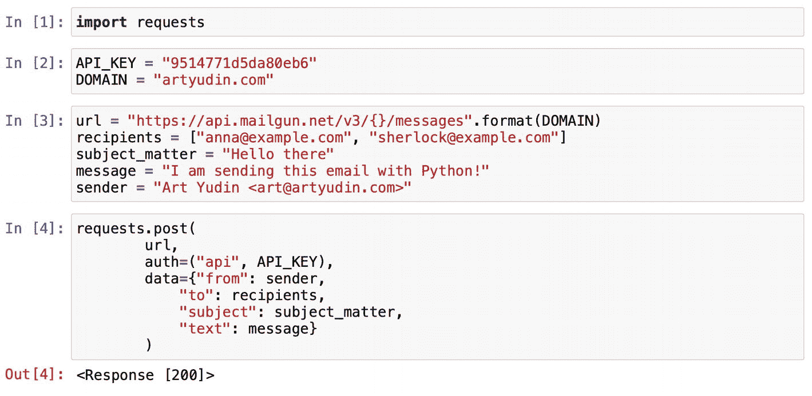

图 7-23 使用 Python 成功发送了一封邮件

如你所见，使用 Mailgun API 的过程其实并不困难。将 API 封装到你自己的 Python 脚本中，让你可以灵活地在发送邮件的同时添加一堆其他任务。例如，安排电子邮件营销活动，或者从互联网抓取数据，然后将这些信息通过邮件发送。无论如何，使用 Python 和 Mailgun 服务都为你提供了更多的自动化空间。我们的目标是用 Python 自动化那些繁琐的营销任务。

你应该将本章视为使用 Python 编程语言进行营销的一块跳板。所有大公司都提供有用的 API，你可以利用它们来使你的工作流程更快、更高效。我相信到目前为止，你已经对如何使用 `Requests` 库从 API 检索信息以及如何使用 Python 处理接收到的数据有了深刻的理解。

# 脚注

# 索引

## A, B

### Anaconda 包

- 数据分析工具
- 图形化安装
- 安装过程
- Jupyter Notebook 文件
- 内核操作
- 导航栏菜单
- `print()` 命令
- PyCharm
- 运行播放图标按钮
- 未命名文件

### 应用编程接口 (API)

- 访问值
- Alpha Vantage 服务
- 内置方法
- 客户端/浏览器
- 客户端库
  - 认证
  - 云平台
  - 安装过程
  - 密钥选项
  - 报告流程
  - 资源页面
- 设备发送
- 字典对象
- Google 分析
- 库
- 绘制数据
- 接收数据
- 注册
- `requests.get()` 方法
- `transpose()` 方法
- `type()` 函数
- `applymap()` 方法

## C

### 逗号分隔值 (CSV)

- 聚合方法
- `apply()`/`lambda()` 方法
- 转换字符串
- 删除选项
- 字典表示法
- 交易所交易基金
- 金融公司基金
- `info()` 方法
- lambda 表达式
- `min()` 和 `max()` 方法
- 数值类型
- 在线位置
- `read_csv()` 函数
- Sectorspdr 网站
- 序列方法
- `skiprows` 关键字
- 最小和最大份额
- `str` 方法
- `strip()` 和 `str.strip()` 方法
- `str_to_num()` 函数
- `contains()` 方法

### 临界线算法 (CLA)

## D

# DataFrame

- 构造文件
  - 属性
  - 投资组合变量
  - 从零创建
- 过滤过程
  - 切片方法
  - 属性
  - 列名
  - 列名列表
  - `dir()` 函数
  - 中间结构
  - `loc` 和 `iloc` 方法
  - 重新赋值
  - 方括号方法
  - 股票代码
  - 字符串
  - 符号列
  - 向量化操作
- 二维结构

# 数据结构

- `close()` 函数
- 字典
- 循环/for 循环

### 函数

- `add()` 函数
- 定义
- 文档字符串
- 错误消息
- `help()` 函数
- 缩进
- 圆括号
- `print()` 函数

# G

- `get()` 方法
- 不定循环
- `items()` 方法
- 乘法表
- 嵌套 for 循环
- `open()` 函数

### 程序结构

- 抓取代码
- `input()` 函数
- `is_vowel()` 函数
- 小写函数
- 伪代码解决方案
- 重构代码
- range 函数

### 读取数据

- 字典
- `FileNotFoundError`
- 高频词
- `open()` 函数
- 解析信息
- `read()` 方法
- 远程文本文件
- `sort()` 方法
- `split()` 函数
- `urllib`
- `urlopen()` 函数
- 写入信息（文本文件）

## D (续)

### 定循环/不定循环

# 字典

### 数字营销任务

- 分析
  - 客户端库
  - 定义
- 电子邮件营销
- Twitter 机器人
- `drop()` 方法

## E

### 有效前沿技术

- 经典均值/方差优化
- 定义
- 投资组合
- `max_sharp()` 方法
- `min_volatility()` 函数
- 最优投资组合
- `plotting()` 函数
- `plot_weights()` 函数
- `portfolio_performance()` 方法
- PyPortfolioOpt
- `sample_cov()` 函数
- 夏普比率
- 可视化
- 波动性

### 电子邮件营销

- API 密钥
- `delete()` 方法
- 文档
- 域名选项
- 邮箱
- Mailgun 服务
- `post()` 方法
- 发送/域名选项
- Smtplib 包

## F

### 过滤过程

### 金融任务

- 定义

# 有效边界

# 基本面分析

# 未来值 `fv()`

# 存货周转率

# 蒙特卡洛模拟

# 净现值

# Numpy

# 现值

# 比率

# 风险价值

# 循环/for 循环

# `append()` 方法

# 定义

# 设计模式

# `format()` 函数

# if 语句

# 迭代

# 列表变量

# 翻译

# 基本面分析

# 资产负债表

# 条形图

# 能力

# 现金流量表

# 公司

# 定义

# `enterprise()` 函数

# 交易所交易基金

# `pip` 命令

# 绘制数据

# `profile()` 函数

# 收入数据

# ROIC 和 ROE 比率

# `subplot()` 函数

# 估值

# 可视化

# 未来值（`fv()` 函数）

# G

# 收集数据

# 应用程序编程接口

# 信息

# 列表推导式

# Pandas-Datareader

# Selenium

# 网络爬取

# 参见 网络爬取过程

# Google Analytics

# 账户用户管理

# `build()` 函数

# 构建选项

# DataFrame

# 字典表示法

# 电子邮件/导航

# 获取选项

# for 循环

# 整数和浮点数

# JSON 文件

# 库

# 指标值

# 页面浏览量与会话时长

# `pip` 命令

# `plot()`/`pie()` 方法

# 请求方法

# 响应方法

# 服务账户页面

# 排序

# 源代码

# 解包过程

# 用户和会话指标

# 值

# 可视化

# Groupby

# H, I

# 直方图

# 超文本标记语言 (HTML)

# J

# JavaScript 对象表示法 (JSON)

# K

# `keys()` 方法

# L

# 折线图

# `grid()` 函数

# HEX/RGB 格式

# `legend()` 函数

# `plot()` 函数

# 绘图语句

# `plt.grid()` 函数

# `plt.legend()` 函数

# `plt.plot()` 函数

# `plt.style.use()` 方法

# `plt.title()` 函数

# pyplot 模块

# 标题/图例

# 列表推导式

# `append()` 方法

# `final_list`

# 收集数据

# `list_article`

# `mega_list`

# `open()` 函数

# 解析和清理信息

# 字符串模板

# 语法

# 文本格式化

# 网络爬取操作

# `zip()` 函数

# M

# Matplotlib

# 库

# 折线图

# 饼图

# 散点图

# 蒙特卡洛模拟

# 定义

# NumPy 数组

# 绘图选项

# 投资组合列表

# `random()` 函数

# `show()` 方法

# 波动性

# N

# 净现值 (NPV)

# 假设

# 计算/绘制项目

# 公司规划

# 交叉利率

# 定义

# `discount_rates`

# 几何对象

# `hline()`/`vline()` 函数

# `intersection()` 方法

# LineString 操作

# `plot()` 函数

# 项目创建

# 情景分析

# `xlim()` 方法

# `ylim()` 方法

# `zip()` 函数

# Numpy-Financial 包

# O

# 面向对象编程 (OOP)

# P, Q

# Pandas

# CSV

# 参见 逗号分隔值 (CSV)

# DataFrame

# Datareader

# `DataReader()` 函数

# 定义

# 国内生产总值

# IEX

# 非农就业人数

# `pip` 命令

# `plot.line()` 方法

# 接收数据

# 数据集

# 组合

# 连接

# `drop` 关键字

# `groupby()` 方法

# `zip()` 函数

# 定义

# 逻辑运算

# 匿名函数

# `apply()` 方法

# 双函数

# `if` 和 `else` 条件

# lambda 语法

# 逻辑运算

# `np.where` 函数

# NumPy 函数

# `where()` 函数

# 合并函数

# 面板数据

# 绘图工具

# Series

# 参见 Series

# 复杂数据结构

# 饼图

# `post()` 方法

# Python

# Anaconda

# 参见 Anaconda

# 概念

# 错误信息

# 创建第一个程序

# `float()` 函数

# if, Elif/Else 语句

# 布尔数据类型

# 比较运算符

# 文档

# `Elif` 关键字

# `Else` 语句

# `if` 语句

# 逻辑运算符

# 构建决策结构

# 索引/切片

# 元素/字符

# 获取元素

# `insert()` 方法

# 列表存储

# 负索引

# 负步长

# 有序集合

# 跳过选项

# 字符串/元素

# 安装过程

# `int()` 函数

# 学习过程

# 列表/元组

# `append()` 方法

# 升序

# 条件

# 容器

# 数据结构

# `help()` 函数

# 列表方法

# 数字

# 运算符

# `remove()` 方法

# `sort()` 函数

# `tuple()` 函数

# `type()` 函数

# 元音/辅音

# 方法

# 概念

# `dir()` 函数

# `len()` 函数

# 小写字符串

# 字符串方法

# `upper()` 方法

# `ord()` 函数

# `print()` 语句

# 常规任务

# `str()` 函数

# 字符串

# 税费与小费计算器

# 变量/数值类型

# 面积计算

# 算术运算符

# 内置函数

# 大小写敏感

# 数据类型

# 表达式

# 浮点数

# 整数

# 内存

# 命名约定

# 塑料瓶/玻璃

# 保留字/关键字

# 源代码

# 存储信息

# `type()` 函数

# R

# Range 函数

# 降序

# 索引值

# `len()` 函数

# 参数

# `range()` 函数

# `requests.get()` 方法

# S

# 散点图

# `annotate()` 函数

# 标注值

# 颜色条刻度

# `enumerate()` 函数

# 插入语句

# 交互式图形

# 魔术函数

# 内联格式

# 笔记本模式

# `read_excel()` 函数

# Selenium

# Amazon 登录页面

# 自动化解决方案

# `BeautifulSoup()` 函数

# 浏览器窗口

# 类别名称

# `Chrome()` 函数

# ChromeDriver

# `dir()` 函数

# div 容器

# Excel 文件

# 异常处理

# 获取选项

# `find_element_by_id()` 方法

# `get()` 方法

# 输入提示

# 检查选项

# Keys 模块

# `page.get()` 方法

# 产品页面

# `productTitle`

# try 和 except 块

# 源代码

# `text` 方法

# 网页

# 网络爬取

# 命令提示符窗口

# 文档

# `get-pip.py` 文件

# 安装

# Sudo 命令

# 终端窗口

# 网页开发

# `write()` 方法

# Series

# 优势

# 属性

# 数据类型标识符

# 定义

# 字典

# 差异

# 除法运算

# 同质

# 一维结构

# `pd` 变量

# 关系型数据库

# `round()` 函数

# 字符串键

# 向量化

# T

# Twitter 机器人

# 创建账户

# API 注册过程

# `image_path` 变量

# 媒体文件

# `OAuthHandler` 方法

# 会话列

# 终端窗口

# 令牌/秘密访问

# Tweepy 文档

# Tweepy 库

# U

# 统一资源定位符 (URL)

# V

# 风险价值 (VAR)

# 协方差矩阵

# `cov()` 函数

# `pct_change()` 方法

# DataFrame

# 定义

# `describe()` 方法

# `dot()` 方法

# `dropna()` 方法

# `head()` 方法

# Jupyter Notebook

# 标准化历史价格

# NumPy 数组

# 绘制历史股票

# `ppf()` 方法

# 预测值

# 检索历史价格

# 风险计算

# `shift()` 方法

# `sqrt()` 方法

# 字符串格式

# 可视化

# 定义

# 直方图

# 折线图

# Matplotlib 库

# 饼图

# 散点图

# W, X, Y, Z

# 网络爬取过程

# `BeautifulSoup()` 函数

# Chrome 浏览器

# 定义

# `find()`/`find_all()` 方法

# `get()` 方法

# `get_text()` 方法

# hrefs

# HTML 标记

# 信息

# 检查选项

# investing.com

# 定位/检查行

# 检查选项

# requests 方法

# Selenium

# 文本元素

# 变量标题

# URL 站点

# 网页链接