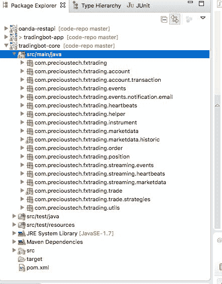
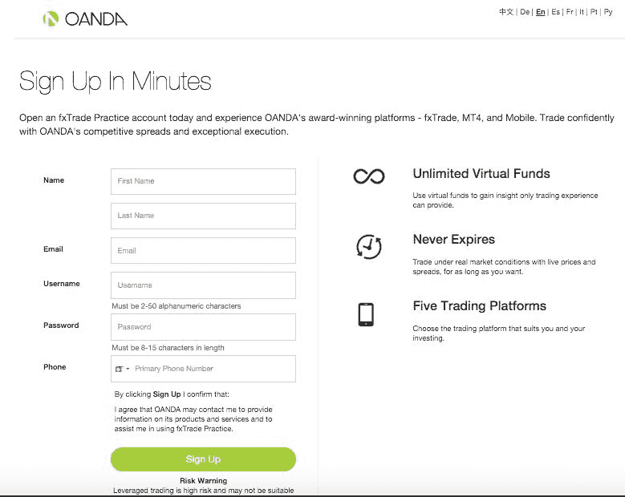
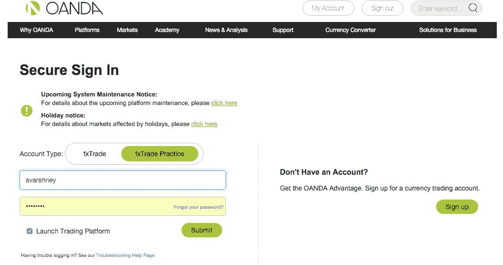
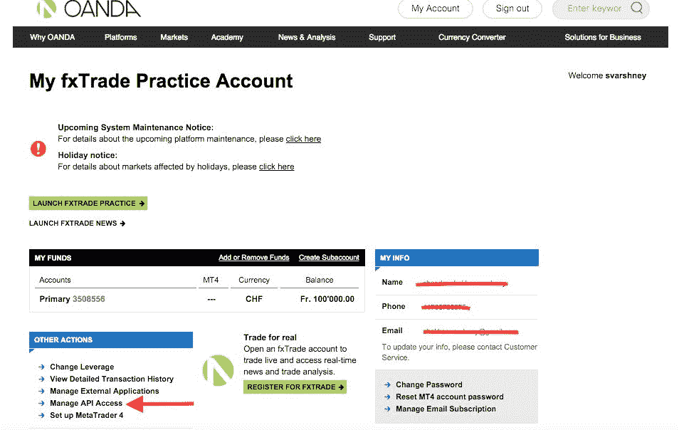
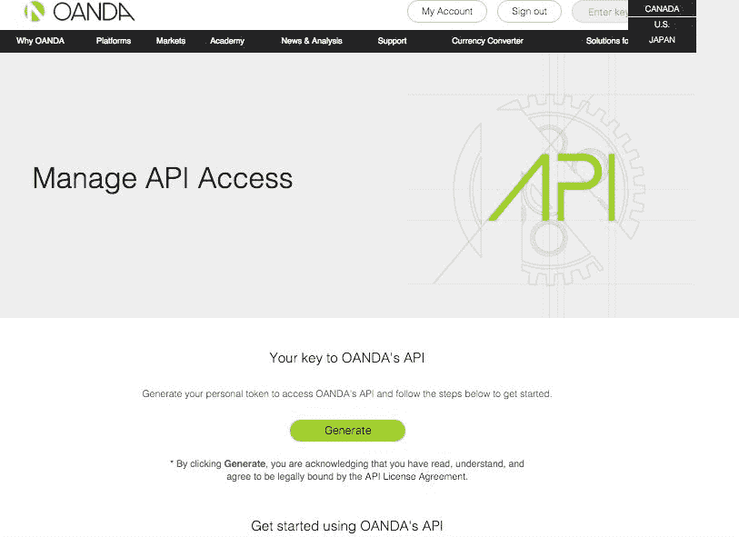
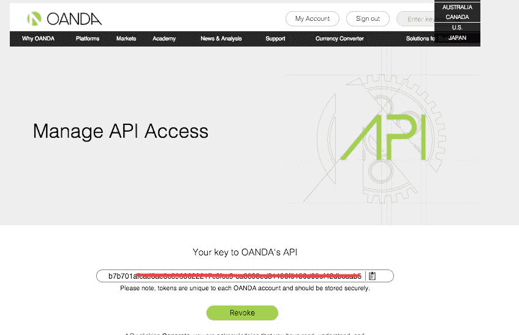
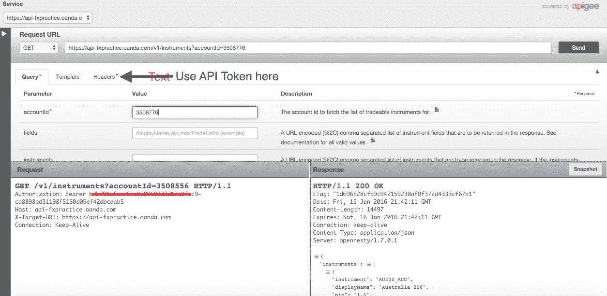
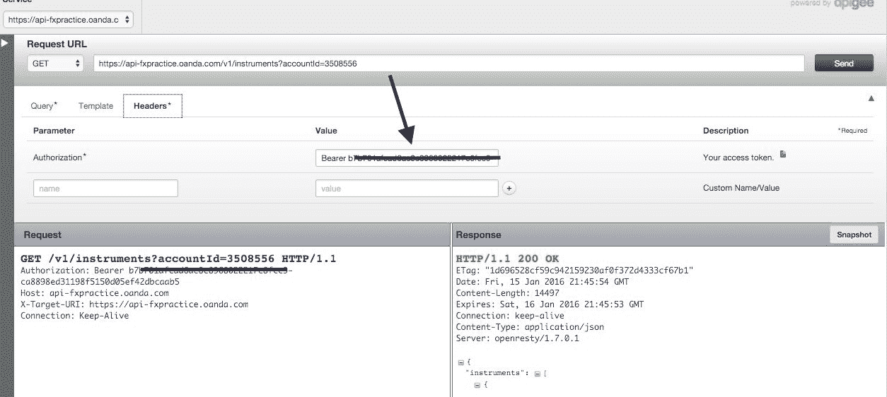
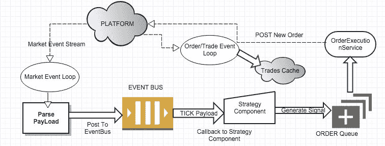

# 使用 Java 开发交易机器人

#### 谢卡尔·瓦尔什尼

© 2015 - 2016 谢卡尔·瓦尔什尼

献给我生命中的天使们：我的母亲、我的妻子普雷什塔以及我的两个女儿米希卡和安雅。最后但同样重要的是，我的大学导师拉贾特·穆纳博士，他在我的 DNA 中播下了计算机编程的种子。

## 目录

## 指南

1. 开始阅读

## 1. 交易机器人简介

欢迎来到自动化交易的世界！你正在阅读这本书，这表明你可能想构建自己的机器人，希望它能在你忙于日常工作或像我一样想尝试使用 Java 构建此类机器人的技术时，帮你赚点钱。

自动化交易已经存在一段时间了，尽管它在很大程度上一直是银行和对冲基金等大型玩家的专属领域。

然而，这在过去几年里发生了变化。随着许多散户投资者能够直接在各种平台和交易所进行交易，而不是通过电话使用传统经纪商的服务，自动化下单任务的需求日益增长，同时这些投资者可以继续从事他们的日常工作。作为自动化这一过程的第一步，许多平台如 OANDA、LMAX 等都提供了 Java、Python、C#、PHP 等多种编程语言的 API，以便将观察市场、查看图表、进行分析等繁琐任务自动化。

在这一旅程中，我们不仅会关注自动化交易的概念，还会专注于编写整洁、测试驱动的 Java 程序。

最后，我们不仅会拥有一个可用的交易机器人，它能够使用任何策略进行交易，而且从技术角度来看，我们还将深入了解 Java 编程中事件驱动、多线程的世界。

***警告：*** *以保证金进行外汇交易具有高风险，可能不适合所有投资者。过往表现并不预示未来结果。高杠杆作用可能对您不利，也可能对您有利。在决定投资外汇之前，您应仔细考虑您的投资目标、经验水平和风险承受能力。存在损失部分或全部初始投资的可能性，因此您不应投资无法承受损失的资金。您应了解所有与外汇交易相关的风险，如有任何疑问，请咨询独立的财务顾问。*

### 1.1 什么是交易机器人？

用非常简单的话来说，交易机器人是一个计算机程序，可以自动向市场或交易所下达订单，无需人工干预。最简单的机器人可能是一个向 OANDA REST API 发送 `curl`^(1) `POST` 请求的脚本，例如：

```
$curl -X POST -d "instrument=EUR_USD&units=2&side=sell&type=market" "https://api-fxtrade.oanda.com/v1/accounts/12345/orders"
```

可以设置在 Unix `cron`^(2) 上，在交易时段内每小时运行一次。它没有策略，也没有任何外部接口或依赖。这是一行用于下单的命令，其盈亏概率相等。

在另一个极端，它可能是一个基于分布式架构的复杂程序，消费来自各种来源的大量数据，实时分析并下单。它将具有极高的可用性和极低的延迟。

正如我们所见，机器人的规模和范围是多种多样的。要有效运行，机器人应能够完成以下任务：

- 消费市场数据和/或外部新闻事件、社交媒体信息流，并将其分发给系统内感兴趣的组件。
- 拥有至少一个提供交易信号的策略。
- 根据交易信号向经纪平台下达订单。
- 账户管理，即能够跟踪保证金要求、杠杆、盈亏、剩余金额等，以便在可用金额突破给定阈值时限制交易。
- 头寸管理，即跟踪各种工具当前所有活跃头寸、这些头寸的单位、平均价格等。
- 能够处理由经纪平台触发的事件，例如 `ORDER_FILLED`、`STOP_LOSS` 等，并在需要时为此类事件做出适当决策。
- 一些基本的监控和警报功能。
- 一些基本的风险管理。例如，通过使用止损单限制损失，或确保风险在风险型工具和避险型工具之间分散。这些仅是示例，绝非全面管理风险的完整清单。

### 1.2 为什么需要交易机器人？

我相信交易所/平台提供的大部分服务都围绕以下几点：

- 订阅所选工具的市场数据并进行分发。
- 下单和交易。
- 账户和头寸管理。
- 历史市场数据。
- 心跳机制。
- 针对交易、订单和账户事件的回调。
- 身份验证。

交易机器人试图将这些任务泛化到一个框架中，并提供一种能力，可以在运行时使用像 Spring 这样的依赖注入^(3)框架，提供特定于经纪商/交易所平台的实现。因此，从理论上讲，只需更改 Spring 配置文件（我们在其中定义了实现这些服务的各种接口的实现），瞧，我们就应该能够支持各种经纪商/交易所平台。

### 1.3 我们交易机器人的能力

我们的机器人将具备以下能力，这些将在后续章节中详细讨论：

- 账户管理
- 与实时市场数据源的集成
- 市场数据分发
- 下单
- 处理订单/交易和账户事件
- 历史价格分析
- 与 Twitter 集成
- 策略


### 1.4 设计目标

-   一个核心的设计目标（本章开头已提及）是能够通过 Spring 配置在运行时切换券商/交易平台（broker/exchange）的实现。如果我们能为这些平台的 API 调用创建规范（类似于 JDBC 规范），那么这是可行的。例如，一个用于定义持仓管理需求的示例规范/接口如下：

```java
/**
 * 一项为金融工具持仓提供服务的供应方。金融工具的持仓定义为其聚合交易，包含一个平均价格，
 * 且所有交易必须同为多头（LONG）或同为空头（SHORT）。这是一项有用的服务，
 * 可用于生成指定金融工具的摘要，如有必要，还可通过单个调用平掉指定金融工具的所有交易。
 *
 * 实现方可以选择维护一个内部持仓缓存，以减少延迟。如果如此操作，
 * 则必须找到以下方法之一：1) 接入事件流，并基于订单/交易事件刷新缓存；
 * 或 2) 在指定时间段后定期刷新缓存。
 *
 * @param <M>
 *      类 TradeableInstrument 中的 instrumentId 类型
 * @param <N>
 *      accountId 的类型
 *
 * @see TradeableInstrument
 */
public interface PositionManagementProvider<M, N> {

    /**
     * @param accountId
     * @param instrument
     * @return 给定金融工具和 accountId 的持仓信息 Position<M>
     *         （如果单个账户下所有交易为空，则可能返回 null）。
     */
    Position<M> getPositionForInstrument(N accountId, TradeableInstrument<M> instrument);

    /**
     * @param accountId
     * @return 给定 accountId 的 Position<M> 对象集合。
     */
    Collection<Position<M>> getPositionsForAccount(N accountId);

    /**
     * 平掉给定金融工具和 accountId 的持仓。这是一种一次性平掉账户中
     * 指定金融工具所有交易的方法。
     *
     * @param accountId
     * @param instrument
     * @return 操作是否成功
     */
    boolean closePosition(N accountId, TradeableInstrument<M> instrument);
}
```

如果我们为平台交互的每个方面都创建这样的规范/接口，理论上我们可以为这些服务创建提供程序，并通过 Spring 配置在需要时进行切换。从代码组织的角度来看，所有这些接口都将放在一个构成核心 API 一部分的项目中。因此，这个项目将与券商/交易平台提供程序无关，并将包含此类接口和服务。

-   编写能解决单一业务问题或一组相关问题的服务。这些服务易于进行单元测试和代码复用，最终会带来更优的软件质量。
-   服务间松耦合。这有助于降低系统依赖，从而使软件更易于维护。我们的软件将不断演进，因为人们可能会决定集成更多社交媒体信息流或添加更复杂的策略。编写松耦合的组件可以确保对已有工作代码的影响降到最低。
-   高单元测试覆盖率。追求高单元测试覆盖率至关重要。在涉及真实资金的生产环境中使用时，大量的单元测试将确保我们尽早发现回归和错误，并尽可能防止错误在生产环境中暴露。

### 1.5 代码组织与使用的软件栈

基于我们在前面章节中对设计目标的讨论，代码将至少组织在 3 个不同的项目中，即构建将至少生成 3 个 `jar` 文件。为什么说是至少 3 个？回想我们之前的讨论，其中一个关键设计目标是在运行时切换提供程序实现。由于我们可以从多个提供程序中进行选择，因此至少会有 3 个 `jar` 文件。本书只讨论一个实现，即 OANDA REST API 实现。鼓励使用该框架的开发人员开发更多的提供程序实现。

-   `trading-core` 是项目的核心。它包含所有必须实现的规范/接口。它还包含所有使用核心接口并提供额外有用 API 方法的通用服务。
-   `oanda-restapi` 是我们对规范的参考实现，将在本书中讨论。欢迎您将其替换为您自己的实现。
-   `tradingbot-app` 是主应用程序，它使用 Spring 在运行时注入提供程序 API。它也是我们定义策略和实现特定于应用程序的项目的项目。在本书的后续部分，我们将讨论与社交媒体（尤其是 Twitter）的集成，这将在该项目中实现。

 Java 项目

为了构建我们的机器人，我们将使用以下软件和工具：

-   Java SDK 1.7+
-   Spring Framework 4.1, Spring Social 1.1（仅在 `tradingbot-app` 项目中的依赖项）
-   Guava 18.0
-   HttpClient 4.3
-   Maven 3.2.5
-   Eclipse IDE

### 1.6 OANDA REST API 作为参考实现

**声明-** *我与 OANDA 现在或过去没有任何商业关系。我选择 OANDA REST API 作为参考实现，完全是基于其技术优势以及它可能被更广泛采用的事实（因为它是免费使用的）。如果存在类似的选择，我也很乐意尝试。*

我偶然发现了 OANDA API。当时，我正在寻找一家提供免费交易 API 的券商（以防我想转为真实账户），并且更重要的是支持 Java 编程语言。入门非常容易，因为大多数示例都使用 `curl` 来演示各种交易操作，如获取工具列表、下订单或获取历史蜡烛图数据。我只需在 Mac 终端上输入 `curl` 命令即可。我可以轻松看到每次发出的 `curl` 请求所收到的 JSON 响应。通过实时查看响应和数据，我对支持工具、订单、汇率、持仓等的各种 API 有了非常好的认识和理解。

`curl` 命令示例是一个很好的起点，我开始尝试在 REST API^(4) 页面上描述的 Java 测试用例中编写等效命令。


#### 1.6.1 开设 OANDA 模拟账户

在开始使用 API 之前，你必须先注册一个免费的模拟账户。进入页面后，点击“开设账户”按钮，你会看到如下的注册界面：

 Oanda 账户注册界面

成功注册后，你就可以登录你的模拟账户了。准备登录时，你会看到如下登录界面：

 Oanda 账户登录界面

登录成功后，你将进入账户主页，界面如下图所示：

 Oanda 账户仪表盘

要开始进行 API 交易，我们首先需要生成一个个人 API 令牌，该令牌将被 OANDA 平台用于验证请求。你需要点击上图中红色箭头高亮显示的 **管理 API 访问 (Manage API Access)** 链接。随后你将进入如下界面：

 Oanda 生成 API 令牌

当你点击 **生成 (Generate)** 时，平台将为你生成一个令牌，该令牌必须包含在你向承载模拟账户的平台发出的每一个请求中。生成的令牌将会显示出来，请务必记下它：

 Oanda 已生成令牌

现在你可以开始交易了。OANDA 提供了一个非常有用的 Web 界面，可以用来测试你的 REST 请求并即时查看响应。你也可以借此了解 REST 资源 URL 的组织方式，以及为完成特定请求应调用哪个资源 URL。

下图展示的是我们如何发送请求以获取所有可交易金融工具的列表。GET 请求需要传入一个 `accountId`（这是你可以在账户页面上找到的 ID，对于模拟账户，它默认带有 100,000 个单位的账户货币）。同时还必须提供请求头，其格式为 `Bearer <你的 API 令牌>`：

 Oanda 开发 API 控制台  Oanda 开发 API 控制台 - 请求头标签页

#### 1.6.2 OANDA JSON 键

OANDA JSON 响应使用一组标准键。例如，在响应中表示货币对时，无论是即时报价还是蜡烛图信息的流式响应，都会使用 `instrument` 键。实时数据流中的即时报价如下所示：

```
1 {"tick":{"instrument":"AUD_CAD","time":"1401919217201682","bid":1.01484,"ask":1.01502}}
```

而交易成功修改后的响应则如下所示：

```
 1 {
 2   "id": 1800805337,
 3   "units": 3000,
 4   "side": "sell",
 5   "instrument": "CHF_JPY",
 6   "time": "2015-03-18T06:33:36.000000Z",
 7   "price": 120.521,
 8   "takeProfit": 110,
 9   "stopLoss": 150,
10   "trailingStop": 0,
11   "trailingAmount": 0
12 }
```

从以上两个例子中，我们还可以看到用于表示事件日期的键是 `time`。由于相同的键用于表示特定属性，我们可以为这些键创建 `public static final String` 变量。因此，`OandaJsonKeys` 类应运而生。相比于在许多类中使用如下所示的代码行来污染代码：

```
1 String instrument = (String) instrumentJson.get("instrument");
```

更好的做法是创建一个常量并使用它。同样的代码片段将变成：

```
1 String instrument = (String) instrumentJson.get(OandaJsonKeys.instrument);
```

虽然键的数量很多，但我们的交易机器人中使用的大部分键都包含在 `OandaJsonKeys` 类中：

```
 1 public class OandaJsonKeys {
 2 
 3 	private OandaJsonKeys() {
 4 	}
 5 
 6 	public static final String accounts = "accounts";
 7 	public static final String accountId = "accountId";
 8 	public static final String accountCurrency = "accountCurrency";
 9 	public static final String marginRate = "marginRate";
10 	public static final String marginUsed = "marginUsed";
11 	public static final String marginAvail = "marginAvail";
12 	public static final String balance = "balance";
13 	public static final String unrealizedPl = "unrealizedPl";
14 	public static final String realizedPl = "realizedPl";
15 	public static final String openTrades = "openTrades";
16 	public static final String instruments = "instruments";
17 	public static final String instrument = "instrument";
18 	public static final String interestRate = "interestRate";
19 	public static final String disconnect = "disconnect";
20 	public static final String pip = "pip";
21 	public static final String bid = "bid";
22 	public static final String ask = "ask";
23 	public static final String heartbeat = "heartbeat";
24 	public static final String candles = "candles";
25 	public static final String openMid = "openMid";
26 	public static final String highMid = "highMid";
27 	public static final String lowMid = "lowMid";
28 	public static final String closeMid = "closeMid";
29 	public static final String time = "time";
30 	public static final String tick = "tick";
31 	public static final String prices = "prices";
32 	public static final String trades = "trades";
33 	public static final String tradeId = "tradeId";
34 	public static final String price = "price";
35 	public static final String avgPrice = "avgPrice";
36 	public static final String id = "id";
37 	public static final String stopLoss = "stopLoss";
38 	public static final String takeProfit = "takeProfit";
39 	public static final String units = "units";
40 	public static final String side = "side";
41 	public static final String type = "type";
42 	public static final String orders = "orders";
43 	public static final String orderId = "orderId";
44 	public static final String positions = "positions";
45 	public static final String expiry = "expiry";
46 	public static final String tradeOpened = "tradeOpened";
47 	public static final String orderOpened = "orderOpened";
48 	public static final String transaction = "transaction";
49 	public static final String pl = "pl";
50 	public static final String interest = "interest";
51 	public static final String accountBalance = "accountBalance";
52 }
```

在我们将在后续章节讨论的所有 OANDA API 实现中，我们将直接使用此类，并通过静态导入常量，而不是对特定 JSON 键的字符串字面量进行硬编码。


#### 1.6.3 OANDA 实现的构造函数依赖项

所有核心 API 规范的 OANDA 实现都有接受以下参数的构造函数：

- `API url`
- `username`
- `access token`

我们知道，OANDA 提供不同的环境来运行我们的机器人，例如沙箱、模拟盘和实盘。这些环境拥有不同的 URL、访问令牌，并且同一用户在不同环境下的用户名也可能不同。这些外部配置属性会作为构造函数参数传递给各个 OANDA 实现。例如：

```java
1 public OandaAccountDataProviderService(final String url, final String userName, final String accessToken) {
2 	this.url = url;
3 	this.userName = userName;
4 	this.authHeader = OandaUtils.createAuthHeader(accessToken);
5 }
```

如下所示，这些参数在 Spring 配置中被传递给该实现：

```xml
1 <bean id="accountDataProvider" class="com.precioustech.fxtrading.oanda.restapi.account.OandaAccountDataProviderService">
2 		<constructor-arg index="0" value="${oanda.url}"/>
3 		<constructor-arg index="1" value="${oanda.userName}"/>
4 		<constructor-arg index="2" value="${oanda.accessToken}"/>
5 </bean>
```

由于这些变量在属性文件中定义，我们无需重新构建或修改代码，即可在运行时轻松更改它们。只需修改属性文件即可。在后续章节中详细讨论配置时，我们会更深入地探讨这个主题。

### 1.7 事件驱动架构

任何交易系统的核心都是其事件驱动架构。系统必须对市场事件、社交媒体事件、用户事件以及可能来自外部/内部来源的大量其他事件做出响应。这些事件可能进一步触发一连串事件，导致系统中各种业务/领域对象的状态发生改变。真正的技术挑战在于，确保这些状态转换以线程安全的方式进行，并在需要时有事务作为支撑。

事件驱动系统的核心是一个或多个事件循环。这些事件循环通常在一个无限的 `while` 循环中运行，等待来自队列或实时流的事件。对于 OANDA 市场数据跳动事件，我们有一个如下的事件循环：

```java
 1 this.streamThread = new Thread(new Runnable() {
 3 @Override
 4 public void run() {
 5  CloseableHttpClient httpClient = getHttpClient();
 6   try {
 7    BufferedReader br = setUpStreamIfPossible(httpClient);
 8     if (br != null) {
 9      String line;
10       while ((line = br.readLine()) != null && serviceUp) {
11        Object obj = JSONValue.parse(line);
12         JSONObject instrumentTick = (JSONObject) obj;
13         ...
14         ...
```

在上述代码片段中，我们有一个无限的 `while` 循环，用于监听 OANDA 平台推送到实时流中的新 ticks。当接收到一个 tick 的 JSON 负载时，它会被解析，并通过队列或事件总线进一步分发。

 典型事件链

该图描绘了可能由单个事件触发的典型事件链。

1.  从流中接收到 Tick 事件。
2.  事件被解析并发送到 `EventBus`。
3.  策略组件订阅了此事件，并从 `EventBus` 接收到回调。
4.  策略组件根据最新的 tick 数据事件决定生成一个交易信号，并将该信号放入 `OrderQueue`。
5.  `OrderExecutionService` 获取此信号，创建一个 `new order` 负载，并将其发布到平台。
6.  平台执行该订单，并通过 `order event loop` 向下发送一个事件。
7.  该事件可以进一步触发某个操作，例如更新 `trades cache`。

这基本上就是事件驱动架构的本质。由于我们可能同时有多个组件在运行，因此尽可能解耦组件至关重要，这样可以在零修改或最小修改的情况下添加新的发布者和订阅者。这种架构有利于利用 Java 的多线程编程能力。然而，同样道理，它也要求开发者在执行缓存中业务对象（例如示例中的 `trades cache`）的状态变更时必须格外谨慎。我们必须设置足够的同步和锁定机制，以确保共享对象的状态始终保持一致。


#### 1.7.1 Google EventBus

`Google EventBus`（见 7），是`guava`库的一部分，是一个优秀的消息中介，有助于实现服务的松耦合，并允许它们之间进行发布-订阅风格的通信。它最酷的特性是，只需添加一个注解就能添加订阅者，而无需明确知道发布者是谁。

`EventBus`的维基页面上有很多有用的信息，但值得讨论一下它在交易机器人生态系统中的用法。以传播市场数据事件到一个或多个订阅者的用例为例。假设 Spring DI 容器已经创建了一个单例的`EventBus`：

* **自动注册订阅者：** 这里我们编写一个`BeanPostProcessor`来自动查找带有`@Subscribe`注解的方法的 bean，并调用`eventBus.register`方法来注册订阅者。

```java
public class FindEventBusSubscribers implements BeanPostProcessor {

 @Autowired
 private EventBus eventBus;
 private static final Logger LOG = Logger.getLogger(FindEventBusSubscribers.class);

 @Override
 public Object postProcessAfterInitialization(Object bean, String beanName) throws BeansException {
  Method[] beanMethods = bean.getClass().getMethods();
  for (Method beanMethod: beanMethods) {
   if (beanMethod.isAnnotationPresent(Subscribe.class)) {
    eventBus.register(bean);
    LOG.info(
     String.format("Found event bus subscriber class %s. Subscriber method name=%s",
      bean.getClass().getSimpleName(), beanMethod.getName()));
    break;
   }
  }
  return bean;
 }

 @Override
 public Object postProcessBeforeInitialization(Object bean, String beanName) throws BeansException {
  return bean;
 }

}
```

* **创建发布者：** 只需调用`post(Object payload)`即可将消息发布到`EventBus`。

```java
public MarketEventHandlerImpl(EventBus eventBus) {
 this.eventBus = eventBus;
}
public void onMarketEvent(TradeableInstrument < T > instrument, double bid, double ask, DateTime eventDate) {
 MarketDataPayLoad < T > payload = new MarketDataPayLoad < T > (instrument, bid, ask, eventDate);
 eventBus.post(payload);
}
```

* **消费负载：** `EventBus`通过匹配方法中传入的输入类型以及`@Subscribe`注解，来找到合适的订阅者。该方法必须有一个且仅有一个输入参数。可以选择尽可能细粒度或粗粒度的订阅方式。在粗粒度订阅的情况下，输入参数是一个对象，它是系统中所有已知负载的父类。最坏的情况是负载为`java.lang.Object`，此时订阅是最粗粒度的。该方法将对系统中执行的每次`eventBus.post`调用。另一方面，使用单个子类型作为方法的输入参数，使得订阅极其细粒度。在下面的例子中，`handleMarketDataEvent`仅在负载类型为`MarketDataPayLoad`或其任何子类型时，才会被`EventBus`调用。

```java
@Subscribe
@AllowConcurrentEvents
public void handleMarketDataEvent(MarketDataPayLoad<T> marketDataPayLoad) {
	if (instrumentRecentPricesCache.containsKey(marketDataPayLoad.getInstrument())) {
		instrumentRecentPricesCache.get(
		marketDataPayLoad.getInstrument())
		.put(marketDataPayLoad.getEventDate(),marketDataPayLoad);
	}
}
```

### 1.8 Provider Helper 接口

通常，不同的平台提供商对货币对的表示方式不同。`Cable`可以通过以下多种方式表示：

* `GBP_USD`
* `GBPUSD`
* `GBP/USD`
* `GBP-USD`

类似地，买入货币对的行为可以通过以下方式表示：

* `buy`
* `long`
* `+1`（或其他任何正数）
* 平台特定的枚举，例如`TRADEACTION.BUY`

为了处理不同提供商在表示法上的这种差异，我们需要创建一个提供方法来处理这些差异的接口。它看起来像这样：

```java
/**
 *
 * @param <T>
 *            多头/空头表示法的类型
 */
public interface ProviderHelper < T > {

 /**
  *
  * @param instrument
  *            采用 ISO 货币标准，例如 GBPUSD
  * @return 以平台特定格式表示的货币对
  */
 String fromIsoFormat(String instrument);

 /**
  *
  * @param instrument
  *            采用平台特定格式，例如 GBP_USD
  * @return 以 ISO 格式表示的货币对
  */
 String toIsoFormat(String instrument);

 /**
  *
  * @param instrument
  *            采用 7 字符格式，由任意分隔符（如 -、/、_）分隔
  * @return 以平台特定格式表示的货币对
  */
 String fromPairSeparatorFormat(String instrument);

 /**
  *
  * @param instrument
  *            表示为话题标签，例如 #GBPUSD
  * @return 以平台特定格式表示的货币对
  */
 String fromHashTagCurrency(String instrument);

 /**
  *
  * @return T，表示在平台上买入货币对的操作
  */
 T getLongNotation();

 /**
  *
  * @return T，表示在平台上卖出货币对的操作
  */
 T getShortNotation();
}
```

之所以需要这个接口，是我在消费来自 Twitter 和发布经济事件的外部网站等外部源的数据时感受到的。不同的 Twitter 用户和外部网站有自己表示货币对以及多头/空头交易的方式。为了处理这种繁多的约定，强烈感受到了这种接口的必要性。我很确定还会有更多需要以平台特定方式解读的情况，因此应当被添加到此接口中。


### 1.9 `TradingConfig` 类

`TradingConfig` 类持有所有在运行时配置的参数。这些参数被各种核心 API 所使用。部分示例如下：

- 可下达订单的最大价值。
- 某货币的最大允许合约数。

由于不同用户可能有不同的运行时值，这些值构成了外部配置的一部分。它们需要在 Spring 配置中进行配置（我们将在讨论配置与部署时详细说明）。强烈建议尽可能多地使用配置，而不是在各种服务内部将它们硬编码。

让我们看看代码是什么样的：

```
 1 public class TradingConfig extends BaseTradingConfig {

 3  private String mailTo;
 4  private int fadeTheMoveJumpReqdToTrade;
 5  private int fadeTheMoveDistanceToTrade;
 6  private int fadeTheMovePipsDesired;
 7  private int fadeTheMovePriceExpiry;

 9  public int getFadeTheMovePriceExpiry() {
10   return fadeTheMovePriceExpiry;
11  }

13  public void setFadeTheMovePriceExpiry(int fadeTheMovePriceExpiry) {
14   this.fadeTheMovePriceExpiry = fadeTheMovePriceExpiry;
15  }

17  public String getMailTo() {
18   return mailTo;
19  }

21  public void setMailTo(String mailTo) {
22   this.mailTo = mailTo;
23  }

25  public int getFadeTheMoveJumpReqdToTrade() {
26   return fadeTheMoveJumpReqdToTrade;
27  }

29  public void setFadeTheMoveJumpReqdToTrade(int fadeTheMoveJumpReqdToTrade) {
30   this.fadeTheMoveJumpReqdToTrade = fadeTheMoveJumpReqdToTrade;
31  }

33  public int getFadeTheMoveDistanceToTrade() {
34   return fadeTheMoveDistanceToTrade;
35  }

37  public void setFadeTheMoveDistanceToTrade(int fadeTheMoveDistanceToTrade) {
38   this.fadeTheMoveDistanceToTrade = fadeTheMoveDistanceToTrade;
39  }

41  public int getFadeTheMovePipsDesired() {
42   return fadeTheMovePipsDesired;
43  }

45  public void setFadeTheMovePipsDesired(int fadeTheMovePipsDesired) {
46   this.fadeTheMovePipsDesired = fadeTheMovePipsDesired;
47  }

49 }

51 public class BaseTradingConfig {
52  private double minReserveRatio;
53  private double minAmountRequired;

55  private int maxAllowedQuantity;
56  private int maxAllowedNetContracts;
57  private double max10yrWmaOffset;

59  public double getMinAmountRequired() {
60   return minAmountRequired;
61  }

63  public void setMinAmountRequired(double minAmountRequired) {
64   this.minAmountRequired = minAmountRequired;
65  }

67  public double getMax10yrWmaOffset() {
68   return max10yrWmaOffset;
69  }

71  public void setMax10yrWmaOffset(double max10yrWmaOffset) {
72   this.max10yrWmaOffset = max10yrWmaOffset;
73  }

75  public int getMaxAllowedNetContracts() {
76   return maxAllowedNetContracts;
77  }

79  public void setMaxAllowedNetContracts(int maxAllowedNetContracts) {
80   this.maxAllowedNetContracts = maxAllowedNetContracts;
81  }

83  public double getMinReserveRatio() {
84   return minReserveRatio;
85  }

87  public void setMinReserveRatio(double minReserveRatio) {
88   this.minReserveRatio = minReserveRatio;
89  }

91  public int getMaxAllowedQuantity() {
92   return maxAllowedQuantity;
93  }
```

这里的一些成员变量现在可能没有意义，但在后续章节中，一切都会变得清晰。

### 1.10 获取源代码

所有源代码都可以在 GitHub 上获取。以下 git 命令会将仓库克隆到你的本地机器上：

```
1 git clone https://github.com/shekharvarshney/book-code.git
```

我们将在后续章节讨论如何构建并在本地运行这些代码。

### 1.11 *自己试试* 小节

在每章末尾，我们会包含一个或多个小程序（在适当的情况下），这些程序演示了本章讨论的概念，供你实验并立即看到概念的实际效果。这些独立的小程序仅用于演示目的，可能并非最终运行机器人的代码的一部分。这样做是为了让你体验构成机器人组件的相关内容。

我们将在 Eclipse IDE 中运行这些程序，以便在需要时可以调试并查看机器人内部使用的服务中发生了什么。这些程序位于一个独立的项目 `tradingbot-demo-programs` 中，其 `pom.xml` 文件内容如下：

```
 1 <project xmlns="http://maven.apache.org/POM/4.0.0"
 2 	xmlns:xsi="http://www.w3.org/2001/XMLSchema-instance"
 3 	xsi:schemaLocation="http://maven.apache.org/POM/4.0.0
 4 		http://maven.apache.org/xsd/maven-4.0.0.xsd">
 5   <modelVersion>4.0.0</modelVersion>
 6   <groupId>com.precioustech</groupId>
 7   <artifactId>tradingbot-demo-programs</artifactId>
 8   <version>1.0</version>
 9   <properties>
10     <project.build.sourceEncoding>UTF-8</project.build.sourceEncoding>
11     <spring.framework.version>4.1.1.RELEASE</spring.framework.version>
12     <spring.framework.social.version>1.1.0.RELEASE</spring.framework.social.version>
13   </properties>
14   <dependencies>
15   	<dependency>
16 		<groupId>com.precioustech</groupId>
17 		<artifactId>tradingbot-core</artifactId>
18 		<version>1.0</version>
19 	</dependency>
20 	<dependency>
21 		<groupId>com.precioustech.fxtrading</groupId>
22 		<artifactId>tradingbot-app</artifactId>
23 		<version>1.0</version>
24 	</dependency>
25 	<dependency>
26 		<groupId>com.precioustech</groupId>
27 		<artifactId>oanda-restapi</artifactId>
28 		<version>1.0</version>
29 	</dependency>

31   </dependencies>
32 </project>
```

这个演示项目对组成机器人的 3 个项目有非常简单的依赖要求：

1. https://en.wikipedia.org/wiki/CURL↩︎
2. https://en.wikipedia.org/wiki/Cron↩︎
3. https://en.wikipedia.org/wiki/Dependency_injection↩︎
4. http://developer.oanda.com/rest-live/introduction/↩︎
5. http://fxtrade.oanda.com↩︎
6. http://developer.oanda.com/rest-live/console/??utm_source=oandaapi&utm_medium=link&utm_campaign=accesstoken_email↩︎
7. https://code.google.com/p/guava-libraries/wiki/EventBusExplained↩︎


