# 账户管理

账户管理功能可能是在我们的机器人中需要构建的首要功能。当用户在经纪商/交易所开设交易账户时，系统会创建一个账户，该账户可以通过银行转账、信用卡、PayPal 等方式直接注资。每个账户都有一个基础货币，通常就是资金来源的货币。例如，如果您位于英国，并持有一个用于为交易账户注资的英国银行账户，那么该交易账户的基础货币就是英镑。

然而，有些平台允许您创建其他货币账户，即使您没有为它们设置资金来源。例如，当您通过英国银行注资获得一个英镑账户后，即使没有美元资金来源，您也可以创建一个额外的美元账户。不过，美元账户可以通过从主账户转移一定金额的英镑来注资，这实际上相当于卖出 GBPUSD。此操作可针对其他货币账户（如加元、欧元等）重复进行。

在大多数经纪商平台上，所有账户都具有以下可查询的属性：

-   账户 ID
-   基础货币
-   总金额
-   可用交易余额
-   杠杆

其他可选信息可能包括：

-   已实现盈亏
-   未实现盈亏
-   已用保证金
-   未平仓交易
-   未成交订单

我们首先通过创建 `Account` POJO 来获取所有这些信息。这里我们提供了两个构造器，其中一个基于上述讨论，仅包含构建对象所需的最少属性。

**代码清单 2.1：`Account` POJO 的定义**

# Account 类

```java
/**
 * 一个持有账户信息的 POJO。不提供 setter 方法，
 * 因为最终成员变量将通过构造器进行初始化。
 *
 * @param <T>
 *            账户 ID 的类型
 */
public class Account < T > {

 private final double totalBalance;
 private final double unrealisedPnl;
 private final double realisedPnl;
 private final double marginUsed;
 private final double marginAvailable;
 private final double netAssetValue;
 private final long openTrades;
 private final String currency;
 private final T accountId;
 private final String toStr;
 private final double amountAvailableRatio; /*可用于交易的金额占总金额的比例*/
 private final double marginRate; /*此账户提供的杠杆比例，例如 0.05、0.1 等*/
 private final int hash;

 public Account(final double totalBalance, double marginAvailable, String currency,
  T accountId, double marginRate) {
  this(totalBalance, 0, 0, 0, marginAvailable, 0, currency, accountId, marginRate);
 }

 public Account(final double totalBalance, double unrealisedPnl, double realisedPnl,
  double marginUsed, double marginAvailable, long openTrades, String currency,
  T accountId, double marginRate) {
  this.totalBalance = totalBalance;
  this.unrealisedPnl = unrealisedPnl;
  this.realisedPnl = realisedPnl;
  this.marginUsed = marginUsed;
  this.marginAvailable = marginAvailable;
  this.openTrades = openTrades;
  this.currency = currency;
  this.accountId = accountId;
  this.amountAvailableRatio = this.marginAvailable / this.totalBalance;
  this.netAssetValue = this.marginUsed + this.marginAvailable;
  this.marginRate = marginRate;
  this.hash = calcHashCode();
  //由于所有变量都是 final 类型，在此处创建 toString
  toStr = String.format("Currency=%s,NAV=%5.2f,Total Balance=%5.2f, UnrealisedPnl=%5.2f, " + "RealisedPnl=%5.2f, MarginU\
 sed=%5.2f, MarginAvailable=%5.2f," + " OpenTrades=%d, amountAvailableRatio=%1.2f, marginRate=%1.2f", currency,
   netAssetValue, totalBalance, unrealisedPnl, realisedPnl, marginUsed, marginAvailable,
   openTrades, this.amountAvailableRatio, this.marginRate);
 }

 public double getAmountAvailableRatio() {
  return amountAvailableRatio;
 }

 public double getMarginRate() {
  return marginRate;
 }

 @Override
 public String toString() {
  return this.toStr;
 }

 public T getAccountId() {
  return accountId;
 }

 public String getCurrency() {
  return currency;
 }

 public double getNetAssetValue() {
  return this.netAssetValue;
 }

 public double getTotalBalance() {
  return totalBalance;
 }

 public double getUnrealisedPnl() {
  return unrealisedPnl;
 }

 public double getRealisedPnl() {
  return realisedPnl;
 }

 public double getMarginUsed() {
  return marginUsed;
 }

 @Override
 public int hashCode() {
  return this.hash;
 }

 private int calcHashCode() {
  final int prime = 31;
  int result = 1;
  result = prime * result + ((accountId == null) ? 0 : accountId.hashCode());
  return result;
 }

 @Override
 public boolean equals(Object obj) {
  if (this == obj)
   return true;
  if (obj == null)
   return false;
  if (getClass() != obj.getClass())
   return false;
  @SuppressWarnings("unchecked")
  Account < T > other = (Account < T > ) obj;
  if (accountId == null) {
   if (other.accountId != null)
    return false;
  } else if (!accountId.equals(other.accountId))
   return false;
  return true;
 }

 public double getMarginAvailable() {
  return marginAvailable;
 }

 public long getOpenTrades() {
  return openTrades;
 }

}
```

查看上述代码清单，我们可以进行几项小的优化。所有成员变量都是`final`类型，这意味着它们是不可变的。因此，我们可以在构造器中预先计算`hashCode()`和`toString()`的值，并将它们存储在 final 变量中。任何对`toString()`或`hashCode()`的调用都将返回预先计算好的值。

## 2.1 账户数据提供者接口

现在我们需要定义账户数据接口，该接口规定了我们期望提供者（即实现者）所提供的内容。我们不关心进行任何账户更新操作（如更改杠杆等），只关注只读信息。因此，我们要求提供者要么返回一个包含所有账户的`Collection`集合，要么在提供`accountId`时返回单个账户。我们的接口大致如下所示：

代码清单 2.2：`AccountDataProvider` 接口定义

```java
/**
 * 账户信息提供者。账户信息通常包括基础货币、杠杆率、可用保证金、盈亏信息等。
 * 部分券商允许创建多个子账户或货币钱包。这样设计的目的是能够从不同币种的银行账户
 * 向这些账户注入资金。例如，一位瑞士用户可能拥有一个瑞士法郎（CHF）活期账户，
 * 同时还有一个欧元（EUR）储蓄账户。该用户可以在券商处开设两个分别以 CHF 和 EUR
 * 计价的货币账户或钱包，并通过真实的银行账户为其注资。或者，即使只有一个主要注资币种，
 * 用户也可以直接创建多个货币钱包。当主账户注资后，可以通过转账交易为其他货币钱包注资。
 * 例如，一位只拥有英镑（GBP）账户的英国用户，可以开设一个美元（USD）钱包，
 * 先向 GBP 账户注资，然后再执行将一定数量 GBP 转换为 USD 的转账操作。
 *
 * @param <T>
 *            账户 ID 的类型
 *
 * @see Account
 */
public interface AccountDataProvider < T > {

    /**
     *
     * @param accountId
     * @return 给定 accountId 的账户信息
     */
    Account < T > getLatestAccountInfo(T accountId);

    /**
     *
     * @return 所有可用账户的集合
     */
    Collection < Account < T >> getLatestAccountInfo();
}
```

如上所示，该接口非常简单。我们只需要获取单个账户或账户集合。本章后续将介绍如何在服务中利用此接口执行一些高级的账户相关操作或计算。

### 2.2 `AccountDataProvider` 的具体实现

我们的下一个任务是提供一个实现该功能的 OANDA 实现。我们首先静态导入预期在响应数据中出现的所有相关 JSON 键。针对账户`123456`返回的示例响应如下所示：

清单 2.3：账户的示例 JSON 数据

```json
{
  "accountId" : 123456,
  "accountName" : "main",
  "balance" : 20567.9,
  "unrealizedPl" : -897.1,
  "realizedPl" : 1123.65,
  "marginUsed" : 89.98,
  "marginAvail" : 645.3,
  "openTrades" : 5,
  "openOrders" : 0,
  "marginRate" : 0.05,
  "accountCurrency" : "CHF"
}
```

代码清单 2.4：静态导入 JSON 键

```java
import static com.precioustech.fxtrading.oanda.restapi.OandaJsonKeys.accountCurrency;
import static com.precioustech.fxtrading.oanda.restapi.OandaJsonKeys.accountId;
import static com.precioustech.fxtrading.oanda.restapi.OandaJsonKeys.balance;
import static com.precioustech.fxtrading.oanda.restapi.OandaJsonKeys.marginAvail;
import static com.precioustech.fxtrading.oanda.restapi.OandaJsonKeys.marginRate;
import static com.precioustech.fxtrading.oanda.restapi.OandaJsonKeys.marginUsed;
import static com.precioustech.fxtrading.oanda.restapi.OandaJsonKeys.openTrades;
import static com.precioustech.fxtrading.oanda.restapi.OandaJsonKeys.realizedPl;
import static com.precioustech.fxtrading.oanda.restapi.OandaJsonKeys.unrealizedPl;
```

由于 OANDA 的账户 ID 是`Long`类型，因此将`T`替换为`Long`后得到：

```java
public class OandaAccountDataProviderService implements AccountDataProvider<Long> {
```

我们在构造函数中提供 OANDA 的 URL、用户名和访问令牌，其定义如下所示：

代码清单 2.5：构造函数定义

```java
private final String url;
private final String userName;
private final BasicHeader authHeader;

public OandaAccountDataProviderService(final String url, final String userName,
 final String accessToken) {
 this.url = url; // OANDA REST 服务基础 URL
 this.userName = userName; // OANDA 账户用户名
 this.authHeader = OandaUtils.createAuthHeader(accessToken);
}
```

现在，我们将注意力转向接口的第一个实现：根据提供的单个账户 ID 获取信息。在此之前，我们必须准备要发送给 OANDA 的 URL。REST 请求必须发送到如下定义的`ACCOUNTS_RESOURCE`：

```java
public static final String ACCOUNTS_RESOURCE = "/v1/accounts";
```

因此，我们用于构建完整 URL 以获取账户信息的函数如下所示：

```java
String getSingleAccountUrl(Long accountId) {
 return url + ACCOUNTS_RESOURCE + TradingConstants.FWD_SLASH + accountId;
}
```

如果将`accountId`设为`123456`传入该函数，并假设基础 URL 为`https://api-fxtrade.oanda.com`，则该函数将返回`https://api-fxtrade.oanda.com/v1/accounts/123456`。接下来回到检索单个账户信息的方法实现，其内容大致如下：

代码清单 2.6：单个账户获取实现

```java
@Override
public Account<Long> getLatestAccountInfo(final Long accountId) {
    CloseableHttpClient httpClient = getHttpClient();
    try {
        return getLatestAccountInfo(accountId, httpClient);
    } finally {
        TradingUtils.closeSilently(httpClient);
    }
}

private Account<Long> getLatestAccountInfo(final Long accountId, CloseableHttpClient httpClient) {
    try {
        HttpUriRequest httpGet = new HttpGet(getSingleAccountUrl(accountId));
        httpGet.setHeader(authHeader);

        LOG.info(TradingUtils.executingRequestMsg(httpGet));
        HttpResponse httpResponse = httpClient.execute(httpGet);
        String strResp = TradingUtils.responseToString(httpResponse);
        if (strResp != StringUtils.EMPTY) {
            Object obj = JSONValue.parse(strResp);
            JSONObject accountJson = (JSONObject) obj;
```

```java
            /* 解析 JSON 响应以获取账户信息 */
            final double accountBalance = ((Number) accountJson.get(balance)).doubleValue();
            final double accountUnrealizedPnl =
                ((Number) accountJson.get(unrealizedPl)).doubleValue();
            final double accountRealizedPnl =
                ((Number) accountJson.get(realizedPl)).doubleValue();
            final double accountMarginUsed =
                ((Number) accountJson.get(marginUsed)).doubleValue();
            final double accountMarginAvailable =
                ((Number) accountJson.get(marginAvail)).doubleValue();
            final Long accountOpenTrades = (Long) accountJson.get(openTrades);
            final String accountBaseCurrency = (String) accountJson.get(accountCurrency);
            final Double accountLeverage = (Double) accountJson.get(marginRate);

            Account<Long> accountInfo = new Account<Long>(accountBalance, accountUnrealizedPnl,
                accountRealizedPnl, accountMarginUsed, accountMarginAvailable, accountOpenTrades,
                accountBaseCurrency, accountId, accountLeverage);
            return accountInfo;
        } else {
            TradingUtils.printErrorMsg(httpResponse);
        }
    } catch (Exception e) {
        LOG.error(e);
    }
    return null;
}
```

公共方法实际上委托给一个执行主要操作的私有方法。处理过程首先调用 `getSingleAccountUrl()` 方法来准备要发送给 OANDA REST API 的 URL。然后我们实例化一个 `HttpGet` 请求，并提供要从中获取信息的 URL。在触发请求之前，我们必须设置认证标头，否则请求将不会成功。执行 `httpGet.setHeader(authHeader)` 后，我们就可以发起请求了。使用 `httpClient` 对象，我们现在可以发出 GET 请求。如果返回 HTTP 200 状态码，并且 `TradingUtils.responseToString` 能够将响应转换为字符串，那么我们现在应该拥有一个有效的 JSON 字符串负载，类似于**清单 2.3**。接下来，剩下的工作就是解析这个负载并构建 `Account` POJO。有人可能会疑惑，为什么会有像下面这样奇特的代码：

```java
final double accountBalance = ((Number) accountJson.get(balance)).doubleValue();
```

为什么我们要将其转换为 `Number` 对象，然后调用 `doubleValue()`，而不是直接转换为 `Double` 对象？答案是：对于某些本应是 double 类型的键，如果其值是整数，JSON 响应将不包含小数部分，而会是一个 Long 类型。例如，假设账户余额在某时刻是 3000.00，响应中的值将类似于：

```json
"balance" : 3000
```

直接转换为 `Double` 将会失败并抛出 `ClassCastException`，因此我们使用这种变通方法来规避解析中的这一细微问题。

现在，根据接口契约，我们必须提供一个用于获取可用账户集合的实现。

代码清单 2.7：获取所有账户的实现

```
# 2.3 将一切封装在通用 `AccountInfoService` 之后

如前所述，我们关键的设计目标之一是将供应商封装在具有实际意义的服务之后，这样如果必要，我们就能切换供应商的实现，从 OANDA 更换为例如 LMAX，而无需更改任何编译后的代码行。只需修改 Spring 配置，就有望帮助我们平稳过渡。`AccountInfoService` 除了为所有 `AccountDataProvider` 方法提供一个外观模式接口，还额外提供了 3 个有用的方法：

```java
public Collection<K> findAccountsToTrade();

public double calculateMarginForTrade(K accountId, TradeableInstrument<N>
        instrument, int units);

public double calculateMarginForTrade(Account<K> accountInfo,
      TradeableInstrument<N> instrument, int units);
```

在讨论这些方法之前，让我们快速浏览一下定义该服务依赖关系的构造函数。

```java
/**
 *
 * @param <K>
 *            账户 ID 的类型
 * @param <N>
 *            TradeableInstrument 类中 instrumentId 的类型
 * @see TradeableInstrument
 */
public class AccountInfoService<K, N> {

	private final AccountDataProvider<K> accountDataProvider;
	private final BaseTradingConfig baseTradingConfig;
	private final CurrentPriceInfoProvider<N> currentPriceInfoProvider;
	private final ProviderHelper providerHelper;
	private Comparator<Account<K>> accountComparator = new MarginAvailableComparator<K>();

	public AccountInfoService(AccountDataProvider<K> accountDataProvider,
		CurrentPriceInfoProvider<N> currentPriceInfoProvider,
		BaseTradingConfig baseTradingConfig, ProviderHelper providerHelper) {
		this.accountDataProvider = accountDataProvider;
		this.baseTradingConfig = baseTradingConfig;
		this.currentPriceInfoProvider = currentPriceInfoProvider;
		this.providerHelper = providerHelper;
	}
```

*   `AccountDataProvider` 是显而易见的，因为该服务需要能为单个 `accountId` 和所有可用账户提供信息。

*   `CurrentPriceInfoProvider` 是一个提供给定工具集当前价格的供应商，将在后续章节中讨论。

*   `BaseTradingConfig`，如前所述，是一个保存所有配置参数的对象。

*   `ProviderHelper`，同样在前面讨论过，提供了处理供应商相关数据转换的辅助方法。

现在我们将注意力转向对 `findAccountsToTrade()` 方法的讨论。顾名思义，该方法会在满足特定条件时尝试查找可用于交易的账户。通常，在下单/交易之前，首先要做的是找到一个合适的账户。当然，对于只有一个交易账户且所有交易默认归属于该账户的平台，此讨论并不适用。

## OANDA REST API 端点与数据获取

OANDA REST API 有一个端点，可以通过单个请求检索所有账户的信息：

```
GET v1/accounts
```

然而，查看代码清单 2.7，我们仍然迭代地调用提供单个账户全部信息的函数。我们为什么要这样做？原因是，当我们使用端点 `v1/accounts` 请求所有账户的信息时，OANDA 并不提供构建 `Account` POJO 所需的全部信息，从下面的响应中可以明显看出：

```json
{
  "accounts": [
    {
    "accountId" : 1234567,
    "accountName" : "Primary",
    "accountCurrency" : "GBP",
    "marginRate" : 0.05
    },
    {
    "accountId" : 2345678,
    "accountName" : "EUR Account",
    "accountCurrency" : "EUR",
    "marginRate" : 0.1
    }
  ]
}
```

## 代码清单 2.7：获取最新账户信息

```java
@Override
public Collection < Account < Long >> getLatestAccountInfo() {
 CloseableHttpClient httpClient = getHttpClient();
 List < Account < Long >> accInfos = Lists.newArrayList();
 try {
  HttpUriRequest httpGet = new HttpGet(getAllAccountsUrl());
  httpGet.setHeader(this.authHeader);

  LOG.info(TradingUtils.executingRequestMsg(httpGet));
  HttpResponse resp = httpClient.execute(httpGet);
  String strResp = TradingUtils.responseToString(resp);
  if (strResp != StringUtils.EMPTY) {
   Object jsonObject = JSONValue.parse(strResp);
   JSONObject jsonResp = (JSONObject) jsonObject;
   JSONArray accounts = (JSONArray) jsonResp.get(OandaJsonKeys.accounts);
   /*
    * 我们对每个账户分别发起 JSON 请求，因为并非所有信息
    都会在结果数组中返回
    */
   for (Object o: accounts) {
    JSONObject account = (JSONObject) o;
    Long accountIdentifier = (Long) account.get(accountId);
    Account < Long > accountInfo = getLatestAccountInfo(accountIdentifier, httpClient);
    accInfos.add(accountInfo);
   }
  } else {
   TradingUtils.printErrorMsg(resp);
  }

 } catch (Exception e) {
  LOG.error(e);
 } finally {
  TradingUtils.closeSilently(httpClient);
 }
 return accInfos;
}
```

```
# findAccountsToTrade 方法

该方法首先通过调用 `getAllAccounts()` 获取所有可用账户，该方法直接委托给 `accountProvider`：

```java
public Collection<Account<K>> getAllAccounts() {
    return this.accountDataProvider.getLatestAccountInfo();
}
```

接着，它尝试使用 `MarginAvailableComparator` 按可用保证金递减的顺序对可用账户进行排序。此比较器将可用保证金最多的账户置于列表顶部，依此类推。其思路是选取可用保证金最多的账户。当然，这只是当账户计价货币在汇率上具有可比性时寻找账户的一种策略。例如，如果您有 3 个以 CHF、EUR 和 USD 计价的账户，那么这种方法可行，因为 EURCHF ≈ 1.08，USDCHF ≈ 1.0，EURUSD ≈ 1.0（编写本文时的汇率）。这应该能满足选择最大可用保证金账户的策略，但如果至少有一种货币是 JPY 而非 EUR，那么此方法就会严重失效。由于编写本文时 CHFJPY 和 USDJPY 约为 122.0，这并不理想，因为大多数时候 JPY 账户会被选中。

```java
static class MarginAvailableComparator<K> implements Comparator<Account<K>> {
    @Override
    public int compare(Account<K> ai1, Account<K> ai2) {
        if (ai1.getMarginAvailable() > ai2.getMarginAvailable()) {
            return -1;
        } else if (ai1.getMarginAvailable() < ai2.getMarginAvailable()) {
            return 1;
        }
        return 0;
    }
}
```

接下来，仅当满足以下条件时，该账户才会被选择用于下单/交易：

```java
if (account.getAmountAvailableRatio() >= baseTradingConfig.getMinReserveRatio()
        && account.getNetAssetValue() >= baseTradingConfig.getMinAmountRequired()) {
    accountsFound.add(account.getAccountId());
}
```

假设：

```
minReserveRatio=0.2
minAmountRequired=50.0
```

0.2 的最低保留比率是一个指标，规定如果一个 GBP 账户的总金额是 1000 英镑，那么只有当可用交易金额 > 0.2 × 1000 英镑（200 英镑）时，我们才选择该账户进行交易。我强烈建议启用此验证，仅仅是因为这为账户留出了合理的缓冲，防止在价格剧烈波动时净资产值变为负数。如果账户杠杆非常高，比如 1:50，则此值应设得更高。

最低金额要求是一个指标，规定一个账户必须具有最低净资产值才能被考虑用于交易。在这种情况下，净资产值必须至少为 50 英镑才有资格进行交易。

接下来，我们讨论两个重载方法 `calculateMarginForTrade`。顾名思义，这些方法用于计算给定交易/订单所需的保证金。在以下几种场景中，这些方法会非常有用：我们想要为多种工具批量下单并了解它们的保证金要求，或者作为将订单发送到平台前的预验证检查，确保给定订单的保证金要求低于可用金额。

```java
/*
 * ({基础货币} / {本国货币}) * 单位数 / (保证金比率)
 * 例如，假设：
 * 本国货币 = USD
 * 货币对 = GBP/CHF
 * 基础货币 = GBP；报价货币 = CHF
 * 基础货币 / 本国货币 = GBP/USD = 1.5819
 * 单位数 = 1000
 * 保证金比率 = 20:1
 * 那么，使用的保证金为：
 * = (1.5819 * 1000) / 20
 * = 79.095 USD
 */
@SuppressWarnings("unchecked")
public double calculateMarginForTrade(Account<K> accountInfo, TradeableInstrument<N> instrument, int units) {
    String tokens[] = TradingUtils.splitInstrumentPair(instrument.getInstrument());
    String baseCurrency = tokens[0];
    double price = 1.0;

    if (!baseCurrency.equals(accountInfo.getCurrency())) {
        String currencyPair = this.providerHelper.fromIsoFormat(baseCurrency + accountInfo.getCurrency());
```

```java
Map<TradeableInstrument<N>, Price<N>> priceInfoMap = this.currentPriceInfoProvider
    .getCurrentPricesForInstruments(Lists.newArrayList(
        new TradeableInstrument<N>(currencyPair)));
if (priceInfoMap.isEmpty()) { /*这意味着我们获得了反向的货币对*/
    /*例如，当基础货币是 GBP 而交易品种是 USDJPY 时*/
    currencyPair = this.providerHelper.fromIsoFormat(
        accountInfo.getCurrency() + baseCurrency);
    priceInfoMap = this.currentPriceInfoProvider.getCurrentPricesForInstruments(Lists
        .newArrayList(new TradeableInstrument<N>(currencyPair)));
    if (priceInfoMap.isEmpty()) { // 此处出现了其他问题
        return Double.MAX_VALUE;
    }
    Price<N> priceInfo = priceInfoMap.values().iterator().next();
    /*取买入价和卖出价的平均值*/
    price = 1.0 / ((priceInfo.getBidPrice() + priceInfo.getAskPrice()) / 2.0);
} else {
    Price<N> priceInfo = priceInfoMap.values().iterator().next();
    /*取买入价和卖出价的平均值*/
    price = (priceInfo.getBidPrice() + priceInfo.getAskPrice()) / 2.0;
}
return price * units * accountInfo.getMarginRate();
}

public double calculateMarginForTrade(K accountId, TradeableInstrument<N> instrument, int units) {
    return calculateMarginForTrade(getAccountInfo(accountId), instrument, units);
}
```

在讨论该方法中的逻辑之前，我们先强调一下影响计算的变量，分别是：

- 计价货币或基础货币（如货币对 `GBPUSD` 中的 `GBP`）。
- 报价货币（如货币对 `GBPUSD` 中的 `USD`）。
- 账户货币（例如 `CHF`）。
- 保证金率或杠杆倍数（`0.05` 或 `1:20`）。

最简单的情况是计价货币与账户货币相同。例如，如果我们想买入 3000 单位的交易品种`EURAUD`，且账户货币为`EUR`，那么计算方式为`3000 * 0.05 = €150`。第二种情况是基础货币、报价货币和账户货币三者均不相同。在这种情况下，我们需要有效地获取`{基础货币}/{账户货币}`的当前价格，然后将价格乘以交易单位和保证金率。例如，如果我们想买入 3000 单位的`GBPUSD`，且账户货币为`CHF`，我们需要先获取`GBPCHF`的价格，再进行后续乘法运算。假设`GBPCHF`价格为 1.54，所需保证金为：

```
double marginRequired = 1.54 * 3000 * 0.05 //231 CHF
```

最后一种情况是上述情况的衍生，区别在于有效货币对为`{账户货币}/{基础货币}`。在这种情况下，我们必须对`{账户货币}/{基础货币}`的价格进行除法运算。假设我们想买入 3000 单位的`USDCHF`，账户货币为`GBP`，且`GBPUSD`价格为 1.53，则所需保证金为：

```
double marginRequired =  3000 * 0.05/1.53 //98.03 GBP
```

本部分内容到此结束，涵盖了账户管理方面所需了解的主要内容。

### 2.4 亲自尝试

在本节中，我们创建一个演示程序，该程序将调用`AccountInfoService`中的一些方法，并将输出结果打印到控制台：

```java
package com.precioustech.fxtrading.account;

import java.util.Collection;

import org.apache.log4j.Logger;

import com.precioustech.fxtrading.BaseTradingConfig;
import com.precioustech.fxtrading.helper.ProviderHelper;
import com.precioustech.fxtrading.instrument.TradeableInstrument;
import com.precioustech.fxtrading.marketdata.CurrentPriceInfoProvider;
import com.precioustech.fxtrading.oanda.restapi.account.OandaAccountDataProviderService;
import com.precioustech.fxtrading.oanda.restapi.helper.OandaProviderHelper;
import com.precioustech.fxtrading.oanda.restapi.marketdata.OandaCurrentPriceInfoProvider;

public class AccountInfoServiceDemo {

    private static final Logger LOG = Logger.getLogger(AccountInfoServiceDemo.class);

    private static void usage(String[] args) {
        if (args.length != 3) {
            LOG.error("用法: AccountInfoServiceDemo <url> <username> <accesstoken>");
            System.exit(1);
        }
    }

    public static void main(String[] args) {
        usage(args);
        String url = args[0];
        String userName = args[1];
        String accessToken = args[2];

        // 初始化依赖项
        AccountDataProvider<Long> accountDataProvider = new OandaAccountDataProviderService(url, userName,
                accessToken);
        CurrentPriceInfoProvider<String> currentPriceInfoProvider = new OandaCurrentPriceInfoProvider(url,
                accessToken);
        BaseTradingConfig tradingConfig = new BaseTradingConfig();
        tradingConfig.setMinReserveRatio(0.05);
        tradingConfig.setMinAmountRequired(100.00);
        ProviderHelper<String> providerHelper = new OandaProviderHelper();

        AccountInfoService<Long, String> accountInfoService = new AccountInfoService<Long, String>(
                accountDataProvider,
                currentPriceInfoProvider, tradingConfig, providerHelper);

        Collection<Account<Long>> accounts = accountInfoService.getAllAccounts();
        LOG.info(String.format("为用户 %s 找到 %d 个可交易账户", accounts.size(), userName));
        LOG.info("+++++++++++++++++++++++++++++++ 转储账户信息 +++++++++++++++++++++++++++++");
        for (Account<Long> account: accounts) {
            LOG.info(account);
        }
        LOG.info("++++++++++++++++++++++ 完成转储账户信息 +++++++++++++++++++++++++++++");
        Account<Long> sampleAccount = accounts.iterator().next();
        final int units = 5000;
        TradeableInstrument<String> gbpusd = new TradeableInstrument<String>("GBP_USD");
        TradeableInstrument<String> eurgbp = new TradeableInstrument<String>("EUR_GBP");
        double gbpusdMarginReqd = accountInfoService.calculateMarginForTrade(sampleAccount, gbpusd, units);
        double eurgbpMarginReqd = accountInfoService.calculateMarginForTrade(sampleAccount, eurgbp, units);
        LOG.info(String.format("交易对 %d 单位 %s 的保证金要求为 %5.2f %s ", units,
                gbpusd.getInstrument(), gbpusdMarginReqd, sampleAccount.getCurrency()));
        LOG.info(String.format("交易对 %d 单位 %s 的保证金要求为 %5.2f %s ", units,
                eurgbp.getInstrument(), eurgbpMarginReqd, sampleAccount.getCurrency()));
    }
}
```

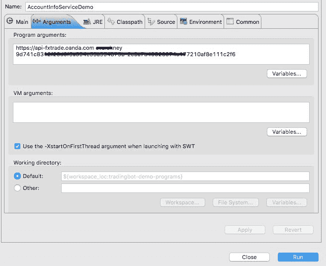 启动配置

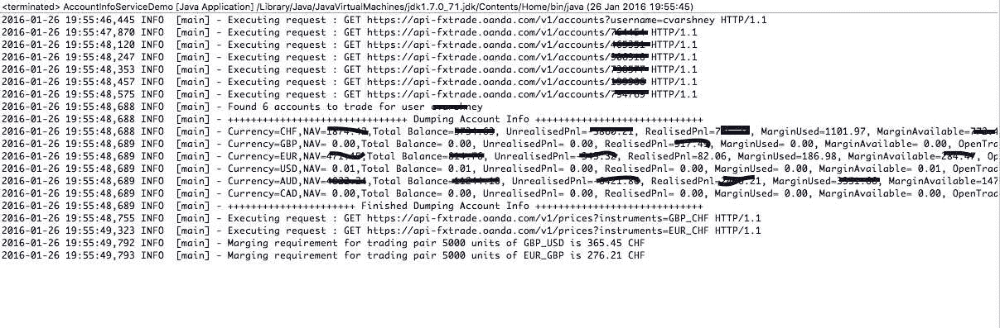 示例输出

## 3. 可交易品种

本章我们将重点介绍经纪平台上可供交易的品种。品种实体是交易平台的核心，因为一切都围绕它展开。从获取报价到下达订单/交易，品种都是其中的主要角色。闲言少叙，让我们直接进入描述可交易品种的 POJO 类。

代码清单 3.1：`TradeableInstrument` POJO 定义

```java
/**
 *
 * @param <T>
 *            instrumentId 的类型
 */
public class TradeableInstrument < T > {
 private final String instrument;
 private final String description;
 private final T instrumentId;
 private final double pip;
 private final int hash;
 private InstrumentPairInterestRate instrumentPairInterestRate;

 public TradeableInstrument(String instrument) {
  this(instrument, null);
 }

 public TradeableInstrument(String instrument, String description) {
  this(instrument, null, description);
 }

 public TradeableInstrument(String instrument, T instrumentId, String description) {
  this(instrument, instrumentId, 0, null);
 }

 public TradeableInstrument(final String instrument, final double pip,
  InstrumentPairInterestRate instrumentPairInterestRate, String description) {
  this(instrument, null, pip, instrumentPairInterestRate, description);

 }

 public TradeableInstrument(final String instrument, T instrumentId, final double pip,
  InstrumentPairInterestRate instrumentPairInterestRate) {
  this(instrument, instrumentId, pip, instrumentPairInterestRate, null);
 }

 public TradeableInstrument(final String instrument, T instrumentId, final double pip,
  InstrumentPairInterestRate instrumentPairInterestRate, String description) {
  this.instrument = instrument;
  this.pip = pip;
  this.instrumentPairInterestRate = instrumentPairInterestRate;
  this.instrumentId = instrumentId;
  this.description = description;
  this.hash = calcHashCode();
 }

 private int calcHashCode() {
  final int prime = 31;
  int result = 1;
  result = prime * result + ((instrument == null) ? 0 : instrument.hashCode());
  result = prime * result + ((instrumentId == null) ? 0 : instrumentId.hashCode());
  return result;
 }

 public T getInstrumentId() {
  return this.instrumentId;
 }

 public String getDescription() {
  return description;
 }

 @Override
 public int hashCode() {
  return hash;
 }

 @Override
 public boolean equals(Object obj) {
  if (this == obj)
   return true;
  if (obj == null)
   return false;
  if (getClass() != obj.getClass())
   return false;
  @SuppressWarnings("unchecked")
  TradeableInstrument < T > other = (TradeableInstrument < T > ) obj;
  if (instrument == null) {
   if (other.instrument != null) {
    return false;
   }
  } else if (!instrument.equals(other.instrument)) {
   return false;
  }
  if (instrumentId == null) {
   if (other.instrumentId != null) {
    return false;
   }
  } else if (!instrumentId.equals(other.instrumentId)) {
   return false;
  }
  return true;
 }

 public InstrumentPairInterestRate getInstrumentPairInterestRate() {
  return instrumentPairInterestRate;
 }

 public void setInstrumentPairInterestRate(InstrumentPairInterestRate instrumentPairInterestRate) {
  this.instrumentPairInterestRate = instrumentPairInterestRate;
 }

 @Override
 public String toString() {
  return "TradeableInstrument [instrument=" + instrument + ", description=" + description + ", instrumentId=" + instrume\
ntId + ", pip=" + pip + ", instrumentPairInterestRate=" + instrumentPairInterestRate + "]";
 }

 public String getInstrument() {
  return instrument;
 }

 public double getPip() {
  return pip;
 }
}
```

`TradeableInstrument` 定义相当直接，但包含一个泛型参数 `T`，以适应不同经纪平台上不同类型的品种 ID。我们还提供了几个构造函数来构建我们的 POJO。构建 POJO 所需的最小属性是 `instrument` 属性。

该 POJO 包含以下属性：

```
private final String instrument;
private final String description;
private final T instrumentId;
private final double pip;
private InstrumentPairInterestRate instrumentPairInterestRate;
```

前两个属性不言自明。`InstrumentId` 代表该品种在给定平台上的内部标识符。在某些平台上，可能需要传递此 ID 而非实际的品种代码（如 `GBP_USD`）来下达订单/进行交易。它还与 `instrument` 属性一起参与了 `hashCode()` 和 `equals()` 方法的定义。

据我所知，`pip` 是给定品种跳动的最小精度。例如，`USDJPY` 的 pip 值为 `0.001`，这意味着 `USDJPY` 价格的最小变动单位是 `0.001`。如果当前 `USDJPY` 的价格是 `123.462`，那么下一次价格变动的最小可能值要么是 `123.461`，要么是 `123.463`。

`instrumentPairInterestRate` 是一个有趣的属性，它可能并非在所有的平台上都可获得。从下面的定义可以看出，它可以捕获一些重要信息，例如持有给定品种的多头或空头头寸时可能产生的费用。简而言之，融资费用是因持有某个货币对的头寸而由经纪平台支付或向经纪平台支付的一笔货币金额。例如，在撰写本文时，持有 `NZDCHF` 多头头寸的人将获得一定金额，但反过来，持有 `NZDCHF` 空头头寸的人则需要支付一定金额。这个值源于所涉及两种货币的利率差异（纽元基准利率=3%，瑞郎基准利率=0%）。

### 代码清单 3.2：`InstrumentPairInterestRate` POJO 定义

```java
package com.precioustech.fxtrading.instrument;

public class InstrumentPairInterestRate {

    private final Double baseCurrencyBidInterestRate;
    private final Double baseCurrencyAskInterestRate;
    private final Double quoteCurrencyBidInterestRate;
    private final Double quoteCurrencyAskInterestRate;

    public InstrumentPairInterestRate() {
        this(null, null, null, null);
    }

    public InstrumentPairInterestRate(Double baseCurrencyBidInterestRate,
            Double baseCurrencyAskInterestRate, Double quoteCurrencyBidInterestRate,
            Double quoteCurrencyAskInterestRate) {
        this.baseCurrencyBidInterestRate = baseCurrencyBidInterestRate;
        this.baseCurrencyAskInterestRate = baseCurrencyAskInterestRate;
        this.quoteCurrencyBidInterestRate = quoteCurrencyBidInterestRate;
        this.quoteCurrencyAskInterestRate = quoteCurrencyAskInterestRate;
    }

    public Double getBaseCurrencyBidInterestRate() {
        return baseCurrencyBidInterestRate;
    }

    public Double getBaseCurrencyAskInterestRate() {
        return baseCurrencyAskInterestRate;
    }

    public Double getQuoteCurrencyBidInterestRate() {
        return quoteCurrencyBidInterestRate;
    }

    public Double getQuoteCurrencyAskInterestRate() {
        return quoteCurrencyAskInterestRate;
    }

    @Override
    public String toString() {
        return "InstrumentPairInterestRate [baseCurrencyBidInterestRate=" + baseCurrencyBidInterestRate + ", baseCurrencyAskInterestRate=" + baseCurrencyAskInterestRate + ", quoteCurrencyBidInterestRate=" + quoteCurrencyBidInterestRate + ", quoteCurrencyAskInterestRate=" + quoteCurrencyAskInterestRate + "]";
    }
}
```

### 3.1 `InstrumentDataProvider` 接口

现在我们必须定义提供者为了获取交易品种数据而必须实现的接口。与账户类似，我们只关心只读数据，因为在经纪平台上，我们无法对交易品种进行创建、更新或删除操作。这是一个获取不可变数据的简单场景，这些数据几乎从不改变，至少在交易时段内如此。偶尔可能会有某些交易品种不再被支持的罕见情况，但大多数情况下，我们观察到的是新增了可供交易的交易品种。可能变化更频繁（但仅在展期窗口期内）的是不同货币的利率。如下面的代码清单所示，我们的接口非常直观。

### 代码清单 3.3：`InstrumentDataProvider` 接口定义

```java
/**
 * 可交易品种数据信息的提供者。提供者至少必须为每个交易品种
 * 提供交易品种名称和点值。由于交易品种数据在交易时段内几乎
 * 从不改变，强烈建议将从此提供者返回的数据缓存在一个不可变
 * 集合中。
 *
 * @param <T> TradeableInstrument 类中 instrumentId 的类型
 * @see TradeableInstrument
 */
public interface InstrumentDataProvider < T > {
    /**
     *
     * @return 经纪平台上所有可供交易的 TradeableInstrument 的集合。
     */
    Collection < TradeableInstrument < T >> getInstruments();
}
```

### 3.2 `InstrumentDataProvider` 的一个具体实现

在我们深入讨论该接口的 OANDA 实现之前，让我们快速查看一下当我们请求所有可交易品种列表时返回的一个示例 JSON 摘录。实际的 JSON 会包含更多的交易品种。

### 代码清单 3.4：交易品种的示例 JSON 负载

```json
{
  "instruments": [
    {
      "instrument": "AUD_CAD",
      "pip": "0.0001",
      "interestRate": {
        "AUD": {
          "bid": 0.0164,
          "ask": 0.0274
        },
        "CAD": {
          "bid": 0.002,
          "ask": 0.008
        }
      }
    },
    {
      "instrument": "AUD_CHF",
      "pip": "0.0001",
      "interestRate": {
        "AUD": {
          "bid": 0.0164,
          "ask": 0.0274
        },
        "CHF": {
          "bid": -0.013,
          "ask": 0.003
        }
      }
    }
  ]
}
```

像往常一样，我们开始代码讨论，首先列出将要使用的所有 JSON 键：

```
1 import static com.precioustech.fxtrading.oanda.restapi.OandaJsonKeys.ask;
2 import static com.precioustech.fxtrading.oanda.restapi.OandaJsonKeys.bid;
3 import static com.precioustech.fxtrading.oanda.restapi.OandaJsonKeys.instruments;
4 import static com.precioustech.fxtrading.oanda.restapi.OandaJsonKeys.interestRate;
```

由于 OANDA 目前没有交易品种的内部标识符，我们使用交易品种名称作为标识符。因此，将 `T` 参数类型替换为 `String`，我们得到：

```
1 public class OandaInstrumentDataProviderService implements InstrumentDataProvider<String> {
```

对于构造函数定义，我们提供 OANDA URL、一个有效的账户 ID 和访问令牌。请记住，账户 ID 应该是与访问令牌关联的用户的一个有效账户。

```
1 public OandaInstrumentDataProviderService(String url, long accountId, String accessToken) {
2  this.url = url; // OANDA REST 服务基础 URL
3  this.accountId = accountId; // OANDA 有效账户 ID
4  this.authHeader = OandaUtils.createAuthHeader(accessToken);
5 }
```

交易品种资源的端点是：

```
1 public static final String INSTRUMENTS_RESOURCE = "/v1/instruments";
```

因此，我们用于计算从 OANDA 获取所有可交易品种的 URL 的函数如下所示：

```
1 static final String fieldsRequested = "instrument%2Cpip%2CinterestRate" //URL 编码的逗号分隔字段列表;

3 String getInstrumentsUrl() {
4  return this.url + OandaConstants.INSTRUMENTS_RESOURCE + "?accountId=" +
5  this.accountId + "&fields=" + fieldsRequested;
6 }
```

关于变量 `fieldsRequested` 的一个说明。默认情况下，如果此请求参数不是 URL 的一部分，那么 OANDA 默认返回字段 `instrument`、`displayName`、`pip`、`maxTradeUnits`，如下面的示例 JSON 响应所示：

```
 1 {
 2   "instruments" : [
 3     {
 4       "instrument" : "AUD_CAD",
 5       "displayName" : "AUD\/CAD",
 6       "pip" : "0.0001",
 7       "maxTradeUnits" : 10000000
 8     },
 9     {
10       "instrument" : "AUD_CHF",
11       "displayName" : "AUD\/CHF",
12       "pip" : "0.0001",
13       "maxTradeUnits" : 10000000
14     }
15   ]
16 }
```

由于 `interestRate` 不在默认字段列表中，我们必须使用 `fieldsRequested` 查询参数显式请求它，以及我们希望在响应中包含的每个字段。现在继续讨论接口的主要实现，如下所示：

**代码清单 3.5：** `getInstruments()` 实现

```java
@Override
public Collection<TradeableInstrument<String>> getInstruments() {
    Collection<TradeableInstrument<String>> instrumentsList = Lists.newArrayList();
    CloseableHttpClient httpClient = getHttpClient();
    try {
        HttpUriRequest httpGet = new HttpGet(getInstrumentsUrl());
        httpGet.setHeader(authHeader);
        LOG.info(TradingUtils.executingRequestMsg(httpGet));
        HttpResponse resp = httpClient.execute(httpGet);
        String strResp = TradingUtils.responseToString(resp);
        if (strResp != StringUtils.EMPTY) {
            Object obj = JSONValue.parse(strResp);
            JSONObject jsonResp = (JSONObject) obj;
            JSONArray instrumentArray = (JSONArray) jsonResp.get(instruments);

            for (Object o : instrumentArray) {
                JSONObject instrumentJson = (JSONObject) o;
                String instrument = (String) instrumentJson.get(OandaJsonKeys.instrument);
                String[] currencies = OandaUtils.splitCcyPair(instrument);
                Double pip = Double.parseDouble(instrumentJson.get(OandaJsonKeys.pip).toString());
                JSONObject interestRates = (JSONObject) instrumentJson.get(interestRate);
                if (interestRates.size() != 2) {
                    throw new IllegalArgumentException();
                }

                JSONObject currency1Json = (JSONObject) interestRates.get(currencies[0]);
                JSONObject currency2Json = (JSONObject) interestRates.get(currencies[1]);

                final double baseCurrencyBidInterestRate = ((Number) currency1Json.get(bid)).doubleValue();
                final double baseCurrencyAskInterestRate = ((Number) currency1Json.get(ask)).doubleValue();
                final double quoteCurrencyBidInterestRate = ((Number) currency2Json.get(bid)).doubleValue();
                final double quoteCurrencyAskInterestRate = ((Number) currency2Json.get(ask)).doubleValue();

                InstrumentPairInterestRate instrumentPairInterestRate = new InstrumentPairInterestRate(
                        baseCurrencyBidInterestRate, baseCurrencyAskInterestRate,
                        quoteCurrencyBidInterestRate, quoteCurrencyAskInterestRate);

                TradeableInstrument<String> tradeableInstrument = new TradeableInstrument<String>(
                        instrument, pip, instrumentPairInterestRate, null);
                instrumentsList.add(tradeableInstrument);
            }
        } else {
            TradingUtils.printErrorMsg(resp);
        }
    } catch (Exception e) {
        LOG.error(e);
    } finally {
        TradingUtils.closeSilently(httpClient);
    }
    return instrumentsList;
}
```

该实现非常直接，可总结如下：

-   通过调用`getInstrumentUrl()`函数构建请求 URL。

-   使用`HttpGet`类的实例发起请求。

-   成功的请求将包含一个`instruments`数组。

-   对于数组中的每个元素，解析可直接获取的`instrument`和`pip`。而`interestRate`必须进一步视为包含 2 个元素的数组，第一个元素对应基础货币，第二个元素对应报价货币。

-   解析每种货币的买入/卖出利率，并创建一个`InstrumentPairInterestRate`对象实例。

-   现在我们拥有某个工具所需的所有属性。将它们存储到将从此方法返回的集合中。

### 3.3 将所有内容封装到通用的`InstrumentService`背后

该服务将提供一些关于可交易工具的实用信息，我们稍后会深入研究。由于工具数据相当不可变，我们可以安全地在内部缓存工具信息，然后使用缓存来服务任何请求的信息。由于缓存是不可变且只读的，我们也不必担心并发问题。我们首先讨论构造函数，它只需要一个`InstrumentDataProvider`的实现作为依赖。

```java
private final Map<String, TradeableInstrument<T>> instrumentMap;

public InstrumentService(InstrumentDataProvider<T> instrumentDataProvider) {
    Preconditions.checkNotNull(instrumentDataProvider);
    Collection<TradeableInstrument<T>> instruments = instrumentDataProvider.getInstruments();
    Map<String, TradeableInstrument<T>> tradeableInstrumenMap = Maps.newHashMap();
    for (TradeableInstrument<T> instrument : instruments) {
        tradeableInstrumenMap.put(instrument.getInstrument(), instrument);
    }
    this.instrumentMap = Collections.unmodifiableMap(tradeableInstrumenMap);
}
```

在构造函数内部，我们使用`InstrumentDataProvider`实现一次性获取所有工具，然后构建不可变缓存`instrumentMap`。现在我们将注意力转向讨论两个服务方法中的第一个，名为`getPipForInstrument`。该方法返回给定工具的 pip 值。此方法的一个有用调用场景可能是，当为某个工具设置限价单时，计算止损或止盈价格。假设我们想在 EURUSD 当前价格下跌 30 个点时下达限价买单。我们的触发价格将会如下所示：

```java
TradeableInstrument<String> eurusd = new TradeableInstrument<String>("EUR_USD");
double triggerPrice = currentPrice - 30 * instrumentService.getPipForInstrument(eurusd);
```

现在让我们看看这个实用服务方法的实际代码。

```java
public Double getPipForInstrument(TradeableInstrument<T> instrument) {
    Preconditions.checkNotNull(instrument);
    TradeableInstrument<T> tradeableInstrument = this.instrumentMap.get(instrument.getInstrument());
    if (tradeableInstrument != null) {
        return tradeableInstrument.getPip();
    } else {
        return 1.0;
    }
}
```

上述代码非常简单。根据传入的工具，获取`instrumentMap`中对应的`TradeableInstrument`实例。如果未找到则返回 1.0，否则返回该工具的 pip 值。

另一个有用的服务方法是`getAllPairsWithCurrency`。该方法返回一个集合，其中包含指定货币作为基础货币或报价货币的所有工具。例如，要获取所有以`CHF`为基础或报价货币的工具集合，可以像这样调用：

```java
// 返回诸如 USDCHF, CHFJPY 等工具
Collection<TradeableInstrument<String>> chfpairs = instrumentService.getAllPairsWithCurrency("CHF");
```

现在让我们看看同样非常直接的实际实现。

```java
public Collection<TradeableInstrument<T>> getAllPairsWithCurrency(String currency) {
    Collection<TradeableInstrument<T>> allPairs = Sets.newHashSet();
    if (StringUtils.isEmpty(currency)) {
        return allPairs;
    }
    for (Map.Entry<String, TradeableInstrument<T>> entry : instrumentMap.entrySet()) {
        if (entry.getKey().contains(currency)) {
            allPairs.add(entry.getValue());
        }
    }
    return allPairs;
}
```

在上述代码中，如果传入的值为空或空白字符串，则返回一个空集合。如果是一个有效的字符串，我们遍历缓存并使用`contains`来检查当前键是否包含传入的字符串。如果包含，则将其添加到将从方法返回的集合中。至此，我们关于可交易工具的大部分讨论就结束了。

### 3.4 动手实践

在本节中，我们将创建一个演示程序，该程序将调用`InstrumentServiceDemo`的一些方法，并将输出打印到控制台。

```java
package com.precioustech.fxtrading.instrument;

import java.util.Collection;

import org.apache.commons.lang3.StringUtils;
import org.apache.log4j.Logger;

import com.precioustech.fxtrading.oanda.restapi.instrument.OandaInstrumentDataProviderService;

public class InstrumentServiceDemo {

    private static final Logger LOG = Logger.getLogger(InstrumentServiceDemo.class);

    private static void usageAndValidation(String[] args) {
        if (args.length != 3) {
            LOG.error("Usage: InstrumentServiceDemo <url> <accountid> <accesstoken>");
            System.exit(1);
        } else {
            if (!StringUtils.isNumeric(args[1])) {
                LOG.error("Argument 2 should be numeric");
                System.exit(1);
            }
        }
    }

    public static void main(String[] args) {
        usageAndValidation(args);
        String url = args[0];
        Long accountId = Long.parseLong(args[1]);
        String accessToken = args[2];

        InstrumentDataProvider<String> instrumentDataProvider = new OandaInstrumentDataProviderService(url,
                accountId, accessToken);

        InstrumentService<String> instrumentService = new InstrumentService<String>(instrumentDataProvider);

        Collection<TradeableInstrument<String>> gbpInstruments =
                instrumentService.getAllPairsWithCurrency("GBP");

        LOG.info("+++++++++++++++++++++++++++++++ Dumping Instrument Info +++++++++++++++++++++++++++++");
        for (TradeableInstrument<String> instrument : gbpInstruments) {
            LOG.info(instrument);
        }
        LOG.info("+++++++++++++++++++++++Finished Dumping Instrument Info +++++++++++++++++++++++++++++");
        TradeableInstrument<String> euraud = new TradeableInstrument<String>("EUR_AUD");
        TradeableInstrument<String> usdjpy = new TradeableInstrument<String>("USD_JPY");
        TradeableInstrument<String> usdzar = new TradeableInstrument<String>("USD_ZAR");

        Double usdjpyPip = instrumentService.getPipForInstrument(usdjpy);
        Double euraudPip = instrumentService.getPipForInstrument(euraud);
        Double usdzarPip = instrumentService.getPipForInstrument(usdzar);

        LOG.info(String.format("Pip for instrument %s is %1.5f", euraud.getInstrument(), euraudPip));
        LOG.info(String.format("Pip for instrument %s is %1.5f", usdjpy.getInstrument(), usdjpyPip));
        LOG.info(String.format("Pip for instrument %s is %1.5f", usdzar.getInstrument(), usdzarPip));
    }
}
```

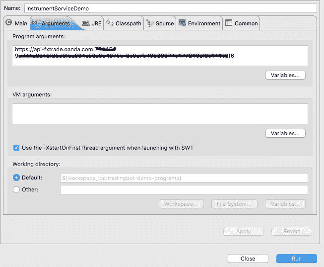 启动配置 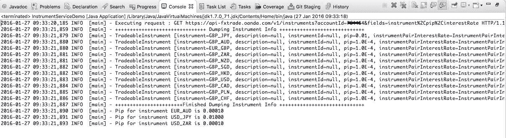 示例输出

1. (http://fxtrade.oanda.com/learn/intro-to-currency-trading/conventions/pips)↩︎

## 4. 事件流：市场数据事件

现在我们已经到了交易机器人的真正存在开始变得明显的阶段。从这里开始，我们将进入交易的实际层面，其中之一就是处理实时事件并对其做出反应，前提是我们要对事件进行有意义的分析。事件流可能呈现以下形式和形状：

- 市场数据事件，即某一工具价格的变化。
- 交易/订单/账户事件，例如订单成交或止损水平被触发。
- 社交媒体事件，例如有影响力的人物或市场推动者的推文。
- 任何其他来源

正如我们所见，我们可能有众多事件流，以不同程度的强度向我们的交易机器人发送信息。处理这些事件并基于它们做出决策是交易机器人设计的基石。在本章中，我们将专门讨论如何处理市场数据事件，以及如何使用 `Google EventBus` 来分发这些事件。

### 4.1 流式市场数据接口

我们首先定义一个接口，该接口规定了市场事件流在我们的机器人中工作所需的最小方法集。表面上看，似乎没什么复杂之处，因为我们只是对接口实现者强制执行了一个 `start` 和 `stop` 的要求。然而，正如我们稍后讨论实现时将会看到的，实现者的一部分工作是调用一个 `MarketEventCallback` 处理器，该处理器负责处理接收到的流式市场事件。假设 `startMarketDataStreaming()` 方法会建立一条到事件源的持续连接（事件循环），即在一个独立的线程中，并且这个线程在该连接上接收市场数据事件。然后，事件会被解析并传递给 `MarketEventCallback` 以进行进一步处理。

```java
/**
 * 一个提供流式市场数据的服务。通常，实现会创建一个到交易平台的专用连接，
 * 并理想地通过 REST 服务或平台的回调接收价格流。实现必须处理断开的连接，
 * 并以适当的方式尝试重新连接。该服务通常与平台的心跳信号耦合，
 * 心跳信号指示连接是否存活。
 *
 * 由于预期的数据量较大，建议服务将市场数据的处理委托给另一个服务，
 * 以避免等待处理的事件队列堆积。
 *
 */
public interface MarketDataStreamingService {

    /**
     * 启动流式服务，该服务理想地会创建一个到平台的专用连接或一个回调监听器。
     * 最好不要创建多个请求相同市场数据的连接。
     */
    void startMarketDataStreaming();

    /**
     * 停止流式服务，并以适当的方式释放任何资源/连接，确保不产生资源泄漏。
     */
    void stopMarketDataStreaming();

}
```

`MarketEventCallback` 接口必须配合使用，该接口实际上负责同步或异步地进一步分发市场数据事件。

```java
/**
 * 市场数据事件的回调处理器。上游独立的流式事件处理器负责处理和解析来自
 * 市场数据源的传入事件，并调用此处理器的 onMarketEvent 方法，
 * 该方法随后可以根据需要将事件进一步向下游分发。
 * 理想情况下，该接口的实现者会将事件放入队列进行异步处理，
 * 或使用事件总线进行同步处理。
 *
 * @param <T>
 *            TradeableInstrument 类中 instrumentId 的类型
 * @see TradeableInstrument
 * @see EventBus
 */
public interface MarketEventCallback<T> {
    /**
     * 由流式市场数据事件的上游处理器调用的方法。此方法的调用是同步的，
     * 因此该方法应尽快返回，以确保上游事件不会排队堆积。
     *
     * @param instrument
     * @param bid
     * @param ask
     * @param eventDate
     */
    void onMarketEvent(TradeableInstrument<T> instrument, double bid, double ask, DateTime eventDate);
}
```

让我们直接跳入 OANDA 的实现，因为一旦我们查看代码内部，事情就会变得更加清晰。

### 4.2 `MarketDataStreamingService` 的一个具体实现

让我们先来看一下 `OandaMarketDataStreamingService` 的类定义和构造函数，该类负责从 OANDA 读取市场数据流，并调用通过构造函数传入的 `MarketEventCallback` 实例上的 `onMarketEvent` 方法。

```java
public class OandaMarketDataStreamingService extends OandaStreamingService implements MarketDataStreamingService {

    private final String url;
    private final MarketEventCallback<String> marketEventCallback;

    public OandaMarketDataStreamingService(String url, String accessToken,
                                          long accountId, Collection<TradeableInstrument<String>> instruments,
                                          MarketEventCallback<String> marketEventCallback,
                                          HeartBeatCallback<DateTime> heartBeatCallback, String heartbeatSourceId) {
        super(accessToken, heartBeatCallback, heartbeatSourceId);
        this.url = url + OandaConstants.PRICES_RESOURCE + "?accountId=" + accountId + "&instruments=" + instrumentsAsCsv(instruments);
        this.marketEventCallback = marketEventCallback;
    }

    private String instrumentsAsCsv(Collection<TradeableInstrument<String>> instruments) {
        StringBuilder csvLst = new StringBuilder();
        boolean firstTime = true;
        for (TradeableInstrument<String> instrument : instruments) {
            if (firstTime) {
                firstTime = false;
            } else {
                csvLst.append(TradingConstants.ENCODED_COMMA);
            }
            csvLst.append(instrument.getInstrument());
        }
        return csvLst.toString();
    }
}
```

构造函数除了其他参数外，还接收一个账户 ID 和一个需要获取报价的金融工具列表。`instrumentsAsCsv` 方法接收一个金融工具集合，并返回一个扁平的字符串，其中包含以 URL 编码的逗号分隔的金融工具名称。假设账户 ID 为 `123456`，金融工具列表为 `["EUR_USD","GBP_AUD"]`，那么构造函器中计算出的 URL 将如下所示：

```java
//假设
public static final String PRICES_RESOURCE = "/v1/prices";
//计算出的 this.url 将如下所示

https://stream-fxtrade.oanda.com/v1/prices?accountId=123456&instruments=EUR_USD%2CGBP_AUD
```

如前所述，OANDA 要求我们提供一个有效的账户 ID 来建立市场数据流。该流的 URL 也与之前讨论过的不同，例如用于请求金融工具列表的 URL。我们将在后面关于配置和部署的章节中详细讨论这些细微差别。

我们的具体实现继承了 `OandaStreamingService` 类，该类是为所有来自 OANDA 的流服务提供基础设施方法的基类，这当然包括市场数据，并且正如我们将在未来章节中讨论的，还包括事件流。来自 OANDA 的所有流都包含一个心跳负载，用于指示流是活跃的，因此需要 `HeartBeatCallback` 实例。我们将在后面的章节中讨论心跳。目前，只需知道心跳提供了一种确保客户端（我们的交易机器人）到经纪平台持久连接仍然存活的途径。如果当前流在给定时间内未收到心跳负载，则说明出现了问题，我们必须断开连接并尝试重新连接。让我们快速看一下它的定义以及它向其子类提供的一些重要基础设施方法。

```java
public abstract class OandaStreamingService implements HeartBeatStreamingService {
    protected volatile boolean serviceUp = true;
    private final HeartBeatCallback<DateTime> heartBeatCallback;
    private final String hearbeatSourceId;
    protected Thread streamThread;
    private final BasicHeader authHeader;

    protected abstract String getStreamingUrl();

    protected abstract void startStreaming();

    protected abstract void stopStreaming();

    protected OandaStreamingService(String accessToken, HeartBeatCallback<DateTime> heartBeatCallback,
                                   String heartbeatSourceId) {
        this.hearbeatSourceId = heartbeatSourceId;
        this.heartBeatCallback = heartBeatCallback;
        this.authHeader = OandaUtils.createAuthHeader(accessToken);
    }

    protected void handleHeartBeat(JSONObject streamEvent) {
        Long t = Long.parseLong(((JSONObject) streamEvent.get(OandaJsonKeys.heartbeat)).get(OandaJsonKeys.time).toString());
        heartBeatCallback.onHeartBeat(new HeartBeatPayLoad<DateTime>(new DateTime(TradingUtils.toMillisFromNanos(t)), hearbeatSourceId));
    }

    protected BufferedReader setUpStreamIfPossible(CloseableHttpClient httpClient) throws Exception {
        HttpUriRequest httpGet = new HttpGet(getStreamingUrl());
        httpGet.setHeader(authHeader);
        httpGet.setHeader(OandaConstants.UNIX_DATETIME_HEADER);
        LOG.info(TradingUtils.executingRequestMsg(httpGet));
        HttpResponse resp = httpClient.execute(httpGet);
        HttpEntity entity = resp.getEntity();
        if (resp.getStatusLine().getStatusCode() == HttpStatus.SC_OK && entity != null) {
            InputStream stream = entity.getContent();
            serviceUp = true;
            BufferedReader br = new BufferedReader(new InputStreamReader(stream));
            return br;
        } else {
            String responseString = EntityUtils.toString(entity, "UTF-8");
            LOG.warn(responseString);
            return null;
        }
    }

    protected void handleDisconnect(String line) {
        serviceUp = false;
        LOG.warn(
                String.format("Disconnect message received for stream %s. PayLoad->%s",
                        getHeartBeatSourceId(), line));
    }

    protected boolean isStreaming() {
        return serviceUp;
    }
}
```

总而言之，基类为其流子类提供以下基础设施（或辅助）服务：

*   使用由子类提供的 `getStreamingUrl()`（实现了这个抽象方法）建立到 OANDA 的持久流连接。

*   处理来自 OANDA 的断开连接消息（如果由于某种原因，OANDA 断开了当前流）。

*   处理心跳负载并调用下游的 `HeartBeatCallback` 处理器。

回到我们的具体实现，让我们来看一下该类最重要的方法 `startMarketDataStreaming`，它在单独的线程中启动流，并在流建立后解析接收到的事件负载。

```java
import static com.precioustech.fxtrading.oanda.restapi.OandaJsonKeys.ask;
import static com.precioustech.fxtrading.oanda.restapi.OandaJsonKeys.bid;
import static com.precioustech.fxtrading.oanda.restapi.OandaJsonKeys.disconnect;
import static com.precioustech.fxtrading.oanda.restapi.OandaJsonKeys.heartbeat;
import static com.precioustech.fxtrading.oanda.restapi.OandaJsonKeys.tick;
import static com.precioustech.fxtrading.oanda.restapi.OandaJsonKeys.time;

@Override
public void startMarketDataStreaming() {
    stopMarketDataStreaming();
    this.streamThread = new Thread(new Runnable() {

        @Override
        public void run() {
            CloseableHttpClient httpClient = getHttpClient();
            try {
                BufferedReader br = setUpStreamIfPossible(httpClient);
                if (br != null) {
                    String line;
                    while ((line = br.readLine()) != null && serviceUp) {
                        Object obj = JSONValue.parse(line);
                        JSONObject instrumentTick = (JSONObject) obj;
                        // 如有必要则解包
                        if (instrumentTick.containsKey(tick)) {
                            instrumentTick = (JSONObject) instrumentTick.get(tick);
                        }
```

```java
28       if (instrumentTick.containsKey(OandaJsonKeys.instrument)) {
29        final String instrument = instrumentTick.get(OandaJsonKeys.instrument).toString();
30        final String timeAsString = instrumentTick.get(time).toString();
31        final long eventTime = Long.parseLong(timeAsString);
32        final double bidPrice = ((Number) instrumentTick.get(bid)).doubleValue();
33        final double askPrice = ((Number) instrumentTick.get(ask)).doubleValue();
34        marketEventCallback.onMarketEvent(
35         new TradeableInstrument < String > (instrument), bidPrice, askPrice,
36         new DateTime(TradingUtils.toMillisFromNanos(eventTime)));
37       } else if (instrumentTick.containsKey(heartbeat)) {
38        handleHeartBeat(instrumentTick);
39       } else if (instrumentTick.containsKey(disconnect)) {
40        handleDisconnect(line);
41       }
42      }
43      br.close();
44     }
45    } catch (Exception e) {
46     LOG.error(e);
47    } finally {
48     serviceUp = false;
49     TradingUtils.closeSilently(httpClient);
50    }
52   }
53  }, "OandMarketDataStreamingThread");
54  this.streamThread.start();
56 }
58 @Override
59 public void stopMarketDataStreaming() {
60  this.serviceUp = false;
61  if (streamThread != null && streamThread.isAlive()) {
62   streamThread.interrupt();
63  }
64 }
```

`startMarketDataStreaming()` 方法首先调用 `stopMarketDataStreaming()`，目的是确保停止可能正在处理事件的现有线程，并启动一个新线程。这么做的原因在于，我们可能会遇到连接问题，有时需要重启数据流。假设在此之后没有现有线程消费市场数据事件，我们就可以创建一个新线程来开始消费事件。观察到 `run()` 方法仅在条件 `line = br.readLine()) != null && serviceUp` 为 `false` 时退出。`serviceUp` 的值在调用 `stopMarketDataStreaming()` 方法时被设为 `false`。如果为流式传输设置的 `BufferedReader` 停止传输事件并返回 `null`，这也会导致 `while` 循环终止，从而使流线程终止。假设数据流正在为所需交易品种传输市场数据事件，我们应该会以非常高的频率看到类似下面这样的 JSON 响应。

```json
1 {"tick":{"instrument":"EUR_USD","time":"1401919213548144","bid":1.08479,"ask":1.08498}}
2 {"tick":{"instrument":"GBP_AUD","time":"1401919213548822","bid":2.07979,"ask":1.08998}}
3 {"heartbeat":{"time":"1401919213548226"}}
4 {"tick":{"instrument":"EUR_USD","time":"1401919217201682","bid":1.08484,"ask":1.08502}}
```

基本上，如果配置的交易品种数量很大（例如 > 10），那么每秒钟可能会收到多个报价，尤其是在伦敦时段。

查看解析代码，我们注意到代码处理三种类型的负载，分别具有以下键：

- `tick`

- `heartbeat`

- `disconnect`

一个 `disconnect` 负载看起来像这样：

```json
1 {"disconnect":{"code":60,"message":"Access Token connection limit exceeded: This connection will now be disconnected","moreInfo":"http:\/\/developer.oanda.com\/docs\/v1\/troubleshooting"}}
```

对于 `tick` 负载，我们将 JSON 负载解析为 `bidPrice`、`askPrice`、`instrument` 和 `eventTime`，然后委托给 `marketEventCallback.onMarketEvent()` 方法，该方法可以同步或异步处理报价。无论哪种情况，这个调用都必须非常快速，否则事件将开始排队，我们可能会在系统中引入不必要的延迟，这可能会使消费这些事件的策略偏离轨道，因为它无法反映最新的价格。

`heartbeat` 和 `disconnect` 负载由父类处理，如前所述。

```java
protected void handleHeartBeat(JSONObject streamEvent) {
    Long t = Long.parseLong(((JSONObject) streamEvent.get(heartbeat)).get(time) toString());
    heartBeatCallback.onHeartBeat(new HeartBeatPayLoad < DateTime > (new DateTime(TradingUtils.toMillisFromNanos(t)), heartBeatSourceId));
}

protected void handleDisconnect(String line) {
    serviceUp = false;
    LOG.warn(
        String.format("Disconnect message received for stream %s. PayLoad->%s",
            getHeartBeatSourceId(), line));
}
```

至此，我们结束了对上游事件处理和解析的讨论。正如我们将在后续章节中发现的那样，心跳对于保持数据流活动至关重要。我们必须重视这些心跳，并在它们停止时迅速采取行动（以重新启动这些数据流的形式），以免我们的策略做出错误决策。在下一节中，我们将讨论如何通过 `marketEventCallback.onMarketEvent()` 在下游消费事件。

### 4.3 下游市场数据事件分发：`MarketEventCallback`

为了理解市场数据事件在下游究竟发生了什么，我们需要研究 `MarketEventCallback` 接口的一个示例实现。

```java
public class MarketEventHandlerImpl < T > implements MarketEventCallback < T > {
    private final EventBus eventBus;

    public MarketEventHandlerImpl(EventBus eventBus) {
        this.eventBus = eventBus;
    }

    @Override
    public void onMarketEvent(TradeableInstrument < T > instrument, double bid,
        double ask, DateTime eventDate) {
        MarketDataPayLoad < T > payload = new MarketDataPayLoad < T > (instrument, bid, ask, eventDate);
        eventBus.post(payload);
    }
}
```

`MarketEventHandlerImpl` 的实现再简单不过了。基本上，它将事件分发的职责委托给了 `Google EventBus`，根据其配置方式（同步或异步），它会将此事件分发到任何具有 `@Subscribe` 注解且输入参数为 `MarketDataPayLoad<T>` 的 `void` 方法。例如，一个方法签名看起来像这样：

```java
@Subscribe
@AllowConcurrentEvents
public void handleMarketDataEvent(MarketDataPayLoad<T> marketDataPayLoad) {
    ....
    ....
}
```

就是这样！！我们可以创建任意数量的此类订阅者，并通过事件总线接收带有 `MarketDataPayLoad` 负载的回调。我们将在后面的章节中看到，如何插入订阅者，例如基于交易策略的组件，这些组件是市场数据的主要消费者。

### 4.4 动手实践

在本节中，我们将创建一个演示程序，用于输出平台流式传输到 `MarketDataStreamingService` 的市场数据和心跳事件。

```java
package com.precioustech.fxtrading.oanda.restapi.streaming.marketdata;

import java.util.Collection;

import org.apache.commons.lang3.StringUtils;
import org.apache.log4j.Logger;
import org.joda.time.DateTime;

import com.google.common.collect.Lists;
import com.google.common.eventbus.AllowConcurrentEvents;
import com.google.common.eventbus.EventBus;
import com.google.common.eventbus.Subscribe;
import com.precioustech.fxtrading.heartbeats.HeartBeatCallback;
import com.precioustech.fxtrading.heartbeats.HeartBeatCallbackImpl;
import com.precioustech.fxtrading.heartbeats.HeartBeatPayLoad;
import com.precioustech.fxtrading.instrument.TradeableInstrument;
import com.precioustech.fxtrading.marketdata.MarketDataPayLoad;
import com.precioustech.fxtrading.marketdata.MarketEventCallback;
import com.precioustech.fxtrading.marketdata.MarketEventHandlerImpl;
import com.precioustech.fxtrading.streaming.marketdata.MarketDataStreamingService;

public class MarketDataStreamingServiceDemo {

 private static final Logger LOG = Logger.getLogger(MarketDataStreamingServiceDemo.class);

 private static void usageAndValidation(String[] args) {
  if (args.length != 3) {
   LOG.error("用法: MarketDataStreamingServiceDemo <url> <accountid> <accesstoken>");
   System.exit(1);
  } else {
   if (!StringUtils.isNumeric(args[1])) {
    LOG.error("参数 2 应为数字");
    System.exit(1);
   }
  }
 }

 private static class DataSubscriber {

  @Subscribe
  @AllowConcurrentEvents
  public void handleMarketDataEvent(MarketDataPayLoad<String> marketDataPayLoad) {
   LOG.info(String.format("TickData 事件: %s @ %s. 买价 = %3.5f, 卖价 = %3.5f",
    marketDataPayLoad.getInstrument().getInstrument(), marketDataPayLoad.getEventDate(),
    marketDataPayLoad.getBidPrice(), marketDataPayLoad.getAskPrice()));
  }

  @Subscribe
  @AllowConcurrentEvents
  public void handleHeartBeats(HeartBeatPayLoad<DateTime> payLoad) {
   LOG.info(String.format("在 %s 收到来自 %s 的心跳", payLoad.getHeartBeatPayLoad(),
    payLoad.getHeartBeatSource()));
  }

 }

 public static void main(String[] args) throws Exception {

  usageAndValidation(args);
  final String url = args[0];
  final Long accountId = Long.parseLong(args[1]);
  final String accessToken = args[2];
  final String heartbeatSourceId = "DEMO_MKTDATASTREAM";

  TradeableInstrument<String> eurusd = new TradeableInstrument<String>("EUR_USD");
  TradeableInstrument<String> gbpnzd = new TradeableInstrument<String>("GBP_NZD");

  Collection<TradeableInstrument<String>> instruments = Lists.newArrayList(eurusd, gbpnzd);

  EventBus eventBus = new EventBus();
  eventBus.register(new DataSubscriber());

  MarketEventCallback<String> mktEventCallback = new MarketEventHandlerImpl<String>(eventBus);
  HeartBeatCallback<DateTime> heartBeatCallback = new HeartBeatCallbackImpl<DateTime>(eventBus);

  MarketDataStreamingService mktDataStreaminService = new OandaMarketDataStreamingService(url,
   accessToken,
   accountId, instruments, mktEventCallback, heartBeatCallback, heartbeatSourceId);
  LOG.info("++++++++++++ 启动市场数据流 +++++++++++++++++++++");
  mktDataStreaminService.startMarketDataStreaming();
  Thread.sleep(20000L);
  mktDataStreaminService.stopMarketDataStreaming();
 }
}
```

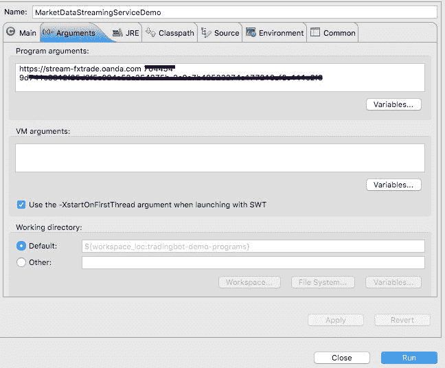 启动配置 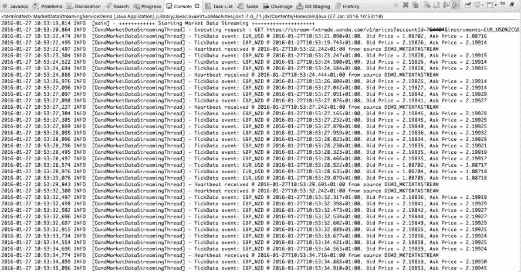 示例输出

## 5. 历史工具市场数据

在本章中，我们将讨论构建服务以查询历史市场数据的一些技术。对于那些希望基于给定工具的历史数据分析来构建策略的人来说，这可能非常有趣。传统上，图表中的历史工具数据以蜡烛图的形式呈现。蜡烛图形态是一种技术分析形式，可用于任何时间框架。它们类似于柱状图，并提供所讨论时间框架的开盘价、收盘价、最高价和最低价。

### 5.1 如何解读蜡烛图

蜡烛图的长度显示了报告时间框架（时段）内开盘价和收盘价的相对变化。实体越长，时段内开盘价和收盘价的变动越大。这可能表明价格波动性较高。如果收盘价高于开盘价，则蜡烛图的实体为白色。相反，如果收盘价低于开盘价，则实体为黑色。实体上下的细线称为影线。上影线的顶端是时段的最高价，下影线的底端是时段的最低价。蜡烛图的长度和颜色可以指示牛市或熊市。

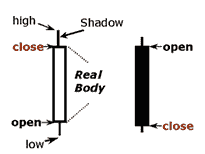 蜡烛图

### 5.2 定义蜡烛图粒度的枚举

我们首先定义一个`Enum`，该枚举定义了我们将支持的各种蜡烛图粒度或时间框架，以此开启理解市场数据之旅。

代码清单 5.1：`CandleStickGranularity` 枚举定义

```java
public enum CandleStickGranularity {

    S5(5), // 5 秒
    S10(10), // 10 秒
    S15(15), // 15 秒
    S30(30), // 30 秒
    M1(60 * 1), // 1 分钟
    M2(60 * 2), // 2 分钟
    M3(60 * 3), // 3 分钟
    M5(60 * 5), // 5 分钟
    M10(60 * 10), // 10 分钟
    M15(60 * 15), // 15 分钟
    M30(60 * 30), // 30 分钟
    H1(60 * 60), // 1 小时
    H2(60 * 60 * 2), // 2 小时
    H3(60 * 60 * 3), // 3 小时
    H4(60 * 60 * 4), // 4 小时
    H6(60 * 60 * 6), // 6 小时
    H8(60 * 60 * 8), // 8 小时
    H12(60 * 60 * 12), // 12 小时
    D(60 * 60 * 24), // 1 天
    W(60 * 60 * 24 * 7), // 1 周
    M(60 * 60 * 24 * 30); // 1 个月

    private final long granularityInSeconds;

    private CandleStickGranularity(long granularityInSeconds) {
        this.granularityInSeconds = granularityInSeconds;
    }

    public long getGranularityInSeconds() {
        return granularityInSeconds;
    }
}
```

上面的枚举定义相当直接。我们定义了 API 将支持的所有粒度或时间框架。最小粒度是 5 秒，最大是 1 个月。我们定义了一个构造函数，用于接受`granularityInSeconds()`，以防万一我们需要在按名称解析枚举并需要获取其粒度或时段长度的情况下量化粒度。

### 5.3 定义保存蜡烛图信息的 POJO

现在我们将注意力转向定义用于保存所有蜡烛图信息的 POJO。

代码清单 5.2：CandleStick POJO

```java
public class CandleStick<T> {
    /*所有价格均为买入价和卖出价的平均值，即 (bid+ask)/2*/
    private final double openPrice,
            highPrice,
            lowPrice,
            closePrice;
    private final DateTime eventDate;
    private final TradeableInstrument<T> instrument;
    private final CandleStickGranularity candleGranularity;
    private final String toStr;
    private final int hash;

    public CandleStick(double openPrice, double highPrice, double lowPrice,
                       double closePrice, DateTime eventDate, TradeableInstrument<T> instrument,
                       CandleStickGranularity candleGranularity) {
        super();
        this.openPrice = openPrice;
        this.highPrice = highPrice;
        this.lowPrice = lowPrice;
        this.closePrice = closePrice;
        this.eventDate = eventDate;
        this.instrument = instrument;
        this.candleGranularity = candleGranularity;
        this.hash = calcHash();
        this.toStr = String.format(
                "Open=%2.5f, high=%2.5f, low=%2.5f,close=%2.5f,date=%s, instrument=%s, granularity=%s",
                openPrice, highPrice, lowPrice, closePrice, eventDate, instrument,
                candleGranularity.name());
    }

    private int calcHash() {
        final int prime = 31;
        int result = 1;
        result = prime * result + ((candleGranularity == null) ? -1 : candleGranularity.ordinal());
        result = prime * result + ((eventDate == null) ? 0 : eventDate.hashCode());
        result = prime * result + ((instrument == null) ? 0 : instrument.hashCode());
        return result;
    }

    @Override
    public int hashCode() {
        return hash;
    }

    @Override
    public boolean equals(Object obj) {
        if (this == obj)
            return true;
        if (obj == null)
            return false;
        if (getClass() != obj.getClass())
            return false;
        CandleStick other = (CandleStick) obj;
        if (candleGranularity != other.candleGranularity)
            return false;
        if (eventDate == null) {
            if (other.eventDate != null)
                return false;
        } else if (!eventDate.equals(other.eventDate))
            return false;
        if (instrument == null) {
            if (other.instrument != null)
                return false;
        } else if (!instrument.equals(other.instrument))
            return false;
        return true;
    }

    @Override
    public String toString() {
        return this.toStr;
    }

    public CandleStickGranularity getCandleGranularity() {
        return candleGranularity;
    }

    public TradeableInstrument<T> getInstrument() {
        return instrument;
    }

    public double getOpenPrice() {
        return openPrice;
    }

    public double getHighPrice() {
        return highPrice;
    }

    public double getLowPrice() {
        return lowPrice;
    }

    public double getClosePrice() {
        return closePrice;
    }

    public DateTime getEventDate() {
        return eventDate;
    }
}
```

除了`eventDate`，所有其他属性在我们之前关于“如何解读蜡烛图”的讨论中都是不言自明的。我们本应期望有开始和结束日期，但这里只有一个`eventDate`属性。为什么会这样呢？实际上，根据蜡烛图的粒度及其开始时间，可以推算出结束日期。所以`eventDate`实际上是蜡烛图周期的开始时间。

关于`hashCode()`和`equals()`方法，以下三个属性参与其中，并用于确定蜡烛图在集合中是否是唯一的。

```java
private final DateTime eventDate;
private final TradeableInstrument<T> instrument;
private final CandleStickGranularity candleGranularity;
```

POJO 中的所有价格属性都假定为买入价和卖出价的平均值。

#### 历史数据提供者接口

现在，是时候定义历史数据提供者接口了，该接口将指定需要实现哪些内容才能检索到有意义的蜡烛图数据并进行分析。

代码清单 5.3：`HistoricMarketDataProvider` 接口

```java
/**
 * 针对给定金融工具的蜡烛图数据提供者。蜡烛图必须按时间顺序排列，以便于构建时间序列信息。
 * @param <T>
 *            类 `TradeableInstrument` 中的 `instrumentId` 类型
 * @see TradeableInstrument
 */
public interface HistoricMarketDataProvider < T > {

    /**
     * 为给定的起始和结束时间段构建蜡烛图。
     *
     * @param instrument
     *            ，需要获取其蜡烛图信息的金融工具
     * @param granularity
     *            ，两个蜡烛图之间的时间间隔
     * @param from
     *            ，第一个蜡烛图的开始时间
     * @param to
     *            ，最后一个蜡烛图的结束时间
     * @return `List<CandleStick<T>>` 按时间顺序排列。
     */
    List < CandleStick < T >> getCandleSticks(TradeableInstrument < T > instrument,
        CandleStickGranularity granularity, DateTime from, DateTime to);

    /**
     * 构建最近的“count”个蜡烛图。如果合适，这可以转化为对上述需要“from”和“to”日期的重载方法的调用。
     * “to”日期 = `now()` 且“from”日期 = `now() - granularity*count`
     *
     * @param instrument
     *            ，需要获取其蜡烛图信息的金融工具
     * @param granularity
     *            ，两个蜡烛图之间的时间间隔
     * @param count
     *            ，
     * @return `List<CandleStick<T>>` 按时间顺序排列。
     */
    List < CandleStick < T >> getCandleSticks(TradeableInstrument < T > instrument,
        CandleStickGranularity granularity, int count);
}
```

和往常一样，这个接口定义看起来相当简单。两个重载方法——一个接受`from`和`to`时间段，另一个接受所需的最后`count`个蜡烛图——就是检索所需蜡烛图的全部所需。返回类型选择`List`而非`Collection`，保证了蜡烛图有一定的顺序，此处即为时间顺序。

### 5.4 `HistoricMarketDataProvider` 的具体实现

我们首先快速查看请求 K 线数据时返回的示例 JSON，以此开始对 OANDA 实现的讨论。下面的示例粒度为**每日**。

代码清单 5.4：K 线的示例 JSON

```json
{
  "instrument": "GBP_USD",
  "granularity": "D",
  "candles": [
    {
      "time": "1442098800000000",
      "openMid": 1.54301,
      "highMid": 1.544695,
      "lowMid": 1.54284,
      "closeMid": 1.544295,
      "volume": 868,
      "complete": true
    },
    {
      "time": "1442185200000000",
      "openMid": 1.544245,
      "highMid": 1.54594,
      "lowMid": 1.54376,
      "closeMid": 1.54406,
      "volume": 3765,
      "complete": false
    }
  ]
}
```

我们需要在 provider 类中静态导入的 JSON 键如下：

```java
import static com.precioustech.fxtrading.oanda.restapi.OandaJsonKeys.candles;
import static com.precioustech.fxtrading.oanda.restapi.OandaJsonKeys.closeMid;
import static com.precioustech.fxtrading.oanda.restapi.OandaJsonKeys.highMid;
import static com.precioustech.fxtrading.oanda.restapi.OandaJsonKeys.lowMid;
import static com.precioustech.fxtrading.oanda.restapi.OandaJsonKeys.openMid;
import static com.precioustech.fxtrading.oanda.restapi.OandaJsonKeys.time;
```

与往常一样，将接口定义中的参数类型`T`替换为`String`，我们得到如下类定义：

```java
public class OandaHistoricMarketDataProvider implements HistoricMarketDataProvider<String> {
```

对于构造函数定义，提供 OANDA 服务 URL 和一个访问令牌就足够了：

```java
private final String url;
private final BasicHeader authHeader;
public OandaHistoricMarketDataProvider(String url, String accessToken) {
    this.url = url;// OANDA REST 服务基本 URL
    this.authHeader = OandaUtils.createAuthHeader(accessToken);
}
```

K 线资源端点如下：

```java
public static final String CANDLES_RESOURCE = "/v1/candles";
```

因此，我们分别用于计算获取 K 线（一个通过日期范围，另一个通过数量）的 URL 的函数如下：

```
# 代码示例与关键观察点

## 代码示例

```java
private static final String tzLondon = "Europe%2FLondon";

String getFromToUrl(TradeableInstrument<String> instrument, CandleStickGranularity granularity,
    DateTime from, DateTime to) {
    return String.format(
        "%s%s?instrument=%s&candleFormat=midpoint&granularity=%s&dailyAlignment=0&alignmentTimezone=%s&start=%d&end=%d",
        this.url, OandaConstants.CANDLES_RESOURCE, instrument.getInstrument(),
        granularity.name(), tzLondon, TradingUtils.toUnixTime(from), TradingUtils.toUnixTime(to));
}

String getCountUrl(TradeableInstrument<String> instrument, CandleStickGranularity granularity, int count) {
    return String.format(
        "%s%s?instrument=%s&candleFormat=midpoint&granularity=%s&dailyAlignment=0&alignmentTimezone=%s&count=%d",
        this.url, OandaConstants.CANDLES_RESOURCE, instrument.getInstrument(), granularity.name(),
        tzLondon, count);
}

// 测试调用代码
TradeableInstrument<String> euraud = new TradeableInstrument<String>("EUR_AUD");

DateTime fromDate = new DateTime(1442098800000L);
DateTime toDate = new DateTime(1442185200000L);
String fromToUrl = getFromToUrl(euraud, CandleStickGranularity.S5, fromDate);
System.out.println("FromToUrl:" + fromToUrl);
System.out.println("*****");
int count = 5;
String countUrl = getCountUrl(euraud, CandleStickGranularity.S5, count);
System.out.println("CountUrl:" + countUrl);
```

上面测试代码调用的输出类似如下：

```
FromToUrl:https://api-fxtrade.oanda.com/v1/candles?Instrument=EUR_AUD&candleFormat=midpoint&granularity=S5&dailyAlignment=0&alignmentTimezone=Europe%2FLondon&start=1442098800000000&end=1442185200000000
*****
CountUrl:https://api-fxtrade.oanda.com/v1/candles?Instrument=EUR_AUD&candleFormat=midpoint&granularity=S5&dailyAlignment=0&alignmentTimezone=Europe%2FLondon&count=5
```

## 关键观察点

从上述代码片段中得出的一些关键观察点：

*   我们需要提供一个对齐时区。这是 K 线起始时间戳报告的时区。

*   `from` 和 `to` 时间戳必须作为 UNIX 时间戳提供，其精度为纳秒级。

*   参数 `candleFormat=midpoint` 是请求 OANDA 将买入/卖出价作为平均价格提供，而不是分别提供。

*   `dailyAlignment=0` 是当粒度 >= `D` 时用于对齐 K 线的一天中的小时。取值范围从 `0` 到 `23`。在我们的例子中，我们请求 K 线在伦敦时间午夜对齐。

*   有关 K 线 URL 参数的更多信息，请访问 [`developer.oanda.com/rest-live/rates/#aboutCandlestickRepresentation`](http://developer.oanda.com/rest-live/rates/#aboutCandlestickRepresentation)。

现在，我们将注意力转向讨论两个重载方法，它们将主要逻辑委托给一个私有方法，该方法检索、解析并返回 K 线列表。
```

```
@Override
public List<CandleStick<String>> getCandleSticks(TradeableInstrument<String> instrument,
    CandleStickGranularity granularity, DateTime from, DateTime to) {
    return getCandleSticks(instrument,
        getFromToUrl(instrument, granularity, from, to), granularity);
}

@Override
public List<CandleStick<String>> getCandleSticks(TradeableInstrument<String> instrument,
    CandleStickGranularity granularity, int count) {
    return getCandleSticks(instrument,
        getCountUrl(instrument, granularity, count), granularity);
}

private List<CandleStick<String>> getCandleSticks(TradeableInstrument<String> instrument,
    String url, CandleStickGranularity granularity) {
    List<CandleStick<String>> allCandleSticks = Lists.newArrayList();
    CloseableHttpClient httpClient = getHttpClient();
    try {
        HttpUriRequest httpGet = new HttpGet(url);
        httpGet.setHeader(authHeader);
        httpGet.setHeader(OandaConstants.UNIX_DATETIME_HEADER);
        LOG.info(TradingUtils.executingRequestMsg(httpGet));
        HttpResponse resp = httpClient.execute(httpGet);
        String strResp = TradingUtils.responseToString(resp);
        if (strResp != StringUtils.EMPTY) {
            Object obj = JSONValue.parse(strResp);
            JSONObject jsonResp = (JSONObject) obj;
            JSONArray candlsticks = (JSONArray) jsonResp.get(candles);

            for (Object o : candlsticks) {
                JSONObject candlestick = (JSONObject) o;

                final double openPrice = ((Number) candlestick.get(openMid)).doubleValue();
                final double highPrice = ((Number) candlestick.get(highMid)).doubleValue();
                final double lowPrice = ((Number) candlestick.get(lowMid)).doubleValue();
                final double closePrice = ((Number) candlestick.get(closeMid)).doubleValue();
                final long timestamp = Long.parseLong(candlestick.get(time).toString());

                CandleStick<String> candle = new CandleStick<String>(openPrice, highPrice,
                    lowPrice, closePrice, new DateTime(TradingUtils.toMillisFromNanos(timestamp)),
                    instrument, granularity);
                allCandleSticks.add(candle);
            }
        } else {
            TradingUtils.printErrorMsg(resp);
        }
    } catch (Exception e) {
        LOG.error(e);
    } finally {
        TradingUtils.closeSilently(httpClient);
    }
    return allCandleSticks;
}
```

上述私有方法完成了大部分工作。两个公共重载方法先获取计算出的 URL，然后将剩余工作委托给这个私有方法。下面这行代码至关重要，因为我们传递了一个 Unix 时间戳作为查询参数（在日期范围的情况下），而非 OANDA 在省略标头时所期望的格式化日期字符串。

```
httpGet.setHeader(OandaConstants.UNIX_DATETIME_HEADER);
```

其余代码则相当直观。一旦收到成功的响应，我们只需解析包含所有请求的蜡烛线信息的 JSON 载荷即可。

### 5.5 讨论：另一种数据库实现

在本节中，我们将简要介绍另一种检索蜡烛线信息的方法。许多安装环境都设有报价数据仓库/数据库，并且可能倾向于利用这些数据源。一个报价数据库表可能如下所示（假设已存在一个定义了所有可交易工具的 `INSTRUMENT` 表）。

```
CREATE TABLE TICK_DATA (
    TICK_ID INTEGER PRIMARY KEY,
    INSTRUMENT_ID INTEGER NOT NULL REFERENCES INSTRUMENT(INSTRUMENT_ID),
    TICK_EVENT_TIMESTAMP TIMESTAMP NOT NULL,
    BID_PRICE DECIMAL NOT NULL,
    ASK_PRICE DECIMAL NOT NULL
)
```

假设有一个市场数据馈送持续为每个报价填充我们的 `TICK_DATA` 表，那么我们就拥有几乎可以提供 OANDA REST API 所提供的所有信息。然而，在能够以与 OANDA 完全相同的方式向客户端呈现数据之前，我们还需要做一些工作。从高层来看，需要完成以下步骤。

**情况 1：给定起始日期、结束日期和粒度 (G)，检索特定工具 (I) 的蜡烛线。**

- 将 **起始、结束** 时间段划分为 N 个区间，每个区间长度为 G。因此，区间 1（`I1` = [起始, 起始+G]）、区间 2（`I2` = [起始+G, 起始+2G]）……区间 N（`IN` = [起始+(N-1)*G, 结束]）。

- 使用 `SELECT` 查询，检索 `TICK_EVENT_TIMESTAMP` 介于起始和结束日期之间的该工具所有数据，并按 `TICK_EVENT_TIMESTAMP` 排序。

- 对于检索到的每一行 R，将其分配到一个区间 `IM`，要求 `R[TICK_EVENT_TIMESTAMP]` 值 >= `IM[0]` 且 <= `IM[1]`。这将为每个区间生成一个行的集合。

- 现在，我们可以找出每个区间 `IM` 的开盘价、收盘价、最高价和最低价。假设区间 `IM` 有 T 行 `R1`……`RT`。

- `OpenM` = avg(`R1[BID_PRICE]`, `R1[ASK_PRICE]`)

- `CloseM` = avg(`RT[BID_PRICE]`, `RT[ASK_PRICE]`)

- `HighM` = max(avg(`R1[BID_PRICE]`, `R1[ASK_PRICE]`), avg(`R2[BID_PRICE]`, `R2[ASK_PRICE]`)..avg(`RT[BID_PRICE]`, `RT[ASK_PRICE]`))

- `LowM` = min(avg(`R1[BID_PRICE]`, `R1[ASK_PRICE]`), avg(`R2[BID_PRICE]`, `R2[ASK_PRICE]`)..avg(`RT[BID_PRICE]`, `RT[ASK_PRICE]`))

- `EventDateM` = `IM[0]`

**情况 2：给定数量 N 和粒度 (G)，检索特定工具 (I) 的蜡烛线。**

- 计算日期`起始` = `now()` - N*G

- `结束` = `now()`

- 调用实现`情况 1`的函数

我们基于数据库的提供者实现的框架可能如下所示。

```java
import org.apache.commons.lang3.tuple.ImmutablePair;
import com.google.common.collect.Maps;
...
...
public class DatabaseHistoricMarketDataProvider implements HistoricMarketDataProvider<Long> {
    /*
    TickDataDao 管理数据库交互，并以 TickData POJO 的形式检索必要的报价数据。
    */
    private final TickDataDao tickDataDao;

    public DatabaseHistoricMarketDataProvider(TickDataDao tickDataDao) {
        this.tickDataDao = tickDataDao;
    }

    private List<ImmutablePair<DateTime,DateTime>> getIntervals(DateTime from, DateTime to,
            CandleStickGranularity granularity) {
        /*
        实现将起始、结束日期划分为跨度为一个粒度的日期范围对或元组的逻辑
        */
    }

    private Map<ImmutablePair<DateTime,DateTime>, List<TickData>>
            distributeInTimeBuckets(List<ImmutablePair<DateTime,DateTime>> timeBuckets,
            List<TickData> tickDataList) {
        Map<ImmutablePair<DateTime,DateTime>, List<TickData>> distributionMap = Maps.newLinkedHashMap();
        /*
        实现将从数据库获取的报价数据分配到各个时间范围桶中的逻辑。
        */
        return distributionMap;
    }

    private List<CandleStick<Long>> processTickDataBuckets(Map<ImmutablePair<DateTime,DateTime>,
            List<TickData>> distributionMap, TradeableInstrument<Long> instrument,
            CandleStickGranularity granularity) {
        /*
        这里，映射中的每个条目应生成一个 CandleStick POJO。同时执行之前讨论过的计算，如查找最小值、
        最大值和价格平均值等。
        */
    }

    @Override
    public List<CandleStick<Long>> getCandleSticks(TradeableInstrument<Long> instrument, CandleStickGranularity granularity,
            DateTime from, DateTime to) {
        List<ImmutablePair<DateTime,DateTime>> intervals = getIntervals(from,to,granularity);
        List<TickData> ticks = this.tickDao.getTicks(intrument.getId(), from, to);
        Map<ImmutablePair<DateTime,DateTime>, List<TickData>> distributionMap =
            distributeInTimeBuckets(intervals, ticks);
        return processTickDataBuckets(distributionMap,instrument,granularity);
    }

    private ImmutablePair<DateTime, DateTime> getFromToDates(CandleStickGranularity granularity, int count) {
        DateTime to = DateTime.now();
        /*
        使用粒度向前回溯 "count" 次，以得到 "起始" 日期
        */
    }

    @Override
    public List<CandleStick<Long>> getCandleSticks(TradeableInstrument<Long> instrument,
            CandleStickGranularity granularity, int count) {
        ImmutablePair<DateTime,DateTime> fromToPair = getFromToDates(granularity,count);
        return getCandleSticks(instrument,granularity,fromToPair.getLeft(),fromToPair.getRight());
    }
}
```

### 5.6 用于移动平均计算的蜡烛线

移动平均线广泛应用于技术分析和预测方法中。所有移动平均线都使用蜡烛数据进行计算。最常用的三种移动平均线是：

- **简单移动平均线 (SMA)：** `SMA`，也称为算术平均，是最常见且最简单的移动平均线。它仅仅是蜡烛线价格的平均值。每个价格的权重相同。

- **加权移动平均线 (WMA)：** `WMA` 根据蜡烛线列表中每个数值的时间顺序分配权重。最近的价格权重最大，反之，最早的价格权重最小。例如，如果有 N 个蜡烛线，那么第 M 个蜡烛线的权重为 `M/(N x (N+1)/2)`。权重之和始终等于 1.0。

- **指数移动平均线 (EMA)：** `EMA` 同样根据每个数值的时间顺序分配权重。与 `WMA` 一样，最近的价格权重最大，列表中最早的价格权重最小。每个蜡烛线的权重计算略微复杂，详细讨论请参见 [`en.wikipedia.org/wiki/Moving_average#Exponential_moving_average`](https://en.wikipedia.org/wiki/Moving_average#Exponential_moving_average)。

### 5.7 `MovingAverageCalculationService`

在本节中，我们将讨论用于计算这些平均值的 `MovingAverageCalculationService`，该服务有助于技术分析和预测方法。此服务仅实现 `SMA` 和 `WMA`。让我们从构造函数定义开始，它只有一个依赖项，即 `HistoricMarketDataProvider`。

```java
public class MovingAverageCalculationService < T > {

  private final HistoricMarketDataProvider < T > historicMarketDataProvider;

  public MovingAverageCalculationService(HistoricMarketDataProvider < T > historicMarketDataProvider) {
    this.historicMarketDataProvider = historicMarketDataProvider;
  }
```

主要的计算逻辑发生在私有方法 `calculateSMA` 和 `calculateWMA` 中：

```java
/*
 * K 线图收盘价的简单平均值计算
 */
private double calculateSMA(List<CandleStick<T>> candles) {
  double sumsma = 0;
  for (CandleStick<T> candle : candles) {
    sumsma += candle.getClosePrice();
  }
  return sumsma / candles.size();
}

/*
 * 如果有 N 根 K 线，那么第 M 根 K 线的权重为 M/(N * (N+1)/2)。
 * 因此，每根 K 线的除数 D 为 (N * (N+1)/2)
 */
private double calculateWMA(List<CandleStick<T>> candles) {
  double divisor = (candles.size() * (candles.size() + 1)) / 2;
  int count = 0;
  double sumwma = 0;
  for (CandleStick<T> candle : candles) {
    count++;
    sumwma += (count * candle.getClosePrice()) / divisor;
  }
  return sumwma;
}
```

在计算中，我们使用 K 线图的 `closePrice`。其余公有方法非常直接：获取 K 线数据后，委托给上述私有方法进行计算并返回结果。该服务还公开了一个优化方法 `calculateSMAandWMAasPair`，它可以同时计算两个平均值并返回结果。这样做的目的是避免重复获取相同的数据。例如，如果我们想获取 10 年粒度为 `Daily` 的数据，无论是从 OANDA 还是数据库查询的角度来看，这种重复获取开销可能都特别大。如果数据已被缓存，则可以直接使用单独的计算方法。

```java
public double calculateSMA(TradeableInstrument<T> instrument, int count,
  CandleStickGranularity granularity) {
  List<CandleStick<T>> candles = this.historicMarketDataProvider
    .getCandleSticks(instrument, granularity, count);
  return calculateSMA(candles);
}

public double calculateSMA(TradeableInstrument<T> instrument, DateTime from, DateTime to,
    CandleStickGranularity granularity) {
    List<CandleStick<T>> candles = this.historicMarketDataProvider.
    getCandleSticks(instrument, granularity, from, to);
    return calculateSMA(candles);
  }

  /*
   * 通过一次调用同时获取两个值的优化方法
   */
public ImmutablePair<Double, Double> calculateSMAandWMAasPair(TradeableInstrument<T> instrument,
  int count, CandleStickGranularity granularity) {
  List<CandleStick<T>> candles = this.historicMarketDataProvider.getCandleSticks(instrument, granularity, count);
  return new ImmutablePair<Double, Double>(calculateSMA(candles), calculateWMA(candles));
}

public ImmutablePair<Double, Double> calculateSMAandWMAasPair(TradeableInstrument<T> instrument,
  DateTime from, DateTime to, CandleStickGranularity granularity) {
  List<CandleStick<T>> candles = this.historicMarketDataProvider.
  getCandleSticks(instrument, granularity, from, to);
  return new ImmutablePair<Double, Double>(calculateSMA(candles), calculateWMA(candles));
}

public double calculateWMA(TradeableInstrument<T> instrument, int count,
  CandleStickGranularity granularity) {
  List<CandleStick<T>> candles = this.historicMarketDataProvider.
  getCandleSticks(instrument, granularity, count);
  return calculateWMA(candles);
}

public double calculateWMA(TradeableInstrument<T> instrument, DateTime from, DateTime to,
  CandleStickGranularity granularity) {
  List<CandleStick<T>> candles = this.historicMarketDataProvider.
  getCandleSticks(instrument, granularity, from, to);
  return calculateWMA(candles);
}
```

### 5.8 动手实践

在本节中，我们将编写演示程序来展示 `HistoricMarketDataProvider` 和 `MovingAverageCalculationService` 的 API 方法。

```java
package com.precioustech.fxtrading.oanda.restapi.marketdata.historic;

import java.util.List;

import org.apache.log4j.Logger;
import org.joda.time.DateTime;

import com.precioustech.fxtrading.instrument.TradeableInstrument;
import com.precioustech.fxtrading.marketdata.historic.CandleStick;
import com.precioustech.fxtrading.marketdata.historic.CandleStickGranularity;
import com.precioustech.fxtrading.marketdata.historic.HistoricMarketDataProvider;

public class HistoricMarketDataProviderDemo {

  private static final Logger LOG = Logger.getLogger(HistoricMarketDataProviderDemo.class);

  private static void usage(String[] args) {
    if (args.length != 2) {
      LOG.error("使用方法: HistoricMarketDataProviderDemo <url> <accesstoken>");
      System.exit(1);
    }
  }

  public static void main(String[] args) {
    usage(args);
    final String url = args[0];
    final String accessToken = args[1];
    HistoricMarketDataProvider < String > historicMarketDataProvider = new
    OandaHistoricMarketDataProvider(url, accessToken);
    TradeableInstrument < String > usdchf = new TradeableInstrument < String > ("USD_CHF");
    List < CandleStick < String >> candlesUsdChf = historicMarketDataProvider.getCandleSticks(usdchf,
      CandleStickGranularity.D, 15);
    LOG.info(String.format("++++++++++++++++++ %s 最近 %d 根日粒度 K 线图 +++",
      candlesUsdChf.size(), usdchf.getInstrument()));

    for (CandleStick < String > candle: candlesUsdChf) {
      LOG.info(candle);
    }
    TradeableInstrument < String > gbpaud = new TradeableInstrument < String > ("GBP_AUD");
    DateTime from = new DateTime(1420070400000 L); // 2015 年 1 月 1 日
    DateTime to = new DateTime(1451606400000 L); // 2016 年 1 月 1 日
    List < CandleStick < String >> candlesGbpAud = historicMarketDataProvider.getCandleSticks(gbpaud,
      CandleStickGranularity.M, from, to);

    LOG.info(String.format("+++++++++++ %s 从 %s 到 %s 的月粒度 K 线图 +++",
      gbpaud.getInstrument(), from, to));
    for (CandleStick < String > candle: candlesGbpAud) {
      LOG.info(candle);
    }

  }

}
```

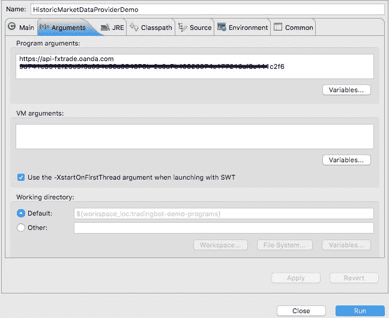 启动配置 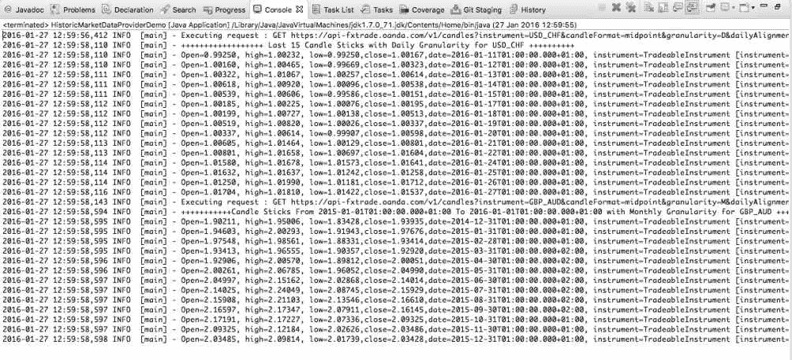 示例输出

```java
package com.precioustech.fxtrading.oanda.restapi.streaming.marketdata;

import org.apache.commons.lang3.tuple.ImmutablePair;
import org.apache.log4j.Logger;
import org.joda.time.DateTime;

import com.precioustech.fxtrading.instrument.TradeableInstrument;
import com.precioustech.fxtrading.marketdata.historic.CandleStickGranularity;
import com.precioustech.fxtrading.marketdata.historic.HistoricMarketDataProvider;
import com.precioustech.fxtrading.marketdata.historic.MovingAverageCalculationService;
import com.precioustech.fxtrading.oanda.restapi.marketdata.historic.OandaHistoricMarketDataProvider;

public class MovingAverageCalculationServiceDemo {

  private static final Logger LOG = Logger.getLogger(MovingAverageCalculationServiceDemo.class);

  private static void usage(String[] args) {
    if (args.length != 2) {
      LOG.error("使用方法: MovingAverageCalculationServiceDemo <url> <accesstoken>");
      System.exit(1);
    }
  }
```

```java
public static void main(String[] args) {
    usage(args);
    final String url = args[0];
    final String accessToken = args[1];
    HistoricMarketDataProvider<String> historicMarketDataProvider =
        new OandaHistoricMarketDataProvider(url, accessToken);
    MovingAverageCalculationService<String> movingAverageCalcService =
        new MovingAverageCalculationService<String>(historicMarketDataProvider);
    TradeableInstrument<String> eurnzd = new TradeableInstrument<String>("EUR_NZD");
    final int countIntervals = 30;
    ImmutablePair<Double, Double> eurnzdSmaAndWma = movingAverageCalcService.calculateSMAandWMAasPair(
        eurnzd, countIntervals, CandleStickGranularity.H1);

    LOG.info(
        String.format("SMA=%2.5f,WMA=%2.5f for instrument=%s,granularity=%s for the last %d intervals",
            eurnzdSmaAndWma.left, eurnzdSmaAndWma.right, eurnzd.getInstrument(),
            CandleStickGranularity.H1, countIntervals));
    DateTime from = new DateTime(1444003200000L); // 2015 年 10 月 5 日
    DateTime to = new DateTime(1453075200000L); // 2016 年 1 月 18 日

    TradeableInstrument<String> gbpchf = new TradeableInstrument<String>("GBP_CHF");
    ImmutablePair<Double, Double> gbpchfSmaAndWma =
        movingAverageCalcService.calculateSMAandWMAasPair(gbpchf,
            from, to, CandleStickGranularity.W);

    LOG.info(
        String.format("SMA=%2.5f,WMA=%2.5f for instrument=%s,granularity=%s from %s to %s",
            gbpchfSmaAndWma.left, gbpchfSmaAndWma.right, gbpchf.getInstrument(),
            CandleStickGranularity.W, from, to));
}
```

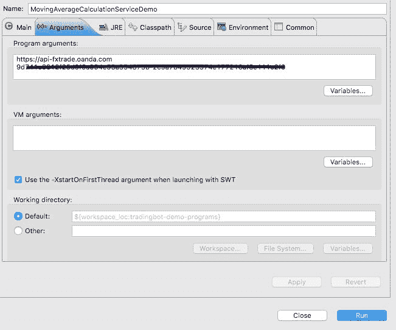 启动配置 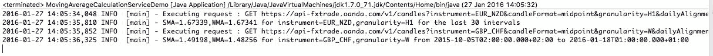 示例输出

## 6. 下达订单与交易

本章我们将把注意力转向整个交易过程中最有趣的部分——下达订单与交易。订单是一种交易意图。当一个人为某种证券下达订单时，他/她希望订单能被成交，并期待价格朝有利方向变动。当订单被完全或部分成交时，会形成一个交易头寸。一个活跃的交易头寸会使你处于未实现盈亏的状态。当该交易头寸被平仓时，未实现的盈亏变为实际盈亏，交易者的总账面金额随之增加或减少。

大多数订单可分为以下几类：

1.  **市价单**：市价单是一种旨在以平台上最佳可用价格（即期价格）立即成交的订单，前提是市场具有足够的流动性。

2.  **限价单**：限价单是指交易者自行设定买入或卖出证券的价格。本质上，这是一种*低于市价买入*或*高于市价卖出*的订单。例如，`EUR_USD` 当前交易价为 1.06，我们认为中期走势上涨的概率极高，但仍存在下行风险，那么我们可下一个限价单，比如当价格触及 1.04（我们认为是该货币对的底部）时买入 `EUR_USD`。

3.  **获利了结单**：获利了结单用于平掉一个已达到预设盈利水平的现有交易头寸。例如，假设我们下了一个市价单以 1.545 的价格卖出 `GBP_USD`。我们希望当价格朝有利方向变动至少 200 个点（即价格达到 1.525）时平仓。为了自动实现盈利，我们可以下一个获利了结单。

4.  **止损单**：止损单与获利了结单相反。它用于在价格不利变动、未平仓交易头寸价值缩水时限制损失。假设我们下了一个市价单以 1.07 的价格卖出 `EUR_CHF`。然而，我们希望当价格触及 1.085 时自动平仓，将损失限制在 150 个点内。这时止损单就非常有用。

**获利了结单**和**止损单**可归类为**限价单**的衍生类型。本质上，为了实现盈利或限制损失，我们是在下一个等待触发的订单，该订单会自动平掉一个交易头寸。这两种订单只有在存在一个未平仓交易头寸，且该头寸在订单触发时有被平仓风险时才有效。为此，交易头寸必须与订单类型相反。例如，我们必须持有一个证券的未平仓*买入*交易头寸，才能触发针对同一证券的**获利了结**/**止损** *卖出*订单。

其他可能遇到的订单类型如下：

- 追踪止损

- 立即成交否则取消

- 全部成交否则取消

### 6.1 `Order` POJO 定义

要下单，首先必须定义一个 POJO 来容纳所有必要的订单信息。在此之前，我们先快速浏览一下用于定义我们将支持的不同订单类型的枚举，以及定义订单买卖方向的枚举。

```
public enum OrderType {
 MARKET,
 LIMIT;
}

public enum TradingSignal {
 LONG,
 SHORT,
 NONE;

 public TradingSignal flip() {
  switch (this) {
   case LONG:
    return SHORT;
   case SHORT:
    return LONG;
   default:
    return this;
  }
 }
}
```

`OrderType` 枚举看起来相当直观。有人可能会问为什么我们没有**止损**或**止盈**订单类型。如前所述，这些订单类型是 `LIMIT` 订单的衍生形式，无需另行指定。当我们讨论下单机制时，这一点会更加清晰。我们使用 `TradingSignal` 枚举来表示订单的买卖方向。顾名思义，该枚举可以由策略函数返回，以指示我们必须买入或卖出某个证券。我们将在讨论一些示例交易策略时进一步探讨这一点。

代码清单 6.1：`Order` POJO 定义

```
/**
 * @param <M>
 *            `TradeableInstrument` 类中 `instrumentId` 的类型
 * @param <N>
 *            `orderId` 的类型
 * @see `TradeableInstrument`
 */
public class Order < M, N > {
 private final TradeableInstrument < M > instrument;
 private final long units;
 private final TradingSignal side;
 private final OrderType type;
 private final double takeProfit;
 private final double stopLoss;
 private N orderId;
 private final double price;

 /*
  * `orderId` 未包含在构造函数中，因为通常情况下，它只在订单成功提交后由平台分配。
  */
 public Order(TradeableInstrument < M > instrument, long units, TradingSignal side, OrderType type,
  double price) {
  this(instrument, units, side, type, 0.0, 0.0, price);
 }

 public Order(TradeableInstrument < M > instrument, long units, TradingSignal side, OrderType type) {
  this(instrument, units, side, type, 0.0, 0.0);
 }

 public Order(TradeableInstrument < M > instrument, long units, TradingSignal side, OrderType type,
  double takeProfit, double stopLoss) {
  this(instrument, units, side, type, takeProfit, stopLoss, 0.0);
 }

 public Order(TradeableInstrument < M > instrument, long units, TradingSignal side, OrderType type,
  double takeProfit, double stopLoss, double price) {
  this.instrument = instrument;
  this.units = units;
  this.side = side;
  this.type = type;
  this.takeProfit = takeProfit;
  this.stopLoss = stopLoss;
  this.price = price;
 }

 public N getOrderId() {
  return orderId;
 }

 public void setOrderId(N orderId) {
  this.orderId = orderId;
 }

 public double getStopLoss() {
  return stopLoss;
 }

 public double getPrice() {
  return price;
 }

 public TradeableInstrument < M > getInstrument() {
  return instrument;
 }

 public long getUnits() {
  return units;
 }

 public TradingSignal getSide() {
  return side;
 }

 public OrderType getType() {
  return type;
 }

 public double getTakeProfit() {
  return takeProfit;
 }

 @Override
 public String toString() {
  return "Order [instrument=" + instrument + ", units=" + units + ", side=" + side +
   ", type=" + type + ", takeProfit=" + takeProfit + ", stopLoss=" + stopLoss + ", orderId=" +
   orderId + ", price=" + price + "]";
 }
}
```

`Order` POJO 的定义非常简单。需要指出的是构造该 POJO 的几种方式。最简单的是使用仅包含必要信息的构造函数，例如 `instrument`、`units`、`side`、`type`。这是一个典型的提交普通市价单（无盈利目标或止损）的情况，平台应在最佳可用即期价格上立即执行该订单。另一方面，您可以指定其余属性 `takeProfit`、`stopLoss`、`price` 来提交限价单。另一个可能注意到的点是，在之前讨论的最简单的构造函数中，为 `takeProfit`、`stopLoss` 等属性分配了默认值 `0.0`。这是一个有争议的赋值，在某些平台上可能会出现问题，因为 `0.0` 可能不是未设置止损限制的可接受默认值。更倾向于采用的替代值可能是 `null`。如果是这种情况，则必须修改 POJO 定义，并将诸如 `double` 之类的原始类型替换为 `Double`。

### 6.2 `OrderManagementProvider` 接口

现在，我们将注意力转向定义提供者必须实现的接口，以提供一些有用的订单管理服务，例如下单和查询订单。这是我们将看到所有 CRUD 操作实际应用的少数几个提供者接口之一。让我们直接进入接口定义。

代码清单 6.2：`OrderManagementProvider` 接口

```
# 为金融工具订单提供 CRUD 操作的提供者

订单通常是针对特定金融工具和/或 `accountId` 提交的。如果平台提供者只允许单个账户，则可能不需要 `accountId`，在这种情况下，所有订单都在默认账户下创建。

```java
/**
 * 为金融工具订单提供 CRUD 操作的提供者。订单通常是针对特定金融工具和/或 accountId 提交的。
 * 如果平台提供者只允许单个账户，则可能不需要 accountId，在这种情况下，所有订单都在默认账户下创建。
 *
 * @param <M>
 *            orderId 的类型
 * @param <N>
 *            TradeableInstrument 类中 instrumentId 的类型
 * @param <K>
 *            accountId 的类型
 * @see TradeableInstrument
 */
public interface OrderManagementProvider < M, N, K > {

 /**
  * 订单通常为市价单或限价单类型。市价单由平台立即执行，而限价单仅在达到限价时执行。
  * 因此，对于限价单，此方法可能不会返回 orderId。
  *
  * @param order
  * @param accountId
  * @return 如果可能，返回一个有效的 orderId。
  */
  M placeOrder(Order < N, M > order, K accountId);

 /**
  * 修改给定订单的属性。平台可能只允许修改限价、止损、止盈、到期日期、单位等属性。
  *
  * @param order
  * @param accountId
  * @return 布尔值，指示操作是否成功。
  */
  boolean modifyOrder(Order < N, M > order, K accountId);

 /**
  * 如果订单正在等待执行，则有效取消订单。可能需要有效的 orderId 和可选的 accountId 来唯一标识要关闭/取消的订单。
  *
  * @param orderId
  * @param accountId
  * @return 布尔值，指示操作是否成功。
  */
  boolean closeOrder(M orderId, K accountId);

 /**
  *
  * @return 所有账户中所有待处理订单的集合
  */
  Collection < Order < N,
  M >> allPendingOrders();

 /**
  *
  * @param accountId
  * @return 给定 accountId 的所有待处理订单的集合。
  */
  Collection < Order < N,
  M >> pendingOrdersForAccount(K accountId);

 /**
  *
  * @param orderId
  * @param accountId
  * @return 由 orderId 和可选的 accountId 唯一标识的订单
  */
  Order < N,
  M > pendingOrderForAccount(M orderId, K accountId);

 /**
  *
  * @param instrument
  * @return 所有账户中给定金融工具的所有待处理订单的集合
  */
  Collection < Order < N,
  M >> pendingOrdersForInstrument(TradeableInstrument < N > instrument);
}
```

如上所示，我们的提供者接口提供了丰富的功能集来管理订单。由于接口方法都是自解释的，让我们直接进入具体实现将是什么样子。

## 6.3 `OrderManagementProvider` 的具体实现

现在进入最有趣的部分，我们将深入探讨实现细节，并讨论如何实现一个 OANDA 提供商。由于我们即将实现完整的 CRUD 操作集，因此还需要熟悉与这些操作等效的 REST 动词。我们已经知道 HTTP 的 `GET` 等同于 `R`（读取）。那么剩下的 `C`、`U` 和 `D` 又对应什么呢？下表总结了用于执行这些操作的 HTTP 动词。

| 操作 | HTTP 动词 |
| --- | --- |
| 创建新订单 [C] | POST |
| 查询订单详情 [R] | GET |
| 更新现有订单 [U] | PATCH |
| 关闭待处理订单 [D] | DELETE |

有了这些信息，我们先看看类的定义，包括构造函数和所需的 JSON 键。我们需要提供一个 `AccountProvider` 依赖，并将在构造函数中传入。在 OANDA 中，订单 ID 是 `Long` 类型。因此，用 `Long` 替代账户 ID，用 `String` 替代金融工具 ID，我们得到以下定义：

```java
import static com.precioustech.fxtrading.oanda.restapi.OandaJsonKeys.expiry;
import static com.precioustech.fxtrading.oanda.restapi.OandaJsonKeys.id;
import static com.precioustech.fxtrading.oanda.restapi.OandaJsonKeys.instrument;
import static com.precioustech.fxtrading.oanda.restapi.OandaJsonKeys.orderOpened;
import static com.precioustech.fxtrading.oanda.restapi.OandaJsonKeys.price;
import static com.precioustech.fxtrading.oanda.restapi.OandaJsonKeys.side;
import static com.precioustech.fxtrading.oanda.restapi.OandaJsonKeys.stopLoss;
import static com.precioustech.fxtrading.oanda.restapi.OandaJsonKeys.takeProfit;
import static com.precioustech.fxtrading.oanda.restapi.OandaJsonKeys.tradeOpened;
import static com.precioustech.fxtrading.oanda.restapi.OandaJsonKeys.type;
import static com.precioustech.fxtrading.oanda.restapi.OandaJsonKeys.units;

public class OandaOrderManagementProvider implements OrderManagementProvider<Long, String, Long> {

	private final String url;
	private final BasicHeader authHeader;
	private final AccountDataProvider<Long> accountDataProvider;

	public OandaOrderManagementProvider(String url, String accessToken,
	AccountDataProvider<Long> accountDataProvider) {
		this.url = url; // OANDA REST 服务的基础 URL
		this.authHeader = OandaUtils.createAuthHeader(accessToken);
		this.accountDataProvider = accountDataProvider;
	}
```

现在，我们先编写下新订单的方法。要成功下单，我们至少需要提供最基本的订单信息（使用 `Order` POJO 中最精简的构造函数）和一个有效的账户 ID。我们先看看创建 HTTP POST 命令的函数，该函数稍后将在 `placeOrder` 函数中使用。
```

```
private static final String ordersResource = "/orders";

HttpPost createPostCommand(Order<String, Long> order, Long accountId) throws Exception {
    HttpPost httpPost = new HttpPost(
        this.url + OandaConstants.ACCOUNTS_RESOURCE +
        TradingConstants.FWD_SLASH + accountId + ordersResource);
    httpPost.setHeader(this.authHeader);
    List<NameValuePair> params = Lists.newArrayList();
    // 对价格、止损价、获利价进行适当的四舍五入。OANDA 会拒绝 0.960000001 这样的值。
    params.add(new BasicNameValuePair(instrument, order.getInstrument().getInstrument()));
    params.add(new BasicNameValuePair(side, OandaUtils.toSide(order.getSide())));
    params.add(new BasicNameValuePair(type, OandaUtils.toType(order.getType())));
    params.add(new BasicNameValuePair(units, String.valueOf(order.getUnits())));
    params.add(new BasicNameValuePair(takeProfit, String.valueOf(order.getTakeProfit())));
    params.add(new BasicNameValuePair(stopLoss, String.valueOf(order.getStopLoss())));
    if (order.getType() == OrderType.LIMIT && order.getPrice() != 0.0) {
        DateTime now = DateTime.now();
        DateTime nowplus4hrs = now.plusHours(4);
        String dateStr = nowplus4hrs.toString();
        params.add(new BasicNameValuePair(price, String.valueOf(order.getPrice())));
        params.add(new BasicNameValuePair(expiry, dateStr));
    }
    httpPost.setEntity(new UrlEncodedFormEntity(params));
    return httpPost;
}
```

我们首先创建一个`HttpPost`对象的实例，并将 URL 传入其构造函数。例如，对于有效的账户 ID 123456，其 URL 如下所示：

```
https://api-fxtrade.oanda.com/v1/accounts/123456/orders
```

现在我们有了`HttpPost`对象的实例，接下来必须创建一个`NameValuePair`对象的列表。每个`NameValuePair`定义了订单的一个属性，例如价格。我们使用`Order` POJO 来定义所有订单属性。对于`LIMIT`订单，我们必须指定一个限价。如果我们不提供此价格，订单将被平台拒绝。因此，我们引入了一个针对限价订单的特殊检查，以确保我们有一个有效的价格。在定义价格的同时，我们还要快速为订单添加一个 4 小时的到期时间。这意味着如果未达到限价，该订单将在平台上自动过期。一旦通过`NameValuePair`对象列表定义了所有此类订单属性，我们将这些参数/属性封装在一个`UrlEncodedFormEntity`中，并将其设置到我们的`HttpPost`对象实例上。建议始终对 URL 参数进行编码。现在，我们已经准备好将这些参数`POST`到平台。为此，我们回到`placeOrder`方法的代码。

```java
@Override
public Long placeOrder(Order<String, Long> order, Long accountId) {
    CloseableHttpClient httpClient = getHttpClient();
    try {
        HttpPost httpPost = createPostCommand(order, accountId);
        LOG.info(TradingUtils.executingRequestMsg(httpPost));
        HttpResponse resp = httpClient.execute(httpPost);
        if (resp.getStatusLine().getStatusCode() == HttpStatus.SC_OK || resp.getStatusLine().getStatusCode() == HttpStatus.SC_CREATED) {
            if (resp.getEntity() != null) {
                String strResp = TradingUtils.responseToString(resp);
                Object o = JSONValue.parse(strResp);
                JSONObject orderResponse;
                if (order.getType() == OrderType.MARKET) {
                    orderResponse = (JSONObject)((JSONObject) o).get(tradeOpened);
                } else {
                    orderResponse = (JSONObject)((JSONObject) o).get(orderOpened);
                }
                Long orderId = (Long) orderResponse.get(OandaJsonKeys.id);
                LOG.info("Order executed->" + strResp);
                return orderId;
            } else {
                return null;
            }
        } else {
            LOG.info("Order not executed. http code=" +
                resp.getStatusLine().getStatusCode());
            return null;
        }
    } catch (Exception e) {
        LOG.warn(e);
        return null;
    } finally {
        TradingUtils.closeSilently(httpClient);
    }
}
```

如前所述，一旦我们拥有了一个`HttpPost`对象的实例，并将其中的所有订单属性设置为`NameValuePair`对象，就可以将其发布到平台了。一个成功的市价单发布会返回类似如下的响应：

```json
{
    "instrument" : "EUR_JPY",
    "time" : "2015-05-26T16:08:51.000000Z",
    "price" : 133.819,
    "tradeOpened" : {
        "id" : 1856110003,
        "units" : 3000,
        "side" : "sell",
        "takeProfit" : 132.819,
        "stopLoss" : 134.9,
        "trailingStop" : 0
    },
    "tradesClosed" : [],
    "tradeReduced" : {}
}
```

而一个成功的限价单会返回类似如下的内容：

```
{
    "instrument" : "EUR_USD",
    "time" : "2015-12-02T06:47:51.000000Z",
    "price" : 1.1,
    "orderOpened" : {
        "id" : 12211080075,
        "units" : 10,
        "side" : "sell",
        "takeProfit" : 1.09,
        "stopLoss" : 1.13,
        "expiry" : "2015-12-02T11:47:39.000000Z",
        "upperBound" : 0,
        "lowerBound" : 0,
        "trailingStop" : 0
    }
}
```

市价单的一个特点是，如果被全部或部分成交，它会导致一个持仓或交易的开立。相反，限价单会导致一个订单的创建，该订单在价格达到触发条件时准备被执行。因此，我们需要根据最初提交给平台的订单类型，对响应的 JSON 进行略有不同的解读。对于市价单，我们解析`tradeOpened`元素以获取订单 ID；而对于限价单，我们解析`orderOpened`元素。除此之外，该方法中没有其他重要内容了。

现在让我们将注意力转向`modifyOrder`。我们只能修改现有的限价单，因为根据上述讨论，只有限价单会创建一个新的待处理订单。另一方面，市价单会直接产生一笔交易。在查看代码之前，我们需要理解，对于待处理订单，只有某些属性可以被修改。它们是：

- `units`（单位）
- `takeProfit`（止盈）
- `stopLoss`（止损）
- `price`（价格）

我们需要一个由`placeOrder`返回的有效订单 ID，以及一个账户 ID 来实际执行修改。像往常一样，我们首先专注于创建实际的`HttpPatch`命令，该命令将促进平台上的修改操作。

```java
String orderForAccountUrl(Long accountId, Long orderId) {
    return this.url + OandaConstants.ACCOUNTS_RESOURCE + TradingConstants.FWD_SLASH + accountId +
        ordersResource + TradingConstants.FWD_SLASH + orderId;
}

HttpPatch createPatchCommand(Order<String, Long> order, Long accountId) throws Exception {
    HttpPatch httpPatch = new HttpPatch(orderForAccountUrl(accountId, order.getOrderId()));
    httpPatch.setHeader(this.authHeader);
    List<NameValuePair> params = Lists.newArrayList();
    params.add(new BasicNameValuePair(takeProfit, String.valueOf(order.getTakeProfit())));
    params.add(new BasicNameValuePair(stopLoss, String.valueOf(order.getStopLoss())));
    params.add(new BasicNameValuePair(units, String.valueOf(order.getUnits())));
    params.add(new BasicNameValuePair(price, String.valueOf(order.getPrice())));
    httpPatch.setEntity(new UrlEncodedFormEntity(params));
    return httpPatch;
}
```

创建 patch 命令与我们之前看到的创建 post 命令非常相似。我们创建一个`NameValuePair`对象列表，并从 JSON 键/Order POJO 中设置名称/值对，但仅限于那些我们被允许为待处理订单更改的属性。我们还引入了一个函数来计算修改订单的 URL 以及其他与订单相关的服务，这些我们很快就会看到并在其他地方使用。对于账户 ID 123456 和订单 234567，该函数将计算出：

```
https://api-fxtrade.oanda.com/v1/accounts/123456/orders/234567
```

现在，我们将注意力转回`modifyOrder`，它看起来是这样的：

```java
@Override
public boolean modifyOrder(Order<String, Long> order, Long accountId) {
    CloseableHttpClient httpClient = getHttpClient();
    try {
        HttpPatch httpPatch = createPatchCommand(order, accountId);
        LOG.info(TradingUtils.executingRequestMsg(httpPatch));
        HttpResponse resp = httpClient.execute(httpPatch);
        if (resp.getStatusLine().getStatusCode() == HttpStatus.SC_OK &&
            resp.getEntity() != null) {
            LOG.info("Order Modified->" + TradingUtils.responseToString(resp));
            return true;
        }
        LOG.warn(String.format("order %s could not be modified.",
            order.toString()));
    } catch (Exception e) {
        LOG.error(e);
    } finally {
        TradingUtils.closeSilently(httpClient);
    }
    return false;
}
```

代码看起来相当直接。一旦我们成功创建了一个设置了所有值的`HttpPatch`实例，就将其发布到平台。如果订单被成功修改，它会在头部返回 HTTP 代码 200，并在响应中返回已修改订单的状态。收到代码 200 后，我们返回`true`表示修改成功，否则返回`false`。

```
##header
HTTP/1.1 200 OK
Server: nginx/1.2.9
Content-Type: application/json
Content-Length: 284
```

```
##response body
{
    "id": 1001,
    "instrument": "USD_JPY",
    "units": 125,
    "side": "sell",
    "type": "limit",
    "time": "2015-09-22T00:00:00Z",
    "price": 122.15,
    "takeProfit": 119.25,
    "stopLoss": 125.00,
    "expiry": "2015-09-25T00:00:00Z",
    "upperBound": 0,
    "lowerBound": 0,
    "trailingStop": 0
}
```

接下来要详细说明的是`closeOrder`。要删除或关闭一个订单，只需向`orderForAccountUrl`函数返回的 URL 发送一个`HttpDelete`命令即可。执行此操作的代码如下：

```
@Override
public boolean closeOrder(Long orderId, Long accountId) {
    CloseableHttpClient httpClient = getHttpClient();
    try {
        HttpDelete httpDelete = new HttpDelete(orderForAccountUrl(accountId, orderId));
        httpDelete.setHeader(authHeader);
        LOG.info(TradingUtils.executingRequestMsg(httpDelete));
        HttpResponse resp = httpClient.execute(httpDelete);
        if (resp.getStatusLine().getStatusCode() == HttpStatus.SC_OK) {
            LOG.info(String.format("Order %d successfully deleted for account %d", orderId, accountId));
            return true;
        } else {
            LOG.warn(String.format(
                "Order %d could not be deleted. Recd error code %d", orderId, resp
                .getStatusLine().getStatusCode()));
        }
    } catch (Exception e) {
        LOG.warn("error deleting order id:" + orderId, e);
    } finally {
        TradingUtils.closeSilently(httpClient);
    }
    return false;
}
```

如果订单 ID 及其所属的账户 ID 都有效，那么在成功删除订单后，我们应该会在头部看到一个 HTTP 200 返回。

```
HTTP/1.1 200 OK
Content-Type: application/json
Content-Length: 127
```

现在，我们把注意力转向其余方法的实现，它们都是订单查询方法，并使用传统的`HttpGet`来获取订单相关信息。让我们直接进入第一个方法`pendingOrdersForAccount`。此方法返回一个待处理订单的集合，这些订单随时准备在价格达到时被成交。

```
@Override
public Collection<Order<String, Long>> pendingOrdersForAccount(Long accountId) {
    return this.pendingOrdersForAccount(accountId, null);
}
```

```java
private Collection<Order<String, Long>> pendingOrdersForAccount(Long accountId,
  TradeableInstrument<String> instrument) {
  Collection<Order<String, Long>> pendingOrders = Lists.newArrayList();
  CloseableHttpClient httpClient = getHttpClient();
  try {
   HttpUriRequest httpGet = new HttpGet(this.url +
    OandaConstants.ACCOUNTS_RESOURCE + TradingConstants.FWD_SLASH + accountId + ordersResource + (instrument != null ? "?\
 instrument=" + instrument.getInstrument() :
     StringUtils.EMPTY));
   httpGet.setHeader(this.authHeader);
   httpGet.setHeader(OandaConstants.UNIX_DATETIME_HEADER);
   LOG.info(TradingUtils.executingRequestMsg(httpGet));
   HttpResponse resp = httpClient.execute(httpGet);
   String strResp = TradingUtils.responseToString(resp);
   if (strResp != StringUtils.EMPTY) {
    Object obj = JSONValue.parse(strResp);
    JSONObject jsonResp = (JSONObject) obj;
    JSONArray accountOrders = (JSONArray) jsonResp.get(orders);

    for (Object o: accountOrders) {
     JSONObject order = (JSONObject) o;
     Order<String, Long> pendingOrder = parseOrder(order);
     pendingOrders.add(pendingOrder);
    }
   } else {
    TradingUtils.printErrorMsg(resp);
   }
  } catch (Exception e) {
   LOG.error(e);
  } finally {
   TradingUtils.closeSilently(httpClient);
  }
  return pendingOrders;
 }
```

公共方法委托给一个内部私有方法，该方法用于检索某个账户的挂单，并在提供交易产品参数时进行可选过滤。由于我们需要获取所有交易产品的订单，因此向该方法传递 `null` 作为交易产品参数。我们来仔细看看生成包含或不包含交易产品值的 URL 的代码。

```
this.url + OandaConstants.ACCOUNTS_RESOURCE + TradingConstants.FWD_SLASH + accountId
+ ordersResource + (instrument != null ? "?instrument="
+ instrument.getInstrument() : StringUtils.EMPTY
```

如果 `instrument` 为 `null`，则账户 ID `123456` 的输出结果为：

```
https://api-fxtrade.oanda.com/v1/accounts/123456/orders
```

但如果传入交易产品 `EUR_USD`，我们会得到结果：

```
https://api-fxtrade.oanda.com/v1/accounts/123456/orders?instrument=EUR_USD
```

当我们请求所有订单时，返回的示例 JSON 如下：

```json
{
  "orders": [
    {
      "id": 1001,
      "instrument": "USD_CAD",
      "units": 100,
      "side": "buy",
      "type": "marketIfTouched",
      "time": "1444116207000000",
      "price": 1.3,
      "takeProfit": 1.31,
      "stopLoss": 1.2,
      "expiry": "1444721003000000",
      "upperBound": 0,
      "lowerBound": 0,
      "trailingStop": 0
    },
    {
      "id": 1002,
      "instrument": "EUR_USD",
      "units": 150,
      "side": "buy",
      "type": "marketIfTouched",
      "time": "1444108460000000",
      "price": 1.115,
      "takeProfit": 0,
      "stopLoss": 0,
      "expiry": "1444713259000000",
      "upperBound": 0,
      "lowerBound": 0,
      "trailingStop": 0
    }
  ]
}
```

剩下的工作就是将这个响应解析为订单集合，这也是该方法约定要返回的内容。`parseOrder` 私有方法会为我们处理 JSON 订单数组中的每个订单元素。

```java
private Order<String, Long> parseOrder(JSONObject order) {
  final String orderInstrument = (String) order.get(instrument);
  final Long orderUnits = (Long) order.get(units);
  final TradingSignal orderSide = OandaUtils.toTradingSignal((String) order.get(side));
  final OrderType orderType = OandaUtils.toOrderType((String) order.get(type));
  final double orderTakeProfit = ((Number) order.get(takeProfit)).doubleValue();
  final double orderStopLoss = ((Number) order.get(stopLoss)).doubleValue();
  final double orderPrice = ((Number) order.get(price)).doubleValue();
  final Long orderId = (Long) order.get(id);
  Order<String, Long> pendingOrder = new Order<String, Long>(
   new TradeableInstrument<String>(orderInstrument), orderUnits, orderSide, orderType,
   orderTakeProfit, orderStopLoss, orderPrice);
  pendingOrder.setOrderId(orderId);
  return pendingOrder;
}
```

接下来我们要关注的方法是 `pendingOrdersForInstrument`。该方法的职责是查找所有账户中给定交易产品的所有订单。我们已经看到有一个私有方法，它可以返回给定账户的所有订单，如果提供了交易产品参数，则进行过滤。因此，我们只需要获取交易账户持有的所有账户列表，然后遍历每个账户，调用这个内部方法来检索所有订单。下面的代码基本描述了这一过程：

```java
@Override
public Collection<Order<String, Long>> pendingOrdersForInstrument(TradeableInstrument<String> instrument) {
  Collection<Account<Long>> accounts = this.accountDataProvider.getLatestAccountInfo();
  Collection<Order<String, Long>> allOrders = Lists.newArrayList();
  for (Account<Long> account: accounts) {
   allOrders.addAll(this.pendingOrdersForAccount(account.getAccountId(), instrument));
  }
  return allOrders;
}
```

上述实现为 `allPendingOrders` 方法的非常直接的实现铺平了道路：

```java
@Override
public Collection<Order<String, Long>> allPendingOrders() {
    return pendingOrdersForInstrument(null);
}
```

我们还需要描述的最后一个方法是 `pendingOrderForAccount`。该方法用于检索给定账户的单个订单，前提是我们提供了精确的订单 ID。该方法调用 `orderForAccountUrl` 来获取请求信息的 URL。之前我们在尝试使用 `HttpPatch` 修改现有订单时调用过该方法。这次我们只需要使用不同的 HTTP 动词 `HttpGet`，从相同的 URL 检索订单信息。一个示例 JSON 响应如下：

```json
{
    "id": 1001,
    "instrument": "USD_JPY",
    "units": 125,
    "side": "sell",
    "type": "marketIfTouched",
    "time": "1444116207000000",
    "price": 122.15,
    "takeProfit": 119.25,
    "stopLoss": 125.00,
    "expiry": "1444721003000000",
    "upperBound": 0,
    "lowerBound": 0,
    "trailingStop": 0
}
```

启动这种响应的代码如下：

```java
@Override
public Order<String, Long> pendingOrderForAccount(Long orderId, Long accountId) {
  CloseableHttpClient httpClient = getHttpClient();
  try {
   HttpUriRequest httpGet = new HttpGet(orderForAccountUrl(accountId,
    orderId));
   httpGet.setHeader(this.authHeader);
   httpGet.setHeader(OandaConstants.UNIX_DATETIME_HEADER);
   LOG.info(TradingUtils.executingRequestMsg(httpGet));
   HttpResponse resp = httpClient.execute(httpGet);
   String strResp = TradingUtils.responseToString(resp);
   if (strResp != StringUtils.EMPTY) {
    JSONObject order = (JSONObject) JSONValue.parse(strResp);
    return parseOrder(order);
   } else {
    TradingUtils.printErrorMsg(resp);
   }
  } catch (Exception e) {
   LOG.error(e);
  } finally {
   TradingUtils.closeSilently(httpClient);
  }
  return null;
}
```

至此，我们结束了对提供者 `OandaOrderManagementProvider` 为订单管理服务提供的所有方法的讨论。

### 6.4 一个简单的 `OrderInfoService`

遵循将提供者方法封装在服务背后的主题，我们需要编写一个 `OrderInfoService`，它封装了 `OrderManagementProvider` 的所有只读方法。这个服务相当直观，代码如下：

```java
public class OrderInfoService<M, N, K> {

    private final OrderManagementProvider<M, N, K> orderManagementProvider;

    public OrderInfoService(OrderManagementProvider<M, N, K> orderManagementProvider) {
        this.orderManagementProvider = orderManagementProvider;
    }

    public Collection<Order<N, M>> allPendingOrders() {
        return this.orderManagementProvider.allPendingOrders();
    }

    public Collection<Order<N, M>> pendingOrdersForAccount(K accountId) {
        return this.orderManagementProvider.pendingOrdersForAccount(accountId);
    }

    public Collection<Order<N, M>> pendingOrdersForInstrument(TradeableInstrument<N> instrument) {
        return this.orderManagementProvider.pendingOrdersForInstrument(instrument);
    }

    public Order<N, M> pendingOrderForAccount(M orderId, K accountId) {
        return this.orderManagementProvider.pendingOrderForAccount(orderId, accountId);
    }

    public int findNetPositionCountForCurrency(String currency) {
        Collection<Order<N, M>> allOrders = allPendingOrders();
        int positionCount = 0;
        for (Order<N, M> order : allOrders) {
            positionCount += TradingUtils.getSign(order.getInstrument().getInstrument(),
                    order.getSide(), currency);
        }
        return positionCount;
    }
}
```

除了 `findNetPositionCountForCurrency` 方法之外，所有方法都委托给底层的 `OrderManagementProvider` 来获取所需信息。因此，剩下需要讨论的就是 `findNetPositionCountForCurrency` 方法。仔细查看该方法代码，它会请求所有账户中的全部挂单，并通过查看 `TradingUtils.getSign` 方法返回的符号（-1 或 +1）来计算某个货币的净头寸。提醒一下，如果我们卖出给定货币，该方法返回 -1；如果买入则返回 +1。例如，如果我们通过下达限价单卖出 `EUR_CHF` 货币对，传入货币 `EUR` 会返回 -1，而传入 `CHF` 则返回 +1。

`findNetPositionCountForCurrency` 方法的用途可能不是一目了然。然而，从风险管理的角度来看，了解我们在某种货币上是多头还是空头以及仓位大小是相当有用的，我们将在后续章节中讨论这一点。

### 6.5 执行前验证订单：`PreOrderValidationService`

在讨论封装订单执行、修改和删除部分的服务之前，我们先讨论一个重要的服务，它负责执行一些订单执行前的检查，只有这些检查通过，订单才会被执行。同样，这纯粹是从风险管理的角度出发，如果确实需要，也可以绕过。我们将在后续章节讨论为什么拥有风险管理控制措施非常重要，尤其是对于高杠杆账户。不过，为了我们的讨论，我提出了一些必须执行的规则或检查，以便为订单执行开绿灯。这套检查可能并非适用于所有情况，但关键在于，在下单之前，我们必须事先进行一些尽职调查。我提出的规则如下：

1.  某种货币的净多头或净空头仓位不得超过给定水平。也就是说，例如对于 `AUD`，我们既可以持有空头头寸也可以持有多头头寸，但如果存在净多头或净空头头寸，其数量不得超过一个可配置的数字，比如 4。因此，如果我们已经持有 4 笔未平仓交易，例如做多 `AUD_USD`、做多 `AUD_CHF`、做空 `GBP_AUD`、做空 `EUR_AUD`，这意味着我们在 `AUD` 上的仓位已经很重，任何进一步做多 `AUD` 的订单都必须被拒绝。例如，如果一个策略建议下达市价单做多 `AUD_JPY`，该订单必须被拒绝，因为我们的要求是不超过最大多头或空头仓位水平，在我们的例子中为 4。

2.  如果某个货币对的 10 年加权移动平均线 (`WMA`) 在其历史高点或低点的 `x%` 范围内，则不交易该货币对。这需要一点解释。假设 `EUR_USD` 的 10 年 `WMA` 是 1.3，而当前即期价格是 1.08。此时我们会非常不情愿下做空 `EUR_USD` 的订单。因为根据我们的规则，我们只能做空至 10 年 `WMA` 的 10%（假设 `x=10`）以内。因此，从 1.3 中减去 1.3 的 10% 得到 1.17。所以，如果价格跌破当前水平，我们的检查将不允许下做空 `EUR_USD` 的订单。类似地，如果当前价格是 1.45（大于 1.3 + 1.3 的 10% = 1.43），我们不会做多 `EUR_USD`。

3.  如果某个货币对的现有交易已经活跃，我们不想下达订单。这是为了确保我们不会通过下达相反方向的订单意外平仓/减少现有交易头寸，或者为了加倍仓位而增加现有头寸。

当然，这些规则可能不完全合理，甚至可能与你成功的策略建议相悖，但关键在于要有一些预验证规则，以免不必要地增加投资组合的风险。当然，你完全可以完全摒弃这些规则并编写自己的规则，但只要拥有一套有意义的规则/检查集，从长远来看它们总会对你有帮助。

现在，让我们直接进入代码，这些代码尝试在服务中对这些规则进行编程。我们首先定义构造函数，它接受该服务的所有依赖项。

```java
public class PreOrderValidationService<M, N, K> {
    private final TradeInfoService<M, N, K> tradeInfoService;
    private final MovingAverageCalculationService<N> movingAverageCalculationService;
    private final BaseTradingConfig baseTradingConfig;
    private final OrderInfoService<M, N, K> orderInfoService;
    static final int TEN_YRS_IN_MTHS = 120;

    public PreOrderValidationService(TradeInfoService<M, N, K> tradeInfoService,
            MovingAverageCalculationService<N> movingAverageCalculationService,
            BaseTradingConfig baseTradingConfig,
            OrderInfoService<M, N, K> orderInfoService) {
        this.tradeInfoService = tradeInfoService;
        this.movingAverageCalculationService = movingAverageCalculationService;
        this.baseTradingConfig = baseTradingConfig;
        this.orderInfoService = orderInfoService;
    }
}
```

`TradeInfoService` 是本章后续会介绍的内容。用于获取各种交易相关信息的方法在当前上下文中不言自明，但将在后续详细阐述。其余内容我相信可以从我们对验证规则的讨论中自然推导出来。`MovingAverageCalculationService` 用于计算 WMA，`BaseTradingConfig` 用于各种配置参数（如货币允许的最大净头寸），`OrderInfoService` 用于获取待处理订单等信息。

现在我们来看第一个验证检查的服务方法代码：

```java
public boolean checkLimitsForCcy(TradeableInstrument<N> instrument, TradingSignal signal) {
    String currencies[] = TradingUtils.splitInstrumentPair(instrument.getInstrument());
    for (String currency : currencies) {
        int positionCount =
            this.tradeInfoService.findNetPositionCountForCurrency(currency) +
            this.orderInfoService.findNetPositionCountForCurrency(currency);
        int sign = TradingUtils.getSign(instrument.getInstrument(), signal, currency);
        int newPositionCount = positionCount + sign;
        if (Math.abs(newPositionCount) >
            this.baseTradingConfig.getMaxAllowedNetContracts() && Integer.signum(sign) == Integer.signum(positionCount)) {
            LOG.warn(String.format(
                "Cannot place trade %s because max limit exceeded. max allowed=%d and current net positions=%d for currency %s",
                instrument,
                this.baseTradingConfig.getMaxAllowedNetContracts(),
                newPositionCount, currency));
            return false;
        }
    }
    return true;
}
```

该方法在检查失败时返回 `false`，否则返回 `true`。该方法首先将货币对拆分为单个货币，然后针对每个货币获取当前状态（即所有未平仓交易头寸和待处理订单的总和）。我们称之为当前头寸计数。例如，如果我们有 4 个 CHF 空头交易头寸和 1 个买入 CHF 的待处理订单，则净头寸计数为 -3（请记住，负数表示空头头寸）。因此，如果我们想下的新市价单是买入 `USD_CHF`，则 `TradingUtils.getSign` 对 CHF 会返回 -1。如果继续执行该订单，这会使我们做空 CHF 的头寸增加到 4。现在，检查的评估发生在代码的这一部分：

```java
if (Math.abs(newPositionCount) >
    this.baseTradingConfig.getMaxAllowedNetContracts() &&
    Integer.signum(sign) == Integer.signum(positionCount)) {
```

如果每个货币允许的最大净合约数配置为 4，那么我们仍然可以下达此市价单，因为新的头寸计数将使其达到允许的最大水平。由于我们在 `if` 语句中实际比较的是绝对值，因此还必须添加符号检查，以确保未来的头寸计数与 `TradingUtils.getSign` 返回的符号相同。

现在我们来看第二个验证检查的服务方法代码：

```java
public boolean isInSafeZone(TradingSignal signal, double price, TradeableInstrument<N> instrument) {
    double wma10yr = this.movingAverageCalculationService.calculateWMA(
        instrument, TEN_YRS_IN_MTHS,
        CandleStickGranularity.M);
    final double max10yrWmaOffset = baseTradingConfig.getMax10yrWmaOffset();
    double minPrice = (1.0 - max10yrWmaOffset) * wma10yr;
    double maxPrice = (1.0 + max10yrWmaOffset) * wma10yr;
    if ((signal == TradingSignal.SHORT && price > minPrice) || (signal == TradingSignal.LONG && price < maxPrice)) {
        return true;
    } else {
        LOG.info(String.format(
            "Rejecting %s %s because price %2.5f is 10pct on either side of wma 10yr price of %2.5f",
            signal, instrument, price, wma10yr));
        return false;
    }
}
```

我们首先通过传入月度粒度作为参数来计算该工具的 10 年 WMA。`movingAverageCalculationService.calculateWMA` 返回的值是我们安全区计算的基础。假设 `getMax10yrWmaOffset` 的值配置为 0.1（10%），那么我们的安全区就是该值两侧各 10% 的范围。这意味着，只有当价格相对于此值的跌幅小于或等于 10% 时，我们才愿意下空单。同样地，只有当价格涨幅小于或等于 10% 时，我们才愿意下多单。由于此值是可配置的，因此我们可以随时扩大安全区。

现在我们来看列表中最后一个验证检查的方法代码：

```java
public boolean checkInstrumentNotAlreadyTraded(TradeableInstrument<N> instrument) {
    Collection<K> accIds = this.tradeInfoService.findAllAccountsWithInstrumentTrades(instrument);
    if (accIds.size() > 0) {
        LOG.warn(String.format("Trade with instrument %s as one already exists", instrument));
        return false;
    } else {
        Collection<Order<N, M>> pendingOrders = this.orderInfoService.pendingOrdersForInstrument(instrument);
        if (!pendingOrders.isEmpty()) {
            LOG.warn(String.format("Pending order with instrument %s already exists", instrument));
            return false;
        }
        return true;
    }
}
```

该方法首先调用 `TradeInfoService` 检查是否存在任何持有该工具未平仓交易头寸的账户。如果存在，则直接退出方法并返回 `false`。但是，如果不存在此类账户，我们将检查是否存在针对该工具的待处理订单。如果发现任何待处理订单，则再次从方法返回 `false`，否则返回 `true`。至此，我们结束了关于预验证订单服务的讨论。下一步自然是进入在一切检查通过后实际下达这些订单的服务。在结束之前，我想重申的是，尽管其中一些验证检查从全局来看或许并非绝对必要，但至少我们都同意，在完全确定需要下订单之前，必须进行一系列检查。

### 6.6 整合至 `OrderExecutionService`

我们将深入探讨 `OrderExecutionService` 来结束关于订单管理服务的讨论。该服务的设计基于一个队列，订单从中被取出，并在所有检查通过后发送至交易平台。其思路是，通过我们的各种策略（可能还包括其他服务），我们能够简单地将订单放入队列，其余工作由此服务负责处理——它持续监听该队列以获取新订单。通过这种方式，我们将做出下单决策（基于我们策略建议的交易信号）这一行为与执行下单的机械过程解耦。让我们先来看一下它的构造函数及其所依赖的各项服务。

```java
public class OrderExecutionService < M, N, K > implements Runnable {

  private static final Logger LOG = Logger.getLogger(OrderExecutionService.class);

  private final BlockingQueue < TradingDecision < N >> orderQueue;
  private final AccountInfoService < K, N > accountInfoService;
  private final OrderManagementProvider < M, N, K > orderManagementProvider;
  private final BaseTradingConfig baseTradingConfig;
  private final PreOrderValidationService < M, N, K > preOrderValidationService;
  private final CurrentPriceInfoProvider < N > currentPriceInfoProvider;
  private volatile boolean serviceUp = true;
  Thread orderExecThread;

  public OrderExecutionService(BlockingQueue < TradingDecision < N >> orderQueue,
   AccountInfoService < K, N > accountInfoService,
   OrderManagementProvider < M, N, K >
   orderManagementProvider, BaseTradingConfig baseTradingConfig,
   PreOrderValidationService < M, N, K > preOrderValidationService,
   CurrentPriceInfoProvider < N > currentPriceInfoProvider) {
   this.orderQueue = orderQueue;
   this.accountInfoService = accountInfoService;
   this.orderManagementProvider = orderManagementProvider;
   this.baseTradingConfig = baseTradingConfig;
   this.preOrderValidationService = preOrderValidationService;
   this.currentPriceInfoProvider = currentPriceInfoProvider;
  }
  @PostConstruct
  public void init() {
   orderExecThread = new Thread(this, this.getClass().getSimpleName());
   orderExecThread.start();
  }
```

我们首先注意到该服务实现了 `Runnable` 接口，这意味着它将生成一个线程来持续监控订单队列。该线程在 `init` 方法中初始化，`init` 方法在应用上下文初始化后由 Spring 等依赖注入框架自动调用（由于 `@PostConstruct` 注解），如果不使用此类框架，则需要显式调用。在我们的线程中，我们持续监控订单队列以获取新订单。一旦从队列接收到订单，这些依赖项便会开始发挥作用（它们各自的用途很快就会明了）。接下来，让我们看看所有关键操作发生的 `run` 方法。

```
# 6.7 Trade POJO 定义

我们的`run`方法会无限循环，直到易失性变量`serviceUp`的值被设置为`false`。稍后我们将介绍如何将其设置为`false`以终止循环，进而终止该方法，最终导致线程终止。语句`this.orderQueue.take()`会阻塞，直到队列中有待处理的订单。假设有订单可用且已从队列中取出，我们要做的第一件事是确保它通过`preValidate`方法中的一系列验证检查。该方法仅应用了我们在上一节讨论的所有 3 项验证检查，但仔细看，它实际上进行了一项优化。由于安全区检查需要获取过去 10 年的蜡烛图数据，因此只有在其他两项检查通过后才执行。假设检查成功，我们现在需要找到可以交易的账户。回顾一下关于选择合格交易账户的讨论，在账户被认定为可交易之前，还需要通过一组检查，例如可用金额必须至少为总金额的`x%`。同样，这可以称为基于账户级别的第二级检查。如果没有可用账户，则跳过剩余处理并回到`while`循环的开头。然而，如果至少找到一个账户，我们现在就可以下单了。为此，我们必须首先根据从队列中取出的`TradingSignal`实例准备一个`Order` POJO。首先要决定它是市价单还是限价单。提醒一下，限价单必须设置触发价格，我们检查交易决策是否设置了触发价格。如果已设置，则将`Order` POJO 类型准备为`LIMIT`，否则为`MARKET`。现在，我们有了一个完全准备好的`Order` POJO，可以发送出去下单。我们遍历所有符合条件的账户。一旦找到第一个成功下单的账户（下单成功时会返回有效的`orderId`），我们就跳出循环，然后回到循环的开头。

回到如何将变量`serviceUp`设置为`false`以便线程停止的问题？为此，我们在服务中创建一个关闭钩子，当应用程序关闭时，DI 框架会自动调用它。这一切都归功于`@PreDestroy`注解，这些框架将其视为在销毁`bean`之前要调用的方法。如果未使用 DI 框架，则必须手动调用`shutdown()`方法来终止线程。

```java
@PreDestroy
public void shutDown() {
    this.serviceUp = false;
}
```

至此，我们基本结束了对订单中需要了解的大部分内容的讨论。现在，我们将注意力转向订单执行并导致创建交易头寸时会发生什么。交易头寸意味着投资组合中的风险，必须准备好管理此头寸，以最小化损失并最大化利润。我们首先详细讨论`Trade` POJO 的定义。

`Trade` POJO 与`Order` POJO 类似，包含管理交易和描述系统中未平仓交易头寸所需的所有信息。正如我们将看到的，这两个 POJO 有许多共同的属性，仅仅是因为订单执行后会转化为一个未平仓头寸。与订单一样，它必须有基础工具、止损价、止盈价、买入/卖出方向等。让我们通过查看代码更详细地了解它。

```java
@Override
public void run() {
  while (serviceUp) {
   try {
    TradingDecision < N > decision = this.orderQueue.take();
    if (!preValidate(decision)) {
     continue;
    }
    Collection < K > accountIds = this.accountInfoService.findAccountsToTrade();
    if (accountIds.isEmpty()) {
     LOG.info("未找到任何符合条件的账户，准备金可能已耗尽。");
     continue;
    }
    Order < N, M > order = null;
    if (decision.getLimitPrice() == 0.0) { // 市价单
     order = new Order < N, M > (decision.getInstrument(),
      this.baseTradingConfig.getMaxAllowedQuantity(), decision.getSignal(),
      OrderType.MARKET, decision.getTakeProfitPrice(),
      decision.getStopLossPrice());
    } else {
     order = new Order < N, M > (decision.getInstrument(),
      this.baseTradingConfig.getMaxAllowedQuantity(), decision.getSignal(),
      OrderType.LIMIT,
      decision.getTakeProfitPrice(), decision.getStopLossPrice(),
      decision.getLimitPrice());
    }
    for (K accountId: accountIds) {
     M orderId = this.orderManagementProvider.placeOrder(order, accountId);
     if (orderId != null) {
      order.setOrderId(orderId);
     }
     break;
    }
   } catch (Exception e) {
    LOG.error(e);
   }
  }
}

private boolean preValidate(TradingDecision < N > decision) {
 if (TradingSignal.NONE != decision.getSignal() &&
  this.preOrderValidationService.checkInstrumentNotAlreadyTraded(
   decision.getInstrument()) &&
  this.preOrderValidationService.checkLimitsForCcy(
   decision.getInstrument(), decision.getSignal())) {
  Collection < TradeableInstrument < N >> instruments = Lists.newArrayList();
  instruments.add(decision.getInstrument());
  Map < TradeableInstrument < N > , Price < N >> priceMap =
   this.currentPriceInfoProvider.getCurrentPricesForInstruments(instruments);
  if (priceMap.containsKey(decision.getInstrument())) {
   Price < N > currentPrice = priceMap.get(decision.getInstrument());
   return this.preOrderValidationService.isInSafeZone(decision.getSignal(),
    decision.getSignal() ==
    TradingSignal.LONG ? currentPrice.getAskPrice() : currentPrice.getBidPrice(),
    decision.getInstrument());
  }
 }
 return false;
}
```

```java
/**
 *
 * @param <M> The type of tradeId
 * @param <N> The type of instrumentId in class TradeableInstrument
 * @param <K> The type of accountId
 * @see TradeableInstrument
 */
public class Trade < M, N, K > {
    private final M tradeId;
    private final long units;
    private final TradingSignal side;
    private final TradeableInstrument < N > instrument;
    private final DateTime tradeDate;
    private final double takeProfitPrice,
    executionPrice,
    stopLoss;
    private final K accountId;
    private final String toStr;

    public Trade(M tradeId, long units, TradingSignal side,
        TradeableInstrument < N > instrument, DateTime tradeDate, double takeProfitPrice,
        double executionPrice, double stopLoss, K accountId) {
        this.tradeId = tradeId;
        this.units = units;
        this.side = side;
        this.instrument = instrument;
        this.tradeDate = tradeDate;
        this.takeProfitPrice = takeProfitPrice;
        this.executionPrice = executionPrice;
        this.stopLoss = stopLoss;
        this.accountId = accountId;
        this.toStr = String.format(
            "Trade Id=%d, Units=%d, Side=%s, Instrument=%s, TradeDate=%s, TP=%3.5f, Price=%3.5f, SL=%3.5f",
            tradeId, units, side, instrument, tradeDate.toString(), takeProfitPrice,
            executionPrice, stopLoss);
    }

    @Override
    public int hashCode() {
        final int prime = 31;
        int result = 1;
        result = prime * result + ((accountId == null) ? 0 : accountId.hashCode());
        result = prime * result + ((tradeId == null) ? 0 : tradeId.hashCode());
        return result;
    }

    @Override
    public boolean equals(Object obj) {
        if (this == obj)
            return true;
        if (obj == null)
            return false;
        if (getClass() != obj.getClass())
            return false;
        @SuppressWarnings("unchecked")
        Trade < M, N, K > other = (Trade < M, N, K > ) obj;
        if (accountId == null) {
            if (other.accountId != null)
                return false;
        } else if (!accountId.equals(other.accountId))
            return false;
        if (tradeId == null) {
            if (other.tradeId != null)
                return false;
        } else if (!tradeId.equals(other.tradeId))
            return false;
        return true;
    }

    public double getStopLoss() {
        return stopLoss;
    }

    public K getAccountId() {
        return accountId;
    }

    @Override
    public String toString() {
        return toStr;
    }

    public double getExecutionPrice() {
        return executionPrice;
    }

    public M getTradeId() {
        return tradeId;
    }

    public long getUnits() {
        return units;
    }

    public TradingSignal getSide() {
        return side;
    }

    public TradeableInstrument < N > getInstrument() {
        return instrument;
    }

    public DateTime getTradeDate() {
        return tradeDate;
    }

    public double getTakeProfitPrice() {
        return takeProfitPrice;
    }
}
```

查看上面的代码，我们观察到它在属性方面与`Order` POJO 具有相当多的相似性。除此之外，该 POJO 看起来相当简单。因此，我们可以继续讨论交易管理提供者接口的定义。

### 6.8 `TradeManagementProvider` 接口

与其近亲 `OrderManagementProvider` 类似，`TradeManagementProvider` 具有非常相似的操作，只是缺少了一个显著的功能。在 CRUD 操作集中，该提供程序提供了除 C（创建）之外的所有操作。这是因为只有已提交并成交的订单才能创建交易，随后我们只能修改、平仓或检索与交易相关的信息。让我们直接来看它的定义：

# 6.9 `TradeManagementProvider` 的具体实现

正如预期的那样，OANDA API 实现 `OandaTradeManagementProvider` 与其对应的订单实现有许多共同之处。由于关于订单实现的大部分讨论也适用于交易实现，我们将直接进入代码，并指出存在的任何差异。除此之外，适用于订单实现的大多数原则在此也同样适用。我们照例从定义提供程序类、其构造函数以及使用的 JSON 键开始：

```java
import static com.precioustech.fxtrading.oanda.restapi.OandaJsonKeys.id;
import static com.precioustech.fxtrading.oanda.restapi.OandaJsonKeys.instrument;
import static com.precioustech.fxtrading.oanda.restapi.OandaJsonKeys.price;
import static com.precioustech.fxtrading.oanda.restapi.OandaJsonKeys.side;
import static com.precioustech.fxtrading.oanda.restapi.OandaJsonKeys.stopLoss;
import static com.precioustech.fxtrading.oanda.restapi.OandaJsonKeys.takeProfit;
import static com.precioustech.fxtrading.oanda.restapi.OandaJsonKeys.time;
import static com.precioustech.fxtrading.oanda.restapi.OandaJsonKeys.trades;
import static com.precioustech.fxtrading.oanda.restapi.OandaJsonKeys.units;

public class OandaTradeManagementProvider implements TradeManagementProvider<Long, String, Long> {
    private final String url;
    private final BasicHeader authHeader;

    public OandaTradeManagementProvider(String url, String accessToken) {
        this.url = url;
        this.authHeader = OandaUtils.createAuthHeader(accessToken);
    }
}
```

从上面的代码片段可以看出，与订单实现相比，该构造函数少了一个对 `AccountDataProvider` 的依赖。我们可以理解这种差异，因为交易头寸已经与某个账户关联，而对于订单，我们可以选择将订单提交到哪个账户。要获取可用账户列表，我们需要 `AccountDataProvider` 的服务。其余部分相当简单直接，我们可以继续定义 `modifyTrade`。在此之前，提醒一下，我们只能修改交易的以下属性：

*   `takeProfit`

*   `stopLoss`

```java
private static final String tradesResource = "/trades";

String getTradeForAccountUrl(Long tradeId, Long accountId) {
    return this.url + OandaConstants.ACCOUNTS_RESOURCE +
        TradingConstants.FWD_SLASH + accountId + tradesResource + TradingConstants.FWD_SLASH + tradeId;
}

HttpPatch createPatchCommand(Long accountId, Long tradeId, double stopLoss, double takeProfit)
        throws Exception {
    HttpPatch httpPatch = new HttpPatch(getTradeForAccountUrl(tradeId, accountId));
    httpPatch.setHeader(this.authHeader);
    List<NameValuePair> params = Lists.newArrayList();
    params.add(new BasicNameValuePair(OandaJsonKeys.takeProfit, String.valueOf(takeProfit)));
    params.add(new BasicNameValuePair(OandaJsonKeys.stopLoss, String.valueOf(stopLoss)));
    httpPatch.setEntity(new UrlEncodedFormEntity(params));
    return httpPatch;
}
```

---

**接口定义**

```java
/**
 * 对单个交易执行 RUD（读取、更新、删除）操作的提供程序。通常交易按账户分组，
 * 因此要执行这些操作，通常需要一个有效的 accountId。某些提供程序可能只有
 * 单一账户的概念，因此任何对交易的操作都可能默认针对该单一账户，此时
 * accountId 可以为 null。
 *
 * 特意省略了批量关闭所有交易的 bulk 操作，以避免潜在的误用。
 *
 * @param <M> tradeId 的类型
 * @param <N> TradeableInstrument 类中 instrumentId 的类型
 * @param <K> accountId 的类型
 * @see TradeableInstrument
 */
public interface TradeManagementProvider<M, N, K> {
    /**
     * 通过提供 accountId 和 tradeId 来修改现有交易。在某些情况下，
     * 仅凭 tradeId 就足以识别交易，因此 accountId 可能为 null。
     * 通过此操作只能修改交易的 stopLoss 和 takeProfit 参数。
     *
     * @param accountId
     * @param tradeId
     * @param stopLoss
     * @param takeProfit
     * @return 布尔值，指示修改是否成功。
     */
    boolean modifyTrade(K accountId, M tradeId, double stopLoss, double takeProfit);

    /**
     * 通过提供 accountId 和 tradeId 来关闭现有交易。同样，accountId 对于
     * 关闭交易可能是可选的。
     *
     * @param tradeId
     * @param accountId
     * @return 布尔值，指示交易是否成功关闭。
     */
    boolean closeTrade(M tradeId, K accountId);

    /**
     * 根据给定的 tradeId 和/或 accountId 检索交易。
     *
     * @param tradeId
     * @param accountId
     * @return 返回一个 Trade 对象，如果未找到则返回 null。
     */
    Trade<M, N, K> getTradeForAccount(M tradeId, K accountId);

    /**
     * 返回给定账户的所有交易，如果未找到则返回空集合。不保证交易的顺序
     * （例如按金融工具或时间顺序排列）。
     *
     * @param accountId
     * @return 给定账户 ID 下的交易集合。
     */
    Collection<Trade<M, N, K>> getTradesForAccount(K accountId);
}
```

看起来非常相似，对吧？当然，除了缺少一个 `placeTrade` 方法，原因我们之前已经讨论过。

`modifyTrade()`方法首先调用`getTradeForAccountUrl()`函数计算需要发送`PATCH`请求的 REST 资源 URL，以修改交易。对于账户 ID `123456` 和交易 ID `234567`，该函数将计算得到：

```
https://api-fxtrade.oanda.com/v1/accounts/123456/trades/234567
```

计算得到 URL 后，我们可以创建`HttpPatch`对象实例来准备补丁命令。这次对于`NameValuePair`对象列表，只需分别创建 2 个：一个用于止盈（`takeProfit`），一个用于止损（`stopLoss`）。该列表随后需进行 URL 编码，并设置到`HttpPatch`对象实例上。至此，即可向平台发起修改请求。成功修改将返回如下 HTTP 标头：

```
HTTP/1.1 200 OK
Content-Type: application/json
Content-Length: 179
```

当收到 HTTP 状态码 `200` 后，方法返回`true`；若收到其他状态码或发生错误则返回`false`。这就是`modifyTrade`方法的全部内容。

接下来讨论`closeTrade`方法。该方法与`closeOrder`方法几乎完全相同，订单对应的讨论同样适用于此。因此直接列出代码即可。

```
@Override
public boolean closeTrade(Long tradeId, Long accountId) {
    CloseableHttpClient httpClient = getHttpClient();
    try {
        HttpDelete httpDelete = new HttpDelete(getTradeForAccountUrl(tradeId, accountId));
        httpDelete.setHeader(authHeader);
        LOG.info(TradingUtils.executingRequestMsg(httpDelete));
        HttpResponse resp = httpClient.execute(httpDelete);
        if (resp.getStatusLine().getStatusCode() == HttpStatus.SC_OK) {
            LOG.info(String.format("Trade %d successfully closed for account %d", tradeId, accountId));
            return true;
        } else {
            LOG.warn(String.format("Trade %d could not be closed. Recd error code %d", tradeId, resp.getStatusLine().getStatusCode()));
        }
    } catch (Exception e) {
        LOG.warn("error deleting trade id:" + tradeId, e);
    } finally {
        TradingUtils.closeSilently(httpClient);
    }
    return false;
}
```

将注意力转向交易的“R”操作（读取操作），我们会发现它与订单对应部分高度相似。首先来看获取账户所有交易的方法。

```
String getTradesInfoUrl(Long accountId) {
    return this.url + OandaConstants.ACCOUNTS_RESOURCE + TradingConstants.FWD_SLASH + accountId + tradesResource;
}

@Override
public Collection<Trade<Long, String, Long>> getTradesForAccount(Long accountId) {
    Collection<Trade<Long, String, Long>> allTrades = Lists.newArrayList();
    CloseableHttpClient httpClient = getHttpClient();
    try {
        HttpUriRequest httpGet = new HttpGet(getTradesInfoUrl(accountId));
        httpGet.setHeader(this.authHeader);
        httpGet.setHeader(OandaConstants.UNIX_DATETIME_HEADER);
        LOG.info(TradingUtils.executingRequestMsg(httpGet));
        HttpResponse resp = httpClient.execute(httpGet);
        String strResp = TradingUtils.responseToString(resp);
        if (strResp != StringUtils.EMPTY) {
            Object obj = JSONValue.parse(strResp);
            JSONObject jsonResp = (JSONObject) obj;
            JSONArray accountTrades = (JSONArray) jsonResp.get(trades);
            for (Object accountTrade : accountTrades) {
                JSONObject trade = (JSONObject) accountTrade;
                Trade<Long, String, Long> tradeInfo = parseTrade(trade, accountId);
                allTrades.add(tradeInfo);
            }
        } else {
            TradingUtils.printErrorMsg(resp);
        }
    } catch (Exception ex) {
        LOG.error(ex);
    } finally {
        TradingUtils.closeSilently(httpClient);
    }
    return allTrades;
}
```

首先调用`getTradesInfoUrl`计算可向平台发送以检索所有账户订单的 URL。对于账户 `123456`，该方法将返回：

```
https://api-fxtrade.oanda.com/v1/accounts/123456/trades
```

成功调用后，平台将返回类似如下的 JSON 负载：

```
{
    "trades": [
        {
            "id": 1800805337,
            "units": 3000,
            "side": "sell",
            "instrument": "CHF_JPY",
            "time": "1426660416000000",
            "price": 120.521,
            "takeProfit": 105.521,
            "stopLoss": 121.521,
            "trailingStop": 0,
            "trailingAmount": 0
        },
        {
            "id": 1800511850,
            "units": 3000,
            "side": "buy",
            "instrument": "USD_CHF",
            "time": "1426260592000000",
            "price": 1.0098,
            "takeProfit": 1.15979,
            "stopLoss": 0.9854,
            "trailingStop": 0,
            "trailingAmount": 0
        }
    ]
}
```

接下来的工作是解析此类负载以创建待返回的交易集合。由于它是一个`JSONArray`（`trades`），我们需要编写循环处理每个元素，并将属性解析委托给`parseTrade`方法（如下所示），以创建并返回`Trade` POJO。

```
private Trade<Long, String, Long> parseTrade(JSONObject trade, Long accountId) {
    final Long tradeTime = Long.parseLong(trade.get(time).toString());
    final Long tradeId = (Long) trade.get(id);
    final Long tradeUnits = (Long) trade.get(units);
    final TradingSignal tradeSignal = OandaUtils.toTradingSignal((String) trade.get(side));
    final TradeableInstrument<String> tradeInstrument = new TradeableInstrument<String>((String) trade.get(instrument));
    final double tradeTakeProfit = ((Number) trade.get(takeProfit)).doubleValue();
    final double tradeExecutionPrice = ((Number) trade.get(price)).doubleValue();
    final double tradeStopLoss = ((Number) trade.get(stopLoss)).doubleValue();

    return new Trade<Long, String, Long>(tradeId, tradeUnits, tradeSignal, tradeInstrument,
            new DateTime(TradingUtils.toMillisFromNanos(tradeTime)),
            tradeTakeProfit, tradeExecutionPrice, tradeStopLoss, accountId);
}
```

上述解析逻辑不言自明。最后要讨论的是如何根据给定的交易 ID 和账户 ID 检索单笔交易。

```java
@Override
public Trade<Long, String, Long> getTradeForAccount(Long tradeId, Long accountId) {
    CloseableHttpClient httpClient = getHttpClient();
    try {
        HttpUriRequest httpGet = new HttpGet(getTradeForAccountUrl(tradeId, accountId));
        httpGet.setHeader(this.authHeader);
        httpGet.setHeader(OandaConstants.UNIX_DATETIME_HEADER);
        LOG.info(TradingUtils.executingRequestMsg(httpGet));
        HttpResponse resp = httpClient.execute(httpGet);
        String strResp = TradingUtils.responseToString(resp);
        if (strResp != StringUtils.EMPTY) {
            JSONObject trade = (JSONObject) JSONValue.parse(strResp);
            return parseTrade(trade, accountId);
        } else {
            TradingUtils.printErrorMsg(resp);
        }
    } catch (Exception ex) {
        LOG.error(ex);
    } finally {
        TradingUtils.closeSilently(httpClient);
    }
    return null;
}
```

该方法首先调用函数`getTradeForAccountUrl`来计算应触发的特定账户和交易 ID 的 URL，以获取 JSON 响应。如果未找到交易 ID，理论上我们会收到一个 HTTP *404* 响应，此时返回 null。如果确实收到有效的 JSON 负载，其格式应如下所示：

```json
{
    "id": 1800805337,
    "units": 3000,
    "side": "sell",
    "instrument": "CHF_JPY",
    "time": "1426660416000000",
    "price": 120.521,
    "takeProfit": 105.521,
    "stopLoss": 121.521,
    "trailingStop": 0,
    "trailingAmount": 0
}
```

其余代码涉及调用`parseTrade`方法来解析此 JSON 负载，并返回`Trade` POJO。

### 6.10 将读取操作封装到 TradeInfoService 中

可以说，这是一个非常简洁优雅且功能强大的服务示例，它证明了我们为什么要采用服务这一概念。它展示了服务如何（例如）引入内部缓存作为优化手段，从而避免反复向数据提供者（无论是 REST 服务还是通过 DAO 进行数据库获取）请求相同的数据。如果我们直接向数据提供者请求数据，即使数据变化频率很低，也会在请求操作中引入不必要的延迟和重复计算，尽管返回的结果与上一次完全相同。通过使用服务，我们可以引入内部缓存来管理数据提供者（数据库或 REST 等外部源）提供的数据，并存储可能消耗 CPU 周期或资源密集型的计算结果。让我们先来看看该服务的定义和构造函数：

```java
/**
 * 一个提供交易信息的服务。它维护了按账户分组的全部交易内部缓存，
 * 以最大限度地减少延迟。
 *
 * <p>
 * 强烈建议将该服务作为单例使用，不要创建多个实例，以最大限度地减少
 * 缓存带来的内存占用以及缓存构建期间引起的延迟。该类提供了一个线程安全
 * 的方法来刷新缓存（如需），并且在关闭、创建或修改交易的事件中必须调用
 * 该方法，以确保缓存与交易平台上的交易保持同步。如果交易平台不支持此类
 * 事件回调，则可以在外部实现基于定时器的方案，定期刷新缓存。
 * </p>
 * <p>
 * accountId 是内部缓存的键。如果 accountId 是用户自定义对象，而非常用的
 * Integer、Long 或 String 类型，请确保已实现 hashCode() 和 equals() 方法。
 * </p>
 *
 * @param <M>
 *            交易 ID 的类型
 * @param <N>
 *            类 TradeableInstrument 中 instrumentId 的类型
 * @param <K>
 *            账户 ID 的类型
 * @see TradeableInstrument
 * @see refreshTradesForAccount
 */
public class TradeInfoService<M, N, K> {

    private final TradeManagementProvider<M, N, K> tradeManagementProvider;
    private final AccountInfoService<K, N> accountInfoService;

    public TradeInfoService(TradeManagementProvider<M, N, K> tradeManagementProvider,
                           AccountInfoService<K, N> accountInfoService) {
        this.tradeManagementProvider = tradeManagementProvider;
        this.accountInfoService = accountInfoService;
    }
```

我们有两个依赖项提供给构造函数，即 `TradeManagementProvider` 和另一个服务 `AccountInfoService`。稍后我们会看到，在初始化过程中，该服务首先会为每个工具和每个账户创建一个内部交易缓存。

```java
//K -> 账户 ID 的类型
private final ConcurrentMap<K, Map<TradeableInstrument<N>, Collection<Trade<M, N, K>>>> tradesCache = Maps
    .newConcurrentMap();
private final ReadWriteLock lock = new ReentrantReadWriteLock();
/**
 * 初始化该服务（主要是每个账户的交易缓存）的方法。如果使用 Spring 框架，
 * 则此方法会在 ApplicationContext 初始化完成后由框架自动调用。如果不使用
 * Spring，该服务的消费者必须首先调用此方法来构建缓存。
 *
 * @see TradeManagementProvider
 */
@PostConstruct
public void init() {
    reconstructCache();
}
```

```java
private void reconstructCache() {
    lock.writeLock().lock();
    try {
        tradesCache.clear();
        Collection<Account<K>> accounts = this.accountInfoService.getAllAccounts();
        for (Account<K> account : accounts) {
            Map<TradeableInstrument<N>, Collection<Trade<M, N, K>>> tradeMap =
                getTradesPerInstrumentForAccount(account.getAccountId());
            tradesCache.put(account.getAccountId(), tradeMap);
        }
    } finally {
        lock.writeLock().unlock();
    }
}

private Map<TradeableInstrument<N>, Collection<Trade<M, N, K>>>
    getTradesPerInstrumentForAccount(K accountId) {
    Collection<Trade<M, N, K>> trades =
        this.tradeManagementProvider.getTradesForAccount(accountId);
    Map<TradeableInstrument<N>, Collection<Trade<M, N, K>>> tradeMap =
        Maps.newHashMap();
    for (Trade<M, N, K> ti : trades) {
        Collection<Trade<M, N, K>> tradeLst = null;
        if (tradeMap.containsKey(ti.getInstrument())) {
            tradeLst = tradeMap.get(ti.getInstrument());
        } else {
            tradeLst = Lists.newArrayList();
            tradeMap.put(ti.getInstrument(), tradeLst);
        }
        tradeLst.add(ti);
    }
    return tradeMap;
}
```

如上所示，由 Spring 等依赖注入框架自动调用的 `init()` 方法，会进一步调用内部方法 `reconstructCache()`。此方法首先会申请一个排他性的**写锁**，以确保没有其他线程正在读取或写入内部的 `tradesCache`。提醒一下，`ReadWriteLock` 允许**多个读取者**同时访问，但只能有一个**写入者**。因此，为了保持缓存的一致性以及其他线程所看到的缓存状态，我们在更新缓存之前必须申请 `writeLock`，使其他线程在尝试读取或写入缓存时进入等待状态。

一旦获取了写锁，我们就获得了开始（重新）填充缓存的权限。由于我们需要首先按交易工具组织所有交易，然后再按账户 ID 组织工具-交易列表的映射结果，因此我们首先通过 `accountInfoService.getAllAccounts()` 获取所有账户的列表。然后，在我们循环遍历账户集合中的每个账户时，通过调用内部方法 `getTradesPerInstrumentForAccount` 来计算每个交易工具对应的交易集合的映射。该方法内部又使用 `tradeManagementProvider.getTradesForAccount` 来获取给定账户 ID 的所有交易。一旦获取了所有交易，我们就可以遍历它们，然后将它们放入一个以它们所代表未平仓头寸的交易工具为键的映射中。这基本上就是创建此内部缓存所需完成的工作。现在，我们应该能够提供服务来处理大量关于交易的查询，而无需每次都访问底层提供者。我们稍后会讨论这个缓存的刷新方式和时机。首先，让我们看看此服务提供的所有服务以及它们如何利用缓存来服务请求。我们从非常简单的 `isTradeExistsForInstrument` 方法开始，其他服务方法也会使用它。

```java
/**
 *
 * @param instrument
 * @return boolean 指示是否存在具有给定交易工具的交易
 */
public boolean isTradeExistsForInstrument(TradeableInstrument<N> instrument) {
    lock.readLock().lock();
    try {
        for (K accountId : this.tradesCache.keySet()) {
            if (isTradeExistsForInstrument(instrument, accountId)) {
                return true;
            }
        }
    } finally {
        lock.readLock().unlock();
    }
    return false;
}

private boolean isTradeExistsForInstrument(TradeableInstrument<N> instrument, K accountId) {
    Map<TradeableInstrument<N>, Collection<Trade<M, N, K>>> tradesForAccount =
        this.tradesCache.get(accountId);
    synchronized(tradesForAccount) {
        if (TradingUtils.isEmpty(tradesForAccount)) {
            return false;
        }
        return tradesForAccount.containsKey(instrument);
    }
}
```

此方法首先申请一个 `ReadLock` 以从缓存中读取数据。这包括遍历缓存中所有可用的账户 ID 键，并尝试确定底层映射中是否存在某个交易工具键。这个逻辑被封装在具有相同名称的私有重载方法中。有人可能会问，我们为什么要在以账户 ID 为键的缓存值（即底层映射）上进行同步？答案在于 `refreshTradesForAccount` 方法。

```java
/**
 * 一种便捷方法，用于以线程安全的方式刷新账户的内部交易缓存。
 * 理想情况下，当交易平台通知交易事件时（例如，订单成交导致交易创建，
 * 或触及止损/止盈水平导致交易结算），应调用此方法。
 *
 * @param accountId
 */
public void refreshTradesForAccount(K accountId) {
    Map<TradeableInstrument<N>, Collection<Trade<M, N, K>>> tradeMap =
        getTradesPerInstrumentForAccount(accountId);
    Map<TradeableInstrument<N>, Collection<Trade<M, N, K>>> oldTradeMap = tradesCache.get(accountId);
    synchronized(oldTradeMap) {
        oldTradeMap.clear();
        oldTradeMap.putAll(tradeMap);
    }
}
```

总之，此方法允许该服务的外部客户端根据他们认为可能需要为给定账户 ID 刷新缓存的事件来刷新缓存。正如我们将在后续章节中讨论的，我们可以为各种平台事件（如 `OrderFilled`）注册处理器，例如，当一个挂单成交时，我们会收到一个回调。这些事件会导致平台上创建新的交易，这意味着我们的缓存需要更新并与平台同步。当需要刷新给定账户 ID 的底层值映射时，我们必须确保刷新代码在底层值映射上是 `synchronized` 的。这就是我们在这些方法中看到 `synchronized` 代码块的原因，它保证了如果映射由于事件而被刷新，另一个读取器会等待，反之亦然，刷新过程会等待直到读取完成。

我们接下来讨论的服务方法是 `getTradesForAccountAndInstrument`，顾名思义，它用于检索给定账户 ID 和交易工具的交易列表。

```java
/**
 * @param accountId
 * @param instrument
 * @return 返回给定交易工具和账户的所有交易集合。
 * 如果没有找到，则返回空集合。
 */
public Collection<Trade<M, N, K>> getTradesForAccountAndInstrument(K accountId,
    TradeableInstrument<N> instrument) {
    Map<TradeableInstrument<N>, Collection<Trade<M, N, K>>> tradesForAccount =
        this.tradesCache.get(accountId);
    synchronized(tradesForAccount) {
        if (!TradingUtils.isEmpty(tradesForAccount) &&
            tradesForAccount.containsKey(instrument)) {
            return Lists.newArrayList(tradesForAccount.get(instrument));
        }
    }
    return Collections.emptyList();
}
```

上面的服务方法代码相当直接。唯一值得一提的是使用 `synchronized` 块来访问给定账户 ID 的值映射。其余代码不言自明。下一个方法同样是 `getTradesForAccount`，非常简单。此方法返回给定账户 ID 的所有交易。

```java
/**
 *
 * @param accountId
 * @return a Collection of all Trades for a given accountId. An empty
 * Collection is returned if none found.
 */
public Collection<Trade<M, N, K>> getTradesForAccount(K accountId) {
    Map<TradeableInstrument<N>, Collection<Trade<M, N, K>>> tradesForAccount =
        this.tradesCache.get(accountId);
    Collection<Trade<M, N, K>> trades = Lists.newArrayList();
    synchronized(tradesForAccount) {
        if (TradingUtils.isEmpty(tradesForAccount)) {
            return trades;
        }
        for (Collection<Trade<M, N, K>> tradeLst: tradesForAccount.values()) {
            trades.addAll(tradeLst);
        }
    }
    return trades;
}
```

相同原则适用于上述代码。我们获取给定账户 ID 下按工具键控的交易映射。在 `synchronized` 块中遍历映射的所有条目，将映射条目的值添加到集合中并返回。

我们接下来讨论的方法 `getAllTrades`，返回每个账户的所有交易集合。代码涉及遍历所有账户 ID（即缓存的键），对每个键调用 `getTradesForAccount` 方法，并将交易集合添加到一个已有集合中，该集合包含之前所有键（账户 ID）获取的交易。

```java
/**
 * @return a Collection of all trades that belong to all accounts for the user
 */
public Collection<Trade<M, N, K>> getAllTrades() {
    lock.readLock().lock();
    try {
        Collection<Trade<M, N, K>> trades = Lists.newArrayList();
        for (K accId: this.tradesCache.keySet()) {
            trades.addAll(getTradesForAccount(accId));
        }
        return trades;
    } finally {
        lock.readLock().unlock();
    }
}
```

我们可以利用这个内部缓存衍生出其他有用信息，例如：

1. 给定货币的净持仓数量是多少？

2. 查找所有对给定工具有交易的账户。

3. 总未平仓头寸的价值是多少？

我们将尝试编写上述前两个功能，以演示如何利用此缓存快速获取各种问题的答案。第一个是 `findNetPositionCountForCurrency`，它返回给定货币的未平仓净持仓数量。

```java
/**
 *
 * @param currency
 * @return the net position for a given currency considering all Trades for
 *         all Accounts. A negative value suggests that the system has net
 *         short position for the given currency, whilst a positive value
 *         suggests a net long position.
 * @see TradingUtils#getSign(String,
 *      com.precioustech.fxtrading.TradingSignal, String)
 */
public int findNetPositionCountForCurrency(String currency) {
    int posCt = 0;
    lock.readLock().lock();
    try {
        for (K accountId: this.tradesCache.keySet()) {
            posCt += findNetPositionCountForCurrency(currency, accountId);
        }
    } finally {
        lock.readLock().unlock();
    }
    return posCt;
}

private int findNetPositionCountForCurrency(String currency, K accountId) {
    Map<TradeableInstrument<N>, Collection<Trade<M, N, K>>> tradeMap = this.tradesCache.get(accountId);
    synchronized(tradeMap) {
        if (TradingUtils.isEmpty(tradeMap)) {
            return 0;
        } else {
            int positionCtr = 0;
            for (Collection<Trade<M, N, K>> trades: tradeMap.values()) {
                for (Trade<M, N, K> tradeInfo: trades) {
                    positionCtr += TradingUtils.getSign(tradeInfo.getInstrument().getInstrument(),
                        tradeInfo.getSide(), currency);
                }
            }
            return positionCtr;
        }
    }
}
```

从上述代码可以看出，大部分工作由同名的内部重载方法完成。公共 API 方法只是遍历缓存中的账户 ID 键，并委托给私有方法。私有方法（我们很快会看到）返回给定货币和账户的净持仓数量。此结果被累加到持仓计数中，循环结束后作为最终答案从方法返回。现在回到内部私有方法`findNetPositionCountForCurrency`，代码看起来非常直接。对于每个账户 ID 键，我们获取按工具键控的交易映射。对于给定工具的每个交易列表中的交易，我们直接委托给多功能函数`TradingUtils.getSign`，它完成所有计算。你可能注意到我们直接将交易的货币对和所查询货币传递给该函数，甚至没有检查所查询货币是否属于该货币对。这由函数处理，对于这种情况返回 0。现在我们讨论最后一个服务方法`findAllAccountsWithInstrumentTrades`，顾名思义，它返回所有对给定工具有未平仓头寸的账户 ID 列表。下面的代码非常直接，无需过多解释。该方法委托给`isTradeExistsForInstrument`，由它判断是否应将当前循环中的账户 ID 添加到要返回的集合中。

```java
/**
 * @param instrument
 * @return a Collection of accountIds that have at least 1 trade for the
 *         given instrument. An empty Collection is returned if none satisfy
 *         this condition.
 */
public Collection<K> findAllAccountsWithInstrumentTrades(TradeableInstrument<N> instrument) {
    Collection<K> accountIds = Sets.newHashSet();
    lock.readLock().lock();
    try {
        for (K accountId: this.tradesCache.keySet()) {
            if (isTradeExistsForInstrument(instrument, accountId)) {
                accountIds.add(accountId);
            }
        }
    } finally {
        lock.readLock().unlock();
    }
    return accountIds;
}
```

### 6.11 动手实践

本节我们将为本章讨论的所有交易和订单服务编写演示程序。首先，我们编写一个使用`OrderExecutionService`下达限价单的演示程序。

```
package com.precioustech.fxtrading.order;

import java.util.concurrent.BlockingQueue;
import java.util.concurrent.LinkedBlockingQueue;

import org.apache.log4j.Logger;

import com.precioustech.fxtrading.BaseTradingConfig;
import com.precioustech.fxtrading.TradingDecision;
import com.precioustech.fxtrading.TradingSignal;
import com.precioustech.fxtrading.account.AccountDataProvider;
import com.precioustech.fxtrading.account.AccountInfoService;
import com.precioustech.fxtrading.account.AccountInfoServiceDemo;
import com.precioustech.fxtrading.helper.ProviderHelper;
import com.precioustech.fxtrading.instrument.TradeableInstrument;
import com.precioustech.fxtrading.marketdata.CurrentPriceInfoProvider;
import com.precioustech.fxtrading.marketdata.historic.HistoricMarketDataProvider;
import com.precioustech.fxtrading.marketdata.historic.MovingAverageCalculationService;
import com.precioustech.fxtrading.oanda.restapi.account.OandaAccountDataProviderService;
import com.precioustech.fxtrading.oanda.restapi.helper.OandaProviderHelper;
import com.precioustech.fxtrading.oanda.restapi.marketdata.OandaCurrentPriceInfoProvider;
import com.precioustech.fxtrading.oanda.restapi.marketdata.historic.OandaHistoricMarketDataProvider;
import com.precioustech.fxtrading.oanda.restapi.order.OandaOrderManagementProvider;
import com.precioustech.fxtrading.oanda.restapi.trade.OandaTradeManagementProvider;
import com.precioustech.fxtrading.trade.TradeInfoService;
import com.precioustech.fxtrading.trade.TradeManagementProvider;

public class OrderExecutionServiceDemo {

    private static final Logger LOG = Logger.getLogger(AccountInfoServiceDemo.class);

    private static void usage(String[] args) {
        if (args.length != 3) {
            LOG.error("Usage: OrderExecutionServiceDemo <url> <username> <accesstoken>");
            System.exit(1);
        }
    }

    public static void main(String[] args) throws Exception {

        usage(args);
        String url = args[0];
        String userName = args[1];
        String accessToken = args[2];

        BlockingQueue<TradingDecision<String>> orderQueue =
            new LinkedBlockingQueue<TradingDecision<String>>();

        AccountDataProvider<Long> accountDataProvider =
            new OandaAccountDataProviderService(url, userName, accessToken);
        CurrentPriceInfoProvider<String> currentPriceInfoProvider =
            new OandaCurrentPriceInfoProvider(url, accessToken);
        BaseTradingConfig tradingConfig = new BaseTradingConfig();
        tradingConfig.setMinReserveRatio(0.05);
        tradingConfig.setMinAmountRequired(100.00);
        tradingConfig.setMaxAllowedQuantity(10);
        ProviderHelper<String> providerHelper = new OandaProviderHelper();
        AccountInfoService<Long, String> accountInfoService =
            new AccountInfoService<Long, String>(accountDataProvider,
                currentPriceInfoProvider, tradingConfig, providerHelper);

        OrderManagementProvider<Long, String, Long> orderManagementProvider =
            new OandaOrderManagementProvider(url, accessToken, accountDataProvider);

        TradeManagementProvider<Long, String, Long> tradeManagementProvider =
            new OandaTradeManagementProvider(url, accessToken);

        OrderInfoService<Long, String, Long> orderInfoService =
            new OrderInfoService<Long, String, Long>(orderManagementProvider);

        TradeInfoService<Long, String, Long> tradeInfoService =
            new TradeInfoService<Long, String, Long>(tradeManagementProvider,
                accountInfoService);

        HistoricMarketDataProvider<String> historicMarketDataProvider =
            new OandaHistoricMarketDataProvider(url, accessToken);

        MovingAverageCalculationService<String> movingAverageCalculationService =
            new MovingAverageCalculationService<String>(historicMarketDataProvider);

        PreOrderValidationService<Long, String, Long> preOrderValidationService =
            new PreOrderValidationService<Long, String, Long>(
                tradeInfoService, movingAverageCalculationService, tradingConfig, orderInfoService);

        OrderExecutionService<Long, String, Long> orderExecService =
            new OrderExecutionService<Long, String, Long>(
                orderQueue, accountInfoService, orderManagementProvider,
                tradingConfig, preOrderValidationService,
                currentPriceInfoProvider);
        orderExecService.init();

        TradingDecision<String> decision =
            new TradingDecision<String>(new TradeableInstrument<String>("GBP_USD"),
                TradingSignal.LONG, 1.44, 1.35, 1.4);
        orderQueue.offer(decision);
        Thread.sleep(10000); // enough time to place an order
        orderExecService.shutDown();

    }
}
```

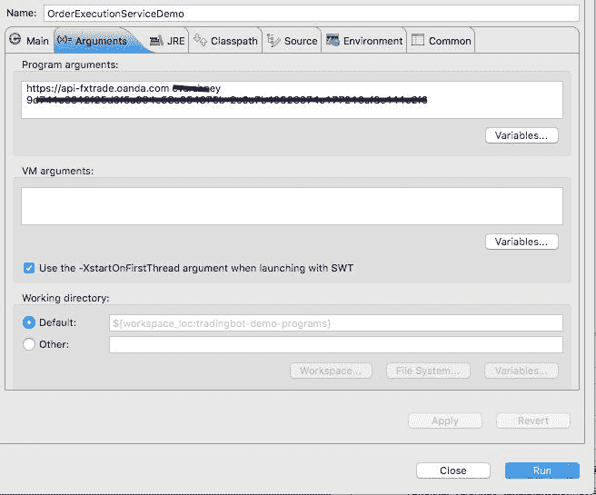 启动配置 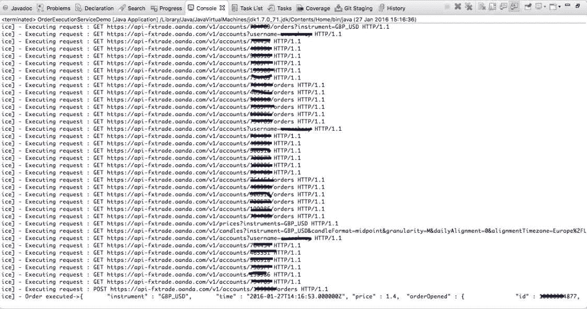 示例输出 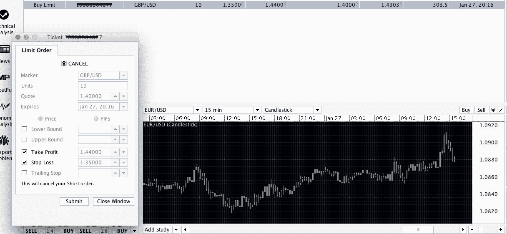 Oanda 订单单

接下来，我们为 `OrderInfoService` 编写演示程序。

```java
package com.precioustech.fxtrading.order;

import java.util.Collection;

import org.apache.log4j.Logger;

import com.precioustech.fxtrading.account.AccountDataProvider;
import com.precioustech.fxtrading.instrument.TradeableInstrument;
import com.precioustech.fxtrading.oanda.restapi.account.OandaAccountDataProviderService;
import com.precioustech.fxtrading.oanda.restapi.order.OandaOrderManagementProvider;

public class OrderInfoServiceDemo {

    private static final Logger LOG = Logger.getLogger(OrderInfoServiceDemo.class);

    private static void usage(String[] args) {
        if (args.length != 3) {
            LOG.error("Usage: OrderExecutionServiceDemo <url> <username> <accesstoken>");
            System.exit(1);
        }
    }

    public static void main(String[] args) {

        usage(args);
        String url = args[0];
        String userName = args[1];
        String accessToken = args[2];

        AccountDataProvider<Long> accountDataProvider =
            new OandaAccountDataProviderService(url, userName, accessToken);

        OrderManagementProvider<Long, String, Long> orderManagementProvider =
            new OandaOrderManagementProvider(url, accessToken, accountDataProvider);

        OrderInfoService<Long, String, Long> orderInfoService =
            new OrderInfoService<Long, String, Long>(orderManagementProvider);

        TradeableInstrument<String> gbpusd = new TradeableInstrument<String>("GBP_USD");

        orderInfoService.allPendingOrders();
        Collection<Order<String, Long>> pendingOrdersGbpUsd =
            orderInfoService.pendingOrdersForInstrument(gbpusd);

        LOG.info(
            String.format("+++++++++++++++++++ Dumping all pending orders for %s +++",
                gbpusd.getInstrument()));
        for (Order<String, Long> order : pendingOrdersGbpUsd) {
            LOG.info(
                String.format("units=%d, takeprofit=%2.5f,stoploss=%2.5f,limitprice=%2.5f,side=%s",
                    order.getUnits(), order.getTakeProfit(), order.getStopLoss(),
                    order.getPrice(), order.getSide()));
        }
    }
}
```

```java
int usdPosCt = orderInfoService.findNetPositionCountForCurrency("USD");
int gbpPosCt = orderInfoService.findNetPositionCountForCurrency("GBP");
LOG.info("Net Position count for USD = " + usdPosCt);
LOG.info("Net Position count for GBP = " + gbpPosCt);
Collection<Order<String, Long>> pendingOrders = orderInfoService.allPendingOrders();
LOG.info("+++++++++++++++++++ Dumping all pending orders ++++++++");
for (Order<String, Long> order : pendingOrders) {
    LOG.info(
        String.format("instrument=%s,units=%d, takeprofit=%2.5f,stoploss=%2.5f,limitprice=%2.5f,side=%s",
            order.getInstrument().getInstrument(), order.getUnits(), order.getTakeProfit(),
            order.getStopLoss(), order.getPrice(), order.getSide()));
}
```

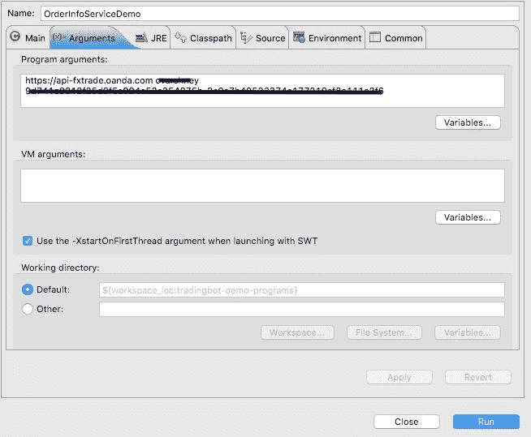 启动配置 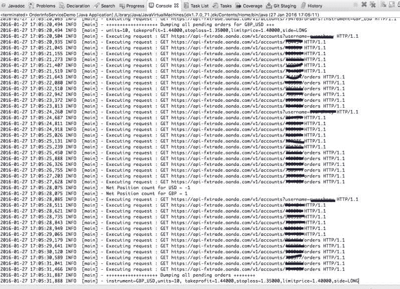 样本输出

现在演示 `PreValidationService` 的程序：

```java
package com.precioustech.fxtrading.order;

import org.apache.log4j.Logger;

import com.precioustech.fxtrading.BaseTradingConfig;
import com.precioustech.fxtrading.TradingSignal;
import com.precioustech.fxtrading.account.AccountDataProvider;
import com.precioustech.fxtrading.account.AccountInfoService;
import com.precioustech.fxtrading.helper.ProviderHelper;
import com.precioustech.fxtrading.instrument.TradeableInstrument;
import com.precioustech.fxtrading.marketdata.CurrentPriceInfoProvider;
import com.precioustech.fxtrading.marketdata.historic.HistoricMarketDataProvider;
import com.precioustech.fxtrading.marketdata.historic.MovingAverageCalculationService;
import com.precioustech.fxtrading.oanda.restapi.account.OandaAccountDataProviderService;
import com.precioustech.fxtrading.oanda.restapi.helper.OandaProviderHelper;
import com.precioustech.fxtrading.oanda.restapi.marketdata.OandaCurrentPriceInfoProvider;
import com.precioustech.fxtrading.oanda.restapi.marketdata.historic.OandaHistoricMarketDataProvider;
import com.precioustech.fxtrading.oanda.restapi.order.OandaOrderManagementProvider;
import com.precioustech.fxtrading.oanda.restapi.trade.OandaTradeManagementProvider;
import com.precioustech.fxtrading.trade.TradeInfoService;
import com.precioustech.fxtrading.trade.TradeManagementProvider;

public class PreValidationServiceDemo {

    private static final Logger LOG = Logger.getLogger(PreValidationServiceDemo.class);

    private static void usage(String[] args) {
        if (args.length != 3) {
            LOG.error("Usage: PreValidationServiceDemo <url> <username> <accesstoken>");
            System.exit(1);
        }
    }

    public static void main(String[] args) {
        usage(args);
        String url = args[0];
        String userName = args[1];
        String accessToken = args[2];

        AccountDataProvider<Long> accountDataProvider =
            new OandaAccountDataProviderService(url, userName, accessToken);

        OrderManagementProvider<Long, String, Long> orderManagementProvider =
            new OandaOrderManagementProvider(url, accessToken, accountDataProvider);

        TradeManagementProvider<Long, String, Long> tradeManagementProvider =
            new OandaTradeManagementProvider(url, accessToken);
        CurrentPriceInfoProvider<String> currentPriceInfoProvider =
            new OandaCurrentPriceInfoProvider(url, accessToken);
        BaseTradingConfig tradingConfig = new BaseTradingConfig();
        tradingConfig.setMinReserveRatio(0.05);
        tradingConfig.setMinAmountRequired(100.00);
        tradingConfig.setMaxAllowedQuantity(10);
        tradingConfig.setMaxAllowedNetContracts(3);
        ProviderHelper<String> providerHelper = new OandaProviderHelper();

        AccountInfoService<Long, String> accountInfoService =
            new AccountInfoService<Long, String>(accountDataProvider,
                currentPriceInfoProvider, tradingConfig, providerHelper);

        TradeInfoService<Long, String, Long> tradeInfoService =
            new TradeInfoService<Long, String, Long>(
                tradeManagementProvider, accountInfoService);

        tradeInfoService.init();

        HistoricMarketDataProvider<String> historicMarketDataProvider =
            new OandaHistoricMarketDataProvider(url, accessToken);

        MovingAverageCalculationService<String> movingAverageCalculationService =
            new MovingAverageCalculationService<String>(historicMarketDataProvider);

        OrderInfoService<Long, String, Long> orderInfoService =
            new OrderInfoService<Long, String, Long>(orderManagementProvider);

        PreOrderValidationService<Long, String, Long> preOrderValidationService =
            new PreOrderValidationService<Long, String, Long>(tradeInfoService,
                movingAverageCalculationService, tradingConfig, orderInfoService);

        TradeableInstrument<String> eurusd = new TradeableInstrument<String>("EUR_USD");
        TradeableInstrument<String> usdjpy = new TradeableInstrument<String>("USD_JPY");
        boolean isEurUsdTraded = preOrderValidationService.checkInstrumentNotAlreadyTraded(eurusd);
        boolean isUsdJpyTraded = preOrderValidationService.checkInstrumentNotAlreadyTraded(usdjpy);
        LOG.info(eurusd.getInstrument() + " trade present? " + !isEurUsdTraded);
        LOG.info(usdjpy.getInstrument() + " trade present? " + !isUsdJpyTraded);

        TradeableInstrument<String> usdzar = new TradeableInstrument<String>("USD_ZAR");

        boolean isUsdZarTradeInSafeZone = preOrderValidationService.
            isInSafeZone(TradingSignal.LONG, 17.9, usdzar);
        LOG.info(usdzar.getInstrument() + " in safe zone? " + isUsdZarTradeInSafeZone);
        boolean isEurUsdTradeInSafeZone = preOrderValidationService
            .isInSafeZone(TradingSignal.LONG, 1.2, eurusd);
        LOG.info(eurusd.getInstrument() + " in safe zone? " + isEurUsdTradeInSafeZone);

        TradeableInstrument<String> nzdchf = new TradeableInstrument<String>("NZD_CHF");

        preOrderValidationService.checkLimitsForCcy(nzdchf, TradingSignal.LONG);
    }
}
```

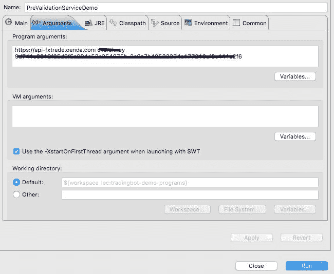 启动配置 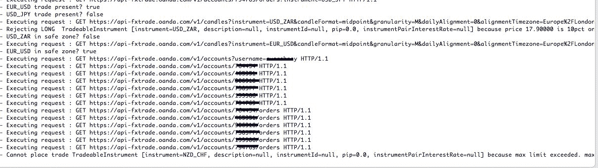 样本输出

最后一个演示程序基于 `TradeInfoService`：

```java
package com.precioustech.fxtrading.trade;

import java.util.Collection;

import org.apache.log4j.Logger;

import com.precioustech.fxtrading.BaseTradingConfig;
import com.precioustech.fxtrading.account.AccountDataProvider;
import com.precioustech.fxtrading.account.AccountInfoService;
import com.precioustech.fxtrading.helper.ProviderHelper;
import com.precioustech.fxtrading.instrument.TradeableInstrument;
import com.precioustech.fxtrading.marketdata.CurrentPriceInfoProvider;
import com.precioustech.fxtrading.oanda.restapi.account.OandaAccountDataProviderService;
import com.precioustech.fxtrading.oanda.restapi.helper.OandaProviderHelper;
import com.precioustech.fxtrading.oanda.restapi.marketdata.OandaCurrentPriceInfoProvider;
import com.precioustech.fxtrading.oanda.restapi.trade.OandaTradeManagementProvider;

public class TradeInfoServiceDemo {

    private static final Logger LOG = Logger.getLogger(TradeInfoServiceDemo.class);

    private static void usage(String[] args) {
        if (args.length != 3) {
            LOG.error("Usage: TradeInfoServiceDemo <url> <username> <accesstoken>");
            System.exit(1);
        }
    }

    public static void main(String[] args) {
        usage(args);
        String url = args[0];
        String userName = args[1];
        String accessToken = args[2];
        AccountDataProvider<Long> accountDataProvider =
            new OandaAccountDataProviderService(url, userName, accessToken);
        CurrentPriceInfoProvider<String> currentPriceInfoProvider =
            new OandaCurrentPriceInfoProvider(url, accessToken);
        BaseTradingConfig tradingConfig = new BaseTradingConfig();
        tradingConfig.setMinReserveRatio(0.05);
        tradingConfig.setMinAmountRequired(100.00);
        tradingConfig.setMaxAllowedQuantity(10);
        ProviderHelper<String> providerHelper = new OandaProviderHelper();
        AccountInfoService<Long, String> accountInfoService =
            new AccountInfoService<Long, String>(accountDataProvider,
                currentPriceInfoProvider, tradingConfig, providerHelper);
        TradeManagementProvider<Long, String, Long> tradeManagementProvider =
            new OandaTradeManagementProvider(url,
                accessToken);

        TradeInfoService<Long, String, Long> tradeInfoService =
            new TradeInfoService<Long, String, Long>(
                tradeManagementProvider, accountInfoService);

        tradeInfoService.init();
        Collection<Trade<Long, String, Long>> allTrades = tradeInfoService.getAllTrades();
        LOG.info("################ 导出所有交易 ################");
        for (Trade<Long, String, Long> trade : allTrades) {
            LOG.info(
                String.format("Units=%d,Side=%s,Instrument=%s,Price=%2.5f", trade.getUnits(),
                    trade.getSide(), trade.getInstrument().getInstrument(),
                    trade.getExecutionPrice()));
        }
        int chfTrades = tradeInfoService.findNetPositionCountForCurrency("CHF");
        int cadTrades = tradeInfoService.findNetPositionCountForCurrency("CAD");
        LOG.info("CHF 净头寸 = " + chfTrades);
        LOG.info("CAD 净头寸 = " + cadTrades);
        TradeableInstrument<String> cadchf = new TradeableInstrument<String>("CAD_CHF");
        TradeableInstrument<String> usdcad = new TradeableInstrument<String>("USD_CAD");
        boolean isCadChdTradeExists = tradeInfoService.isTradeExistsForInstrument(cadchf);
        boolean isUsdCadTradeExists = tradeInfoService.isTradeExistsForInstrument(usdcad);
        LOG.info(cadchf.getInstrument() + " 是否存在? " + isCadChdTradeExists);
        LOG.info(usdcad.getInstrument() + " 是否存在? " + isUsdCadTradeExists);
    }
}
```

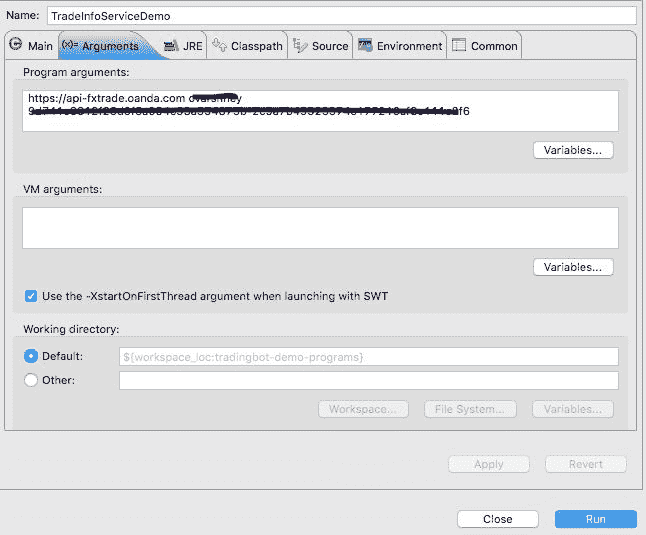 启动配置 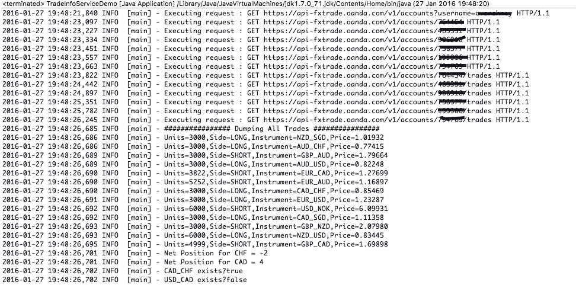 示例输出

## 7. 事件流：交易/订单/账户事件

当平台上的订单/交易/账户或任何其他实体的状态发生变化时，交易平台便会生成事件。以下是一些可能触发事件的示例：

*   LIMIT 订单成交
*   交易止损退出
*   账户保证金强平

我们将在本章后续部分讨论许多此类状态变更事件及其处理方式，但将重点关注仅影响交易/订单和账户的事件。

正如本书引言中所述，我们需要创建一个无限事件循环，以便接收平台上发生的状态变更。平台通过事件流（类似于市场数据流）推送这些事件，我们需要采用相同的范式来处理这些事件。然而，有一个显著的区别。市场数据流（不包括心跳）仅包含符合标准负载的 Tick 事件。但对于事件流，根据哪个实体发生了何种状态变更，我们可能会收到不同的负载。例如，当 OANDA 平台上的限价订单成交时^(1)，通常会像下面这样将响应发送到事件流中。

```json
{
  "transaction": {
    "id": 10002,
    "accountId": 123456,
    "time": "1443968041000000",
    "type": "ORDER_FILLED",
    "instrument": "EUR_USD",
    "units": 10,
    "side": "sell",
    "price": 1,
    "pl": 1.234,
    "interest": 0.034,
    "accountBalance": 10000,
    "orderId": 0,
    "tradeReduced": {
      "id": 54321,
      "units": 10,
      "pl": 1.234,
      "interest": 0.034
    }
  }
}
```

另一方面，当一笔交易被止损退出时，我们可能会看到以下响应：

```json
{
  "transaction": {
    "id": 10004,
    "accountId": 234567,
    "time": "1443968081000000",
    "type": "STOP_LOSS_FILLED",
    "tradeId": 1782812741,
    "instrument": "USD_SGD",
    "units": 3000,
    "side": "sell",
    "price": 1.39101,
    "pl": 3.3039,
    "interest": -0.0123,
    "accountBalance": 5915.8745
  }
}
```

面对这些多样化的响应，我们需要为感兴趣的每种事件类型创建事件处理器。这正是我们利用 `EventBus` 多态特性的时候——它会尝试将消息投递给精确匹配的类型，找不到时再向其超类型进行投递。

让我们总结一下我们可能看到被回调的不同重要事件。这绝非完整列表，但应该是各个平台上常见的事件，我们将在后续章节中详细讨论：

1.  订单

    *   创建新的市价单

    *   创建新的限价单

    *   订单更新

    *   订单取消

    *   订单成交

2.  交易

    *   止盈触发

    *   止损触发

    *   交易更新

    *   交易关闭

3.  账户

    *   保证金强平

    *   融资（利息支付或收取）

### 7.1 流式事件接口

我们的第一步是定义一个接口，用于建立与平台的事件循环。这在概念上与市场数据流式接口完全相同。建立事件循环后，所有事件将通过我们即将讨论的 `EventCallback` 委托给适当的事件处理器。首先，让我们快速查看一下这个接口：

```java
/**
 * 提供交易/订单/账户相关事件流式传输的服务。
 * 通常，实现会创建到平台的专用连接或注册回调监听器来接收事件。
 * 建议该服务将事件处理委托给特定的处理器，
 * 这些处理器可以解析并理解收到的各种不同事件。
 *
 *
 */
public interface {

 /**
  * 启动流式服务，该服务理想情况下会创建到平台的专用连接或回调监听器。
  * 理想情况下，不应为请求相同事件类型而创建多个连接。
  */
 void startEventsStreaming();

 /**
  * 停止事件流式服务，并以合适的方式释放任何资源/连接，
  * 确保不会产生资源泄露。
  */
 void stopEventsStreaming();
}
```

必须配合使用以分发事件的 `EventCallback` 定义如下：

```java
public interface EventCallback<T> {

 void onEvent(EventPayLoad<T> eventPayLoad);
}
```

上述两个接口与市场数据接口具有相似的设计目标。真正的区别在于下游对这些不同负载的分发方式，我们将在 `EventBus` 登场时发现这一点。但在此之前，让我们快速看一下 `EventsStreamingService` 的 OANDA 实现。

### 7.2 `EventsStreamingService` 的具体实现

让我们先看看该类的定义和构造函数，从而开始讨论这个实现。

```java
public class OandaEventsStreamingService extends OandaStreamingService implements EventsStreamingService {

    private static final Logger LOG = Logger.getLogger(OandaEventsStreamingService.class);
    private final String url;
    private final AccountDataProvider<Long> accountDataProvider;
    private final EventCallback<JSONObject> eventCallback;

    public OandaEventsStreamingService(final String url, final String accessToken,
                                       AccountDataProvider<Long> accountDataProvider,
                                       EventCallback<JSONObject> eventCallback,
                                       HeartBeatCallback<DateTime> heartBeatCallback,
                                       String heartBeatSourceId) {
        super(accessToken, heartBeatCallback, heartBeatSourceId);
        this.url = url;
        this.accountDataProvider = accountDataProvider;
        this.eventCallback = eventCallback;
    }
}
```

与 `OandaMarketDataStreamingService` 类似，此类继承自 `OandaStreamingService`，后者为所有 OANDA 流式传输服务提供了基础设施方法，如前所述。除了常规传入的参数 `url` 和 `accessToken` 之外，`super` 类还需要 `HeartBeatCallBack` 和 `heartBeatSourceId` 参数。我们还需要额外的 `AccountDataProvider` 服务，它提供我们希望接收事件回调的账户列表。这些账户必须作为参数传入流式传输 URL，如下所示。

```java
@Override
protected String getStreamingUrl() {
    Collection<Account<Long>> accounts = accountDataProvider.getLatestAccountInfo();
    return this.url + OandaConstants.EVENTS_RESOURCE + "?accountIds=" + accountsAsCsvString(accounts);
}

private String accountsAsCsvString(Collection<Account<Long>> accounts) {
    StringBuilder accountsAsCsv = new StringBuilder();
    boolean firstTime = true;
    for (Account<Long> account : accounts) {
        if (firstTime) {
            firstTime = false;
        } else {
            accountsAsCsv.append(TradingConstants.ENCODED_COMMA);
        }
        accountsAsCsv.append(account.getAccountId());
    }
    return accountsAsCsv.toString();
}
```

`accountDataProvider.getLatestAccountInfo()` 返回属于用户的全部账户集合。然后将该集合传递给 `accountsAsCsvString` 方法，该方法返回一个以 CSV（URL 编码）格式分隔的账户列表。假设用户拥有账户 `123456` 和 `2345678`，则 `getStreamingUrl` 函数应计算出：

```java
// 给定
public static final String EVENTS_RESOURCE = "/v1/events";
// 计算出的 URL 如下所示
https://stream-fxtrade.oanda.com/v1/events?accountIds=123456%2C2345678
```

现在流式传输 URL 已计算出来，我们准备在单独的线程中以无限循环方式开始流式传输，使用与市场数据事件流相同的范式。

```java
@Override
public void startEventsStreaming() {
    stopEventsStreaming();
    streamThread = new Thread(new Runnable() {

        @Override
        public void run() {
            CloseableHttpClient httpClient = getHttpClient();
            try {
                BufferedReader br = setUpStreamIfPossible(httpClient);
                if (br != null) {
                    String line;
                    while ((line = br.readLine()) != null && serviceUp) {
                        Object obj = JSONValue.parse(line);
                        JSONObject jsonPayLoad = (JSONObject) obj;
                        if (jsonPayLoad.containsKey(heartbeat)) {
                            handleHeartBeat(jsonPayLoad);
                        } else if (jsonPayLoad.containsKey(transaction)) {
                            JSONObject transactionObject = (JSONObject) jsonPayLoad.get(transaction);
                            String transactionType = transactionObject.get(type).toString();
                            /* 在此处进行转换，以便事件总线可以发布到适当的处理程序，
                             * 尽管这并不属于这里 */
                            EventPayLoad<JSONObject> payLoad = OandaUtils.toOandaEventPayLoad(transactionType, transactionObject);
                            if (payLoad != null) {
                                eventCallback.onEvent(payLoad);
                            }
                        } else if (jsonPayLoad.containsKey(OandaJsonKeys.disconnect)) {
                            handleDisconnect(line);
                        }
                    }
                    br.close();
                }
            } catch (Exception e) {
                LOG.error(e);
            } finally {
                serviceUp = false;
                TradingUtils.closeSilently(httpClient);
            }
        }
    }, "OandEventStreamingThread");
    streamThread.start();
}
```

这段代码看起来与市场数据代码非常相似，只是有些行有所不同。

```java
if (jsonPayLoad.containsKey(transaction)) {
    JSONObject transactionObject = (JSONObject) jsonPayLoad.get(transaction);
    String transactionType = transactionObject.get(type).toString();
    /* 在此处进行转换，以便事件总线可以发布到适当的处理程序，
     * 尽管这并不属于这里 */
    EventPayLoad<JSONObject> payLoad = OandaUtils.toOandaEventPayLoad(transactionType, transactionObject);
    if (payLoad != null) {
        eventCallback.onEvent(payLoad);
    }
}
```

这段代码似乎是大多数魔法的发生之处。所有事件 JSON 负载都包含 `transaction` 键。因此，如果我们的负载包含此键，我们就知道这是一个需要处理的平台事件。这里我们引入了由 `EventBus` 实现的细粒度事件处理概念。请记住，根据我们对 `EventBus` 的介绍，开发者可以自行决定需要多细粒度或多粗粒度的订阅者或处理程序。我们希望通过尽可能细粒度地利用此功能来发挥其优势。因此，我们创建了派生自 `EventPayLoad` 类的负载，然后创建了具有处理 `EventPayLoad` 特定子类的方法的处理程序。让我们首先定义所有事件的这个父类。

```java
/**
 * 平台事件需要实现的接口。该接口的实现者
 * 将是已经实现了 method name() 的枚举。
 * 它存在的意义是为所有平台事件提供一个基础实现。
 */
public interface Event {
    String name();
}
```

```java
public class EventPayLoad<T> {

    private final Event event;
    private final T payLoad;

    public EventPayLoad(Event event, T payLoad) {
        this.event = event;
        this.payLoad = payLoad;
    }

    public Event getEvent() {
        return this.event;
    }

    public T getPayLoad() {
        return this.payLoad;
    }
}
```

所有事件负载的基类规定，我们必须定义一个构造函数，该函数接受一个`Event`类型的枚举和一个`T`类型的负载。

从我们的讨论中可以明显看出，我们需要为预期的每种负载类型（即`Account`、`Trade`和`Order`）提供子类实现。

## 账户

```java
public enum AccountEvents implements Event {
    MARGIN_CALL_ENTER,
    MARGIN_CALL_EXIT,
    MARGIN_CLOSEOUT,
    SET_MARGIN_RATE,
    TRANSFER_FUNDS,
    DAILY_INTEREST,
    FEE;
}
```

```java
public class AccountEventPayLoad extends EventPayLoad<JSONObject> {

    public AccountEventPayLoad(AccountEvents event, JSONObject payLoad) {
        super(event, payLoad);
    }
}
```

## 交易（Trade）

```java
public enum TradeEvents implements Event {
    TRADE_UPDATE,
    TRADE_CLOSE,
    MIGRATE_TRADE_OPEN,
    MIGRATE_TRADE_CLOSE,
    STOP_LOSS_FILLED,
    TAKE_PROFIT_FILLED,
    TRAILING_STOP_FILLED;
}
```

```java
public class TradeEventPayLoad extends EventPayLoad<JSONObject> {

    public TradeEventPayLoad(TradeEvents event, JSONObject payLoad) {
        super(event, payLoad);
    }
}
```

## 订单（Order）

```java
public enum OrderEvents implements Event {
    MARKET_ORDER_CREATE,
    STOP_ORDER_CREATE,
    LIMIT_ORDER_CREATE,
    MARKET_IF_TOUCHED_ORDER_CREATE,
    ORDER_UPDATE,
    ORDER_CANCEL,
    ORDER_FILLED;
}
```

```java
public class OrderEventPayLoad extends EventPayLoad<JSONObject> {

    private final OrderEvents orderEvent;

    public OrderEventPayLoad(OrderEvents event, JSONObject payLoad) {
        super(event, payLoad);
        this.orderEvent = event;
    }

    @Override
    public OrderEvents getEvent() {
        return this.orderEvent;
    }
}
```

接下来，我们需要将 JSON 负载转换为`EventPayLoad`实例，这一任务由`OandaUtils.toOandaEventPayLoad()`完成。该方法需要一个*类型*参数，该参数通过事件 JSON 负载传递，用于确定该事件关联哪个业务实体，即*交易*、*订单*或*账户*。实际上，*类型*就是我们三个枚举中某个事件的名称。

```java
public static EventPayLoad<JSONObject> toOandaEventPayLoad(String transactionType, JSONObject payLoad) {
    Preconditions.checkNotNull(transactionType);
    Event evt = findAppropriateType(AccountEvents.values(), transactionType);
    if (evt == null) {
        evt = findAppropriateType(OrderEvents.values(), transactionType);
        if (evt == null) {
            evt = findAppropriateType(TradeEvents.values(), transactionType);
            if (evt == null) {
                return null;
            } else {
                return new TradeEventPayLoad((TradeEvents) evt, payLoad);
            }
        } else {
            return new OrderEventPayLoad((OrderEvents) evt, payLoad);
        }
    } else {
        return new AccountEventPayLoad((AccountEvents) evt, payLoad);
    }
}

private static final Event findAppropriateType(Event[] events, String transactionType) {
    for (Event evt: events) {
        if (evt.name().equals(transactionType)) {
            return evt;
        }
    }
    return null;
}
```

这个工具方法会暴力遍历我们现有的全部三种事件类型，一旦找到匹配项就立即返回结果。如果找不到匹配（当平台引入新事件时可能出现这种情况），则返回`null`。如果我们确实获得了一个非空的`EventPayLoad`实例，就可以将其分派给某个`EventCallback`实例，该实例必然通过`EventBus`将事件分派给感兴趣的订阅者。

```java
public class EventCallbackImpl<T> implements EventCallback<T> {

    private final EventBus eventBus;

    public EventCallbackImpl(final EventBus eventBus) {
        this.eventBus = eventBus;
    }

    @Override
    public void onEvent(EventPayLoad<T> eventPayLoad) {
        this.eventBus.post(eventPayLoad);
    }
}
```

当`onEvent`方法被调用时，它已经持有了`EventPayLoad`的合适子类型实例，随时可以分派。

由于我们希望利用`EventBus`对`EventPayLoad`子类型进行细粒度分派的能力，我们需要创建能够多态处理这些具体负载的负载处理器。为此，我们首先需要定义一个`EventHandler`接口，其中包含一个专门执行此操作的方法。

```java
public interface EventHandler<K, T extends EventPayLoad<K>> {

    void handleEvent(T payLoad);
}
```

在上述定义中，我们规定`handleEvent`方法将处理类型为`EventPayLoad`子类的事件。

对于与*交易*业务实体相关的事件集，其`TradeEventHandler`的实现如下所示：

```java
public class TradeEventHandler implements EventHandler<JSONObject, TradeEventPayLoad> {

    private final Set<TradeEvents> tradeEventsSupported =
        Sets.newHashSet(TradeEvents.STOP_LOSS_FILLED,
                        TradeEvents.TRADE_CLOSE, TradeEvents.TAKE_PROFIT_FILLED);
    private final TradeInfoService<Long, String, Long> tradeInfoService;

    public TradeEventHandler(TradeInfoService<Long, String, Long> tradeInfoService) {
        this.tradeInfoService = tradeInfoService;
    }

    @Override
    @Subscribe
    @AllowConcurrentEvents
    public void handleEvent(TradeEventPayLoad payLoad) {
        Preconditions.checkNotNull(payLoad);
        if (!tradeEventsSupported.contains(payLoad.getEvent())) {
            return;
        }
        JSONObject jsonPayLoad = payLoad.getPayLoad();
        long accountId = (Long) jsonPayLoad.get(OandaJsonKeys.accountId);
        tradeInfoService.refreshTradesForAccount(accountId);
    }
}
```

根据其定义，`TradeEventHandler`负责处理`TradeEventPayLoad`负载。关于这个简单处理器，有几点值得注意。首先，它通过`tradeEventsSupported`集合规定了它希望消费的全部交易事件中的哪些子集。因此，它的首要操作之一就是执行检查：

```java
if (!tradeEventsSupported.contains(payLoad.getEvent())) {
    return;
}
```

如果事件类型不在`[STOP_LOSS_FILLED, TRADE_CLOSE, TAKE_PROFIT_FILLED]`中，则立即返回。如果在其中，则执行一个非常有趣的操作：刷新交易缓存。请记住，根据我们在前一章的讨论，`TradeInfoService`内部维护了一个交易缓存，以避免频繁调用获取交易信息（代价很高）。现在，这里正是该缓存被刷新的位置。我们只刷新指定账户的交易缓存，避免刷新全部缓存，因为这里并不需要。

订单的等效处理器是`OrderFilledEventHandler`，其定义如下：

```java
public class OrderFilledEventHandler implements EventHandler<JSONObject, OrderEventPayLoad>,
    EmailContentGenerator<JSONObject> {
    private final Set<OrderEvents> orderEventsSupported =
        Sets.newHashSet(OrderEvents.ORDER_FILLED);
    private final TradeInfoService<Long, String, Long> tradeInfoService;

    public OrderFilledEventHandler(
        TradeInfoService<Long, String, Long> tradeInfoService) {
        this.tradeInfoService = tradeInfoService;
    }

    @Override
    @Subscribe
    @AllowConcurrentEvents
    public void handleEvent(OrderEventPayLoad payLoad) {
        Preconditions.checkNotNull(payLoad);
        if (!orderEventsSupported.contains(payLoad.getEvent())) {
            return;
        }
        JSONObject jsonPayLoad = payLoad.getPayLoad();

        long accountId = (Long) jsonPayLoad.get(OandaJsonKeys.accountId);
        tradeInfoService.refreshTradesForAccount(accountId);
    }
}
```

正如该处理器的名称所示，我们只对`ORDER_FILLED`事件感兴趣。当订单成交时，会相应地创建一笔交易。因此，我们通过调用`tradeInfoService.refreshTradesForAccount`再次刷新交易缓存。

回到 EventBus 的分发机制，由于我们创建了类型为`TradeEventPayLoad`、`OrderEventPayLoad`和`AccountEventPayLoad`的负载，并且拥有使用`@Subscribe`注解且与这些类型匹配的方法，EventBus 会将事件分派到对应的`handleEvent`方法，而不会分派给所有三个方法。

至此，我们关于交易、订单和账户相关事件的讨论就结束了。当这些事件发生时，我们还可以选择执行其他操作，例如发送电子邮件或短信通知。作为开发者，`handleEvent`方法中要编写什么内容完全取决于我们。

### 7.3 动手试试

在本节中，我们将创建一个演示程序，用于输出平台中的事件。要查看实际效果并看到输出的`LIMIT_ORDER_CREATE`事件，请运行`OrderExecutionServiceDemo`程序，该程序将创建一个新订单，进而生成一个平台事件。演示程序将处理并输出该事件。

# 8. 集成 Twitter

现在我们已进入构建交易机器人旅程中可能最激动人心的部分。与社交媒体交互，可能是机器人应具备的最重要能力之一。这在几年前或许并不重要，但现在却极为关键，因为大多数新闻、事件和泄密信息似乎都首先出现在社交媒体上，从而影响市场。能够实时订阅这些信息流、理解其内容并做出决策，为任何机器人增加了一层复杂性。我们的机器人也不例外，只是我们不会尝试每秒处理成千上万条推文，而是学习与 Twitter 集成的基础知识。我们希望在章节结束时实现以下目标：

*   连接到一个 Twitter 账户。

*   搜索推文。

*   解析推文并理解其含义。

我们将特别关注用户发布的关于外汇的推文，这些推文具有清晰的结构，并包含订单和交易信息。这样做的目的是，我们可以构建一种策略，复制他人的操作，或许模仿他们的行动，或许反其道而行之。这将在下一章中详细讨论，作为包含此概念的策略的一部分。

## 8.1 创建 Twitter 应用

在我们可以通过用户账户自动发布和读取推文之前，需要将一个 Twitter 应用关联到该用户账户。为此应用生成的令牌，将用于登录 Twitter 并通过机器人执行所需操作。让我们逐步操作，直到获得通过 Java 应用连接所需的令牌。

**步骤 1**：访问 [`apps.twitter.com/app/new`](https://apps.twitter.com/app/new)，你将看到以下页面。

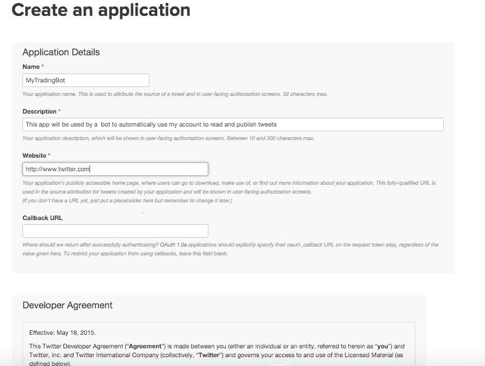 为机器人创建应用

**步骤 2**：接受协议并提交表单后，我们将看到以下确认页面。

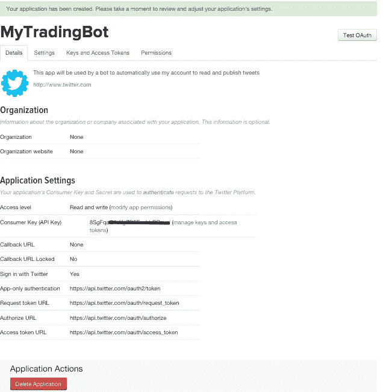 Twitter 应用创建成功

**步骤 3**：在确认页面，现在必须点击 *密钥和访问令牌* 选项卡，我们将会看到 *消费者密钥* 和 *消费者密钥秘钥* 显示出来。请记下这些信息，稍后会用到。

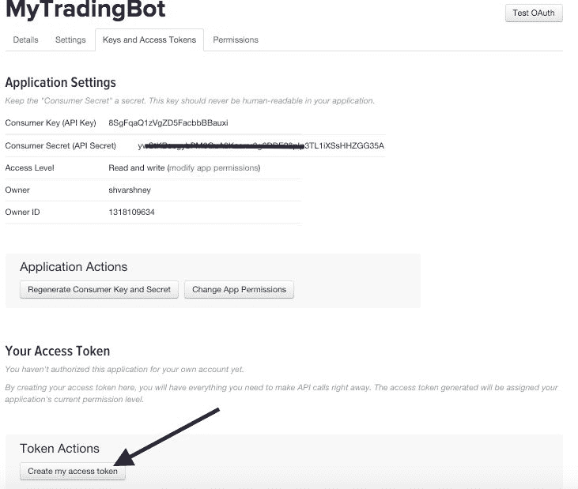 消费者令牌

**步骤 4**：我们现在可以创建其他访问令牌了。请点击 *令牌操作* 下方的按钮来生成令牌。我们将看到如下页面：

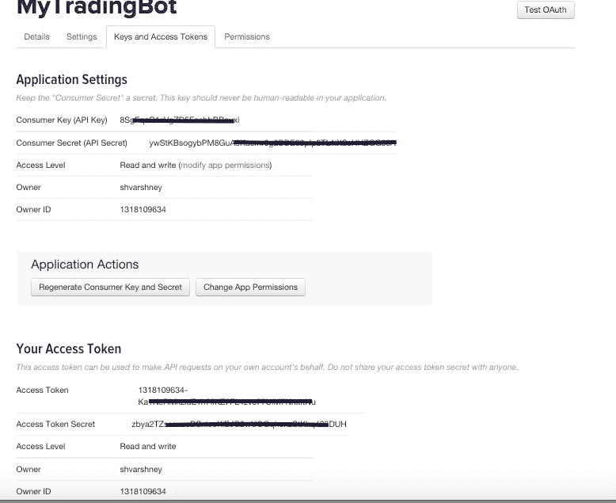 授权令牌

现在我们应获得以下 4 个令牌，交易机器人应用需要使用它们通过我们的账户登录。

*   消费者密钥

*   消费者秘钥

*   访问密钥令牌

*   访问密钥秘钥

## 8.2 Spring Social

```java
package com.precioustech.fxtrading.oanda.restapi.streaming.events;

import static com.precioustech.fxtrading.oanda.restapi.OandaJsonKeys.type;

import org.apache.log4j.Logger;
import org.joda.time.DateTime;
import org.json.simple.JSONObject;

import com.google.common.eventbus.AllowConcurrentEvents;
import com.google.common.eventbus.EventBus;
import com.google.common.eventbus.Subscribe;
import com.precioustech.fxtrading.account.AccountDataProvider;
import com.precioustech.fxtrading.events.EventCallback;
import com.precioustech.fxtrading.events.EventCallbackImpl;
import com.precioustech.fxtrading.events.EventPayLoad;
import com.precioustech.fxtrading.heartbeats.HeartBeatCallback;
import com.precioustech.fxtrading.heartbeats.HeartBeatCallbackImpl;
import com.precioustech.fxtrading.oanda.restapi.account.OandaAccountDataProviderService;
import com.precioustech.fxtrading.streaming.events.EventsStreamingService;

public class EventsStreamingServiceDemo {

 private static final Logger LOG = Logger.getLogger(EventsStreamingServiceDemo.class);

 private static void usage(String[] args) {
  if (args.length != 4) {
   LOG.error("用法: EventsStreamingServiceDemo <url> <url2> <username> <accesstoken>");
   System.exit(1);
  }
 }

 private static class EventSubscriber {

  @Subscribe
  @AllowConcurrentEvents
  public void handleEvent(EventPayLoad < JSONObject > payLoad) {
   String transactionType = payLoad.getPayLoad().get(type).toString();
   LOG.info(String.format("类型:%s, 负载=%s", transactionType, payLoad.getPayLoad()));
  }
 }

 public static void main(String[] args) throws Exception {
  usage(args);
  String url = args[0];
  String url2 = args[1];
  String userName = args[2];
  String accessToken = args[3];
  final String heartBeatSourceId = "DEMO_EVTDATASTREAM";

  EventBus eventBus = new EventBus();
  eventBus.register(new EventSubscriber());
  HeartBeatCallback < DateTime > heartBeatCallback = new HeartBeatCallbackImpl < DateTime > (eventBus);
  AccountDataProvider < Long > accountDataProvider =
   new OandaAccountDataProviderService(url2, userName, accessToken);
  EventCallback < JSONObject > eventCallback = new EventCallbackImpl < JSONObject > (eventBus);

  EventsStreamingService evtStreamingService =
   new OandaEventsStreamingService(url, accessToken,
    accountDataProvider, eventCallback, heartBeatCallback, heartBeatSourceId);
  evtStreamingService.startEventsStreaming();
  //在接下来的 60 秒内运行 OrderExecutionServiceDemo
  Thread.sleep(60000 L);
  evtStreamingService.stopEventsStreaming();
 }
}
```

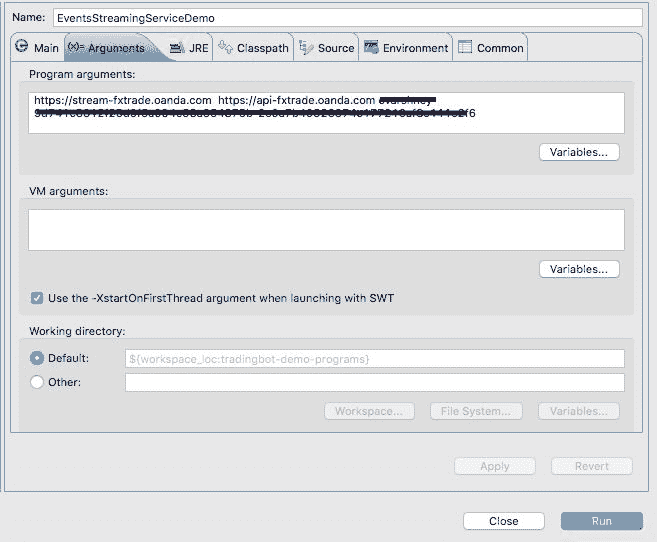 启动配置

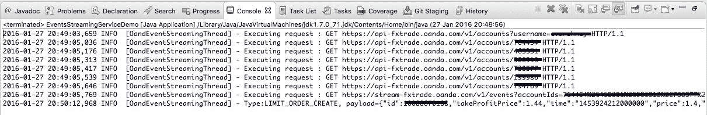 示例输出

1.  http://developer.oanda.com/rest-live/streaming/#eventsStreaming↩︎

Spring Social^(1) 是与 Facebook、Twitter、LinkedIn 等社交媒体应用集成的既定选择。它提供了连接特定社交网络所需的所有基础设施，让我们专注于实现从这些网络挖掘数据或向这些网络发布数据的逻辑。之前使用过 Spring 的开发者会识别出与 JMS^(2) 和 JDBC^(3) 相同的模式，在这些模式中，所有中间件和数据库基础设施分别由 Spring 处理，从而让我们全神贯注于手头的任务。

就我们的讨论而言，我们将专注于将机器人集成到 Twitter^(4) 中。

## 8.2.1 使用和配置 Spring Social

我们需要在 Maven 的 `pm.xml` 文件中添加以下依赖项，以便将 Spring Social 引入机器人生态系统。

```
1 <dependency>
2    <groupId>org.springframework.social</groupId>
3    <artifactId>spring-social-twitter</artifactId>
4    <version>1.1.0.RELEASE</version>
5 </dependency>
```

与 Twitter 的交互是通过 `TwitterTemplate`^(5) 进行的，需要将其配置到 Spring 配置文件中，使用我们在定义 Twitter 应用时生成的令牌。

```
1 <bean id="twitter" class="org.springframework.social.twitter.api.impl.TwitterTemplate">
2 		<constructor-arg index="0" value="${twitter.consumerKey}"/>
3 		<constructor-arg index="1" value="${twitter.consumerSecret}"/>
4 		<constructor-arg index="2" value="${twitter.accessToken}"/>
5 		<constructor-arg index="3" value="${twitter.accessTokenSecret}"/>
6 </bean>
```

现在，`TwitterTemplate` 已准备好被注入到任何服务中。

## 8.3 采集外汇推文

现在进入本章的核心内容，我们将讨论如何采集（搜索）结构良好的交易/订单推文。我们的目标是找到结构良好的推文，这些推文可以被解析并创建以下 POJO：

- `NewFXTradeTweet`

```java
public class NewFXTradeTweet < T > extends FXTradeTweet < T > {
    private final double stopLoss,
    takeProfit;
    private final TradingSignal action;
    private final String str;

    public NewFXTradeTweet(TradeableInstrument < T > instrument, double price,
        double stopLoss, double takeProfit,
        TradingSignal action) {
        super(instrument, price);
        this.stopLoss = stopLoss;
        this.takeProfit = takeProfit;
        this.action = action;
        this.str = String.format("%s@%3.5f TP: %3.5f: SL: %3.5f %s",
            instrument.getInstrument(), price, takeProfit,
            stopLoss, action.name());
    }

    @Override
    public String toString() {
        return str;
    }

    public TradingSignal getAction() {
        return this.action;
    }

    public double getStopLoss() {
        return stopLoss;
    }

    public double getTakeProfit() {
        return takeProfit;
    }
}
```

- `CloseFXTradeTweet`

```java
public class CloseFXTradeTweet < T > extends FXTradeTweet < T > {
    private final double profit,
    price;

    public CloseFXTradeTweet(TradeableInstrument < T > instrument, double profit,
        double price) {
        super(instrument, price);
        this.profit = profit;
        this.price = price;
    }

    public double getProfit() {
        return profit;
    }

    @Override
    public double getPrice() {
        return price;
    }
}
```

其中基类 `FXTradeTweet` 为：

```java
public abstract class FXTradeTweet < T > {
    private final TradeableInstrument < T > instrument;
    private final double price;

    public FXTradeTweet(TradeableInstrument < T > instrument, double price) {
        super();
        this.instrument = instrument;
        this.price = price;
    }

    public TradeableInstrument < T > getInstrument() {
        return instrument;
    }

    public double getPrice() {
        return price;
    }
}
```

结构良好的交易推文的概念是指，一群 Twitter 用户以固定格式持续发布推文，并且我们可以为这些推文编写 `TweetHandler`。我们只关注那些关于新订单或平仓交易的推文。当我们讨论基于推文的策略时，其理由会更加清晰。现在先让我们看看来自用户 `@SignalFactory`^(6) 和 `@ZuluTrader101`^(7) 的一些推文示例，这样就能更清楚地理解我的意思。

- 来自 `@SignalFactory` 的推文

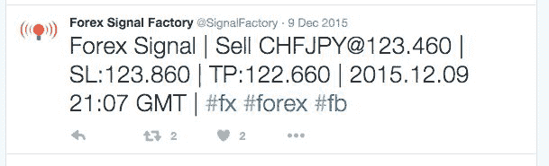 新交易 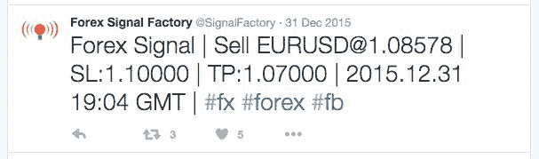 新交易  平仓 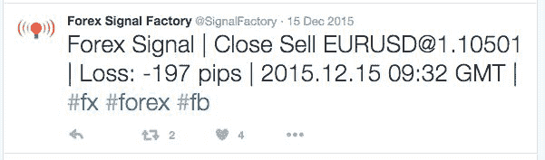 平仓

- 来自 `@ZuluTrader101` 的推文

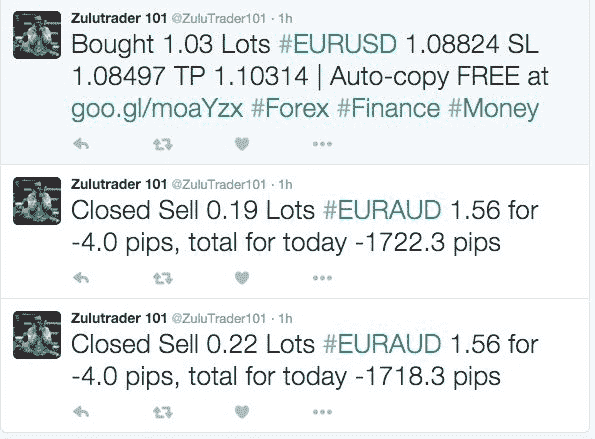 新交易与平仓  新交易与平仓

查看来自这两位用户的推文示例，可以发现他们总是以某种固定格式发布推文。如果我们为这些推文分配一个专门的推文处理器（该处理器知道如何解析来自特定用户的推文），那么解析这些推文就变得很简单。我们稍后再讨论处理器。在此之前，我们先看看如何搜索来自特定用户的推文。

### 8.3.1 TweetHarvester 接口

`TweetHarvester` 接口规定了为给定用户搜索推文的功能，这些推文会生成一个包含新建/平仓外汇交易推文的集合。其定义如下：

```java
public interface TweetHarvester<T> {
    Collection<NewFXTradeTweet<T>> harvestNewTradeTweets(String userId);
    Collection<CloseFXTradeTweet<T>> harvestHistoricTradeTweets(String userId, TradeableInstrument<T> instrument);
}
```

接口的第一个方法相当直接。该方法的职责是，自上次搜索以来，从给定用户处采集新的交易推文。实现者负责跟踪时间线，并且只应返回新的推文。

第二个方法的职责同样是采集自上次搜索以来，针对给定交易品种的平仓交易新推文。

### 8.3.2 `FXTweetHandler` 接口

正如我们本章前面讨论过的，只要给定用户以固定格式持续发布推文，为这些新建/平仓外汇交易推文分配的专用处理器，就能解析该推文并从中创建`NewFxTradeTweet`和`CloseFXTradeTweet`。该接口定义了这一约定，并提供了一些其他有用的方法：

```java
public interface FXTweetHandler<T> {
    FXTradeTweet<T> handleTweet(Tweet tweet);
    String getUserId();
    Collection<Tweet> findNewTweets();
    Collection<Tweet> findHistoricPnlTweetsForInstrument(TradeableInstrument<T> instrument);
}
```

前三个接口方法不言自明。方法`findHistoricPnlTweetsForInstrument`需要稍作解释。该方法的约定是，检索给定用户针对给定交易品种发布的所有推文，这些推文均为平仓交易推文，并产生了盈亏数据（例如，正值或负值的点数结果。请回顾本章讨论的两位用户的平仓交易推文）。这一点目前可能还不太容易理解，但当我们下一章讨论基于 Twitter 的策略时，就会豁然开朗。

### 8.3.3 `AbstractFXTweetHandler` 基类

我们通过定义一个实现`FXTweetHandler`接口的抽象类开始讨论该接口的具体实现，该类只实现了接口中的两个关键方法：`findNewTweets()`和`getUserId()`。

其中，`findNewTweets()`方法的实现为我们提供了讨论 Twitter 搜索 API^(8) 的机会。该 API 提供了一套全面的查询运算符，使我们能够构建搜索查询并按时间倒序检索推文集合。Twitter 的响应是一个 JSON 负载，但由于我们使用了`TwitterTemplate`，Spring 会负责解析该负载，并将其转换为更易于处理的`org.springframework.social.twitter.api.Tweet`对象集合。

**强烈建议您在继续之前阅读搜索 API 页面，以了解运算符、返回结果的约束以及最佳实践。**

以下是一些直接取自相关文档并稍作修改、且与我们搜索相关的示例：

| 运算符 | 搜索目标 |
| --- | --- |
| `from:foo` | 查找来自用户 “foo” 的推文 |
| `from:foo since:2015-012-01` | 查找自 2015-012-01 以来来自用户 “foo” 的推文 |
| `from:foo since_id:10000000` | 查找自推文 ID 10000000 以来来自用户 “foo” 的推文 |
| `from:foo Profit: OR Loss:` | 查找来自用户 “foo” 且包含字符（‘Profit:’ 或 ‘Loss:’）的推文 |

```
public abstract class AbstractFXTweetHandler<T> implements FXTweetHandler<T> {

    @Autowired
    protected Twitter twitter;
    @Autowired
    protected InstrumentService<T> instrumentService;
    @Autowired
    protected ProviderHelper providerHelper;

    protected final DateTime startTime = DateTime.now();
    protected final String startTimeAsStr;
    protected volatile Long lastTweetId = null;
    protected final String userId;
    protected static final String CLOSED = "Closed";
    protected static final String BOUGHT = "Bought";
    protected static final String SOLD = "Sold";
    protected static final Logger LOG = Logger.getLogger(AbstractFXTweetHandler.class);
    static final String FROM_USER_SINCE_TIME_TWITTER_QRY_TMPL = "from:%s since:%s";
    static final String FROM_USER_SINCE_ID_TWITTER_QRY_TMPL = "from:%s since_id:%d";

    protected AbstractFXTweetHandler(String userId) {
        this.userId = userId;
        DateTimeFormatter formatter = DateTimeFormat.forPattern("yyyy-MM-dd");
        startTimeAsStr = formatter.print(this.startTime);
    }

    protected abstract NewFXTradeTweet<T> parseNewTrade(String tokens[]);

    protected abstract CloseFXTradeTweet<T> parseCloseTrade(String tokens[]);

    @Override
    public String getUserId() {
        return userId;
    }

    private class TweetPredicate implements Predicate<Tweet> {

        @Override
        public boolean apply(Tweet input) {
            return startTime.isBefore(input.getCreatedAt().getTime());
        }

    }

    @Override
    public Collection<Tweet> findNewTweets() {
        SearchResults results = null;
        if (lastTweetId == null) { // 查找自应用启动以来的新推文
            synchronized(this) {
                if (lastTweetId == null) { // 双重检查锁
                    results = twitter.searchOperations().search(
                        String.format(
                            FROM_USER_SINCE_TIME_TWITTER_QRY_TMPL, getUserId(), this.startTimeAsStr));
                    TweetPredicate predicate = new TweetPredicate();
                    List<Tweet> filteredTweets = Lists.newArrayList();
                    for (Tweet tweet: results.getTweets()) {
                        if (predicate.apply(tweet)) {
                            if (lastTweetId == null) {
                                /* 取第一条推文，因为推文是按时间倒序排列的 */
                                this.lastTweetId = tweet.getId();
                            }
                            filteredTweets.add(tweet);
                        }
                    }
                    return filteredTweets;
                }

            }

        }
        results = twitter.searchOperations().search(
            String.format(
                FROM_USER_SINCE_ID_TWITTER_QRY_TMPL, getUserId(), lastTweetId));
        List<Tweet> tweets = results.getTweets();
        if (!TradingUtils.isEmpty(tweets)) {
            lastTweetId = tweets.get(0).getId();
        }
        return tweets;

    }
}
```

该类的核心在于 `findNewTweets()` 方法的实现。该方法尝试检索自上次 API 调用以来的所有新推文。我们假设存在一个按固定时间间隔运行的定时任务，调用此方法来获取最新的推文。为了获取自上次调用以来的最新推文，该类必须在内部跟踪上次获取的推文。通过使用大于给定用户上次推文 ID 的 ID，它可以找到该用户的所有最新推文。然而，当该方法首次被调用时，我们需要探索另一种查找最新推文的方式。在这种情况下，我们使用该类初始化时的时间作为起始点来检索最新推文。这就是我们在 `if (lastTweetId == null)` 条件中看到的逻辑。为了使该类线程安全，我们添加了额外的同步机制，并考虑了双重检查锁^(9)。基于时间的查询使用了 `from:%s since:%s` 格式，其中我们提供相关的用户 ID 和格式为 `yyyy-MM-dd` 的启动时间。一旦此次搜索返回结果，我们就可以获取集合中的第一条推文，并将其 ID 设置为最新 ID，作为下次搜索的起点。在这种情况下，我们使用查询字符串 `from:%s since_id:%d`，提供用户 ID 和上次搜索设置的 ID。再次重申，搜索结果按从最新到最旧的顺序排列。

#### 8.3.4 特定用户的 `TweetHandlers`

**警告：** - *针对各个用户讨论的推文格式可能随时更改，恕不另行通知。因此，在解析过程中，我们务必尽可能编写防御性代码。*

为了总结我们的讨论，我们将查看本章前面讨论过的用户的 `TweetHandlers`。大部分代码都应围绕推文解析展开，因为它非常特定于该用户。常见的功能，例如按用户搜索新推文，已在上一节讨论的基类 `AbstractFXTweetHandler` 中进行了抽象。

对于新交易，我们感兴趣的是解析出：

*   交易动作

*   货币对

*   限价单价格

*   止损价格

*   止盈价格

对于平仓交易，我们想要解析：

*   货币对

*   平仓价格

*   盈亏点数

##### `SignalFactoryFXTweetHandler`

此推文处理器尝试解析用户`@SignalFactory`发布的与开仓/平仓交易相关的推文。让我们通过文本形式回顾该用户开仓与平仓推文的一些示例：

```
1 //New Trade
2 Forex Signal | Sell USDCHF@0.91902 | SL:0.92302 | TP:0.91102 | 2015.01.30 17:52 GMT | #fx #forex #fb

4 Forex Signal | Sell GBPAUD@2.03572 | SL:2.03972 | TP:2.02772 | 2016.01.22 12:40 GMT | #fx #forex #fb

6 Forex Signal | Buy GBPCAD@2.03229 | SL:2.02829 | TP:2.04029 | 2016.01.22 13:56 GMT | #fx #forex #fb

8 //Close Trade
9 Forex Signal | Close(SL) Buy NZDCHF@0.66566 | Loss: -40 pips | 2015.01.30 18:16 GMT | #fx #forex #fb

11 Forex Signal | Close(TP) Buy GBPCHF@1.44636 | Profit: +80 pips | 2016.01.22 11:55 GMT | #fx #forex #fb

13 Forex Signal | Close(SL) Sell GBPAUD@2.03972 | Loss: -40 pips | 2016.01.22 13:03 GMT | #fx #forex #fb
```

对于开仓交易，我们可以对此用户进行以下观察（假设我们先用分隔符`|`解析整个推文，得到 6 个令牌）：

- 交易操作始终是`Buy`或`Sell`，并且是第二个令牌的第一个单词。

- 货币对始终是从第二个令牌的第二个单词按`@`字符分割后得到的第一个子令牌。

- 入场价格是从第二个令牌的第二个单词按`@`字符分割后得到的第二个子令牌。

- 止损价格是从第三个令牌按`:`字符分割后得到的第二个子令牌。

- 止盈价格是从第四个令牌按`:`字符分割后得到的第二个子令牌。

对于平仓交易，我们可以对此用户进行以下观察（假设我们先用分隔符`|`解析整个推文，得到 5 个令牌）：

- 货币对始终是从第二个令牌的第三个单词按`@`字符分割后得到的第一个子令牌。

- 平仓价格始终是从第二个令牌的第三个单词按`@`字符分割后得到的第二个子令牌。

- 盈亏始终是第三个令牌的第二个单词。

一条通用观察：

- 如果第二个令牌的第一个单词是`Buy`或`Sell`，则该推文与“开仓交易”相关。

- 如果第二个令牌的第一个单词以`Close`开头，则该推文与“平仓交易”相关。

让我们看看实现上述观察的代码。

```java
public class SignalFactoryFXTweetHandler
extends AbstractFXTweetHandler < String > {
  private static final String BUY = "Buy";
  private static final String SELL = "Sell";
  private static final String CLOSE = "Close";
  private static final String COLON = ":";
  private static final String AT_THE_RATE = "@";

  public SignalFactoryFXTweetHandler(String userid) {
   super(userid);
  }

  @Override
  protected NewFXTradeTweet < String > parseNewTrade(String tokens[]) {
   String token1[] = tokens[1].trim().split(TradingConstants.SPACE_RGX);
   String action = token1[0];
   String tokens1spl[] = token1[1].split(AT_THE_RATE);
   String tokens2[] = tokens[2].trim().split(COLON);
   String tokens3[] = tokens[3].trim().split(COLON);

   return new NewFXTradeTweet < String > (new TradeableInstrument < String > (this.providerHelper
     .fromIsoFormat(tokens1spl[0])), Double.parseDouble(tokens1spl[1]),
    Double.parseDouble(tokens2[1]), Double.parseDouble(tokens3[1]),
    BUY.equals(action) ? TradingSignal.LONG : TradingSignal.SHORT);
  }

  @Override
  protected CloseFXTradeTweet < String > parseCloseTrade(String tokens[]) {
   String token1[] = tokens[1].trim().split(TradingConstants.SPACE_RGX);
   String tokens1spl[] = token1[token1.length - 1].split(AT_THE_RATE);
   String token2[] = tokens[2].trim().split(TradingConstants.SPACE_RGX);
   return new CloseFXTradeTweet < String > (new TradeableInstrument < String > (this.providerHelper
     .fromIsoFormat(tokens1spl[0])), Double.parseDouble(token2[1]),
    Double.parseDouble(tokens1spl[1]));
  }

  @Override
  public FXTradeTweet < String > handleTweet(Tweet tweet) {
   String tweetTxt = tweet.getText();
   String tokens[] = StringUtils.split(tweetTxt, TradingConstants.PIPE_CHR);
   if (tokens.length >= 5) {
    String action = tokens[1].trim();
    if (action.startsWith(BUY) || action.startsWith(SELL)) {
     return parseNewTrade(tokens);
    } else if (action.startsWith(CLOSE)) {
     return parseCloseTrade(tokens);
    }
   }
   return null;
  }

  @Override
  public Collection < Tweet > findHistoricPnlTweetsForInstrument(TradeableInstrument < String > instrument) {
   /*
    * AND queries for the case below have suddenly stopped working.
    * something simple like from:SignalFactory GBPNZD is not working.
    * Check it out yourself on https://twitter.com/search-advanced.
    * Apparently the only option is to get all tweets with phrase Profit or Loss
    * and then use String contains to perform the step2 filtering
    */

   String query = String.format("Profit: OR Loss: from:%s", getUserId(), isoInstr);
   SearchResults results = twitter.searchOperations().search(query);
   List < Tweet > pnlTweets = results.getTweets();
   List < Tweet > filteredPnlTweets = Lists.newArrayList();
   for (Tweet pnlTweet: pnlTweets) {
    if (pnlTweet.getText().contains(isoInstr)) {
     filteredPnlTweets.add(pnlTweet);
    }
   }
   return filteredPnlTweets;
  }
}
```

操作始于`handleTweet(Tweet tweet)`方法，该方法在解析给定用户的搜索结果时被调用。其中有逻辑判断推文是涉及开仓交易、平仓交易还是无关交易。这几乎就是我们对该用户推文所做的“通用观察”。如果推文确实是开仓或平仓交易，我们会解析并返回`NewFXTradeTweet`或`CloseFXTradeTweet`的实例，这两个类都是`FXTradeTweet`类的子类。解析逻辑与上述“观察”部分所讨论的内容几乎完全一致。

最后一个需要稍作解释的方法是`findHistoricPnlTweetsForInstrument`。这里我们正在查找过去的平仓交易推文。由于我们只查找该用户的此类推文，必须使用该用户用来表示盈利或亏损的短语。这正是查询语句`from:%s AND %s AND Profit: OR Loss:`的作用。回顾该用户平仓交易的示例，确实可以看出`Profit:`或`Loss:`作为第三个令牌的第一个单词出现。

##### `ZuluTrader101FXTweetHandler`

此推文处理器尝试解析用户`@ZuluTrader101`发布的关于开仓/平仓交易的推文。为了回顾，让我们先看看该用户以文本形式发布的开仓和平仓推文示例：

```
1 //新交易
2 买入 0.43 手 #EURUSD 1.1371 | 在 http://goo.gl/moaYzx 免费自动跟单 #外汇 #金融 #金钱

4 买入 0.69 手 #GBPCHF 1.4614 止损 1.45817 止盈 1.46617 | 在 http://goo.gl/moaYzx 免费自动跟单 #外汇 #金融 #金钱

6 卖出 0.34 手 #EURUSD 1.13694 | 在 http://goo.gl/moaYzx 免费自动跟单 #外汇 #金融 #金钱

8 卖出 0.43 手 #EURUSD 1.13117 止损 1.13281 止盈 1.12963 | 在 http://goo.gl/moaYzx 免费自动跟单 #外汇 #金融 #金钱

10 买入 0.66 手 #EURGBP 0.73532 止损 0.70534 | 在 http://goo.gl/moaYzx 免费自动跟单 #外汇 #金融 #金钱

12 //平仓交易
13 平仓买入 0.64 手 #USDJPY 118.773，盈利 +17.7 点，今日总计 -136.7 点

15 平仓卖出 0.69 手 #NZDUSD 0.75273，盈利 +8.4 点，今日总计 -1072.8 点

17 平仓买入 7.0 手 #XAUUSD 1207.94，亏损 -549.0 点，今日总计 -1731.4 点
```

针对开仓交易，我们可以对该用户做出以下观察（假设我们最初通过分隔符 `|` 解析整个推文并得到两个令牌）：

*   交易行为始终是单词 `Bought` 或 `Sold`，并且是第一个令牌的第一个单词。

*   货币对始终是第一个令牌中以 `#` 开头的第四个单词。

*   价格始终是第一个令牌中的第五个单词。

*   止损价格是可选的，仅在第一个令牌中关键字 `SL` 之后的下一个单词出现。

*   止盈价格是可选的，仅在第一个令牌中关键字 `TP` 之后的下一个单词出现。

针对平仓交易，我们可以对该用户做出以下观察：

*   货币对始终是推文中以 `#` 开头的第五个单词。

*   平仓价格始终是推文中的第六个单词。

*   盈亏数字始终是推文中的第八个单词。

一个通用观察：

*   如果一条推文以单词 `Closed` 开头，则它属于“平仓交易”。

*   如果一条推文以单词 `Bought` 或 `Sold` 开头，则它属于“开仓交易”。

现在让我们将注意力转向代码实现。

```
public class ZuluTrader101FXTweetHandler extends AbstractFXTweetHandler<String> {

    protected ZuluTrader101FXTweetHandler(String userId) {
        super(userId);
    }

    private int idxOfTP(String[] tokens) {
        int idx = 0;
        for (String token : tokens) {
            if ("TP".equals(token)) {
                return idx;
            }
            idx++;
        }
        return -1;
    }

    private int idxOfSL(String[] tokens) {
        int idx = 0;
        for (String token : tokens) {
            if ("SL".equals(token)) {
                return idx;
            }
            idx++;
        }
        return -1;
    }

    @Override
    protected NewFXTradeTweet<String> parseNewTrade(String[] tokens) {
        String currencyPair = null;
        try {
            String ccyWithHashTag = tokens[3];
            currencyPair = this.providerHelper.fromHashTagCurrency(ccyWithHashTag);
            double price = Double.parseDouble(tokens[4]);
            TradingSignal signal = BOUGHT.equals(tokens[0]) ? TradingSignal.LONG : TradingSignal.SHORT;
            double stopLoss = 0.0;
            double takeProfit = 0.0;
            int idxTp = idxOfTP(tokens);
            if (idxTp != -1) {
                takeProfit = Double.parseDouble(tokens[idxTp + 1]);
            }
            int idxSl = idxOfSL(tokens);
            if (idxSl != -1) {
                stopLoss = Double.parseDouble(tokens[idxSl + 1]);
            }
            return new NewFXTradeTweet<String>(new TradeableInstrument<String>(currencyPair), price, stopLoss,
                    takeProfit, signal);
        } catch (Exception e) {
            LOG.info(String.format(" got err %s parsing tweet tokens for new trade ", e.getMessage()));
            return null;
        }
    }

    @Override
    protected CloseFXTradeTweet<String> parseCloseTrade(String[] tokens) {
        String currencyPair = null;
        try {
            String ccyWithHashTag = tokens[4];
            currencyPair = this.providerHelper.fromHashTagCurrency(ccyWithHashTag);
            String strPnlPips = tokens[7];
            return new CloseFXTradeTweet<String>(new TradeableInstrument<String>(currencyPair),
                    Double.parseDouble(strPnlPips), Double.parseDouble(tokens[5]));
        } catch (Exception e) {
            LOG.info(String.format(" got err %s parsing tweet tokens for close trade:", e.getMessage()));
            return null;
        }
    }

    @Override
    public FXTradeTweet<String> handleTweet(Tweet tweet) {
        String tweetTxt = tweet.getText();
        String tokens[] = tweetTxt.trim().split(TradingConstants.SPACE_RGX);
        if (tweetTxt.startsWith(CLOSED)) {
            return parseCloseTrade(tokens);
        } else if (tweetTxt.startsWith(BOUGHT) || tweetTxt.startsWith(SOLD)) {
            return parseNewTrade(tokens);
        }
        return null;
    }

    @Override
    public Collection<Tweet> findHistoricPnlTweetsForInstrument(TradeableInstrument<String> instrument) {
        String isoInstr = TradingConstants.HASHTAG + this.providerHelper.toIsoFormat(instrument.getInstrument());
        SearchResults results = twitter.searchOperations().search(
                String.format("from:%s AND %s AND \"Closed Buy\" OR \"Closed Sell\"", getUserId(), isoInstr));
        return results.getTweets();
    }
}
```

与之前一样，操作从 `handleTweet(Tweet tweet)` 方法开始。这次我们基于关于哪些推文是开仓、平仓或无法解析的通用观察，采用了略微不同的逻辑。假设它要么是开仓要么是平仓交易，我们继续解析推文。解析过程完全遵循上述观察结果中提到的逻辑。

最后剩下的需要讨论的事项是该用户的 `findHistoricPnlTweetsForInstrument` 方法。如同用户 `@SignalFactory` 一样，我们需要找到该用户用来表示已平仓交易的短语。从我们对平仓交易的观察来看，该用户 `@ZuluTrader101` 的推文中包含短语 `Closed Buy` 或 `Closed Sell`。因此，我们的查询语句类似于 `from:%s AND %s AND "Closed Buy" OR "Closed Sell"`。在我们继续之前，提一下关于 Twitter 搜索 API 的一点。如果我们用双引号括起一个短语，意味着我们正在寻找该短语的精确匹配。这正是我们为该用户所需要的。

### 8.4 动手实践

本节我们将编写一个演示程序，用于从指定用户抓取推文。近期测试表明，即便是对用户 `@ZuluTrader101` 进行非常简单的推文搜索，也无法在 Twitter 高级搜索页面找到结果。我们将使用 `@Forex_EA4U`^(10) 这个用户，其推文格式与前述用户非常相似。

```markdown
# TweetHarvesterDemo

这是一个由 Spring 驱动的演示程序，因为我们需要使用前面讨论过的 `TwitterTemplate`。Spring 配置如下所示：

```java
package com.precioustech.fxtrading.tradingbot.social.twitter.tweethandler;

import java.util.Collection;
import java.util.Iterator;

import org.apache.log4j.Logger;
import org.springframework.context.ApplicationContext;
import org.springframework.context.support.ClassPathXmlApplicationContext;

import com.precioustech.fxtrading.instrument.TradeableInstrument;
import com.precioustech.fxtrading.tradingbot.social.twitter.CloseFXTradeTweet;
import com.precioustech.fxtrading.tradingbot.social.twitter.NewFXTradeTweet;

public class TweetHarvesterDemo {
    private static final Logger LOG = Logger.getLogger(TweetHarvesterDemo.class);

    @SuppressWarnings("unchecked")
    public static void main(String[] args) {

        ApplicationContext appContext =
            new ClassPathXmlApplicationContext("tweetharvester-demo.xml");
        TweetHarvester<String> tweetHarvester = appContext.getBean(TweetHarvester.class);

        TradeableInstrument<String> eurusd = new TradeableInstrument<String>("EUR_USD");
        String userId = "Forex_EA4U";
        // String userId = "SignalFactory";
        final int tweetsToDump = 10;
        int ctr = 0;

        Collection<NewFXTradeTweet<String>> newTradeTweets =
            tweetHarvester.harvestNewTradeTweets(userId);
        LOG.info(
            String.format("+++++++++ 转储用户 %s 的前 %d 条（共 %d 条）新外汇推文 +++++++",
                tweetsToDump, newTradeTweets.size(), userId));
        Iterator<NewFXTradeTweet<String>> newTweetItr = newTradeTweets.iterator();
        while (newTweetItr.hasNext() && ctr < tweetsToDump) {
            NewFXTradeTweet<String> newFxTweet = newTweetItr.next();
            LOG.info(newFxTweet);
            ctr++;
        }

        Collection<CloseFXTradeTweet<String>> closedTradeTweets =
            tweetHarvester.harvestHistoricTradeTweets(userId, eurusd);
        ctr = 0;
        Iterator<CloseFXTradeTweet<String>> closedTweetItr = closedTradeTweets.iterator();
        LOG.info(
            String.format("+++++++++ 转储用户 %s 的前 %d 条（共 %d 条）已平仓外汇推文 +++++++",
                tweetsToDump, closedTradeTweets.size(), userId));
        while (closedTweetItr.hasNext() && ctr < tweetsToDump) {
            CloseFXTradeTweet<String> closeFxTweet = closedTweetItr.next();
            LOG.info(
                String.format("交易品种 %s, 利润 = %3.1f, 价格=%2.5f ",
                    closeFxTweet.getInstrument().getInstrument(), closeFxTweet.getProfit(),
                    closeFxTweet.getPrice()));
            ctr++;
        }

    }

}
```


```xml
<?xml version="1.0" encoding="UTF-8"?>
<beans xmlns="http://www.springframework.org/schema/beans"
    xmlns:xsi="http://www.w3.org/2001/XMLSchema-instance"
    xmlns:context="http://www.springframework.org/schema/context"
    xmlns:util="http://www.springframework.org/schema/util"
    xmlns:task="http://www.springframework.org/schema/task"
    xmlns:tx="http://www.springframework.org/schema/tx"
    xsi:schemaLocation="http://www.springframework.org/schema/beans
    http://www.springframework.org/schema/beans/spring-beans.xsd
    http://www.springframework.org/schema/context
    http://www.springframework.org/schema/context/spring-context.xsd
    http://www.springframework.org/schema/util
    http://www.springframework.org/schema/util/spring-util.xsd">
    <context:annotation-config/>
    <bean id="twitter" class="org.springframework.social.twitter.api.impl.TwitterTemplate">
        <constructor-arg index="0" value="#{ systemProperties['twitter.consumerKey'] }"/>
        <constructor-arg index="1" value="#{ systemProperties['twitter.consumerSecret'] }"/>
        <constructor-arg index="2" value="#{ systemProperties['twitter.accessToken'] }"/>
        <constructor-arg index="3" value="#{ systemProperties['twitter.accessTokenSecret'] }"/>
    </bean>
    <bean id="providerHelper" class="com.precioustech.fxtrading.oanda.restapi.helper.OandaProviderHelper"/>
    <bean id="instrumentDataProvider"
        class="com.precioustech.fxtrading.oanda.restapi.instrument.OandaInstrumentDataProviderService">
        <constructor-arg index="0" value="#{ systemProperties['oanda.url'] }"/>
        <constructor-arg index="1" value="#{ systemProperties['oanda.accountId'] }"/>
        <constructor-arg index="2" value="#{ systemProperties['oanda.accessToken'] }"/>
    </bean>
    <bean id="instrumentService" class="com.precioustech.fxtrading.instrument.InstrumentService">
        <constructor-arg index="0" ref="instrumentDataProvider"/>
    </bean>
    <bean id="fxTweeterList" class="java.util.ArrayList">
        <constructor-arg index="0">
            <list>
                <value>SignalFactory</value>
                <value>Forex_EA4U</value>
            </list>
        </constructor-arg>
    </bean>
    <bean id="startTimeLine" class="org.joda.time.DateTime">
        <constructor-arg index="0" value="1451606400000" type="long"/><!-- 2016 年 1 月 1 日 -->
    </bean>
    <util:map id="tweetHandlerMap">
        <entry key="#{fxTweeterList[0]}">
            <bean
                class="com.precioustech.fxtrading.tradingbot.social.twitter.tweethandler.SignalFactoryFXTweetHandler">
                <constructor-arg index="0" value="#{fxTweeterList[0]}"/>
                <property name="startTime" ref="startTimeLine"/>
            </bean>
        </entry>
        <entry key="#{fxTweeterList[1]}">
            <bean
                class="com.precioustech.fxtrading.tradingbot.social.twitter.tweethandler.ZuluTrader101FXTweetHandler">
                <constructor-arg index="0" value="#{fxTweeterList[1]}"/>
                <property name="startTime" ref="startTimeLine"/>
            </bean>
        </entry>
    </util:map>
    <bean id="orderQueue" class="java.util.concurrent.LinkedBlockingQueue"/>
    <bean id="copyTwitterStrategy"
        class="com.precioustech.fxtrading.tradingbot.strategies.CopyTwitterStrategy"/>
</beans>
```

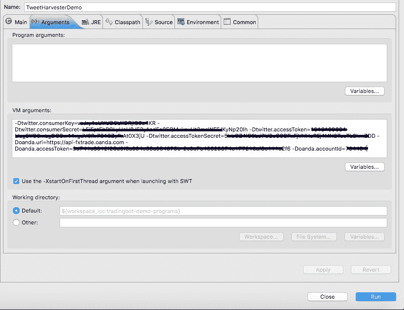 带有系统属性的启动配置 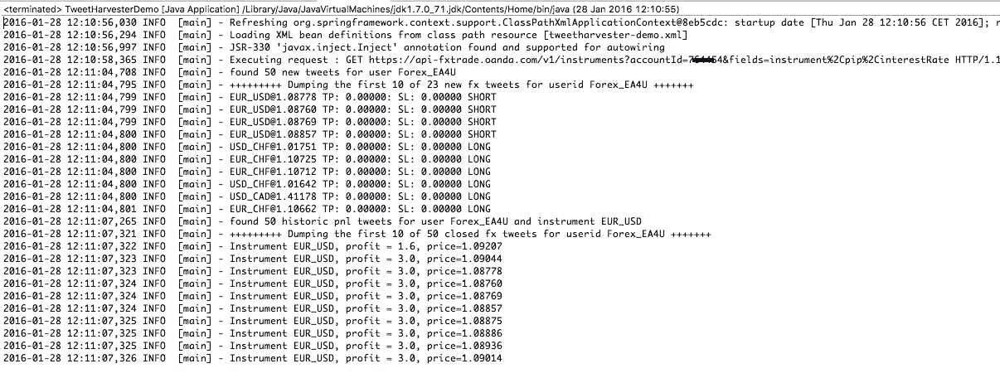 示例输出

1.  http://docs.spring.io/spring-social/docs/1.0.x/reference/html/overview.html↩︎
2.  http://docs.spring.io/spring/docs/current/javadoc-api/org/springframework/jms/core/JmsTemplate.html↩︎
3.  http://docs.spring.io/spring/docs/current/javadoc-api/org/springframework/jdbc/core/JdbcTemplate.html↩︎
4.  https://dev.twitter.com/overview/documentation↩︎
5.  http://docs.spring.io/spring-social-twitter/docs/1.0.5.RELEASE/api/org/springframework/social/twitter/api/impl/TwitterTemplate.html↩︎
6.  https://twitter.com/SignalFactory↩︎
7.  https://twitter.com/ZuluTrader101↩︎
8.  https://dev.twitter.com/rest/public/search↩︎


9.  https://en.wikipedia.org/wiki/Double-checked_locking↩︎

10.  https://twitter.com/Forex_EA4U↩︎

## 9. 策略实施

是时候为我们的交易机器人插上翅膀，让它飞起来了！其实，我们想说的是，现在该为机器人增加能力，使其能够根据一套我们称之为策略的规则，来决定是否下单。简而言之，我们希望为机器人添加分析能力，来判断是买入、卖出某个货币对，还是按兵不动，等待合适时机。这些分析可以基于多种外部参数，例如：

- 市场数据

- 新闻事件

- 社交媒体动态

- 技术分析

- 市场情绪

- 等等

一个策略可以完全基于纯技术分析，分析一段时间内的价格走势；也可以基于上述所有参数或其组合的实时分析。例如，一个复杂策略可以建立在社交媒体动态的实时分析之上，以确定情绪指数（一个基于我们周围正面信息多少的假想指数），并结合市场数据来得出交易决策。它既可以简单到单维度分析，也可以复杂到多变量分析。可能性是无限的！

在本章中，我们将尝试实施几个策略：一个基于推特动态分析，另一个是交易者更常用的策略。我们将对这些策略进行编程，并将其集成到我们的交易机器人中，使其具备生成交易信号的能力，进而下达订单。

在深入探讨这些策略之前，我们想借此机会简要讨论一下多种策略生成 `TradingDecision` 的设计过程。这些决策会被放入队列中，然后由 `OrderExecutionService` 取出这些 `TradingDecision` 消息。这些消息是如何处理的，在**第 6 章**中有详细讨论。

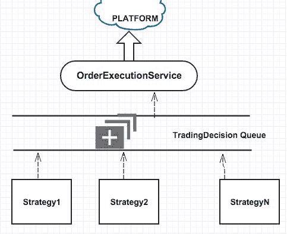 交易信号生成

***免责声明***：*本章讨论的策略纯属讨论和演示目的。开发者在实际交易环境中应用前，必须运用自己的推理和判断。在任何情况下，作者均不对因部署本章讨论的策略而产生的任何直接、间接、偶然、特殊、惩罚性或后果性损害承担责任。*

### 9.1 复制推特策略

该策略旨在盲目复制或完全反向操作推特用户刚刚发布的、与新交易相关的推文。其工作流程如下：

- 利用我们在上一章开发的工具和知识，我们在推特上关注一组用户。这些用户经常发布具有预定义结构的新交易和关闭交易消息。通过编写处理器，可以解析这些消息并创建 `NewFxTradeTweet` 或 `CloseFxTradeTweet` 对象。我们研究并分析了`@SignalFactory`和`@ZuluTrader101`这两个用户的推文。

- 我们创建一个定时任务，用于搜索这些用户的新推文。当发现一条新交易推文并成功解析为 `NewFxTradeTweet` 对象时，我们会搜索同一用户关于该交易工具的历史推文，看其之前是建议*做多*还是*做空*。

- 我们解析历史推文集合，创建一批 `CloseFxTradeTweet` 对象。我们知道，每个 `CloseFxTradeTweet` 都有一个包含盈亏数值的属性。如果找不到该数值，则默认为 0.0。

- 我们分析所有历史交易中盈利和亏损的比例。

- 如果分析结果表明，该用户过去对此类交易的建议准确率超过 75%，我们就完全按照他最近这次交易的建议来操作。反之，如果分析表明他超过 75% 的时间都是错误的，我们就进行完全相反的操作。对于其他任何情况，我们不采取进一步决策，忽略该推文。同时，我们还需要确保分析至少 4 条历史推文，以提高决策的准确性。

75% 的准确率和选取 4 条推文的标准是随意设定的，可以根据不同的部署环境而变化。

让我们看看尝试实现此策略的代码。

```java
@TradingStrategy
public class CopyTwitterStrategy<T> implements TweetHarvester<T> {

    @Resource
    Map<String, FXTweetHandler<T>> tweetHandlerMap;
    @Resource(name = "orderQueue")
    BlockingQueue<TradingDecision<T>> orderQueue;
    private static final Logger LOG = Logger.getLogger(CopyTwitterStrategy.class);
    private ExecutorService executorService = null;
    private static final double ACCURACY_DESIRED = 0.75;
    private static final int MIN_HISTORIC_TWEETS = 4;

    @PostConstruct
    public void init() {
        this.executorService = Executors.newFixedThreadPool(tweetHandlerMap.size());
    }
```

```java
class TradingDecision<T> {
    TradingDecision<T> analyseHistoricClosedTradesForInstrument(
        Collection<CloseFXTradeTweet<T>> closedTrades, 
        NewFXTradeTweet<T> newTrade) {
        int lossCtr = 0;
        int profitCtr = 0;
        for (CloseFXTradeTweet<T> closedTrade : closedTrades) {
            if (closedTrade.getProfit() <= 0) {
                lossCtr++;
            } else {
                profitCtr++;
            }
        }
        TradingSignal signal = TradingSignal.NONE;
        if ((lossCtr != 0 || profitCtr != 0) && closedTrades.size() >= MIN_HISTORIC_TWEETS) {
            double profitAccuracy = profitCtr / ((profitCtr + lossCtr) * 1.0);
            double lossAccuracy = 1.0 - profitAccuracy;
            if (profitAccuracy >= ACCURACY_DESIRED) {
                signal = newTrade.getAction();
                return new TradingDecision<T>(newTrade.getInstrument(), signal,
                    newTrade.getTakeProfit(), newTrade.getStopLoss(),
                    newTrade.getPrice(), TradingDecision.SRCDECISION.SOCIAL_MEDIA);
            } else if (lossAccuracy >= ACCURACY_DESIRED) {
                signal = newTrade.getAction().flip();
                final double takeProfit = newTrade.getTakeProfit() != 0 ?
                    newTrade.getPrice() + (newTrade.getPrice() - newTrade.getTakeProfit()) :
                    newTrade.getTakeProfit();
                final double stopLoss = newTrade.getStopLoss() != 0.0 ?
                    newTrade.getPrice() + (newTrade.getPrice() - newTrade.getStopLoss()) :
                    newTrade.getStopLoss();
                return new TradingDecision<T>(newTrade.getInstrument(),
                    signal, takeProfit, stopLoss, newTrade.getPrice(),
                    TradingDecision.SRCDECISION.SOCIAL_MEDIA);
            }
        }
        return new TradingDecision<T>(newTrade.getInstrument(), signal);
    }

    // 由调度器调用
    public synchronized void harvestAndTrade() {
        for (final String userId : tweetHandlerMap.keySet()) {
            this.executorService.submit(new Callable<Void>() {
                @Override
                public Void call() throws Exception {
                    Collection<NewFXTradeTweet<T>> newTradeTweets = harvestNewTradeTweets(userId);
                    for (NewFXTradeTweet<T> newTradeTweet : newTradeTweets) {
                        Collection<CloseFXTradeTweet<T>> pnlTweets =
                            harvestHistoricTradeTweets(userId, newTradeTweet.getInstrument());
                        TradingDecision<T> tradeDecision =
                            analyseHistoricClosedTradesForInstrument(pnlTweets, newTradeTweet);
                        if (tradeDecision.getSignal() != TradingSignal.NONE) {
                            orderQueue.offer(tradeDecision);
                        }
                    }
                    return null;
                }
            });
        }
    }

    @Override
    public Collection<NewFXTradeTweet<T>> harvestNewTradeTweets(String userId) {
        FXTweetHandler<T> tweetHandler = tweetHandlerMap.get(userId);
        if (tweetHandler == null) {
            return Collections.emptyList();
        }
        Collection<Tweet> tweets = tweetHandler.findNewTweets();
        if (tweets.size() > 0) {
            LOG.info(String.format("为用户 %s 发现了 %d 条新推文", userId, tweets.size()));
        } else {
            return Collections.emptyList();
        }
        Collection<NewFXTradeTweet<T>> newTradeTweets = Lists.newArrayList();
        for (Tweet tweet : tweets) {
            FXTradeTweet<T> tradeTweet = tweetHandler.handleTweet(tweet);
            if (tradeTweet instanceof NewFXTradeTweet) {
                newTradeTweets.add((NewFXTradeTweet<T>) tradeTweet);
            }
        }
        return newTradeTweets;
    }

    @Override
    public Collection<CloseFXTradeTweet<T>> harvestHistoricTradeTweets(
        String userId, TradeableInstrument<T> instrument) {
        FXTweetHandler<T> tweetHandler = tweetHandlerMap.get(userId);
        if (tweetHandler == null) {
            return Collections.emptyList();
        }
        Collection<Tweet> tweets = tweetHandler.findHistoricPnlTweetsForInstrument(instrument);
        if (tweets.size() > 0) {
            LOG.info(String.format("为用户 %s 和产品 %s 发现了 %d 条历史损益推文",
                tweets.size(), userId, instrument.getInstrument()));
        } else {
            return Collections.emptyList();
        }
        Collection<CloseFXTradeTweet<T>> pnlTradeTweets = Lists.newArrayList();
        for (Tweet tweet : tweets) {
            FXTradeTweet<T> tradeTweet = tweetHandler.handleTweet(tweet);
            if (tradeTweet instanceof CloseFXTradeTweet) {
                pnlTradeTweets.add((CloseFXTradeTweet<T>) tradeTweet);
            }
        }
        return pnlTradeTweets;
    }
}
```

首先，我们用自定义注解`@TradingStrategy`标注该类。通过这种方式，我们表明了一个声明：该类明确实现了一种交易策略。当某些类专门为实现特定任务而编写，但又无法绑定到某个接口定义时，这样做始终是一个好习惯。在 Java 1.5 之前，可以通过声明标记接口达到同样的效果。

```java
@Retention(RetentionPolicy.RUNTIME)
@Target(ElementType.TYPE)
public @interface TradingStrategy {
}
```

回到我们的策略类`CopyTwitterStrategy`，在讨论具体实现之前，我们先指出由 Spring 自动注入并可用的资源。这些资源包括：

- `orderQueue`：这是一个队列，可以将`TradingDecision`放入其中，然后由`OrderExecutionService`拾取（请参考本章开头的图示）。

- `tweetHandlerMap`：这是一个存储 Twitter 用户 ID 及其对应处理程序的映射，我们在上一章中已详细讨论过。我们以此作为起点，根据映射中的用户 ID 查找所有推文，然后委托相应的处理程序进行分析。

由`@PostConstruct`注解的`init()`方法会在 Bean 完全初始化后由 Spring 自动调用。在这里，我们借此机会初始化`ExecutorService`，稍后我们会回过来讨论它。

该类中的所有操作都始于`harvestAndTrade()`方法。正如下一章将要讨论的，该方法由 Spring 任务调度器在每个时间间隔`T`后自动调用，并且在 Spring 配置文件中进行配置。该方法使用了`synchronized`关键字，以确保不会有多于一个线程同时执行该方法。顾名思义，该方法会为我们配置的每个用户收集推文并生成交易决策。在方法内部，我们遍历`tweetHandlerMap`中的所有条目，并向`ExecutorService`提交一个`Callable`。这个`Callable`在`call()`方法中为给定用户执行以下逻辑：

- 查找所有与新交易相关的推文，并将其成功解析，从而创建一组`NewFXTradeTweet`对象（请参阅前一章，其中我们讨论了用于查找这些推文并解析它们的搜索 API）。

- 对于每个`NewFXTradeTweet`对象，仅收集与指定产品相关的已平仓交易推文。

- 将这些推文的分析工作委托给`analyseHistoricClosedTradesForInstrument`方法，该方法计算用户的准确率并生成一个`TradingDecision`。在此提醒一下，准确率是指用户以往交易中正确判断的百分比。这正是我们之前在本节讨论的策略核心。