# 排版结果

`analyseHistoricClosedTradesForInstrument`方法值得一些解释。在该方法开始时，我们计算准确率。为此，我们首先通过遍历旧平仓交易的集合来获取所有亏损或盈利的交易数量。`closedTrade.getProfit()`方法在这方面帮助我们。然后，只有当平仓交易数量大于或等于最小阈值（此处为 4）时，我们才继续。

假设：

*   `P` = 盈利交易的数量。
*   `L` = 亏损交易的数量。
*   `N` = 找到的平仓交易总数。

满足 `P + L = N`

*   准确率 `R = P / N`
*   失误率 `M = 1 - R`

因此，如果`R`大于或等于期望准确率的阈值（此处为`0.75`），我们便按照用户的推文执行操作。例如，如果用户建议以某个价格卖出某个货币对，我们就照做。另一方面，如果`M`大于或等于阈值，我们则执行相反的操作。例如，如果用户建议卖出某个货币对，我们则以给定价格买入该货币对。止损和止盈水平的计算需要重新调整。由于用户最初建议卖出该货币对，并会在价格下方`P`点设置止盈，我们现在需要反转操作，将其设置在价格上方`P`点的位置。同样的逻辑适用于止损水平。

这结束我们对`Copy Twitter Strategy`的讨论。该策略的核心（即准确率计算）基于一个非常简单的数学计算。许多人可能会认为这过于简单，并且规避了为得出更准确决策可能需要的统计分析。这可能是非常正确的，但我想再次重申，这仅用于演示目的。本节的关键目标是演示：

1.  与 Twitter 的集成以及对推文的分析。
2.  使用简单的代码/算法对推文进行一些数学分析，并得出交易信号。
3.  将此信号放入订单队列中，以便由`OrderExecutionService`进一步处理，后者最终负责下达订单。

### 9.2 Fade The Move Strategy

在本节中，我们将讨论并实现一个非常简单的`Fade the Move`策略版本。我们的策略实现如下：

*   策略初始化后，我们为配置中注入的预定义工具创建报价数据的订阅。
*   在每段时间`T`（例如 15 分钟，即当前配置中的值）之后，我们检查该时间段开始和结束时的价格之间的点数差的绝对值是否已超过一个配置值`V`点（例如 45 点，即当前配置中的值）。
*   如果该值已超过`V`点，我们则在当前市场趋势的相反方向、距离当前价格`D`点（例如 25 点，即当前配置中的值）的位置下一个限价单。例如，如果 EURUSD 在过去 15 分钟内从 1.0815（起始价格）跃升了 55 个点至 1.087（当前价格），我们则在 1.0895（1.087 + 0.0025）的价格下一个卖出 EURUSD 的限价单。
*   我们设置一个 10 点的止盈目标（如果限价单在 1.0895 成交，则在 1.0885 止盈）。

现在，让我们直接跳转到源代码，看看策略是如何实现的。

```java
 1 @TradingStrategy
 2 public class FadeTheMoveStrategy < T > {

4  @Autowired
 5  TradingConfig tradingConfig;
 6  @Autowired
 7  InstrumentService < T > instrumentService;
 8  @Resource(name = "orderQueue")
 9  BlockingQueue < TradingDecision < T >> orderQueue;
10  private final Collection < TradeableInstrument < T >> instruments;

12  private final Map < TradeableInstrument < T > ,
13  Cache < DateTime,
14  MarketDataPayLoad < T >>> instrumentRecentPricesCache = Maps
15  .newHashMap();

17  public FadeTheMoveStrategy(Collection < TradeableInstrument < T >> instruments) {
18   this.instruments = instruments;
19  }

21  @PostConstruct
22  public void init() {
23   for (TradeableInstrument < T > instrument: instruments) {
24    Cache < DateTime, MarketDataPayLoad < T >> recentPricesCache =
25     CacheBuilder.newBuilder().expireAfterWrite(
26      tradingConfig.getFadeTheMovePriceExpiry(), TimeUnit.MINUTES)
27     . < DateTime, MarketDataPayLoad < T >> build();
28    instrumentRecentPricesCache.put(instrument, recentPricesCache);
29   }
30  }

32  @Subscribe
33  @AllowConcurrentEvents
34  public void handleMarketDataEvent(MarketDataPayLoad < T > marketDataPayLoad) {
35   if (instrumentRecentPricesCache.containsKey(
36     marketDataPayLoad.getInstrument())) {
37    instrumentRecentPricesCache.get(marketDataPayLoad.getInstrument())
38     .put(marketDataPayLoad.getEventDate(), marketDataPayLoad);
39   }
40  }
```


```java
42  // 由调度器调用
43  public void analysePrices() {
44   for (Map.Entry < TradeableInstrument < T > , Cache < DateTime,
45    MarketDataPayLoad < T >>> entry: instrumentRecentPricesCache.entrySet()) {
46    SortedMap < DateTime, MarketDataPayLoad < T >> sortedByDate =
47     ImmutableSortedMap.copyOf(entry.getValue().asMap());
48    if (sortedByDate.isEmpty()) {
49     continue;
50    }
51    Double pipJump = calculatePipJump(sortedByDate.values(), entry.getKey());
52    Double absPipJump = Math.abs(pipJump);
53    if (absPipJump >= tradingConfig.getFadeTheMoveJumpReqdToTrade()) {
54     MarketDataPayLoad < T > lastPayLoad =
55      sortedByDate.get(sortedByDate.lastKey());
56     Double pip = this.instrumentService.getPipForInstrument(entry.getKey());
57     double takeProfitPrice;
58     double limitPrice;
59     TradingSignal signal = null;
60     if (Math.signum(pipJump) > 0) { // 做空
61      signal = TradingSignal.SHORT;
62      limitPrice = lastPayLoad.getBidPrice() +
63       tradingConfig.getFadeTheMoveDistanceToTrade() * pip;
64      takeProfitPrice = limitPrice -
65       tradingConfig.getFadeTheMovePipsDesired() * pip;
66     } else {
67      signal = TradingSignal.LONG;
68      limitPrice = lastPayLoad.getAskPrice() -
69       tradingConfig.getFadeTheMoveDistanceToTrade() * pip;
70      takeProfitPrice = limitPrice +
71       tradingConfig.getFadeTheMovePipsDesired() * pip;
72     }
73     this.orderQueue.offer(new TradingDecision < T > (entry.getKey(), signal,
74      takeProfitPrice, 0.0, limitPrice,
75      TradingDecision.SRCDECISION.FADE_THE_MOVE));
76     entry.getValue().asMap().clear();
77     /*清仓价格，避免对旧决策持续操作*/
78    }
79   }
80  }
81
82  private double calculatePipJump(Collection < MarketDataPayLoad < T >> prices,
83   TradeableInstrument < T > instrument) {
84   List < MarketDataPayLoad < T >> priceList = Lists.newArrayList(prices);
85   MarketDataPayLoad < T > startPrice = priceList.get(0);
86   MarketDataPayLoad < T > lastPrice = priceList.get(priceList.size() - 1);
87   Double pip = this.instrumentService.getPipForInstrument(instrument);
88   Double pipJump = (lastPrice.getBidPrice() - startPrice.getBidPrice()) / pip;
89   return pipJump;
90  }
91 }
```

我们从分析策略类中自动注入的依赖开始讨论。资源 `orderQueue` 是本章开头讨论过的明显包含项。策略中的 `instrumentService` 类被用于为每个交易品种提供点值（pip value）。根据我们在 *可交易工具* 一章中的讨论，点（pip）是价格跳动的最低精度值。例如，对于所有日元货币对（含主要货币对），它是 `0.001`；对于 EURUSD、GBPUSD 等交易品种，它是 `0.00001`。我们需要利用这一信息来计算在给定观察区间内价格跳动了多少个点。这一点也基本包含在 `calculatePipJump` 方法中：观察区间的最后一个价格减去第一个价格，再除以该交易品种的点值，就得到了该货币对上涨或下跌的点数。最后一个注入的依赖 `tradingConfig` 为我们提供了在 Spring 配置中为该策略配置的参数，例如：

*   考虑反转交易所需的最小点跳动或回撤，即 `getFadeTheMoveJumpReqdToTrade()` 方法。
*   逆势挂单与当前价格之间的点差距离，即 `getFadeTheMoveDistanceToTrade()` 方法。
*   观察区间的会话时长（分钟），即 `getFadeTheMovePriceExpiry()` 方法。
*   期望的目标盈利点数，用于设定限价单的止盈价格，即 `getFadeTheMovePipsDesired()` 方法。

该类的构造函数接受一个交易品种列表，这些品种是策略的应用对象，并由 Spring 通过构造函数注入。

我们还有一个使用 `@PostConstruct` 注解的方法 `init()`，在该方法中，我们为每个注入的交易品种初始化一个 Guava^(2) 的 `Cache`。该缓存的键（key）是 tick 数据事件的 `DateTime`，值（value）是 `MarketDataPayLoad`。我们还设置了 `expireAfterWrite` 值 `T`，该值由 `tradingConfig.getFadeTheMovePriceExpiry()` 提供，以便条目在 `T` 分钟后自动从缓存中过期。

方法 `handleMarketDataEvent()` 由 `@Subscribe` 注解标注，意味着它会接收所有已解析为 `MarketDataPayLoad` 对象并由 EventBus 分发的 tick 数据事件。接收到后，只有当 `MarketDataPayload` 实例与配置了缓存的交易品种相关时，才会被接受并 `put` 到该交易品种的缓存中。

该策略的主要动作体现在 `analysePrices()` 方法中。该方法由任务调度器每 `T` 分钟调用一次，该值在 Spring 配置中设定。通常情况下，该值应与 `tradingConfig.getFadeTheMovePriceExpiry()` 保持一致。我们首先遍历缓存中配置的所有交易品种。对于每个品种，我们计算在给定时间段内绝对点跳动量。如果点跳动未超过最低阈值（> `getFadeTheMoveJumpReqdToTrade()`），则忽略该品种。如果点跳动超过阈值，我们尝试通过点跳动的正负号判断市场趋势。若为负值，则代表趋势向下，否则向上。对于上升趋势，我们下达 `SHORT`（做空）交易；对于下降趋势，则下达 `LONG`（做多）交易。接着，我们使用 `tradingConfig.getFadeTheMoveDistanceToTrade()` 计算订单的限价（limit price），并使用 `tradingConfig.getFadeTheMovePipsDesired()` 计算止盈价格（take profit price）。

至此，我们对此策略的讨论就结束了。这是一个广为人知的策略，且似乎行之有效。我们应避免将止盈点数设得过大。若该值设定在 10-12 点附近，策略在大多数情况下效果良好。这也是众多市场参与者的普遍观察结论。


### 9.3 动手实践

在本节中，我们将编写一个 Spring 驱动的程序来测试驱动`FadeTheMoveStrategy`。我们将使用一个价格数组来模拟货币对`AUD_CHF`在几分钟内不断上涨的价格。当`analysePrices()`被调用时，价格的跃升应该会导致`orderQueue`上生成一个`SHORT`信号。让我们来看代码和 Spring 配置。

```java
 1 package com.precioustech.fxtrading.tradingbot.strategies;

 3 import java.util.concurrent.BlockingQueue;

 5 import org.joda.time.DateTime;
 6 import org.springframework.context.ApplicationContext;
 7 import org.springframework.context.support.ClassPathXmlApplicationContext;

 9 import com.google.common.eventbus.EventBus;
10 import com.precioustech.fxtrading.TradingDecision;
11 import com.precioustech.fxtrading.instrument.TradeableInstrument;
12 import com.precioustech.fxtrading.marketdata.MarketDataPayLoad;

14 public class FadeTheMoveStrategyDemo {

16  private static double precision = 0.0001;

18  @SuppressWarnings("unchecked")
19  public static void main(String[] args) throws InterruptedException {

21   ApplicationContext appContext =
22    new ClassPathXmlApplicationContext("fadethemove-demo.xml");
23   FadeTheMoveStrategy < String > fadeTheMoveStrategy = appContext.getBean(FadeTheMoveStrategy.class);
24   BlockingQueue < TradingDecision < String >> orderQueue = appContext.getBean(BlockingQueue.class);
25   EventBus eventBus = new EventBus();
26   eventBus.register(fadeTheMoveStrategy);

28   TradeableInstrument < String > audchf = new TradeableInstrument < String > ("AUD_CHF");
29   final double[] audchfPrices = {
30    0.7069,
31    0.7070,
32    0.7073,
33    0.7076,
34    0.7077,
35    0.7078,
36    0.708,
37    0.7082,
38    0.7084,
39    0.7085,
40    0.7086,
41    0.7089,
42    0.7091,
43    0.7093,
44    0.7094,
45    0.7098,
46    0.71,
47    0.7102,
48    0.7105,
49    0.7104,
50    0.7103,
51    0.7105,
52    0.7109,
53    0.7111,
54    0.7112,
55    0.7115,
56    0.7118
57   };
58   DateTime eventStartaudchf = DateTime.now().minusMinutes(10);
59   for (double price: audchfPrices) {
60    eventStartaudchf = eventStartaudchf.plusSeconds(5);
61    eventBus.post(new MarketDataPayLoad < String > (audchf,
62     price - precision, price + precision, eventStartaudchf));
63   }
64   fadeTheMoveStrategy.analysePrices();
65   TradingDecision < String > decision = orderQueue.take();
66   System.out.println(String.format(
67    "策略指示在 %s 上对工具 %s 进行 %s 操作，限价 %2.5f，止盈 %2.5f ",
68    decision.getSignal().name(), decision.getInstrument().getInstrument(),
69    decision.getLimitPrice(), decision.getTakeProfitPrice()));
70  }
71 }
```

以及 Spring 配置

```xml
 1 <?xml version="1.0" encoding="UTF-8"?>
 2 <beans xmlns="http://www.springframework.org/schema/beans"
 3     xmlns:xsi="http://www.w3.org/2001/XMLSchema-instance"
 4     xmlns:context="http://www.springframework.org/schema/context"
 5     xmlns:tx="http://www.springframework.org/schema/tx"
 6     xsi:schemaLocation="http://www.springframework.org/schema/beans
 7     http://www.springframework.org/schema/beans/spring-beans.xsd
 8     http://www.springframework.org/schema/context
 9     http://www.springframework.org/schema/context/spring-context.xsd">
10     <context:annotation-config/>
11     <bean id="tradeableInstrumentList" class="java.util.ArrayList">
12 		<constructor-arg index="0">
13 			<list>
14 				<bean class="com.precioustech.fxtrading.instrument.TradeableInstrument">
15 					<constructor-arg index="0" value="AUD_CHF"/>
16 				</bean>
17 			</list>
18 		</constructor-arg>
19 	</bean>
20 	<bean id="fadeTheMoveStrategy"
21 			class="com.precioustech.fxtrading.tradingbot.strategies.FadeTheMoveStrategy">
22 		<constructor-arg index="0" ref="tradeableInstrumentList"/>
23 	</bean>
24 	<bean id="tradingConfig"
25     		class="com.precioustech.fxtrading.tradingbot.TradingConfig">
26 		<property name="minReserveRatio" value="0.1"/>
27 		<property name="maxAllowedQuantity" value="10"/>
28 		<property name="maxAllowedNetContracts" value="5"/>
29 		<property name="minAmountRequired" value="10.0"/>
30 		<property name="mailTo" value="foobar@gmail.com"/>
31 		<property name="max10yrWmaOffset" value="0.1"/>
32 		<property name="fadeTheMoveJumpReqdToTrade" value="45"/>
33 		<property name="fadeTheMoveDistanceToTrade" value="25"/>
34 		<property name="fadeTheMovePipsDesired" value="10"/>
35 		<property name="fadeTheMovePriceExpiry" value="15"/>
36 	</bean>
37 	<bean id="orderQueue" class="java.util.concurrent.LinkedBlockingQueue"/>
38 	<bean id="instrumentService" class="com.precioustech.fxtrading.instrument.InstrumentService">
39 		<constructor-arg index="0" ref="instrumentDataProvider"/>
40 	</bean>
41 	<bean id="instrumentDataProvider"
42 		class="com.precioustech.fxtrading.oanda.restapi.instrument.OandaInstrumentDataProviderService">
43 		<constructor-arg index="0" value="#{ systemProperties['oanda.url'] }"/>
44 		<constructor-arg index="1" value="#{ systemProperties['oanda.accountId'] }"/>
45 		<constructor-arg index="2" value="#{ systemProperties['oanda.accessToken'] }"/>
46 	</bean>
47 </beans>
```

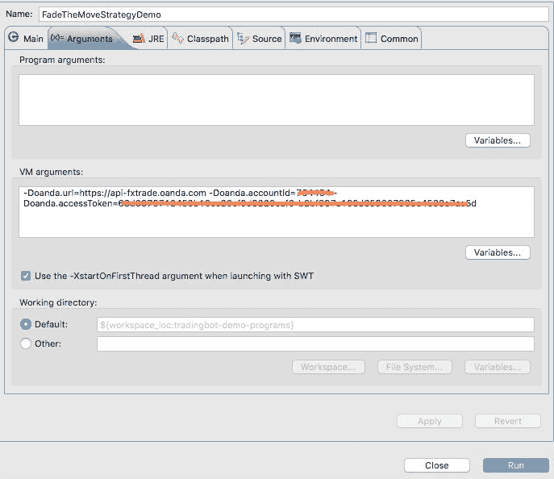 启动配置 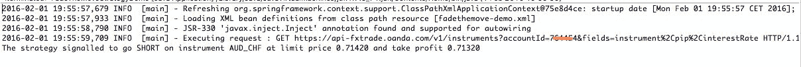 交易信号输出

1.  http://www.investopedia.com/articles/forex/08/pure-fade-trade.asp↩︎
2.  https://github.com/google/guava/wiki/CachesExplained↩︎

## 10. 心跳机制

心跳是任何交易系统的关键要素。任何长时间运行的流式或持久连接都必须通过管道发送心跳，让消费者知道一切正常且连接存活。我们的系统也不例外。简而言之，心跳表明了系统的健康状况。

从理论上讲，机器人应该频繁接收心跳以确保一切正常。如果心跳不规律或超过了预期心跳的等待周期，它会尝试重新连接并恢复被动事件流。

在本章中，我们将讨论心跳、如何处理心跳以及如果停止接收心跳应该怎么做。

### 10.1 HeartBeatPayLoad

每个持久/流式连接都可能具有不同的有效负载来传达连接状态。为了适应这种多样化的负载类型，我们定义了以下 POJO 来对此特性进行建模：

```java
 1 public class HeartBeatPayLoad < T > {

 3  private final T payLoad;
 4  private final String source;

 6  public HeartBeatPayLoad(T payLoad) {
 7   this(payLoad, StringUtils.EMPTY);
 8  }

10  public HeartBeatPayLoad(T payLoad, String source) {
11   this.payLoad = payLoad;
12   this.source = source;
13  }

15  public T getHeartBeatPayLoad() {
16   return this.payLoad;
17  }

19  public String getHeartBeatSource() {
20   return this.source;
21  }
22 }
```

`source`属性标识心跳的来源。这是为了区分系统中不同的心跳来源。例如，在交易机器人系统中，我们至少有两个心跳流，一个用于 Tick 数据，另一个用于交易/订单/账户事件。


### 10.2 流式心跳接口

与其他流式接口类似，我们首先定义接口，规定支持心跳流式传输所需的最小方法集。我们采用与之前完全相同的设计模式：

- 一个启动流式传输的方法。
- 一个停止流式传输的方法。
- 一个处理心跳事件的无尽循环。
- 一个用于向下游消费者分发事件的 `Callback` 接口。

让我们来看定义此契约的接口：

```java
 1 /**
 2  * 提供来自交易平台的流式心跳的服务。平台最终提供的服务可能根本不是流式的，
 3  * 而是某种形式的定期回调，用以表明连接处于活动状态。心跳丢失可能表明无法接收
 4  * 来自交易平台的任何交易/订单事件和/或市场数据。因此，对应用程序的任何监控
 5  * 都可能涉及直接与此服务交互，以触发警报/通知。
 6  *
 7  *
 8  */
 9 public interface HeartBeatStreamingService {

14  /**
15   * 启动服务以接收来自交易平台的心跳。理想情况下，实现应确保不会为同一类型的
16   * 服务创建多个心跳连接/处理器。根据交易平台的不同，可能所有服务共享一个心跳，
17   * 也可能为市场数据、交易/订单事件等服务各自配备专属心跳。
18   */
19  void startHeartBeatStreaming();

24  /**
25   * 停止服务以停止接收心跳。实现必须妥善释放所有资源/连接，以免造成任何资源泄漏。
26   */
27  void stopHeartBeatStreaming();

31  /**
32   *
33   * @return 心跳源标识，用于标识该服务为之提供心跳的源。这对于跟踪所有正在发送心跳
34   *         的源非常有用，可以定期单独监控每个源。在某些平台上，可能所有服务共享
35   *         一个单一心跳服务，此时该标识可能不那么有用。
36   */
37  String getHeartBeatSourceId();
40 }
```

与其它流式接口不同，上述接口额外包含一个方法，要求实现为心跳流提供唯一的源标识。

### 10.3 `HeartBeatStreamingService` 的具体实现

OANDA 通过同一数据流推送心跳事件，即它利用市场数据以及交易/订单/账户事件流，间歇性地推送心跳负载以通报相应流的健康状态。一个示例心跳负载如下所示：

```json
1 {"heartbeat":{"time":"1443968021000000"}}
```

由于 OANDA 的两个数据流都推送相同的心跳负载，因此作为 `OandaEventsStreamingService` 和 `OandaMarketDataStreamingService` 基类的抽象类 `OandaStreamingService` 实现了该接口，并提供了处理这些心跳的基础框架。现在我们专门来看这个抽象类中三个接口方法的实现。此外，我们还将了解解析 JSON 负载的方法以及构造函数：

```java
 1 public abstract class OandaStreamingService
 2 implements HeartBeatStreamingService {
 3  protected OandaStreamingService(String accessToken,
 4   HeartBeatCallback < DateTime > heartBeatCallback, String heartbeatSourceId) {
 5   this.hearbeatSourceId = heartbeatSourceId;
 6   this.heartBeatCallback = heartBeatCallback;
 7   ...
 8  }

10  protected void handleHeartBeat(JSONObject streamEvent) {
11   Long t = Long.parseLong(((JSONObject) streamEvent.get(heartbeat)).get(time).toString());
12   heartBeatCallback.onHeartBeat(new HeartBeatPayLoad < DateTime > (new DateTime(TradingUtils.toMillisFromNanos(t)), heartbeatSourceId));
13  }

16  @Override
17  public void stopHeartBeatStreaming() {
18   stopStreaming();
19  }

21  @Override
22  public void startHeartBeatStreaming() {
23   if (!serviceUp) {
24    startStreaming();
25   }
26  }

28  @Override
29  public String getHeartBeatSourceId() {
30   return this.hearbeatSourceId;
31  }

33   ...
34   ...
35 }
```

`startHeartBeatStreaming()` 和 `stopHeartBeatStreaming()` 方法分别委托给 `startStreaming()` 和 `stopStreaming()`，后者进一步委托给底层方法来启动/停止主数据流。因此，对于市场数据流，启动和停止主数据流的方法是 `startMarketDataStreaming()` 和 `stopMarketDataStreaming()`。这样做是合理的，因为心跳与主数据流事件耦合在一起，两者共存。停止心跳流必须停止主数据流，反之亦然。

`handleHeartBeat()` 方法解析 JSON 负载，并创建一个 `HeartBeatPayLoad<DateTime>` 实例。然后将其传递给一个 `HeartBeatCallback` 实例（我们将在下面讨论）以分发给下游消费者。心跳负载中的时间戳是心跳时间戳，正如我们稍后将看到的，它用于判断数据流是处于活动状态还是已死。

### 10.4 `HeartBeatCallback` 接口

与我们迄今为止看到的其他 `Callback` 类似，`HeartBeatCallback` 并无不同。它由直接从平台接收流式事件的提供者实现直接调用。解析事件并创建 `HeartBeatPayLoad` 实例后，将调用 `onHeartBeat()` 方法。让我们直接看看源代码：

```java
1 public interface HeartBeatCallback<T> {

3  void onHeartBeat(HeartBeatPayLoad<T> payLoad);
4 }
```

上述接口的实现与我们之前讨论过的其他 `Callback` 接口类似。`HeartBeatPayLoad` 通过 `EventBus` 分发给下游消费者：

```java
 1 public class HeartBeatCallbackImpl < T > implements HeartBeatCallback < T > {

 3  private final EventBus eventBus;

 5  public HeartBeatCallbackImpl(EventBus eventBus) {
 6   this.eventBus = eventBus;
 7  }

 9  @Override
10  public void onHeartBeat(HeartBeatPayLoad < T > payLoad) {
11   this.eventBus.post(payLoad);
12  }

14 }
```


### 10.5 `DefaultHeartBeatService`

我们现在准备讨论这个服务，它使用心跳负载来跟踪各种流式连接的健康状况，并尝试在它们停止发送心跳时恢复它们。该服务`DefaultHeartBeatService`继承自`AbstractHeartBeatService`，它通过`EventBus`消费由`HeartBeatCallback`发布的心跳负载。每个为给定源接收的心跳，都帮助服务跟踪该特定流的健康状况。

我们首先看一下构造函数，它被注入了所有需要跟踪的`HeartBeatStreamingService`实例的集合。

```
 1 protected abstract boolean isAlive(HeartBeatPayLoad < T > payLoad);
 2 protected static final long MAX_HEARTBEAT_DELAY = 60000 L;
 3 private final Map < String, HeartBeatStreamingService > heartBeatProducerMap =
 4  Maps.newHashMap();
 5 private final Map < String, HeartBeatPayLoad < T >> payLoadMap =
 6  Maps.newConcurrentMap();
 7 volatile boolean serviceUp = true;
 8 protected final Collection < HeartBeatStreamingService >
 9  heartBeatStreamingServices;
10 protected final long initWait = 2000 L;
11 long warmUpTime = MAX_HEARTBEAT_DELAY;

13 public AbstractHeartBeatService(Collection < HeartBeatStreamingService >
14  heartBeatStreamingServices) {
15  this.heartBeatStreamingServices = heartBeatStreamingServices;
16  for (HeartBeatStreamingService heartBeatStreamingService:
17   heartBeatStreamingServices) {
18   this.heartBeatProducerMap.put(
19    heartBeatStreamingService.getHeartBeatSourceId(),
20    heartBeatStreamingService);
21  }
22 }
```

构造函数还使用每个`HeartBeatStreamingService`实例填充`heartBeatProducerMap`，以其在映射中的源 ID 作为键。`payLoadMap`是一个映射，它为给定的心跳源存储了最后一个`HeartBeatPayLoad`对象。它通过`EventBus`订阅者方法不断获取来自不同源的心跳。

```
1 @Subscribe
2 @AllowConcurrentEvents
3 public void handleHeartBeats(HeartBeatPayLoad<T> payLoad) {
4 	this.payLoadMap.put(payLoad.getHeartBeatSource(), payLoad);
5 }
```

我们现在需要的，是一个后台线程，用于定期检查上一次负载的接收时间，如果它超过了允许的心跳延迟阈值，则通过调用`startHeartBeatStreaming()`方法来尝试恢复它。

```
 1 @PostConstruct
 2 public void init() {
 3  this.heartBeatsObserverThread.start();
 4 }

 6 final Thread heartBeatsObserverThread = new Thread(new Runnable() {

 8  private void sleep() {
 9   try {
10    Thread.sleep(warmUpTime); /*等待流正常启动*/
11   } catch (InterruptedException e1) {
12    LOG.error(e1);
13   }
14  }

16  @Override
17  public void run() {
18   while (serviceUp) {
19    sleep();
20    for (Map.Entry < String, HeartBeatStreamingService > entry:
21     heartBeatProducerMap.entrySet()) {
22     long startWait = initWait; // 从 2 秒开始
23     while (serviceUp && !isAlive(payLoadMap.get(entry.getKey()))) {
24      entry.getValue().startHeartBeatStreaming();
25      LOG.warn(String
26       .format("心跳源 %s 未响应。" +
27        "已重启，将在 %d 毫秒后监听心跳",
28        entry.getKey(), startWait));
29      try {
30       Thread.sleep(startWait);
31      } catch (InterruptedException e) {
32       LOG.error(e);
33      }
34      // 等待时间加倍，但不超过 MAX_HEARTBEAT_DELAY
35      startWait = Math.min(MAX_HEARTBEAT_DELAY, 2 * startWait);
36     }
37    }
38   }
39  }
40 }, "HeartBeatMonitorThread");
```

被`@PostConstruct`注解标记的方法`init()`启动后台线程`heartBeatsObserverThread`。该线程定期唤醒，遍历`heartBeatProducerMap`中的每个条目，检查流式服务是否存活。执行检查的`isAlive`方法由`DefaultHeartBeatService`实现。

```
 1 public class DefaultHeartBeatService
 2 extends AbstractHeartBeatService < DateTime > {

 4  public DefaultHeartBeatService(Collection < HeartBeatStreamingService >
 5   heartBeatStreamingServices) {
 6   super(heartBeatStreamingServices);
 7  }

 9  @Override
10  protected boolean isAlive(HeartBeatPayLoad < DateTime > payLoad) {
11   return payLoad != null && (DateTime.now().getMillis() -
12    payLoad.getHeartBeatPayLoad().getMillis()) < MAX_HEARTBEAT_DELAY;
13  }

15 }
```

从上面的代码可以看出，此服务期望一个`HeartBeatPayLoad<DateTime>`。`isAlive`实现使用包含`DateTime`的负载，然后进行一些日期计算，以确定自上次接收负载以来的时间是否超过了`MAX_HEARTBEAT_DELAY`。如果未超过，则认为流式连接是存活的，否则认为不存活。回到上面的后台线程代码，如果`isAlive`返回`false`，则通过调用`startHeartBeatStreaming()`尝试重新启动流式连接。如果流式连接成功重启，那么对`handleHeartBeats`方法的发布应该恢复，并且`isAlive`应该开始返回`true`。

在某些情况下，其他平台可能会向下游发送一个虚拟对象或字符串来表明其正在发送心跳。在这种情况下，`DefaultHeartBeatService`可能是不够的。对于这些情况，我们可能需要创建一个包装负载，其中包含原始负载以及它被`handleHeartBeats`方法接收的时间。然后，可能需要将这个包装负载传递给另一个实现，该实现继承自`AbstractHeartBeatService`并相应实现`isAlive`。

这就结束了对机器人心跳机制的讨论。心跳是机器人极其重要的功能，因为它们告诉我们流（这些流是机器人运行的核心）的健康状况。许多策略可能依赖于行情数据流，因此我们不能让它长时间宕机。同样，我们需要保持交易/订单/账户流正常运转，以便缓存与平台同步。


### 10.6 动手实践

本节我们将编写一个演示程序，展示 `DefaultheartBeatService` 如何在检测到流中断后重新激活已失效的流。

```java
 1 package com.precioustech.fxtrading.heartbeats;

 3 import java.util.Collection;

 5 import org.apache.commons.lang3.StringUtils;
 6 import org.apache.log4j.Logger;
 7 import org.joda.time.DateTime;

 9 import com.google.common.collect.Lists;
10 import com.google.common.eventbus.AllowConcurrentEvents;
11 import com.google.common.eventbus.EventBus;
12 import com.google.common.eventbus.Subscribe;
13 import com.precioustech.fxtrading.instrument.TradeableInstrument;
14 import com.precioustech.fxtrading.marketdata.MarketEventCallback;
15 import com.precioustech.fxtrading.marketdata.MarketEventHandlerImpl;
16 import com.precioustech.fxtrading.oanda.restapi.streaming.marketdata.OandaMarketDataStreamingService;
17 import com.precioustech.fxtrading.streaming.heartbeats.HeartBeatStreamingService;

19 public class DefaultHeartBeatServiceDemo {

21  private static final Logger LOG = Logger.getLogger(DefaultHeartBeatServiceDemo.class);

23  private static void usageAndValidation(String[] args) {
24   if (args.length != 3) {
25    LOG.error("用法: DefaultHeartBeatServiceDemo <url> <accountid> <accesstoken>");
26    System.exit(1);
27   } else {
28    if (!StringUtils.isNumeric(args[1])) {
29     LOG.error("参数 2 应为数字");
30     System.exit(1);
31    }
32   }
33  }

35  private static class DataSubscriber {

37   @Subscribe
38   @AllowConcurrentEvents
39   public void handleHeartBeats(HeartBeatPayLoad < DateTime > payLoad) {
40    LOG.info(
41     String.format("心跳于 %s 从源 %s 接收",
42      payLoad.getHeartBeatPayLoad(), payLoad.getHeartBeatSource()));
43   }

45  }

47  @SuppressWarnings("unchecked")
48  public static void main(String[] args) throws Exception {
49   usageAndValidation(args);
50   final String url = args[0];
51   final Long accountId = Long.parseLong(args[1]);
52   final String accessToken = args[2];
53   final String heartbeatSourceId = "DEMO_MKTDATASTREAM";

55   TradeableInstrument < String > eurusd = new TradeableInstrument < String > ("EUR_USD");

57   Collection < TradeableInstrument < String >> instruments = Lists.newArrayList(eurusd);

59   EventBus eventBus = new EventBus();

61   MarketEventCallback < String > mktEventCallback =
62    new MarketEventHandlerImpl < String > (eventBus);
63   HeartBeatCallback < DateTime > heartBeatCallback =
64    new HeartBeatCallbackImpl < DateTime > (eventBus);

66   OandaMarketDataStreamingService mktDataStreaminService =
67    new OandaMarketDataStreamingService(url, accessToken,
68     accountId, instruments, mktEventCallback, heartBeatCallback, heartbeatSourceId);
69   mktDataStreaminService.startMarketDataStreaming();
70   Collection < HeartBeatStreamingService > heartbeatstreamingLst = Lists.newArrayList();
71   heartbeatstreamingLst.add(mktDataStreaminService);
72   DefaultHeartBeatService heartBeatService = new DefaultHeartBeatService(heartbeatstreamingLst);
73   eventBus.register(heartBeatService);
74   eventBus.register(new DataSubscriber());
75   heartBeatService.init();

77   heartBeatService.warmUpTime = 5000 L;
78   Thread.sleep(30000 L);
79   mktDataStreaminService.stopMarketDataStreaming();
80   Thread.sleep(20000 L);
81  }

83 }
```

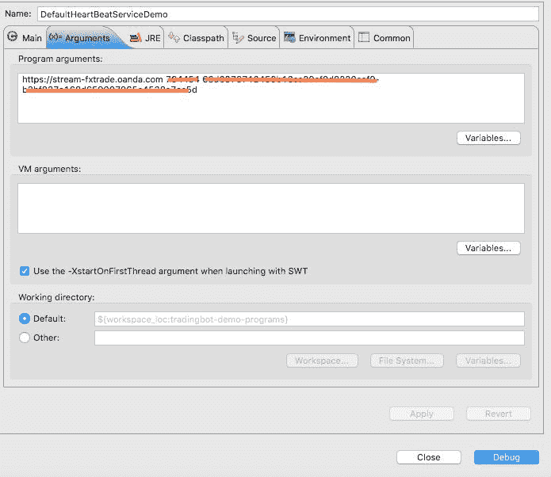 启动配置

一段时间后市场数据流被停止。`heartBeatService` 随即尝试重新激活该流并成功实现。我们看到连接成功重建后，再次接收到心跳。

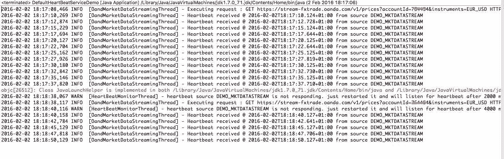 示例输出

## 11\. 邮件通知

本章将讨论邮件通知功能，该功能在机器人内部触发特定事件时通知用户，极为实用。这些通知与我们第 7 章讨论的交易/订单/账户事件紧密关联。因此，与同章讨论的其他处理程序类似，邮件通知组件也通过 `EventBus` 接收相同的输入负载。当用户操作需要紧急处理时，这些通知非常有用。例如，OANDA 平台可能触发 `MARGIN_CALL_ENTER`^(1) 事件，表明账户面临紧急追加保证金要求。另一方面，这些通知也是跟踪自动化交易机器人运行状态的有效工具。通过开启交易、订单和账户事件的通知，用户可以清晰掌握机器人内部的运行状态。

### 11.1 通知设计

如上所述，交易/订单和账户事件处理器处理的事件也会同时发送至邮件通知服务。该服务 `EventEmailNotifier` 处理此事件，并在为该事件配置了相应的 `EmailContentGenerator` 时生成邮件。`EmailContentGenerator` 实现负责生成邮件主题和正文（即 `EmailPayLoad`），不同事件可对应不同的实现。

首先来看存储邮件内容生成结果的 POJO 类 `EmailPayLoad`。

#### 11.1.1 EmailPayLoad POJO 类

```java
 1 public class EmailPayLoad {
 2  private final String subject;
 3  private final String body;

 5  public EmailPayLoad(String subject, String body) {
 6   super();
 7   this.subject = subject;
 8   this.body = body;
 9  }

11  public String getSubject() {
12   return subject;
13  }

15  public String getBody() {
16   return body;
17  }

19 }
```

`EmailPayLoad` 包含邮件的主题和正文，通过 `JavaMail` API 发送，并在 Spring 配置中进行配置。

#### 11.1.2 EmailContentGenerator 接口

```java
1 public interface EmailContentGenerator<T> {

3  EmailPayLoad generate(EventPayLoad<T> payLoad);

5 }
```


#### 11.1.3 示例实现

在本节中，我们将讨论 `EmailContentGenerator` 接口的一些示例实现。首先，我们来看一个实现，它在平台生成以下交易事件时发送邮件：

- 交易已平仓
- 触发止损
- 触发止盈

例如，当触及止盈水平时，我们可以预期收到类似如下的 json 响应：

```json
{
  "id":10003,
  "accountId":234567,
  "time":"1443968061000000",
  "type":"TAKE_PROFIT_FILLED",
  "tradeId":1800805337,
  "instrument":"USD_CHF",
  "units":3000,
  "side":"sell",
  "price":1.00877,
  "pl":3.48,
  "interest":0.0002,
  "accountBalance":5912.5829
}
```

处理来自 OANDA 平台交易事件的 `TradeEventHandler` 同样实现了 `EmailContentGenerator` 接口。因此，生成 `EmailPayLoad` 的方法如下所示：

```java
@Override
public EmailPayLoad generate(EventPayLoad < JSONObject > payLoad) {
  JSONObject jsonPayLoad = payLoad.getPayLoad();
  TradeableInstrument < String > instrument = new TradeableInstrument < String > (jsonPayLoad.get(
    OandaJsonKeys.instrument).toString());
  final String type = jsonPayLoad.get(OandaJsonKeys.type).toString();
  final long accountId = (Long) jsonPayLoad.get(OandaJsonKeys.accountId);
  final double accountBalance = ((Number) jsonPayLoad.get(OandaJsonKeys.accountBalance)).doubleValue();
  final long tradeId = (Long) jsonPayLoad.get(OandaJsonKeys.tradeId);
  final double pnl = ((Number) jsonPayLoad.get(OandaJsonKeys.pl)).doubleValue();
  final double interest = ((Number) jsonPayLoad.get(OandaJsonKeys.interest)).doubleValue();
  final long tradeUnits = (Long) jsonPayLoad.get(OandaJsonKeys.units);
  final String emailMsg = String
    .format("Trade event %s received for account %d. " + "Trade id=%d. Pnl=%5.3f, Interest=%5.3f, Trade Units=%d. " + "Account balance after the event=%5.2f",
      type, accountId, tradeId, pnl, interest, tradeUnits, accountBalance);
  final String subject = String.format(
    "Order event %s for %s", type, instrument.getInstrument());
  return new EmailPayLoad(subject, emailMsg);
}
```

上述代码从 `JSONObject` 中提取了关键信息，例如：

- `pnl`
- `interest`
- `account id`
- `account balance`
- 等等…

并为上方的 json 响应生成了如下邮件正文：

```
Trade event TAKE_PROFIT_FILLED received for account 234567.
Trade id=1800805337. Pnl=3.48, Interest=0, Trade Units=3000.
Account balance after the event=5912.58
```

生成的邮件主题为：

```
Order event TAKE_PROFIT_FILLED for USD_CHF
```

下一个示例涉及订单成交事件。当此类事件发生时，我们可以预期从 OANDA 平台收到如下 json：

```json
{
  "id": 10002,
  "accountId": 123456,
  "time": "1443968041000000",
  "type": "ORDER_FILLED",
  "instrument": "EUR_USD",
  "units": 10,
  "side": "sell",
  "price": 1,
  "pl": 1.234,
  "interest": 0.034,
  "accountBalance": 10000,
  "orderId": 0,
  "tradeReduced": {
    "id": 54321,
    "units": 10,
    "pl": 1.234,
    "interest": 0.034
  }
}
```

处理来自 OANDA 平台订单成交事件的 `OrderFilledEventHandler` 同样实现了 `EmailContentGenerator` 接口。因此，生成 `EmailPayLoad` 的方法如下所示：

```java
@Override
public EmailPayLoad generate(EventPayLoad < JSONObject > payLoad) {
  JSONObject jsonPayLoad = payLoad.getPayLoad();
  TradeableInstrument < String > instrument = new TradeableInstrument < String > (jsonPayLoad
    .containsKey(OandaJsonKeys.instrument) ? jsonPayLoad.get(OandaJsonKeys.instrument).toString() : "N/A");
  final String type = jsonPayLoad.get(OandaJsonKeys.type).toString();
  final long accountId = (Long) jsonPayLoad.get(OandaJsonKeys.accountId);
  final double accountBalance = jsonPayLoad.
  containsKey(OandaJsonKeys.accountBalance) ? ((Number) jsonPayLoad
    .get(OandaJsonKeys.accountBalance)).doubleValue() : 0.0;
  final long orderId = (Long) jsonPayLoad.get(OandaJsonKeys.id);
  final String emailMsg = String.format(
    "Order event %s received on account %d. Order id=%d. " + "Account balance after the event=%5.2f", type,
    accountId, orderId, accountBalance);
  final String subject = String.format(
    "Order event %s for %s", type, instrument.getInstrument());
  return new EmailPayLoad(subject, emailMsg);
}
```

上述代码与前一个示例类似，提取了一些关键信息来准备邮件正文，包括：

- `account id`
- `account balance`
- `order id`

对于我们的示例，将生成以下正文：

```
Order event ORDER_FILLED received on account 123456. Order id=10002.
Account balance after the event=10000.00
```

而主题将为：

```
Order event ORDER_FILLED for EUR_USD
```


#### 11.1.4 `EventEmailNotifier` 服务

`EventEmailNotifier` 是一个简单的服务，它拥有一个由 Spring 注入并在应用 Spring 配置文件中配置的 `eventEmailContentGeneratorMap`。该映射的键是 `Event` 接口的实例，值则是 `EmailContentGenerator` 接口的实现。当 `EventBus` 在 `notifyByEmail` 方法内接收到一个 `EventPayLoad` 时，系统会在该映射中搜索能够处理该负载的 `EmailContentGenerator` 实例。如果找到，该实例会生成一个 `EmailPayLoad` 实例。随后，该实例被用于构造一个 `SimpleMailMessage` 并通过 `mailSender` 发送出去。

```java
public class EventEmailNotifier < T > {

 private static final Logger LOG = Logger.getLogger(EventEmailNotifier.class);

 @Autowired
 JavaMailSender mailSender;
 @Resource
 Map < Event,
 EmailContentGenerator < T >> eventEmailContentGeneratorMap;
 @Autowired
 TradingConfig tradingConfig;

 @Subscribe
 @AllowConcurrentEvents
 public void notifyByEmail(EventPayLoad < T > payLoad) {
  Preconditions.checkNotNull(payLoad);
  EmailContentGenerator < T > emailContentGenerator =
   eventEmailContentGeneratorMap.get(payLoad.getEvent());
  if (emailContentGenerator != null) {
   EmailPayLoad emailPayLoad = emailContentGenerator.generate(payLoad);
   SimpleMailMessage msg = new SimpleMailMessage();
   msg.setSubject(emailPayLoad.getSubject());
   msg.setTo(tradingConfig.getMailTo());
   msg.setText(emailPayLoad.getBody());
   this.mailSender.send(msg);
  } else {
   LOG.warn("No email content generator found for event:" + payLoad.getEvent().name());
  }
 }
}
```

如果我们快速浏览一下 Spring 配置文件（我们在其中配置了想要发送通知的事件），就能更好地理解这一点。

```xml
<bean id="orderEventHandler"
  class="com.precioustech.fxtrading.oanda.restapi.events.OrderFilledEventHandler">
		<constructor-arg index="0" ref="tradeInfoService"/>
	</bean>
<bean id="tradeEventHandler"
class="com.precioustech.fxtrading.oanda.restapi.events.TradeEventHandler">
	<constructor-arg index="0" ref="tradeInfoService"/>
</bean>

<util:map id="eventEmailContentGeneratorMap" key-type="com.precioustech.fxtrading.events.Event">
	<entry key="#{T(com.precioustech.fxtrading.oanda.restapi.events.OrderEvents).MARKET_ORDER_CREATE}"
  value-ref="orderEventHandler"/>
	<entry key="#{T(com.precioustech.fxtrading.oanda.restapi.events.OrderEvents).LIMIT_ORDER_CREATE}"
  value-ref="orderEventHandler"/>
	<entry key="#{T(com.precioustech.fxtrading.oanda.restapi.events.OrderEvents).ORDER_CANCEL}"
  value-ref="orderEventHandler"/>
	<entry key="#{T(com.precioustech.fxtrading.oanda.restapi.events.OrderEvents).ORDER_FILLED}"
  value-ref="orderEventHandler"/>
	<entry key="#{T(com.precioustech.fxtrading.oanda.restapi.events.TradeEvents).TRADE_CLOSE}"
  value-ref="tradeEventHandler"/>
	<entry key="#{T(com.precioustech.fxtrading.oanda.restapi.events.TradeEvents).STOP_LOSS_FILLED}"
  value-ref="tradeEventHandler"/>
	<entry key="#{T(com.precioustech.fxtrading.oanda.restapi.events.TradeEvents).TAKE_PROFIT_FILLED}"
  value-ref="tradeEventHandler"/>
</util:map>
```

在上述配置中，我们首先配置了两个处理器：`OrderFilledEventHandler` 和 `TradeEventHandler`，它们分别处理 `OrderEvents` 和 `TradeEvents` 类型的事件，这两个事件都是 `Event` 接口的实现。然后，我们挑选出想要发送通知的事件，并在此处进行配置。

至此，我们对电子邮件通知的简短讨论就结束了。

### 11.2 自己动手试一试

在本节中，我们将编写一个 Spring 配置的示例演示程序，模拟使用 EventBus 发布一个交易事件，然后查看实际的通知是否出现在邮箱中。首先，让我们看看代码。

```java
package com.precioustech.fxtrading.tradingbot.events.notification.email;

import java.util.Map;

import org.json.simple.JSONObject;
import org.springframework.context.ApplicationContext;
import org.springframework.context.support.ClassPathXmlApplicationContext;

import com.google.common.collect.Maps;
import com.google.common.eventbus.EventBus;
import com.precioustech.fxtrading.events.EventPayLoad;
import com.precioustech.fxtrading.oanda.restapi.OandaJsonKeys;
import com.precioustech.fxtrading.oanda.restapi.events.TradeEvents;

public class EventEmailNotifierDemo {

 @SuppressWarnings("unchecked")
 public static void main(String[] args) {
  ApplicationContext appContext =
   new ClassPathXmlApplicationContext("emailnotify-demo.xml");
  EventEmailNotifier < JSONObject > emailNotifier =
   appContext.getBean(EventEmailNotifier.class);
  EventBus eventBus = new EventBus();
  eventBus.register(emailNotifier);

  Map < String, Object > payload = Maps.newHashMap();
  payload.put(OandaJsonKeys.instrument, "GBP_USD");
  payload.put(OandaJsonKeys.type, TradeEvents.TAKE_PROFIT_FILLED.name());
  payload.put(OandaJsonKeys.accountId, 123456 l);
  payload.put(OandaJsonKeys.accountBalance, 127.8);
  payload.put(OandaJsonKeys.tradeId, 234567 l);
  payload.put(OandaJsonKeys.pl, 11.8);
  payload.put(OandaJsonKeys.interest, 0.27);
  payload.put(OandaJsonKeys.units, 2700 l);

  JSONObject jsonObj = new JSONObject(payload);
  eventBus.post(new EventPayLoad < JSONObject > (TradeEvents.TAKE_PROFIT_FILLED, jsonObj));
 }

}
```

在上述代码中，我们手动创建了一个 `JSONObject` 实例，并将其发布到 EventBus。驱动此程序的配置文件如下所示：


```xml
<?xml version="1.0" encoding="UTF-8"?>
<beans xmlns="http://www.springframework.org/schema/beans"
    xmlns:xsi="http://www.w3.org/2001/XMLSchema-instance"
    xmlns:context="http://www.springframework.org/schema/context"
    xmlns:util="http://www.springframework.org/schema/util"
    xmlns:task="http://www.springframework.org/schema/task"
    xmlns:tx="http://www.springframework.org/schema/tx"
    xsi:schemaLocation="http://www.springframework.org/schema/beans
    http://www.springframework.org/schema/beans/spring-beans.xsd
    http://www.springframework.org/schema/context
    http://www.springframework.org/schema/context/spring-context.xsd
    http://www.springframework.org/schema/util
    http://www.springframework.org/schema/util/spring-util.xsd">
    <context:annotation-config/>
    <bean id="mailSender" class="org.springframework.mail.javamail.JavaMailSenderImpl">
        <property name="host" value="#{ systemProperties['mail.host'] }"/>
        <property name="port" value="#{ systemProperties['mail.port'] }"/>
        <property name="username" value="#{ systemProperties['mail.user'] }"/>
        <property name="password" value="#{ systemProperties['mail.password'] }"/>
        <property name="javaMailProperties">
            <props>
                <prop key="mail.transport.protocol">smtps</prop>
                <prop key="mail.smtp.auth">true</prop>
                <prop key="mail.smtp.starttls.enable">true</prop>
                <prop key="mail.smtp.socketFactory.class">javax.net.ssl.SSLSocketFactory</prop>
                <prop key="mail.debug">false</prop>
                <prop key="mail.smtp.socketFactory.fallback">false</prop>
            </props>
        </property>
    </bean>
    <bean id="tradingConfig"
            class="com.precioustech.fxtrading.tradingbot.TradingConfig">
        <property name="minReserveRatio" value="0.1"/>
        <property name="maxAllowedQuantity" value="10"/>
        <property name="maxAllowedNetContracts" value="5"/>
        <property name="minAmountRequired" value="10.0"/>
        <property name="mailTo" value="#{ systemProperties['mail.to'] }"/>
        <property name="max10yrWmaOffset" value="0.1"/>
        <property name="fadeTheMoveJumpReqdToTrade" value="45"/>
        <property name="fadeTheMoveDistanceToTrade" value="25"/>
        <property name="fadeTheMovePipsDesired" value="10"/>
        <property name="fadeTheMovePriceExpiry" value="15"/>
    </bean>
    <bean id="eventEmailNotifier"
            class="com.precioustech.fxtrading.tradingbot.events.notification.email.EventEmailNotifier"/>
    <bean id="tradeEventHandler"
            class="com.precioustech.fxtrading.oanda.restapi.events.TradeEventHandler">
        <constructor-arg index="0">
            <null/>
        </constructor-arg>
    </bean>
    <util:map id="eventEmailContentGeneratorMap" key-type="com.precioustech.fxtrading.events.Event">
        <entry key="#{T(com.precioustech.fxtrading.oanda.restapi.events.TradeEvents).TRADE_CLOSE}"
                value-ref="tradeEventHandler"/>
        <entry key="#{T(com.precioustech.fxtrading.oanda.restapi.events.TradeEvents).STOP_LOSS_FILLED}"
                value-ref="tradeEventHandler"/>
        <entry key="#{T(com.precioustech.fxtrading.oanda.restapi.events.TradeEvents).TAKE_PROFIT_FILLED}"
                value-ref="tradeEventHandler"/>
    </util:map>
</beans>
```

由于所有电子邮件账户凭证均通过系统属性传递，接下来让我们看一下启动配置。

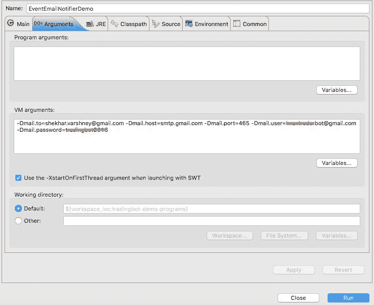 启动配置

程序成功运行后，我们会看到测试程序中所用的值对应的邮件出现在 `mail.to` 地址中。

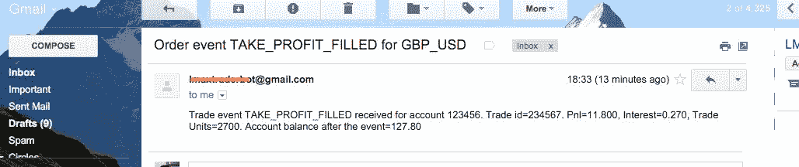 邮件通知到达收件箱

1.  http://fxtrade.oanda.com/help/policies/margin-rules↩︎

## 12. 配置、部署与运行机器人

现在我们已经准备好将机器人投入使用。在按下按钮之前，剩下的工作就是配置和部署。机器人的配置包括以下内容：

*   核心服务与 API 的 Spring 配置，即 `tradingbot-app.xml`。
*   核心 Spring 配置的属性文件，即 `tradingbot.properties`。
*   运行时提供程序（本例中为 OANDA）的 Spring 配置，即 `tradingbot-oanda.xml`。
*   运行时提供程序 Spring 配置的属性文件，即 `tradingbot-oanda.properties`。

与 jar 文件类似，我们也有一个单独的运行时提供程序配置文件。正如我们将在本章后面看到的，提供程序配置文件的名称作为程序参数传入，以便在运行时轻松选择提供程序。闲话少说，让我们直接进入机器人的配置环节。

### 12.1 交易机器人的配置

我们首先在项目 `tradingbot-app` 的 `src/main/resources` 文件夹中创建主配置文件，该文件夹会被自动包含在构建中，并最终打包到 `tradingbot-app.jar` 文件中。该文件名为 `tradingbot-app.xml`。我们还创建了属性文件 `tradingbot.properties`，其中包含了该 Spring 配置文件中引用的各种占位符的值。

我们还在配置中使用了酷炫的 `SpEL`^(1)，随着本章内容的深入，其使用原因将逐渐明朗。


#### 12.1.1 核心 Bean 配置

在本节中，我们配置核心 API 中除服务之外的所有核心 Bean，服务将在后续进行配置。这些 Bean 包括邮件、队列、交易配置等，它们对于机器人的运行至关重要。

由于我们所有的依赖 Bean 都使用了 `@Autowired`，因此我们在配置文件中通过包含 `<context:annotation-config/>` 来启用注解处理。这将确保所有通过 `@Autowired` 注入的依赖项都能被正确处理。我们还通过在配置文件中包含以下内容来启用属性文件处理，并指定属性文件的查找位置：

```
<context:property-placeholder location="classpath:tradingbot.properties" ignore-unresolvable="true"/>
```

`tradingbot.properties` 包含以下属性。我们提供了一些示例值以展示其格式。

```
mail.to=tradingbot@gmail.com
mail.host=smtp.gmail.com
mail.port=465
mail.user=foobar@gmail.com
mail.password=foobar123
twitter.consumerKey=veJerryUYUDHUliDXjlC6o4KR
twitter.consumerSecret=L5iFptFbLKMyUoH8NB3yAodEe0EQMukriUt3mnNICEKyNp20Ih
twitter.accessToken=0123456789-LISP3YO0mLgDOSw44vgdV0Rr7313ZyPrAt0X3jU
twitter.accessTokenSecret=5IrbOYUlG0Ld7UPeG6GPxFjVNWHREj4MN2TaoTL2kmVTT
```

我们已经在第 8 章中讨论过 Twitter 集成的属性。`mail` 属性用于在 Spring 配置中配置 `JavaMailSender` Bean，但 `mail.to` 除外，它实际上是接收机器人所有通知的用户的收件人地址。

现在，我们将注意力转向组成机器人的核心 Bean 的配置。首先是 `TradingConfig` 类的配置。必须正确配置此类，其他服务才能正常运行。我们还必须小心配置某些值，因为它们可能会影响所下的订单。例如，`maxAllowedQuantity` 是下单的最大数量。在我们的示例中，它只是 `5`，但如果将此值更改为 `50000`，则可能会下巨额订单，如果交易方向相反，可能会导致追加保证金。

让我们简要讨论一下 `TradingConfig` 类中的其他配置参数：

- `minReserveRatio` 是可用于交易的金额占账户总金额的比例。值为 `0.1` 表示如果此金额低于 10%，机器人将停止下新订单。
- `maxAllowedNetContracts` 是机器人针对给定货币的最大净多头或净空头持仓量。此设置源于 2015 年 1 月 15 日的事件，当时瑞士央行[²] 意外终止了瑞郎兑欧元 1.2 的汇率挂钩，瑞郎因此暴跌近 30%。任何大规模做空瑞郎的人都损失惨重。
- `minAmountRequired` 是允许机器人下单所需的账户指定货币的最低余额。如果余额低于此阈值，则无法继续下单。
- `max10yrWmaOffset` 定义了货币对的安全区域。我们在讨论 `PreOrderValidationService` 时详细讨论过它。
- `fadeTheMovePriceExpiry` 是观察间隔的时间（以分钟为单位），用于 `FadeTheMove` 策略。
- `fadeTheMoveJumpReqdToTrade` 是在 `fadeTheMovePriceExpiry` 期间所需的净点数跃升，此跃升将创建一个场景，以便在市场变动的相反方向下达限价单。
- `fadeTheMoveDistanceToTrade` 是当前价格与 `FadeTheMoveStrategy` 下达的限价单将被成交的位置之间的距离（以点数为单位）。
- `fadeTheMovePipsDesired` 是 `FadeTheMove` 策略期望获得的利润（以点数为单位）。

```
<bean id="tradingConfig"
        class="com.precioustech.fxtrading.tradingbot.TradingConfig">
    <property name="minReserveRatio" value="0.1"/>
    <property name="maxAllowedQuantity" value="10"/>
    <property name="maxAllowedNetContracts" value="5"/>
    <property name="minAmountRequired" value="10.0"/>
    <property name="mailTo" value="${mail.to}"/>
    <property name="max10yrWmaOffset" value="0.1"/>
    <property name="fadeTheMoveJumpReqdToTrade" value="45"/>
    <property name="fadeTheMoveDistanceToTrade" value="25"/>
    <property name="fadeTheMovePipsDesired" value="10"/>
    <property name="fadeTheMovePriceExpiry" value="15"/>
</bean>
```

接下来，我们配置 Google `EventBus` 以及所有使用 `EventBus` 来传播事件负载的回调处理器。我们还配置了我们在第一章中讨论过的 Bean 后处理器 `FindEventBusSubscribers`，它会查找所有包含由 `@Subscriber` 注解的方法的类，并自动将它们注册到 `EventBus` 中。

```
<bean id="eventBus" class="com.google.common.eventbus.EventBus"/>
<bean id="findEventBusSubscribers"
    class="com.precioustech.fxtrading.tradingbot.spring.FindEventBusSubscribers"/>
<bean id="eventCallback"
    class="com.precioustech.fxtrading.events.EventCallbackImpl">
    <constructor-arg index="0" ref="eventBus"/>
</bean>
<bean id="heartBeatCallback"
    class="com.precioustech.fxtrading.heartbeats.HeartBeatCallbackImpl">
    <constructor-arg index="0" ref="eventBus"/>
</bean>
<bean id="marketEventCallback"
    class="com.precioustech.fxtrading.marketdata.MarketEventHandlerImpl">
    <constructor-arg index="0" ref="eventBus"/>
</bean>
```

对于 `JavaMailSender` Bean，其配置如下所示：

```
<bean id="mailSender" class="org.springframework.mail.javamail.JavaMailSenderImpl">
    <property name="host" value="${mail.host}"/>
    <property name="port" value="${mail.port}"/>
    <property name="username" value="${mail.user}"/>
    <property name="password" value="${mail.password}"/>
    <property name="javaMailProperties">
        <props>
            <prop key="mail.transport.protocol">smtps</prop>
            <prop key="mail.smtp.auth">true</prop>
            <prop key="mail.smtp.starttls.enable">true</prop>
            <prop key="mail.smtp.socketFactory.class">javax.net.ssl.SSLSocketFactory</prop>
            <prop key="mail.debug">false</prop>
            <prop key="mail.smtp.socketFactory.fallback">false</prop>
        </props>
    </property>
</bean>
```

此 Bean 的占位符在 `tradingbot.properties` 文件中定义。使用 `JavaMailSender` Bean 发送通知的相关服务配置如下：

```
<bean id="eventEmailNotifier"
    class="com.precioustech.fxtrading.tradingbot.events.notification.email.EventEmailNotifier"/>
```

用于下单的 `orderQueue` 配置非常简单。

```
<bean id="orderQueue" class="java.util.concurrent.LinkedBlockingQueue"/>
```

我们使用 Spring 内置的任务调度器[^sprsched] 来调度我们的任务。一个示例任务是轮询我们已配置的 Twitter 账户的新推文。

```
<task:scheduler id="taskScheduler" pool-size="5"/>
```


#### 12.1.2 Twitter 相关 Bean 配置

我们首先配置`TwitterTemplate`，它负责实现与 Twitter 的所有交互功能，是 Spring Social 的组成部分。

```
1 <bean id="twitter" class="org.springframework.social.twitter.api.impl.TwitterTemplate">
2 		<constructor-arg index="0" value="${twitter.consumerKey}"/>
3 		<constructor-arg index="1" value="${twitter.consumerSecret}"/>
4 		<constructor-arg index="2" value="${twitter.accessToken}"/>
5 		<constructor-arg index="3" value="${twitter.accessTokenSecret}"/>
6 </bean>
```

配置中的占位符均定义在上一节讨论过的`tradingbot.properties`文件中，其含义不言自明。

接下来我们配置一个 Bean，它是一个列表，包含所有我们想要处理推文的 Twitter 账号。虽然该 Bean 不是其他 Bean 的依赖项，但它会被`SpEL`用于注入值。例如：

```
 1 <bean id="fxTweeterList" class="java.util.ArrayList">
 2 		<constructor-arg index="0">
 3 			<list>
 4 				<value>SignalFactory</value>
 5 				<value>Forex_EA4U</value>
 6 			</list>
 7 		</constructor-arg>
 8 </bean>
 9 <util:map id="tweetHandlerMap">
10 	<entry key="#{fxTweeterList[0]}">
11 		<bean class=
12       "com.precioustech.fxtrading.tradingbot.social.twitter.tweethandler.SignalFactoryFXTweetHandler">
13 			<constructor-arg index="0" value="#{fxTweeterList[0]}"/>
14 		</bean>
15 	</entry>
16 	<entry key="#{fxTweeterList[1]}">
17 		<bean class=
18     "com.precioustech.fxtrading.tradingbot.social.twitter.tweethandler.ZuluTrader101FXTweetHandler">
19 			<constructor-arg index="0" value="#{fxTweeterList[1]}"/>
20 		</bean>
21 	</entry>
22 </util:map>
```

`SpEL`使我们能够将所有 Twitter 账号集中定义在一处，并通过表达式引用该列表，将这些表达式的值注入到其他 Bean 中。

如果需要监听更多 Twitter 账号的推文，我们只需创建或复用现有的处理器（如适用），并在此处进行配置即可。

#### 12.1.3 提供商 Bean 配置

在本节中，我们配置所有实现`Provider`接口且与特定提供商相关的 Bean。由于全书讨论均基于 OANDA REST API，因此我们将其所有相关配置定义在名为`tradingbot-oanda.xml`的专用配置文件中，该文件的所有属性均定义在`tradingbot-oanda.properties`文件中。

需要特别注意的是，此 OANDA 配置文件中 Bean 的`id`必须在其他提供商实现中复用，因为主配置会引用这些 ID 来配置核心服务 Bean。

首先我们来看一下属性文件：

```
1 oanda.url=https://api-fxtrade.oanda.com
2 oanda.accessToken=7d741c1234f25d9f5a094e53a356789b-2c9a7b49578904e177210af8e111c2f6
3 oanda.userName=foo
4 oanda.accountId=123456
5 oanda.streaming.url=https://stream-fxtrade.oanda.com
```

- `oanda.url` 是我们希望交易机器人指向的网址。请记住 OANDA 提供了实盘、模拟和沙箱环境。
- `oanda.streaming.url` 是用于获取行情数据和平台事件的流式网址。
- `oanda.accessToken` 是在`oanda.url`指向的环境中生成的令牌。
- `oanda.userName` 是`oanda.url`指向的环境中的有效用户名。
- `oanda.accountId` 是属于`oanda.url`指向的环境中`oanda.userName`所配置值的有效账户 ID。例如，启动市场数据流需要有效的账户 ID。

像主配置文件一样，我们照例将此属性文件的位置指定为`classpath`路径，并同时开启注解处理。

```
1 <context:annotation-config/>
2 <context:property-placeholder location="classpath:tradingbot-oanda.properties"
3         ignore-unresolvable="true"/>
```

下面列出所有 OANDA 提供商服务的配置。

**AccountDataProviderService**

```
1 <bean id="accountDataProvider" class=
2   "com.precioustech.fxtrading.oanda.restapi.account.OandaAccountDataProviderService">
3 		<constructor-arg index="0" value="${oanda.url}"/>
4 		<constructor-arg index="1" value="${oanda.userName}"/>
5 		<constructor-arg index="2" value="${oanda.accessToken}"/>
6 </bean>
```

**ProviderHelper**

```
1 <bean id="providerHelper"
2     class="com.precioustech.fxtrading.oanda.restapi.helper.OandaProviderHelper"/>
```

**InstrumentDataProvider**

```
1 <bean id="instrumentDataProvider"
2   class="com.precioustech.fxtrading.oanda.restapi.instrument.OandaInstrumentDataProviderService">
3 		<constructor-arg index="0" value="${oanda.url}"/>
4 		<constructor-arg index="1" value="${oanda.accountId}"/>
5 		<constructor-arg index="2" value="${oanda.accessToken}"/>
6 </bean>
```

**CurrentPriceInfoProvider**

```
1 <bean id="currentPriceInfoProvider"
2   class="com.precioustech.fxtrading.oanda.restapi.marketdata.OandaCurrentPriceInfoProvider">
3 		<constructor-arg index="0" value="${oanda.url}"/>
4 		<constructor-arg index="1" value="${oanda.accessToken}"/>
5 </bean>
```

**HistoricMarketDataProvider**

```
1 <bean id="historicMarketDataProvider"
2   class="com.precioustech.fxtrading.oanda.restapi.marketdata.historic.OandaHistoricMarketDataProvider">
3 		<constructor-arg index="0" value="${oanda.url}"/>
4 		<constructor-arg index="1" value="${oanda.accessToken}"/>
5 </bean>
```

**OrderManagementProvider**

```
1 <bean id="orderManagementProvider"
2   class="com.precioustech.fxtrading.oanda.restapi.order.OandaOrderManagementProvider">
3 		<constructor-arg index="0" value="${oanda.url}"/>
4 		<constructor-arg index="1" value="${oanda.accessToken}"/>
5 		<constructor-arg index="2" ref="accountDataProvider"/>
6 </bean>
```

**TradeManagementProvider**

```
1 <bean id="tradeManagementProvider"
2   class="com.precioustech.fxtrading.oanda.restapi.trade.OandaTradeManagementProvider">
3 		<constructor-arg index="0" value="${oanda.url}"/>
4 		<constructor-arg index="1" value="${oanda.accessToken}"/>
5 </bean>
```

**PositionManagementProvider**


```xml
1 <bean id="positionManagementProvider"
2   class="com.precioustech.fxtrading.oanda.restapi.position.OandaPositionManagementProvider">
3 		<constructor-arg index="0" value="${oanda.url}"/>
4 		<constructor-arg index="1" value="${oanda.accessToken}"/>
5 	</bean>
```

##### `EventStreamingService`（事件流式服务）

```xml
1 <bean id="eventsStreamingService"
2   class="com.precioustech.fxtrading.oanda.restapi.streaming.events.OandaEventsStreamingService">
3 		<constructor-arg index="0" value="${oanda.streaming.url}"/>
4 		<constructor-arg index="1" value="${oanda.accessToken}"/>
5 		<constructor-arg index="2" ref="accountDataProvider"/>
6 		<constructor-arg index="3" ref="eventCallback"/>
7 		<constructor-arg index="4" ref="heartBeatCallback"/>
8 		<constructor-arg index="5" value="EVENTSTREAM"/>
9 </bean>
```

我们将上述源代码 ID `EVENTSTREAM` 分配为心跳源 ID，因为同一个类负责处理事件心跳。

##### Platform Event handlers（平台事件处理器）

```xml
1 <bean id="orderEventHandler"
2 class="com.precioustech.fxtrading.oanda.restapi.events.OrderFilledEventHandler">
3 	<constructor-arg index="0" ref="tradeInfoService"/>
4 </bean>
5 <bean id="tradeEventHandler"
6   class="com.precioustech.fxtrading.oanda.restapi.events.TradeEventHandler">
7 	<constructor-arg index="0" ref="tradeInfoService"/>
8 </bean>
```

上述配置的事件处理器需要分配给它们将要处理的平台事件。

```xml
 1 <util:map id="eventEmailContentGeneratorMap" key-type="com.precioustech.fxtrading.events.Event">
 2 	<entry
 3   key="#{T(com.precioustech.fxtrading.oanda.restapi.events.OrderEvents).MARKET_ORDER_CREATE}"
 4   value-ref="orderEventHandler"/>
 5 	<entry
 6   key="#{T(com.precioustech.fxtrading.oanda.restapi.events.OrderEvents).LIMIT_ORDER_CREATE}"
 7   value-ref="orderEventHandler"/>
 8 	<entry
 9   key="#{T(com.precioustech.fxtrading.oanda.restapi.events.OrderEvents).ORDER_CANCEL}"
10   value-ref="orderEventHandler"/>
11 	<entry
12   key="#{T(com.precioustech.fxtrading.oanda.restapi.events.OrderEvents).ORDER_FILLED}"
13   value-ref="orderEventHandler"/>
14 	<entry
15   key="#{T(com.precioustech.fxtrading.oanda.restapi.events.TradeEvents).TRADE_CLOSE}"
16   value-ref="tradeEventHandler"/>
17 	<entry
18   key="#{T(com.precioustech.fxtrading.oanda.restapi.events.TradeEvents).STOP_LOSS_FILLED}"
19   value-ref="tradeEventHandler"/>
20 	<entry
21   key="#{T(com.precioustech.fxtrading.oanda.restapi.events.TradeEvents).TAKE_PROFIT_FILLED}"
22   value-ref="tradeEventHandler"/>
23 </util:map>
```

我们配置上述的 `eventEmailContentGeneratorMap` 映射，以表达对机器人在平台事件生成时希望发出的通知的关注。如前一章所述，相应的处理器负责生成邮件内容。

##### `MarketDataStreamingService`（市场数据流式服务）

```xml
 1 <bean id="marketDataStreamingService"
 2   class="com.precioustech.fxtrading.oanda.restapi.streaming.marketdata.OandaMarketDataStreamingService">
 3 		<constructor-arg index="0" value="${oanda.streaming.url}"/>
 4 		<constructor-arg index="1" value="${oanda.accessToken}"/>
 5 		<constructor-arg index="2" value="${oanda.accountId}"/>
 6 		<constructor-arg index="3" ref="tradeableInstrumentList"/>
 7 		<constructor-arg index="4" ref="marketEventCallback"/>
 8 		<constructor-arg index="5" ref="heartBeatCallback"/>
 9 		<constructor-arg index="6" value="MKTDATASTREAM"/>
10 </bean>
```

我们将上述源代码 ID `MKTDATASTREAM` 分配为心跳源 ID，因为同一个类负责处理逐笔数据心跳。

`tradeableInstrumentList` 是我们要从 OANDA 平台订阅逐笔数据的交易品种列表。该列表的配置如下。

```xml
 1 <bean id="tradeableInstrumentList" class="java.util.ArrayList">
 2 	<constructor-arg index="0">
 3 		<list>
 4 			<bean class="com.precioustech.fxtrading.instrument.TradeableInstrument">
 5         <constructor-arg index="0" value="USD_CAD"/>
 6       </bean>
 7 			<bean class="com.precioustech.fxtrading.instrument.TradeableInstrument">
 8         <constructor-arg index="0" value="GBP_USD"/>
 9       </bean>
10 			<bean class="com.precioustech.fxtrading.instrument.TradeableInstrument">
11         <constructor-arg index="0" value="AUD_JPY"/>
12       </bean>
13 			<bean class="com.precioustech.fxtrading.instrument.TradeableInstrument">
14         <constructor-arg index="0" value="EUR_NZD"/>
15       </bean>
16 			<bean class="com.precioustech.fxtrading.instrument.TradeableInstrument">
17         <constructor-arg index="0" value="GBP_CHF"/>
18       </bean>
19 			<bean class="com.precioustech.fxtrading.instrument.TradeableInstrument">
20         <constructor-arg index="0" value="EUR_JPY"/>
21       </bean>
22 		</list>
23 	</constructor-arg>
24 </bean>
```

至此，我们结束了关于 OANDA 实现中所有 `Provider` Bean 配置的讨论。

#### 12.1.4 策略配置

在本书中，我们讨论了几种通过基于调度器的调用来激活的策略。在本节中，我们将配置它们并展示它们是如何被调用的。

```xml
1 <bean id="fadeTheMoveStrategy"
2     class="com.precioustech.fxtrading.tradingbot.strategies.FadeTheMoveStrategy">
3 	<constructor-arg index="0" ref="tradeableInstrumentList"/>
4 </bean>
5 <bean id="copyTwitterStrategy"
6     class="com.precioustech.fxtrading.tradingbot.strategies.CopyTwitterStrategy"/>
```

配置相当简单。`FadeTheMove` 策略有一个额外的构造函数依赖项，它会被注入一个交易品种列表，用于观察并在满足给定条件时下单。

现在我们来看一下调度器配置，它会在每个时间间隔 `T` 后调用给定的策略 Bean 方法。

```xml
1 <task:scheduled-tasks scheduler="taskScheduler">
2 		<task:scheduled ref="fadeTheMoveStrategy" method="analysePrices"
3           fixed-delay="60000"/>
4 		<task:scheduled ref="copyTwitterStrategy" method="harvestAndTrade"
5           fixed-delay="300000"/>
6 </task:scheduled-tasks>
```

调度器每隔 `60000 毫秒` 调用一次 `fadeTheMoveStrategy`  Bean 的 `analysePrices()` 方法。它还会每隔 `300000 毫秒` 调用一次 `copyTwitterStrategy` Bean 的 `harvestAndTrade()` 方法。


#### 12.1.5 服务配置

在本章关于配置的最后一节中，我们将讨论如何配置机器人的核心服务。如果存在图形用户界面客户端或任何其他与机器人交互的客户端，这些服务可被视为机器人的公共 API。本书中的大多数示例程序都直接与这些服务进行交互。

`AccountInfoService`

```xml
<bean id="accountInfoService"
    class="com.precioustech.fxtrading.account.AccountInfoService">
	<constructor-arg index="0" ref="accountDataProvider"/>
	<constructor-arg index="1" ref="currentPriceInfoProvider"/>
	<constructor-arg index="2" ref="tradingConfig"/>
	<constructor-arg index="3" ref="providerHelper"/>
</bean>
```

`InstrumentService`

```xml
<bean id="instrumentService"
    class="com.precioustech.fxtrading.instrument.InstrumentService">
		<constructor-arg index="0" ref="instrumentDataProvider"/>
</bean>
```

`MovingAverageCalculationService`

```xml
<bean id="movingAverageCalculationService"
  class="com.precioustech.fxtrading.marketdata.historic.MovingAverageCalculationService">
		<constructor-arg index="0" ref="historicMarketDataProvider"/>
</bean>
```

`OrderInfoService`

```xml
<bean id="orderInfoService"
    class="com.precioustech.fxtrading.order.OrderInfoService">
	<constructor-arg index="0" ref="orderManagementProvider"/>
</bean>
```

`TradeInfoService`

```xml
<bean id="tradeInfoService"
    class="com.precioustech.fxtrading.trade.TradeInfoService">
	<constructor-arg index="0" ref="tradeManagementProvider"/>
	<constructor-arg index="1" ref="accountInfoService"/>
</bean>
```

`PreOrderValidationService`

```xml
<bean id="preOrderValidationService"
      class="com.precioustech.fxtrading.order.PreOrderValidationService">
	<constructor-arg index="0" ref="tradeInfoService"/>
	<constructor-arg index="1" ref="movingAverageCalculationService"/>
	<constructor-arg index="2" ref="tradingConfig"/>
	<constructor-arg index="3" ref="orderInfoService"/>
</bean>
```

`OrderExecutionService`

```xml
<bean id="orderExecutionService"
    class="com.precioustech.fxtrading.order.OrderExecutionService">
	<constructor-arg index="0" ref="orderQueue"/>
	<constructor-arg index="1" ref="accountInfoService"/>
	<constructor-arg index="2" ref="orderManagementProvider"/>
	<constructor-arg index="3" ref="tradingConfig"/>
	<constructor-arg index="4" ref="preOrderValidationService"/>
	<constructor-arg index="5" ref="currentPriceInfoProvider"/>
</bean>
```

`DefaultHearBeatService`

```xml
<bean id="heartBeatService"
    class="com.precioustech.fxtrading.heartbeats.DefaultHeartBeatService">
	<constructor-arg index="0">
		<list>
			<ref bean="eventsStreamingService"/>
			<ref bean="marketDataStreamingService"/>
		</list>
	</constructor-arg>
</bean>
```

### 12.2 构建机器人

使用 Maven 可以轻松构建机器人。由于有三个项目需要按指定顺序构建，我们可以编写脚本来自动执行这些操作，而不必记住构建顺序。如果已从 GitHub 克隆了代码仓库，在 `<repo-code>/java` 目录下有一个 `buildbot.bsh` 脚本，它将使用 Maven 构建机器人。在克隆仓库后，我的 Bash 终端上会显示以下内容：

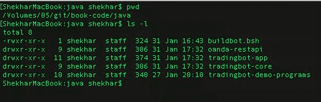 代码仓库结构

在运行代码之前，假设已安装并配置了 Maven 和 Java 1.7。在命令行中，输入命令 `mvn --version` 时，我们应该会看到类似如下的输出：

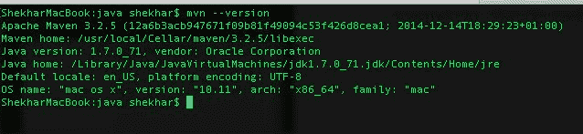 mvn –version 输出

如果情况并非如此，请确保已正确安装 Maven^(3)。

现在我们已经准备好运行脚本 `buildbot.bsh`。在此之前，让我们快速浏览一下脚本代码：

```bash
function buildmodule {
    cd $SCRIPT_DIR/$1
    mvn clean install
    if [[ "$?" -ne 0 ]]; then
      echo "错误：$1 项目构建失败。构建失败"; exit -1;
    fi
}
SCRIPT_DIR=`pwd`
buildmodule tradingbot-core
buildmodule oanda-restapi
buildmodule tradingbot-app

echo "交易机器人构建成功"
```

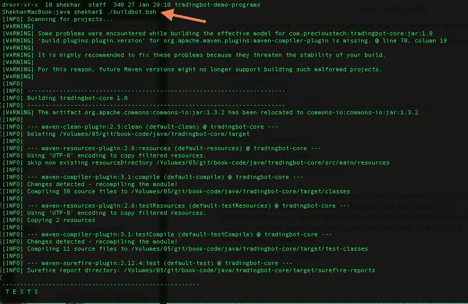 在命令行开始构建

我们对要构建的三个模块分别调用了 `buildmodule` 函数。该函数首先执行 `cd` 进入相应的源代码目录，然后发出 `mvn clean install` 命令来构建构件（即 `jar` 文件）。如果存在单元测试失败或编译问题，`mvn clean install` 将退出并返回非零代码。我们检查存储在 `$?` 变量中的这个代码，如果非零，则立即退出脚本。

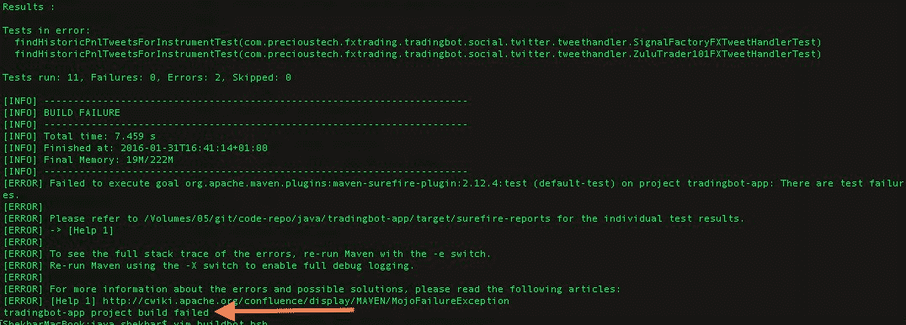 构建失败

如果构建成功，我们应该看到如下所示的输出：

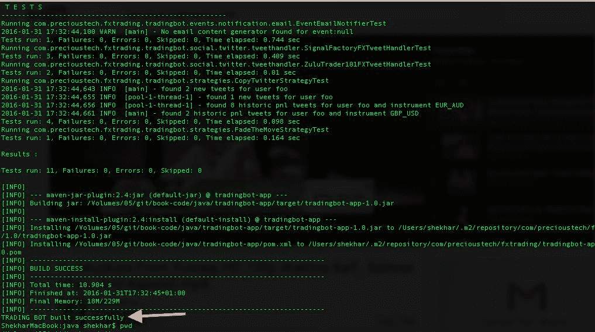 构建成功

### 12.3 运行机器人

**警告**：**如果用于运行机器人的某些配置值过高，可能会造成严重损失。作者已在全书中尽一切可能强调这些内容。在任何情况下，作者均不对因用户根据自身风险承受能力设定的配置值而产生的任何间接损失承担责任。**

现在机器人已完全构建完毕，我们准备运行它。但在真正按下“运行按钮”之前，我们需要确保以下配置参数已被调整，并完成构建，以便这些更改包含在针对特定用户的 jar 文件中。以下是完整的检查清单：

1.  `tradingbot-oanda.properties` 中所有 OANDA 特定的参数必须属于一个有效的真实或模拟账户用户。
2.  `tradingbot.properties` 中所有 Twitter 特定的访问令牌已正确填写。这些有效令牌由用户拥有完全访问权限的 Twitter 账户下的 Twitter 应用程序生成。
3.  再次检查 `TradingConfig` bean 的值是否在可接受的范围内，特别是 `maxAllowedQuantity`、`minReserveRatio` 和 `maxAllowedNetContracts`。
4.  在 `tradingbot.properties` 中配置一个有效的邮件账户。此处使用的凭据将用于向 `mail.to` 电子邮件地址发送邮件通知。
5.  如有需要，可在 tradingbot-app 资源目录中配置 `log4j.properties`。
6.  再次执行 `buildbot.sh`，使用上述配置的新参数集重新构建机器人。

要使用本书讨论的策略以及 OANDA 实现来运行机器人，我们只需执行以下操作：

```bash
$ ./runbot-oanda.bsh
```

如果一切顺利，我们应该会看到机器人输出以下内容：

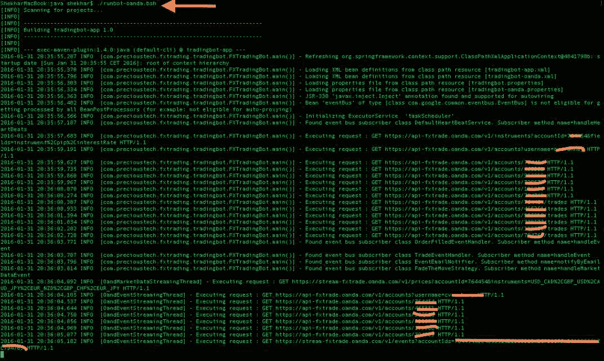 运行机器人

在机器人运行期间，我们应该会看到它不时地抓取如下图所示的推文：

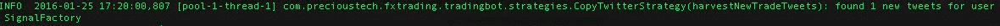 新推文已抓取

就是这样。我们的机器人现已完全启动并运行。我们应该会看到 `FadeTheMove` 策略非常活跃，尤其是在影响市场波动的货币事件（如 FOMC 决议或各国 GDP 数据）期间。需要记住的一点是，该策略会维护一个过去 15 分钟的内部缓存。我们为订阅行情数据流配置的品种越多，占用的内存就越多。因此，使用更高的内存值运行可能是必要的。由于机器人在 Maven 内部运行，我们需要更改 `MAVEN_OPTS` 参数。


## 13\. 单元测试

本章我们将讨论一个非常重要的主题：代码的单元测试。对机器人进行充分的单元测试覆盖，能确保我们在修改现有代码或新增功能时不会引入大量回归缺陷。对于本书的部分目标读者而言，交易机器人可能会在真实账户中部署并执行涉及巨额资金的实际订单。确保测试覆盖率足够高，可以降低因代码缺陷而发出错误订单的可能性。我们简要总结一下单元测试的巨大优势：

-   完善的单元测试应能消除生产环境中大多数意想不到的意外情况。
-   它们有助于对代码进行文档化。
-   它们迫使开发者以更优的方式思考和开发，从而改进系统组件的设计、代码和架构。
-   采用测试驱动开发方法时，我们能编写出更易于维护的代码。我们被迫编写更小的类，以便更容易地进行单元测试。
-   我们被迫编写松耦合的组件。需要模拟众多依赖关系迫使我们必须以这种方式思考。

牢记以上要点，我们将在本章讨论一些围绕机器人单元测试的概念和技术。

### 13.1 使用 Mockito 作为模拟框架

为了为机器人编写单元测试，我们将大量使用 Mockito^(1) 来创建对象的模拟对象。像 `TwitterTemplate` 这样的对象模拟，可以帮助我们模拟其行为，而无需完整实例化它。若使用真实的 `TwitterTemplate` 来获取推文，我们必须提供有效的令牌才能通过 Twitter 的身份验证。这其实不是真正的问题。真正的问题是，每次执行搜索查询时，如何获得相同的确定性结果。使用真实的 `TwitterTemplate` 是不可能做到的，因为推文在不断生成，搜索结果也随之变化。我们无法编写确定性的断言来对代码进行单元测试。为了解决这个问题，我们使用模拟对象来获得确定性的结果。同样的道理也适用于从数据提供商处获取确定顺序的价格点数据，这在现实世界中也是不可能的。

#### 13.1.1 模拟 HTTP 交互

为了测试我们的 OANDA 提供商实现，我们需要能够模拟 HTTP 交互。其概念是，我们即将探索的这个模拟方法会返回一个 `FileInputStream` 实例的 `InputStream`，而不是真实世界的 `org.apache.http.client.entity.LazyDecompressingInputStream` 实例。因此，我们与 OANDA 的所有交互都将来自我们创建的 JSON 负载文件，而非与 OANDA 平台直接交互。让我们快速看一下这个方法的代码：

```
 1 public static final void mockHttpInteraction(String fname, HttpClient mockHttpClient) throws Exception {
 2  CloseableHttpResponse mockResp = mock(CloseableHttpResponse.class);
 3  when(mockHttpClient.execute(any(HttpUriRequest.class))).thenReturn(mockResp);

 5  HttpEntity mockEntity = mock(HttpEntity.class);

 7  when(mockResp.getEntity()).thenReturn(mockEntity);

 9  StatusLine mockStatusLine = mock(StatusLine.class);

11  when(mockResp.getStatusLine()).thenReturn(mockStatusLine);
12  when(mockStatusLine.getStatusCode()).thenReturn(HttpStatus.SC_OK);
13  when(mockEntity.getContent()).thenReturn(new FileInputStream(fname));
14 }
```

`mockHttpInteraction` 方法接受一个文件名和一个模拟的 `HttpClient` 作为参数。在模拟了所有交互步骤以到达此方法最后一行时，魔法便发生了。在真实世界中，`HttpEntity` 对象包含从 OANDA REST API 返回的内容，而此处该对象被模拟为返回文件内容。

这是一个非常实用的概念，我们刚刚讨论过。现在，我们能够通过模仿文件中的响应来模拟几乎任何交互。让我们看一个执行此交互的单元测试示例：

```
 1 @Test
 2 public void accountIdTest() throws Exception {
 3  final OandaAccountDataProviderService service = new
 4  OandaAccountDataProviderService(url, userName, accessToken);
 5  assertEquals("https://api-fxtrade.oanda.com/v1/accounts/123456",
 6   service.getSingleAccountUrl(accountId));

 8  OandaAccountDataProviderService spy =
 9   createSpyAndCommonStuff("src/test/resources/account123456.txt", service);
10  Account < Long > accInfo = spy.getLatestAccountInfo(accountId);
11  assertNotNull(accInfo);
12  assertEquals("CHF", accInfo.getCurrency());
13  assertEquals(0.05, accInfo.getMarginRate(), OandaTestConstants.precision);
14  assertEquals(-897.1, accInfo.getUnrealisedPnl(), OandaTestConstants.precision);
15 }

17 private OandaAccountDataProviderService createSpyAndCommonStuff(String fname,
18  OandaAccountDataProviderService service) throws Exception {
19  OandaAccountDataProviderService spy = spy(service);

21  CloseableHttpClient mockHttpClient = mock(CloseableHttpClient.class);
22  when(spy.getHttpClient()).thenReturn(mockHttpClient);

24  OandaTestUtils.mockHttpInteraction(fname, mockHttpClient);

26  return spy;
27 }
```

在详细查看代码之前，我们先看看此单元测试用例中使用的文件 `src/test/resources/account123456.txt` 的内容：

```
 1 {
 2   "accountId" : 123456,
 3   "accountName" : "main",
 4   "balance" : 20567.9,
 5   "unrealizedPl" : -897.1,
 6   "realizedPl" : 1123.65,
 7   "marginUsed" : 89.98,
 8   "marginAvail" : 645.3,
 9   "openTrades" : 5,
10   "openOrders" : 0,
11   "marginRate" : 0.05,
12   "accountCurrency" : "CHF"
13 }
```

测试首先创建了一个 `AccountDataProvider` 的真实实例，此处为 `OandaAccountDataProviderService`。接着，我们在私有方法 `createSpyAndCommonStuff` 中为该对象创建了一个间谍^(2)。同样在此方法内部，我们关联了一个模拟的 `HttpClient` 对象，该对象被先前讨论的 `mockHttpInteraction` 方法用来与作为参数传递的文件进行交互。

那么，当调用 `spy.getLatestAccountInfo(accountId)` 时，会发生什么呢？


#### 13.1.2 模拟数据流

```
 1 private Account < Long > getLatestAccountInfo(final Long accountId,
 2   CloseableHttpClient httpClient) {
 3   try {
 4    HttpUriRequest httpGet = new HttpGet(getSingleAccountUrl(accountId));
 5    httpGet.setHeader(authHeader);

 7    LOG.info(TradingUtils.executingRequestMsg(httpGet));
 8    HttpResponse httpResponse = httpClient.execute(httpGet);
 9    String strResp = TradingUtils.responseToString(httpResponse);
10 ...
11 ...
```

*   代码 `HttpResponse httpResponse = httpClient.execute(httpGet)` 返回一个模拟的 `CloseableHttpResponse` 对象（参见 `mockHttpInteraction` 方法）。
*   当使用这个模拟的 `httpResponse` 对象调用 `TradingUtils.responseToString` 时，该方法内部对 `entity.getContent` 的调用会返回一个 `InputStream` 对象，该对象实际上是 `FileInputStream` 的一个实例，它持有对单元测试中使用的文件 `src/test/resources/account123456.txt` 的句柄。
*   当读取这个 `InputStream` 方法时，系统会读取底层文件，并将文件内容从该方法返回。
*   之后，该响应会按照与从真实 OANDA 平台收到 Http 200 状态码时相同的方式进行正常解析。

为便于参考，`TradingUtils.responseToString` 方法如下所示：

```
 1 /**
 2  * 一个工具方法，尝试将 HttpResponse 对象转换为字符串。仅当服务器返回 HTTP 状态码 200 时，
 3  * 此方法才会尝试处理响应。
 4  *
 5  * @param response
 6  * @return 如果可能，返回响应的字符串表示形式，否则返回空字符串。
 7  * @throws IOException
 8  */
 9 public static final String responseToString(HttpResponse response) throws IOException {
10  HttpEntity entity = response.getEntity();
11  if ((response.getStatusLine().getStatusCode() == HttpStatus.SC_OK ||
12    response.getStatusLine().getStatusCode() == HttpStatus.SC_CREATED) && entity != null) {
13   InputStream stream = entity.getContent();
14   String line;
15   BufferedReader br = new BufferedReader(new InputStreamReader(stream));
16   StringBuilder strResp = new StringBuilder();
17   while ((line = br.readLine()) != null) {
18    strResp.append(line);
19   }
20   IOUtils.closeQuietly(stream);
21   IOUtils.closeQuietly(br);
22   return strResp.toString();
23  } else {
24   return StringUtils.EMPTY;
25  }
26 }
```

在本节中，我们将讨论如何对书中讨论的数据流进行单元测试，即市场数据流和交易/订单/账户事件流。我们将使用完全相同的技术，即使用上一节中描述的模拟技术对它们进行单元测试。和之前一样，我们会将 `HttpGet` 中可用的 `InputStream` 切换为 `FileInputStream`，其中的每一行都是一个 JSON 格式的事件。我们的单元测试文件中的一个片段如下所示：

```
 1 {"tick":{"instrument":"AUD_CAD","time":"1401919213548144","bid":1.01479,"ask":1.01498}}
 2 {"tick":{"instrument":"NZD_SGD","time":"1401919213548822","bid":1.07979,"ask":1.07998}}
 3 {"heartbeat":{"time":"1401919213548226"}}
 4 {"tick":{"instrument":"AUD_CAD","time":"1401919217201682","bid":1.01484,"ask":1.01502}}
 5 {"tick":{"instrument":"NZD_SGD","time":"1401919217201500","bid":1.07984,"ask":1.08002}}
 6 {"tick":{"instrument":"AUD_CAD","time":"1401919217206100","bid":1.01484,"ask":1.01504}}
 7 {"tick":{"instrument":"NZD_SGD","time":"1401919217206465","bid":1.07984,"ask":1.08004}}
 8 {"heartbeat":{"time":"1401919217206269"}}
 9 {"tick":{"instrument":"AUD_CAD","time":"1401919221292441","bid":1.0149,"ask":1.01505}}
10 {"tick":{"instrument":"NZD_SGD","time":"1401919221292791","bid":1.07990,"ask":1.08005}}
11 {"tick":{"instrument":"AUD_CAD","time":"1401919221297498","bid":1.01484,"ask":1.01505}}
12 {"tick":{"instrument":"NZD_SGD","time":"1401919221297233","bid":1.07984,"ask":1.08005}}
13 {"heartbeat":{"time":"1401919221297319"}}
14 {"tick":{"instrument":"AUD_CAD","time":"1401919224790916","bid":1.01489,"ask":1.01505}}
15 {"tick":{"instrument":"NZD_SGD","time":"1401919224790630","bid":1.07989,"ask":1.08005}}
16 {"tick":{"instrument":"AUD_CAD","time":"1401919224795379","bid":1.01489,"ask":1.01506}}
17 {"tick":{"instrument":"NZD_SGD","time":"1401919224795198","bid":1.07989,"ask":1.08006}}
18 {"heartbeat":{"time":"1401919224795130"}}
19 {"tick":{"instrument":"AUD_CAD","time":"1401919224800549","bid":1.01489,"ask":1.01508}}
20 {"tick":{"instrument":"NZD_SGD","time":"1401919224800275","bid":1.07989,"ask":1.08008}}
```

上述文件试图模拟一个真实环境，其中存在针对交易品种 `AUD_CAD` 和 `NZD_SGD` 的持续报价数据流。这些报价数据中穿插着心跳消息，同样模拟了数据流处于活动状态。现在让我们来看一下测试 `OandaMarketDataStreamingService` 的实际测试用例。我们想要测试该服务能否正确处理传入的报价数据和心跳消息，并调用相关的回调处理器，通过 `EventBus` 将事件向下游分发。我们的测试将包含一个断言，即文件中的事件数量应与推送到下游的事件数量相匹配。让我们来看一下代码，并了解如何实现其中一个断言。


`private static final int expectedPriceEvents = 668; // 1 for each`
`private static final TradeableInstrument < String > AUDCAD = new TradeableInstrument < String > ("AUD_CAD");`
`private static final TradeableInstrument < String > NZDSGD = new TradeableInstrument < String > ("NZD_SGD");`
`@Test`
`public void marketDataStreaming() throws Exception {`
 `Collection < TradeableInstrument < String >> instruments = Lists.newArrayList();`
 `EventBus eventBus = new EventBus();`
 `MarketEventCallback < String > mktEventCallback = new MarketEventHandlerImpl < String > (eventBus);`
 `HeartBeatCallback < DateTime > heartBeatCallback = new HeartBeatCallbackImpl < DateTime > (eventBus);`
 `eventBus.register(this);`
 `instruments.add(AUDCAD);`
 `instruments.add(NZDSGD);`
 `OandaStreamingService service = new OandaMarketDataStreamingService(OandaTestConstants.streaming_url,`
  `OandaTestConstants.accessToken, OandaTestConstants.accountId,`
  `instruments, mktEventCallback, heartBeatCallback, "TESTMKTSTREAM");`
 `assertEquals("https://stream-fxtrade.oanda.com/v1/prices" + "?accountId=123456&instruments=AUD_CAD%2CNZD_SGD",`
  `service.getStreamingUrl());`
 `OandaStreamingService spy = setUpSpy(service, "src/test/resources/marketData123456.txt");`
 `assertEquals(expectedPriceEvents / 2, audcadCt);`
 `assertEquals(expectedPriceEvents / 2, nzdsgdCt);`
 `assertEquals(expectedPriceEvents / 4, heartbeatCt);`
 `MarketDataPayLoad < String > audcadPayLoad = audcadLastRef.get();`
 `assertEquals(1.0149, audcadPayLoad.getBidPrice(), OandaTestConstants.precision);`
 `assertEquals(1.0151, audcadPayLoad.getAskPrice(), OandaTestConstants.precision);`
 `assertEquals(1401920421958 L, audcadPayLoad.getEventDate().getMillis());`
 `MarketDataPayLoad < String > nzdsgdPayLoad = nzdsgdLastRef.get();`
 `assertEquals(1.0799, nzdsgdPayLoad.getBidPrice(), OandaTestConstants.precision);`
 `assertEquals(1.0801, nzdsgdPayLoad.getAskPrice(), OandaTestConstants.precision);`
 `assertEquals(1401920421958 L, nzdsgdPayLoad.getEventDate().getMillis());`
 `verify(spy, times(1)).handleDisconnect(disconnectmsg);`
`}`

`private OandaStreamingService setUpSpy(OandaStreamingService service,`
 `String fname) throws Exception {`
 `OandaStreamingService spy = spy(service);`
 `CloseableHttpClient mockHttpClient = mock(CloseableHttpClient.class);`
 `when(spy.getHttpClient()).thenReturn(mockHttpClient);`
 `when(spy.isStreaming()).thenReturn(service.isStreaming());`
 `OandaTestUtils.mockHttpInteraction(fname, mockHttpClient);`
 `spy.startStreaming();`
 `do {`
  `Thread.sleep(2 L);`
 `} while (spy.streamThread.isAlive());`
 `return spy;`
`}`

`setUpSpy`方法执行流服务的常规设置，首先对底层`OandaStreamingService`实例（本例中为`OandaMarketDataStreamingService`）创建一个`spy`。然后设置`mockHttpInteraction`，其中文件`src/test/resources/marketData123456.txt`将被设置为市场数据流所有事件的源，当底层服务通过调用`spy.startStreaming()`开始流式传输时生效。一旦流开始，我们等待所有报价数据和心跳事件完全传输。我们设置一个`do-while`循环，其中包含 2 毫秒的休眠作为等待机制，以确保完成。一旦流接收到`disconnect`消息，它会自动停止，这是文件中的最后一个事件。我们的流在收到此类消息后会自动停止。这种情况有时发生在 OANDA 平台检测到流连接数已超限时。断开消息如下所示：

```
{"disconnect":{"code":64,"message":"bye","moreInfo":"none"}}
```

断开消息导致流的终止，而设置为准无限循环的后台线程`streamThread`也会终止。然后该方法返回到调用者。

现在我们必须测试所有事件是否已通过`EventBus`成功传递给下游订阅者。出于此测试用例的目的，测试类本身是所有这些事件的最终消费者。这在我们的测试用例`marketDataStreaming()`中已展示，我们在设置主服务时进行了设置。由于我们希望订阅`MarketDataPayLoad`和`HeartBeatPayLoad`事件，我们在测试类中设置了以下虚拟方法，仅计算收到的事件数量。

```
private volatile int audcadCt;
private volatile int nzdsgdCt;
private AtomicReference < MarketDataPayLoad < String >> audcadLastRef =
 new AtomicReference < MarketDataPayLoad < String >> ();
private AtomicReference < MarketDataPayLoad < String >> nzdsgdLastRef =
 new AtomicReference < MarketDataPayLoad < String >> ();
@Subscribe
public void dummyMarketDataSubscriber(MarketDataPayLoad < String > payLoad) {
 if (payLoad.getInstrument().equals(AUDCAD)) {
  this.audcadCt++;
  this.audcadLastRef.set(payLoad);
 } else {
  this.nzdsgdCt++;
  this.nzdsgdLastRef.set(payLoad);
 }
}
@Subscribe
public void dummyHeartBeatSubscriber(HeartBeatPayLoad < DateTime > payLoad) {
 heartbeatCt++;
}
```

文件中的所有事件都指向这些方法，这些方法除了统计心跳事件外，还会跟踪属于货币对`AUD_CAD`和`NZD_SGD`的已接收事件数量。然后，`asserts`确保接收的事件数量和顺序是正确的。


#### 13.1.3 多才多艺的 `verify`

到目前为止，我们主要关注了交互中的 `HttpGet` 方面，即从文件中读取数据相当简单。然而，要模拟反向操作，例如向文件插入（`HttpPost`）一行、修改一行（`HttpPatch`）以及删除一行（`HttpDelete`），即使不是不可能，也可能不那么容易。那么，我们如何对这些交互进行单元测试呢？Mockito 的 `verify` 为我们提供了解决方案。该命令有助于验证方法的交互，并且可以选择性地验证该方法被调用了多少次。让我们更详细地探讨我们的用例。

要为 OANDA 平台下新订单，我们在高层次上需要执行以下操作：

- 将完整填充的 `Order` POJO 连同 `accountId` 一起传递给 `OandaOrderManagementProvider` Bean 的 `placeOrder` 方法。
- `placeOrder` 方法内部委托给 `createPostCommand` 方法，该方法创建一个新的 `HttpPost` 命令实例，并利用 `Order` POJO 的 getter 方法，在此 post 命令上填充 `NameValuePair` 列表。一旦完全填充，该命令即可被提交以创建订单。
- 当 `HttpPost` 成功后，我们会收到一个响应。如果命令成功，该响应是一个包含新订单详细信息的 JSON 负载。

由于在单元测试期间，我们不想向 OANDA 平台发布真实订单，而只是想验证是否创建了一个有效的 `HttpPost` 命令，因此 `verify` 可以为我们验证这一点。由于创建一个有效的 `HttpPost` 命令基本上会调用 `Order` POJO 的所有 getter 方法，因此 `verify` 报告每个 getter 交互一次（某些会更多次）这一事实验证了我们的代码。类似地，假设已成功提交了一个有效命令，我们必须随后接收包含新订单详细信息的 JSON 负载，然后必须从文件中读取该负载，这作为 `mockHttpInteraction` 的一部分，我们之前已经讨论过。

让我们看一下测试此用例的代码：

```java
 1 @Test
 2 @SuppressWarnings("unchecked")
 3 public void createOrderTest() throws Exception {
 4  OandaOrderManagementProvider service =
 5   new OandaOrderManagementProvider(OandaTestConstants.url,
 6    OandaTestConstants.accessToken, null);
 7  TradeableInstrument < String > eurjpy = new TradeableInstrument < String > ("EUR_JPY");

 9  OandaOrderManagementProvider spy =
10   doMockStuff("src/test/resources/newOrder.txt", service);
11  Order < String, Long > orderMarket = mock(Order.class);
12  when(orderMarket.getInstrument()).thenReturn(eurjpy);
13  when(orderMarket.getSide()).thenReturn(TradingSignal.SHORT);
14  when(orderMarket.getType()).thenReturn(OrderType.MARKET);
15  when(orderMarket.getUnits()).thenReturn(150 l);
16  when(orderMarket.getTakeProfit()).thenReturn(132.65);
17  when(orderMarket.getStopLoss()).thenReturn(136.00);
18  // when(order.getPrice()).thenReturn(133.75);
19  Long orderId =
20   spy.placeOrder(orderMarket, OandaTestConstants.accountId);
21  assertNotNull(orderId);
22  verify(spy, times(1))
23   .createPostCommand(orderMarket, OandaTestConstants.accountId);
24  verify(orderMarket, times(1)).getInstrument();
25  verify(orderMarket, times(3)).getType();
26  verify(orderMarket, times(1)).getTakeProfit();
27  verify(orderMarket, times(1)).getStopLoss();
28  // verify(order, times(2)).getPrice();
29  verify(orderMarket, times(1)).getUnits();
30  verify(orderMarket, times(1)).getSide();

32  spy = doMockStuff("src/test/resources/newOrderLimit.txt", service);
33  Order < String, Long > orderLimit = mock(Order.class);
34  TradeableInstrument < String > eurusd =
35   new TradeableInstrument < String > ("EUR_USD");
36  when(orderLimit.getInstrument()).thenReturn(eurusd);
37  when(orderLimit.getSide()).thenReturn(TradingSignal.SHORT);
38  when(orderLimit.getType()).thenReturn(OrderType.LIMIT);
39  when(orderLimit.getUnits()).thenReturn(10 l);
40  when(orderLimit.getTakeProfit()).thenReturn(1.09);
41  when(orderLimit.getStopLoss()).thenReturn(0.0);
42  when(orderLimit.getPrice()).thenReturn(1.10);

44  orderId = spy.placeOrder(orderLimit, OandaTestConstants.accountId);
45  assertNotNull(orderId);
46  verify(spy, times(1))
47   .createPostCommand(orderLimit, OandaTestConstants.accountId);
48  verify(orderLimit, times(1)).getInstrument();
49  verify(orderLimit, times(3)).getType();
50  verify(orderLimit, times(1)).getTakeProfit();
51  verify(orderLimit, times(1)).getStopLoss();
52  verify(orderLimit, times(2)).getPrice();
53  verify(orderLimit, times(1)).getUnits();
54  verify(orderLimit, times(1)).getSide();
55 }

57 private OandaOrderManagementProvider doMockStuff(String fname,
58  OandaOrderManagementProvider service)
59 throws Exception {
60  OandaOrderManagementProvider spy = spy(service);
61  CloseableHttpClient mockHttpClient = mock(CloseableHttpClient.class);
62  when(spy.getHttpClient()).thenReturn(mockHttpClient);
63  OandaTestUtils.mockHttpInteraction(fname, mockHttpClient);
64  return spy;
65 }
```

在上面的测试用例中，我们同时测试了新的市价单和限价单；但其机制完全相同。我们创建了一个模拟的 `Order` POJO，为了成功创建一个 `HttpPost` 命令，必须在此定义新订单的模拟对象上调用所有 getter 方法。上面的 `verify` 正是做了这件事：验证在 `createPostCommand` 内部执行的 getter 交互。


#### 13.1.4 模拟 Twitter 交互

`Mockito` 使得与 Twitter 的交互变得极其简单。唯一需要注意的是，在查找历史盈亏推文时，不同用户账户的搜索查询可能有所不同。因此，对于引入的每个新用户账户处理器，都应针对此测试进行调整。

为了从 Twitter 获取可供所有用户解析新交易或盈亏推文的模拟推文，我们必须提前准备好模拟对象的基础工作。这包括：

- 为 `Twitter` 接口创建一个模拟对象（该接口由 `TwitterTemplate` 实现，作为 Spring Social 的一部分）。
- 为 `SearchOperations` 类创建一个模拟对象，该类用于根据搜索查询来搜索推文。
- 为 `SearchResults` 创建一个模拟对象，当对该对象调用 `getTweets()` 方法时，它会返回模拟的推文。
- 调用 `getTweets()` 方法会返回一个 Tweet 对象列表，该列表可以是一组模拟的 Tweet 对象。关键点在于拦截单个模拟 Tweet 对象上的 `getText()` 方法，并返回我们想要的文本。

让我们看一个示例，尝试为用户 `@SignalFactory` 测试 `findHistoricPnlTweets` 方法：

```
 1 @Test
 2 public void findHistoricPnlTweetsForInstrumentTest() {
 3  AbstractFXTweetHandler < String > tweetHandler = new SignalFactoryFXTweetHandler(userId);
 4  ProviderHelper providerHelper = mock(ProviderHelper.class);
 5  Twitter twitter = mock(Twitter.class);
 6  tweetHandler.providerHelper = providerHelper;
 7  tweetHandler.twitter = twitter;

 9  SearchOperations searchOperations = mock(SearchOperations.class);
10  when(twitter.searchOperations()).thenReturn(searchOperations);

12  TradeableInstrument < String > nzdusd = new TradeableInstrument < String > ("NZD_USD");
13  when(providerHelper.toIsoFormat(eq("NZD_USD"))).thenReturn("NZDUSD");
14  SearchResults searchResults = returnHistoricPnlSearchResults();
15  String query = "Profit: OR Loss: from:SignalFactory";
16  when(searchOperations.search(eq(query))).thenReturn(searchResults);
17  Collection < Tweet > tweets = tweetHandler.findHistoricPnlTweetsForInstrument(nzdusd);
18  assertEquals(1, tweets.size());
19 }

21 private SearchResults returnHistoricPnlSearchResults() {
22  SearchResults searchResults = mock(SearchResults.class);
23  List < Tweet > tweets = Lists.newArrayList();
24  when(searchResults.getTweets()).thenReturn(tweets);
25  Tweet tweet = mock(Tweet.class);
26  when(tweet.getText()).thenReturn(
27   "Forex Signal | Close(SL) Sell NZDUSD@0.7744 | Loss: -40 pips | 2015.02.06 11:26 GMT | #fx #forex #fb");
28  tweets.add(tweet);
29  return searchResults;
30 }
```

设置好模拟对象以返回推文列表后，我们需要确保只有当预期要触发的查询被发送到 `SearchOperations` 模拟对象时，这些推文才会被返回：

```
1 String query = "Profit: OR Loss: from:SignalFactory";
2 when(searchOperations.search(eq(query))).thenReturn(searchResults);
```

对于给定用户，推文处理的另一个重要方面是解析新增和已平仓的交易推文。解析是在从 `getText()` 方法返回的实际推文文本上进行的。我们需要确保编写测试用例，以覆盖针对给定 Twitter 用户的新增和已平仓交易推文解析的所有方面。

### 13.2 用于 Eclipse IDE 的 EclEmma 代码覆盖率工具

Eclipse IDE 的 EclEmma³ 插件是一个用于报告 Java 项目代码覆盖率的优秀工具。你可以为单个测试用例或一组测试运行此工具。

成功安装后，可以通过使用如下所示的按钮通过插件启动测试套件：

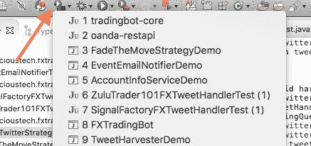 使用 EclEmma 工具启动测试

结果会显示在“覆盖率”视图中，如下所示：

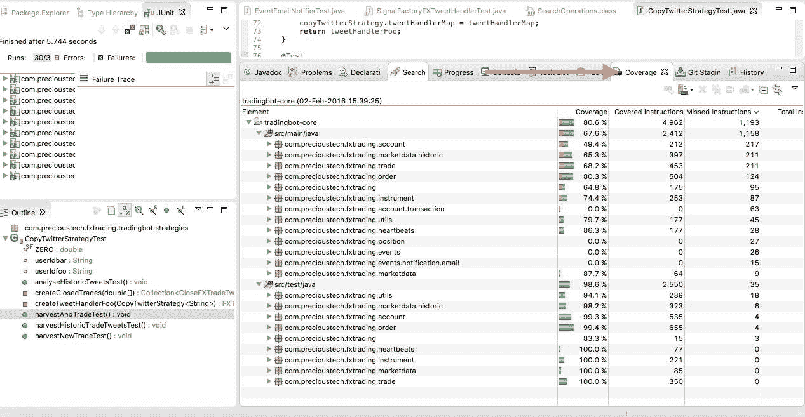 tradingbot-core 项目结果摘要

然后我们可以深入查看单个类，找出单元测试中实际执行了哪些代码行，以及哪些代码行未被覆盖。

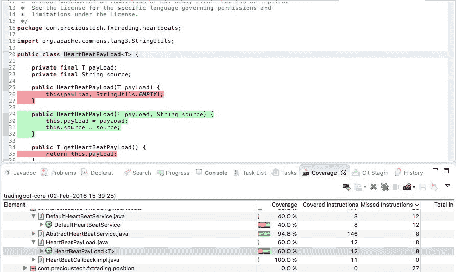 HeartBeatPayLoad 的代码覆盖率

1.  http://mockito.org/↩︎
2.  http://docs.mockito.googlecode.com/hg/1.9.5/org/mockito/Spy.html↩︎
3.  http://eclemma.org/↩︎
