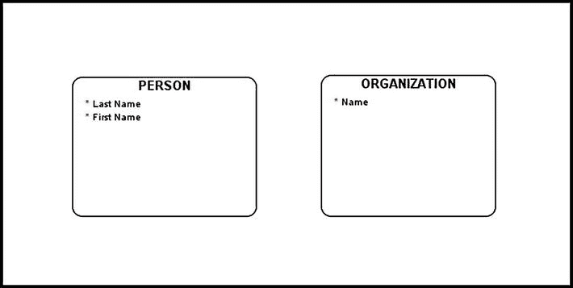
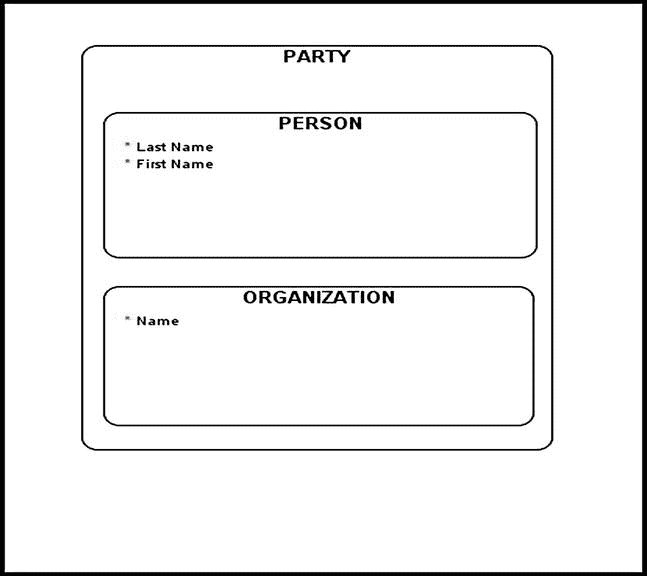
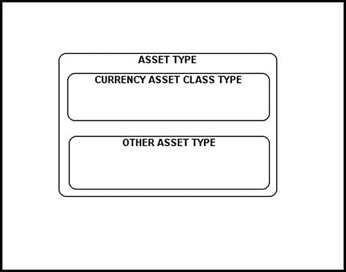
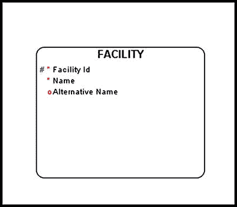
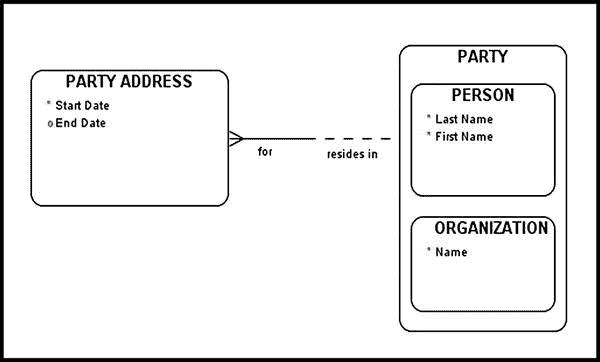

# Barker 表示法

*将每个困难分解成尽可能多、且必要且可行的部分来解决。*

—— 勒内·笛卡尔，《谈谈方法》

本章介绍 Barker 的计算机辅助软件工程（CASE）方法，强调其要点，总结其关键策略，并着重说明美学惯例的重要性。鉴于该方法论是本书的基础而非主要焦点，本章不会深入不必要的内容。本章为您提供必要的基础知识，使您能够轻松理解书中所使用的各种概念图。第一部分阐述了一些基本定义，并解释了 Barker 表示法的一些关键特性。

## 不同类型的数据模型

从业者将数据建模分为两大分支：*概念数据建模*和*结构数据建模*。本书中的实体关系图（ERD）均属于概念数据建模的范畴。用于创建 ERD 的实体关系建模技术由彼得·陈首创。¹

概念数据模型执行以下功能：

*   描述企业本身，而不考虑可能用于实现数据库的技术类型
*   描述对企业具有重要意义的实体及它们之间的关系，这些关系被特意命名，以代表关于企业性质的一对清晰表述

结构数据模型在软件工程中用于以图形方式表示数据库结构及其之间的各种关系。这种数据建模类型又细分为两个子类型：

## 数据模型概述

- *逻辑数据模型*根据将要使用的数据管理技术来描述数据：关系型表和列、面向对象类和属性、XML 标签等等。
- *物理数据模型*具体描述了数据将如何存储在各种存储介质上。

每个数据模型都由三个方面组成：*实体*、*属性*以及它们之间的*关系*。以下章节将对这几个方面进行探讨。

## 实体

*实体*是“一个企业希望为之保存信息的具有重要性的事物”。它是对业务至关重要、业务珍视和看重的东西。它可能是企业生产的产品，也可能是企业提供的服务。实体是感兴趣的事物，而*实体类型*则是一组定义的实体的集合。

在 Barker 表示法中，实体应按以下规范展示：

1.  带有圆角的矩形
2.  实体名称使用大写字母
3.  实体名称不使用单数形式（而是使用复数形式）
4.  实体名称位于实体矩形内部

*图 2-1*。根据 Barker 规范表示的两个示例实体

如果一个实体代表了对组织重要的事物，那么*实体实例*就是存储在该实体中的一行数据。在*图 2-1* 中，`PERSON` 是一个实体，而其中存储的特定记录（`Last Name = "Smith"` 和 `First Name = "Billy"`）就是实体实例。

## 子类型和超类型

你经常会遇到一些实体类型，它们的实例同时也是一个更通用类型的实例。在数据建模领域，第一组实例被称为第二组实例的*子类型*，第二组实例则被称为*超类型*。这在 Barker 表示法中表现为子类型显示在其超类型的*内部*。当你创建一个超类型时，你实际上是人为地为其相似的事物创建了一个容器。

### 在数据模型中表示子类型/超类型

*图 2-2* 展示了一个超类型/子类型结构的示例。该图显示了 `ORGANIZATION` (组织)，为了本练习的目的，我们将其定义为“为完成某个目的而聚集起来的一群人”。这里我们断言每个 `ORGANIZATION` 必须是以下类型之一：

- `DEPARTMENT` (部门)
- `COMPANY` (公司)
- `GOVERNMENT` (政府)
- `GOVERNMENT AGENCY` (政府机构)
- `PROFESSIONAL SOCIETY` (专业学会)
- `OTHER ORGANIZATION` (其他组织)

*图 2-2*。一个组织超类型

注意，该图还断言了根据定义，`DEPARTMENT` 的每个实例也必须是 `ORGANIZATION` 的一个实例，`COMPANY` 的每个实例也必须是 `ORGANIZATION` 的一个实例，以此类推。

在*图 2-3* 中，子类型 `PERSON` (人员) 和 `ORGANIZATION` 包含在超类型 `PARTY` (参与方) 内部。在概念数据模型中创建不同层级（或深度）层次结构的能力是一种强大的工具，它为设计增添了色彩和意义。借助超类型/子类型实体，我们能够阐明某些关系并展示某些业务规则，而这些在概念模型中通常是难以展示的。在不同实体之间建立层次关系的能力不仅简化了设计，而且提高了底层业务规则的清晰度，使模型更少歧义，更具意义。

*图 2-3*。一个简单层次结构的示例

注意，超类型的属性和关系适用于其所有子类型。每个子类型*继承*了这些共同的属性和关系。另一方面，为子类型显示的任何属性和关系对于该子类型来说是唯一的。这些唯一的属性和关系不在子类型之间共享，也不适用于超类型。

通常，一个超类型/子类型结构不应只包含一个子类型，那意味着同一性。如果可能存在其他子类型，你可以通过添加第二个不确定的子类型来表达这一点。例如，在*图 2-4* 中，`ASSET TYPE` (资产类型) 被显示为 `CURRENCY ASSET CLASS TYPE` (货币资产类别类型) 或 `OTHER ASSET TYPE` (其他资产类型)。

*图 2-4*。数据模型中的子类型/超类型

### 子类型/超类型规则

1.  超类型的每个实体实例必须是其某个子类型的实例（*完备规则*）。
2.  超类型的每个实体实例必须只是一个实体子类型的实例（*互斥规则*）。

## 属性

属性是描述实体类型特定特征的一种性质。对于该实体类型的每个实例，该性质都有一个取值。属性不能独立存在，应在相关实体的上下文中进行讨论。属性分为以下三种类型：

1.  唯一标识符（UID），用于唯一标识一个实体实例。UID 实现为主键。
2.  强制属性，其值不能为 `NULL`。
3.  非强制或可选属性。

*图 2-5*。实体属性

根据 Barker 表示法支持的约定：

1.  *列名*前有一个特殊符号：
    - `#` 表示键属性
    - `*` 表示强制属性
    - `o` 表示可选（非强制）属性
2.  列名的每个单词首字母大写。

创建列名时，请尽量避免任何歧义。列名应无歧义且清晰可读；因此，应避免过度缩写。

## 关系

每个*关系*都代表了关于所涉及的两个实体类型的两个强断言。关系名称的定义使得每个方向的关系都可以作为常见的英文语句来阅读。具体来说，生成的句子具有以下结构：

每个 `<主语实体类型名称>`  
必须 （如果主语实体类型旁边的半实线是*实线*）  
（或）  
可以 （如果主语实体类型旁边的半实线是*虚线*）  
`<关系名称>`  
一个或多个 （...如果对象实体类型旁边有“乌鸦脚”(`>`)）  
（或）  
有且只有一个 （...如果对象实体类型旁边没有“乌鸦脚”）  
`<宾语实体类型名称>`

在*图 2-6* 中，我们在 `PARTY` 和 `PARTY ADDRESS` (参与方地址) 实体之间建立了一个关系。在 Barker 表示法中，强制关系用实线表示；非强制关系用虚线表示。*图 2-6* 中的关系表明：

- “每个 `PARTY` 可以*位于*一个或多个 `PARTY ADDRESSES`。”
- “每个 `PARTY ADDRESS` 必须*属于*有且只有一个 `PARTY`。”

*图 2-6*。一个示例关系

David C. Hay 强调了选择合适关系名称的重要性。

