# 哈利·埃利斯与理查德·巴克的洞见

哈利·埃利斯和理查德·巴克带给这个领域的重要洞见并非符号表示法（尽管它确实是最佳的），而是这样一种理念：模型本质上是对一组关于企业本质的自然语言陈述的图形化表示。图形仅仅是做笔记的一种方式。如果你能巧妙地创建关系名称（顺便说一句，这并不是一个微不足道的细节），你就能得到一组领域专家必须表示同意或反对的陈述。

## 关系规则

以下是使用巴克表示法时管控关系的规则：

*   一个关系最多只能存在于两个实体之间。

*   一个实体可以与自身建立关系（称为递归关系）。

*   一个关系有两个视角。

*   给定关系的每个视角都应被标注。

## 子类型之间的关系

图 2-7 强调了子类型本身如何能够参与各种关系。例如，`PARTY` 的一个名为 `PERSON` 的子类型参与与 `PARTY EDUCATION` 的关系。以图形方式在子类型与其他实体之间创建关系的能力，是数据专家的重要辅助工具，也是业界广泛使用的一种手段。

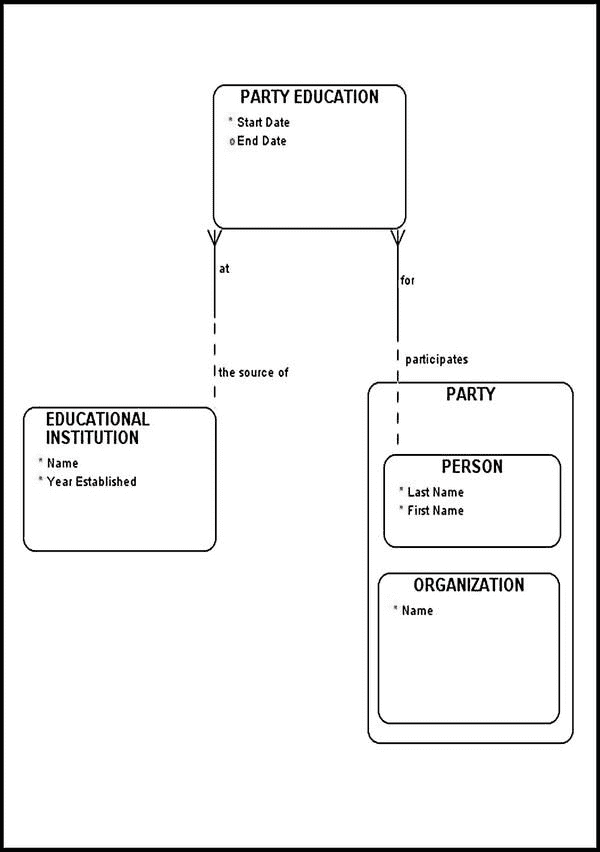

图 2-7. 记录子类型关系

图 2-8 描绘了一种更复杂且微妙的、常常令新手建模者感到困惑的情况。这里我们在同一超类型的两个子类型之间建立了关系。一个 `PERSON` 和一个 `ORGANIZATION` 形成雇佣关系（在模型中由名为 `EMPLOYMENT` 的实体表示）。但如果你的业务需求允许一个 `ORGANIZATION` 与另一个 `ORGANIZATION` 参与雇佣关系呢？这种情况在现实世界中可能发生，例如一家公司分包给另一家公司完成工作。在这种情况下，`EMPLOYMENT` 与 `PERSON` 实体之间的关系应修改为 `EMPLOYMENT` 与 `PARTY` 实体之间的关系，以使关系更具通用性。

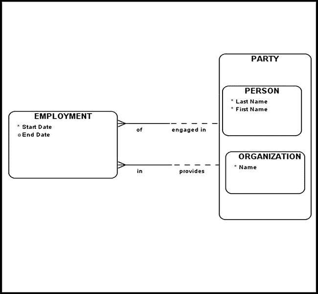

图 2-8. 子类型之间的关系

如果有业务规则规定在某些情况下一个 `PARTY` 可以雇佣另一个 `PARTY` 呢？在这种情况下，我们可能希望建立两个 `PARTY` 与 `EMPLOYMENT` 之间的关系，从而允许 `PARTY` 的任何子类型与另一个 `PARTY` 参与雇佣关系。

## 建模递归关系

自引用关系在数据建模中非常重要。它们被分为三大类：

*   递归多对多关系

*   递归一对多关系

*   递归一对一关系

### 递归一对多关系

一个简单的递归（图 2-9）通常通过让一个外键引用同一实体的主键来实现。这种类型的递归称为*层次结构*。

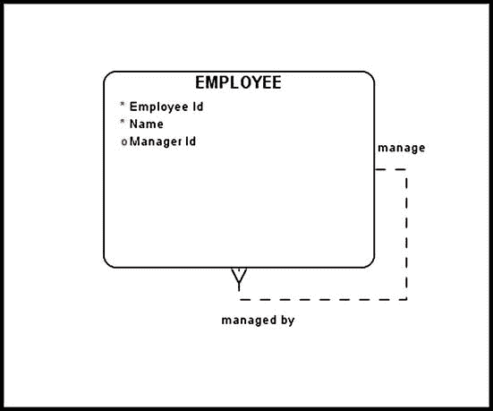

图 2-9. 一对多递归关系示例

图 2-9 中的递归关系可以理解为：

*   每个员工可以管理一名或多名员工

*   每个员工只能被一名且仅被一名员工管理

在数据库管理系统中实现一对多递归关系相对直接。表 2-1 通过让一个外键引用同一实体的主键来展示一个解决方案。

表 2-1. 实现一对多递归关系

| **Employee id** | **Name** | **Manager id** |
| --- | --- | --- |
| 1 | Joe |  |
| 2 | Tony | 1 |
| 3 | Robert | 1 |
| 4 | Richard | 2 |
| 5 | Jane | 2 |
| 6 | Lisa | 3 |
| 7 | Alex | 3 |
| 8 | Ben | 5 |
| 9 | Mark | 5 |
| 10 | Lan | 6 |

### 递归多对多关系

在数据建模中另一种非常重要的递归关系类型是递归*多对多*（M:N）关系。这种关系的结构在图 2-10 中进行了说明。

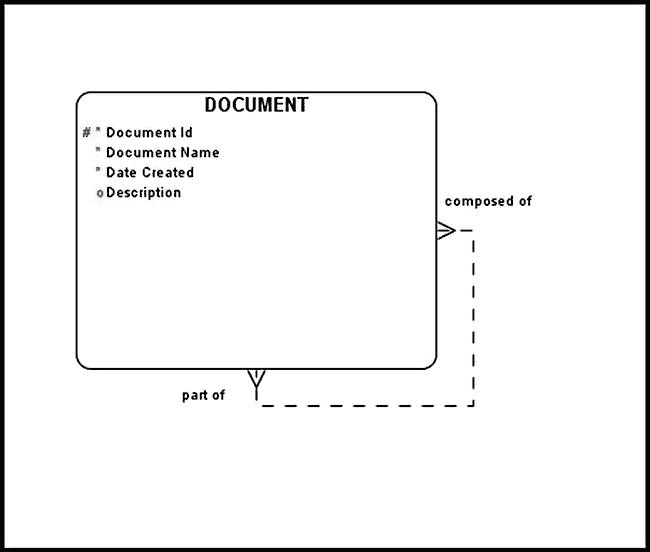

图 2-10. 多对多递归关系示例

该图最初可能看起来令人困惑，但当你记住每个 `DOCUMENT` 可以由其他 `DOCUMENTS`（或子文档）组成时，它就很容易解释了。那么每个 `DOCUMENT`（包含任意数量的子文档）本身也可能是一组文档的一部分，这些文档共同构成另一个更大的 `DOCUMENT`。

递归多对多关系通常无法由现代数据库管理系统直接处理，而必须使用一个 `STRUCTURE` 实体将其转换为两个常见的一对多关系。图 2-11 中的图表描绘了使用 `STRUCTURE` 实体解决递归 M:N 关系的一般方案。请注意，图 2-11 中的模型通常被称为*物料清单*（BOM）结构。

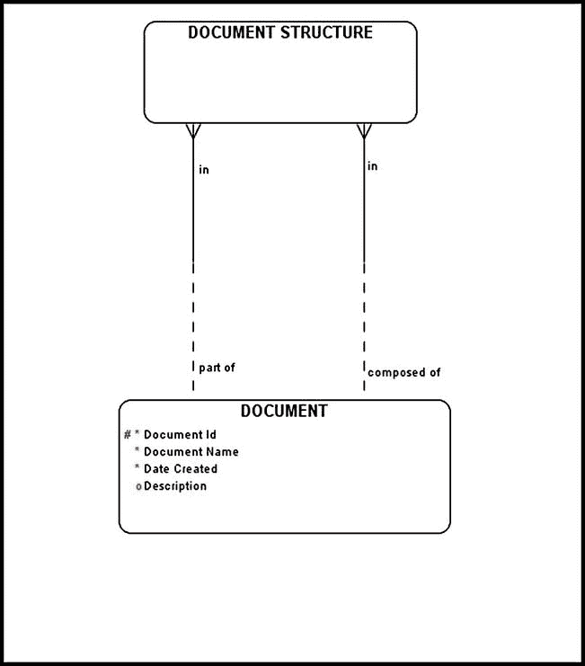

图 2-11. 使用结构实体解决多对多递归关系

这里，借助一个 `DOCUMENT STRUCTURE` 实体，一个递归多对多关系被转换为两个一对多关系。请注意，来自 `DOCUMENT STRUCTURE` 实体的这两个关系是强制性的。

### 递归一对一关系

递归*一对一*关系被称为*链*（图 2-12），其中一个实体实例在任一方向上最多只能与另一个实体实例关联。

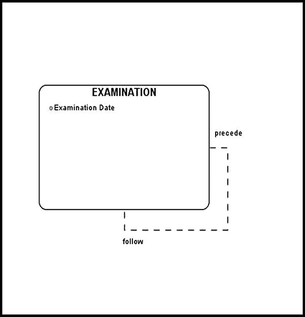

图 2-12. 递归一对一关系

## 冗余关系

在某些情况下，对你的模型进行抽查可能会发现某个关系可以从模型中已有的另一个关系推导出来。这种关系被称为*冗余关系*；它应该从你的模型中移除，连同你可能已经创建的任何相关文档。

图 2-13 展示了 `ORGANIZATION` 与 `COUNTRY` 实体之间一个冗余的“位于”关系；该关系是冗余的，因为相同的信息可以从 `ORGANIZATION` 与 `CITY` 以及 `CITY` 与 `COUNTRY` 实体之间的关系中推导出来。

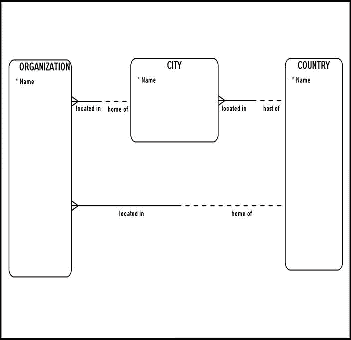

图 2-13. 冗余关系示例（修改前）

图 2-14 展示了与之前相同的信息，但移除了冗余关系。在物理删除任何关系之前，请确保妥善记录你的推理和发现。

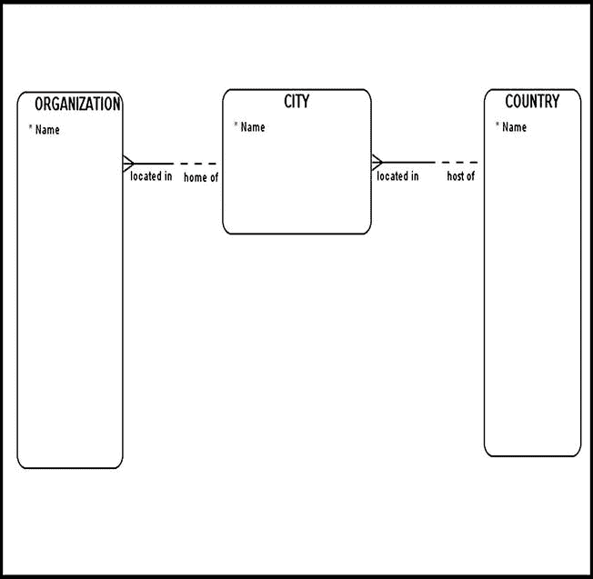

图 2-14. 移除冗余关系后的示例

可能会出现你需要移除的关系在语义上不同，因此无法从已有关系中逻辑推导出来的情况。通常，语义学是语言学的一个子领域，研究词语的含义。此外，*语义*作为一个术语已被广泛应用于理论计算机科学中，指代语言的含义，与之相对的是语言的形式（*语法*）。本书使用*语义*一词的语言学含义，旨在一丝不苟地精确定义模型中使用的词语含义。

例如，假设 `ORGANIZATION` 和 `COUNTRY` 之间的“位于（located in）”关系被替换为“原籍国（country of origin）”关系。一家公司可能成立于 A 国，后来被位于 B 国的另一方收购。该公司可能希望保留原籍国信息，以重构其过往历史。在这种情况下，“原籍国”关系代表了一条宝贵的业务信息，应当被保留。

通常，在从数据模型中删除任何内容（包括任何关系）之前，请就所涉关系的有效性咨询项目利益相关者和领域专家。确保您的模型及底层文档已正确捕获每个关系（包括所涉关系）的含义。只有当所有相关方（即*利益相关者*——包括各领域专家、业务分析师等）确认某个关系确实冗余后，您才能安全地将其从数据模型和底层文档中删除。

到目前为止的每一个图表中，每个关系“多”端（即典型的“事务性”实体）的实体都被放置在参考实体的左侧或上方。我之所以这样构建模型，是因为这种*位置惯例*构成了 Barker 位置惯例方法论的核心。我将在本章稍后部分进一步讨论这个惯例。

## 互斥弧

考虑以下可能需要建模的业务需求：

*一个码头必须由某个海港管理局 (SA) 或某个包船协会 (CBA) 拥有。海港管理局和包船协会都可以拥有多个码头。一旦被一方拥有，码头不得转售。*

您对这个需求建模的首次尝试可能会使用子类型/父类型实体（图 2-15）。然而，子类型/父类型方法在这里并不适用，因为无论是`海港管理局（SEAPORT AUTHORITY）`还是`包船协会（CHARTER BOAT ASSOCIATION）`都不能被概括为`码头（PIER）`。同样，`海港管理局`也不是`码头`的一种特化。因此，可以安全地得出结论，图 2-15 中展示的模型是不可用的，因为它没有展示一个有效的层次结构，而这是创建子类型/父类型关系所必需的。

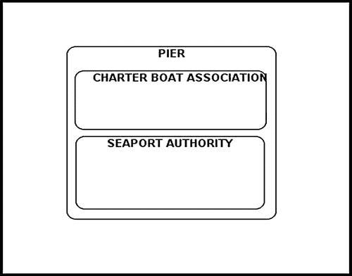

图 2-15. 不合逻辑的子类型（错误方法）

图 2-16 中建模了一种替代方法。根据此图，一个`码头`必须由`海港管理局`或`包船协会`拥有，但不能同时由两者拥有。*互斥弧*允许您在模型中明确无误地展示一条业务规则，该规则清晰地表明在任何一个时间点，这些多个关系中只有一个是有效的。

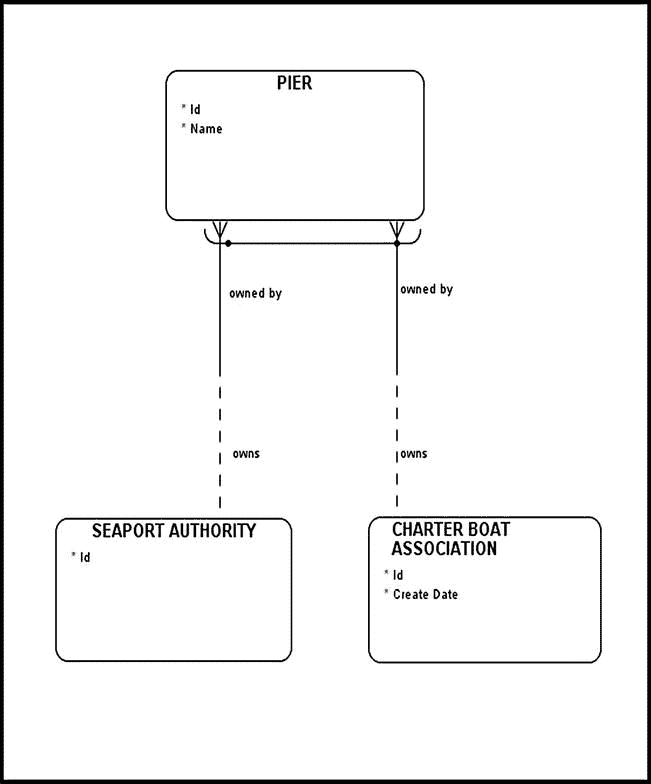

图 2-16。互斥弧的示例

应用了互斥弧关系的实体被称为*目标实体*。在示例中，`码头`是目标实体。一个互斥弧应至少与两个关系相交。您的目标实体将存储指向受互斥弧影响的实体的外键。在我们的例子中，`码头`最终将存储指向`海港管理局`和`包船协会`实体的外键。

## Barker 的位置惯例

Barker 的*位置惯例*方法论阐述了，当所有参考实体都位于相关事务性实体的右侧，并且所有位于“多端”的实体（即所谓的事务性实体）都位于相关参考实体的上方或左侧时，阅读 ERD 会变得更加容易。本质上，这种空间组织方式允许查看者从右侧开始处理数据模型，从参考实体开始，最终转向事务性实体。请严格要求自己遵循 Barker 的位置惯例，您很快会意识到这种风格能产生更清晰、更简洁的设计。这些高度可读的设计使最终用户更容易识别数据模型中的各种问题区域和逻辑缺陷。此外，非技术背景的人员往往更偏好 Barker 的位置惯例，因为它更易于理解；评审者不太容易迷失在实体关系的“蜘蛛网”中。请记住，许多将评审您模型的领域专家可能不熟悉 ERD 建模概念和理论。遵循此处概述的规则，您将能够吸引非技术受众的注意，并有可能在此过程中从他们那里获取一些有用的信息。

图 2-17 展示了一个遵循 Barker 位置规则的示例模型，其中参考实体位于相关事务性实体的右侧，并且所有*事务型*实体（位于“多”端）都位于参考实体的上方或左侧。现在不必担心这个模型的细节；这些将在后续章节中介绍。

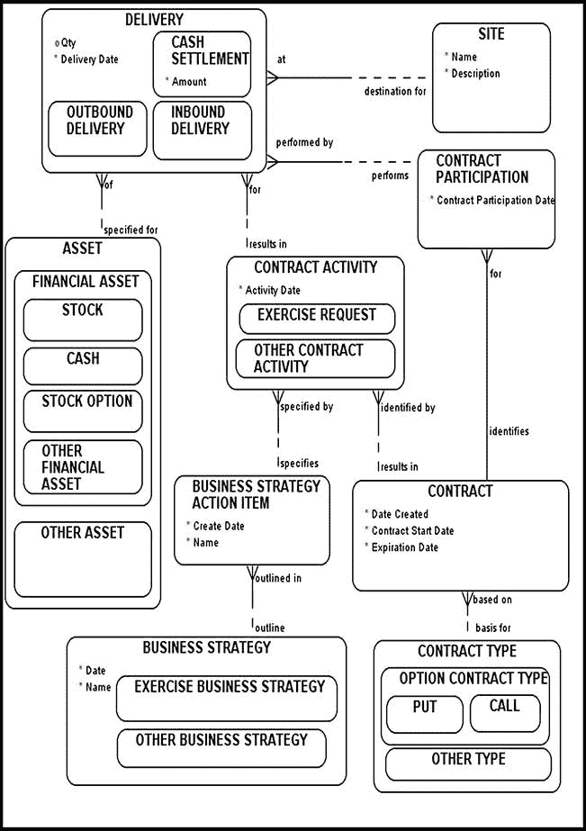

图 2-17。Barker 位置惯例示例

## 结论

Barker 的 CASE 方法论提供了一套强大的数据建模技术，受到全球建模者的使用和赞赏。如果您严格要求自己遵循 Barker 的指导方针，您的数据模型将变得更加用户友好、错误更少，并且您可能会发现自己比以往更能有效地吸引受众。Barker 的方法论不仅使设计更清晰、更简洁，而且还促进了表达更清晰、组织更良好的设计。

本书中的所有图表都基于 Barker 的理念。如果这是您第一次接触 Barker 的 CASE 方法，我强烈建议您查阅此处推荐的阅读材料。

## 推荐阅读

Barker, Richard. *CASE Method: Entity Relationship Modelling*. Addison-Wesley Longman, 1990.

Hay, David C. *Data Model Patterns: Conventions of Thought*. Dorset House, 1995.

_________. *Data Model Patterns: A Metadata Map*. Morgan Kaufmann, 2006.

[¹] Peter Pin-shan Chen, “The Entity-Relationship Model: Toward a Unified View of Data,” *ACM Transactions on Database Systems* (1976), 9–36.

[²] David C. Hay, “Kinds of Data Models and How to Name Them,” Essential Strategies, 2012. PowerPoint presentation available at `http://www.youtube.com/watch?v=PU7nKBNR1Vs`.

[³] Richard Barker, *CASE Method: Entity Relationship Modelling*. Addison-Wesley Longman, 1990.

[⁴] 为了完全符合“流行语标准”（David C. Hay 的说法），您应该知道这种父类型/子类型结构被称为*特化*。

[⁵] 在数据库技术术语中，这些属性是*可空*的。

[⁶] David C. Hay，个人通讯。

[⁷] David C. Hay，个人通讯。

---

## 第 章

金融合约

*我解决的每个问题都变成了一条规则，后来用于解决其他问题。*

——勒内·笛卡尔，《方法论》