# 合同基础

为了为本书后续内容奠定基础，本章定义了相关术语并讨论了金融合同的基础知识。

## 什么是合同？

*合同*是两个或更多方之间具有约束力的协议，约定以特定条款交换指定商品或服务。若要形成有效合同，至少必须有两方参与：提出某事的一方和接受该事的一方（图 3-1）。在特定时间点以特定价格买卖特定产品或服务的协议就是一个简单合同的例子。除了要约人和受要约人之外，其他方也可以以各种身份参与给定合同，例如联合受要约人、代理人、接收人、被引用的子公司和执行人。例如，一方可能起草特定合同，另一方可能对其进行监督。您的组织将提前确定其希望存储和维护的参与者，这很可能基于这些方在基础合同中扮演的角色。

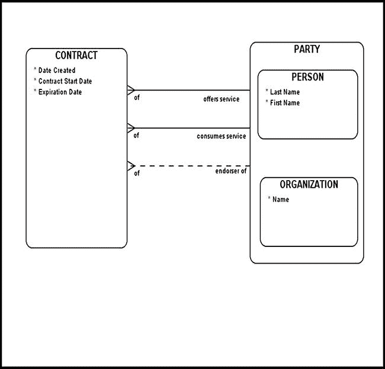

图 3-1. 基本合同模型

一方可以在任何给定合同中扮演多个角色。按图 3-1 建模的`CONTRACT`实体必须与至少两个其他`PARTIES`（通过“提供服务”和“消费服务”关系标识）相关联，而“背书人”关系是可选的。该模型的一个局限性显而易见：它在角色规范方面不易扩展。例如，一个`PARTY`可能为基础`CONTRACT`扮演“法律顾问”或“合同起草人”的角色，模型可能需要考虑到这一点。请记住，合同（尤其是金融合同）可能包含大量细节；它是一种法律文件，其每一个方面可能都需要在模型中表示。面对这种需求，考虑通过向`CONTRACT`实体附加属性来扩展（或拓宽）它是合理的，但这种解决方案既不优雅又高度僵化。通过采用这种方法，我们只能通过*数据定义语言*（`DDL`）来扩展模型，这最终可能需要我们更改编程逻辑。任何尝试过这种方法的人都会告诉您，这对项目架构师和代码开发者来说都是一场噩梦。

图 3-1 中的普通模型的另一个缺陷是缺乏动态创建角色能力。您的组织可能会确定一个其感兴趣存储和维护的角色池。即使这个角色池已获得高层管理批准，也无法保证该列表不会被更改。一种选择是硬编码这些角色；另一种选择是引入一个新实体`ROLE TYPE`，从而为问题提供一个优雅且创造性的解决方案（图 3-2）。

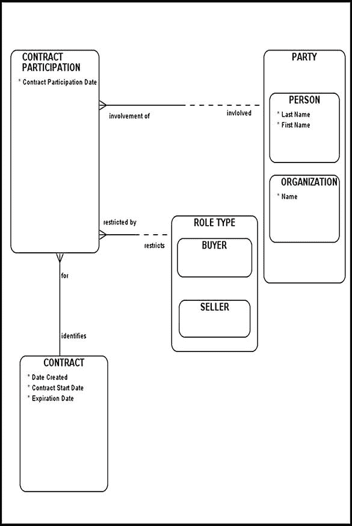

图 3-2. 合同参与模型

请注意`CONTRACT`和`CONTRACT PARTICIPATION`之间的实线（强制）关系。通常，您应谨慎处理两端均为强制的关系（包括一对多关系）。这并不意味着这种配置不存在或应始终避免。两端均为强制的关系确实存在，尽管不常见，但它们服务于特定目的并强调独特的业务规则。

在我们的示例中，两端均为强制的关系强调了一条业务规则：`CONTRACT`和`CONTRACT PARTICIPATION`实体中的条目必须在同一事务中填充。例如，您的编程逻辑必须确保每个合同至少有两个合同参与者，其中一个扮演买方角色，另一个扮演卖方角色。请注意，给定合同可能与其他角色（不仅仅是买方和卖方）相关联，并且应制定一条业务规则，明确指定在给定合同上下文中至关重要的角色类型。

请注意，`CONTRACT PARTICIPATION`实体并非设计用于存储和维护历史数据。如前所述，建模者通常有义务（从法律角度看）维护和跟踪对合同数据的每一次更改。为了维护准确的合同参与历史，我建议创建一个名为`HISTORICAL CONTRACT PARTICIPATION`的新实体，下文将对此进行讨论。

## 维护合同参与历史

图 3-3 中的图表对前一节提出的问题建模了一个解决方案：如何创建和维护一个恰当的合同参与历史。此示例中`HISTORICAL CONTRACT PARTICIPATION`实体的目的是维护和存储对`CONTRACT PARTICIPATION`记录所做的所有更改（插入、更新和删除）。通常，在大型数据库中，您会发现一组以`HIST_`为前缀的表，旨在存储和维护基础表的历史。每当源表中的记录被更改时，数据库触发器就会触发并将必要的更改传播到基础`HIST_`表中。*数据库触发器*是一段附加到表上的代码，用于响应某些预定义事件而执行。

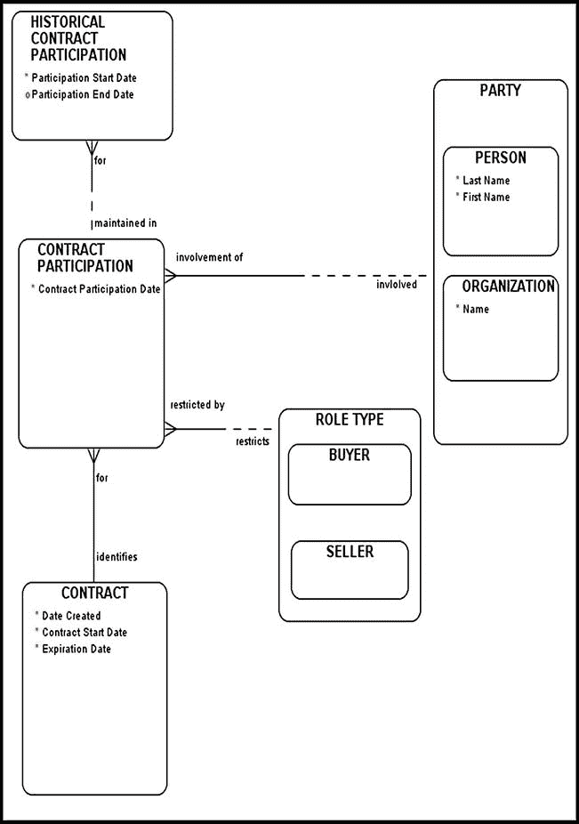

图 3-3. 正确维护的合同参与历史示例

## 区分合同与合同类型

图 3-4 中的模型引入了一个名为`CONTRACT TYPE`的新实体。`CONTRACT TYPE`代表所有可用合同的目录或蓝图。另一方面，`CONTRACT`代表一个法律实体——合同类型的物理体现——至少有两方已在特定日期同意并签署该实体。如果采用*面向对象*（`OO`）术语，我们说`CONTRACT TYPE A`（`CONTRACT TYPE`的子类型）是一个可以实例化的基类。`CONTRACT TYPE A`基类的一个实例就是实际的`CONTRACT`。

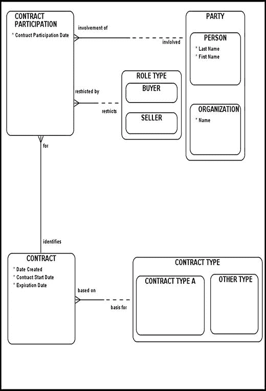

图 3-4. 区分合同与合同类型

## 资产与资产类型

资产与资产类型的核心区别，类似于合同与合同类型的区别（参见图 3-5）。**资产类型**是一种蓝图——仅存在于纸面上，你无法持有或触摸的东西。而**资产**则是一种具有价值、并且可以实际持有和触摸的东西。这种资产与资产类型之间的区别，在金融合同的语境中尤其关键。需要牢记的一点是：如果你不实际持有它，你就不拥有它。遗憾的是，一些商业人士将资产和资产类型混为一谈，并为此付出了代价才学会区分。要训练自己区分纸面资产（资产类型）与实物资产，并对它们分别进行建模。

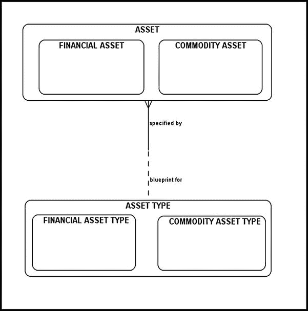

图 3-5 资产与资产类型模型

另一个常常让新手建模者困惑的重要概念是：给定的合同类型会隐含地嵌入一组离散的业务规则。这些底层业务规则对于领域专家来说通常非常熟悉，而我们作为建模者的工作，往往是明确地将给定的合同与正确的合同类型关联起来。例如，假设一家金融公司会处理两种合同类型：合同类型 A 和合同类型 B。合同类型 A 要求参与方预先交换实物资产；合同类型 B 则更为典型，只在合同到期时交换实物资产。如你所见，将给定的合同与错误的合同类型关联起来，会导致诸多不一致和歧义。想象一下，如果某个特定的合同链接到了错误的合同类型上（为了举例，我们假设是合同类型 A），会发生什么。我们的示例合同与合同类型 A 的关系将意味着，底层实物资产需要在合同开始时进行交换。然而，这显然是错误的，而我们最终的数据模型只会让领域专家更加困惑。一个受损的数据模型会立即失去可信度，并承受被贴上“无关紧要”标签的后果。学会正确地将你的模型类型与其物理表现形式关联起来，就能避免这些不必要的歧义和误解。

## 所有权确认的重要性

被确认拥有某种程度所有权的东西被视为资产。资产的例子包括个人持有的股票和贵金属。即使你有一张打印件来确认所有权级别，股票凭证或地契也是具有法律约束力的所有权证明。纸面资产是你并不真正拥有的东西，至少在这种意义上不是。

例如，考虑一下**债务凭证**。在这里，有人借入了一项实物资产（本例中为现金），并承诺通过债务凭证（此时为一种纸面资产）来偿还。遗憾的是，债务凭证只是一张确认债务的纸。试着把它拿到杂货店，递给店员用来交换杂货。很有可能，店员甚至不明白你给的是什么。可以肯定的是，他会拒绝让你带着杂货离开。在你的对手方还清欠款之前，这张债务凭证只能由你自己处理。

**股票期权**是另一个指向纸面资产的例子。期权是一种纸质记录，承诺允许持有人将来在某个特定时间以特定价格购买股票（一种纸面资产）。除非你行使权利购买指定的股票，否则你并不拥有该股票，它也不能计入实物资产组合。

这些例子说明了实物资产和资产类型是不同的，不应混淆。它们各自执行不同的功能，并应在适当的上下文中使用。在大多数情况下（当然也有少数例外），金融合同会指向纸面资产（或资产类型），以表明合同承诺的东西应被视为承诺。

## 建模合同资产分配

图 3-6 中的图表对`合同资产分配`实体及其相关关系进行了建模。如你所见，在初始数据模型中甚至没有显示实物资产。原因是，底层金融合同中列出的每一项资产都是纸面资产（或资产类型）。纸面资产指的是可以被持有，但由他人持有的东西。合同上的主要当事方仅仅是对他人作出的承诺拥有一项索取权。当某人承诺一个月后交付一吨铝时，所考虑的实物资产类型实际上是一种纸面资产（铝资产类型）。众所周知，承诺就是用来被打破的。不要把合同承诺的东西当作资产，因为它们是纸面资产（或资产类型）。只有当你的对手方交付了资产，这些资产才会被计入（或扣除）实物资产库存。

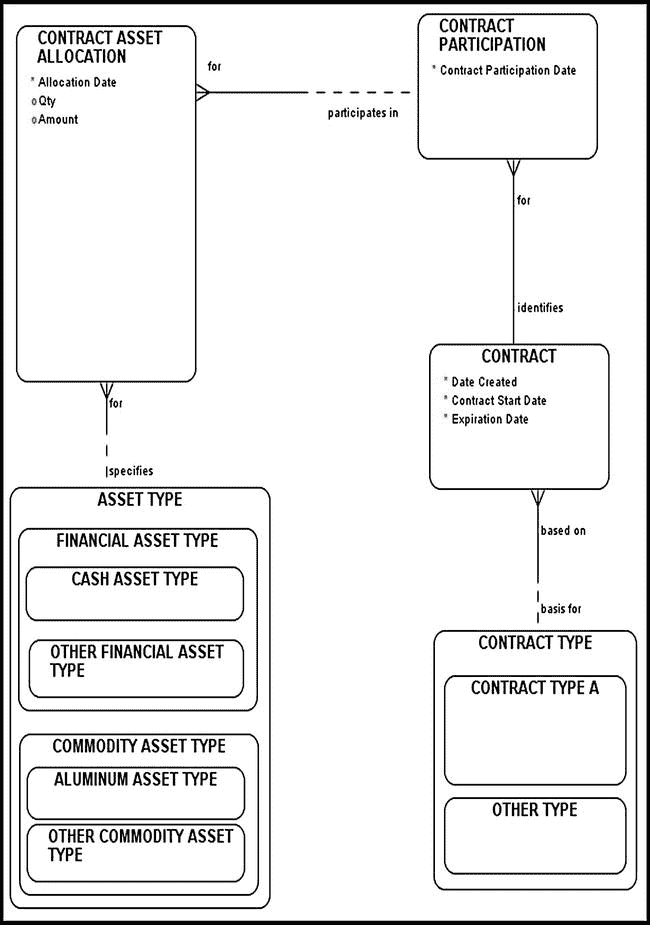

图 3-6 合同与资产类型之间关系的模型

`合同资产分配`指定了在金融`合同`的范围内，每个`当事方`负责哪些纸面资产。金融合同通常涉及两种资产。例如，如果一位投资者承诺交付铜以换取特定金额的现金，那么就涉及两种资产类型：铜资产类型和现金资产类型。这引出了一个有趣的观点：金融合同可以被看作一种机制，在交付完成后，将一种资产转换为另一种资产。在“铜换现金”的例子中，一种资产（现金）在交付完成后被转换为另一种资产（铜）。考虑一个假设的例子，说明如何使用`合同资产分配`。

 **示例** 假设今天是 2014 年 1 月 1 日。投资者 A 与投资者 B 签订了一份合同，同意在 2014 年 7 月 1 日以 10,000 美元购买 10 吨铝。结果就是一份非常简单的合同，涉及两方——投资者 A 和投资者 B，合同到期日为 2014 年 7 月 1 日。请注意，所涉合同涉及两种资产类型：`现金资产类型`（为简化起见，我们在此假设投资者 A 将以现金支付）和`铝资产类型`。由于合同是一种承诺，其底层资产应被视为纸面资产。因此，我们需要在`合同资产分配`中存储两条记录：一条将投资者 A 与`现金资产类型`（`金融`资产类型的一个子类型）和设定的金额 10,000 美元关联起来；另一条记录将投资者 B 与`铝资产类型`（`商品资产类型`的一个子类型）和设定的数量 10 吨关联起来。

图 3-6 中的模型没有提供指定度量单位（此处为吨）的方法。图 3-7 中的图表阐明了这个问题，并展示了如何将`度量单位`与`合同资产分配`相关联。请注意，`合同资产分配`与`度量单位`之间的关系在双方都是非强制性的。这是有意设计的，因为并非每种资产类型都有真正的度量单位。

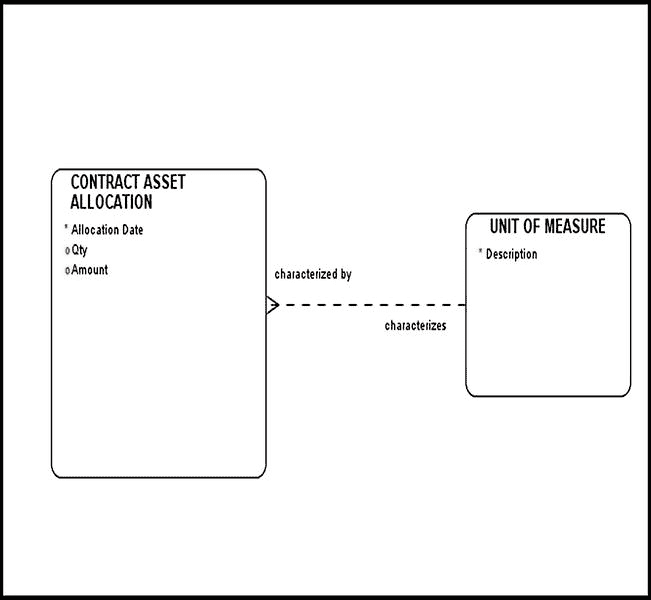

图 3-7 合同资产分配与度量单位之间关系的模型

一旦两个记录存储在`CONTRACT ASSET ALLOCATION`中，您便可以随时返回并重建您的合同条款，以列出所有相关方及其对应角色、所涉及的资产类型以及负责这些资产的相关方。

## 合同结构与合同类型结构

通常，您的需求可能要求创建*复杂合同*——即由其他合同组成的合同。例如，基础业务策略可能涉及在时间`T1`签订一份合同，然后在时间`T2`签订另一份合同，最后在时间`T3`签订第三份合同以抵消前两份合同。听起来复杂吗？它们确实可能很复杂，但这些令人费解的数据结构（图 3-8）在实践中非常常见；明智的做法是在早期阶段就熟悉它们。解释`CONTRACT TYPE STRUCTURE`实体含义的一种方法是，思考各种合同类型可以相互组合的多种方式，从而创建出比基本合同类型所允许的更复杂的结构。将各种实体合同组合成定义良好的模式的能力，产生了由`CONTRACT TYPE STRUCTURE`指定的`CONTRACT STRUCTURE`。

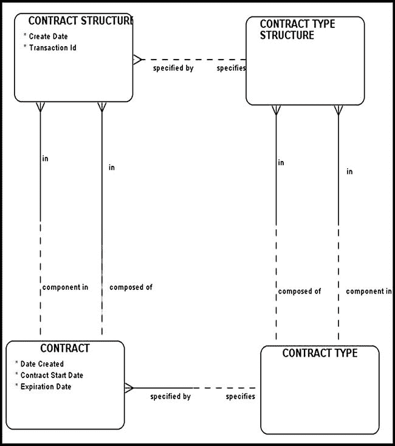

图 3-8. 合同结构与合同类型结构

在金融工程中，给定的金融合同通常与其他合同组合打包，以创建具有特定支付函数的金融工具。这种组合使得基础业务规则更加复杂。然而，一旦您熟悉了基本构建块并理解了这些复杂结构的含义，您就能毫无困惑或犹豫地应用您的知识。

根据您的模型，`CONTRACT STRUCTURE`可能依赖也可能不依赖`CONTRACT TYPE STRUCTURE`。实际上，您可以强制要求这种关系，以强制执行每条`CONTRACT STRUCTURE`必须由一个且仅由一个`CONTRACT TYPE STRUCTURE`指定的规则。通常，您的业务需求将指导您如何塑造最终的数据模型以适应当前客户的需求。

以下假设示例将有助于阐明`CONTRACT STRUCTURE`与`CONTRACT TYPE STRUCTURE`之间的区别。假设您的组织发布了一份官方允许的合同类型列表，以及一份描述这些合同类型应如何组合（包括其特定顺序）的相应规范。此列表非常适合存储在`CONTRACT TYPE STRUCTURE`中。现在考虑一位投资者，他决定签订多份实体合同以创建某种特定的支付函数。我们的投资者签订的实体合同列表应存储在`CONTRACT STRUCTURE`中。如果要强制该投资者在签订实体合同前查阅`CONTRACT TYPE STRUCTURE`数据，则`CONTRACT STRUCTURE`与`CONTRACT TYPE STRUCTURE`之间的关系应修改为强制性关系（在`CONTRACT STRUCTURE`一方）。

## 合同变量及其分配

通常，建模衍生合同涉及将这些合同与各种参数或*变量*关联起来。这些变量的重要性巨大；它们常常几乎独自决定给定金融合同的结果。维护这些变量对金融数据建模者来说至关重要，其设计应极为谨慎。例如，以下变量可能会被用到：

*   特定地理区域的降水量
*   特定地理区域的周、月或日平均温度
*   隐含波动率值
*   `LIBOR`¹ 和无风险利率

您可能会疑惑投资者为何对了解温度和降水量感兴趣。如果投资者参与的是农业合同，他或她将非常有兴趣知道特定区域是否预期会出现干旱，以及其庄稼可能受影响的百分比。

作为将这些变量硬编码到应用程序代码中的一种替代方案，图 3-9 中描绘的模型以更优雅、动态的方式解决了这个问题。² 特定`CONTRACT`与`VARIABLE`之间的多对多关系通过`VARIABLE ASSIGNMENT`交集实体得以解决。在这里，我们可以动态指定用于评估合同并确定其结果的变量。

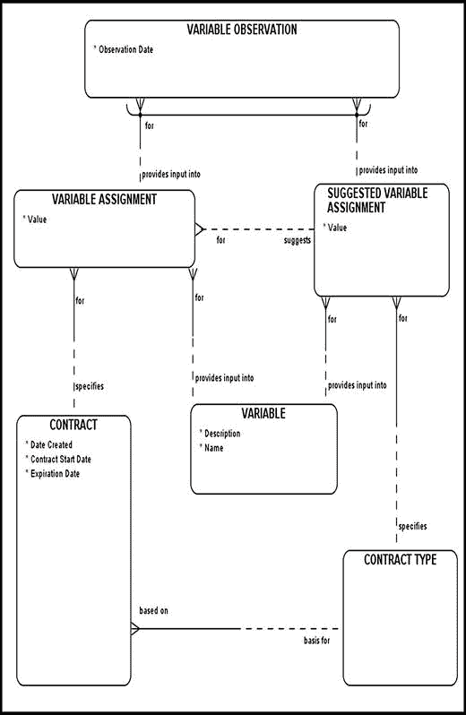

图 3-9. 建模变量

一个建议的`SUGGESTED VARIABLE ASSIGNMENT`交集实体解决了`VARIABLE`与`CONTRACT TYPE`之间的多对多关系。此实体的目的是建议特定合同类型可能需要的变量。您可以将其视为建议，因为`SUGGESTED VARIABLE ASSIGNMENT`与`VARIABLE ASSIGNMENT`之间的关系在双方都是非强制性的。您的需求将指导您如何建模此关系。如有必要，您可以强制此关系为强制性关系，以强制执行每条变量分配必须由一条建议的变量分配来建议的业务规则。`VARIABLE OBSERVATION`实体存储了在特定日期和时间记录的实际变量观测值。从`VARIABLE OBSERVATION`出发的两条关系是互斥的，因为您只能实际观测到合同分配的变量（通过`VARIABLE ASSIGNMENT`）或通过`SUGGESTED VARIABLE ASSIGNMENT`指定的变量。

## 业务策略

本节考虑一个名为`BUSINESS STRATEGY`的实体（参见图 3-10）。*业务策略*概述了一系列旨在维持公司竞争优势的行动。或者，它也可以被视为公司可能用来改善其利润底线的方法。通常，从业者必须在特定金融合同的上下文中对业务策略进行建模。`SETTLEMENT STRATEGY`和`CONTRACT MARKET ASSESSMENT`是业务策略的两个示例。执行特定`BUSINESS STRATEGY`所需的一系列行动项在`BUSINESS STRATEGY ACTION ITEMS`中概述。这些规则通常成为一套*标准操作程序*（SOP），指导企业在特定条件下如何推进以及采取哪些步骤。

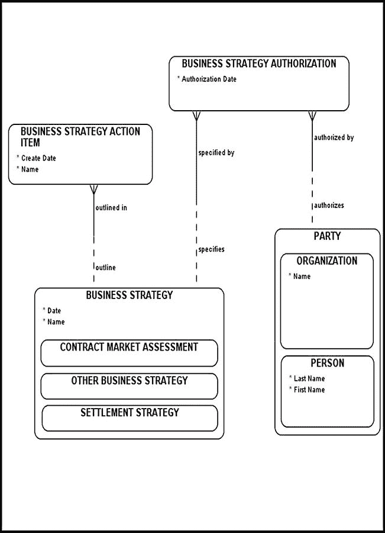

图 3-10. 介绍业务策略与业务策略行动项

以`SETTLEMENT STRATEGY`为例。`BUSINESS STRATEGY ACTION ITEMS`可能概述了组织必须执行的终止特定合同的必要步骤，包括接受入境交付所需的步骤。接受交付是一个极其复杂的过程，需要众多方的合作。例如，为了接受对手方的交付，组织必须：

*   安排资产运输到最终目的地。
*   确定负责特定活动的个人。

这些细节必须提前规划好，以使组织准备好接受外部来源的交付。

作为每个业务的关键组成部分，业务策略在实施前必须获得批准。`BUSINESS STRATEGY AUTHORIZATION`列出了已授权特定`BUSINESS STRATEGY`的各相关方以及授权发生的对应日期。

## 抵押品

为了最大限度地降低违约风险，参与金融合同的各方通常需要向第三方存入一笔“抵押品”存款。然而，抵押品存款并非强制要求，需要双方同意。有时，只有信用评级较低的一方有义务进行存款。谁存款、存款的金额和形式将由签订合同的双方协商确定。抵押品用于保护合同参与者免受违约损失。最简单的抵押品方案仅要求合同参与者在合同生效日存入一次款项，无需任何额外存款。更复杂的抵押品方案可能涉及衡量市场波动，并要求合同参与者追加存款（有时甚至每日追加）以反映市场变化。

图 3-11 描述了一个基础抵押品数据模型。为保持重点突出且简洁，该图仅列出对当前讨论有意义的实体。需要注意的是，`COLLATERAL`（抵押品）与实际的物理资产相关。`PARTY`（参与方）与`COLLATERAL`（抵押品）之间的关系有助于我们识别任何可能暂时持有合同中引用的物理资产的第三方。根据我们的模型，第三方可以是`PERSON`（个人）或`ORGANIZATION`（组织）。

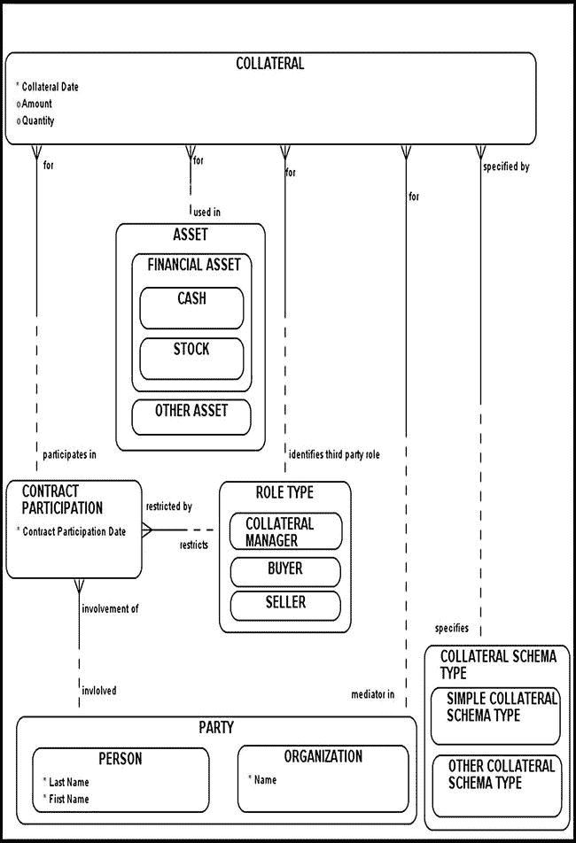

图 3-11。远期合同抵押品模型

考虑以下假设示例。两家公司 A 和 B 已同意签订一份金融合同并存入抵押品。该合同的条款如下：

*   A 公司同意以 10,000 美元的价格从 B 公司购买一吨铜。
*   合同生效日为 2014 年 6 月 1 日，合同到期日为 2014 年 12 月 1 日。
*   双方公司同意在 2014 年 6 月 1 日至 2014 年 12 月 1 日期间，向第三方 C 公司各存入 10,000 美元（作为抵押品存款）。

在此案例中，选择了最简单的抵押品方案，抵押品付款仅存入一次。

## 合同交付（Contract Delivery）

合同交付建模（图 3-12）涉及`DELIVERY`（交付）实体及其关联的子类型，包括：

*   `OUTBOUND DELIVERY`（出库交付）
*   `INBOUND DELIVERY`（入库交付）
*   `CASH SETTLEMENT`（现金结算）

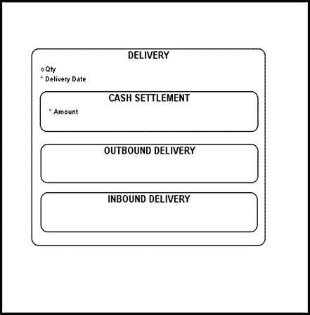

图 3-12。交付子类型

当一方为履行合同（无论是全部还是部分）而交付资产时，即构成“出库交付”。当一方接收用于履行合同（无论是全部还是部分）的资产时，即构成“入库交付”。“现金结算”是交付的另一种子类型，在金融合同结算中扮演着重要角色。很大比例的金融合同只能以现金结算。请注意，在所有情况下（无论是现金结算还是入库/出库交付），至少会收到一项物理资产。

对交付实体划分子类型的最重要原因是法律上的考虑。当对特定交付方法的合法性产生疑问时，将特定合同与交付子类型关联起来就显得尤为重要。所有合同，尤其是金融合同，都可能产生法律后果。模型应反映并能够重建每一个法律细节，无论其多么微小。交付主题领域是法律难题的关键部分，应谨慎描述和建模。

交付主题领域的另一个有趣方面是“部分交付”的概念。当买方仅收到约定数量的部分物品时，就会发生部分交付。例如，投资者 A 可能预期在某个日期前收到 10 吨铝棒。对手方投资者 B 可能在该日期前只能交付 9 吨铝棒。在大多数情况下，投资者 A 会推迟向投资者 B 付款，直到全部数量（10 吨）交付完毕。

您的基础业务规则可能允许部分交付，在这种情况下，您可能需要对它们进行建模。图 3-13 中的模型展示了如何使用现在应该已经熟悉的一对多递归关系来建模部分交付。（为了简洁，从该模型中移除了`CASH SETTLEMENT`子类型。）部分交付在实践中并不常见的主要原因是仓储和运输成本高昂。现代经济学理论告诉我们，没有“免费的午餐”，总得有人为此买单（而大多数金融合同参与者都不愿意这样做）。

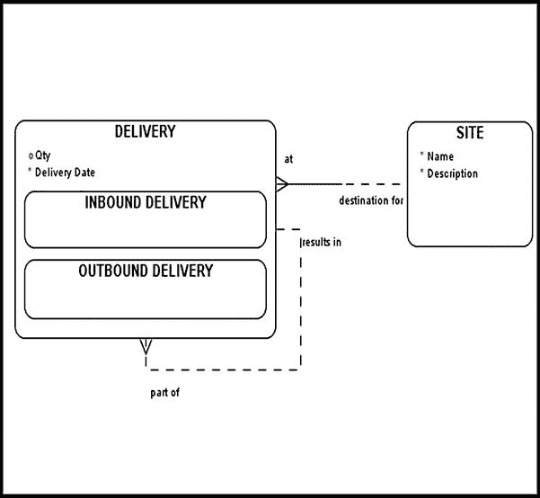

图 3-13。部分交付建模

图 3-14 对合同的交付主题领域进行了建模。（为清晰简洁起见，图中未包含与当前讨论无关的实体。）代表特定合同执行的那些活动存储在`CONTRACT ACTIVITY`（合同活动）中。这些合同活动由`BUSINESS STRATEGY ACTION ITEMS`（业务战略行动项）指定，而这些行动项又由`BUSINESS STRATEGY`（业务战略）标识。`SETTLEMENT STRATEGY`（结算策略）是`BUSINESS STRATEGY`（业务战略）的一个子类型，专门用于处理合同的结算，并概述了实现该结算所需的必要步骤。`SETTLEMENT RELATED ACTIVITY`（结算相关活动）是`CONTRACT ACTIVITY`（合同活动）的一个子类型，它将代表特定`CONTRACT`（合同）执行的所有结算活动分组在一起。

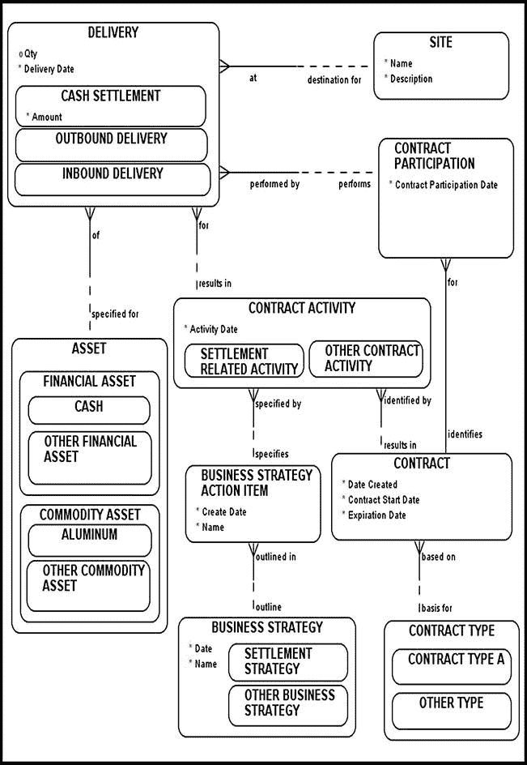

图 3-14。合同交付

`SETTLEMENT RELATED ACTIVITIES`（结算相关活动）可能导致物理资产的实际`DELIVERY`（交付）。在特定合同的背景下，“交付”可能意味着多种情况。最熟悉的例子是资产交换的发生：一方交付一吨铜（一种资产）并收到另一种资产作为回报（例如现金）。有时，特定合同会导致现金结算。在现金结算下，一方根据合同约定金额与资产当前市场价格（称为资产的“现货价格”）之间的价差，向对手方支付一定数额的现金。

与`DELIVERY`（交付）关联的`SITE`（地点）可以是物理地址（从而指定交付地址）。例如，当一方将玉米交付到特定仓库时，`SITE`（地点）将标识其位置（或物理地址）。

## 合同监管（Contract Regulations）

合同是一种承诺，而承诺常常被违背。违背承诺的潜在最终结果是一场旷日持久的诉讼（图 3-15）。

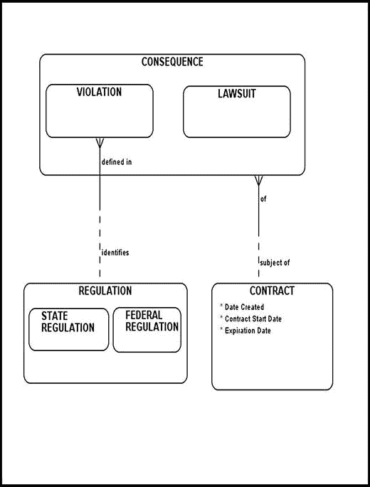

图 3-15。合同监管建模

考虑以下场景。农场主 A 决定从农场主 B 处购买一头牛，他们签署了一份合同。农场主 A 检查了农场主 B 的牛群，双方农场主就某一头牛达成一致。此外，双方农场主均同意该牛是不育的，并以书面形式就以下条款达成一致：

*   支付方式（现金）
*   支付金额（每磅 0.90 美元）
*   交付日期

