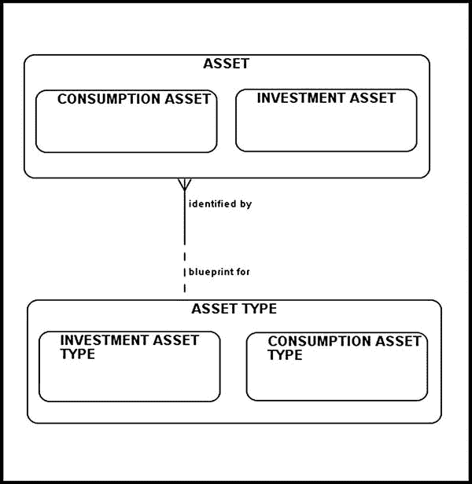
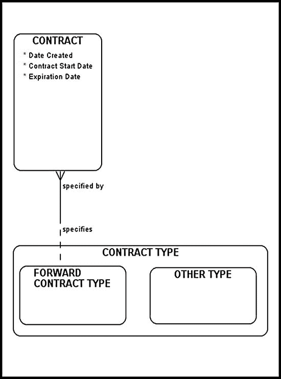
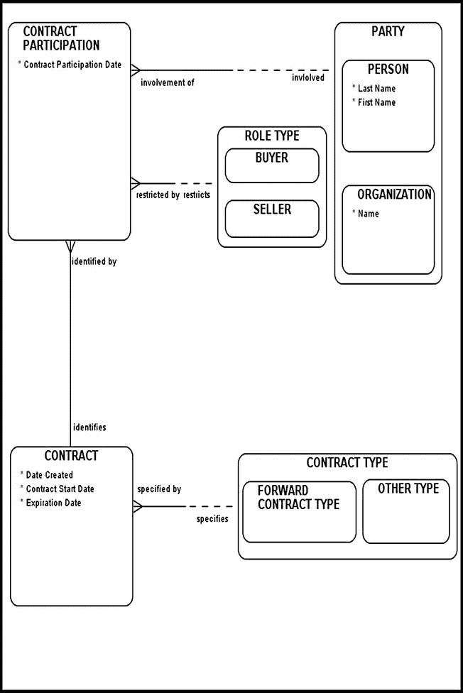
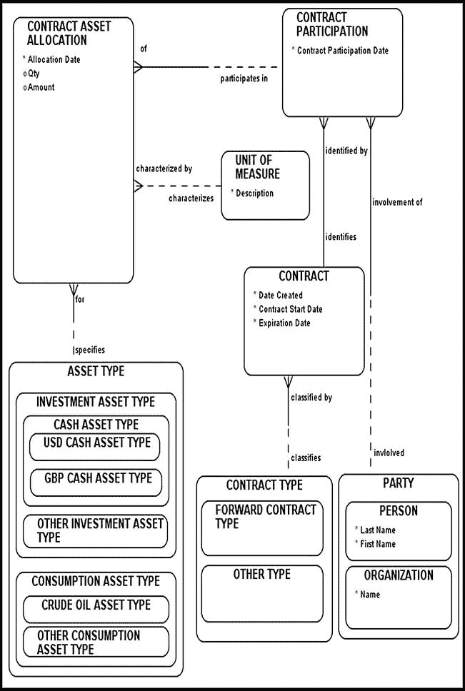
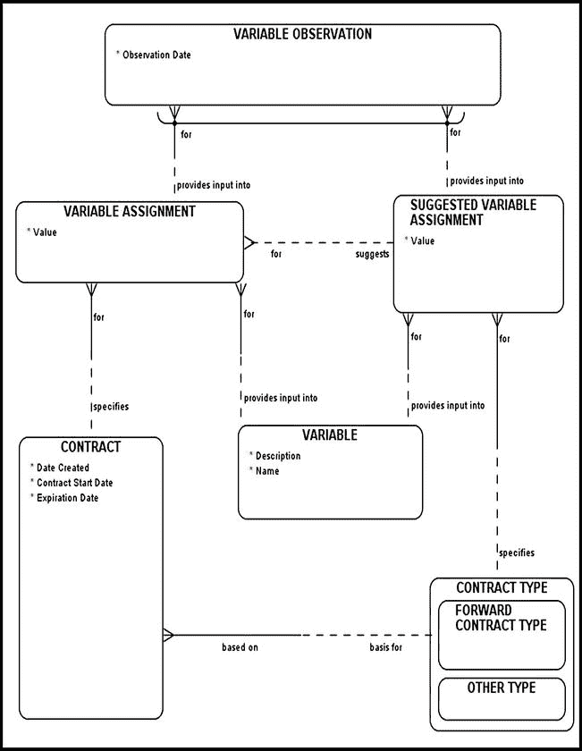
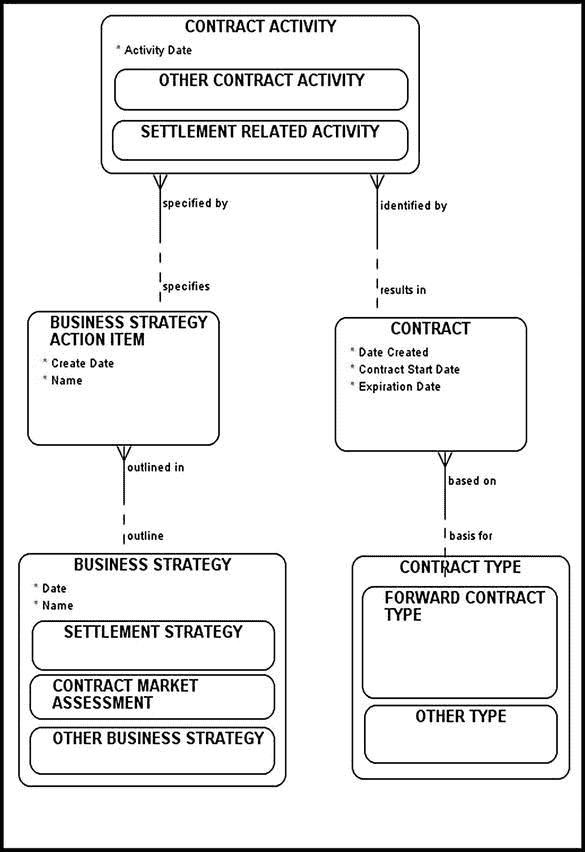

# 远期合约建模

*我希望后人在评判我时能心怀善意，不仅因为我所解释的事物，也因为我刻意省略的内容，以便将发现的乐趣留给他人。*

——勒内·笛卡尔，《几何学》

本章探讨了在场外交易（OTC）市场中极为流行的一种合约类型——**远期合约**（或简称为**远期**）的具体细节、运作机制及术语。开篇部分定义了远期合约并描述了其相关的业务规则。

## 定义远期合约

**远期合约**是双方之间达成的协议，约定在未来某个双方同意的日期，以特定价格买入或卖出某项资产。它通常与另一种相对简单的合约类型——**即期合约**——进行对比。即期合约是双方之间达成的关于当日买入或卖出某项资产的协议。

远期合约是一种**非标准化合约**，意味着它不在主要的金融交易所交易，因此被认为风险更高，即其中一方违约而不履行买入或卖出义务的可能性更大。非标准化合约通常涉及能够承受此类风险的大型金融机构。由于远期合约是非标准化的，它们需要相对较长的时间进行谈判和执行。有些组织专门负责创建场外交易合约（包括远期合约）所依据的各种文件。这些文件是可以根据当事方特定需求定制的模板。第 8 章将讨论这些文件及其相关结构。

## 远期合约规格

同意在未来某个时间点买入资产的当事方，在给定的远期合约中持有**多头**头寸。同意在未来某个时间点卖出资产的当事方，在给定的远期合约中持有**空头**头寸。**即期价格**是某项资产当前的价格。与之相对的是**远期价格**（又称**交割价格**），这是双方同意的资产未来价格。

例如，考虑一位需要在 2015 年 1 月 1 日偿还 `1,000,000` 英镑的投资者。假设今天是 2014 年 1 月 1 日。这位私人投资者预感美元兑英镑汇率可能上涨（因此，购买英镑需要更多美元）。投资者可以考虑的一种策略是同意银行提出的**卖价**，并签订一份 12 个月的远期合约（表 4-1）。因此，投资者同意在一年后以 2,039,000 美元的价格从银行购买 `1,000,000` 英镑。由于他同意购买一种特定货币（英镑），这位私人投资者在基础远期合约中持有多头头寸。另一方面，银行同意以 2,039,000 美元的价格卖出 `1,000,000` 英镑，因此在基础远期合约中持有空头头寸。私人投资者与银行签署的远期合约成为具有约束力的协议，双方均同意在签署之日起一年后履行该协议。

请注意，表 4-1 标题中的术语**买价**和**卖价**是从提供这些价格的金融机构的角度出发的。买价是金融机构准备购买特定资产而支付的价格。卖价是金融机构的卖出价格。

表 4-1. 买价/卖价报价

| 即期价格 | 买价 | 卖价 |
| --- | --- | --- |
| 1 个月远期合约 | 2.0345 | 2.0351 |
| 6 个月远期合约 | 2.0312 | 2.0321 |
| 12 个月远期合约 | 2.031 | 2.039 |

特定远期合约的标的`ASSET`可归入以下两类之一：`INVESTMENT ASSET`或`CONSUMPTION ASSET`（图 4-1）。**消费资产**的主要目的是保持业务平稳运行——例如，持续供应天然气以保持熔炉燃烧，或供应机油以保持飞机飞行。如果没有开展业务所需的原材料，公司可能面临重大损失、停工停业以及无力支付工资的风险。另一方面，**投资资产**则用于投机目的（例如股票和债券）。

图 4-1. 消费资产与投资资产/资产类型

平仓或取消远期合约非常困难，这也是场外交易市场最主要的缺点之一。到期时，远期合约会导致以下结果之一：

1.  资产的实物交割

2.  现金结算

3.  其中一方违约

## 远期合约终止

“远期合约终止”一节讨论了投资者可能用于提前终止远期合约以保护自身免受不利结果影响的各种策略。

本章的讨论基于以下假设：

1.  至少有两方参与某份远期合约。具体而言，一方持有多头头寸（买方），其对手方持有空头头寸（卖方）。

2.  多头和空头头寸不可转让。

3.  其他方也可能参与远期合约，从法律角度来看，存储并维护这些数据非常重要。

4.  远期合约涉及的资产必须被明确列出，并与负责这些资产的相关方明确关联。

5.  远期合约可能产生多种业务活动，出于监管目的，应对这些活动进行追踪记录。

6.  远期合约会导致交割、现金结算或违约。

本章根据特定的主题领域，分步骤对远期合约进行建模。以这种方式建模的图表更容易阅读、管理和解释，因为它们包含了较少的干扰信息。

## 合约类型子类型化

图 4-2（除其他内容外）描绘了将`合约类型`子类型化为`远期合约类型`和`其他类型`。您的组织可能会处理各种其他合约类型（例如掉期和期货）。如果是这种情况，请确保在您现有的远期合约类型之外，将所有这些合约类型添加为子类型。

图 4-2. 合约类型子类型化

图 4-2 体现了数据模型展示管理的基本原则：保持简单、聚焦和简洁。将多余的细节排除在数据模型之外，可以使技术和非技术最终用户都能轻松理解，并使您的演示更具成效。

## 远期合约数据建模基础

图 4-3 展示了远期合约数据模型构建的第一步。此时的模型仍然缺少本章开头确定的某些主要部分，这些部分将在后续章节中逐步添加。

图 4-3. 远期合约的数据建模基础

`合约参与`实体旨在存储并维护某一方或多方的参与行为，以及它们在某份远期合约中可能扮演的角色。您的组织将帮助您识别这些合约参与角色。风险在金融合约中始终扮演着重要角色，远期合约也不例外。在不受监管和控制的环境中交易是有风险的，因为总存在一方无法履行承诺或合约的可能性。从监管角度来看，您的组织可能有义务追踪每位合约参与者。无论如何，`合约参与`实体中至少需要有两个实体实例（或条目）；它们是扮演`买方`和`卖方`角色的两方。顺带一提，这一特定的业务规则无法直接在图中显示。请注意`合约`和`合约参与`之间存在的（双方）强制性关系。再次强调，要谨慎处理双方都是强制性的关系。毕竟，双方都是强制性的关系迫使我们回答一个“先有鸡还是先有蛋”的因果困境。尽管双方都是强制性的真实关系在实践中很少见，但它确实会发生，而您完全有权利质疑其有效性。在我们的案例中，`合约`和`合约参与`之间的强制关系意味着这些实体应作为同一事务的一部分进行填充。换句话说，每当您填充`合约`数据时，请确保在`合约参与`中至少插入两条记录，即一位`买方`和一位`卖方`。

`合约`存储合约特定的信息，例如合约开始日期、到期日期和合约创建日期。`合约类型`指定特定的合约模板，以及某份合约隐式继承的相应业务规则。

图 4-3 数据模型的大部分特征和组件都很熟悉，因为它们已在第 3 章中讨论过。这里介绍的许多建模片段和概念会在本书中反复出现，因为它们提供的模型具备容纳变更的能力。在大多数领域，尤其是金融数据建模领域，从头匆忙构建模型是禁忌。建模模式是经过建模界普遍测试和认可的设计。它们已在多个平台上成功部署，并且足够通用以适应各种变化。通过识别特定的建模模式并将其应用于解决特定的业务问题，您将显著提升设计的整体质量，并改善与最终用户的沟通，因为行业认可的设计模式通常直观且易于实现。

## 将远期合约与资产类型关联

图 4-3 缺少与资产类型（或纸质资产）的关联。这一缺陷在图 4-4 的模型中得到了弥补。

图 4-4. 远期合约与合约资产分配

`合约资产分配`实体的目的是，在特定`合约`的背景下，追踪每个`参与方`（通过`合约参与`实现）负责哪些基础`资产类型`。例如，假设：

-   投资者 A 同意以 10,000 美元的价格从投资者 B 处购买 100 桶原油，

-   合约开始日期为 2014 年 1 月 1 日，

-   合约到期日期为 2014 年 7 月 1 日。

该特定远期合约涉及两种资产类型：`原油资产类型`（`消耗性资产类型`的子类型）和`现金资产类型`（`投资性资产类型`的子类型）。`合约资产分配`的目的是将每个合约参与者（即买方和卖方）与相应的`资产类型`及其对应的金额和数量（视情况而定）关联起来，所有这些操作都在给定的远期合约背景下执行。

请注意，图 4-4 的图表并未将`合约资产分配`与实物资产关联起来。这并非疏漏，而是有意为之，因为合约代表的是交付某物的承诺，而承诺终究只是承诺。一方随时可能违约，未能履行其未偿义务。只有到了交割阶段，我们才能将焦点转移，开始讨论实物资产；在此之前，我们必须专注于对资产类型进行建模。

`合约资产分配`用于存储金额和数量属性。在该示例中，投资者 A 与一个`现金资产类型`（`投资性资产类型`的子类型）相关联，金额设置为 10,000 美元。`现金资产类型`可进一步细分为`美元现金资产类型`和`英镑现金资产类型`，以精确定义金额。投资者 B 与`原油资产类型`（`消耗性资产类型`的子类型）相关联，数量属性设置为 100。然而，仅知道投资者 B 与`原油资产类型`相关联且数量属性设置为 100，并不足以重构我们的合约条款，因为我们不知道其底层计量单位。这就是`计量单位`实体发挥作用的地方，它帮助我们明确`原油资产类型`的数量是以桶为单位计量的。我们假设双方都已精确定义了合约中“油桶”的含义。例如，在美国和加拿大，一桶油相当于 42 美制加仑。为了保持灵活性，另一种方案是以美制加仑为单位指定计量单位，并将数量从桶数转换为加仑数（100 x 42）。还有一种方案是采用公制，以升为单位指定计量单位。

请注意，`计量单位`与`合约资产分配`之间的关系在双方都是非强制性的。这种设计是故意的，因为`计量单位`的规格（在`合约资产分配`的背景下）可能不适用；这取决于底层`资产类型`的性质。

如果你仔细审视并分析我们的初始数据模型，你应该会注意到，我们可以轻松重构合约的性质，以确定每个`交易方`负责哪个`资产类型`，以及相关的数量和金额属性。

## 远期合约与变量分配

为了正确地对远期合约进行建模，我们需要考虑那些在决定这些合约结果中起作用的变量——例如货币兑换率、伦敦银行间同业拆借利率、无风险利率以及到期时间。除了分配变量外，我们还应该能够在任何特定时间点对远期合约进行估值。

图 4-5 在给定合约的背景下对变量进行了建模。`建议变量分配`是一个交叉实体，用于解析`变量实体`与`合约类型`之间的多对多关系。`建议变量分配`实体维护了一个组织层面建议的、通用的变量列表，这些变量通常用于特定`合约类型`的背景下。其中一些变量用于对给定的`合约`进行估值。例如，各种利率和货币兑换率都可以作为变量在模型中存储和维护。后续章节将探讨存储这些项目的其他方法。

图 4-5. 远期合约与变量分配

另一方面，`变量分配`则对`变量实体`与`合约`之间的关联进行建模。通过`建议变量分配`指定的变量，可能与实际分配给特定`合约`的变量有所不同。例如，你的组织可能会确定一组通用的市场变量，供特定`合约类型`存储和维护。然而，在特殊情况下（尤其是在处理非标准合同时），组织可能希望维护一组特定于某个`合约`的市场变量。例如，如果你在处理一份购买玉米的远期合约，你可能需要维护某一特定地区的温度；实现这一点的一种方法是使用合约特定变量。此外，你的标准普通远期合约可能要求你存储和维护隐含资产波动率，而你应该能够相对轻松地满足此类需求。

请注意，`变量分配`与`建议变量分配`之间的关系在双方都是非强制性的。换句话说，在我们的模型中，`建议变量分配`可以“建议”`变量分配`。你可能需要修改这一点，使该关系变为强制性（在`变量分配`一侧）。通常，你的需求将指导你如何推进。

`变量观测`实体存储对相关变量进行实际物理观测的结果：包括它们的值以及进行特定观测时的相应日期和时间。请注意，`变量观测`实体周围存在独占性弧，这表明它可以存储`变量分配`或`建议变量分配`，但不能同时存储两者。

金融工程师的工作是获取这些市场变量，将它们代入各种统计模型，并在特定时间点用于对给定的远期合约进行估值。将这些变量应用于各种数学模型的实际过程，将由你的流程架构师为你单独描述。

## 将远期合约与业务策略关联

图 4-6 对`合约`与`业务策略`之间的关联进行了建模。如第 3 章所述，`业务策略`对组织认为重要的事物进行分类。`业务策略`是`结算策略`和`合约市场评估`进行分类的实体；执行特定策略所需的行动项被记录为`业务策略行动项`。`合约活动`维护在给定远期合约背景下执行的各种`业务策略行动项`。部分`合约活动`（细分为`结算相关活动`）将导致实物交割。

图 4-6. 将远期合约与业务策略关联

本节将审视`业务策略`的子类型`结算策略`。设想一位投资者预计将以每磅 0.96 美元的价格接收 50,000 磅活牛。在远期合约终止时，投资者的对手方将把牛交付到一个双方商定的仓库。一旦交割完成，投资者将寻找将牛从仓库运输到最终目的地的方法。任何运输延误都可能导致高昂的仓储费。此外，一旦投资者接收了这批入境的牲畜，他还需负责其喂养。从这个简单的假设案例可以看出，为了执行给定的结算策略，需要执行许多由组织定义的行动项。