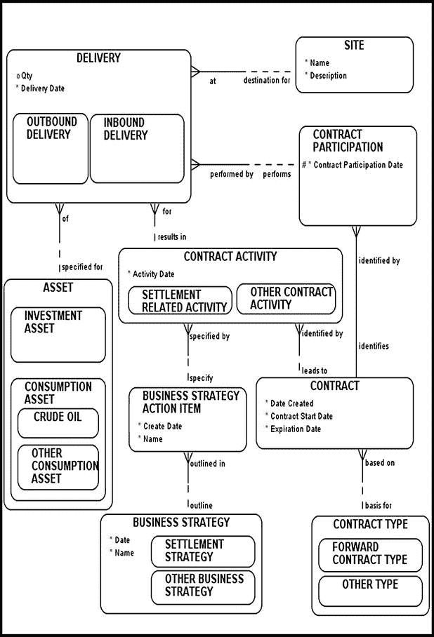
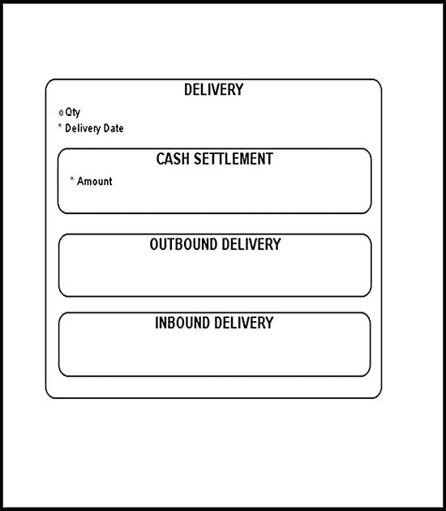
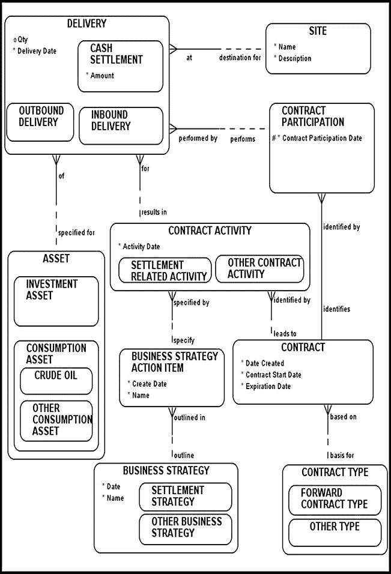
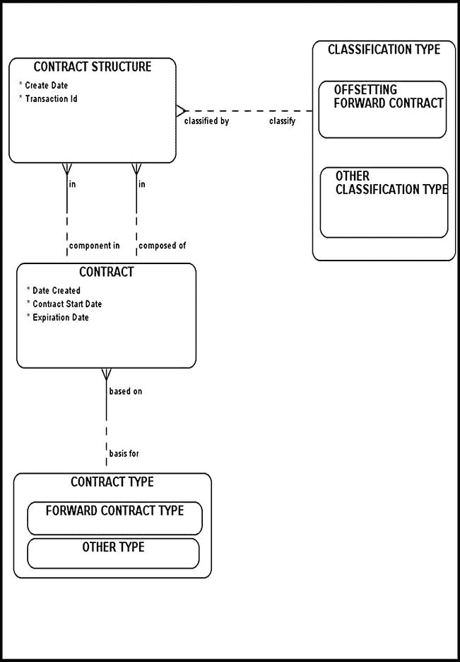
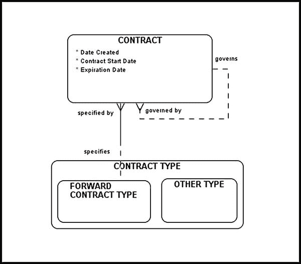
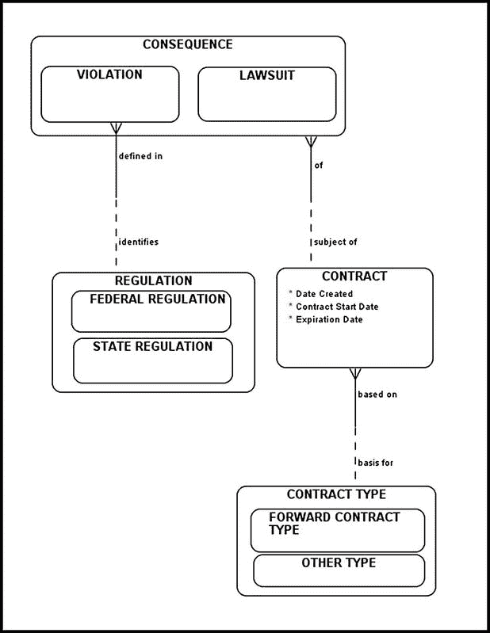
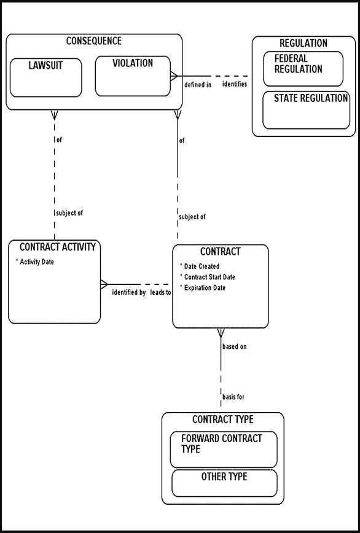

# 排版后的文档

## 结算策略

通常，结算策略是一个复杂的机制，包含许多活动部件，其中一个活动的成功依赖于其他精心规划活动的顺利完成。任何偏离计划的情况都可能耗费时间和金钱。为满足合同中的`SETTLEMENT STRATEGY`而实际执行的`BUSINESS STRATEGY ACTION ITEMS`存储在`CONTRACT ACTIVITY`中，并归入`SETTLEMENT RELATED ACTIVITIES`（请参见图 4-6）。

## 远期合同与交割

远期合同的结果要么是实物交割或现金结算（正向结果），要么是违约（负向结果，通常会导致各种诉讼）。在本节中，我们模拟一种正向结果：当某个远期合同导致实物交割时的情况。本节讨论并模拟了与金融资产相关的交割机制。商品交割机制更为复杂，将在第 5 章中讨论。

由于商品资产的质量参数存在显著差异，消费资产的定义带来了一些挑战。合同中通常会格外谨慎地精确标识每种公开交易的消费资产，以消除交割时产生误解或混淆的可能性。例如，特定玉米合同可能会指定买方期望收到的特定蛋白质含量范围。如果交割资产的蛋白质含量超出此批准范围，可能会发生几种不同情况。例如，待交割的产品可能会被取消资格，或者合同价格可能会因此降低以反映蛋白质含量的减少。

图 4-7 很好地展示了如何在远期合同背景下对交割进行建模。如第 3 章所述，`DELIVERY`被细分为`OUTBOUND DELIVERY`和`INBOUND DELIVERY`。这种细分允许我们明确追踪交割类型、交割的具体内容、时间及由谁执行。出于法律和监管目的，准确追踪给定合同下各方交割的内容非常重要。不要错误地将交割简单地视为收取物品并支付（现金）的过程——这过于简单化了。相反，交割应被视为一种资产转换，其中一种实物资产（现金）转换为另一种实物资产（金、铂、原油等）。这种资产转换的原因有很多，包括便利性和必要性。例如，一家工厂可能需要持续的原油供应；因此，确保原油持续供应对企业至关重要。在这种情况下，用现金换取原油是出于必要。请注意，根据我们的模型，交割与实物资产相关，而非纸面资产（或资产类型）。这是有意为之。在交割阶段，投资者交换的是实物资产而非纸面资产。交割完成后，您可以从您的实物资产库存中增加或扣除这些资产。

图 4-7. 远期合同交割建模

您是否注意到，根据主键选择的不同，这个交割模型可以适应部分交割？例如，该模型允许您指定投资者 A 在特定某天向地点 A 交割了 100 桶原油，并在另一天向地点 B 交割了 200 桶原油。这共交割的 300 桶原油满足了一个给定合同（假设该合同要求 300 桶原油），这或许是可以接受的，除非投资者 B 提出异议并坚持要求投资者 A 将其全部交割到一个地点。由于仓储和运输成本过高，可能不允许进行部分交割。您的基础业务需求将指导您如何操作，并在主键确定中发挥重要作用。

## 远期合同与现金结算

当交割标的资产变得不切实际时，远期合同可能会以现金结算。例如，场外远期合同可能涉及标普 500 指数，需要一方交割包含 500 只股票的投资组合。在这种情况下，特定合同可能改为以现金结算。以下是一个假设示例以澄清问题。

 **示例** 投资者 A 签订一份远期合同，约定在 60 天后以 1000 美元购买一份国库券（T-bill，一种纸面资产）。投资者 A 在基础远期合约中持有**多头**头寸。投资者 B 承诺出售一份国库券，并在基础合约中持有**空头**头寸。如果在结算日，国库券的价格为 1020 美元，投资者 B 可与投资者 A 同意以现金结算基础合约，向投资者 A 支付 20 美元（此时为实物资产）。对于投资者 A 而言，这个特定远期合约的*正价值*为 20 美元。另一方面，如果在结算日国库券的价格为 990 美元，投资者 A 则需向投资者 B 支付 10 美元。在这种情况下，对于投资者 A，该远期合约的*负价值*为 10 美元。

此示例中的行为可以概括如下。如果在结算日，资产的现货价格高于远期价格，则持有**多头**头寸的投资者将收到付款。另一方面，如果在结算日资产的现货价格低于远期价格，则持有**空头**头寸的投资者将收到付款。

为了对远期合同现金结算主题域进行建模，应将`CASH SETTLEMENT`视为`DELIVERY`的一个子类型。如第 3 章所述，要实现此指定，必须将`DELIVERY`细分为以下之一（图 4-8，复现了图 3-12）：

- `CASH SETTLEMENT`
- `INBOUND DELIVERY`
- `OUTBOUND DELIVERY`

图 4-8. 交割与现金结算

图 4-9 描绘了远期合同现金结算机制应如何建模。该模型类似于图 4-7 中我们对远期合同交割主题域的建模。请注意`DELIVERY`实体与`SITE`实体之间存在的强制关系（在`DELIVERY`端是强制的）。该特定关系强制执行了业务规则，即`CASH SETTLEMENT`应与特定的`SITE`关联。

图 4-9. 远期合同现金结算

## 冲销远期合同

投资者可以通过同时签订两份远期合同来冲销远期合同的风险：一份是卖出某种资产类型，另一份是买入相同的资产类型（例如，外币）。

考虑一个示例：投资者 A 签订了一份远期合约，该合约在一个月后（时间`T1`）开始，持续一年（合约到期日`T2`），以特定价格（`S1`）买入英镑（`GBP`）。同时，该投资者又签订了另一份远期合约，合约起始日为`T1`，合约到期日为`T2`，以特定价格（`S2`）卖出英镑（`GBP`）。这类情况在实际中频繁出现，因此学习如何对其建模非常重要。

图 4-10 的示意图跟踪了整体合约策略，同时确保建模者能够轻松追踪任何`CONTRACT`的依赖关系，并识别一组相关的合约（通过`CLASSIFICATION TYPE`实现）。根据您的业务需求，您很可能需要追溯各种合约依赖关系并生成各种历史数据报告。图 4-10 所示的模型可以轻松满足此类需求。`CLASSIFICATION TYPE`实体将在后续章节中进一步讨论。请注意`transaction ID`属性（一个`CONTRACT STRUCTURE`实体）的存在，其目的是将所有属于同一分类类型的相关合约链接在一起。

图 4-10. 维护合约依赖关系

图 4-11 展示了图 4-10 所示结构的一个更简单的变体，它允许您通过使用简单层次结构对合约依赖关系进行建模，来跟踪多个`CONTRACTS`之间的各种依赖关系。然而，在将这个模型投入使用之前，请确保您了解其局限性。图 4-10 中实现的结构（使用多对多递归关系）将提供比简单层次结构（如图 4-11 所示）更好的灵活性。我建议您保持开放的选项，并在时机成熟时，准备好为同一个问题提供多种解决方案。

图 4-11. 使用简单层次结构维护合约依赖关系

## 远期合约的终止

远期合约背后主要的假设是，合约参与者将在合约完成、完成交割、收到付款并且给定合约成功结束之前一直保持其头寸。然而，在某些情况下，一方希望在合约终止前了结其头寸。在这种情况下，该方将对具有相同底层资产类型和类似到期日的远期合约采取相反的头寸。不过，远期价格很可能会不同。一个示例将有助于说明这种情况。

 **示例** 投资者 A 根据以下条款签订了一份大豆远期合约：

*   开始于 2014 年 6 月 1 日
*   终止于 2014 年 12 月 1 日
*   约定数量为 100 磅
*   远期价格为 1000 美元

 **注意**  2014 年 6 月 15 日，投资者 A 决定提前终止此远期合约，并签订了一份对冲的大豆远期合约，约定于 2014 年 12 月 15 日以 1100 美元卖出 100 磅大豆。如果您仔细分析这些交易，您会发现投资者 A 只是通过锁定 12 月份的大豆价格来限制其损失。如果一切按计划进行，在 2014 年 12 月 1 日，投资者 A：

*   支付 1000 美元
*   获得 100 磅大豆

 **注意**  2014 年 12 月 15 日，同一位投资者 A（净收益为 100 美元）：

*   交付 100 磅大豆
*   收到 1100 美元作为回报

请注意，远期合约的终止可以使用图 4-10 中建模的`CONTRACT STRUCTURE`和`CLASSIFICATION TYPE`实体来跟踪和维护。

## 诉讼与违规

最终用户总是会担心合约一方可能无法履行其合同义务。通常，这种违约的后果将是一场旷日持久的诉讼。除了诉讼之外，给定的合约也可能成为各种`REGULATIONS`（`FEDERAL REGULATIONS`和`STATE REGULATIONS`）的约束对象。图 4-12 的示意图描绘了如何对`CONSEQUENCE`实体进行建模。

图 4-12. 对诉讼与违规进行建模

在图 4-12 的模型中，`CONSEQUENCES`是在`CONTRACT`级别上跟踪的。您随时可以微调此模型，并在`CONTRACT ACTIVITY`级别上跟踪`CONSEQUENCES`。确实，有时成为诉讼对象的并非合约本身，而是代表给定合约执行的行为（由`CONTRACT ACTIVITY`表示）。图 4-13 的示意图通过将`CONSEQUENCE`与`CONTRACT ACTIVITY`关联起来，扩展了原始的“诉讼与违规”模型。请注意，`CONSEQUENCE`与`CONTRACT ACTIVITY`之间的关系在双方都是非强制性的。

图 4-13. 对诉讼与违规进行建模（一个更复杂的模型）

## 结论

本章通过讨论和建模从远期合约交割到远期合约后果的各种业务需求，向您介绍了远期合约的复杂世界。本章使用的核心构建模块在前几章中已经构建并讨论过。本章侧重于实现，识别一组业务规则，并按照这些规则创建各种入门模型。毕竟，合约就是合约，一旦您知道如何对其建模，您就应该能够为任何基本类型创建出良好的入门模型。当您的入门模型完成后，请使用您的业务规则根据需要对其进行塑造和调整。通过泛化来主动适应未来的变化，并且不要为了编程的便利而牺牲健壮性和稳定性；通常您不会对这样的结果感到满意。

章节

