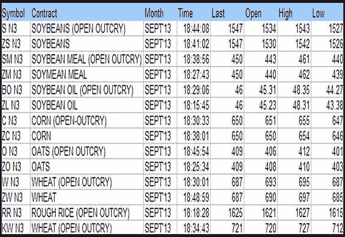
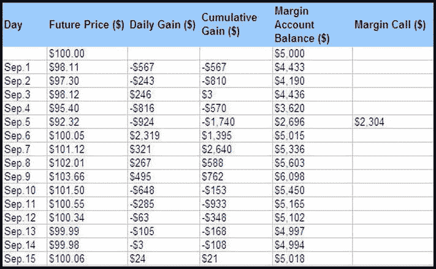

# 对期货合约进行建模

*当我们无法遵循真实的事物时，我们应该遵循最可能的事物。*

——勒内·笛卡尔，《方法论》

我们在上一章学到的大多数建模原则都适用于本章的主题：*期货合约*（又称*期货*）。期货与远期合约有许多共同特征，但两者之间的一个根本区别在于各自处理风险因素的方式。远期合约存在风险，违约的阴影始终笼罩。另一方面，期货合约被认为风险较低，因为它们是在交易所交易的。交易所强制执行的规则缓冲了投资者面临的部分风险，因为它们降低了违约事件发生的可能性。每个主要交易所都实施了一套复杂的规则，所有相关方都必须遵守和服从。此外，每个交易所对这些规则的执行保证了合约有很高的概率得到每位合约参与者的履行。

以下是定期交易期货合约的主要交易所列表：*芝加哥期货交易所*（CBOT，`www.cbot.com`）、*芝加哥期权交易所*（CBOE，`www.cboe.com`）、*纽约证券交易所*（NYSE，`www.nyse.com`）和*芝加哥商品交易所*（CME，`www.cme.com`）。期货合约的标的资产可以是商品（猪腩、原油、铜等）或金融资产（股票、国债等）。表 5-1 列出了由 CBOE 提供的假设性谷物期货报价。

表 5-1. CBOE 谷物期货报价（假设性数据）

|  |

同意在未来某个时点购买资产的一方持有期货合约的多头头寸，而同意在未来某个时点出售资产的一方则持有空头头寸。如前几章所述，卖方同意出售的标的应被视为纸质资产。出售某物的承诺仅仅是一个承诺，在实物资产交付给买方之前，它应被视为纸质资产。如何证明你实际拥有某项特定资产？实物所有权通过持有股票凭证、购买契约、期权凭证甚至收据来体现。因此，期货合约仍然是一种承诺，其标的纸质资产不应计入或抵扣实物资产库存（资产组合）。

另一个需要牢记的重要细节是，期货合约的交割是一种非常罕见的事件——其罕见程度导致许多行业专业人士在处理交割方面几乎没有或完全没有经验。为了避免进行（或接受）交割，投资者必须平仓其头寸，即签订一份与原始合约标的资产类型相同但头寸方向相反的合约（也就是说，买方变成卖方）。

**示例** 一位西雅图的投资者认为原油价格将在未来六个月内上涨。2014 年 4 月 15 日，该投资者签订了一份交割日期为 2014 年 9 月 15 日的原油期货合约。（该投资者持有该合约的多头头寸。）为了避免接受原油交割，该投资者需要在 6 月份的某个时候卖出（或做空）其当前合约以平仓其期货头寸。而卖出原始 2014 年 9 月 15 日期货合约的投资者，可以在 2014 年 7 月或 8 月通过买入（或做多）2014 年 9 月 15 日的原油期货合约来平仓其空头头寸。该投资者的总收益或损失将取决于 2014 年 4 月 15 日至期货合约平仓时点之间的原油价格差额。

*首次通知日*是指投资者可以向交易所提交*意向通知*的第一天。一旦提交了意向通知，交割即可进行。这意味着双方需要为交割做好准备。*最后通知日*是此类意向通知可提交给交易所的最后一天。即使期货合约的交割也可能导致现金结算。例如，标普 500 指数期货合约通常会导致现金结算（否则合约参与者之一将需要实际交付股票凭证，这既不切实际也不现实）。

由于期货合约受官方证券交易所监管，交易所会非常谨慎地明确指定一份有效的*商品等级*清单，以满足任何特定期货合约的要求。通常，金融资产定义明确且不存在歧义。相比之下，商品则必须进行详细定义，因为商品类别内部的质量和外观差异很大。如果交割资产的等级超出交易所指定的等级范围，则必须应用特定的折扣。以下示例说明了该概念在期货合约中的应用，类似于第 4 章中玉米远期合约的示例。

**示例** 可交割小麦的等级要求蛋白质含量最低为 15%。然而，蛋白质含量低于 15%但等于或高于 12.6%的小麦，可以按合约价格每蒲式耳折价五美分（5¢）进行交割。蛋白质含量低于 12.6%的小麦不可交割。作为投资者，你期望收到特定品质的小麦。该品质可能由多个参数描述，而蛋白质含量仅是其中之一。如果交割货物的蛋白质含量低于预期水平，投资者在尝试转售小麦时将会遭受损失。交易所通过清晰明确地规定预期资产的质量，并说明资产质量超出交易所指定范围时的处理方法，来防止此类问题的发生。在该示例中，蛋白质含量低于 12.6%不可接受，将被投资者和交易所拒收。蛋白质含量在 15%至 12.6%之间的小麦，将在约定的期货价格基础上进行折价。

期货合约的另一个基本特征是*每日结算程序*。假设一位投资者想购买两份铜期货合约。每份合约代表购买 150 盎司铜，因此该投资者购买两份合约以获得 300 盎司铜。当前铜的期货价格为每盎司 100 美元。2014 年 9 月 1 日，铜价从 100 美元跌至 98.11 美元。价格下跌意味着该合约以每盎司 100 美元购买铜的投资者正在亏损。该投资者第一天的损失为：

```
300 * (−1.89) = $567
```

为确保该投资者不会违约，交易所将要求其维持一个*保证金账户*。假设该投资者被要求为每份合约存入 2,500 美元（两份合约共 5,000 美元）到其保证金账户。由于铜价在 9 月 1 日下跌，该投资者的保证金账户余额减少为（参见表 5-2）：

```
$5,000 − $567 = $4,433
```

表 5-2. 保证金账户运作示例

|  |

交易所还会确定额外的保证金，称为*维持保证金*，它作为一个触发点，指示投资者应向保证金账户存入更多资金，直至达到*初始保证金*水平。

由于合约要求决定并约束了最终的设计（而非反过来），因此这些要求是塑造和构建初始数据模型的业务规则。（请记住，与本书惯例一样，模型被划分为多个主题领域，以使图表更加集中和简洁）。期货合约的基本要求如下：

*   期货合约涉及至少两方：

*   一方希望在未来某个时点购买或出售某项资产。（期货合约中指定的资产为纸质资产。）

*   一位为交易所工作的经纪人，持有相反的头寸（多头或空头）。（再次强调，这些资产应被视为纸质资产。）