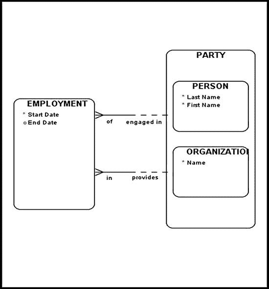
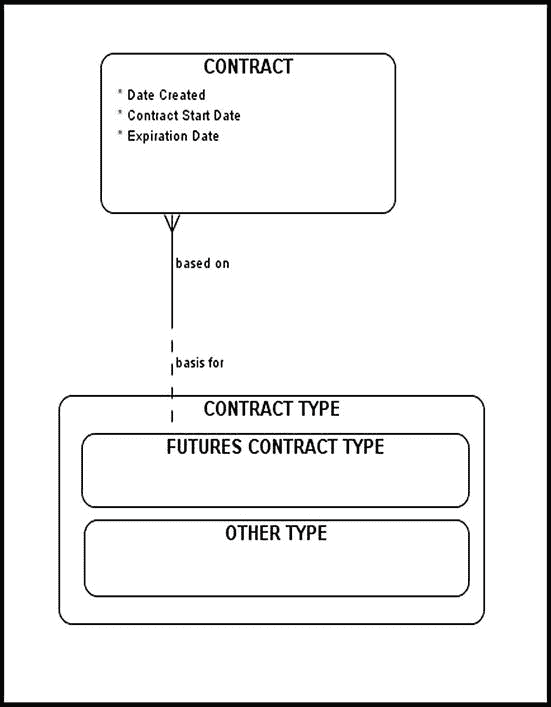
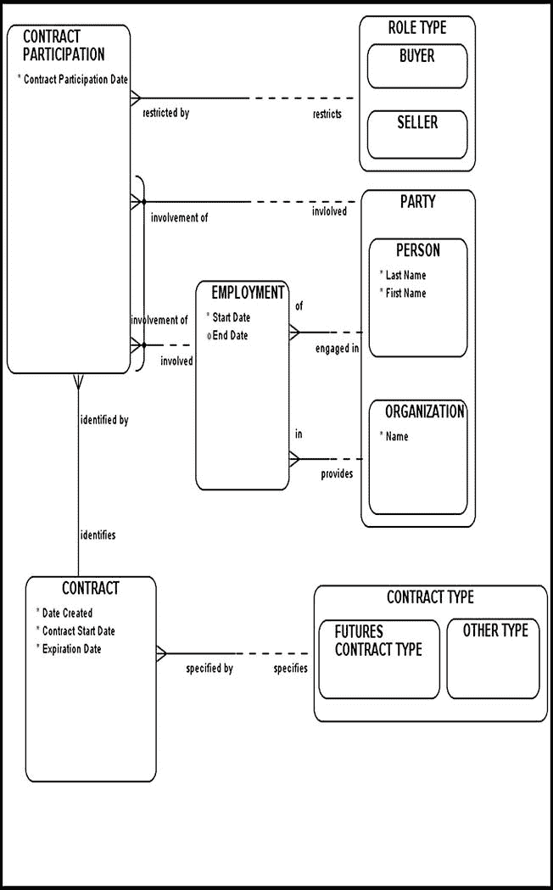
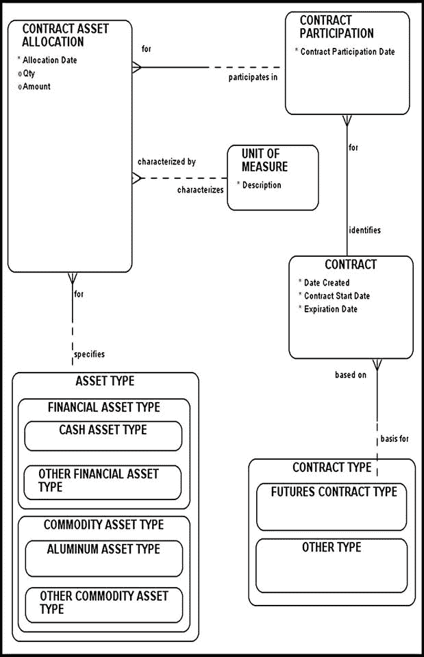

# 期货合约建模

每份合约可在到期日之前平仓，从而产生与原始合约方向相反的期货合约。期货合约可能导致实物交割。参与期货合约的各方通常被要求维持一个由交易所控制的保证金账户。通常需要格外谨慎地明确指定一个符合特定消费资产（在某份期货合约范围内）的有效商品等级范围。建模者的工作是存储和维护这个范围，并将其与适当的`variable`（变量）关联起来。

这份期货合约需求清单与其他金融合约（尤其是远期合约）的需求清单有相似之处。诚然，由于交易所法规的强制要求，管理期货合约内部运作的机制比其他合约类型更为复杂。但是，将交易所强加的业务规则分解为更小、更易于管理的步骤，有助于你运用已学过的原则，并根据当前业务需求进行定制。

## 雇佣关系建模

让我们从一项简单的任务开始期货合约建模练习：对雇佣关系进行建模。你可能想知道为什么我们会在期货合约的语境下讨论雇佣关系。答案很简单：期货合约由交易所驱动，并且合约的一方总是涉及经纪人。

通常，雇佣关系被建模为两方之间的关系：一个`PERSON`（个人）和一个`ORGANIZATION`（组织）（图 5-1）。一个人可以雇佣另一个人吗？或者一个组织可以雇佣另一个组织吗？这完全取决于底层业务需求。你可能需要考虑一个人雇佣另一个人的情况。在这种情况下，在`PARTY`（参与方）和`EMPLOYMENT`（雇佣关系）实体之间绘制两个泛化关系。

*图 5-1。对雇佣关系进行建模*

`EMPLOYMENT`（雇佣关系）实体（一种被建模为实体的关系）的一个有趣特点是它看起来类似于`CONTRACT`（合约）。事实上，`EMPLOYMENT`可以被视为`PERSON`（个人）和`ORGANIZATION`（组织）之间的一种合约类型，其中`start date`（开始日期）属性表示雇佣关系的开始，`end date`（结束日期）属性表示雇佣关系的结束。顺便提一下，婚姻关系建模方式类似，涉及一个`PERSON`（个人）与另一个`PERSON`（个人）之间的关系。

## 对期货合约进行子类型化

让我们进行另一个简单的练习：对`CONTRACT TYPE`（合约类型）（超类型）进行子类型化，划分为以下两个子类型（图 5-2）：

* `FUTURES CONTRACT TYPE`（期货合约类型）

* `OTHER TYPE`（其他类型）

*图 5-2。期货合约子类型*

这种子类型化使我们能够精确指定正在建模的合约类型，以避免在后续更大的数据模型上下文中产生任何歧义和冲突。请记住，每种合约类型都支持一组特定的业务需求和规则。通过将一个特定的`CONTRACT TYPE`（合约类型）与一个`CONTRACT`（合约）显式关联，我们隐式地指定了底层的业务规则和最终用户的理解。只要能够清晰无误地识别出特定的合约类型，在金融领域工作的业务专业人员就能理解这些业务规则。

在创建概念数据模型时，简洁性和清晰性应是你的首要任务。建模练习的最终目标是获得同行及各类用户群体的理解和支持。密切关注诸如正确使用子类型等细节，将使你的模型展示简洁、清晰且无歧义。我强烈建议你遵循这种方法，因为从长远来看，这种严谨性会带来回报并为你节省时间。

## 对期货合约参与关系进行建模

图 5-3 汇集并展示了我们刚刚学到的一些构建模块，包括：

* 一个`EMPLOYMENT`（雇佣关系）实体

* 一个经过适当子类型化的`CONTRACT TYPE`（合约类型）

* `CONTRACT`（合约）与相应的合约类型（即`FUTURES CONTRACT TYPE`（期货合约类型））之间的关系

*图 5-3。将参与方与期货合约关联*

请注意，`CONTRACT PARTICIPATION`（合约参与）与`CONTRACT`（合约）实体之间的关系是强制性的。如前所述，双方均为强制的关系在现实中很少出现，应仔细审视。通常，它们是为了强调特定的业务规则而绘制的。在我们的模型中，我们强调以下业务规则：没有相应的合约参与，就不能拥有有效的合约；反之，没有合约，也不能拥有合约参与。为应对这一点，请确保`CONTRACT PARTICIPATION`（合约参与）实体实例与`CONTRACT`（合约）一起填充，并打包在同一事务中。此外，你应该记录`CONTRACT PARTICIPATION`（合约参与）必须包含至少两个实体实例：一个用于扮演`BUYER`（买方）角色的员工/参与方，另一个用于扮演`SELLER`（卖方）角色的员工/参与方。`EMPLOYMENT`（雇佣关系）实体表明，在期货合约的一方，我们总是有一个代表特定金融交易所的经纪人。

为什么在图 5-3 中，买方和卖方属性没有存储在合约级别？你可能已经注意到，这个起始模型的设计方式使得它可以轻松调整，以适应业务可能识别出的任何新角色。例如，假设你被要求对以下业务场景进行建模：投资者 A 和投资者 B 签订了一份简单的易货合同，同意在 60 天后用一吨小麦交换一吨大豆。在这种情况下，你要么被迫称一方为买方（即使该方在技术上并非买方），要么不断添加合约属性以适应这些新的合约角色。在像图 5-3 这样的泛化模型中，你只需扩展`ROLE TYPE`（角色类型）超类型（即扩展其范围）并指定任何额外的合约角色即可。无需进行大规模的重新设计，因为你最初的设计已经优雅地适应了这些类型的变化。适应变化的能力是区分优秀数据模型的标准之一。

## 将期货合约与纸质资产（资产类型）关联

图 5-4 对`CONTRACT`（合约）与`ASSET TYPE`（资产类型）之间的关系进行建模，从而创建了一个名为`CONTRACT ASSET ALLOCATION`（合约资产分配）的新实体。`CONTRACT ASSET ALLOCATION`（合约资产分配）实体的目的是，在给定的期货合约背景下，通过`CONTRACT PARTICIPANT`（合约参与者）将参与方与他们所负责的特定`ASSET TYPE`（资产类型）关联起来。在这里，你将存储和维护以下非强制性属性（根据当前上下文选择适用的一个）：`amount`（金额）或`quantity`（数量）。一个`UNIT OF MEASURE`（度量单位）实体帮助你为`quantity`（数量）关联一个特定的度量单位。`UNIT OF MEASURE`（度量单位）与`CONTRACT ASSET ALLOCATION`（合约资产分配）之间的关系在双方都是非强制性的。这是有意设计的，因为度量单位规格（在`CONTRACT ASSET ALLOCATION`（合约资产分配）的背景下）取决于`ASSET TYPE`（资产类型）的性质，并且可能完全是可选的。你在远期合约的背景下见过类似的模型，现在应该已经熟悉它的绝大多数特性了。

*图 5-4。将期货合约与纸质资产（资产类型）关联*