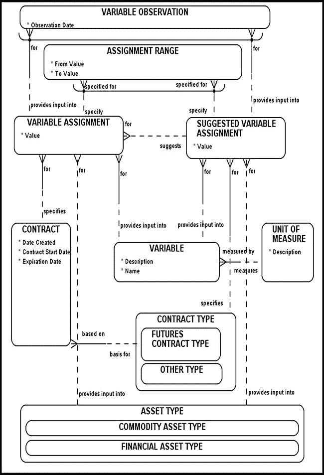
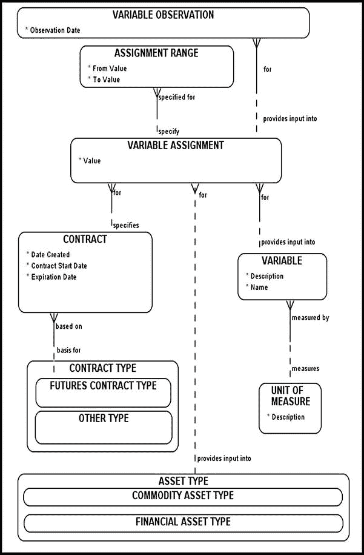
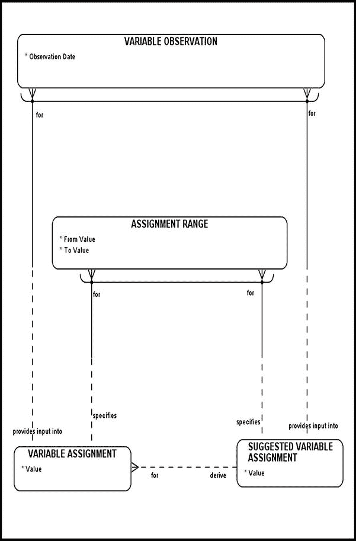
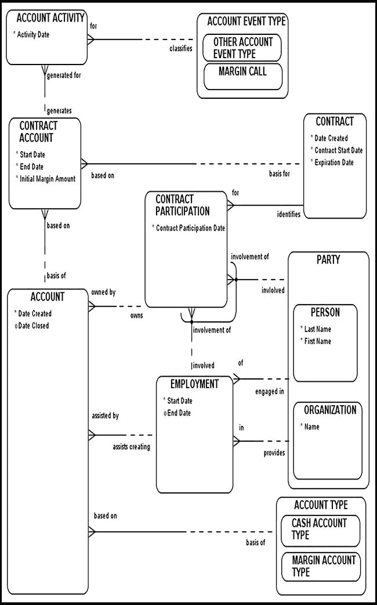
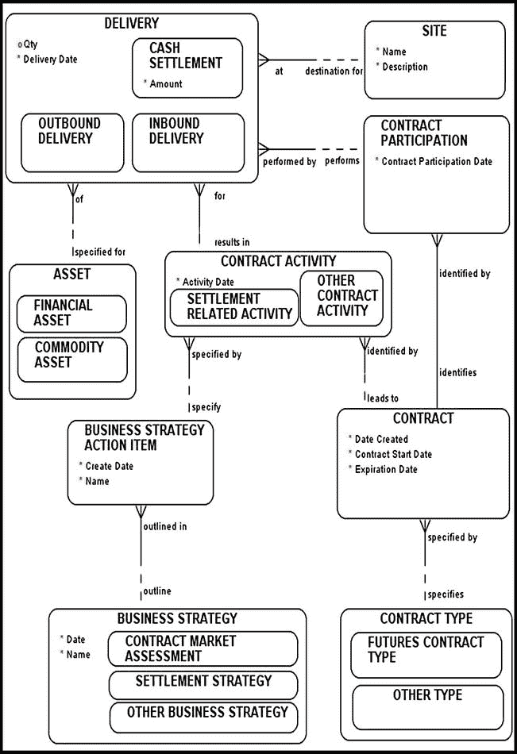
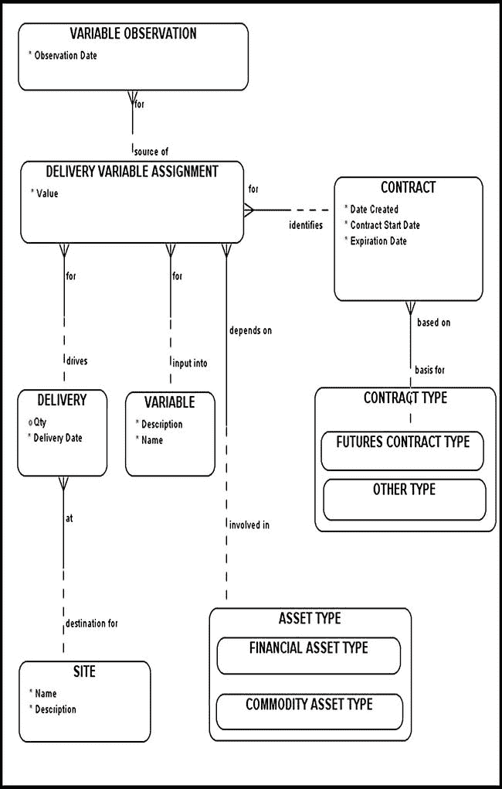
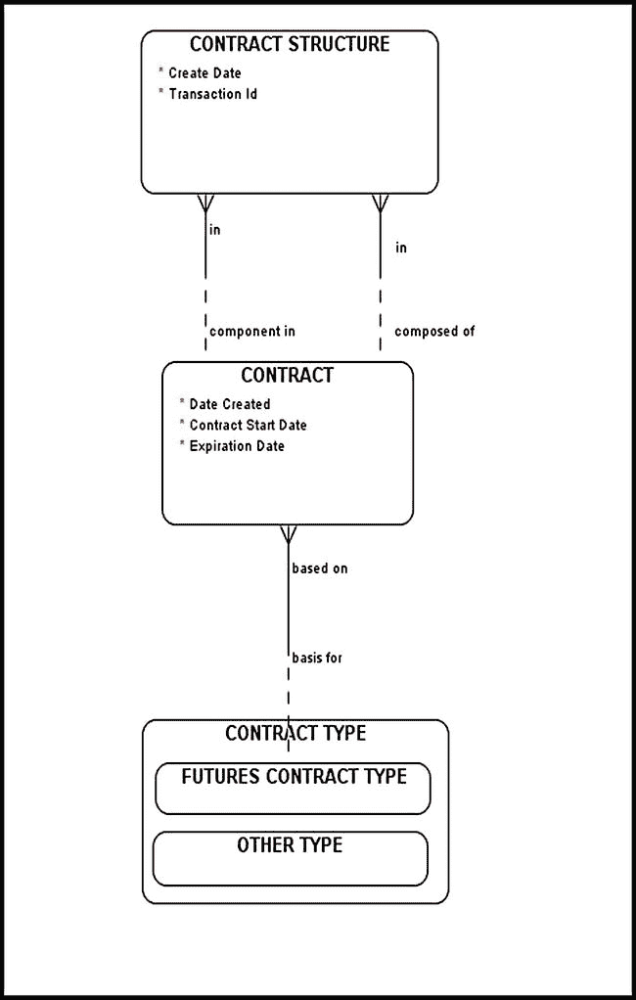
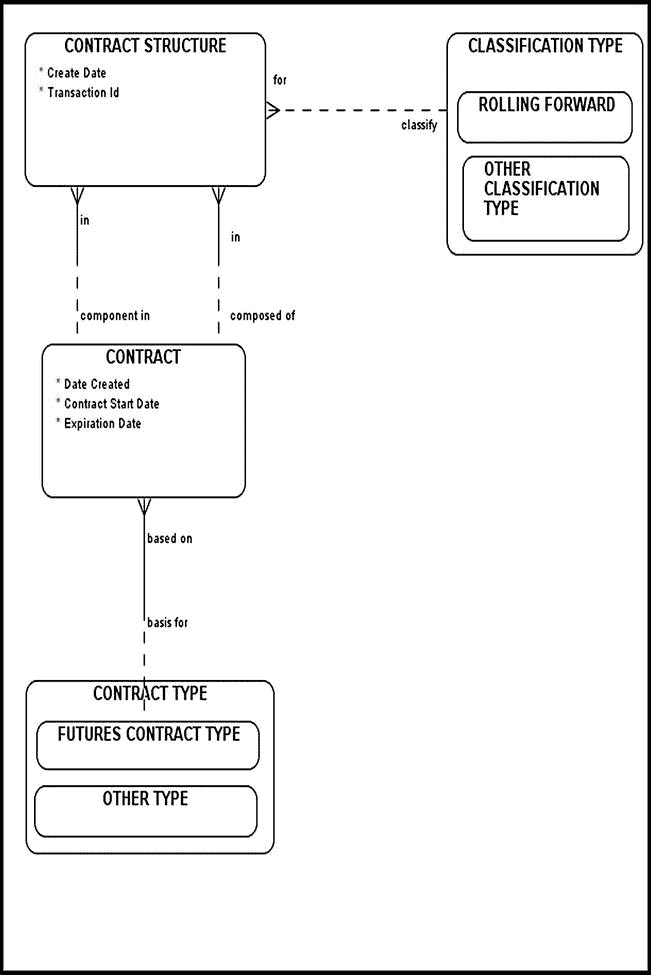
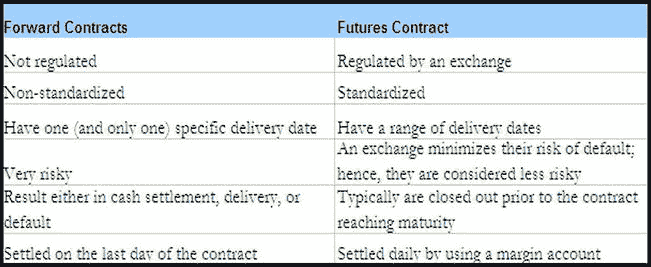

# 排版后的文本

我再次强调，在**合约资产分配**层面，期货合约应与**资产类型**相关，而非具体的**资产**。将期货合约与实物资产挂钩，意味着所涉标的资产可以被计入或抵销投资者的资产组合。这是错误的，因为期货合约应被视为承诺，除非您已接受了实物交割或现金结算，否则我强烈建议您将期货合约的标的资产视为纸面资产。

## 期货合约与变量分配（完整模型）

当我们必须建模并核算交易所能够为与给定资产类型（在本例中为商品资产类型）相关的变量指定一系列值的能力时，便出现了一个有趣的挑战。

例如，考虑一位投资者持有一份冷冻浓缩橙汁（`FCOJ`）期货合约的多头头寸，条款如下：

*   合约规模为 15,000 磅橙汁固形物。
*   标的资产的等级指定为“美国 A 级，`白利度`值¹介于 35 至 55 度之间。”

考虑到能够为某些合约变量存储和分配一系列值的重要性，让我们构建一个起始数据模型，使其能够满足这一关键业务需求。假设变量（包括范围指定）的分配要么由交易所通用指定，要么在合约层面指定。您的基础业务需求将指导您如何对特定的变量分配进行建模。一旦您掌握了变量分配模型的一般模式，您就能相对容易地根据自身的特定业务规则来塑造和调整自己的模型。

图 5-5 描绘了一个期货合约变量分配起始数据模型。根据该模型，`资产类型`可能在变量分配中发挥作用。`变量分配`/`资产类型`与`建议变量分配`/`资产类型`之间的关系在双方都是非强制性的。这一设计决策背后的逻辑最好通过几个例子来解释。例如，一份`FCOJ`期货合约将始终要求我们核算`白利度`变量。然而，要评估一份给定的期货合约，需要存储并维护一个利率（如`LIBOR`），该利率与标的资产类型无关。概括而言，`资产类型`可能在`变量分配`**/**`建议变量分配`中发挥作用，但并非必需（取决于具体情境）。

图 5-5。期货合约变量分配与范围指定（完整模型）

`分配范围`允许我们为特定`变量`附加一个合适的值范围。例如，如果指定的`白利度`值介于 35 至 55 度之间，我们应首先创建一个变量，其名称设置为`白利度`。其范围规范将存储在`分配范围`中，分别将*起始*值和*结束*值设置为 35 和 55。顺便提一下，在我们的假设示例中，`白利度`值是一个百分比，没有真实的度量单位。根据我们的模型，`变量`必须由`度量单位`来表征。为了解决这个问题，我们可以向`度量单位`中添加一个“不适用”条目来处理此类情况。另一种解决方案是更新`度量单位`与`变量`之间的关系，使其在双方都变为非强制性。通常，您特定的业务需求将指导您如何推进。

根据提出的模型，交易所建议的`变量分配`对于`变量`和`合约类型`是强制的，而对于`资产类型`则是非强制的。您可以将`建议变量分配`理解为由特定监管机构推荐或建议的内容。

另一方面，`变量分配`是在单个`合约`层面执行的，对于`合约`和`变量`是强制的，而对于`资产类型`则是非强制的。`建议变量分配`可能会影响特定合约的`变量分配`，但根据我们的模型，这种关系是非强制性的。

`变量观测`存储了在特定时间点观测到的`变量`值。根据我们的模型，`变量观测`要么按照通用的`建议变量分配`执行，要么在特定合约的`变量分配`层面执行。请注意，某些变量无需被观测，只需初始化即可。例如，一旦合约的`白利度`变量通过`分配范围`初始化，我们便预期无需再对其进行定期的`变量观测`。另一方面，标的资产类型的价格波动性可能需要每日观测，这正是`变量观测`发挥作用的地方。

## 期货合约与变量分配（简化模型）

图 5-6 描绘了期货合约变量分配模型的简化版本。该模型假设监管机构对变量分配没有输入，变量是在每个合约层面分配的。至此，您应该已经相当熟悉该模型的要求了。我将决定权留给您，来判断是否将`变量`与`度量单位`之间的“由……度量”关系设为强制性的。请记住，某些变量根本没有真实的度量单位。在这种情况下，要么将该关系设为非强制性，要么在`度量单位`中创建一个包罗万象的“不可用”条目。

图 5-6。期货合约变量分配与范围规范（简化模型）

## 期货合约与变量观测

与给定合约相关的一些变量（通过`变量分配`或`建议变量分配`）通常会在该合约的整个生命周期内被观测。由此产生的观测结果应存储在一个名为`变量观测`的实体中（图 5-7；另请参见图 5-5 和 5-6）。审慎的投资者通常喜欢每日评估其合约的价值。要做到这一点，需要每日记录诸如资产类型的现货价格和利率（例如`LIBOR`或无风险利率）等变量。能够每日观测和存储市场变量开启了许多可能性，从计算资产价格波动性到基于现有历史数据推断未来的利率走势。²

图 5-7。期货合约与变量观测

## 保证金账户

保证金账户是交易所使用的一种安全机制，用于确保某一方不会违约。保证金账户具有内置的触发器，当资金处于危险的低水平且需要补充时，会向各方发出警报。一旦触发器被触发，账户所有者必须迅速行动，向其保证金账户中追加更多资金。如果无法迅速做到这一点，通常会导致各种罚款和处罚。给定保证金账户的运行机制相当直接，如表 5-2 中的示例所示。

## 期货合约保证金账户模型

图 5-8 描述了期货合约保证金账户的模型。一个`ACCOUNT`（账户）实体被建模为交易所员工与`PARTY`（参与方，可以是`PERSON`个人或`ORGANIZATION`组织）之间的合约。交易所员工（经纪人）与投资者合作，协助他们开设新账户。一个账户拥有“创建日期”和“关闭日期”属性。一个`ACCOUNT`必须基于一个`ACCOUNT TYPE`（账户类型），该类型可细分为：

* `MARGIN ACCOUNT TYPE`（保证金账户类型）
* `CASH ACCOUNT TYPE`（现金账户类型）。

图 5-8. 期货合约保证金账户模型

`CONTRACT ACCOUNT`（合约账户）成为特定期货合约的保证金账户。以下是通常与保证金账户相关的一系列属性：

1.  开始日期
2.  结束日期
3.  初始保证金
4.  维持保证金

`ACCOUNT ACTIVITY`（账户活动）的目的是追踪与特定保证金账户相关的所有事件，并根据`ACCOUNT EVENT TYPES`（账户事件类型）对其进行分类。

## 期货合约交割

正如本章开头所述，期货合约极少导致实际实物交割。事实上，交割如此罕见，以至于大多数交易员对如何处理它们只有一个模糊的概念。通常，期货合约的头寸会在该合约到期日之前很久就被平仓。

图 5-9 对期货合约交割进行了建模。与往常一样，该模型仅描绘与当前讨论相关的实体。例如，由于期货合约交割仅涉及实物资产，任何相应的`ASSET TYPE`（资产类型）实体均未在模型中显示。

图 5-9. 期货合约交割模型

通常，组织会提前很久确定并详细说明关键的业务策略。在本节中，我们讨论交割主题领域，因此，我们将正在处理的`BUSINESS STRATEGY`（业务策略）称为`SETTLEMENT STRATEGY`（结算策略）。`BUSINESS STRATEGY ACTION ITEM`（业务策略行动项）实体将潜在的多项活动与特定的`BUSINESS STRATEGY`关联起来；而`CONTRACT ACTIVITY`（合约活动）实体则将这些`BUSINESS STRATEGY ACTION ITEMS`与特定的`CONTRACT`（合约）关联起来。例如，“交割意向”活动是`BUSINESS STRATEGY ACTION ITEM`的一个实例；如果此活动是为某个特定合约执行的，它将被存储在`CONTRACT ACTIVITY`中，并归入`SETTLEMENT RELATED ACTIVITY`（结算相关活动）组下。

如果确实发生了实物交割，我们必须确保交割的实物资产满足合约特定的质量标准。这时，我们初始化的变量和观测到的变量（以及我们的赋值范围）就派上了用场。图 5-10 描绘了一个模型，该模型将“标记为待交割”的实物资产与变量关联起来，并将结果赋值存储在`DELIVERY VARIABLE ASSIGNMENT`（交割变量赋值）实体中。一旦赋值完成，这些变量可以被观测并存储在`VARIABLE OBSERVATION`（变量观测）实体中。这些`VARIABLE OBSERVATIONS`应与交易所批准的`ASSIGNMENT RANGE`（赋值范围）核对，以确保它们满足必要的质量标准。实际的数据验证过程无法在我们的模型中展示，将由流程架构师另行设计。

图 5-10. 期货合约与交割变量赋值模型

## 期货合约展期

有时，需要对一个比任何可交易合约的交割日期更远的未来日期进行对冲。例如，一个投资者可能希望在 10 年后锁定一定数量铜的价格。假设任何公开交易合约的最长交割日期最远可达六年。在这种情况下，投资者可以通过平掉一个合约，并在另一个交割日期更晚的期货合约中建立相同头寸来滚动对冲。这个过程可以重复多次，直到达到所需的未来日期。请注意，在完美执行的*展期*方案下，平仓指令和开仓指令之间不应存在时间间隙（或时间滑点）。滑点会导致利润损失，应予以避免。

展期方案可以通过使用`CONTRACT STRUCTURE`（合约结构）实体来实现（图 5-11）。这里的挑战在于追踪所有参与展期方案的合约，并能够从第一个合约开始（一直到最后一个）理清整个方案。展期只是你应该能够存储和分类的众多交易策略方案之一。

图 5-11. 期货合约展期模型

图 5-12 中的图表介绍了`CLASSIFICATION TYPE`（分类类型）实体，我们在前一章中简要讨论过它。分类类型使我们能够轻松地分组和分类相关的`CONTRACT STRUCTURE`实体实例。`ROLLING FORWARD`（展期）分类子类型可用于理清成为展期交易方案一部分的整组期货合约。当然，属于同一展期方案的所有期货合约将共享相同的交易方案交易标识符，以便模型用户知道它们是属于一起的。这些当然是实现细节，通常取决于您独特的业务规则和需求。

图 5-12. 对合约结构进行分类

## 期货与远期合约的差异总结

远期合约和期货合约是两种重要的对冲策略，它们在许多方面既相互对比又相互补充，如表 5-3 所示。

表 5-3. 期货与远期合约对比

|  |

## 结论

在本章中，我们讨论了一种重要且广受欢迎的衍生品合约类型——期货合约。我们将期货合约与远期合约进行了对比，并指出了它们的相似之处和不同之处。期货合约受交易所监管，因此风险较低。交易所通过一种称为保证金账户的功能以及某些相关的内置触发机制来降低违约风险。

本章使用的基本构建模块已在其他地方讨论过。本章汇集了前几章讨论的数据建模构建模块，并根据期货合约的具体业务需求对其进行塑造或调整。下一章将相同的策略应用于期权。通过帮助您的模型管理复杂性并适应变化和变更，建模模式使您作为建模者的工作变得更加轻松。

*白利糖度值*标识产品中糖固形物的百分比，并以重量百分比表示溶液的强度。

² 图 5-5 至图 5-7 中的模型基于海伊的模型，展示了在“实验室”情境下如何初始化和观察变量，来源参见：David C. Hay, *数据模型模式：思维的惯例*, Dorset House, 1995；以及同上作者，*数据模型模式：元数据图谱*, Morgan Kaufmann, 2006。

