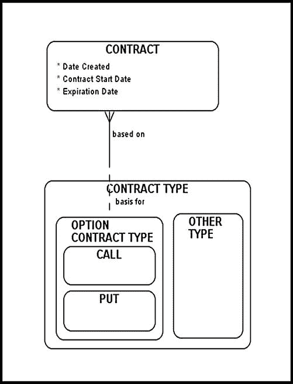
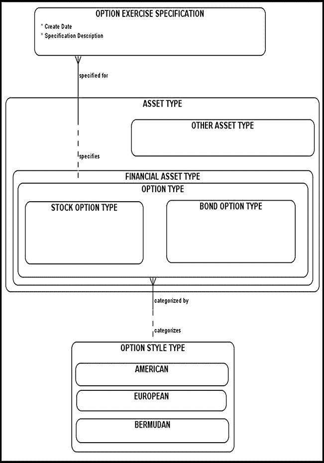
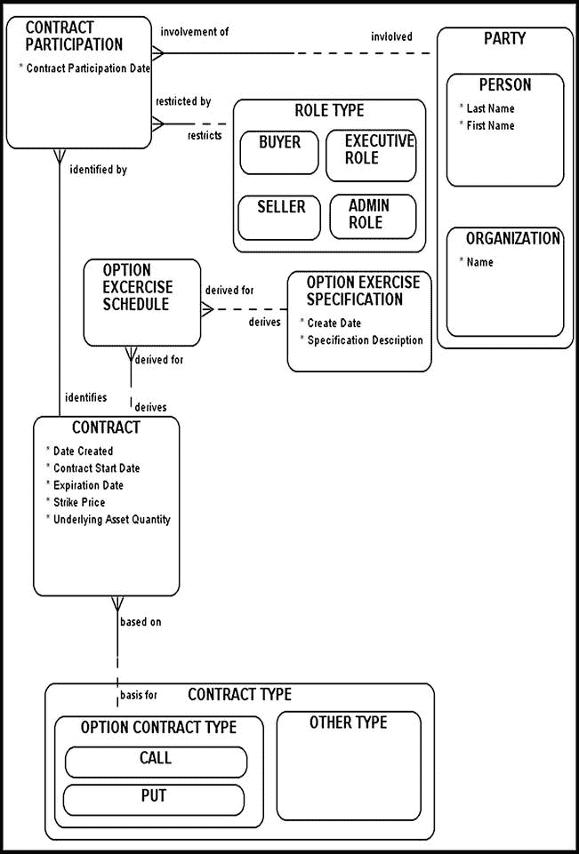
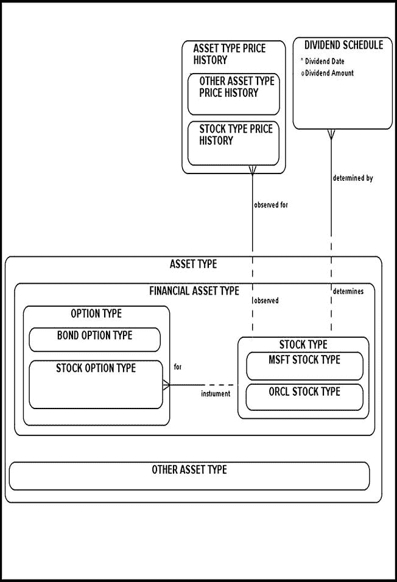
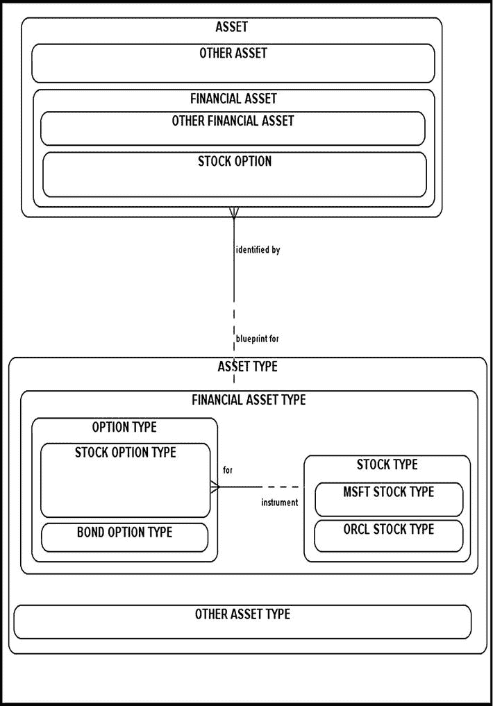
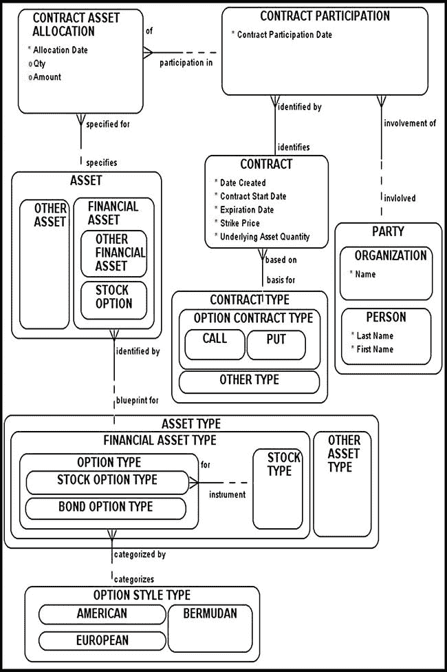

# 建模期权

*我们现已指明理解的两种运作方式：直觉和演绎。我们曾说过，获取知识时仅能依赖这两种方式。*

——勒内·笛卡尔，《指导心智的规则》

前面的章节介绍了期货和远期合约，这些合约允许投资者在 OTC 市场（如远期合约）或在交易所控制的环境（如期货合约）中锁定未来的资产价格。你学习了应如何对其各自的业务需求进行建模，以及如何设计数据结构以适应其各自的业务规则。本章将沿用相同的整体模式，对另一种重要的衍生工具——期权——进行建模。

通俗地讲，**期权**是一种保险，它赋予投资者买入或卖出标的纸质资产的权利，而非义务。如果市场条件变得不利，购买期权的投资者可以安全地退出交易。期权在金融交易所和 OTC 市场进行交易。例如，CBOE 是全球最大的期权交易所。

期权合约有两种类型（图 6-1）：

*   **看涨期权**赋予投资者以特定价格买入标的资产的权利。

*   **看跌期权**赋予投资者以特定价格卖出标的资产的权利。

图 6-1. 期权类型建模

某一特定标的资产的所有看涨期权或看跌期权都属于同一个**期权类别**。例如，甲骨文公司（ORCL）的看涨期权属于一个期权类别，而 ORCL 的看跌期权则属于另一个期权类别。

特定期权合约中的标的资产价格称为**行权价**，表示投资者在特定日期可以购买标的资产（如股票）的价格。期权合约到期的日期称为**到期日**，意味在此日期之后，该期权合约将变得毫无价值并终止存在。

在交易所，期权被打包并按**合约**（亦称**标准化合约**）为单位出售。每份标准化股票期权合约通常包含 100 股。例如，购买 10 份标准化苹果公司看涨期权合约的投资者，获得了在未来某个时间点以预设的行权价购买 1,000 股苹果股票的权利（同样，并非义务）。当然，如果市场条件不利，该投资者也可以选择不行使他的购买权。

投资者应在何时行使购买标的资产的权利？这完全取决于**期权行权方式**类型（图 6-2）。一种行权方式称为**欧式期权**。这种特定方式只能在期权到期日行权。相反，**美式期权**可以在到期日之前的任何时间行权。美式期权行权方式最受欢迎，因为它提供了最大的灵活性。**百慕大式期权**则可在预先批准的一系列日期行权。（这些期权行权方式的地理名称是随意命名的，只是“百慕大式”是对美式与欧式的一种混合戏称。）

图 6-2. 建模期权及期权行权方式类型

请注意，`期权行权方式类型`与`期权类型`（一种纸质资产）相关联。`期权行权规范`存储了关于该期权何时可以行权的详细规范。例如，百慕大式期权的行权规范可能规定，买方只能在每个月的第一天或第十五天行权。

期权为投资者提供了购买某物的能力。然而，投资者不必一定要行使其购买该物的权利。如果市场条件变得不利，期权的持有人可以安全地退出交易。其不利之处在于，投资者必须事先购买期权合约。在这里，你应该能发现期货或远期合约与期权合约之间的区别：进入期货或远期合约是免费的。另一方面，期权合约从一开始就需要支付费用。

期权合约的标的资产是纸质资产。期权直接与（或指向）特定的资产类型相关联（为简化起见，此处我们讨论股票期权合约，并假定标的资产是特定的股票）。该资产类型被归类为纸质资产，不应计入或抵扣实物资产库存。当期权被行权并交换实物资产时，才会发生这些标的资产类型向实际实物资产的转换。（期权的交割机制将在“建模期权的交割主题域”一节中讨论。）

一个简单的例子有助于说明期权合约的运作方式。

 **示例** 假设今天是 2014 年 12 月 1 日。某投资者有兴趣购买苹果公司股票，并确信该股票价格到 2015 年 6 月将大幅上涨。该投资者以 150 美元（期权价格）购买了一份欧式期权合约，该合约允许他以每股 200 美元的价格购买 100 股苹果公司股票。请注意，150 美元是期权价格，必须预先支付。该期权合约于 2015 年 6 月 1 日到期。购买此期权的投资者持有多头头寸。该合约的另一端是一位同意在 2015 年 6 月 1 日以每股 200 美元卖出 100 股苹果股票的投资者。卖出此期权的投资者持有空头头寸。

假设在 2015 年 6 月 1 日，苹果股票价格上涨，每股市价为 220 美元。第一位投资者决定行使其购买苹果股票的权利，以每股 200 美元的价格买入 100 股苹果股票，而此时每股市价（现货价格）为 220 美元。这位（在该期权合约中持有多头头寸的）第一位投资者刚刚获利 [($220 – $200) * 100] – $150 = $1,850。注意，我们从利润计算中减去了 150 美元，因为这是投资者 A 为获得该期权而预先支付的款项。

考虑一个与上述示例第二段相反变化的情景。

 **同一示例的变体** 假设在 2015 年 6 月 1 日，苹果股价暴跌至每股 180 美元。在这种情况下，尽管市场现货价格仅为每股 180 美元，投资者仍有权以每股 200 美元的价格购买 100 股苹果股票。该期权赋予投资者直接退出交易的能力，因此他只损失了最初为期权支付的 150 美元。

## 期权头寸

期权头寸有四种类型：

*   看涨期权买方（需要看涨期权的多头头寸）

*   看跌期权买方（需要看跌期权的多头头寸）

*   看涨期权卖方（需要看涨期权的空头头寸）

*   看跌期权卖方（需要看跌期权的空头头寸）

期权买方持有**多头头寸**。期权卖方持有**空头头寸**。卖出期权有时被称为**沽出期权**。

## 对冲指令

## 对冲

`对冲` 是一种逆转原始交易并退出头寸的方法。几个简单的场景可以说明如何正确地对给定订单进行对冲。已买入期权的交易方可以通过发出卖出相同期权、且具有相同行权价和到期日的对冲指令来平仓。反之亦然；交易方可以卖出一个期权，之后通过发出买入相同期权、且具有相同行权价和到期日的对冲指令来平仓。如果这些步骤中的任何一步没有严格遵循，原始头寸将保持有效状态。

例如，假设一位投资者买入了一份看涨期权，后来卖出了一份基于相同标的资产、但行权价不同的看涨期权。该投资者可能降低了风险，但他并没有平仓，反而持有两个活跃的头寸。为什么？因为上述交易中的行权价不同。

## 标的资产

期权合约可以与多种资产挂钩。以下是期权可能挂钩（或指向）的资产类型简表：

*   股票

*   货币

*   期货

*   股指

本章讨论并建立股票期权的模型。对其他类型标的资产的建模通常以类似方式进行，因此您在此学到的技能将很容易迁移应用到它们身上。股票期权主要在费城证券交易所 (PHLX, `www.phlx.com`) 和美国证券交易所 (AMEX, `www.amex.com`) 等金融交易所交易。请回顾一下，一份标准化的期权合约通常涉及购买 100 股股票。可以从多种股票中购买期权。

期权价格直接取决于以下因素：

*   期权合约的到期日（视为合约属性），

*   行权价（视为合约属性），

*   标的资产价格（直接在市场上观察得到），

*   到期时间（可推导数据），

*   资产价格波动率（通过市场变量间接计算和维护），

*   期权存续期内股票支付的任何股息（直接在市场上观察得到），

*   伦敦银行间同业拆借利率或机构感兴趣跟踪的任何其他利率（直接在市场上观察得到）。

在这些因素中，股票的隐含波动率是根据历史股价数据每日计算（并重新计算）的。这些计算大量使用统计模型，并且资源密集。然而，由于波动率在推导期权价格中扮演着如此重要的角色，金融机构非常想知道它的数值。我将在“根据历史数据计算波动率”部分对 `ORCL` 股价波动率进行一个示例推导，以展示底层的分析技术以及大型金融机构在进行大规模此类计算时通常面临的挑战（与性能和存储相关）。总的来说，波动率仅仅是复杂的期权定价机制中的一个元素，该机制有许多变动部分。大多数金融公司会开发自己复杂的数学模型，试图逼近期权价格并预测这些价格未来的可能走向。

## 将期权合约与买方和卖方关联

图 6-3 图示了给定合约与相关各方（以及这些方在给定合约中所扮演的角色）之间的各种关系。

图 6-3. 将期权合约与买方和卖方关联

如果您仔细检查 `CONTRACT` 实体，您会注意到存在以下新属性：

*   `Strike Price`

*   `Underlying Asset Quantity`

期权合约应标识这两个属性。为了了解如何填充这些属性，让我们看一个简单的假设示例。假设投资者 A 购买了一份看涨期权，以购买 10 股英特尔股票。该期权具有以下特征：

*   期权类型为欧式。

*   行权价为每股 100 美元。

*   期权价格为 50 美元。

*   合约于 2014 年 12 月 1 日到期。

在此示例中：

*   `Strike Price` 初始化为 100 美元。

*   `Expiration Date` 设置为 2014 年 12 月 1 日。

*   `Underlying Asset Quantity` 设置为 10。

请注意，我们仍然无法完全描述这个特定的期权；关于图 6-3 中描述的模型，诸如标的资产和期权价格等项目仍然缺失。“建模期权资产配置”部分将说明如何指定和填充这些重要项目。

请注意，图 6-3 引入了一个名为 `OPTION EXERCISE SCHEDULE` 的实体。该实体与 `CONTRACT` 相关，并标识了一组所有可能的合约行权日期。我们采取的观点是，`OPTION EXERCISE SPECIFICATION` 可能影响期权行权计划的数据；然而，`OPTION EXERCISE SCHEDULE` 与 `OPTION EXERCISE SPECIFICATION` 之间的关系被建模为双方非强制性的。请查阅您底层的业务文档，并将其作为如何建模这种特定关系的指南（根据您的情况，您可能需要将其在 `OPTION EXERCISE SCHEDULE` 侧设为强制性）。例如，期权持有者可以在预先定义且双方同意的行权日期集合中行权某些奇异期权，根据我们的业务需求，我们可能需要在数据模型中考虑这些行权日期。`OPTION EXERCISE SCHEDULE` 与 `CONTRACT` 之间的关系在 `CONTRACT` 侧是非强制性的，因为某些期权可能只明确指定一个行权日期，然后我们可以逻辑上将其等同于合约的到期日（例如，欧式期权就是这种情况）。由此，我们可以概括出，在某些情况下，给定期权的行权日期可以从给定合约的到期日推导出来。然而，有人可能会争辩说，将行权日期视为到期日会产生误导，并可能引入各种歧义和误解。毕竟，合约潜在行权日期（通常在映射文档中找到）的底层定义与合约到期日的定义不同。在这种特定情况下，从一个日期推导出另一个日期模糊了这些概念之间的区别，并可能导致各种数据异常。为了唱唱反调，我要说的是，通常情况下，从一个属性推导出另一个属性是一种常见做法，前提是（这是一个非常重要的*如果*）提议的设计有清晰简洁的文档作为补充。

在本章中，我们建模的是场外交易期权合约——因此缺少 `EMPLOYMENT` 和 `MARGIN ACCOUNT` 实体。我这样做是为了简化图表，并引导您避免误解或歧义。前一章已经讨论了建模交易所控制期权合约所需的所有构建模块。稍加练习，您就应该能够相对轻松地将它们整合到您的最终设计中。

## 对期权合约与资产类型进行建模

`合约参与方` 实体跟踪了在特定期权合约中参与的所有参与方，以及他们可能扮演的相应`角色`。请注意`合约参与方`与`合约`实体之间存在强制性关系。一份有效的期权合约必须至少涉及两方参与方：购买期权合约的一方（持有多头头寸的参与方）和出售期权合约的一方（持有空头头寸的参与方）。我们也可以将期权视为保险，也就是说，一份特定的期权合约总会有一个购买了保险的投资者和一个出售了该保险的投资者。

正如前几章所讨论的，`合约参与方`实体与`合约`实体之间的强制性关系意味着这些实体必须在同一笔交易中被填充。

通过当前的设计，你可以轻松描述并最终重构任何类型的期权头寸（看跌期权买方、看涨期权卖方等）以及相关的行权日期。

## 对期权资产类型进行建模

本节及后续章节将探讨期权的内部结构，剥离其功能层，以揭示其复杂机制的内在运作方式。

重申一遍，建议将期权的标的资产视为一种资产类型（纸质资产）。就其本身而言，股票期权是一种与特定资产类型相关联（或指向该类型）的保险。期权与期权标的特定资产类型之间的链接始终存在。一旦被购买，期权使投资者有能力在未来的某个日期购买特定的实物资产（例如英特尔股票）。除非期权被行权，否则它始终应指向一个特定的`资产类型`。在行权时，投资者将获得一项实物`资产`，该资产应计入整体投资组合或从中扣除。如果期权未被行权，它将到期，变得一文不值。一旦被购买，股票期权本身即构成一项资产，并应在你组织的会计账簿中进行核算。此外，期权受到严格的税务法规约束，应非常仔细地进行追踪。

图 6-4 将`股票期权资产类型`建模为一种纸质资产。你还记得如何区分资产与资产类型吗？资产是你拥有的东西，是你可以握在手中的东西：期权凭证、收银小票、铂金条、一叠现金、股票凭证等等。而资产类型则是事物的蓝图——是你并不拥有、无法持有或拿出来证明其归属的东西。购买股票期权的机会可以按照图 6-4 所示进行建模，即一个指向特定`股票类型`（`金融资产类型`的另一个子类型）的`股票期权资产类型`（`金融资产类型`的一个子类型）。

图 6-4. 期权资产类型的模型

一个假设的例子应该有助于澄清问题。假设某投资者撰写（卖出）了一份具有以下特征的看涨期权：

*   标的资产数量：1。
*   期权风格类型：欧式。
*   合约起始日期：2014 年 7 月 1 日。
*   期权价格：6 美元。
*   标的资产类型：英特尔股票类型。
*   行权价格：20 美元。

这份尚未被购买、投资者希望出售的看涨期权被视为纸质资产，并在图 6-4 中进行了建模。由此产生的英特尔股票期权价格取决于许多因素，例如`股票类型价格历史`和`股息时间表`。为了解释这些依赖关系，我们明确地对`股票类型价格历史`和`股息时间表`实体及其与`股票类型`的关系进行了建模。`股票类型价格历史`不仅包含当前的开盘价和收盘价，还包含历史数据。在此模型中，`股票类型价格历史`和`股息时间表`都与`股票类型`（一种纸质资产）相关。这是合理的，因为股票价格与实际资产所有权无关。

## 将期权建模为实物资产

一旦投资者持有了看涨期权的多头头寸，他便获得了一项实物资产（期权凭证），以及卖方出售标的资产（此时为纸质资产）的承诺（见图 6-5 中的示意图）。一旦被购买，该期权就从一种`资产类型`转化为一项`资产`，其新所有者获得了一份期权凭证（这意味着该新期权可以与其他有价值的实物资产一起出售；它在被行权或到期变得一文不值之前，始终是一项资产）。

图 6-5. 将期权建模为实物资产的模型

假设一位投资者考虑购买（或持有多头头寸）一份关于一股微软公司股票的期权。除非该投资者为此支付了资金，否则该期权被视为一种与另一种纸质资产（股票类型，具体来说是微软股票类型）相关联（或指向该类型）的纸质资产（属于股票期权资产类型）。当投资者购买此期权时，他获得了实物资产，即实际股票期权，以期权凭证的形式存在。此特定股票期权将继续指向特定的股票类型（同样是一种纸质资产）。当投资者行权此期权时，他获得实物资产（微软股票凭证）作为回报。

## 建模期权资产分配

期权合约资产分配主题领域的核心是`合约资产分配`实体（图 6-6）。`合约资产分配`的主要目的是在给定期权`合约`的背景下，追踪每个`参与方`负责哪项`资产`。此模型维护和存储的是实物资产，而非资产类型。一旦双方达成期权合约，就应该将`合约资产分配`与实物`资产`关联起来，因为到那时，期权已经被购买，实物资产已经进行了交换（例如，用现金换取股票凭证）。

图 6-6. 对期权资产分配进行建模