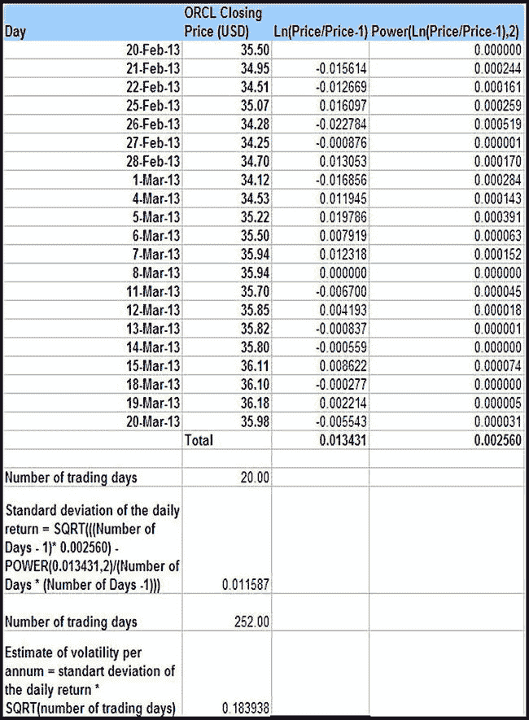

# 排版后的内容

 **示例**  
假设今天是 2014 年 6 月 1 日。投资者 B 卖出一份 5 美元的期权，并同意在 2014 年 12 月 1 日以 20 美元的价格出售一股英特尔股票。投资者 A 同意支付 5 美元，从而获得这份股票期权。在本例中，我们的期权合约有两个参与者：投资者 A 和投资者 B，其中投资者 A 扮演买方，投资者 B 扮演看涨期权卖方。投资者 B 将获得 5 美元，随后向投资者 A 提供期权凭证（实物资产）。所讨论的股票期权（实物资产）来源于股票期权资产类型，其具体股票类型（纸质资产）是基础期权中的一种工具。在此示例中，`CONTRACT ASSET ALLOCATION` 将存储并维护以下两条记录，以说明上述事实：第一条记录将投资者 A（期权买方）与 5 美元现金（金额）关联起来。第二条记录将投资者 B（期权卖方）与股票期权关联起来，并将数量设置为 1。利用这些 `CONTRACT ASSET ALLOCATION` 记录（连同 `CONTRACT PARTICIPATION`、`OPTION EXERCISE SCHEDULE` 和 `ROLE TYPE`），您可以轻松重建期权的原始结构，并说明谁负责什么，以及给定期权的原始成本。

根据该模型，`OPTION TYPE` 根据 `OPTION STYLE TYPE` 超类型进一步分类。此外，`OPTION STYLE TYPE` 超类型又细分为以下项目：

- `AMERICAN`（可在期权到期前的任何时间行权的期权）
- `EUROPEAN`（只能在到期日行权的期权）
- `BERMUDAN`（类似于美式期权，可在到期前行权；但也类似于欧式期权，只能在预定日期行权）

## 数学模型的重要性

为了解释如何计算期权价格并理解这些价格在近期（及远期）可能的走向，人们开发了许多数学模型。其中，*布莱克-斯科尔斯-默顿*模型被广泛接受，在学术界非常流行。¹ 布莱克-斯科尔斯-默顿模型在全球大多数 MBA 课程中都有教授，用于计算欧式期权价格。

布莱克-斯科尔斯-默顿模型使用的主要假设和简化条件如下：

- 期权只能在到期时行权。
- 利率是恒定的。
- 标的股票不支付股息。
- 无法预测未来市场走向。
- 交易过程中不收取佣金。
- 波动率随时间保持恒定。
- 资产价格遵循具有恒定漂移项的几何布朗运动。

 **注意**  
如果使用不当，布莱克-斯科尔斯-默顿模型的假设往往会为期权定价计算引入某些不准确性，从而使交易者面临过度风险。

布莱克-斯科尔斯-默顿模型最显著的局限性如下：

- 对于支付高股息的股票，会得出不正确的结果。
- 在实际生活中，利率从来不是恒定的。
- 波动率不可能随时间保持恒定。
- 股息仅在期权到期时支付的假设并非总是合理的。
- 该模型假设股票价格不会出现大幅跳空。
- 该模型无法正确预测美式期权的真实价值；由于其假设期权只能在到期时行权，因此会低估美式期权的价值。而美式期权可在期权到期日之前的任何时间行权。

尽管存在局限性，但由于其简便性，布莱克-斯科尔斯-默顿模型在学术界和交易者中仍然很受欢迎。即使该模型在期权价格计算中引入了各种不准确性，但如果谨慎使用，它仍然能产生足够近似的计算结果。

布莱克-斯科尔斯-默顿模型的一个变体称为*自回归条件异方差性*（ACH）模型。该模型的主要假设是波动率不是恒定的，而是随机的。大多数金融公司都开发了自己的模型，其中融入了更为复杂的波动率模型。

## 根据历史数据计算波动率

股票的*波动率*是衡量投资者对该股票未来回报的不确定性（或风险）的指标。由于股票价格波动率在期权价格推导中起着重要作用，我们提供了一个基于历史股票价格数据进行计算的示例。我们的假设是所讨论的股票不支付任何股息，因为这将有助于简化我们的计算。

表 6-1 基于假设一年有 252 个交易日（收盘价数据是模拟的，尽管接近真实数据）来估算 `ORCL` 股票的波动率。“日期”列指定了观察股票价格的时间，“ORCL 收盘价 (USD)”列指定了该股票在特定日期的收盘价（以美元计）。在本例中，连续观察了 20 天的股票价格。大多数从业者都认同，最佳方法是基于每日收盘价来计算股票价格的日波动率。根据我们的样本计算，基于 2013 年 2 月 20 日至 2013 年 3 月 20 日期间模拟的甲骨文（Oracle）股票收盘价数据，日收益率的标准差为 0.011587，即 1.1587%。基于此值，年化波动率估计值（假设一年有 252 个交易日）为 0.183938，即大约 18.4%。

表 6-1. 根据历史数据计算波动率

|  |

正如您所见，计算特定时间段内的股票价格波动率相对简单。但您应牢记，随着样本量的增加，计算过程会变得更加复杂。大多数金融公司会在很长一段时间内对大量股票执行此类计算；性能因此成为主要问题。

## 期权合约变量赋值

金融分析师在评估期权合约并决定是否行权时，对某些市场变量（也称为*指标*）非常感兴趣。希望确定期权价值的企业将利用市场变量进行各种统计计算。通常，期权每天估值一次，计算结果的存储于数据库中。例如，假设一家金融公司持有一份美式期权，该期权可在期权合约到期前的任何时间行权。这些分析师将有兴趣了解，他们是否应该在任何一个给定的交易日继续持有这份特定的美式期权，还是提前行权以将其脱手。

顺便提一下，一个不错的策略是在股息支付日之前提前行权美式期权。原因在于，股息会降低股票的内在价值。一旦预期股价下跌，看涨期权的价值预计也会下降。另一方面，看跌期权的价值预计则会上升。

您的组织可能偏好一套特定的统计模型，这些模型旨在近似预测未来的期权价格变动。这些模型及其基础公式依赖于许多市场变量。因此，正确地对这些变量进行建模至关重要（这里所说的“正确地”是指按需动态地添加这些重要变量，并且无需进行大量重编码）。

