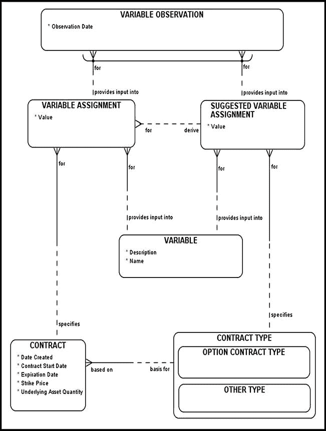
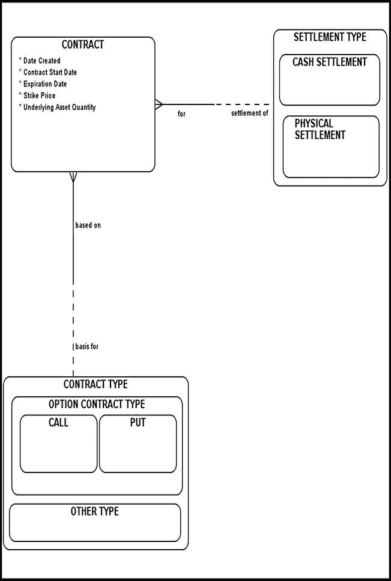
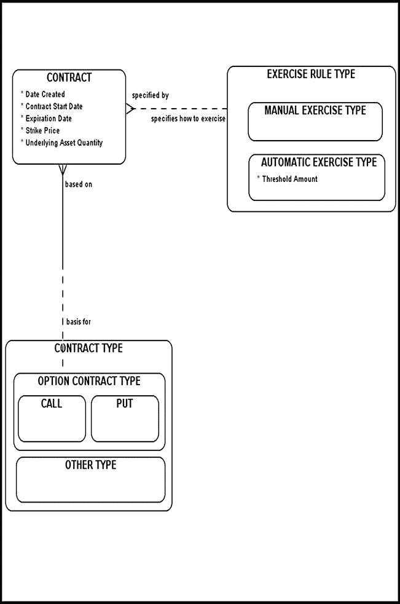
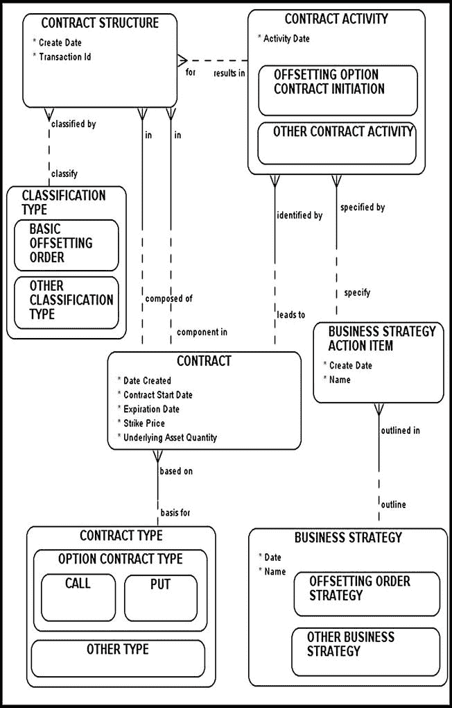
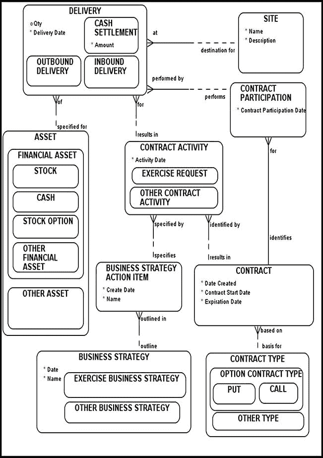
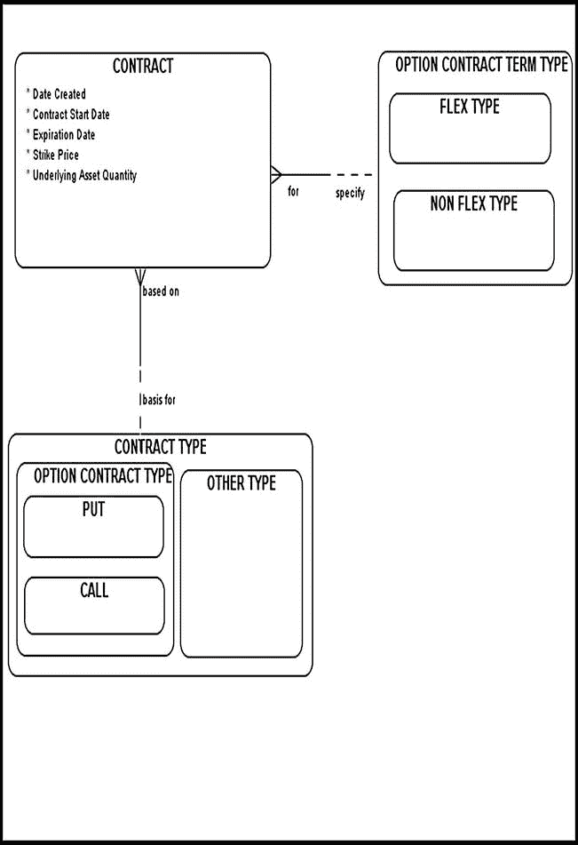

# Figure 6-7 模型

Figure 6-7 对合约中的“变量赋值”（`VARIABLE ASSIGNMENT`）和相应的“建议变量赋值”（`SUGGESTED VARIABLE ASSIGNMENT`）实体进行了建模，并专门针对我们的期权合约类型进行了定制。`SUGGESTED VARIABLE ASSIGNMENT` 存储并维护在“合约类型”（`CONTRACT TYPE`）层级上分配的变量。这些数据可能由特定的金融机构或其他重要的监管机构建议提供。



Figure 6-7. 期权合约变量赋值

在合约层级上存储和维护的变量，顾名思义，是合约特定的。请注意，`VARIABLE ASSIGNMENT` 对 `SUGGESTED VARIABLE ASSIGNMENT` 的依赖关系在双方都是非强制性的。然而，您可能需要审视这种关系，并将其设为强制性的（至少在 `VARIABLE ASSIGNMENT` 一侧）。像几乎总是发生的情况一样，您的具体业务需求将指导您如何进行。

由此产生的“变量观测”（`VARIABLE OBSERVATION`，在特定日期实际进行的观测）要么基于更通用的 `SUGGESTED VARIABLE ASSIGNMENT`，要么基于合约特定的 `VARIABLE ASSIGNMENT`，但不会同时基于两者。

## 期权合约结算类型

期权合约的“结算类型”（`SETTLEMENT TYPE`）明确指定了特定合约（`CONTRACT`）将如何结算，其可能的取值如下（Figure 6-8）：

*   `PHYSICAL SETTLEMENT`：一方将实际交付标的资产。

*   `CASH SETTLEMENT`



Figure 6-8. 期权合约结算类型

在 Figure 6-8 中，特定的期权合约（`CONTRACT`）将根据 `SETTLEMENT TYPE`（其子类型为 `CASH SETTLEMENT` 和 `PHYSICAL SETTLEMENT`）进行结算。

在现金结算类型下，期权持有者将以现金形式获得期权的利润。在这种情况下，只有一种实物资产易手：现金。现金结算的主要原因是实用性；有时很难甚至无法交付标的资产（例如，S&P 500 指数期权）。事实上，几乎所有指数期权都以现金结算，使其成为一种有价值的结算类型。现金结算期权的主要缺点是，期权所有者在行权后无法收到标的商品。如果您因业务需要（例如，保持工厂机器运转）而期望获得商品资产，请确保您计划购买的期权不是以现金结算的。

## 自动行权

如果标的资产的价格高于看涨期权的行权价，该期权通常被称为“价内”（*in the money*）期权。作为看涨期权买方，您希望标的资产的价格相对于期权的行权价上涨。一旦期权被执行并且您获得了目标资产，您可以随时在现货市场上将其出售，从而获得即时收益。

如果标的资产的价格低于看涨期权的行权价，该期权通常被称为“价外”（*out of money*）期权。

一些交易所会对手中价内 $0.01 或以上的任何到期看涨或看跌期权自动行权。通常，对到期价内期权进行自动行权被称为“例外行权”（*exercise by exception*）。然而，例外行权协议可能会被任何明确指示其经纪人如何行权（或不行权）特定到期期权的个人投资者所覆盖。一旦做出指令，自动行权就不再是自动的，而是完全取决于投资者的具体指令。

Figure 6-9 对“行权规则类型”（`EXERCISE RULE TYPE`）超类型及其子类型进行了建模：

*   `MANUAL EXERCISE TYPE`

*   `AUTOMATIC EXERCISE TYPE`



图 6-9 期权行权类型的建模

`门限金额`属性（属于`自动行权类型`子类型）的作用是指定某期权需要达到多大的实值程度才能触发自动行权。请注意，`合约`与`行权规则类型`实体之间的关系在双方都是非强制性的。原因很简单：在场外交易市场中，指定适当的`行权规则类型`的必要性变得不那么突出，因为妥善终止某期权的责任落在了每个投资者个人身上。您的具体业务需求将指导您如何进行操作，因此请仔细研究这些需求。

## 了结期权合约

为了了结某个期权合约中的头寸，投资者可以对同一期权发出`对冲订单`。例如，假设一位投资者买入了一份期权。他可以通过发出卖出同一期权的对冲订单来了结头寸。

在图 6-10 中，一个`对冲订单策略`（`业务策略`的一个子类型）以及相关联的`业务策略行动项`标识了根据业务规则应如何处理任何对冲订单。`合约活动`标识了代表特定`合约`执行的所有`业务策略行动项`的集合。



图 6-10 了结期权合约

一旦投资者选择了`对冲订单策略`，所产生的合约（包括原始合约和对冲合约）应存储在`合约结构`中。请注意，这两个合约应共享同一个唯一交易标识符。此外，`分类类型`实体应帮助建模者进一步归类由同一交易标识符分组的一组合约。在对冲订单的情况下，应使用`基本对冲订单`来对`合约结构`中的对冲订单进行分类。

## 裸期权

当期权合约未与标的股票中的对冲头寸相结合时，该期权策略被称为`裸期权`策略。以下假设示例将解释裸期权背后的机制。

 **示例** 投资者 A 卖出一份价格为 50 美元的欧式看涨期权，并同意在 2014 年 12 月 31 日以每股 20 美元的价格卖出一份英特尔期权标准合约，而实际上他并未持有标的英特尔股票。请注意，上述情况通常被归类为卖出裸看涨期权。假设今天是 2014 年 6 月 1 日，投资者 B 以 50 美元的价格从投资者 A 处购入了该期权合约。正如我们已经了解到的，一份期权合约通常要求购买 100 股。到 2014 年 12 月 31 日期权到期时，英特尔股票的最终价格为 25 美元；投资者 B 行使了他的购买权。为了履行此合约，投资者 A 将不得不在现货市场上以每股 25 美元的价格买入英特尔股票，并将其交付给投资者 B，这将导致如下损失：

```
(100 x ($25 – $20)) – $50 = $450
```

请注意，我们减去了 50 美元，因为这是投资者 A 因卖出看涨期权而从投资者 B 处获得的金额。

您能想象，如果投资者 A 不是卖出一份标准合约的看涨期权，而是卖出了 10 份标准合约，他的损失会是多少吗？他的损失将会成倍增加，这全都要归咎于他那种不必要的、高风险的裸期权策略。

当然，如果事后看来，2014 年 12 月 31 日英特尔股票的现货价格恰好是 15 美元，那么卖出裸看涨期权看起来可能会更具诱惑力。在这种情况下，投资者 B 会放弃交易，因为他可以在现货市场上以更低的价格购买相同的股票，从而让投资者 A 赚取原先的 50 美元期权费。然而，无论结果如何，卖出裸看涨期权都是非常危险的，并且受到大多数监管机构的反对。

让我们回顾一下图 6-10 中的模型，看看它如何帮助我们识别裸期权策略。同样，属于同一总体策略的合约应通过一个公共交易标识符分组，并根据公共的`分类类型`进行分类。假设投资者 A 改变了他的交易策略，并执行了以下交易步骤：

1.  他签署了一份 12 月份到期的远期合约，购买 100 股英特尔股票。

2.  他卖出了一份 12 月份到期的看涨期权，出售这 100 股英特尔股票。

因此，我们将把这些构成交易策略基础的合约分组在一起，并让它们共享相同的交易标识符和相同的`分类类型`。顺便提一下，此特定交易策略的`分类类型`可以称为`卖出备兑看涨期权`。通过检查`合约结构`和`合约`数据，我们可以轻松发现异常合约，并确定对其负责的当事方。

## 期权交割主题域的建模

图 6-11 对期权交割主题域进行了建模。假设一位投资者持有一份看涨期权的多头头寸，以购买一股微软股票。该期权旨在进行实物交割，并于 2013 年 12 月 31 日到期。在期权到期时，如果市场条件有利，投资者将能够行使此期权。通常而言，期权行权可以被视为一个`资产转换`事件。在这里，投资者将实际的股票期权和现金转换为一份微软股票凭证。进行此类交易的主要原因在于投资者意图出于投机目的长期持有该特定股票。



图 6-11 期权合约交割的建模

在交易结束时，卖出看涨期权的一方必须交付标的股票（实物资产）。交割完成后，期权不复存在，且标的纸质资产转换为实物资产（股票凭证）。

图 6-11 中的模型并未反映您作为建模者必须考虑的某些步骤。一旦交割完成，您的应用程序逻辑必须从您的实物资产池中移除已到期的期权。在物理数据库中，物理删除数据很少被认为是可取的；通常更合理的做法是通过应用所谓的`软删除`（又名`逻辑删除`）来标记已删除的行。从库存池中移除一项实物资产（股票期权）并添加另一项实物资产（股票）是一个过程，因此无法直接在数据模型中展示；这些任务必须由流程架构师单独建模。

## FLEX 期权

`灵活交易所交易期权`（FLEX）由 CBOE 于 1993 年引入。这些是未设置特定条款的期权合约，这意味着这些合约是非标准的。在此，一方可以设定合约的整体结构，并指定特定的行权日或行权价格。可以预见，找到同意基础 FLEX 合约结构的交易对手需要时间和精力。FLEX 合约的谈判和购买时间相对较长，导致其流动性比标准化期权合约差。然而，它们可以用来在场外期权市场中获利。图 6-12 图示了一种对 FLEX 期权合约进行建模的方式。



图 6-12 FLEX 合约期权的建模

## 标准期权合约与 FLEX 期权

标准期权合约拥有一套预设条款，例如行权价和到期日。而`FLEX`期权合约则允许投资者根据自身具体需求，对以下条款进行精细调整：

- 期权合约行权价
- 到期日
- 期权风格类型（通常为美式或欧式）
- 合约规模
- 期权类型（看涨或看跌）
- 结算计算方式（基于开盘结算价或收盘结算价）

## 结论

本章讨论了期权合约的基础知识，研究了底层业务规则，并创建了各种初始数据模型。我在本章中使用熟悉的构建块设计并构建的初始模型，应有助于您深入了解期权合约的内部运作机制。下一章将讨论高级期权交易策略及其建模方法，逐步扩展我们的知识并复用本章学到的概念。

¹ 1997 年，罗伯特·默顿和迈伦·舒尔斯因其对经济学和金融工程的贡献获得诺贝尔奖。（费希尔·布莱克于 1995 年去世，因此未能获得诺贝尔奖。）