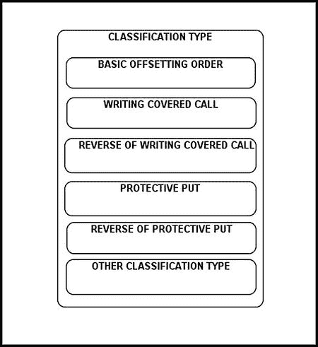
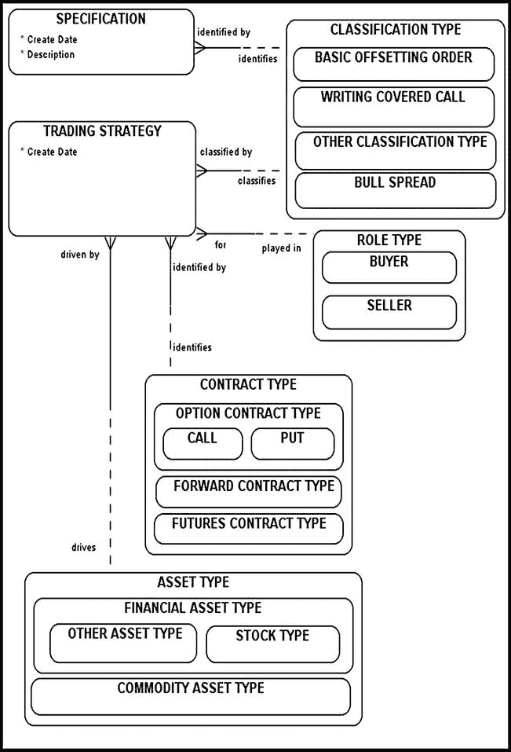
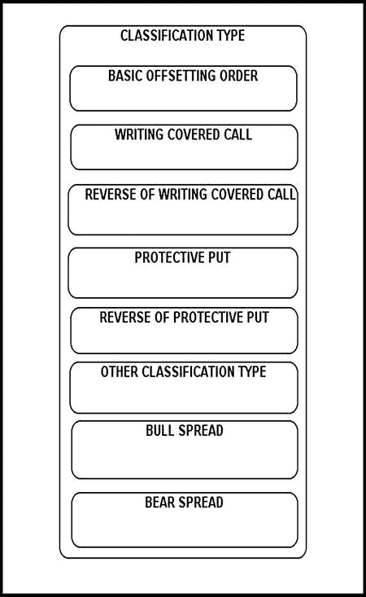
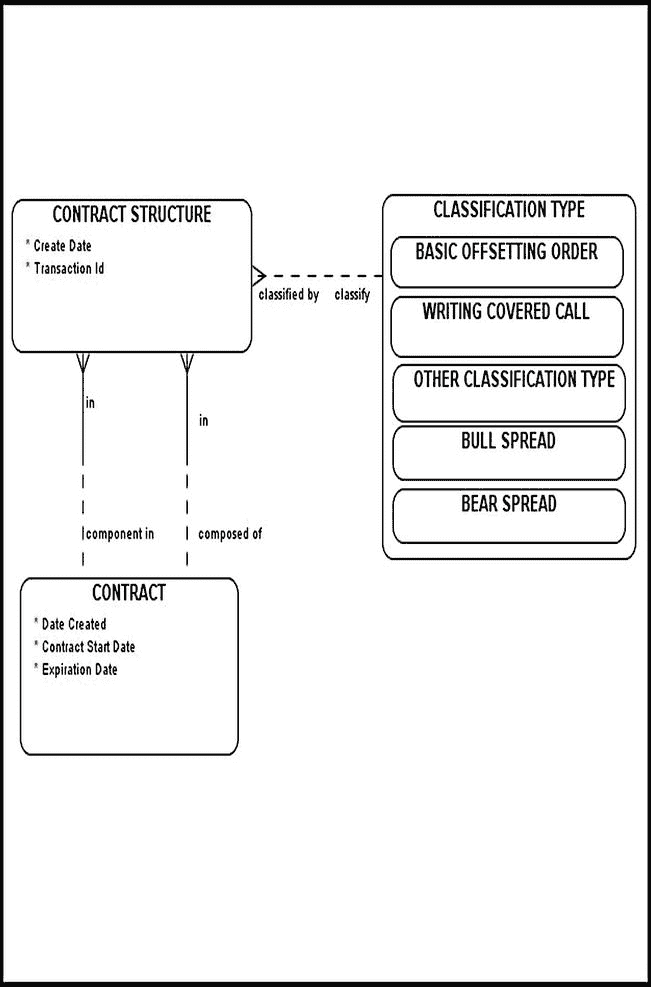
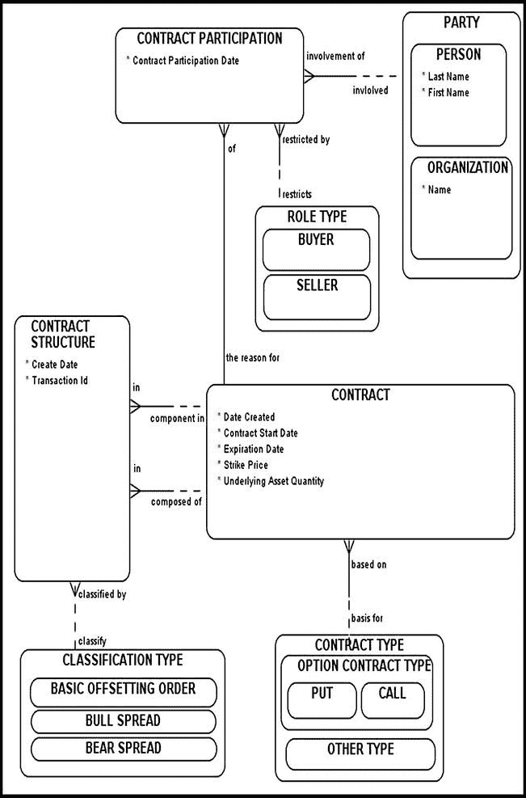

# 章节：对高级期权策略进行建模

*我思故我在。*
——勒内·笛卡尔，《哲学原理》

本章展示了金融工程师如何组合各种合约，以产生独特且实用的利润模式。前几章主要关注单一合约，您已学会如何借助特定的业务规则对其进行建模。本章将解释复合合约的利润模式与机制，并演示其建模方法。讨论从一个涉及一只股票和一个期权的简单策略开始。

## 一个涉及一只股票和一个期权的简单策略

第 6 章使您了解了裸期权策略的危险。回想一下，卖出您并未实际拥有的资产的看涨期权，被称为卖出裸看涨期权。这种高风险策略可能适得其反，导致重大损失并损害卖方的声誉。本节将讨论相反的策略以及保护自己免受裸看涨期权风险的方法。

考虑以下关于*备兑看涨期权*策略的简单示例，即投资者同时持有股票的多头头寸和看涨期权的空头头寸。

 **示例** 假设投资者 A 同时签订了两份合约。第一份合约是一份远期合约，约定于 2014 年 11 月 1 日买入 100 股甲骨文股票。第二份合约是一份期权合约，约定于 2014 年 11 月 4 日卖出同样的 100 股甲骨文股票。请注意，这些合约的到期日并不完全相同，但彼此相对接近。总体而言，这两份合约最终将（或多或少）相互抵消，从而形成比裸看涨期权好得多的风险管理策略。

仔细分析该策略表明，股票的多头头寸保护了投资者免受股价上涨的影响，因为股价上涨会对投资者的看涨期权空头头寸产生负面影响。您知道原因吗？假设一位投资者以每股 20 美元的价格卖出了一份英特尔股票的看涨期权。到期时，尽管交割日英特尔现货价格为 29 美元，投资者仍按约定交付了英特尔股票。投资者非但没有在现货市场上以盈利价卖出英特尔股票，反而蒙受损失，以 20 美元的价格将其交付给交易对手。通常，作为看涨期权的卖方，您希望标的资产价格下跌。

交易者可以采用其他涉及一只股票和一个期权的收益模式，包括以下内容：

- 持有股票的空头头寸和看涨期权的多头头寸（*卖出备兑看涨期权的反向操作*）
- 购买股票的看跌期权和股票本身（有时称为*保护性看跌期权*）
- 持有看跌期权的空头头寸和股票本身的空头头寸（称为*保护性看跌期权的反向操作*）

为了对这些四种替代方案进行建模，`交易分类类型`超类型被扩展，以包含以下子类型：

- `卖出备兑看涨期权`
- `卖出备兑看涨期权的反向操作`
- `保护性看跌期权`
- `保护性看跌期权的反向操作`

这些子类型使建模者能够正确分类和分组特定的交易策略，并识别构成特定交易策略基础的每份实物合约。

图 7-1 中的图表展示了我们已经熟悉的`分类类型`超类型的扩展。

图 7-1. 扩展 `分类类型` 超类型

请注意，上述每种交易策略都可以很容易地被`合约结构`（图 7-4）所容纳。

## 期权策略元数据建模

本节将偏离收益利润模式，讨论*元数据建模*。这类模型使我们能够描述、存储和维护特定交易策略背后的数据。一旦您理解如何对交易策略元数据建模，您应该能够应用这些原则，并根据您的具体业务需求对其进行调整和定制。

假设您正在与一位金融工程师合作，他要求您提出一些数据结构，以便他能够存储和维护特定的交易策略，以及执行该策略所需的相应业务步骤。最终，这些结构可能会发展成一个包含公司范围内所有预先批准的交易策略及其相应交易步骤的库。在开始建模*元数据*（即描述其他数据的数据）之前，您需要了解底层的业务步骤。在这种情况下，您将依靠您的金融工程师来提供交易策略和相应的交易步骤列表。

假设该金融工程师有兴趣存储和维护卖出备兑看涨期权背后的元数据。第一份合约（股票的多头头寸）要求投资者持有远期合约的多头头寸，以购买特定的标的资产（例如，一股微软股票）。第二份合约（看涨期权的空头头寸）要求投资者对同一标的资产（微软股票）卖出看涨期权。两份合约应具有相对相似的到期日，并涉及相同的资产。

图 7-2 展示了针对特定交易策略及其元数据进行建模的解决方案。本节将探讨该模型如何使您能够存储和维护备兑看涨期权的元数据。

图 7-2. 期权策略元数据建模

图 7-2 模型的核心是`交易策略`和`规格说明`实体。`交易策略`实体会存储和维护实施备兑看涨期权策略所需的每种`资产类型`、`合约类型`和`角色类型`（`买方`/`卖方`）。`规格说明`实体，顾名思义，列出了每种策略的详细规格。对于此示例，备兑看涨期权策略的规格说明可能会规定两份合约应应用于同一只股票，并且两份合约应在同一个月到期。

卖出备兑看涨期权策略涉及两份合约；您的模型需要解释这些合约及相关实体的结构。

## TRADING STRATEGY 元数据建模

`TRADING STRATEGY`的第一条元数据条目处理第一个合约（股票多头头寸）的规范：

- `CONTRACT TYPE`：远期合约类型
- `ASSET TYPE`：股票资产类型
- `ROLE TYPE`：买方
- `CLASSIFICATION TYPE`：备兑开仓

`TRADING STRATEGY`的第二条元数据条目处理第二个合约（看涨期权空头头寸）的规范：

- `CONTRACT TYPE`：期权合约类型
- `ASSET TYPE`：股票资产类型
- `ROLE TYPE`：卖方
- `CLASSIFICATION TYPE`：备兑开仓

表 7-1 以更直观的方式呈现了相同信息。

**表 7-1.** 期权策略元数据建模

|  |

请注意，在图 7-2 的模型中，无法指定合约的物理顺序。有时，指定合约顺序的能力非常重要。为了纳入这一需求，你可以向`TRADING STRATEGY`实体添加`order identifier`属性。该属性（以及最终的列）将指定`TRADING STRATEGY`中记录的物理顺序。

注意，图 7-2 中的图表仅处理类型。这是有意为之；在元数据建模中，你的任务是用类型（或蓝图）来解释元数据的内部构成，而不是用这些类型的实际体现。图 7-2 的模型能够容纳后续章节中开发的更复杂的场景。

## 牛市价差

如果投资者认为某只特定股票的价格在时间 1 到时间 2 的时间跨度内会适度上涨，他可能会选择实施*牛市价差策略*。该策略允许投资者在市场条件有利时获得小额利润，并在条件不利时保护其免受过度损失，从而限制风险。例如，持有一个执行价格为`S1`的看涨期权的投资者，可能会决定放弃价格上涨至`S2`时的潜在未来利润，以限制其风险。

牛市价差策略通过以下步骤执行：

1.  以某个执行价格（`S1`）买入一份股票的看涨期权。
2.  以更高的执行价格（`S2`，其中`S2 > S1`）卖出一份同一股票的看涨期权。这里希望股票价格在此期间上涨。
3.  两份期权在同一月份到期。

为了将牛市价差策略适配到图 7-2 的数据模型中，重点关注指定执行价格`S2`必须大于执行价格`S1`，并且所考虑的期权应在同一月份到期的业务规则。这条业务规则就是我们的牛市价差`SPECIFICATION`。

`TRADING STRATEGY`的第一条元数据条目处理第一个合约的元数据规范：

- `CONTRACT TYPE`：`call`
- `ASSET TYPE`：`stock option asset type`
- `ROLE TYPE`：`buyer`
- `CLASSIFICATION TYPE`：`bull spread`

`TRADING STRATEGY`的第二条条目处理第二个合约的规范：

- `CONTRACT TYPE`：`call`
- `ASSET TYPE`：`stock option asset type`
- `ROLE TYPE`：`seller`
- `CLASSIFICATION TYPE`：`bull spread`

通过遵循相同的整体模式，我们可以指定任何交易策略，包括下一节讨论的*熊市价差*。

## 熊市价差

如果投资者预期某只特定股票的价格会下跌，但不会下跌太多，他或她可能会选择实施*熊市价差策略*。该策略通过以下步骤执行：

1.  以某个执行价格（`S1`）买入一份看跌期权。
2.  以另一个执行价格（`S2`）卖出一份看跌期权，其中`S1 > S2`。
3.  两份期权在同一月份到期。

在这里，投资者以执行价格`S1`买入看跌期权，并决定放弃在价格`S2`时的任何潜在利润，从而形成一个精心构建的机制，旨在防止过度风险暴露。为了让该策略正常运行，两份合约需要在同一月份到期。

指定执行价格`S1`必须大于`S2`且两份合约应在同一月份到期的业务规则就是熊市价差`SPECIFICATION`。

`TRADING STRATEGY`的第一条元数据条目处理第一个合约的元数据规范：

- `CONTRACT TYPE`：`put`
- `ASSET TYPE`：`stock option asset type`
- `ROLE TYPE`：`buyer`
- `CLASSIFICATION TYPE`：`BEAR SPREAD`

`TRADING STRATEGY`的第二条条目处理第二个合约的规范：

- `CONTRACT TYPE`：`put`
- `ASSET TYPE`：`stock option asset type`
- `ROLE TYPE`：`seller`
- `CLASSIFICATION TYPE`：`BEAR SPREAD`

在图 7-3 中，`CLASSIFICATION TYPE`超类型通过添加`BEAR SPREAD`子类型而得以扩展。

**图 7-3.** 扩展`CLASSIFICATION TYPE`并引入`BEAR SPREAD`子类型

## 重新审视合约结构实体

如您所知，`CONTRACT STRUCTURE`和`CLASSIFICATION TYPE`实体的主要目的是从一系列看似分散的合约中组装出一个模式（参见图 7-4）。您可以轻松查询这两个表，并检索构成特定交易策略骨干的合约。通过检查这些合约，您可以确定：

- 您在特定交易策略执行方面所处的位置
- 哪些工作仍需完成
- 任何所需的抵销合约是否缺失

**图 7-4.** 重新审视合约结构

例如，您期望在`CONTRACT STRUCTURE`中找到两份合约来解释特定的`BULL SPREAD`交易策略。任何与预期结果的偏差都将成为调查相关数据的理由。

事实上，通过对`CONTRACT STRUCTURE`（及关联实体）运行查询，您可以执行各种数据取证，并轻松发现与特定交易策略相关的数据异常。一旦您在`CONTRACT STRUCTURE`中发现数据异常，获取关于谁可能对可疑合约负责的详细信息就是一个相对直接的过程。我们如何做到这一点？`CONTRACT PARTICIPATION`是一个很好的起点。

图 7-5 中的图表将现已熟悉的`CONTRACT`、`CONTRACT STRUCTURE`和`CONTRACT PARTICIPATION`概念联系在一起，使您能够回答与特定`CONTRACT`相关的各种问题，包括与合约交付、合约参与以及其他各种合约活动相关的问题。

**图 7-5.** 连接合约参与和合约结构

## 结论

本章展示了如何将您在先前章节中学到的许多概念应用于建模金融工程师如何组合各种合约以产生独特且有用的盈利模式这一实际任务。我敦促您尽可能多地练习数据建模任务。毕竟，熟能生巧。系统性地应用您新学到的概念将保证您获得成功和认可。被动学习则保证不了任何事情。

## 推荐阅读

Robert L. McDonald, *Derivatives Markets*, 3rd ed. Prentice Hall, 2009.

