# 第八章：互换与远期利率协议

*乐观者可能在没有光明的地方看到光明，但为什么悲观者总是跑去把光明吹灭？*

——米歇尔·德·圣皮埃尔

## 互换合约与远期利率合约

互换合约与远期利率合约在场外衍生品市场中扮演着重要角色。本章沿用惯例：先定义每种合约类型，解释其基础业务规则，然后进行建模。

## 定义互换

**互换合约**是一种约定在未来按照预定时间表交换现金流的协议。该协议规定了现金流交换日期及现金流计算方法。

第 4 章中讨论的远期合约是简单互换合约的一个实例。考虑以下假设情况：A 公司与 B 公司签订一份远期合约，约定在 2014 年 12 月 31 日以每盎司 50 美元的价格买入 200 盎司铜。合约起始日为 2013 年 12 月 31 日。在合约到期日（2014 年 12 月 31 日），A 公司将收到 B 公司的 200 盎司铜，并支付 10,000 美元（200 × 50 美元）。

A 公司可采取的策略之一，是在当日以铜现货价格立即卖出这批铜。盈亏将由当日铜的现货价格决定。然而在实际操作中，远期合约的交割机制会被简化，最终以现金结算：铜的总数量（200 盎司）乘以铜的现货价格与合约远期价格（每盎司 50 美元）的差额。请注意：现金流交换仅发生一次，即在远期合约的到期日。

相比之下，互换合约则会在多个预定日期进行现金流交换。最流行的两种互换合约类型是：

- 普通型利率互换

- 固定对固定货币互换

## 普通型利率互换

以下简单示例说明了**普通型利率互换**合约的运作方式。

 **示例** 假设 A 公司有 10,000 美元可投资，当前利率为 4%。A 公司的财务主管可能认为利率近期会下跌，因此同意与 B 公司按以下安排交换现金流：

在两年期内，每半年一次，A 公司将按浮动利率支付利息，B 公司将按固定利率（例如 3.8%）支付利息，两者均基于相同的名义本金（10,000 美元）。两年期内的半年支付将产生四次支付交换。

在普通型利率互换中，所用利率通常是 LIBOR。表 8-1 显示了该示例的假设支付计划，包括资金流入与流出。请注意，在互换合约存续期间，固定利率始终保持不变。

表 8-1. 假设支付计划

| 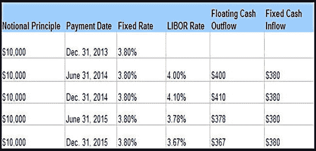 |

## 固定对固定货币互换

**固定对固定货币互换**实际上是一种将某国投资转换为另一国投资的机制。通过一个假设示例可以最好地解释其原理。

 **示例** 假设 A 公司认为美元兑英镑将升值，因此决定投资美元。B 公司则持相反观点并投资英镑。同时，假设 A 公司为美国公司，B 公司为英国公司。这两家公司可以约定一个本金（例如 800 万英镑和 1500 万美元），并按照预定时间表向对方支付固定金额（故称**固定对固定**）。在本例中，A 公司将收到 800 万英镑，并支付 5%的固定利率利息。B 公司将收到 1500 万美元，并同意按此本金的 4.5%支付利息。在固定对固定货币互换结束时，本金加上剩余现金流将进行交换。

固定对固定货币互换有助于企业更好地管理其对利率波动的风险敞口，并利用国内企业通常相对于外国企业所拥有的利率优势，获得更有利的利率。

## 国际互换与衍生品协会

构成互换合约基础的文档称为**确认书**。标准的**确认协议**由国际互换与衍生品协会（ISDA, `www.isda.org`）设计，该确认书构成了场外市场每份互换协议的基础。确认协议及其结构将在“对 ISDA 文档和确认书进行建模”一节中讨论。

## 对互换合约类型进行子类型化

开始互换合约建模任务时，可以先进行一个相对简单的练习：对`合约类型`进行适当的子类型化（从而扩展），以涵盖`互换合约类型`。如您所知，`互换合约类型`可进一步细分为`固定对固定货币互换类型`和`普通型利率互换类型`（图 8-1），从而深化您的`合约类型`层次结构。该模型看似简单，但日后将为您带来显著优势。通过将`合约`与特定的`合约类型`关联，可使合约继承用户能够理解并欣赏的特定业务规则。

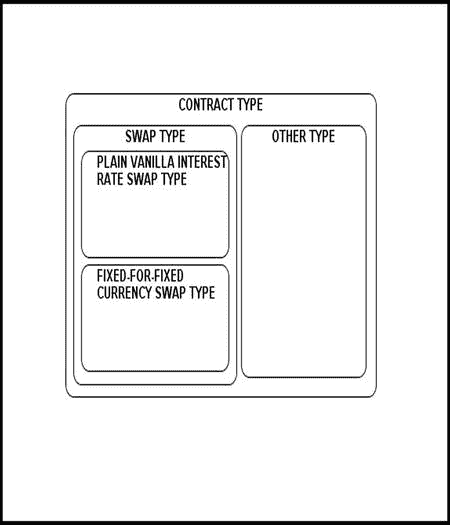

图 8-1. 将合约子类型化为互换类型

## 利率与利率类型

第 6 章中期权合约估值的讨论将 LIBOR（伦敦银行间同业拆借利率）视为变量。在本节中，我们将偏离该做法，显式创建`利率`和`利率类型`实体。`利率类型`将进一步细分为`LIBOR 利率类型`和`无风险利率类型`（图 8-2）。`利率类型`表示特定组织可能交易的利率类型，应视为通用蓝图。而`利率`则是特定日期观察到的实际利率。之所以显式建模这些实体，是因为在互换合约下，能够明确指定给定`合约`中特定`当事方`应负责哪种利率至关重要。

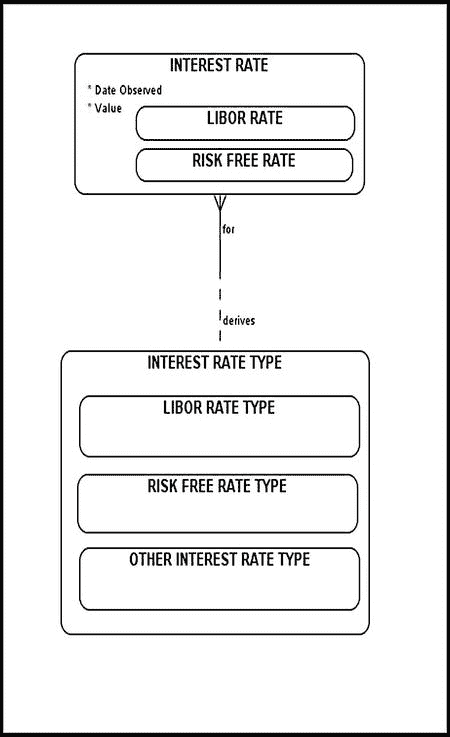

图 8-2. 利率与利率类型

至此，您已经看到了两种处理利率维护和追踪的方法。在之前的章节中，您学习了如何使用动态变量来完成此类任务。本节将向您展示如何使用`INTEREST RATE`和`INTEREST RATE TYPE`实体来实现相同的功能。实体方法更加明确、直接且易于理解。然而，当您不想硬编码某些内容，并且需要更灵活、动态的方法时，通过变量实现则是一个极佳的解决方案。

## 固定利率与浮动利率参与方角色

上述关于掉期合约的讨论，在我们的建模工具箱中引入了两种新的`ROLE TYPE`（参见图 8-3）：

*   `FIXED RATE PLAYER`

*   `FLOATING RATE PLAYER`

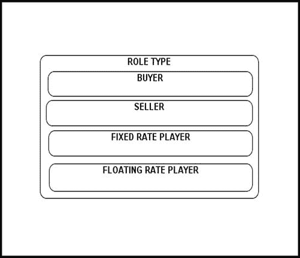

图 8-3. 固定利率与浮动利率参与方角色

从业务需求的角度来看，能够精确识别每个参与方在特定掉期合约中的角色至关重要，并且这通常是技术上的必要条件。图 8-3 中的模型可能看起来相对简单，但在更大的数据模型上下文中，它将更好地阐明底层业务规则，并改善与最终用户的沟通。

## 建模掉期合约参与

图 8-4 展示了掉期合约参与主题域。为了保持初始模型简单且重点突出，`ROLE TYPE`仅被子类型化为：

*   `FIXED RATE PLAYER`

*   `FLOATING RATE PLAYER`

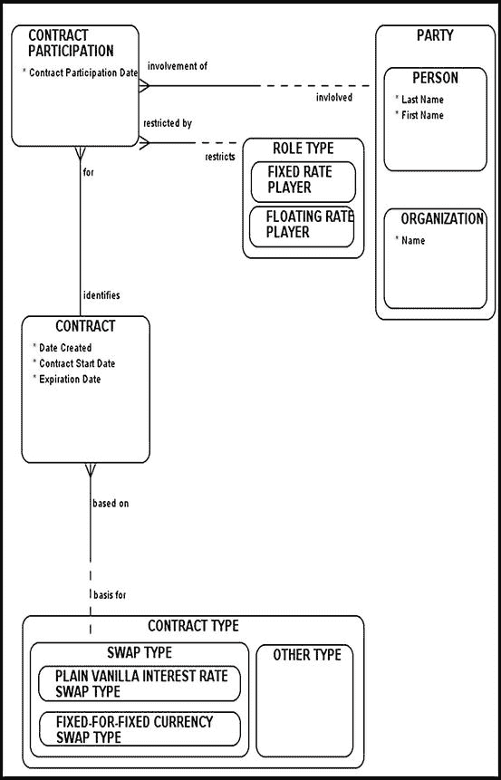

图 8-4. 建模掉期合约参与

`BUYER`和`SELLER`子类型被刻意移除，因为这些角色类型不适用于当前情况。

`FIXED-FOR-FIXED CURRENCY SWAP TYPE`合约涉及至少两个参与方，每个参与方扮演`FIXED RATE PLAYER`角色。另一方面，`PLAIN VANILLA INTEREST RATE SWAP TYPE`合约涉及至少两个合约参与方，每个参与方扮演`FIXED RATE PLAYER`角色或`FLOATING RATE PLAYER`角色。`CONTRACT`和`CONTRACT PARTICIPATION`实体之间的关系在两端都是强制的。如前所述，请确保在文档中明确说明为什么该关系在两端都是强制的，以及该关系试图执行的业务规则。`CONTRACT`和`CONTRACT PARTICIPATION`必须作为同一数据库事务的一部分，一起填充。

## 建模掉期合约资产分配与支付计划

参与掉期协议的各方可以实际交换本金金额（这种做法很少发生），也可以在纸上达成这些金额的协议。由于本金金额很少易手，因此被称为*名义本金*。各方根据特定计划（该计划是合约特定利率的函数）同意支付给对方的金额，应被视为纸质资产，除非实际交付发生。

`CONTRACT ASSET ALLOCATION`（图 8-5）在特定掉期`CONTRACT`的上下文中，将一个`ASSET`或`ASSET TYPE`与一个给定的`PARTY`关联起来。在这里，我们将指定双方同意的本金金额。请注意，模型在`CONTRACT ASSET ALLOCATION`层级上显示了`ASSET`实体，因为您的业务需求可能会要求您考虑本金金额可能实际易手的情况。但请记住，名义本金金额永远不会易手。

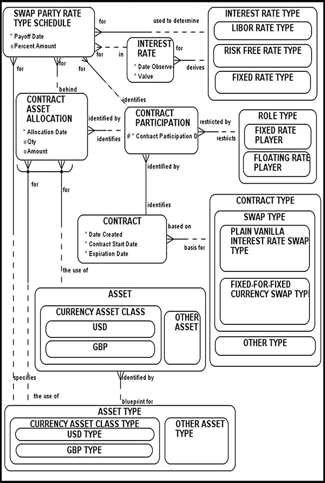

图 8-5. 建模掉期合约资产分配与支付计划（完整版）

考虑投资者 A 和投资者 B 之间的一个掉期合约。假设此特定合约签署于 2013 年 7 月 1 日，为期两年。第一次支付交换发生在 2014 年 1 月 1 日。名义本金金额设定为 10,000 美元，支付每半年交换一次。在此掉期合约的生命周期内，投资者 A 同意按年利率 5%（固定金额）支付名义本金的利息，投资者 B 则同意按六个月期 LIBOR 利率（浮动金额）支付相同名义本金的利息。

该合约被归类为普通型利率掉期。投资者 A 将被视为固定利率参与方，投资者 B 为浮动利率参与方。双方均同意名义本金金额（意味着该金额永不实际易手），该金额为`USD TYPE`（`CURRENCY ASSET CLASS TYPE`的一个子类型）。`CONTRACT ASSET ALLOCATION`为每个参与方存储一条记录；在此例中，两个参与方都与`ASSET TYPE`为`USD TYPE`以及`CONTRACT ASSET ALLOCATION`金额等于 10,000 相关联。这个假设的掉期合约将持续两年，支付每半年进行一次，因此总共产生四次支付。`SWAP PARTY RATE TYPE SCHEDULE`将为每位投资者存储四行数据，明确指定每一方每次付款的到期日。投资者 A（固定利率参与方）与`FIXED RATE TYPE`关联，其中实际利率可以轻松指定（此例中为 5%）。投资者 B（浮动利率参与方）与`LIBOR RATE TYPE`关联，其中实际利率设置为首次支付日期前六个月当时流行的六个月期 LIBOR 利率。投资者 A 和 B 都提前清楚地知道投资者 B 需要支付的第一个 LIBOR 利率。后续的六个月期 LIBOR 利率将是未知的，并将在每个预定支付日期观察得到。

填充`SWAP PARTY RATE TYPE SCHEDULE`表的数据有几种选择。第一种选择是，每当某个未知利率变得广泛可用时，就逐行填充`SWAP PARTY RATE TYPE SCHEDULE`。第二种选择是，提前为每个参与方预填充所有行，并将未知的利率维护在一个可为空的字段中。一旦未知利率数据变得可用，就可以将其插入到`SWAP PARTY RATE TYPE SCHEDULE`中，以保持其最新状态。

不幸的是，图 8-5 中的图表包含了太多实体，变得难以阅读和解释。例如，为了节省空间，`INTEREST RATE`实体必须在不显示其任何底层子类型的情况下进行描绘。为了纠正这一点，该模型的简化版本显示在图 8-6 中。这个新图表使事情更清晰、更明确，因为它包含的实体更少。

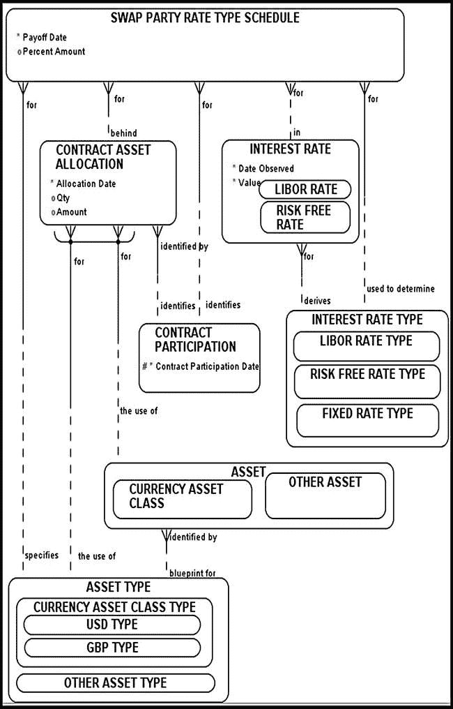

图 8-6. 建模掉期合约资产分配与支付计划（简化版）

请注意，`CONTRACT ASSET ALLOCATION`实体周围的排他弧表示本金金额可能会实际易手。再次说明，这种情况并不经常发生。如果根据您的底层业务规则，您预期这种情况不会发生，您可以简化生成的模型并移除`ASSET`实体（以及相关的关联关系）。此外，请注意`SWAP PARTY RATE TYPE SCHEDULE`与`ASSET TYPE`之间存在关系；这表明计划中的支付（通过`SWAP PARTY RATE TYPE SCHEDULE`实现）被视为纸质资产。`SWAP PARTY RATE TYPE SCHEDULE`与`INTEREST RATE`（实际观察到的利率）之间的关系在两端都是非强制性的，因为这些数据只有在稍后才可用。

## 掉期合约支付

## 互换合约中的交割

互换合约中的交割（图 8-7）由`SWAP PARTY RATE TYPE SCHEDULE`控制，并与实物资产（例如现金）相关联。

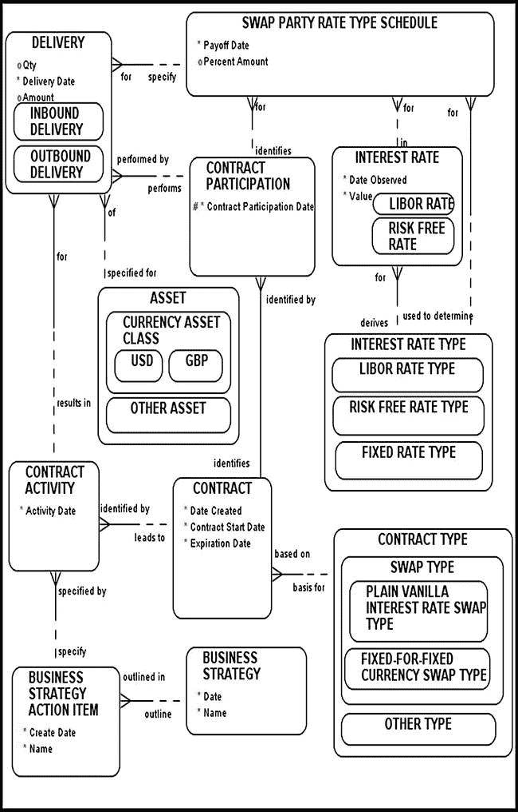

图 8-7. 互换合约支付

在上一节开发的示例中，投资者 A 对 10,000 美元的名义本金支付 5%的年固定利率（或每半年支付 2.5%）。因此，投资者 A 计划进行四次利息支付，每次 250 美元。投资者 B 则计划支付在首次支付交换日期前六个月观察到的六个月的伦敦银行同业拆借利率（LIBOR）（基于 10,000 美元名义本金）。因此，首笔浮动利率支付的金额不应让人意外，因为双方都清楚应支付的金额。假设原始六个月 LIBOR 利率在 2013 年 7 月 1 日观察为 2.6%，那么投资者 B 将需要支付 260 美元。在支付交换时，会对六个月 LIBOR 利率进行实际观察，并将其值存储在`SWAP PARTY RATE TYPE SCHEDULE`中。这是投资者 B 在下一个计划支付日期需负责的 LIBOR 利率。表 8-2 列出了支付的时间表，以及从两位投资者视角出发的资金流出情况。日期列显示了将观察六个月 LIBOR 利率的日期。对应的六个月 LIBOR 利率存储在`LIBOR Rate`列中。

表 8-2. 假设支付时间表（互换合约支付）

| 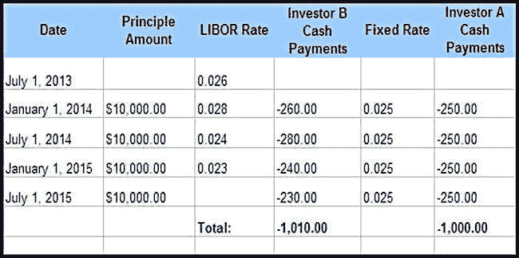 |

再次强调，模型的大致形态和感觉应当熟悉，但尽管基础可能相同，请注意我们是如何根据底层业务规则对其进行塑造的。

## 远期利率协议

*远期利率协议*（FRA）是一种场外交易合约，规定在未来某个时间点，对某一特定本金金额的借款或贷款适用某一特定利率。其主要假设是借款或贷款以 LIBOR 利率进行。本金金额仅在书面载明，很少实际交换，因此成为名义本金金额。一个假设示例将阐明 FRA 背后的原理。

 **示例** 假设投资者 A 同意在时间`T1`至`T2`之间向投资者 B 支付基于本金`P`的`Int_A`%利率，其中`T1`和`T2`均为未来日期。投资者 B 同意在`T1`至`T2`之间向投资者 A 支付基于相同本金`P`的`Int_B`%利率。假设`Int_A`%为 LIBOR 利率，可以看出 FRA 是对冲 LIBOR 利率风险敞口的完美工具。时间`T1`将提前设定，且`T1`至`T2`的时间跨度将明确指定。支付通常在时间`T1`发生，届时覆盖`T1`至`T2`时间跨度的远期 LIBOR 利率已知，付款将从时间`T2`折现至`T1`。

可以看出，FRA 背后的概念与互换合约相似，唯一区别在于 FRA 的现金流交换仅发生一次。

### FRA 合约类型

与 FRA 合约建模相关的首要任务是定义`FRA CONTRACT TYPE`，并在模型中明确展示（图 8-8）。为简单起见，`CONTRACT TYPE`被子类型化为：

* `FORWARD RATE AGREEMENT TYPE`（远期利率协议类型）

* `OTHER TYPE`（其他类型）

请记住，一旦将合约关联到特定的合约类型，就允许其继承该类型特有的特定业务规则。这在此阶段看似多余，但在更大的数据模型背景下，这种子类型化有助于沟通并消除不必要的歧义。

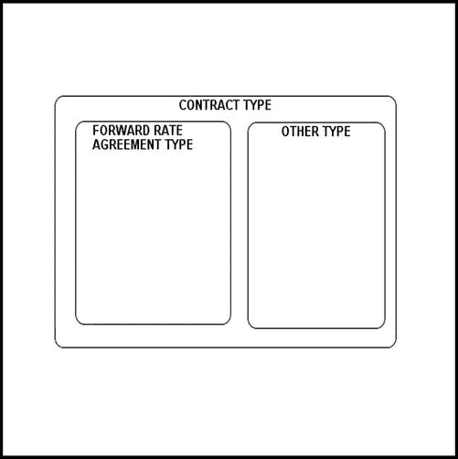

图 8-8. 为纳入 FRA 合约类型而对合约类型进行子类型化

### 建模 FRA 合约参与方

FRA 涉及一个固定利率方，其在时间`T1`至`T2`之间支付固定利率；以及一个浮动利率方，其在时间`T1`至`T2`之间支付市场实现的利率（通常为 LIBOR 利率）（图 8-9）。图 8-9 中的模型看起来类似于图 8-4 中的互换合约参与方示意图。这种相似性示例说明了通过理解合约的底层业务规则并将其与一般的合约建模知识相结合，可以多么容易地创造出新事物。请注意，`CONTRACT`（合约）与`CONTRACT PARTICIPATION`（合约参与方）之间的关系在双方都是强制性的。

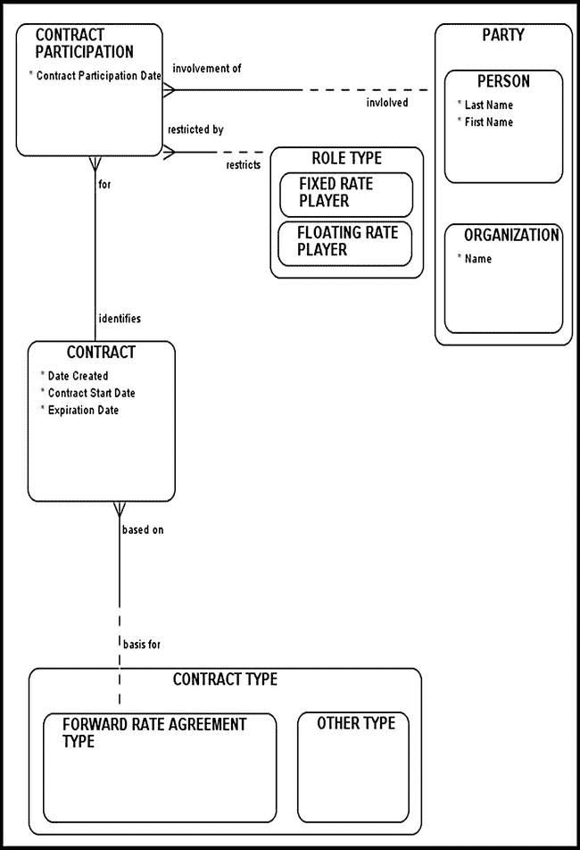

图 8-9. FRA 合约参与方

### 建模 FRA 资产配置与偿付计划

FRA 合约的资产配置与偿付计划建模可以采用类似于建模互换合约的方式。事实上，这两种合约类型有许多相似之处，之前讨论的几个概念在此同样适用。

类似于“建模互换合约资产配置与偿付计划”一节中的`SWAP PARTY RATE TYPE SCHEDULE`实体，这里对应的是`FRA PARTY RATE TYPE SCHEDULE`，它同样明确列出了每一方的偿付计划。为保持清晰明确，我们可以将这两个实体泛化为一个共同的超类型，称为`PARTY RATE TYPE SCHEDULE`（图 8-10）。

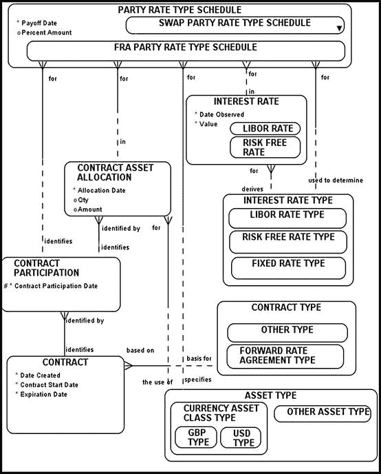

图 8-10. FRA 资产配置与利率偿付计划

特定 FRA 合约下的本金金额很少实际易手。为保持最终模型简单，我们声明在 FRA 合约下，本金金额从不实际易手，因此是名义本金金额。这种简化导致从最终的合约资产配置模型中移除了实物资产。一个假设示例将阐明如何使用图 8-9 中的模型。

 **示例** 假设投资者 A（固定利率方）同意支付基于 10,000 美元名义本金的 5%固定利率。该 FRA 合约签订于 2014 年 5 月 1 日，未来起始日期设定为 2015 年 7 月 1 日（时间`T1`），未来结束日期设定为 2016 年 1 月 2 日（时间`T2`）。投资者 B（浮动利率方）同意支付基于 10,000 美元名义本金的、在 2015 年 7 月 1 日（`T1`）至 2016 年 1 月 1 日（`T2`）之间市场实现的六个月 LIBOR 利率。实际支付将在 2015 年 7 月 1 日（时间`T1`）发生，届时覆盖`T1`至`T2`时间段的六个月 LIBOR 利率可获取。为反映这些事实，我们首先填充`CONTRACT ASSET ALLOCATION`（合约资产配置）。涉及的基础资产是纸质资产（名义本金金额），这就是我们将`CONTRACT ASSET ALLOCATION`关联到`ASSET TYPE`（资产类型）的原因。双方商定的名义本金金额以美元计价，因此`ASSET TYPE`被指定为`USD TYPE`（美元类型）。因此，你在`CONTRACT ASSET ALLOCATION`中存储并维护两条记录（每位投资者一条`CONTRACT ASSET ALLOCATION`记录）。