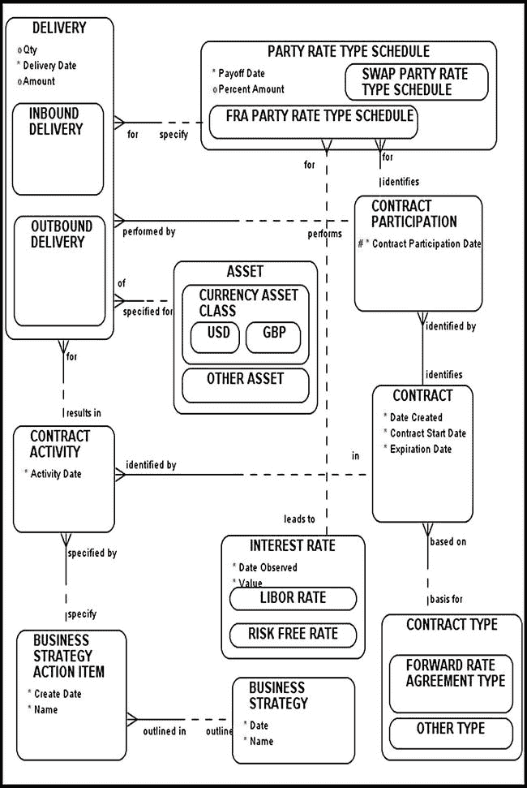
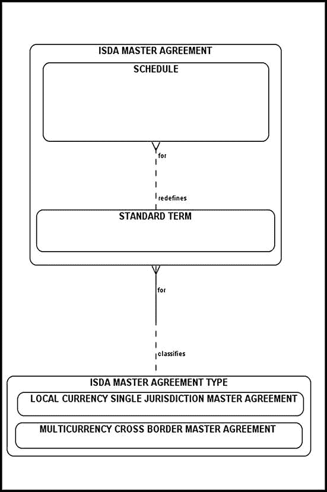
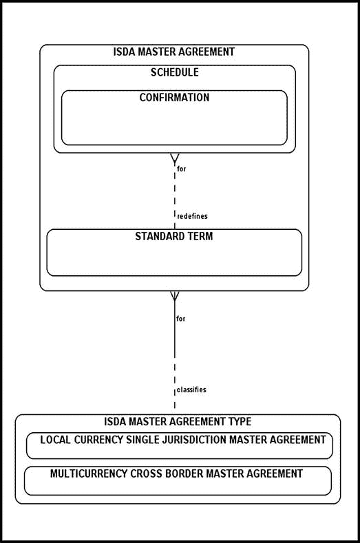
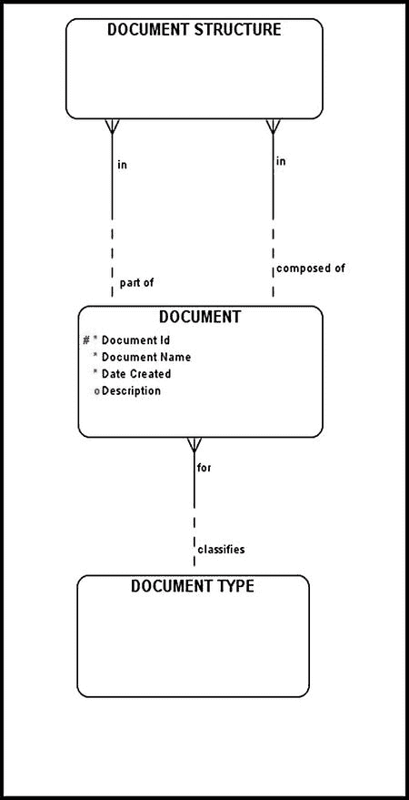

# 填充`合同资产分配`后

填充`合同资产分配`后，你需要处理实际支付时间表。尽管远期利率协议（FRA）合同只有一个支付日期，但其建模方式与对应的`掉期支付时间表`类似。`FRA 参与方利率类型时间表`会为每个投资者存储并维护一个支付时间表日期。当`T1`和`T2`之间的实际六个月期`LIBOR`利率可用时，该利率将被存储，支付日期则设为`T1`时刻。

## 对 FRA 资产交割建模

控制实际 FRA 合同交割的实体是`FRA 参与方利率类型时间表`（图 8-11）。在给定 FRA 合同的现金流交换之前，必须进行利率观测。适用的`LIBOR`利率必须记录在`FRA 参与方利率类型时间表`中，以便确定实际支付金额。在交割阶段，实际资产（如现金）在合同参与者之间进行交换；因此，`交割`实体与实际`资产`之间建立了关系。

图 8-11. FRA 与资产交割

## 对 ISDA 文件与确认书建模

场外交易（OTC）市场中的大多数衍生品合约（包括掉期和 FRA）都基于 ISDA 文件。ISDA 文件极为复杂且技术性强。这种复杂性的原因在于需要考虑 OTC 市场中潜在的合约风险。在本节中，我们将研究 ISDA 文件的结构并识别其主要组成部分。¹

ISDA 文件的主要组成部分是`ISDA 主协议`（图 8-12）。一旦双方签署此协议，它将管辖双方之间所有未来的交易。ISDA 主协议可分为两类：`多币种跨境主协议`和`单一币种单一司法管辖区主协议`。

- `多币种跨境主协议`适用于位于不同司法管辖区的双方，交易通常涉及不同币种。

- `单一币种单一司法管辖区主协议`适用于位于同一司法管辖区的双方，交易通常涉及同一币种。

图 8-12. 对 ISDA 文件结构建模

`ISDA 主协议`包含两个部分：`标准条款`和`附录`。`标准条款`涉及净额结算、违约事件、提前终止、适用法律等内容。这些是双方需要谈判并达成一致的标准条款和定义。`附录`部分引用了标准条款及其商定的定义。此外，附录还列出了对`标准条款`所做的每一项修订。

通常，双方通过电话商定衍生品合约。他们达成的口头协议条款记录在`确认书`中。流程很简单：一方将交易的所有组成部分书面记录，并发送给对方以供接受。ISDA 提供一份标准的、单纯的`确认书`，这是一份包含业务条款的简短文件。如果特定交易无法用单纯的确认书覆盖（有时称为*结构化交易*），双方必须创建满足自身需求的定制确认书。最终，`确认书`成为`附录`的一部分，而`附录`又成为`ISDA 主协议`的一部分（图 8-13）。

图 8-13. 对 ISDA 文件结构建模（含确认书）

当`附录`中的数据与`ISDA 主协议`冲突时会发生什么？在这种情况下，根据*不一致规则*，`附录`中的数据胜出。原因很简单；附录部分是所有微调发生的地方，因此它覆盖了`ISDA 主协议`中出现的通用数据。如果`附录`中的数据与`确认书`不一致怎么办？再次根据不一致规则，`确认书`中的数据胜出。

至此，你可能已经猜到，模型中用“文件套文件”结构表示的`ISDA 主协议`文件的内部结构，可以使用第 3 章中介绍的多对多递归关系来建模（图 8-14）。`文件结构`使我们能够对 ISDA 主协议文件复杂结构所体现的复杂的“文件套文件”关系进行建模。²

图 8-14. ISDA 文件结构的通用表示

## 结论

本章讨论了掉期和远期利率协议两种合约类型，它们在 OTC 衍生品市场非常流行，并受类似的一套业务规则管辖。像往常一样，我通过重新利用前几章开发的建模模式，以适应这些特定合约的业务规则，来对这些合约类型进行了建模。

¹ Tan Sin Liang, *“场外衍生品文件”* (2001), `http://www.lawgazette.com.sg/2001-4/April01-focus.htm`。

² 参见 David C. Hay 在《数据模型模式：思维惯例》（Dorset House 出版社，1995 年；同上，*数据模型模式：元数据图谱*（Morgan Kaufmann 出版社，2006 年））中对诸如物质安全数据表和临床试验观察等复杂主题领域中文件元数据及文件结构建模的描述。