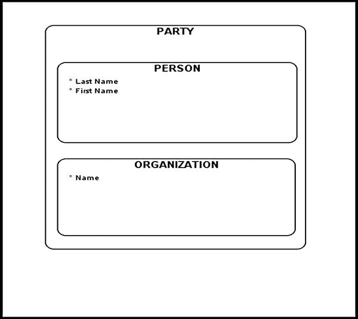

# 章节

## 临别感言

*没有什么比常识分配得更公平：没有人会觉得自己需要的比已有的多。*

——勒内·笛卡尔，《方法论》

我希望你阅读这本书的乐趣与我写作时一样多。在最后一章中，我将提供一些实用的建议，这些建议在你的数据建模职业生涯中可能会派上用场。

### 陷入困境时该怎么办

我们都曾遇到过问题看起来过于复杂和棘手而难以应对的情况。你试图从多个角度解决问题，但想不出任何好的解决方案。大多数情况下，当你试图一次性解决整个问题并最终使其过于复杂时，就会出现这种情况。一个更好且可能更明智的方法是，将问题这个庞然大物分解成更小的部分，然后分别处理。这种分而治之的方法在我的整个职业生涯中都产生了奇效。这种方法之所以有效，在于通过将较大的问题分解成较小的块，你使它们更易于管理和解决。此外，较小的问题更容易与你之前成功使用和应用的现有建模模式相匹配，从而产生更健壮、更合理的解决方案。

分而治之方法是一种策略范例。了解合理可行的策略并具备灵活应用这些策略的能力，是优秀建模者的标志。如果某种策略无效，那就停下来，重新评估并相应调整；否则你最终会浪费你自己和用户的宝贵时间。

### 在物理数据模型中实现子类型/超类型

## 数据建模：超类型/子类型转换

除了分而治之，能够对问题进行泛化是数据建模中另一个非常有用且基础的策略。如果运用得当，概念层面的泛化能够提升整体模型质量，并有助于更清晰地表述各种业务规则。

然而，总有那么一刻，你必须决定如何将这些子类型/超类型实体从概念数据模型转换到物理数据模型。数据建模从业者历来就有一套处理子类型/超类型转换的实用方法论，本节将对此进行探讨。

我们在物理层转换超类型/子类型实体的主要原因很简单：大多数*关系型数据库*（RDB）根本无法直接处理它们。有些数据库确实提供了间接支持子类型/超类型概念的内置功能（例如 Oracle 的嵌套表）。然而，这种功能是有代价的；你的设计可能会因此变得过于复杂，难以开发、实现和查询。

由于在物理数据模型中转换子类型/超类型有多种方式，你应该保留详尽的文档，说明执行特定转换背后的理由。有时你可能需要回溯到你的概念数据模型，审视特定转换的缘由，并提出转换超类型/子类型建模结构的新方法。

图 9-1 展示了一个常见的 `PARTY` 超类型及其两个子类型：`PERSON` 和 `ORGANIZATION`。

图 9-1. 当事方超类型

将此超类型结构转换为物理层可以通过多种方式实现，接下来的三节将详细介绍。

### 将超类型结构下推至关联子类型

在将超类型结构转换为物理层的方法中，有一种是将超类型结构下推至关联子类型，此时名为 `PARTY`（超类型）的实体直接不复存在。该 `PARTY` 的所有属性都由其子类型（本例中为 `PERSON` 和 `ORGANIZATION`）继承。除了属性之外，每个子类型还会继承关联超类型的所有关系（这是新手建模者容易忘记的一个关键细节）。

 **注意** “不复存在”这一表述的终结性，说明了为何保留原始概念模型非常重要，特别是在你需要回溯到原始设计的情况下。

### 将子类型上卷至关联超类型

将子类型上卷至关联超类型的这种转换，会删除 `PERSON` 和 `ORGANIZATION` 子类型，并将它们的属性和关系作为可选（或可空）属性上卷到一个 `PARTY` 表中。为了识别每个被删除子类型的实例，通常会添加一个类型列来区分个人和组织。

如果你决定采用这种方法，可以选择用数据库视图来补充你的解决方案。这些数据库视图可以使用 SQL `SELECT` 语句独立地呈现每个子类型。例如，在当前示例中，你可以选择实现两个视图：`PERSON_VW` 和 `ORGANIZATION_VW`（其中后缀 `VW` 代表*视图*），每个视图都重建了模型的一个子类型版本。

### 在物理模型中保留超类型/子类型结构

第三种可行的转换方式是将所有超类型/子类型结构建模为物理模型中的表。做出此决定背后的理由应该记录清楚，因为由此产生的结构可能会导致混淆或误解。

## 应该选择哪种方案？

一些数据建模从业者推崇只使用某一种特定的转换方法，而忽略其他方法。我认为这过于局限，并建议你保持开放的心态和多种选择。混合方法通常能提供最令人满意的结果。例如，你可能最终只实现部分子类型，而将其他子类型上卷。此外，你特定的数据库平台（以及数据库版本）也可能影响你最终决定如何在物理层实现超类型/子类型实体。

## 处理派生数据的方法

总的来说，我不建议存储和维护那些可以轻易从其他已有数据中派生出来的数据。首先，这些数据是冗余的，会占用磁盘空间。其次，这些数据可能成为与非规范化数据相关的各种数据异常的对象。随着磁盘空间变得越来越便宜，第一个论点的重要性正在降低。然而，各种数据异常可能对你的数据完整性构成严重威胁，不应掉以轻心。对某一列的更新（一种*数据操纵语言* (DML) 操作）可能会触发对其他相关列的无数更新，以保持数据同步。如果你希望保持数据一致性，就必须确保这些多次更新作为单个数据库事务的一部分来执行，并在最后进行一次性提交（这意味着要么所有更新都成功，要么全部失败）。在决定如何存储冗余数据之前，请做好研究并探索所有可用选项。

例如，计算派生数据的一个好地方是在数据库视图中。数据库视图是轻量级的数据库对象，可被视为指向预编译 SQL `SELECT` 语句的命名数据库对象。这种方法的好处是派生数据可以动态地、即时地计算出来。其主要缺点在于某些计算极其消耗资源且耗时。而耗时的计算通常足以成为预计算并将派生数据存储在物理表中的理由。尽管这个结论可能看似矛盾，但派生数据这个话题极为复杂，关于其在数据库中的存储并没有简单的答案。

不要害怕偏离常规思维，提出非传统的解决方案。在一种情况下合适的做法，在另一种情况下可能有害。我的建议是在暂存区尝试多种解决方案。如果某个特定方法过于耗时且不切实际，就记录下来并尝试其他选项。仔细研究你的数据库平台，因为它可能已经包含了你需要的特性。例如，Oracle 数据库提供了物化视图，允许你预加载和刷新（增量或完全）你的数据，包括派生数据。

## 采取行动

你可能听过人们说信息就是力量。我不知道你怎么看，但对我来说，信息本身是惰性的。要使信息变得强大，你需要对其进行行动。只有通过行动，信息才会变得强大。我们从经验中都知道，人们往往会忘记他们不用的东西。想办法应用你通过阅读这本书获得的知识。成功的数据建模者所获得的技能是辛勤工作和多年投入的产物。如果我们投入足够的时间和热情去学习和练习，我们所有人都可以掌握这些技能。

## 结论

在物理层翻译概念/逻辑模型时所使用的各种转换方式都各有其挑战，在做出特定设计决策之前，你应该仔细权衡各种方案。请维护关于你概念/逻辑数据模型的准确且最新的文档，因为当你需要回溯并重新审视早期设计决策时——尤其是在翻译阶段做出的决策——这些文档将会派上用场。

