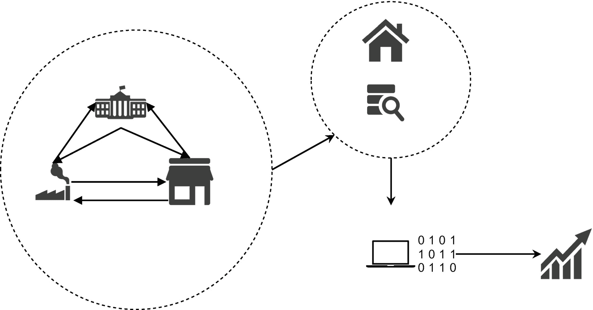

# 计量经济学导论

本章介绍应用于**计量经济学**领域的数据科学技术。首先，阐述经济学与定量方法之间的关系，这为计量经济学领域奠定了基础。同时，本章还讨论了计量经济学在制定和修订国家经济政策中的相关性。随后，简要介绍了机器学习、深度学习和结构方程模型。最后，揭示了如何使用标准 Python 库提取宏观经济数据的方法。

## 计量经济学

*计量经济学*是社会科学的一个分支，在宏观层面（即国家、地区或大洲层面）研究广泛的商业活动。它是一门成熟的社会科学学科，利用统计模型来验证关于宏观经济现象的理论主张。图 1-1 对计量经济学进行了简化说明。统计局等机构会捕捉不同时期的经济活动数据，并向公众开放。经济学家、研究分析师和统计学家等从业者会提取这些数据，并基于理论框架构建算法模型，以进行未来预测。

**图 1-1**

计量经济学

在继续阅读本书内容之前，请确保你已理解与经济学和统计学相关的基本概念。