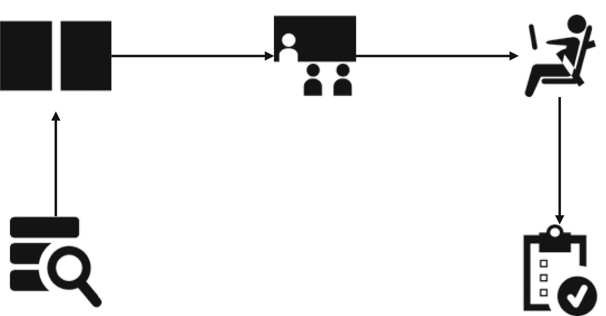
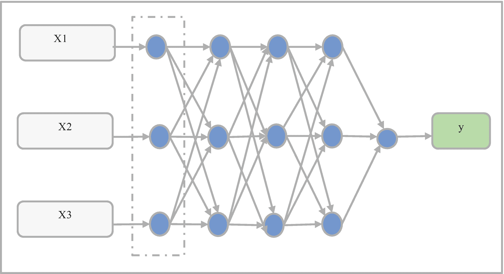
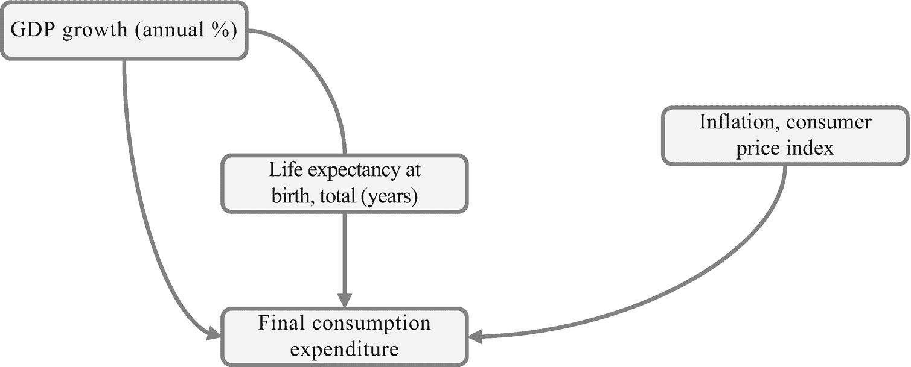
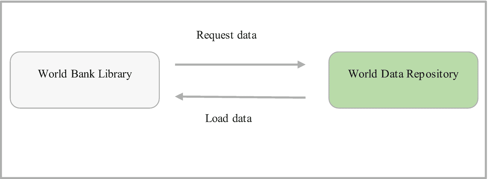

# 经济设计

经济设计基于这样一种理念：如果我们能够准确估计宏观经济现象，就可以设计出有助于管理经济的机制。如前所述，有多个成熟的机构可以提供可靠的实际宏观经济数据。请注意，我们无法估计整体人口，但可以使用样本（人口的代表），因为统计估计中存在误差。由于有可靠的宏观经济数据源池，我们可以应用这些数据，并通过应用定量模型来研究一致的模式，从而理解经济状况。当我们确信某个模型能够准确估计我们意图估计的目标且效果显著时，就可以应用该模型来预测经济事件。请记住，科学事业的主要目的是通过应用定量模型来预测事件并控制其底层机制。

计量经济学运用统计原理来估计总体参数，但最终的检验标准始终是经济意识形态。只有经济理论能够验证/反驳结果，这些结果可进一步用于确定因果关系/相关性等。显而易见，政治在现代生活中占据着至关重要的地位。政治情绪通常伴随着对经济及其应然状态的坚定信念。这些信念可能并不反映经济现实。当有关经济的信念荒谬不实时，就无法用设计的解决方案来应对紧迫的社会问题。要令人满意地解决经济问题，你必须持有合乎逻辑的观点；否则，情感、标准假设和权威知识会稀释你对经济的分析。

总之，政策制定者应用计量经济学来设计和修订经济政策，以便正确解决经济问题。这意味着他们需要研究历史经济事件，开发复杂的定量模型，并应用这些模型的研究结果（前提是这些结果可靠）来驱动经济政策。计量经济学是一种寻找经济相关问题答案的方法。以证据为导向的政策制定者通过应用实际数据来推动政策制定举措，而不是依赖政治和经济意识形态。

## 理解统计学

统计学是致力于在原始数据中发现一致模式，从而对已知现象得出逻辑结论的领域。它涉及研究数据的集中趋势（均值）和离散程度（标准差），然后应用定量模型研究关于该现象的理论主张。此外，商业机构将其应用于临时报告、研究和业务流程控制中。研究人员还将统计学应用于自然科学、物理科学、化学、工程学和社会科学等领域。它是定量研究的支柱。

### 机器学习建模

统计学与机器学习之间存在联系。在本书中，我们将机器学习视为统计学的延伸，它融合了计算机科学等领域的技术。机器学习方法源于统计原理和方法。我们以“应用”和“自动化”为导向来处理机器学习问题。通过机器学习，最终目标不是得出某种结论，而是自动化单调的任务，并为这些自主任务确定可复制的模式。图 1-2 展示了定量模型如何运作。



*图 1-2——基础机器学习模型*

图 1-2 展示了基本的机器学习模型流程。首先，我们从数据库中提取数据，然后进行预处理和分割。接着，通过应用一个接收预测变量并对其进行操作以生成输出值的函数来对数据进行建模。变量代表一个我们可以观察和估计的过程。在机器学习中，将模型部署为网页应用或网页应用的一部分是常见做法。

### 深度学习建模

深度学习应用模拟人类神经结构的人工神经网络（一种相互连接的节点网络）。人工神经网络是一组节点，它在输入层接收输入值，将输入值转换到后续的隐藏层（输入层和输出层之间的层），该隐藏层对它们进行转换并分配不同的*权重*（决定输入值对输出值影响程度的向量参数）和*偏置*（一个平衡值，通常为 1）。它是机器学习的一个子类，旨在解决我们在传统定量模型中遇到的一些困难。例如，梯度消失问题——在训练过程的初始阶段梯度很小，随着我们添加更多数据而增大的情况。还有其他类型的人工神经网络，例如受限玻尔兹曼机——一个位于隐藏层和输出层之间的浅层网络，多层感知器——具有两个以上隐藏层的神经网络，循环神经网络——用于处理序列数据的神经网络，以及卷积神经网络——用于降维的神经网络，常用于计算机视觉。本书涵盖了受限玻尔兹曼机和多层感知器。图 1-3 展示了一个多层感知器分类器。



*图 1-3——多层感知器分类器示例*

图 1-3 显示，多层感知器分类器由一个输入层组成，该层获取输入值（X1、X2 和 X3）并将它们传递到第一个隐藏层。该层随后获取这些值，并通过应用一个函数（在此例中为 Sigmoid 函数）对其进行转换。它传递一个输出值，该值随后被传递到第二个隐藏层，第二个隐藏层也获取输入值。该过程反复进行——它转换值并将它们传递到输出层，并生成一个输出值，在图 1-3 中表示为 `Y`。我们认识到网络用于学习数据结构训练过程，即反向传播（反向更新权重）。第 8 章将介绍深度学习。


好的，作为高级文档工程师和翻译员，我将遵循您提供的格式和注意事项，将给定的英文文本翻译成中文。


### 结构方程模型

结构方程模型包含一组用于确定变量间因果关系的模型。它包括因子分析、路径分析和回归分析。它有助于我们研究中介关系，从而检测其他变量的存在如何削弱或增强预测变量与响应变量之间结构性关系的本质。图 1-4 展示了一个假想框架，概述了直接和间接的结构关系。



**图 1-4** 基础结构方程模型

图 1-4 演示了一个假想框架，该框架展示了人均 GDP 增长（年增长率）、通货膨胀、消费者价格指数（百分比）和最终消费支出（以当前美元计）之间的结构关系。此外，它还突出了预期寿命对人均 GDP 增长与最终消费支出之间关系的中介效应。第 10 章介绍了结构方程模型。

## 宏观经济数据来源

有数个库可用于提取宏观经济数据。本书使用了其中较为突出的一个库，名为 `wbdata`。该库从世界银行数据库¹提取数据。或者，你也可以直接从世界银行网站提取数据。此外，还有其他宏观经济数据源可供使用，例如圣路易斯联邦储备银行（联邦储备经济数据）数据库²和国际货币基金组织数据库³等。

本书主要使用 `world-bank-data` 库，因为它提供了广泛的社会指标。在继续之前，请确保安装了 `world-bank-data` 库。这将使开发定量模型的过程大大简化，因为你无需编写大量代码。要在 Python 环境中安装该库，请使用 `pip install wbdata`。如果你使用的是 Anaconda 环境，请使用 `conda install wbdata`。在本书付印时，该库的版本为 v0.3.0。代码清单 1-1 展示了如何检索宏观经济数据。

```
import wbdata
country = ["USA"]
indicator = {"FI.RES.TOTL.CD":"gdp_growth"}
df = wbdata.get_dataframe(indicator, country=country, convert_date=True)
```

**代码清单 1-1** 从世界银行库加载数据

`wbdata` 提取数据并将其加载到一个 `pandas` 数据框中。图 1-5 展示了 `wbdata` 的工作流程。



**图 1-5** 世界银行库工作流程

从 `wbdata` 库提取数据需要指定国家/地区 ID。鉴于世界银行包含众多国家/地区，了解所有国家/地区的 ID 非常繁琐。查找国家/地区 ID 最便捷的方式是按名称搜索（见代码清单 1-2）。在本例中，我们输入了 `China`，它返回了包含其 ID 在内的中国各地区。

```
wbdata.search_countries("China")
id    name
----  --------------------
CHN   China
HKG   Hong Kong SAR, China
MAC   Macao SAR, China
TWN   Taiwan, China
```

**代码清单 1-2** 搜索国家/地区 ID

从 `wbdata` 库提取数据还需要指定经济指标的 ID。鉴于世界银行包含众多宏观经济指标，了解所有指标的 ID 非常繁琐。查找指标 ID 最便捷的方式是按名称搜索（见代码清单 1-3）。在本例中，我们输入了 `inflation`，它返回了所有包含“inflation”一词的指标及其 ID。

```
wbdata.search_indicators("inflation")
id                    name
--------------------  -------------------------------------------------
FP.CPI.TOTL.ZG        Inflation, consumer prices (annual %)
FP.FPI.TOTL.ZG        Inflation, food prices (annual %)
FP.WPI.TOTL.ZG        Inflation, wholesale prices (annual %)
NY.GDP.DEFL.87.ZG     Inflation, GDP deflator (annual %)
NY.GDP.DEFL.KD.ZG     Inflation, GDP deflator (annual %)
NY.GDP.DEFL.KD.ZG.AD  Inflation, GDP deflator: linked series (annual %)
```

**代码清单 1-3** 搜索宏观经济数据

`wbdata` 库包含多个数据源，例如世界发展指标、全球治理指标、国家以下层面营养不良数据库、国际债务统计和国际债务统计：DSSI 等。本书主要关注提供经济数据的数据源，也涵盖社会指标。代码清单 1-4 演示了如何使用 `wbdata.get_source()` 检索指标源（见表 1-1）。

**表 1-1** 世界银行数据源


|   | ID | 最后更新 | 名称 | 代码 | 描述 | 网址 | 数据可用性 | 元数据可用性 | 概念数 |
| --- | --- | --- | --- | --- | --- | --- | --- | --- | --- |
| 0 | 1 | 2019-10-23 | 营商环境 | DBS |   |   | 是 | 是 | 3 |
| 1 | 2 | 2021-05-25 | 世界发展指标 | WDI |   |   | 是 | 是 | 3 |
| 2 | 3 | 2020-09-28 | 全球治理指标 | WGI |   |   | 是 | 是 | 3 |
| 3 | 5 | 2016-03-21 | 国家以下营养不良数据库 | SNM |   |   | 是 | 是 | 3 |
| 4 | 6 | 2021-01-21 | 国际债务统计 | IDS |   |   | 是 | 是 | 4 |
| ... | ... | ... | ... | ... | ... | ... | ... | ... | ... |
| 60 | 80 | 2020-07-25 | 按性别分列的劳动力数据库 (GDLD) | GDL |   |   | 是 | 否 | 4 |
| 61 | 81 | 2021-01-21 | 国际债务统计：DSSI | DSI |   |   | 是 | 否 | 4 |
| 62 | 82 | 2021-03-24 | 全球公共采购 | GPP |   |   | 是 | 否 | 3 |
| 63 | 83 | 2021-04-01 | 统计绩效指标 (SPI) | SPI |   |   | 是 | 是 | 3 |
| 64 | 84 | 2021-05-11 | 教育政策 | EDP |   |   | 是 | 是 | 3 |

```
sources = wbdata.get_source()
sources
清单 1-4
检索世界银行数据源
```

表 1-1 列出了数据源 ID、名称、代码、可用性、元数据可用性、概念数和最后更新日期。清单 1-5 展示了如何检索主题（参见表 1-2）。每个主题都有其自己的 ID。

## 表 1-2 世界银行主题

|   | ID | 值 | 来源说明 |
| --- | --- | --- | --- |
| 0 | 1 | 农业与农村发展 | 对于世界上 70% 的贫困人口来说…… |
| 1 | 2 | 援助有效性 | 援助有效性是指援助在……方面产生的影响。 |
| 2 | 3 | 经济与增长 | 经济增长是经济发展的核心…… |
| 3 | 4 | 教育 | 教育是……最有力的工具之一。 |
| 4 | 5 | 能源与采矿 | 世界经济需要不断增加……的能源。 |
| 5 | 6 | 环境 | 自然和人为的环境资源……对可持续发展至关重要。 |
| 6 | 7 | 金融部门 | 一个经济体的金融市场对于……至关重要。 |
| 7 | 8 | 健康 | 改善健康是千年发展目标的核心…… |
| 8 | 9 | 基础设施 | 基础设施有助于决定……的成功。 |
| 9 | 10 | 社会保护与劳动力 | 一个经济体可用的劳动力供给决定了…… |
| 10 | 11 | 贫困 | 对于拥有积极贫困监测体系的国家来说…… |
| 11 | 12 | 私营部门 | 私营市场驱动经济增长，利用…… |
| 12 | 13 | 公共部门 | 有效的政府能够改善人民的生活水平…… |
| 13 | 14 | 科学与技术 | 通常由政府资助的技术创新…… |
| 14 | 15 | 社会发展 | 这里的数据涵盖童工、性别问题…… |
| 15 | 16 | 城市发展 | 城市可以非常高效。很容易…… |
| 16 | 17 | 性别 | 性别平等是……核心发展目标之一。 |
| 17 | 18 | 千年发展目标 |   |
| 18 | 19 | 气候变化 | 气候变化预计将严重影响发展中国家…… |
| 19 | 20 | 外债 | 债务统计提供了……详细图景。 |
| 20 | 21 | 贸易 | 贸易是抗击贫困和实现……的关键手段。 |

```
wbdata.get_topic()
清单 1-5
检索主题
```

表 1-2 列出了数据源 ID、主题值以及来源说明。`wbdata` 库涵盖了从健康、经济学、城市发展等领域的广泛主题，以及其他社会科学相关领域的主题。

## 本书的背景

本书的每一章都从介绍特定模型的基本概念开始。各章节展示了提取宏观经济数据进行探索的方法，包括确保数据结构适合所选模型并满足初步要求的技术。此外，这些章节还揭示了构建假设框架和可检验假设的可能方法。它们讨论了如何通过使用一个操作一组变量以生成输出值的定量模型来研究假设。

对于本书中的每个模型，都有评估它的方法。每章还包含可视化图表，可以帮助你更好地理解数据结构和结果。

## 实际应用意义

本书扩充了当前计量经济学方面的知识体系。它涵盖了应用数据科学技术发现宏观经济数据中的模式并提取有意义见解的各种方法。本书旨在加速基于证据的经济设计——基于我们从定量驱动模型中得出的证据来制定和修订经济政策。本书面向那些寻求通过应用数据科学和机器学习技术来解决一些世界最紧迫问题的专业人士。总之，它将使你能够发现特定社会和经济活动发生的*原因*，并帮助你预测未来活动发生的可能性。本书假设你对统计学和经济学的关键概念有一些基本的理解。

脚注 1   2   3


