# 2. 应用回归的单变量消费研究

本章介绍标准单变量（或简单）线性回归模型，即普通最小二乘模型，该模型在减小残差的同时估计截距和斜率（见公式 2-1）。它应用该模型来确定美国银行贷款利率与美国家庭每年消费的商品和服务市场价值之间的关系。本章内容包括进行协方差分析、相关性分析、模型开发、交叉验证、超参数优化以及模型性能分析的方法。

普通最小二乘模型是最常见的参数化方法之一。它对数据建立了强有力的假设——即期望数据满足*正态性*（变量值围绕均值分布）和*线性*（自变量与因变量之间存在关联）。本章使用最常见的参数化方法，即*普通最小二乘模型*，来研究预测变量（自变量）与响应变量（因变量）之间的关联。该方法基于一条直线方程（见图 2-1）。

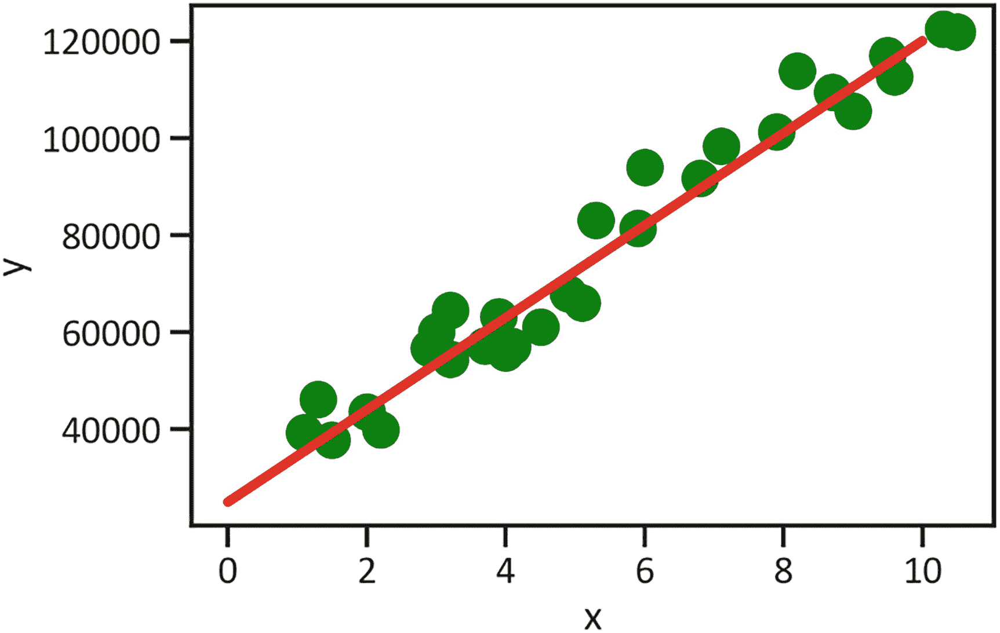

**图 2-1**  
最佳拟合线

图 2-1 显示了一条红色直线和独立的绿色数据点——该直线穿过这些数据点。公式 2-1 展示了普通最小二乘方程。

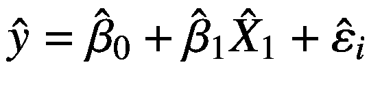

**（公式 2-1）**

其中， 是预测的响应变量（本例中为预期的美国最终消费支出），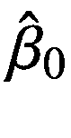 代表截距——表示响应变量的均值（本例中为以美元计价的美国最终消费支出），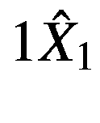 代表预测变量（本例中为美国贷款利率），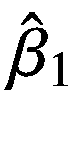 是斜率——表示 `X`（美国贷款利率）与最终消费支出（现价美元）之间关系的方向。观察图 2-1 中的红色直线——斜率为正）。最后，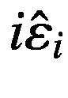 代表误差项（参考公式 2-2）。

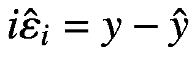

**（公式 2-2）**

其中 `ε[i]` 是误差项（也称为*残差项*）——代表 `yi`（实际的美国最终消费支出）与 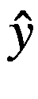`[i]`（预测的美国最终消费支出）之间的差值。

带帽号（^）的变量（样本回归函数）与不带帽号的变量（总体回归函数）之间存在区别。我们是从总体样本中估计那些带帽号的变量，而不是从整个总体中估计。

## 本章背景

本章使用普通最小二乘回归模型来确定预测变量（美国贷款利率，以百分比表示）与响应变量（最终消费支出，以现价美元计）之间的线性关系。表 2-1 概述了本章使用的宏观经济指标。

**表 2-1**  
本章使用的美国宏观经济指标

| 代码 | 标题 |
| --- | --- |
| `FR.INR.LEND` | 贷款利率（以百分比表示） |
| `NY.GDP.MKTP.KD.ZG` | 最终消费支出（以现价美元计） |

## 理论框架

图 2-2 展示了本章探讨的关系。它建立了研究假设。


**图 2-2**  
理论框架

**假设**

`H[0]`：美国贷款利率（%）与最终消费支出（现价美元）之间无显著差异。

`H[A]`：美国社会缴款与最终消费支出（现价美元）之间存在显著差异。

该研究假设旨在确定美国贷款利率的变化是否会影响最终消费支出（现价美元）。

### 贷款利率

贷款利率估计了私营银行对短期和中期贷款收取的利息率。我们以年百分比表示该估计值。图 2-3 展示了从 1960 年到 2020 年美国私营银行对短期和中期融资收取的利率。在继续之前，请确保您的环境中已安装 Matplotlib 库。要在 Python 环境中安装 Matplotlib 库，请使用 `pip install matplotlib`。同样，要在 Conda 环境中安装该库，请使用 `conda install -c conda-forge matplotlib`。见列表 2-1。

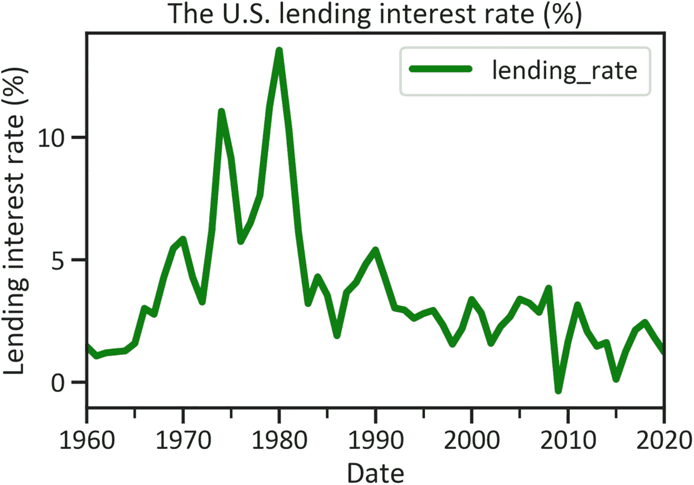

**图 2-3**  
美国贷款利率

```
import wbdata
from matplotlib.pyplot import
%matplotlib inline
country  = ["USA"]
indicator = {"FP.CPI.TOTL.ZG":"lending_rate"}
inflation_cpi = wbdata.get_dataframe(indicator, country=country,  convert_date=True)
inflation_cpi.plot(kind="line",color="green",lw=4)
plt.title("The U.S. lending interest rate (%)")
plt.ylabel("Lending interest rate (%)")
plt.xlabel("Date")
plt.legend(loc="best")
plt.show()
列表 2-1
美国贷款利率
```

图 2-3 显示，从 1960 年到 1980 年，美国银行对私营短期和中期贷款收取的利率从 1.45% 增长到 13.55%（最高峰值）。此后，在 1980 年代初，利率急剧下降，然后保持停滞。该图还显示贷款利率在 2008 年达到最低点。总之，在 1970 年代末从美国银行获得债务的成本更高，而在 2008 年则相对便宜。


### 最终消费支出（现价美元）

最终消费支出是指经济体中家庭购买的普通商品和服务的市场价值（参见列表 2-2）。图 2-4 展示了 1960 年至 2020 年美国最终消费支出的变化情况。

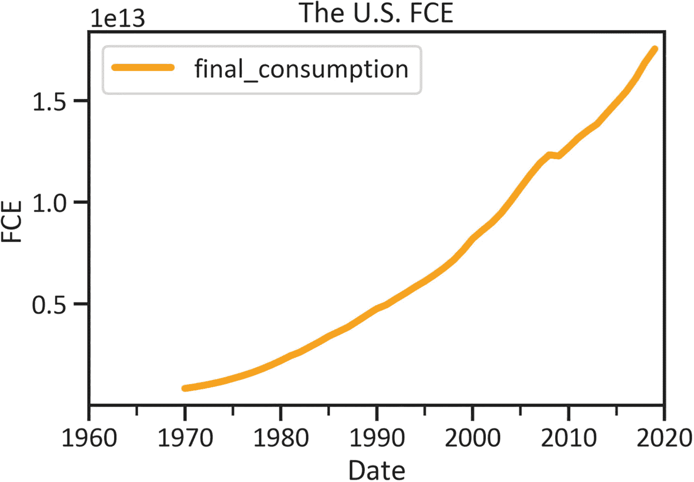

图 2-4  
美国最终消费支出

```
country = ["USA"]
indicator = {"NE.CON.TOTL.CD":"final_consumption"}
final_consumption = wbdata.get_dataframe(indicator, country=country, convert_date=True)
final_consumption.plot(kind="line",color="orange",lw=4)
plt.title("The U.S. FCE")
plt.ylabel("FCE")
plt.xlabel("Date")
plt.legend(loc="best")
plt.show()
```
列表 2-2  
美国最终消费支出（现价美元）

图 2-4 显示，自 1970 年以来，美国家庭购买的普通商品和服务的市场价值呈现持续上升趋势。

## 正态性假设

正态分布也称为高斯分布。本书将互换使用这两个术语。该分布显示数据点围绕均值数据点聚集。普通最小二乘回归模型假设数据点围绕均值数据点聚集，因此在对美国贷款利率和最终消费支出数据训练模型之前，必须检测正态性。

### 正态性检测

正态性检测涉及研究数据点的集中趋势。如果美国贷款利率和最终消费支出数据围绕均值数据点聚集，则可以使用中心数据点来概括数据。另一个隐含的假设是误差服从正态性假设，这使得误差更容易处理。为了检测正态性，必须估计均值数据点（参见方程 2-3）。

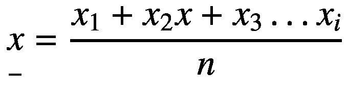

（方程 2-3）

其中 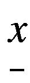 是均值，`x[1]` 是第一个数据点，`x[2]` 是第二个数据点，依此类推，`n` 表示数据点的总数。将数据点的计数除以自由度。或者，可以找到中位数数据点（中心数据点）。要确定离散程度，请估计标准差（参见方程 2-4）。

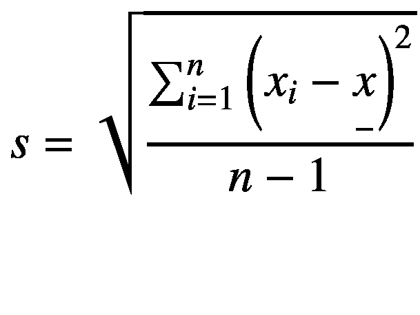

（方程 2-4）

在估计标准差后，将其平方以求得方差（参见方程 2-5）。

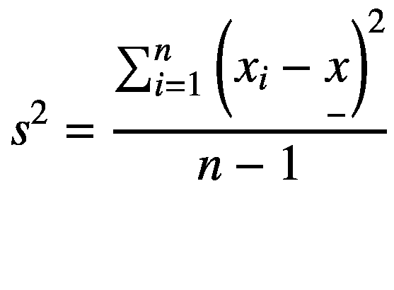

（方程 2-5）

列表 2-3 从世界银行检索了与美国贷款利率和最终消费支出数据相关的数据。参见表 2-2。

表 2-2  
美国贷款利率与最终消费支出数据

| 日期 | 贷款利率 | 最终消费支出 |
| --- | --- | --- |
| 2020 | 3.544167 | NaN |
| 2019 | 5.282500 | 1.753966e+13 |
| 2018 | 4.904167 | 1.688457e+13 |
| 2017 | 4.096667 | 1.608306e+13 |
| 2016 | 3.511667 | 1.543082e+13 |

```
country  = ["USA"]
indicators = {"FR.INR.LEND":"lending_rate",
"NE.CON.TOTL.CD":"final_consumption"}
df = wbdata.get_dataframe(indicators, country=country, freq="M", convert_date=False)
df.head()
```
列表 2-3  
加载美国贷款利率与最终消费支出数据

表 2-2 显示数据中存在缺失的数据点。列表 2-4 用均值替换了缺失的数据点。

```
df["lending_rate"] = df["lending_rate"].fillna(df["lending_rate"].mean())
df["final_consumption"] = df["final_consumption"].fillna(df["final_consumption"].mean())
```
列表 2-4  
用均值替换缺失数据点


## 描述性统计

有多种方法可以对数据分布进行可视化和汇总。最简单的方法是使用箱线图。箱线图还有助于检测正态性。该图可确认中位数数据点的位置，同时还能告知你分布尾部的长度，从而有效帮助你诊断数据中的异常值。图 2-5 展示了由代码清单 2-5 生成的美国贷款利率箱线图。

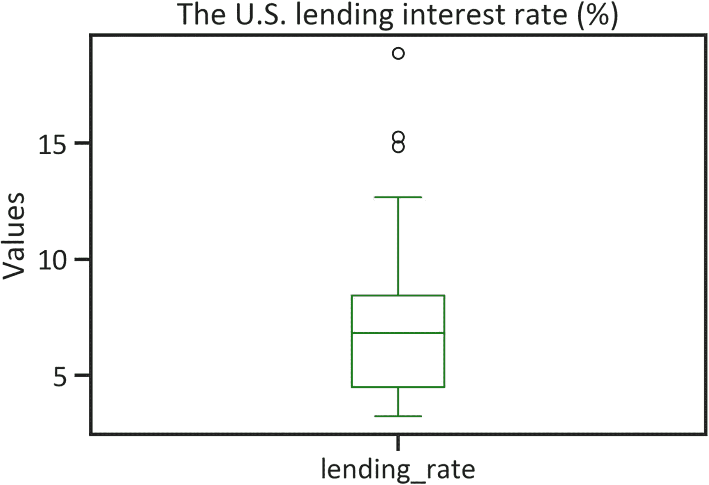

图 2-5

美国贷款利率

```
df["lending_rate"].plot(kind="box",color="green")
plt.title("The U.S. lending interest rate (%)")
plt.ylabel("Values")
plt.show()
Listing 2-5
The U.S. Lending Interest Rate Distribution
```

图 2-5 显示美国贷款利率数据中存在三个极端值。代码清单 2-6 将所有异常值替换为均值数据点，并确定新的分布（见图 2-6）。继续之前，请确保你的环境中已安装 NumPy 库。要在 Python 环境中安装 NumPy 库，请使用 `pip install numpy`。同样，要在 Conda 环境中安装该库，请使用 `conda install -c anaconda numpy`。

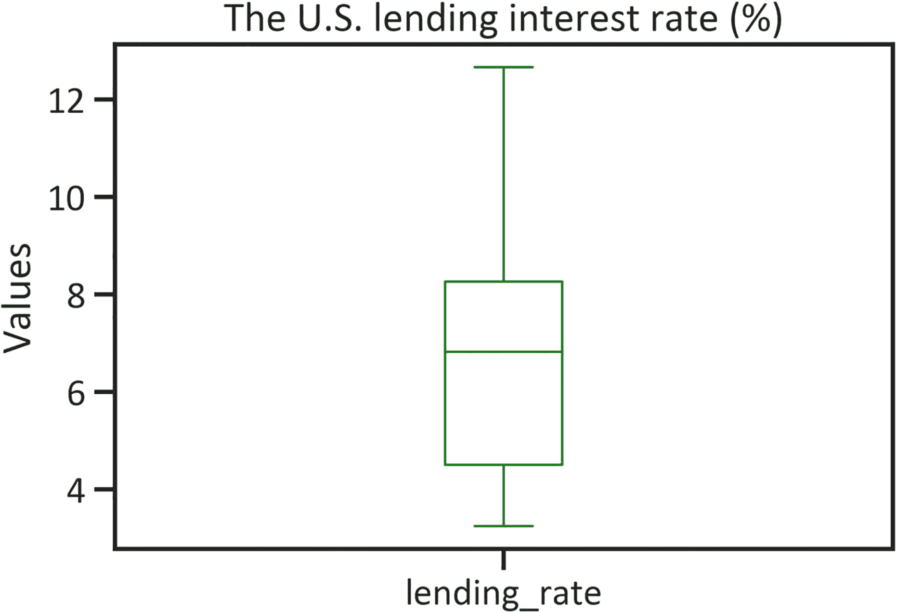

图 2-6

美国贷款利率分布

```
import numpy as np
df['lending_rate'] = np.where((df["lending_rate"] > 14.5),df["lending_rate"].mean(),df["lending_rate"])
df["lending_rate"].plot(kind="box",color="green")
plt.title("The U.S. lending interest rate (%)")
plt.ylabel("Values")
plt.show()
plt.show()
Listing 2-6
The U.S. Lending Interest Rate Distribution
```

代码清单 2-7 返回图 2-7，该图显示了美国最终消费支出数据的分布和异常值。

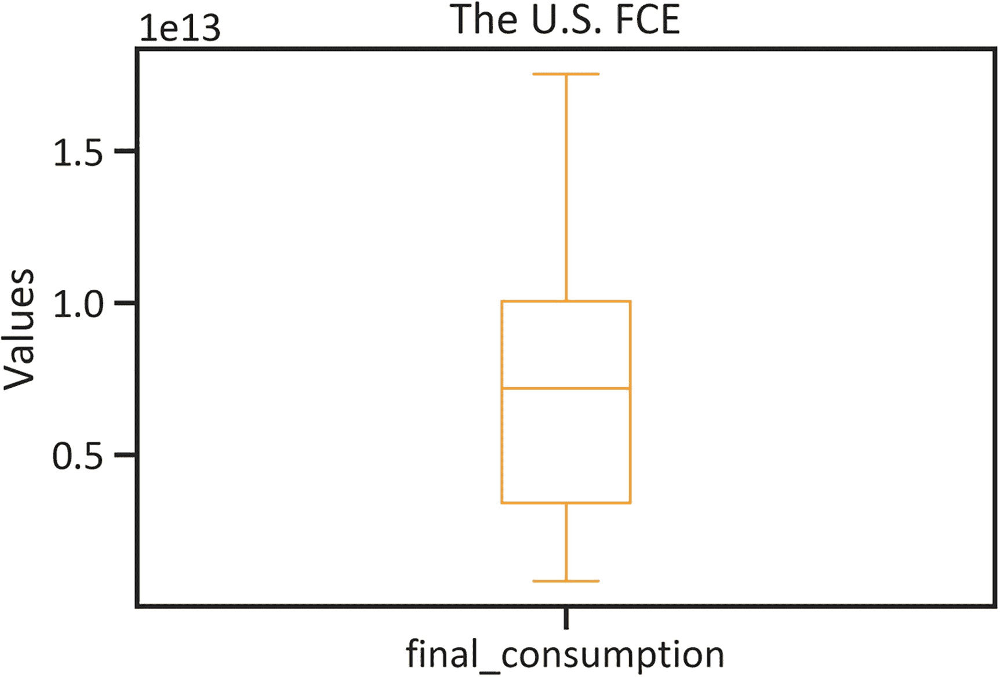

图 2-7

美国最终消费支出分布

```
df["final_consumption"].plot(kind="box",color="orange")
plt.title("US FCE")
plt.ylabel("Values")
plt.show()
Listing 2-7
The U.S. Final Consumption Expenditure Distribution
```

图 2-7 显示美国最终消费支出数据中不存在异常值。代码清单 2-8 中的命令检索了一份关于数据中心趋势和离散程度的综合报告（见表 2-3）。

表 2-3

描述性统计摘要

|   | **lending_rate** | **final_consumption** |
| --- | --- | --- |
| Count | 61.000000 | 6.100000e+01 |
| Mean | 6.639908 | 7.173358e+12 |
| Std | 2.436502 | 4.580756e+12 |
| Min | 3.250000 | 8.395100e+11 |
| 25% | 4.500000 | 3.403470e+12 |
| 50% | 6.824167 | 7.173358e+12 |
| 75% | 8.270833 | 1.006535e+13 |
| Max | 12.665833 | 1.753966e+13 |

```
df.describe()
Listing 2-8
Descriptive Summary
```

表 2-3 显示：

* 美国贷款利率数据的平均值是 6.639908，最终消费支出的平均值是 7.173358e+12。
* 美国贷款利率数据点与平均值的偏差为 2.436502，最终消费支出数据点与平均值的偏差为 4.580756e+12。

## 协方差分析

*协方差分析* 涉及估计变量之间相互变化的程度。公式 2-6 展示了协方差的公式。

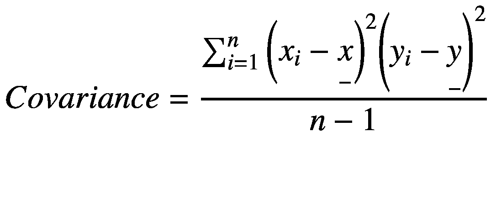

（公式 2-6）

其中 `x[i]` 表示贷款利率（%）的独立数据点，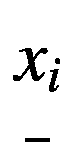 表示预测变量的平均值。`y[i]` 表示美国最终消费支出的独立数据点，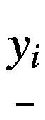 表示美国最终消费支出的平均值。代码清单 2-9 估算了美国贷款利率与最终消费支出之间的联合变异性（见表 2-4）。

表 2-4

协方差矩阵

|   | lending_rate | final_consumption |
| --- | --- | --- |
| `lending_rate` | 5.936544e+00 | -7.092189e+12 |
| `final_consumption` | -7.092189e+12 | 2.098332e+25 |

```
dfcov = df.cov()
dfcov
Listing 2-9
Covariance Matrix
```

表 2-4 显示美国贷款利率的方差是 5.936544e+00，最终消费支出的方差是 2.098332e+25。该表向你展示了贷款利率与美国最终消费支出之间的联合变异性为 -7.092189e+12。下一节将概述相关方法，并解释针对此问题应使用哪种相关方法。


## 相关性分析

与协方差分析展示变量如何相互变化不同，*相关性分析*用于估计变量之间的依赖关系。主要有三种相关性方法——皮尔逊相关方法（可估计连续变量之间的依赖关系）、肯德尔方法（可估计分类变量之间的依赖关系）以及斯皮尔曼方法（同样可估计分类变量之间的关联关系）。宏观经济数据通常是连续的，因此本章使用皮尔逊相关方法。本书大部分章节都使用此方法，但第 5 章除外，该章使用了肯德尔方法。公式 2-7 用于估计协方差，然后将该估计值除以预测变量和响应变量的离散程度，从而得到皮尔逊相关系数。

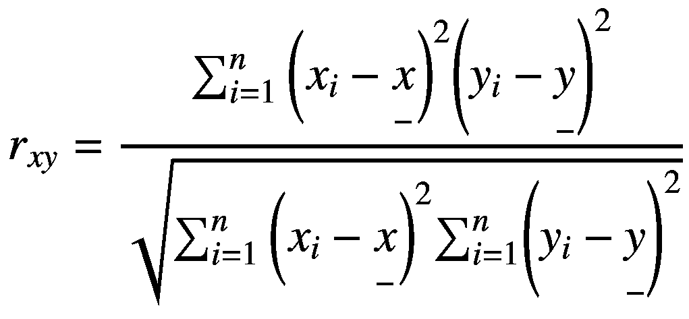

(公式 2-7)

其中 `r[xy]` 是皮尔逊相关系数。你可以通过将美国贷款利率与美国最终消费支出之间的协方差除以偏差平方和的平方根来估计该系数。代码清单 2-10 展示了皮尔逊相关矩阵（参见表 2-5）。

**表 2-5**  
**皮尔逊相关矩阵**

| | lending_rate | final_consumption |
| --- | --- | --- |
| `lending_rate` | 1.000000 | -0.635443 |
| `final_consumption` | -0.635443 | 1.000000 |

```
dfcorr = df.corr(method="pearson")
dfcorr
代码清单 2-10
皮尔逊相关矩阵
```

表 2-6 解释了表 2-5 中列出的皮尔逊相关系数。

**表 2-6**  
**皮尔逊相关系数解释**

| 关系 | 皮尔逊相关系数 | 发现 |
| --- | --- | --- |
| 美国贷款利率（%）与最终消费支出（现价美元） | -0.635443 | 美国贷款利率（%）与最终消费支出（现价美元）之间存在极强的负相关关系。 |

图 2-8 展示了美国贷款利率与最终消费支出之间的统计差异。在继续操作之前，请确保你的环境中已安装 `seaborn` 库。要在 Python 环境中安装 `seaborn` 库，请使用 `pip install seaborn`。同样，要在 Conda 环境中安装该库，请使用 `conda install -c anaconda seaborn`。参见代码清单 2-11。

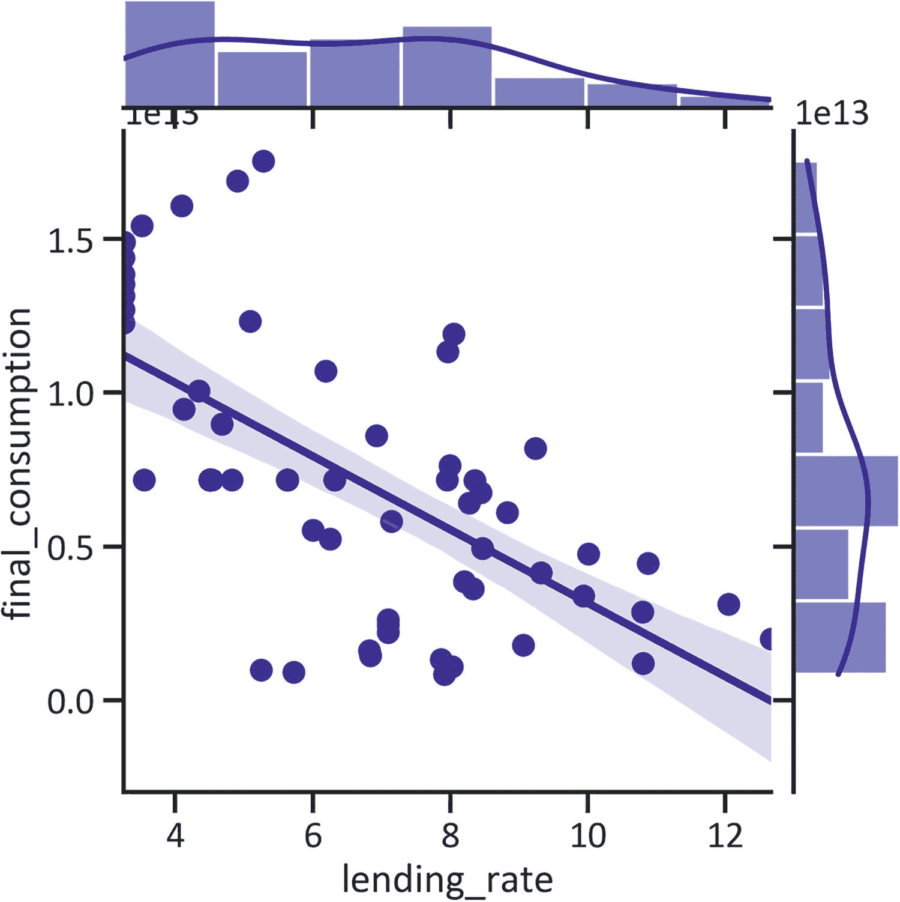

**图 2-8**  
美国贷款利率与美国最终消费支出联合图

```
import seaborn as sns
sns.jointplot(x = "lending_rate", y="final_consumption", data=df, kind="reg",color="navy")
plt.show()
代码清单 2-11
成对散点图
```

图 2-8 证实了美国贷款利率与最终消费支出之间存在负相关关系。

## 使用 Statsmodels 开发普通最小二乘回归模型

本节介绍最常用的回归模型，称为普通最小二乘模型，该模型用于估计截距和系数，同时减少残差（请回顾公式 2-1）。

代码清单 2-12 将数据转换为所需格式。首先构造一个 `x` 数组（美国贷款利率的数据点）和一个 `y` 数组（美国最终消费支出（现价美元）的数据点）。

然后对数据进行重塑，以便普通最小二乘回归模型能更好地学习数据，接着通过应用 `train_test_split()` 方法将数据分割为训练数据和测试数据。最后，它通过应用 `StandardScaler()` 方法对数据进行标准化处理，使得数据点的均值为 0，标准差为 1。

为了验证美国贷款利率影响美国最终消费支出的论断，你需要计算 p 值以确定该关系的显著性。此外，你还需要确定普通最小二乘模型在估计最终消费支出的未来值时损失了多少信息。为了进一步评估所选模型的性能，你必须估计 R² 分数。

表 2-7 概述了用于检验美国贷款利率与美国最终消费支出之间关系显著性的估计器类型。它还展示了模型如何学习可用的美国宏观经济数据，以及如何生成美国最终消费支出的未来实例，包括在估计这些实例时产生的误差。此外，它还详细说明了模型在多大程度上解释了美国贷款利率的变化如何影响美国最终消费支出的变化。总之，它有助于你决定是否必须接受所建立宏观经济现象的存在，以及你可以在多大程度上依赖该模型来估计未来实例。

**表 2-7**  
**普通最小二乘回归模型结果**

| 因变量 | y | R-squared | 0.443 |
| --- | --- | --- | --- |
| 模型 | OLS | 调整后 R-squared | 0.431 |
| 方法 | 最小二乘法 | F-统计量 | 36.64 |
| 日期 | 2021 年 8 月 4 日，周三 | Prob (F-统计量) | 2.41e-07 |
| 时间 | 11:06:05 | 对数似然 | -1454.2 |
| 观测数 | 48 | AIC | 2912. |
| 残差自由度 | 46 | BIC | 2916. |
| 模型自由度 | 1 | | |
| 协方差类型: | nonrobust | | |

| | coef | std err | t | P>&#124;t&#124; | [0.025 | 0.975] |
| --- | --- | --- | --- | --- | --- | --- |
| const | 7.427e+12 | 5.12e+11 | 14.496 | 0.000 | 6.4e+12 | 8.46e+12 |
| x1 | -3.102e+12 | 5.12e+11 | -6.053 | 0.000 | -4.13e+12 | -2.07e+12 |

| Omnibus: | 1.135 | Durbin-Watson: | 1.754 |
| --- | --- | --- | --- |
| Prob(Omnibus): | 0.567 | Jarque-Bera (JB): | 1.111 |
| Skew: | 0.236 | Prob(JB): | 0.574 |
| Kurtosis: | 2.424 | Cond. No. | 1.00 |

```
import statsmodels.api as sm
from sklearn.model_selection import train_test_split
from sklearn.preprocessing import StandardScaler
x = np.array(df["lending_rate"])
y = np.array(df["final_consumption"])
x = x.reshape(-1,1)
y = y.reshape(-1,1)
x_train, x_test, y_train, y_test = train_test_split(x,y,test_size=0.2,shuffle=False)
scaler = StandardScaler()
x_train = scaler.fit_transform(x_train)
x_test = scaler.transform(x_test)
x_constant = sm.add_constant(x_train)
x_test = sm.add_constant(x_test)
model = sm.OLS(y_train,x_constant).fit()
model.summary()
代码清单 2-12
使用 Statsmodels 开发普通最小二乘回归模型
```


表 2-7 显示，普通最小二乘回归模型解释了数据中 53.2% 的变异性（`R²` 得分为 0.443）。利用该表中的发现，公式 2-8 展示了美国贷款利率的变化如何影响美国最终消费支出的变化。

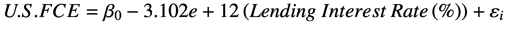
（公式 2-8）

公式 2-8 表明，美国贷款利率每变化一个单位，最终消费支出就会减少`3.102e+12`。此外，表 2-7 还显示，当美国贷款利率保持不变时，预测的美国最终消费支出均值为 `7.427e+12`。最后，该表告诉您，该模型解释了数据中约 36% 的变异性——它难以准确预测未来美国最终消费支出的情况。

### 使用 Scikit-Learn 开发普通最小二乘回归模型

上一节介绍了一种使用 `statsmodels` 库开发和评估普通最小二乘模型的方法。研究结果表明，所表达的宏观经济现象确实存在。鉴于在测试中表现不佳，您不能完全依赖该模型来预测未来美国最终消费支出的情况。

本节研究相同的现象，但使用不同的机器学习库来开发和评估模型。它使用了一个名为 `scikit-learn` 的流行开源库。开发该模型的方式与上一节类似。这种方法相对于 `statsmodels` 具有竞争优势，因为它提供了一种更简单的方法来控制模型的行为并验证其性能。此外，它拥有广泛的回归模型，例如 Ridge、Lasso 和 ElasticNet 等。本章不涉及这些模型。您目前需要知道的是，这些模型通过引入一项对模型在测试中产生的错误进行惩罚的项，从而扩展了普通最小二乘模型。`statsmodels` 和 `sklearn` 之间的主要区别在于，`statsmodels` 更擅长假设检验，而 `sklearn` 更擅长预测，并且不返回 t 统计量。请参见代码清单 2-13。

```
x = np.array(df["lending_rate"])
y = np.array(df["final_consumption"])
x = x.reshape(-1,1)
y = y.reshape(-1,1)
x_train, x_test, y_train, y_test = train_test_split(x,y,test_size=0.2, random_state=0)
scaler = StandardScaler()
x_train = scaler.fit_transform(x_train)
x_test = scaler.transform(x_test)
from sklearn.linear_model import LinearRegression
lm = LinearRegression()
lm.fit(x_train,y_train)
```

*代码清单 2-13：应用 Scikit-Learn 开发普通最小二乘回归模型*

### 交叉验证

代码清单 2-14 应用 `cross_val_score()` 方法，在相同数据的不同子集上验证默认普通最小二乘回归模型的性能。它使用 `R²` 来计算得分，因为 `sklearn` 不计算调整后的 `R²`。然后估算验证得分的均值和标准差。

```
from sklearn.model_selection import cross_val_score
def get_val_score(scores):
lm_scores = cross_val_score(scores, x_train, y_train, scoring="r2")
print("CV mean: ", np.mean(scores))
print("CV std: ", np.std(scores))
get_val_score(lm)
CV mean:  0.2424291076433461
CV std:  0.11822093588298
```

*代码清单 2-14：普通最小二乘回归模型交叉验证*

结果显示，交叉验证得分的均值数据点为 0.2424，交叉验证得分的独立数据点偏离均值数据点的幅度为 0.1182。代码清单 2-15 显示了数据中分界点的起始位置，以便您可以创建一个数据框，其中包含实际数据点、预测数据点以及日期索引。

```
y_test.shape
(13, 1)
```

*代码清单 2-15：查找数据中分界点的起始位置*

### 预测

代码清单 2-16 将美国最终消费支出的实际数据点和预测数据点并列制表（参见表 2-8）。

**表 2-8：实际与预测的美国最终消费支出**

| 日期 | 实际 FCE | 预测 FCE |
| --- | --- | --- |
| 2020-01-01 | 5.829066e+12 | 6.511152e+12 |
| 2019-01-01 | 3.403470e+12 | 3.385294e+12 |
| 2018-01-01 | 7.173358e+12 | 9.102986e+12 |
| 2017-01-01 | 5.245942e+12 | 7.502778e+12 |
| 2016-01-01 | 1.227281e+13 | 1.085977e+13 |
| 2015-01-01 | 1.688457e+13 | 9.009788e+12 |
| 2014-01-01 | 3.624267e+12 | 5.175626e+12 |
| 2013-01-01 | 7.173358e+12 | 9.461798e+12 |
| 2012-01-01 | 2.204317e+12 | 6.560470e+12 |
| 2011-01-01 | 7.144856e+12 | 5.151394e+12 |
| 2010-01-01 | 1.543082e+13 | 1.056713e+13 |
| 2009-01-01 | 1.269598e+13 | 1.085977e+13 |
| 2008-01-01 | 4.757180e+12 | 3.300484e+12 |

```
actual_values = pd.DataFrame(y_test)
actual_values.columns = ["Actual FCE"]
predicted_values  = pd.DataFrame(lm.predict(x_test))
predicted_values.columns = ["Predicted FCE"]
actual_and_predicted_values = pd.concat([actual_values,predicted_values],axis=1)
actual_and_predicted_values.index = pd.to_datetime(df[:13].index)
actual_and_predicted_values
```

*代码清单 2-16：实际与预测的美国最终消费支出*

要绘制表 2-8 中的数据点，请使用代码清单 2-17（参见图 2-9）。

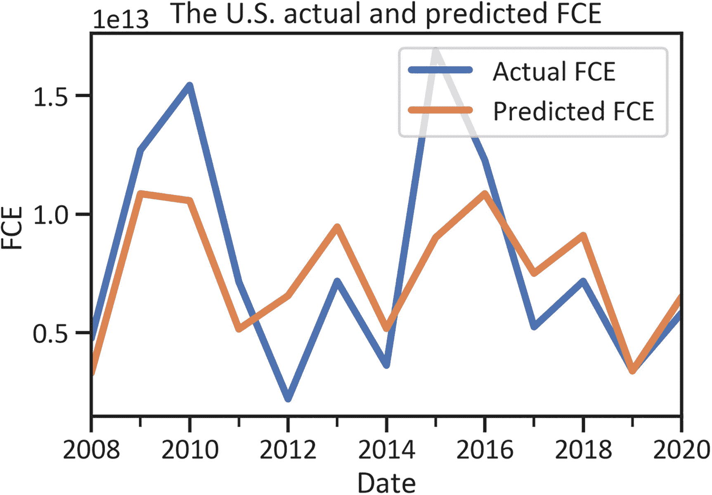
*图 2-9：实际与预测的美国最终消费支出*

```
actual_and_predicted_values.plot(lw=4)
plt.xlabel("Date")
plt.title("The U.S. actual and predicted FCE")
plt.ylabel("FCE")
plt.legend(loc="best")
plt.show()
```

*代码清单 2-17：实际与预测的美国最终消费支出*

图 2-9 展示了美国最终消费支出的实际数据点和预测数据点。它显示了预测数据点如何偏离实际数据点。


好的，作为一名高级文档工程师和翻译员，我将遵循您提供的注意事项和示例，将给定的英文文本翻译成中文。


## 估计截距和系数

清单 2-18 返回了系数的估计值（美国贷款利率每变化一个单位，美国最终消费支出预测值的变化量）。请注意，该定义仅适用于线性模型。公式 2-9 表达了本章的回归方程。

```
lm.intercept_
array([6.95280973e+12])
清单 2-18
估计截距
```

当美国贷款利率保持不变时，美国最终消费支出的预测均值是 `7.56456705e+12`。清单 2-19 估计了该系数。

```
lm.coef_
array([[-2.71748602e+12]])
清单 2-19
估计系数
```

公式 2-9 表达了本章的回归方程。

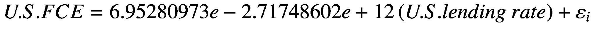

（公式 2-9）

公式 2-9 强调，美国贷款利率每变化一个单位，美国最终消费支出就减少 `2.71748602e+122`。

图 2-10 绘制了输入到普通最小二乘回归模型中的数据。

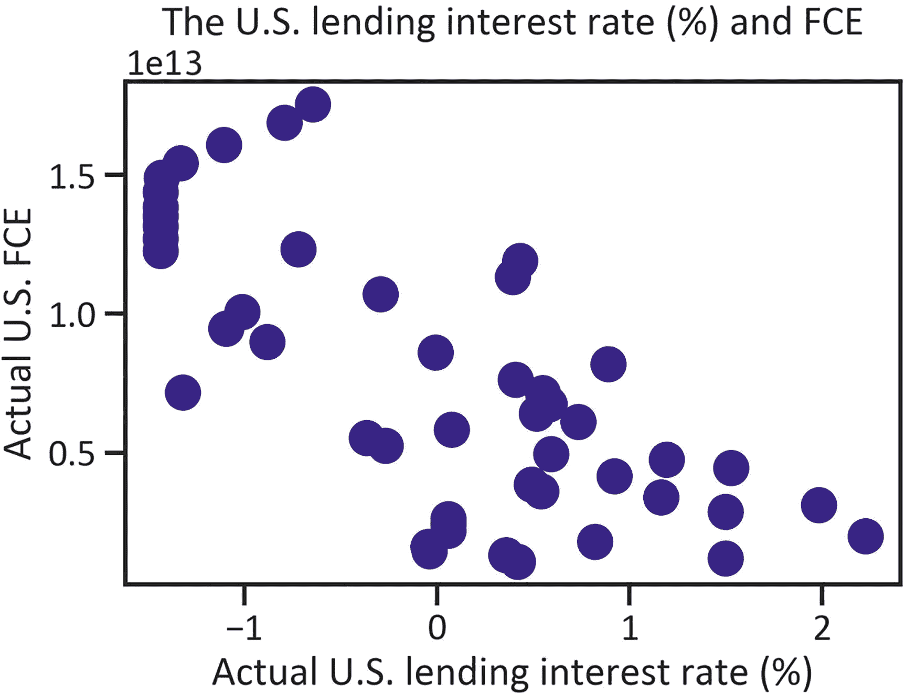

图 2-10

美国贷款利率与最终消费支出

```
plt.scatter(x_train,y_train,color="navy",s=200)
plt.title("美国贷款利率 (%) 与最终消费支出")
plt.ylabel("实际美国最终消费支出")
plt.xlabel("实际美国贷款利率 (%)")
plt.show()
清单 2-20
美国贷款利率与最终消费支出
```

图 2-10 绘制了美国贷款利率 (%) 的实际数据点和最终消费支出的预测数据点。

```
plt.scatter(x_test,predicted_values,color="navy",s=200)
plt.plot(x_test,predicted_values,color="red",lw=4)
plt.title("美国最终消费支出预测")
plt.xlabel("实际美国贷款利率 (%)")
plt.ylabel("预测的美国最终消费支出")
plt.show()
清单 2-21
美国最终消费支出预测
```

图 2-11 显示，通过构建，美国贷款利率的实际数据点和最终消费支出的预测数据点呈完美的线性关系。

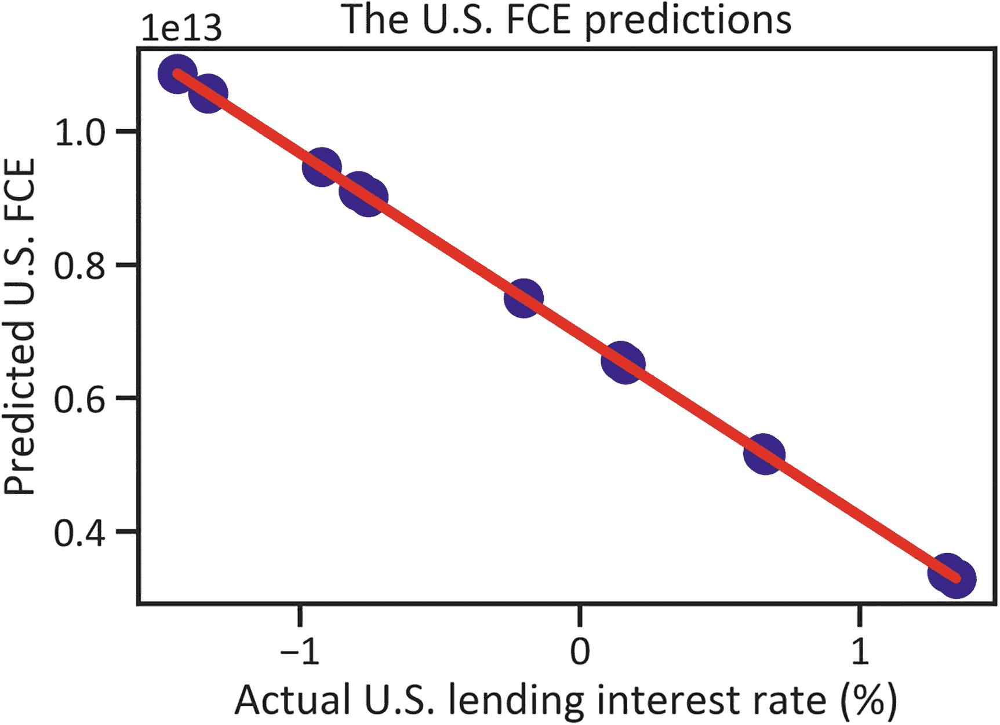

图 2-11

美国最终消费支出预测

### 残差分析

*残差*表示线性回归方法估计的数据点与实际数据点之间差异的估计值。公式 2-10 定义了残差。

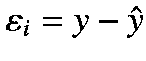

（公式 2-10）

普通最小二乘回归模型带有正态性假设。

```
plt.scatter(y_test,predicted_values,color="navy",s=200)
plt.title("美国实际与预测的最终消费支出")
plt.xlabel("实际美国最终消费支出")
plt.ylabel("预测的美国最终消费支出")
plt.show()
清单 2-22
美国最终消费支出的实际值与预测值
```

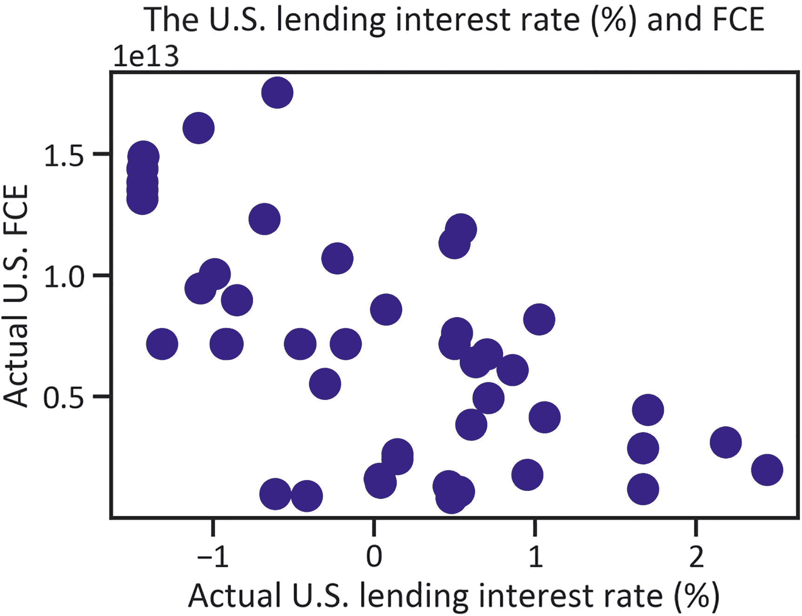

图 2-12

美国最终消费支出的实际值与预测值

图 2-12 显示，美国最终消费支出的实际数据点和预测数据点是随机分布的。图 2-13 显示了残差的集中趋势和离散程度。

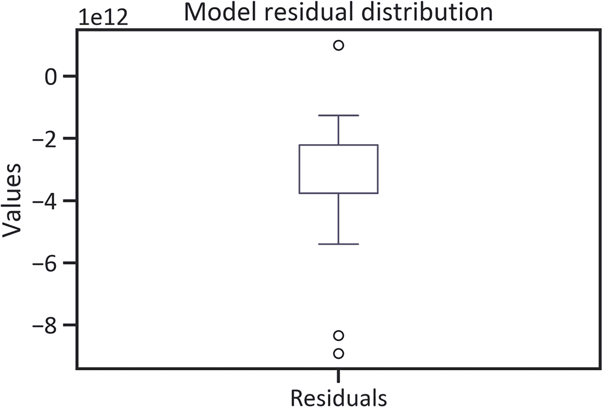

图 2-13

普通最小二乘回归模型残差分布

```
residuals = y_test - predicted_values
residuals = pd.DataFrame(residuals)
residuals.columns = ["残差"]
residuals.plot(kind="box",color="navy")
plt.title("模型残差分布")
plt.ylabel("值")
plt.show()
清单 2-23
普通最小二乘回归模型残差分布
```

图 2-13 显示均值数据点远非 0。这表明普通最小二乘回归模型不满足该假设。图 2-14 显示了序列相关性。其 x 轴为*滞后*数（当前时间的残差与自身回溯多远相关），y 轴为自相关。带有蓝色圆点的直线是自相关系数。如果有任何自相关系数超出了统计控制范围（蓝色区域），则该模型不满足回归假设。

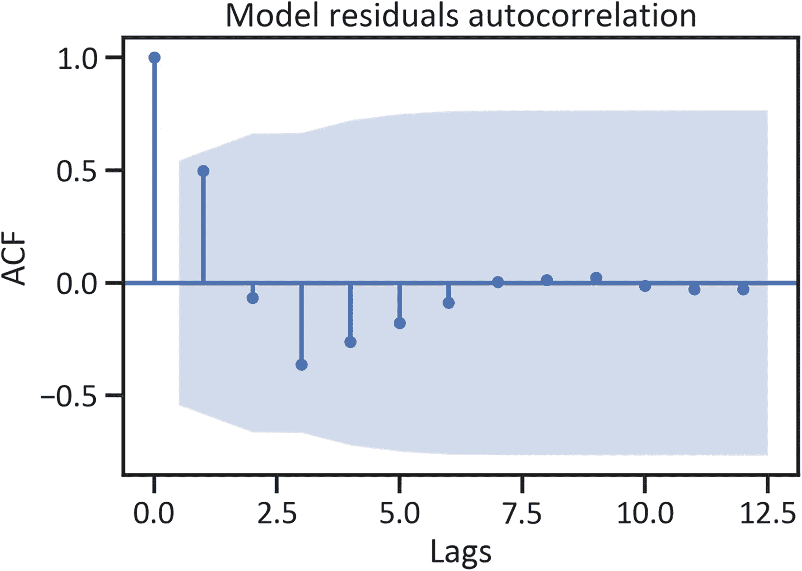

图 2-14

普通最小二乘回归模型残差自相关

```
from statsmodels.graphics.tsaplots import plot_acf
plot_acf(residuals)
plt.title("模型残差自相关")
plt.xlabel("滞后数")
plt.ylabel("自相关函数")
plt.show()
清单 2-24
普通最小二乘回归模型残差自相关
```

图 2-14 表明，在滞后之后，没有自相关系数超出蓝色区域（置信区间）。

### 其他普通最小二乘回归模型性能指标

其他普通最小二乘回归模型性能指标包括：

*   **平均绝对误差** — 表示回归变量之前误差的平均幅度。
*   **均方误差** — 表示误差平方和的平均值。
*   **均方根误差** — 表示回归变量后可解释的变异。当您不希望有巨大残差时，请使用均方根误差。
*   **R 方** — 表示回归量对数据变异的解释程度。

```
from sklearn import metrics
MAE = metrics.mean_absolute_error(y_test,predicted_values)
MSE = metrics.mean_squared_error(y_test,predicted_values)
RMSE = np.sqrt(MSE)
EV = metrics.explained_variance_score(y_test,predicted_values)
R2 = metrics.r2_score(y_test,predicted_values)
lmmodelevation = [[MAE,MSE,RMSE,EV,R2]]
lmmodelevationdata = pd.DataFrame(lmmodelevation, index=["值"],columns=("平均绝对误差", "均方误差", "均方根误差", "解释方差得分", "R 方"))
lmmodelevationdata
清单 2-25
普通最小二乘回归模型性能矩阵
```

表 2-9

普通最小二乘回归模型性能矩阵

|  | 平均绝对误差 | 均方误差 | 均方根误差 | 解释方差得分 | R 方 |
| :--- | :--- | :--- | :--- | :--- | :--- |
| **值** | 2.501582e+12 | 1.023339e+25 | 3.198966e+12 | 0.524619 | 0.513118 |

表 2-9 显示，普通最小二乘回归模型解释了数据中 51.31% 的变异。回归变量前的误差平均幅度为 `2.501582e+12`，误差平方和为 `1.023339e+25`。最后，解释方差得分为 52.46%，进一步证实了模型表现一般。


## 普通最小二乘回归模型学习曲线

图 2-15 展示了随着训练-测试集规模增大，普通最小二乘模型如何学习解释美国贷款利率与美国最终消费支出之间关系的变异性。简而言之，它展示了当你增加训练-测试集大小时，R²分数如何变化。参见代码清单 2-26。

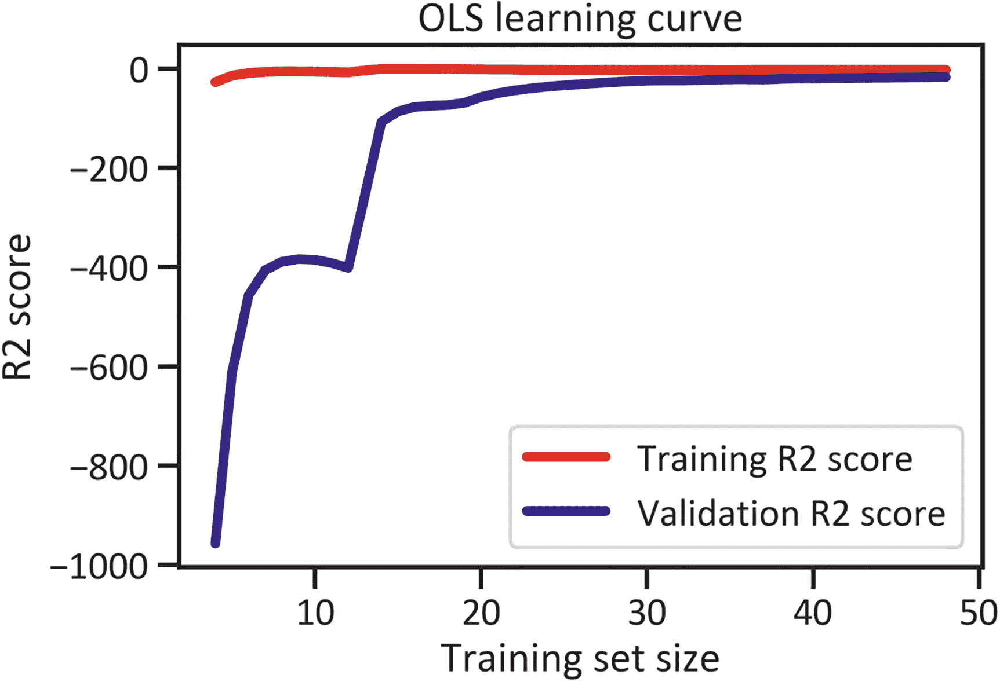

**图 2-15**  
普通最小二乘回归模型学习曲线

```
from sklearn.model_selection import learning_curve
trainsizelogreg, trainscorelogreg, testscorelogreg = learning_curve(lm, x,y,cv=5, n_jobs=-1, scoring="r2", train_sizes=np.linspace(0.1,1.0,50))
trainscorelogreg_mean = np.mean(trainscorelogreg,axis=1)
trainscorelogreg_std = np.std(trainscorelogreg,axis=1)
testscorelogreg_mean = np.mean(testscorelogreg,axis=1)
testscorelogreg_std = np.std(testscorelogreg,axis=1)
fig, ax = plt.subplots()
plt.plot(trainsizelogreg,trainscorelogreg_mean, label="Training R2 score", color="red",lw=4)
plt.plot(trainsizelogreg,testscorelogreg_mean, label="Validation R2 score",color="navy", lw=4)
plt.title("OLS learning curve")
plt.xlabel("Training set size")
plt.ylabel("R2 score")
plt.legend(loc=4)
plt.show()
```

**代码清单 2-26**  
普通最小二乘回归模型学习曲线

图 2-15 表明，在整个训练过程中，交叉验证的 R²分数始终低于训练集的 R²分数——这意味着当你进行重复测试时，训练中的 R²分数很高。在验证阶段，随着普通最小二乘回归模型接近数据中的第十个数据点，它开始难以预测美国最终消费支出的数据点。与此同时，在训练期间，回归器始终能成功预测数据点。

### 结论

本章介绍了如何应用普通最小二乘回归模型来寻找横截面数据的答案。该方法首先确定了数据点的分布，然后处理了缺失的数据点和异常值。接着，它检验了美国贷款利率（百分比）与最终消费支出（现价美元）之间的联合变异性和关联性。然后，它应用了皮尔逊相关方法，发现美国贷款利率与美国最终消费支出之间存在负相关。

随后，本章向你展示了如何使用`statsmodels`和`scikit-learn`库开发普通最小二乘回归模型。使用`statsmodels`开发的模型性能优于使用`scikit-learn`开发的模型。

